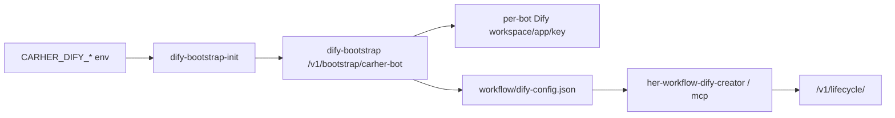

# CarHer H75/Dify Single-Her Rollout

## Overview

Use an opt-in runtime profile, not a fleet deploy. The source of truth is the live S3 hermestest image and its Dify env/config behavior; ACK must preserve Operator/Admin shape and isolate the change to one HerInstance.

This is a `carher-admin` project-local skill. Keep new H75/Dify rollout notes, scripts, diagrams, and troubleshooting evidence in `carher-admin`; treat the upstream `../CarHer` repo as a read-only code/reference source for this workflow.

When this work is part of a CarHer upgrade, load `carher-upgrade-flow` first and treat this skill as the H75/Dify specialization. Do not change source code for speed or Dify failures unless the user explicitly asks; first compare S3 runtime/profile behavior and fix deployment/config drift.

## Quick Path

1. Confirm the S3 source of truth: live image digest, labels, OpenClaw overlay ref, Hermes ref, Dify env, and generated `workflow/dify-config.json`.
2. Confirm Dify bootstrap behavior on S2 or ACK: `/healthz`, `/v1/bootstrap/carher-bot`, `/v1/lifecycle/*`, `/auto`, `/v1/exchange`. If the user mentions S3 internal Dify, use `hermestest-14` as the known-good reference before changing ACK.
3. Build or mirror a pinned H75 runtime image to ACR VPC; verify entrypoint, runtime tools, `dify-bootstrap-init`, `her-workflow-dify-*`, and release metadata.
4. Add an Operator profile gated by `carher.io/runtime-profile=h75-openclaw`; default HerInstances must render unchanged.
5. Update only the target UID through Admin API; never use normal/stable/fast group deploy for this move.
6. Run post-rollout audit plus real A2A probes; prove only the expected target set matches H75/profile/chatidfix.

### carher-1000 lessons to repeat every time

- `/data/.engine/active` is not a pass signal; require Hermes Feishu WS or OpenClaw gateway/WS readiness.
- `her-workflow-dify-creator` may not be in PATH; call `/data/.openclaw/local/bin/her-workflow-dify-creator`.
- ACK Her pods must call Dify workflow API through `dify-nginx` and lifecycle through `dify-bootstrap`; public Cloudflare URL from pod means `403/1010`.
- Dify `version: 0.3.1` import `202 pending` requires immediate confirm; use `version: 0.3.0` for simple regression DSLs.
- Compare `hermestest-75` before optimizing switch time. The target is the user-accepted 40s class, measured to real ready.

### carher-67/68 lessons to repeat before batch rollout

- S3 `hermestest-75` has Hermes Feishu dependency `lark_oapi=OK`; ACK H75 pods can miss it even when `/entrypoint.sh` hash and image tag look aligned.
- Check before `/hermes`: `/opt/hermes/.venv/bin/python3 -c 'import lark_oapi, aiohttp_socks'`.
- A hot install into `/data/.openclaw/local/hermes-python-packages` plus Deployment `PYTHONPATH` can prove the fix on the current pod, but it is not durable across a new Pod because local runtime directories may be rebuilt. Do not expand a fleet rollout on that workaround; bake the deps into the runtime image/profile.
- If Hermes Feishu WS connects but a real reply fails with LiteLLM/provider `TypeError: 'NoneType' object is not iterable`, classify Hermes as partial: channel ingress is fixed, model generation is not. Restore OpenClaw before continuing.
- If `/openclaw` from Hermes does not change the active engine, restore OpenClaw by marker/restart for that target, then debug command-detect before widening.

### 2026-06 batch H75 lessons

- Admin/profile apply can still render `CARHER_DIFY_BASE_URL=https://dify-k8s.carher.net` and `CARHER_RUNTIME_PLUGINS_REFRESH=1`; audit after rollout and harden the Deployment plus generated config before declaring the target ready.
- The durable ACK values are `CARHER_DIFY_BASE_URL=http://dify-nginx.dify.svc.cluster.local` and `CARHER_DIFY_BOOTSTRAP_URL=http://dify-bootstrap.dify.svc.cluster.local:5688/v1/bootstrap/carher-bot`.
- Keep `deployment_home_chat_id` separate from a current-operator smoke chat. Some bots are invisible to the operator and cannot be added to new regression groups; deploy-only is acceptable only when the user explicitly says so, and the report must say `not_self_tested`.
- On the latest H75 image, `CARHER_RUNTIME_PLUGINS_REFRESH=0` did not by itself reduce ACK `/hermes` or `/openclaw` switching to the 40s target; observed real-ready timing stayed around 100s+. Do not claim switch-speed success without measuring to Feishu-ready.
- If the user cancels pressure tests, do not run long-message or long-task benches and do not treat them as required gates.
- Hermes group `@` can silently no-reply when Redis group mode is missing, `owner-at`, or legacy `discussion`. The event may appear in `feishu_seen_message_ids.json` but never reach `Received raw message`. Set `group:mode:<home_chat_id>:<app_id>` to `{"mode":"group-at"}` for H75 group-smoke targets before `/hermes` validation.

## Required Guardrails

- UID guard first: refuse to mutate if the HerInstance metadata UID does not match the target.
- Use a temporary deploy group such as `beta-her-266`; do not reuse `stable` for experiments.
- Store bootstrap, ACP, gateway, and Admin credentials in Secrets only. Never write them to docs, ConfigMaps, logs, or skill examples.
- Inject Dify env only from the opt-in profile: `CARHER_DIFY_ENABLED`, base URL, bootstrap URL, workspace slug, model, and bootstrap token SecretRef.
- Keep the S3 Docker-only service names out of ACK runtime URLs; advertise Kubernetes Service DNS for A2A/ACP.
- Do not confuse public Dify URLs with Her-pod runtime URLs. A Her pod should call internal Dify for both workflow API and lifecycle on ACK: `dify-nginx` for `dify_base_url`, `dify-bootstrap` for lifecycle. Reserve `https://dify-k8s.carher.net` for human/browser entrypoints only.
- Roll back by removing the profile annotation and restoring the old image/deploy group through Admin API.
- For many-Her upgrades, prepare a manifest with `her_id`, UID, app id, bot open id, exact home chat id, current image/group/profile, target image/group/profile, and rollback values before mutating the first target.
- Freeze the wave if any target requires an undocumented current-pod fix; update this skill first, then rerun the failed target only.
- After Admin/operator apply, verify live Deployment env, pod env, and generated `workflow/dify-config.json`; patch Deployment env/runtime config if the profile rendered public Dify URLs or omitted the exact Feishu home channel.

## Dify Linkage Model



Validate both public and in-cluster paths. Public users may see `https://dify-k8s.carher.net`; Her pods should use internal services: `http://dify-nginx.dify.svc.cluster.local` for workflow API calls and `http://dify-bootstrap.dify.svc.cluster.local:5688/v1/bootstrap/carher-bot` for bootstrap/lifecycle.

### Dify URL Split: public UI vs internal Her runtime

S3 `hermestest-14` is the Dify control-plane reference:

- `CARHER_DIFY_BASE_URL=http://10.68.13.187:5680`
- `CARHER_DIFY_BOOTSTRAP_URL=http://10.68.13.187:5688/v1/bootstrap/carher-bot`
- Generated `workflow/dify-config.json` uses `lifecycle_base_url=http://10.68.13.187:5688/v1/lifecycle/<bot_id>`
- `her-workflow-dify-creator health` should get lifecycle HTTP 200.

ACK must keep the same separation with Kubernetes DNS:

- Her workflow API surface: `CARHER_DIFY_BASE_URL=http://dify-nginx.dify.svc.cluster.local`
- Bootstrap/control surface: `CARHER_DIFY_BOOTSTRAP_URL=http://dify-bootstrap.dify.svc.cluster.local:5688/v1/bootstrap/carher-bot`
- Generated lifecycle URL: `http://dify-bootstrap.dify.svc.cluster.local:5688/v1/lifecycle/<bot_id>`
- Human/browser Dify URL, if needed, is separate: `https://dify-k8s.carher.net`. Do not put it in `workflow/dify-config.json.dify_base_url` for Her runtime runs; Cloudflare can return `403` / `1010`.

If `workflow/dify-config.json` contains `lifecycle_base_url=https://dify-k8s.carher.net/v1/lifecycle/<bot_id>` and health returns Cloudflare `403` / `1010`, do not debug model, token, or Dify workspace first. Confirm the same token works against `http://dify-bootstrap.dify.svc.cluster.local:5688/v1/lifecycle/<bot_id>/health`, then fix the generated config/profile so lifecycle stays internal. Runtime emergency repair is allowed per target after backing up the file:

```bash
kubectl -n carher exec "$POD" -c carher -- sh -lc '
  f=/data/.openclaw/workflow/dify-config.json
  cp "$f" "$f.bak-lifecycle-$(date -u +%Y%m%dT%H%M%SZ)"
  python3 - <<PY
import json, os, tempfile
path="/data/.openclaw/workflow/dify-config.json"
bot=os.environ.get("CARHER_DIFY_BOT_ID") or "carher-$HER_ID"
internal=f"http://dify-bootstrap.dify.svc.cluster.local:5688/v1/lifecycle/{bot}"
st=os.stat(path)
data=json.load(open(path))
data["lifecycle_base_url"]=internal
fd,tmp=tempfile.mkstemp(prefix="dify-config.", dir=os.path.dirname(path))
with os.fdopen(fd, "w") as fh:
    json.dump(data, fh, indent=2, ensure_ascii=False)
    fh.write("\\n")
os.chmod(tmp, st.st_mode & 0o777)
os.replace(tmp, path)
print(internal)
PY
'
```

If `her-workflow-dify-creator health` shows `dify_setup_status=403`, or `publish` / `new-key` succeeds but `run` returns Cloudflare `403` / `1010`, fix `dify_base_url` too. Patch both the live config and the Deployment env so restart does not revert:

```bash
kubectl -n carher set env deployment/"carher-$HER_ID" -c carher \
  CARHER_DIFY_BASE_URL=http://dify-nginx.dify.svc.cluster.local \
  CARHER_DIFY_BOOTSTRAP_URL=http://dify-bootstrap.dify.svc.cluster.local:5688/v1/bootstrap/carher-bot
```

Back up `/data/.openclaw/workflow/dify-config.json` first, then set `dify_base_url` to `http://dify-nginx.dify.svc.cluster.local`. Success criteria: `her-workflow-dify-creator health` reports both `dify_setup_status=200` and `lifecycle_status=200`, and `her-workflow-dify-creator run` returns `status=succeeded`.

### Dify Creator import `202 pending` is a confirmation flow

Dify's current ACK/S3 DSL importer uses `CURRENT_DSL_VERSION = 0.3.0`. Importing a DSL with `version: 0.3.1` returns `202 {"status":"pending","app_id":null}` by design; it is not an async worker queue. Dify stores the pending import in Redis for 10 minutes and requires:

```bash
POST /v1/lifecycle/<bot_id>/apps/imports/<import_id>/confirm
```

There is no useful `GET /apps/imports/<id>` status endpoint in this Dify build; `404` is expected. For regression DSLs, prefer `version: 0.3.0` to get immediate `200 completed + app_id`, or immediately call `confirm` for `0.3.1`. If the pending record expired, redo the import and confirm within 10 minutes.

## Engine Switch Debugging

When `/hermes` becomes normal chat or says it cannot identify the Feishu chat:

- Check that `carher-engine-swap` is loaded and enabled in the H75 base config.
- Check runtime plugin presence before assuming command-hook failure. Legacy H75 image updates used `CARHER_RUNTIME_PLUGINS_REFRESH=1`; fast-cache/prewarm profiles can set it to `0` only when runtime plugins were already prewarmed locally.
- Check the Feishu home channel fallback annotation/env is present, but redact the value in all output.
- Search logs for "command intercepted", "swap-card started", and "active engine"; do not rely only on the chat reply.
- If the hook lacks a direct group chat id, use the target-specific runtime fallback image or patch before expanding rollout.
- If Hermes A2A returns `(No response generated)` while the endpoint is HTTP 200, run direct `hermes chat -q` in the pod. On ACK LiteLLM, `chatgpt-pro` must use `chat_completions`; `codex_responses` produced `'NoneType' object is not iterable` during the 2026-05-30 validation.

### Hermes Feishu dependency check and emergency repair

Before testing `/hermes` on any H75 target:

```bash
kubectl -n carher exec "$POD" -c carher -- \
  /opt/hermes/.venv/bin/python3 -c 'import lark_oapi, aiohttp_socks'
```

If that fails and the user allows deployment/runtime repair but not source-code changes, the current-pod proof fix is:

```bash
PY_TARGET=/data/.openclaw/local/hermes-python-packages
kubectl -n carher exec "$POD" -c carher -- env PY_TARGET="$PY_TARGET" sh -lc '
  set -e
  rm -rf "$PY_TARGET"
  mkdir -p "$PY_TARGET"
  uv pip install --target "$PY_TARGET" --link-mode=copy \
    "lark-oapi==1.5.3" "aiohttp-socks==0.11.0"
  PYTHONPATH="$PY_TARGET" /opt/hermes/.venv/bin/python3 -c "import lark_oapi, aiohttp_socks"
'
kubectl -n carher set env deployment/"carher-$HER_ID" -c carher PYTHONPATH="$PY_TARGET"
```

Important: this validates the diagnosis, but it is not a batch rollout strategy. A new Pod can lose the installed target directory. For fleet upgrades, build or select an image/profile that already contains these Hermes deps, then verify after a real rollout.

## Standard Scripts

From the `carher-admin` repo:

```bash
less docs/her266-h75-session-artifacts.md
./scripts/her266-h75/05-fetch-h75-config.sh
./scripts/her266-h75/00-upload-and-start-build.sh
./scripts/her266-h75/01-remote-status.sh
./scripts/her266-h75/20-ack-her266-ops.sh preflight
./scripts/her266-h75/20-ack-her266-ops.sh snapshot
./scripts/her266-h75/20-ack-her266-ops.sh apply-profile
./scripts/her266-h75/20-ack-her266-ops.sh upgrade
./scripts/her266-h75/20-ack-her266-ops.sh watch-verify
./scripts/her266-h75/30-post-rollout-audit.sh
./scripts/her266-h75/50-a2a-functional-probe.sh
```

For weak local networks, prefer `21-apply-ack-ops-job.sh` so long watches run inside ACK.

## Completion Bar

- Target Pod is `2/2 Running`, Feishu WS is connected, and `/hermes` plus `/openclaw` switch engines.
- Dify `/healthz`, bootstrap, generated config, workflow tools, lifecycle health, and a real create/publish/new-key/run pass through the generated config. On ACK, `dify_base_url` must be internal `dify-nginx` and lifecycle must be internal `dify-bootstrap`, not public Cloudflare.
- Full deployment audit reports exactly one H75/profile match: the target Her.
- Real A2A probes return the expected marker text; an agent card alone is not sufficient evidence.
- Rollback command is known and tested enough to restore old image and deploy group.

## Expanding To Several Users

Treat multi-user rollout as repeated single-Her rollouts with a manifest, not as a group deploy.

- Estimate 20-45 minutes for 3-5 users on the optimized path when image/operator/Dify are already prepared; use 60-90 minutes when a fixed human observation window is required.
- Snapshot each target's original image, deploy group, UID, and runtime profile annotation before mutation.
- Use waves: 1 user first, then 2 paired users for A2A, then 3-5 users, then 10-20 users only after hard gates pass.
- If the user explicitly chooses deployment-only or smoke-only, still deploy every target from the manifest, but run only representative smokes and mark untested targets clearly.
- Give each user a temporary deploy group such as `beta-h75-<id>` unless there is an approved wave group.
- Roll back per user by restoring the recorded image/group/profile. Expect Pod recreation and Feishu WS reconnect; do not promise zero interruption.
- After every wave, audit that H75/profile appears only on the target set.
- Treat Deployment Ready as an early signal only. Functional readiness may lag by several minutes while Dify tools and OpenClaw extensions are prepared.
- Do not widen if `/hermes` only reaches active marker but not Feishu WS, if `/openclaw` cannot return from Hermes, or if Hermes WS connects but model replies fail.
- After any Hermes test, restore and smoke OpenClaw for every target before declaring the wave complete.

For ACK and internal Compose together, use `scripts/her266-h75/40-fast-gray-rollout.sh`. ACK rollback restores annotation plus Admin image/group. Compose rollback removes the temporary override file and restarts the original compose service. If the confirmed issue is shared across environments, freeze expansion and roll back every changed target from the same manifest.
