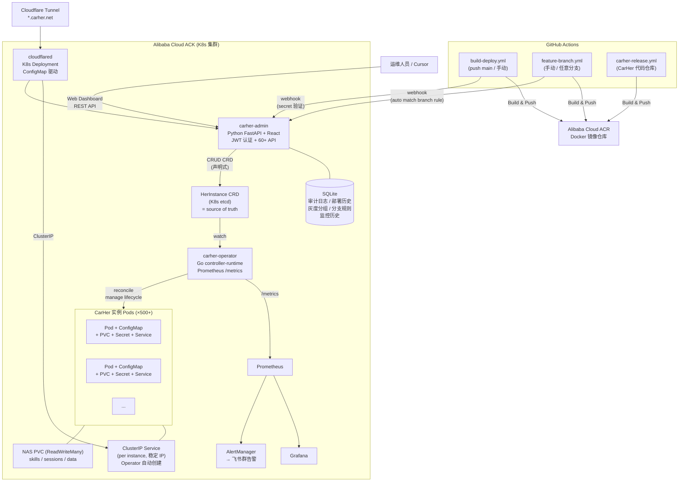
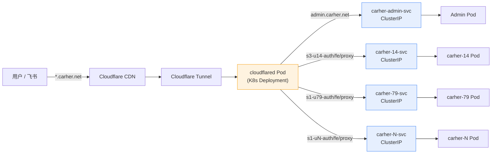
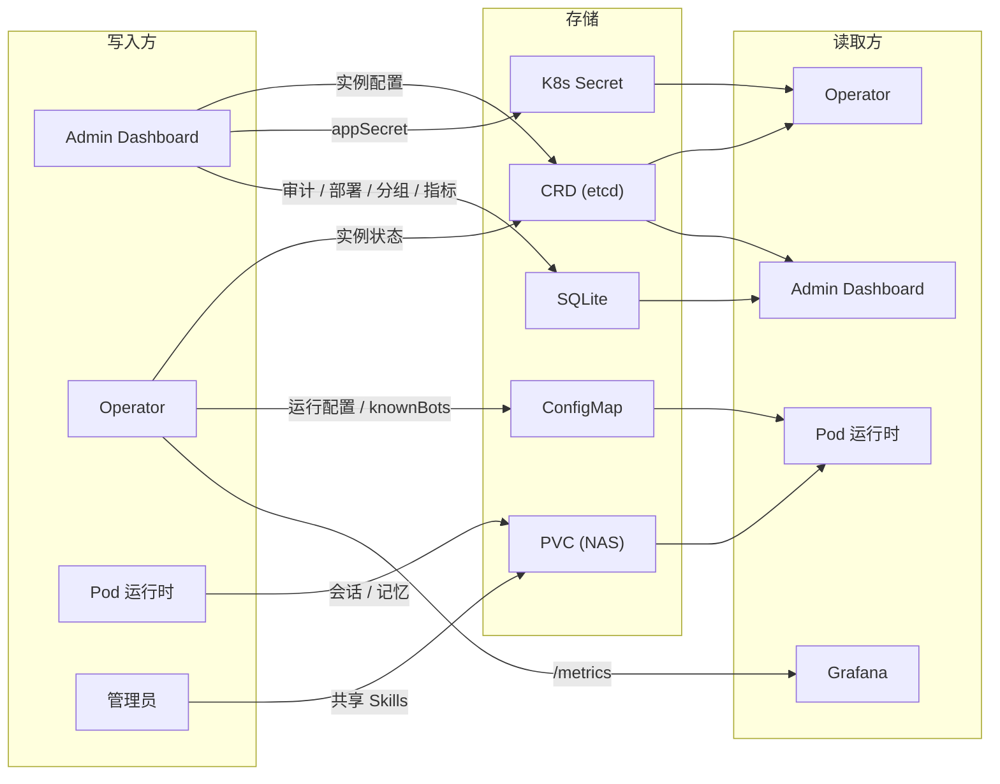
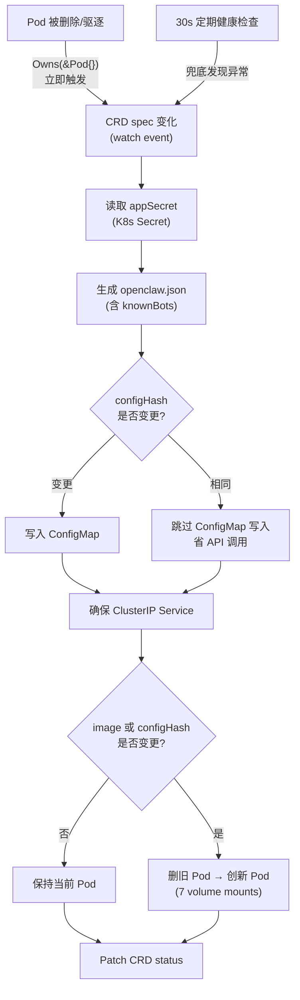
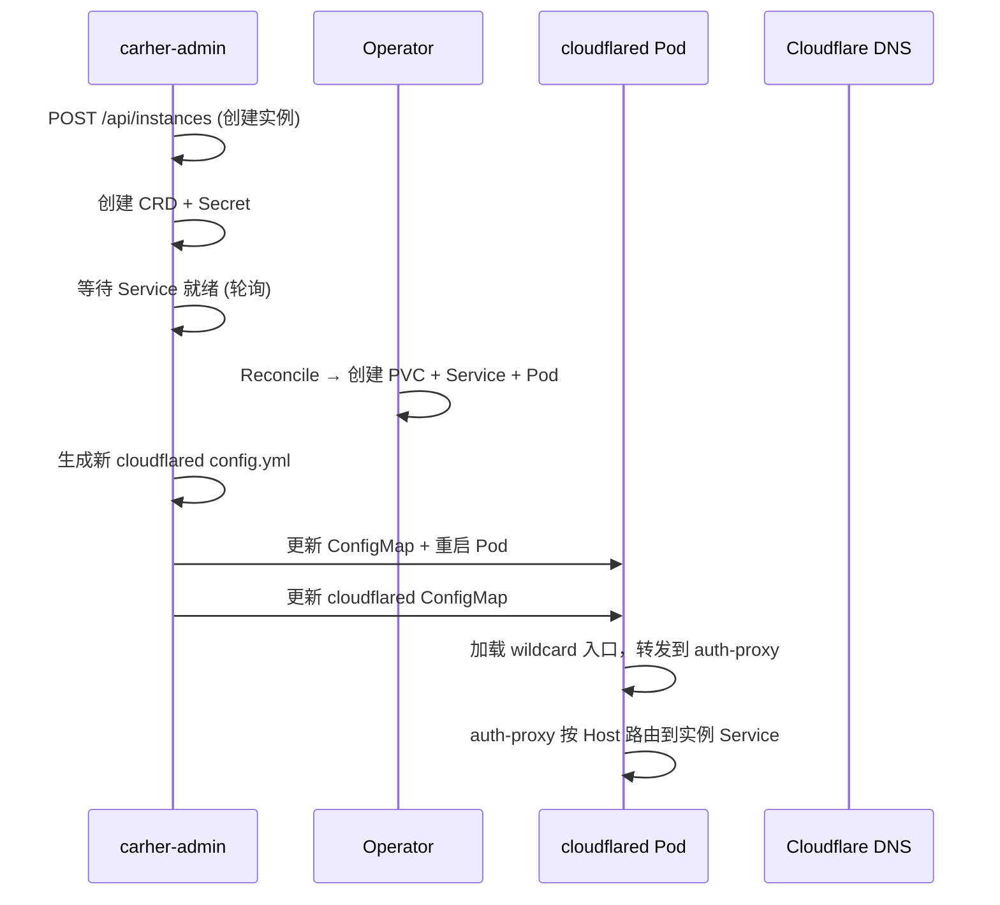
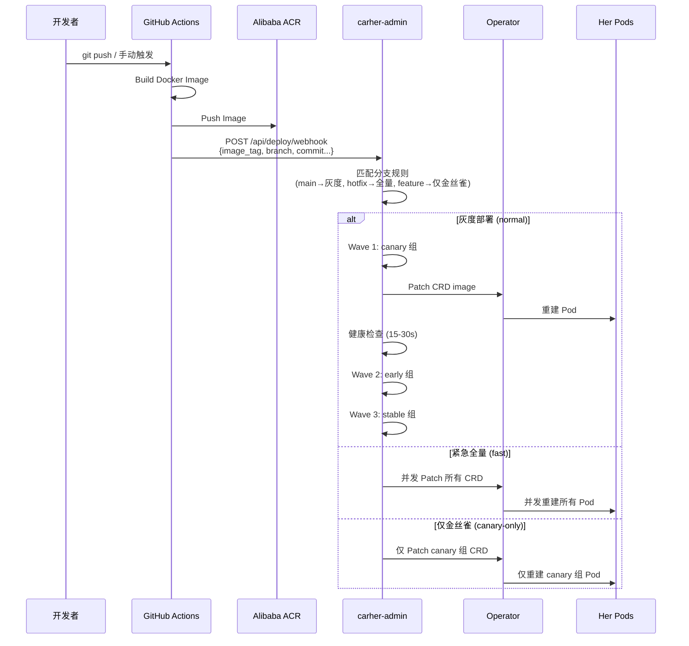
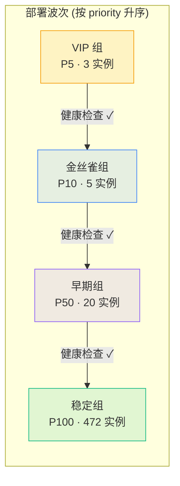
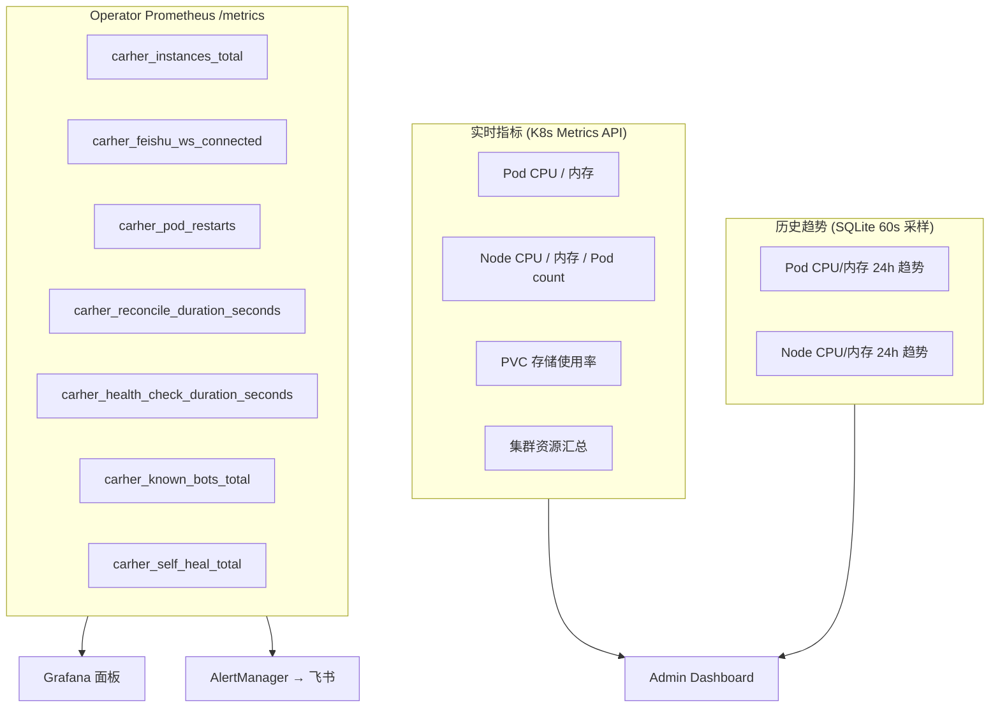
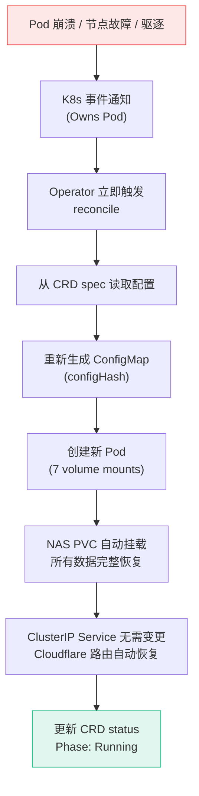

# CarHer Admin — 企业级 Her 实例管理平台

管理 500+ CarHer (飞书 AI 助手) 实例的全生命周期：声明式管理、自动自愈、灰度部署、实时监控。

## 系统架构



### 网络架构



**关键设计**: Pod IP 随重启变化，但 ClusterIP Service 保持稳定。cloudflared 路由到 Service ClusterIP，Pod 重建时**零配置变更**。

### 数据流



### 数据存储明细

| 数据 | 存储位置 | 写入方 | 读取方 |
|------|---------|--------|--------|
| 实例配置 (name, model, appId…) | HerInstance CRD (etcd) | Admin Dashboard | Operator |
| 实例状态 (phase, feishuWS…) | CRD status | Operator | Admin Dashboard |
| appSecret | K8s Secret (加密) | Admin / 迁移工具 | Operator |
| knownBots (全局 bot 注册表) | 共享 ConfigMap (1 份) | Operator | 各实例 Pod |
| 每实例运行配置 | per-user ConfigMap | Operator | 各实例 Pod |
| 用户数据 (记忆/会话) | PVC `carher-{uid}-data` (NAS 20Gi) | Pod 运行时 | Pod 运行时 |
| Skills (全员共享) | NAS PVC `carher-shared-skills` (ReadWriteMany) | 管理员 | 各实例 Pod |
| Skills (部门共享) | NAS PVC `carher-dept-skills` (ReadWriteMany) | 管理员 | 各实例 Pod |
| Session 日志 | NAS PVC `carher-shared-sessions` (ReadWriteMany, 按 uid 子目录) | Pod 运行时 | Pod 运行时 |
| 审计日志 + 部署历史 + 分支规则 | SQLite (hostPath + NAS 备份) | Admin API | Admin Dashboard |
| 监控指标历史 | SQLite `metrics_history` 表 (60s 采样) | Admin 后台线程 | Admin Dashboard |
| 实时监控指标 | Prometheus | Operator /metrics | Grafana |
| 灰度分组配置 | SQLite `deploy_groups` 表 | Admin API | 部署编排器 |
| Cloudflare 隧道配置 | K8s ConfigMap `cloudflared-config` | Admin API | cloudflared Pod |
| Cloudflare 隧道凭证 | K8s Secret `cloudflared-credentials` | 管理员 | cloudflared Pod |

## 八大功能模块

### 1. carher-admin — Web Dashboard + API

**技术栈**: Python 3.12 FastAPI + React + Vite + Tailwind CSS + SQLite

| 功能模块 | 功能 |
|----------|------|
| 仪表盘 | 集群 CPU/内存/存储概览、节点资源分布、Pod 统计、Her 资源汇总 |
| 实例管理 | 列表/搜索/详情/配置编辑、生命周期操作、Pod 日志、K8s Events |
| 新增/导入 | 表单创建 (自动 CRD + Service + Cloudflare DNS)、JSON 批量导入 |
| 部署管理 | 灰度/紧急全量/仅首组/指定分组，回滚、中止、波次恢复 |
| CI/CD 集成 | GitHub Actions 触发构建、分支规则自动匹配、Workflow 选择器、构建状态展示 |
| 灰度分组 | 自定义分组 CRUD + 实例分配、按 priority 排序部署 |
| 监控指标 | 实时 Pod/Node CPU+内存、PVC 存储、历史趋势 (Sparkline) |
| 系统设置 | GitHub Token/仓库、Webhook 密钥、Cloudflare 同步、系统管理 |

### 2. carher-operator (Go) — 核心引擎

**技术栈**: Go 1.23 + controller-runtime + Prometheus client



| 功能 | 说明 | 性能 |
|------|------|------|
| Reconcile | CRD spec → PVC + Service + ConfigMap + Pod，事件驱动 | 多 goroutine 并发 |
| Owns(&Pod{}) + Owns(&Service{}) | Pod/Service 变更 → 立即触发 reconcile | 秒级自愈 |
| ownerReferences | Pod + Service 关联到 CRD，K8s GC 自动清理 | 无需手动 |
| ClusterIP Service | 每实例自动创建 Service，Cloudflare 不再依赖 Pod IP | 零运维 |
| ConfigMap hash 跳过 | hash 相同时不写 ConfigMap | 500 实例省 500 次调用 |
| 自愈 | Pod 消失 → 立即重建，NAS volume 完整恢复 | SelfHeal 仅首次计数 |
| 健康检查 | Container Ready + CrashLoop + 重启次数 | 可配 worker (默认 50) |
| knownBots | 共享 ConfigMap，仅 config 变更时重建 | 消除 O(N²) |
| Config Hash | 只在配置变更时重建 Pod + 写 ConfigMap | 避免无谓重启 |
| Status 更新 | Patch 替代 Update，减少 conflict | 高并发安全 |
| 指标清理 | 实例删除时移除 Prometheus label | 防止基数膨胀 |
| Leader Election | 多副本 HA (2 replicas) | 内置 |
| /metrics | 7 个 Prometheus 指标 | controller-runtime v0.20 |

### 3. Cloudflare Tunnel — 自动化网络接入

**技术栈**: cloudflared K8s Deployment + ConfigMap + Admin API 联动



| 组件 | 说明 |
|------|------|
| cloudflared Deployment | K8s 托管，自动重启，不依赖宿主机 |
| ConfigMap `cloudflared-config` | Admin 自动生成，仅维护 `admin.carher.net` 与 `*.carher.net` 两类稳定入口 |
| Secret `cloudflared-credentials` | Tunnel 凭证 + Origin Cert |
| ClusterIP Service | Operator 自动创建，Pod 重建不影响路由 |
| Host 路由 | `auth-proxy` 按 `{prefix}-u{uid}-auth/fe/proxy.carher.net` 解析 uid 并转发到实例 Service |
| POST /api/cloudflare/sync | 手动触发 cloudflared ConfigMap + 远程 tunnel ingress 全量同步 |

### 4. CI/CD — GitHub Actions + 分支规则



两条 Workflow + Web 端触发构建：

| Workflow | 触发方式 | 用途 |
|----------|---------|------|
| `build-deploy.yml` | push main / `workflow_dispatch` | 正式构建 + 自动灰度部署 |
| `feature-branch.yml` | `workflow_dispatch` (任意分支) | Feature branch 快速验证 |
| `carher-release.yml` | push dev/main / `workflow_dispatch` | CarHer 代码仓库构建 |

**分支规则** — Webhook 自动匹配，决定部署模式：

| 分支模式 | 部署模式 | 自动部署 | 说明 |
|---------|---------|---------|------|
| `main` | 灰度 (normal) | 是 | 正式发布，逐组灰度 |
| `hotfix/*` | 紧急全量 (fast) | 是 | 热修复，跳过灰度直接全量 |
| `feature/*` | 仅金丝雀 (canary-only) | 否 | 仅构建，手动决定是否部署到金丝雀 |

分支规则可通过 Admin Dashboard 的 "分支规则" 面板自由增删改。

### 5. 灰度部署分组



| 功能 | 说明 |
|------|------|
| 自定义分组 | 任意名称 (如 `vip`, `test`, `team-a`)，每个分组有 priority 值 |
| 部署顺序 | 按 priority 从小到大逐组部署，每组之间自动健康检查 |
| 内置分组 | `canary` (P10) → `early` (P50) → `stable` (P100)，可自由增删改 |
| 实例分配 | 支持单个/批量将实例移入分组 |
| 前端管理 | Dashboard 可视化创建/删除分组、分配实例、编辑 priority/描述 |
| `stable` 保护 | `stable` 组不可删除，删除其他组时实例自动回归 stable |
| 波次恢复 | `continue` 从暂停的波次恢复，不重放已完成波次 |

### 6. 监控指标



| 告警 | 条件 | 严重性 |
|------|------|--------|
| FeishuDisconnected | 单实例断开 5min | warning |
| MassDisconnect | >10 实例断开 2min | critical |
| HighRestarts | 重启 >5 次 | warning |
| HealthCheckSlow | 健康检查 >60s | warning |
| SelfHealSpike | 自愈率 >0.1/s | critical |

### 7. 安全机制

| 层面 | 机制 | 说明 |
|------|------|------|
| 登录认证 | JWT (JSON Web Token) | 用户名密码登录，Token 有效期 24h，所有 API 需携带 Bearer Token |
| Webhook 认证 | `DEPLOY_WEBHOOK_SECRET` | GitHub Actions webhook 独立密钥验证 |
| CORS | 可配白名单 | `CORS_ALLOW_ORIGINS` 环境变量，默认仅 `admin.carher.net` |
| Pod Exec | 命令白名单 | 仅允许 `ls`/`cat`/`grep`/`ps` 等诊断命令 (500 字符上限) |
| Secret 存储 | K8s Secret | appSecret 不存 CRD (明文)，通过独立 Secret 注入 |
| 容器运行 | 非 root 用户 | Dockerfile 使用 `carher` 用户运行 |
| Agent 安全 | dry_run + 确认 | 破坏性操作需确认，批量 >10 先汇报计划 |
| 数据安全 | PVC 独立于 Pod | 删除 Pod 不删数据，仅 purge=true 才清理 PVC |

### 8. 自愈数据连续性



| 数据类别 | 存储方式 | 跨节点恢复 | 说明 |
|---------|---------|-----------|------|
| 用户会话/记忆 | PVC `carher-{uid}-data` (NAS) | **是** | 独立 PVC，Pod 重建后自动挂载 |
| 运行配置 | ConfigMap (Operator 管理) | **是** | 从 CRD spec 实时生成 |
| appSecret | K8s Secret | **是** | etcd 存储 |
| 全员 Skills | NAS PVC `carher-shared-skills` | **是** | ReadWriteMany，所有节点共享 |
| 部门 Skills | NAS PVC `carher-dept-skills` | **是** | ReadWriteMany |
| Session 日志 | NAS PVC `carher-shared-sessions` | **是** | 按 uid 子目录隔离 |
| knownBots | 共享 ConfigMap | **是** | Operator 定期重算 |
| Feishu OAuth Token | PVC 内 `/data/.openclaw/credentials/` | **是** | 随用户数据 PVC |
| 网络路由 | ClusterIP Service (Operator 管理) | **是** | Service IP 稳定，Pod 重建后自动路由 |

**关键设计**: 所有共享 PVC 统一使用 `alibabacloud-cnfs-nas` StorageClass (`ReadWriteMany`)，确保 Pod 无论调度到哪个节点都能读到完整数据。ClusterIP Service 确保 Pod 重建后 Cloudflare 路由零中断。

### Pod + Service 资源详情

每个 HerInstance CRD 由 Operator 自动管理以下 K8s 资源：

| 资源 | 名称模式 | 说明 |
|------|---------|------|
| Pod | `carher-{uid}` | 运行实例，ownerRef → CRD |
| Service | `carher-{uid}-svc` | ClusterIP，ownerRef → CRD，5 端口 |
| PVC | `carher-{uid}-data` | NAS 20Gi，无 ownerRef (保留数据) |
| ConfigMap | `carher-{uid}-user-config` | openclaw.json 配置 |
| Secret | `carher-{uid}-secret` | appSecret |

Service 端口映射:

| 端口 | 名称 | 用途 |
|------|------|------|
| 18789 | gateway | OpenClaw Gateway |
| 18790 | realtime | 实时语音 |
| 8000 | frontend | Web 前端 |
| 8080 | ws-proxy | WebSocket 代理 |
| 18891 | oauth | Feishu OAuth 回调 |

### Pod Volume 挂载详情

| Volume | 类型 | 挂载路径 | 说明 |
|--------|------|---------|------|
| `user-data` | PVC `carher-{uid}-data` | `/data/.openclaw` | 用户私有数据 |
| `user-config` | ConfigMap `carher-{uid}-user-config` | `/data/.openclaw/openclaw.json` | 运行配置 |
| `base-config` | ConfigMap `carher-base-config` | `/data/.openclaw/carher-config.json` | 共享基础配置 |
| `gcloud-adc` | Secret `carher-gcloud-adc` | `/gcloud/application_default_credentials.json` | GCloud 认证 |
| `shared-skills` | PVC `carher-shared-skills` (NAS) | `/data/.openclaw/skills` | 全员共享 skills |
| `dept-skills` | PVC `carher-dept-skills` (NAS) | `/data/.agents/skills` | 部门共享 skills |
| `user-sessions` | PVC `carher-shared-sessions` (NAS) | `/data/.openclaw/sessions` | Session 日志 |

## 项目结构

```
carher-admin/
├── backend/                     # Python FastAPI 后端
│   ├── main.py                 # API 路由 (60+, JWT 认证, 非阻塞)
│   ├── agent.py                # AI 运维 Agent (LLM → 工具调用)
│   ├── database.py             # SQLite (schema v7, 含 settings 表)
│   ├── deployer.py             # 灰度部署编排器 (动态 wave, 波次恢复)
│   ├── metrics.py              # K8s Metrics API (Pod/Node/PVC/集群)
│   ├── crd_ops.py              # CRD 操作 (admin → K8s API)
│   ├── k8s_ops.py              # 直接 K8s 操作 (legacy 兼容)
│   ├── cloudflare_ops.py       # Cloudflare Tunnel 配置管理
│   ├── config_gen.py           # openclaw.json 配置生成
│   ├── sync_worker.py          # 后台同步 + NAS 备份
│   ├── models.py               # Pydantic 模型 (含 OpenAPI schema)
│   └── requirements.txt
├── frontend/                    # React + Vite + Tailwind
│   └── src/
│       ├── api.js              # API 客户端 (JWT, 超时 30s)
│       ├── App.jsx             # 主应用 (URL query 同步 tab)
│       └── components/
│           ├── Dashboard.jsx    # 仪表盘 + 集群/节点资源
│           ├── InstanceList.jsx # 实例列表 + 搜索
│           ├── InstanceDetail.jsx # 实例详情 + 指标
│           ├── DeployPage.jsx   # 部署 + 分组 + CI/CD + 分支规则 + GitHub Actions 状态
│           ├── AddInstance.jsx  # 新增实例
│           ├── BatchImport.jsx  # 批量导入
│           ├── HealthCheck.jsx  # 健康检查
│           ├── SettingsPage.jsx # 系统设置 (GitHub/Webhook/ACR)
│           ├── AdminPanel.jsx   # 系统管理
│           ├── LoginPage.jsx    # 登录页
│           └── LogViewer.jsx    # Pod 日志查看
├── operator-go/                 # Go Operator (500+ 规模)
│   ├── api/v1alpha1/types.go   # CRD 类型 + DeepCopy
│   ├── internal/
│   │   ├── controller/
│   │   │   ├── reconciler.go   # Reconcile + ensureService + ensurePVC
│   │   │   ├── health.go       # 并发健康检查
│   │   │   ├── known_bots.go   # knownBots 管理
│   │   │   ├── config_gen.go   # 配置生成
│   │   │   └── config_gen_test.go
│   │   └── metrics/metrics.go  # Prometheus 指标
│   ├── cmd/main.go             # 入口
│   ├── Dockerfile
│   ├── go.mod / go.sum
│   └── README.md
├── operator/                    # Python kopf Operator (旧版, 已废弃)
├── k8s/                         # K8s 部署清单
│   ├── crd.yaml
│   ├── rbac.yaml
│   ├── deployment.yaml
│   ├── operator-rbac.yaml
│   ├── operator-deployment.yaml
│   ├── shared-pvcs.yaml
│   └── servicemonitor.yaml
├── .github/workflows/
│   ├── build-deploy.yml
│   └── feature-branch.yml
├── .cursor/skills/
│   └── carher-admin-api/SKILL.md
├── Dockerfile
└── deploy.sh
```

## API 参考

> **OpenAPI Schema**: `GET /openapi.json`
>
> **Swagger UI**: `GET /docs` | **ReDoc**: `GET /redoc`
>
> **认证**: 所有 API 需 JWT Bearer Token（`POST /api/auth/login` 获取）或 `X-API-Key` header。Webhook 使用独立的 `DEPLOY_WEBHOOK_SECRET`。

### 认证

| Method | Path | Description |
|--------|------|-------------|
| POST | `/api/auth/login` | 登录获取 JWT (body: `{username, password}`) |
| GET | `/api/auth/me` | 当前登录用户信息 |

### 实例管理

| Method | Path | Description |
|--------|------|-------------|
| GET | `/api/instances` | 列出所有实例 (含 Pod 运行状态) |
| GET | `/api/instances/search` | 搜索 — 按 status/model/deploy_group/owner/name/feishu_ws 过滤 |
| GET | `/api/instances/:id` | 实例详情 (含 PVC 状态, knownBots 计数) |
| POST | `/api/instances` | 创建实例 (自动 CRD + Service + Cloudflare DNS) |
| PUT | `/api/instances/:id` | 修改配置 (name/model/owner/provider/prefix/deploy_group) |
| DELETE | `/api/instances/:id?purge=false` | 删除实例 (purge=true 同时删除 PVC) |
| POST | `/api/instances/:id/stop` | 停止 (删 Pod, 保留数据) |
| POST | `/api/instances/:id/start` | 启动 |
| POST | `/api/instances/:id/restart` | 重启 |
| GET | `/api/instances/:id/logs?tail=200` | Pod 日志 |
| GET | `/api/instances/:id/events` | K8s Events |
| GET | `/api/instances/:id/config-preview` | 配置预览 |
| GET | `/api/instances/:id/config-current` | 当前配置 |
| POST | `/api/instances/:id/exec` | Pod Exec (白名单命令) |
| POST | `/api/instances/batch` | 批量操作 |
| POST | `/api/instances/batch-import` | 批量导入（推荐 `{"instances":[...]}`，兼容旧裸数组 body） |
| PUT | `/api/instances/:id/deploy-group` | 设置部署分组 |
| POST | `/api/instances/batch-deploy-group` | 批量设置分组 |

### 监控指标

| Method | Path | Description |
|--------|------|-------------|
| GET | `/api/metrics/overview` | 集群概览 (CPU/内存/节点/Her 汇总) |
| GET | `/api/metrics/nodes` | 各节点 CPU/内存/Pod 数 |
| GET | `/api/metrics/pods` | 各 Pod CPU/内存实时值 |
| GET | `/api/metrics/storage` | PVC 存储状态 |
| GET | `/api/instances/:id/metrics` | 单实例 CPU/内存实时值 |
| GET | `/api/instances/:id/metrics/history?hours=24` | 单实例指标历史趋势 |
| GET | `/api/metrics/history/nodes?hours=24` | 节点指标历史趋势 |

### 灰度部署

| Method | Path | Description |
|--------|------|-------------|
| POST | `/api/deploy` | 启动部署 (mode: normal/fast/canary-only/group:NAME) |
| GET | `/api/deploy/status` | 当前部署状态 (wave_order, 各组计数, 进度) |
| POST | `/api/deploy/continue` | 继续 (从暂停波次恢复) |
| POST | `/api/deploy/rollback` | 回滚 |
| POST | `/api/deploy/abort` | 中止 |
| GET | `/api/deploy/history?limit=20` | 部署历史 (含 CI 元数据) |
| POST | `/api/deploy/webhook` | GitHub Actions 自动触发 |
| GET | `/api/deploy-groups` | 列出分组 |
| POST | `/api/deploy-groups` | 创建分组 |
| PUT | `/api/deploy-groups/:name` | 修改分组 |
| DELETE | `/api/deploy-groups/:name` | 删除分组 |

### CI/CD 集成

| Method | Path | Description |
|--------|------|-------------|
| GET | `/api/branch-rules` | 列出分支规则 |
| POST | `/api/branch-rules` | 创建分支规则 |
| PUT | `/api/branch-rules/:id` | 修改分支规则 |
| DELETE | `/api/branch-rules/:id` | 删除分支规则 |
| POST | `/api/branch-rules/test?branch=` | 测试分支匹配 |
| POST | `/api/ci/trigger-build` | 触发 GitHub Actions 构建（需传 `workflow`） |
| GET | `/api/ci/workflows?repo=` | 列出仓库可用 Workflow |
| GET | `/api/ci/branches?repo=` | 列出仓库分支 |
| GET | `/api/ci/runs?repo=&per_page=10` | 最近 GitHub Actions 构建状态 |

### Cloudflare Tunnel

| Method | Path | Description |
|--------|------|-------------|
| POST | `/api/cloudflare/sync` | 同步 cloudflared ConfigMap，并补齐 Cloudflare 远程 tunnel ingress |

### 系统设置

| Method | Path | Description |
|--------|------|-------------|
| GET | `/api/settings` | 获取所有设置 (密钥值脱敏) |
| PUT | `/api/settings` | 更新设置 (GitHub Token, Webhook Secret 等) |
| GET | `/api/settings/repos` | 获取已配置的 GitHub 仓库列表 |

### CRD 直查

| Method | Path | Description |
|--------|------|-------------|
| GET | `/api/crd/instances` | 列出所有 CRD (spec + status) |
| GET | `/api/crd/instances/:uid` | 单个 CRD 详情 |

### 系统

| Method | Path | Description |
|--------|------|-------------|
| GET | `/api/status` | 集群状态 |
| GET | `/api/stats` | 统计汇总 |
| GET | `/api/health` | 全量健康检查 |
| GET | `/api/known-bots` | knownBots 注册表 |
| GET | `/api/next-id` | 下一个可用 ID |
| POST | `/api/sync/force` | 强制全量同步 |
| GET | `/api/sync/check` | 一致性检查 |
| GET | `/api/audit?instance_id=&limit=50` | 审计日志 |
| POST | `/api/import-from-k8s` | 从 ConfigMap 导入 |
| POST | `/api/backup` | 手动备份 |

### AI 运维 Agent

| Method | Path | Description |
|--------|------|-------------|
| POST | `/api/agent` | 自然语言运维 (body: `{message, dry_run?}`) |
| GET | `/api/agent/capabilities` | Agent 能力清单 |

## HerInstance CRD Schema

### spec (期望状态, 用户写入)

| 字段 | 类型 | 默认值 | 说明 |
|------|------|--------|------|
| `userId` | integer | (必填) | 实例唯一 ID |
| `name` | string | (必填) | 用户名 |
| `model` | string | `opus` | 模型 (gpt / sonnet / opus / gemini) |
| `appId` | string | (必填) | 飞书 App ID |
| `appSecretRef` | string | `carher-{uid}-secret` | K8s Secret 名 |
| `prefix` | string | `s1` | 服务器前缀 |
| `owner` | string | `""` | 飞书用户 open_id (竖线分隔) |
| `provider` | string | `wangsu` | AI 提供商 |
| `botOpenId` | string | `""` | 飞书 Bot Open ID |
| `deployGroup` | string | `stable` | 灰度分组 |
| `image` | string | `v20260328` | 镜像 tag |
| `paused` | boolean | `false` | true 时不维护 Pod |

### status (运行状态, Operator 写入)

| 字段 | 类型 | 说明 |
|------|------|------|
| `phase` | string | Pending / Running / Failed / Stopped / Paused |
| `podIP` | string | Pod IP |
| `node` | string | 所在节点 |
| `restarts` | integer | 重启次数 |
| `feishuWS` | string | Connected / Disconnected / Unknown |
| `memoryDB` | boolean | 记忆库是否存在 |
| `lastHealthCheck` | string | 最近健康检查时间 |
| `message` | string | 附加信息 |
| `configHash` | string | ConfigMap 内容 hash |

## 本地开发

```bash
# Backend
cd backend
pip install -r requirements.txt
CARHER_ADMIN_DB_DIR=/tmp/carher-admin CARHER_ADMIN_BACKUP_DIR=/tmp/carher-admin-bak \
  uvicorn backend.main:app --reload --port 8900

# Frontend (另一个终端)
cd frontend
npm install
npm run dev

# Go Operator 单元测试
cd operator-go
go test ./internal/controller/ -v
```

## 部署到 K8s

```bash
# 一键部署
./deploy.sh

# 或分步：
kubectl apply -f k8s/crd.yaml                  # 1. CRD
kubectl apply -f k8s/shared-pvcs.yaml           # 2. 共享 NAS PVC
kubectl apply -f k8s/operator-rbac.yaml         # 3. Operator RBAC (含 services 权限)
kubectl apply -f k8s/operator-deployment.yaml   # 4. Go Operator
kubectl apply -f k8s/rbac.yaml                  # 5. Admin RBAC (含 deployments/configmaps/secrets)
kubectl apply -f k8s/deployment.yaml            # 6. Admin Dashboard
kubectl apply -f k8s/servicemonitor.yaml        # 7. Prometheus 监控

# 配置 admin 认证密钥
kubectl create secret generic carher-admin-secrets -n carher \
  --from-literal=deploy-webhook-secret=YOUR_WEBHOOK_SECRET \
  --from-literal=admin-api-key=YOUR_ADMIN_API_KEY \
  --from-literal=admin-username=admin \
  --from-literal=admin-password=YOUR_PASSWORD \
  --from-literal=cloudflare-api-token=YOUR_CLOUDFLARE_API_TOKEN \
  --from-literal=github-token=YOUR_GITHUB_PAT

# 部署 cloudflared (Cloudflare Tunnel)
kubectl create secret generic cloudflared-credentials -n carher \
  --from-file=credentials.json=TUNNEL_CREDENTIALS.json \
  --from-file=cert.pem=ORIGIN_CERT.pem
# cloudflared ConfigMap 和 Deployment 由 admin 或 deploy.sh 自动管理
```

## RBAC 权限矩阵

### Operator (ClusterRole: carher-operator)

| 资源 | 权限 | 说明 |
|------|------|------|
| herinstances, herinstances/status | 全部 | CRD 管理 |
| pods, pods/log, pods/exec | 全部 | Pod 生命周期 |
| services | 全部 | 自动创建 ClusterIP Service |
| configmaps | 全部 | 配置管理 |
| persistentvolumeclaims | get/list/watch/create/delete | PVC 管理 |
| secrets | get/list/watch | 读取 appSecret |
| events | create/patch | 事件记录 |
| leases | 全部 | Leader Election |

### Admin (Role: carher-admin, namespace: carher)

| 资源 | 权限 | 说明 |
|------|------|------|
| herinstances, herinstances/status | 全部 | CRD CRUD |
| pods, pods/log, pods/exec | 全部 | Pod 操作 |
| services | get/list/watch | 读取 Service ClusterIP |
| configmaps | 全部 | cloudflared ConfigMap 管理 |
| secrets | get/list/create/update/patch/delete | appSecret 管理 |
| persistentvolumeclaims | get/list/watch/create/delete | PVC 管理 |
| deployments | get/list/watch/patch | cloudflared 重启 |

## 使用 HerInstance CRD

```bash
# 查看所有实例
kubectl get her -n carher
# NAME     USER   NAME   MODEL   PHASE     FEISHU      GROUP    IMAGE
# her-14   14     张三    gpt     Running   Connected   stable   dev-bd6a40ca

# 新增实例 (推荐通过 Admin Dashboard)
kubectl apply -f - <<EOF
apiVersion: carher.io/v1alpha1
kind: HerInstance
metadata:
  name: her-301
  namespace: carher
spec:
  userId: 301
  name: "新用户"
  model: gpt
  appId: cli_xxx
  prefix: s1
  deployGroup: canary
EOF

# 更新镜像
kubectl patch her her-14 -n carher --type merge -p '{"spec":{"image":"v20260329"}}'

# 暂停实例
kubectl patch her her-14 -n carher --type merge -p '{"spec":{"paused":true}}'

# 移动到 VIP 灰度组
kubectl patch her her-14 -n carher --type merge -p '{"spec":{"deployGroup":"vip"}}'
```

## AI 运维 Agent

内嵌的 AI Agent 支持自然语言操作集群（中英文）：

```bash
# 查询
curl -X POST https://admin.carher.net/api/agent \
  -H "Authorization: Bearer YOUR_JWT" \
  -d '{"message":"当前有多少实例在运行？飞书断连的有哪些？"}'

# 操作
curl -X POST https://admin.carher.net/api/agent \
  -H "Authorization: Bearer YOUR_JWT" \
  -d '{"message":"把用户 14 移到 VIP 组"}'

# Dry run
curl -X POST https://admin.carher.net/api/agent \
  -H "Authorization: Bearer YOUR_JWT" \
  -d '{"message":"重启所有飞书断连的实例","dry_run":true}'
```

| 类别 | 示例 |
|------|------|
| 查询 | "当前集群状态" "查看实例 14 详情" "有哪些飞书断连的" |
| 生命周期 | "重启实例 25" "停止所有 Failed 的实例" |
| 部署 | "部署 v20260329 到金丝雀组" "查看当前部署状态" |
| 分组 | "把 14 移到 VIP 组" "创建 test 分组 优先级 5" |
| 诊断 | "分析 carher-25 的日志" "为什么 14 号飞书断连了" |

## 环境变量

| 变量 | 组件 | 说明 |
|------|------|------|
| `ADMIN_USERNAME` | admin | 登录用户名 (K8s Secret 注入) |
| `ADMIN_PASSWORD` | admin | 登录密码 (K8s Secret 注入) |
| `ADMIN_API_KEY` | admin | API Key (替代 JWT 的 X-API-Key 认证) |
| `DEPLOY_WEBHOOK_SECRET` | admin | GitHub webhook 验证密钥 |
| `GITHUB_TOKEN` | admin | GitHub PAT (触发构建 + 读取分支/Workflow) |
| `CORS_ALLOW_ORIGINS` | admin | CORS 白名单 (默认 `https://admin.carher.net`) |
| `FEISHU_DEPLOY_WEBHOOK` | admin | 飞书群 webhook URL (部署通知) |
| `DEPLOY_HEALTH_WAIT_CANARY` | admin | 金丝雀健康检查等待秒数 (默认 30) |
| `DEPLOY_HEALTH_WAIT` | admin | 普通波次健康检查等待秒数 (默认 15) |
| `AGENT_LLM_API_KEY` | admin | AI Agent LLM API Key |
| `AGENT_MODEL` | admin | LLM 模型名 (默认 openai/gpt-4o) |
| `DEPLOY_BATCH_SIZE` | admin | 部署批次大小 (默认 50) |
| `DEPLOY_USE_CRD` | admin | 是否使用 CRD 部署 (默认 true) |
| `HEALTH_CHECK_WORKERS` | operator | 并发健康检查 goroutine 数 (默认 50) |
| `CARHER_ADMIN_DB_DIR` | admin | SQLite 存储路径 |
| `CARHER_ADMIN_BACKUP_DIR` | admin | NAS 备份路径 |

## GitHub Secrets

在 https://github.com/guangzhou/carher-admin/settings/secrets/actions 配置 (Repository Secrets)：

| Secret | 说明 |
|--------|------|
| `ACR_USERNAME` | 阿里云 ACR 登录用户名 (新加坡 ACR) |
| `ACR_PASSWORD` | 阿里云 ACR 登录密码 (新加坡 ACR) |
| `DEPLOY_WEBHOOK_SECRET` | 与 K8s Secret 中值一致 |

> **注意**: 必须配置为 **Repository Secrets**，不是 Environment Secrets。

## 性能优化记录

### Go Operator

| 优化 | 原问题 | 改进 | 影响 |
|------|--------|------|------|
| Owns(&Pod{}) + Owns(&Service{}) + ownerRef | Pod 删除后等 30s 才发现 | 立即触发 reconcile | 自愈 30s → 秒级 |
| ensureService (ClusterIP) | Pod IP 变化导致 Cloudflare 路由断裂 | 稳定 ClusterIP | 消除手动运维 |
| ConfigMap hash 跳过 | 每次都写 ConfigMap | hash 相同跳过 | 省 500 次 API 调用/轮 |
| knownBots 按需重建 | 每次 reconcile 都重建 | 仅 configHash 变更时 | 大幅减少写入 |
| resolveImage/resolvePrefix | 空值 mismatch → 无限重建 | 统一默认值 | 消除循环 bug |
| 指标清理 | 删除后 label 永留 | 删除时清理 | 防基数膨胀 |
| SelfHealTotal 去重 | 每 30s 都递增 | 仅首次计数 | 指标准确 |
| Dockerfile 层缓存 | go.mod 变动重下所有依赖 | 单独 COPY + ldflags | 构建 -40% |

### Python Admin

| 优化 | 原问题 | 改进 | 影响 |
|------|--------|------|------|
| health() 读 CRD status | 逐 Pod exec (O(N)) | 单次 list CRD | 1000+ → 1 次调用 |
| cloudflare_ops 自动化 | 手动更新 cloudflared config | 自动 ConfigMap + DNS | 新实例零配置 |
| backup 去抖 | 每次 DB 写后复制 NAS | dirty flag + flush | 不再批量触发 |
| deployer 并发 | 串行部署 | asyncio.gather | 速度 10x |
| knownBots TTL 缓存 | 每请求都 collect | 15s TTL | 消除 O(N) |
| K8s client 单例 | 每次创建新 client | singleton | 减少连接开销 |
| 分页 API | 全量返回 | offset + limit | 首屏加载快 |
| 前端轮询分离 | 5s 重载全量 | 只拉 status | 流量 -80% |

## 扩展到 10+ 服务器节点

当前架构（3 节点 ACK）已为 500+ 实例设计。扩展到 10+ 节点时：

### 无需修改

| 组件 | 原因 |
|------|------|
| Go Operator | 事件驱动 reconcile，Leader Election HA |
| NAS PVC | `ReadWriteMany`，跨节点自动挂载 |
| HerInstance CRD | K8s etcd 存储，节点数无关 |
| ClusterIP Service | 自动路由到 Pod，节点无关 |
| cloudflared (K8s Deployment) | 已容器化，自动调度 |
| Prometheus + AlertManager | ServiceMonitor 自动发现 |
| CI/CD Pipeline | 与节点数无关 |

### 建议改进

| 改进项 | 当前状态 | 建议 | 优先级 |
|--------|---------|------|--------|
| Admin DB (SQLite) | hostPath + nodeSelector | 迁移到 NAS PVC | **高** |
| HEALTH_CHECK_WORKERS | 默认 50 | 按实例数调整 (instances/10) | 中 |
| Pod 反亲和 | 无 | 关键实例添加 podAntiAffinity | 低 |
| 节点 taint/toleration | 无 | 专用节点池隔离 | 低 |

### 容量估算

| 资源 | 3 节点 (当前) | 10 节点 |
|------|-------------|---------|
| Her 实例 | ~500 | ~1500–2000 |
| Operator replicas | 2 | 2 (不变) |
| NAS 容量 | 1TB | 2–3TB |
| 健康检查周期 | ~10s | ~10s (调 workers 至 150) |
| Prometheus series | 3500 | 14000 |
