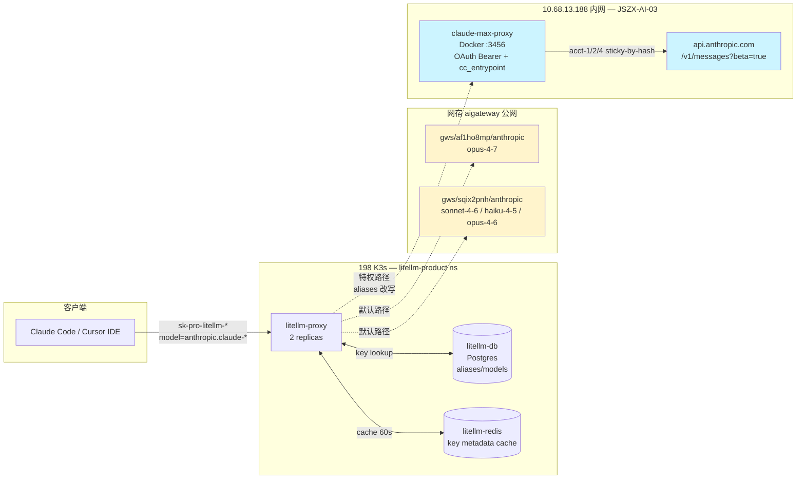
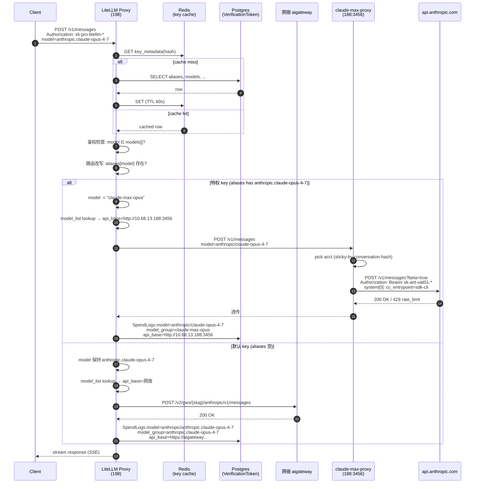
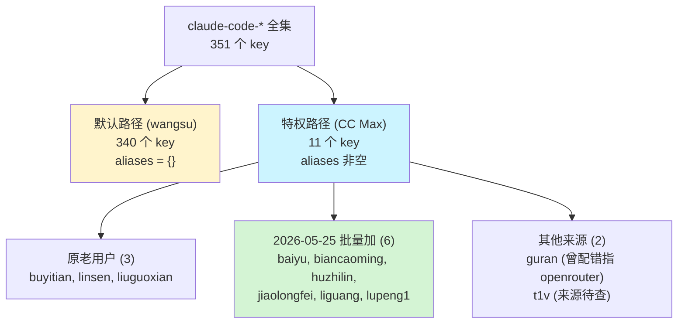

# 198 prod — CC Max 特权 vs 默认 wangsu 路由对比

> 范围:198 prod LiteLLM (litellm-product namespace) 上的 `claude-code-*` virtual key。
> 最后更新:2026-05-25。状态:11 个特权 key 已对齐 baseline,340 个默认 key 未动。

---

## 背景

198 prod (cc.auto-link.com.cn/pro) 是公司内部 Claude/ChatGPT/Gemini 共享网关。LiteLLM 充当统一入口,根据 key 配置把流量分发到不同 upstream。

历史上 `anthropic.claude-*` 全部走 **网宿 aigateway** (官方 Anthropic API 转售,$5/M input + $25/M output,按量付费)。2026-05-22 起逐步把一小批用户切到 **CC Max** (Claude Max 20× $200/月订阅账户池,套利效果 8-15×)。

切换机制是 **per-key `aliases` JSONB 字段做请求改写**,客户端零感知:同一个 `model: anthropic.claude-opus-4-7` 在不同 key 上路由到不同 upstream。

---

## 目标

1. **明确两类用户的请求生命周期差异**,任何运维操作前先看自己在哪条线上。
2. **沉淀 baseline-key 对齐法**作为漂移修复 + 批量扩容的标准工序。
3. **暴露 CC Max 池的撞顶失败模式**,避免误判为 alias 配错。

---

## 架构对比 — 两条物理路径



| 维度 | 默认路径 (网宿) | 特权路径 (CC Max) |
|---|---|---|
| 触发条件 | `aliases = '{}'::jsonb` | `aliases` 含 `anthropic.claude-* → claude-max-*` |
| Upstream | `aigateway.edgecloudapp.com/v2/gws/{slug}/anthropic` | `http://10.68.13.188:3456` → `api.anthropic.com` |
| 鉴权 | WANGSU_DIRECT_API_KEY (token) | acct-1/2/4 OAuth `sk-ant-oat01-*` (sticky-by-hash) |
| 计费 | 按 Anthropic 官方 list × 网宿加价 | $200/月 Max 订阅平摊 (典型 8-15× 套利) |
| 配额 | 网宿合同上限 | 5h 滚动窗口 ~220k tok + 7d 周窗口 ~24-40h Opus |
| 模型可见性 | LiteLLM model_list: `anthropic.claude-opus-4-7` etc. | 同上 + `claude-max-{opus,sonnet,haiku}` |
| 故障域 | 公网 + 网宿合同 | 188 内网 + Anthropic 账户共享池 |
| 漂移风险 | 低 (340 个 key 全空 aliases) | 高 (aliases 字段无审计日志,易被应急清空) |

---

## 请求生命周期对比



**关键差异点**:
- **步骤 ⑥-⑦**:`aliases` 改写发生在鉴权之后、路由之前,**只是 model 名字替换**,请求体其它字段(messages, system, tools)完全不变。
- **步骤 ⑫ vs ⑭**:SpendLogs.model 字段差异是判断流量去向的唯一可靠依据。
  - 特权成功:`anthropic/claude-opus-4-7` (upstream model,无双重 `anthropic.` 前缀)
  - 默认成功:`anthropic/anthropic.claude-opus-4-7` (provider 前缀 `anthropic/` + LiteLLM model 名 `anthropic.claude-opus-4-7`)
  - **特权失败**:`claude-max-sonnet` + model_group/api_base 都空 = alias 已改写但 CC Max 路由失败(撞顶等)

---

## 当前账户集合 (2026-05-25 实测)



| key_alias | owner | 加入时间 | 备注 |
|---|---|---|---|
| `claude-code-buyitian` | 82ca6346 (buyitian) | 老用户 | **baseline-key**, 7d 数据完整, 用作对齐 source of truth |
| `claude-code-linsen-rg9t` | linsen | 老用户 | |
| `claude-code-liuguoxian-50gj` | liuguoxian | 老用户 | 2026-05-25 13:38 被应急清空, 后恢复对齐 buyitian |
| `claude-code-baiyu-tlrn` | baiyu | 2026-05-25 | |
| `claude-code-biancaoming-x36t` | biancaoming (sammy) | 2026-05-25 | |
| `claude-code-huzhilin-0wj3` | huzhilin (GTR) | 2026-05-25 | 当前活跃度最高的 CC Max 用户 |
| `claude-code-jiaolongfei-dxux` | jiaolongfei | 2026-05-25 | |
| `claude-code-liguang-n33k` | liguang | 2026-05-25 | |
| `claude-code-lupeng1-5t0d` | lupeng1 | 2026-05-25 | 因 sonnet 撞顶曾被清空, 后恢复对齐 buyitian |
| `claude-code-guran-v5li` | guran | 历史 | 历史配错指 OpenRouter, 2026-05-25 修正对齐 buyitian |
| `claude-code-t1v` | t1v | 历史 | 来源未查清, 配置已对齐 baseline |

---

## Baseline-key 对齐法 (标准工序)

**核心思想**:不在 SQL 里写 JSON 字面量。永远从 baseline key (`claude-code-buyitian`) 用 `UPDATE ... FROM SELECT` 复制 `aliases + models` 过去。

### 操作 1 — 给一个或多个 key 开 CC Max (扩容 / 修漂移 / 恢复应急清空)

```bash
jms ssh AIYJY-litellm "kubectl exec -n litellm-product litellm-db-0 -- psql -U litellm -d litellm -c \"
UPDATE \\\"LiteLLM_VerificationToken\\\" t
SET aliases = b.aliases, models = b.models
FROM (SELECT aliases, models FROM \\\"LiteLLM_VerificationToken\\\"
      WHERE key_alias='claude-code-buyitian') b
WHERE t.key_alias IN ('claude-code-NAME1-xxxx', 'claude-code-NAME2-yyyy')
RETURNING t.key_alias, t.aliases = b.aliases AS aliases_ok, array_length(t.models,1) AS model_count;
kubectl exec -n litellm-product litellm-redis-0 -- redis-cli FLUSHDB\""
```

`RETURNING aliases_ok=t` 直接给布尔验证,省一次回查。FLUSHDB 必做,Redis cache TTL 60s 不显式清也行但稳妥起见跑一下。

### 操作 2 — 全集群审计找漂移

```sql
SELECT key_alias, metadata->>'owner_name' AS owner,
       aliases = (SELECT aliases FROM "LiteLLM_VerificationToken"
                  WHERE key_alias='claude-code-buyitian') AS aligned,
       array_length(models, 1) AS model_count,
       aliases
FROM "LiteLLM_VerificationToken"
WHERE key_alias LIKE 'claude-code-%'
  AND aliases != '{}'::jsonb
ORDER BY aligned, key_alias;
```

`aligned=f` 的 key 即漂移,跑操作 1 修。**2026-05-25 首跑审计发现 2 个漂移 (guran→openrouter / lupeng1→空) 一条 SQL 修完**。

### 操作 3 — 撤销某 key 的 CC Max (回退到默认 wangsu)

```sql
UPDATE "LiteLLM_VerificationToken"
SET aliases = '{}'::jsonb
WHERE key_alias = 'claude-code-NAME-xxxx';
```

`models[]` 可不动 (claude-max-* 还在白名单里也无害, 没 alias 改写就不会路由过去)。**FLUSHDB 仍必做**。

### 操作 4 — 验证流量已切

```sql
SELECT
  CASE WHEN api_base LIKE '%10.68.13.188:3456%' THEN 'CC Max'
       WHEN api_base LIKE '%aigateway%' THEN 'wangsu'
       ELSE 'failure' END AS route,
  model_group, status, count(*) AS calls,
  min("startTime") AS first, max("startTime") AS last
FROM "LiteLLM_SpendLogs"
WHERE "startTime" > NOW() - INTERVAL '3 hours'
  AND "user" = 'claude-code-NAME'
GROUP BY 1,2,3 ORDER BY first;
```

成功标志:**一段时间点之后(改完时刻) route 列只剩 `CC Max` 或 `failure`,没有 `wangsu`**。还有 `wangsu` 行 = 改完前的尾巴 OR alias 漂移,跑操作 2 自查。

---

## 故障模式速查

| 现象 | 真因 | 处置 |
|---|---|---|
| SpendLogs 出现 `model=claude-max-sonnet`, model_group/api_base 都空, status=failure | **失败痕迹不是配错**;alias 改写后 CC Max 路由失败(撞顶居多),记录的是改写后的 model 名 | 看 `cc-max-upstream-status.sh` 哪个 acct 撞顶,撞顶就摘掉或等 reset。**不要清 aliases** |
| 某用户 100% 失败,其他人正常 | 该用户重度用 sonnet,而 sonnet 池 acct-2 已 80%+ 7d。别人混着用 opus/haiku 看不出来 | 临时切回 wangsu 走操作 3,池子恢复后再操作 1 恢复 |
| 改完 aliases 后 SpendLogs 仍有 wangsu | (a) 客户端那次请求在 UPDATE 时刻之前发的 (b) aliases 漂移没真改成功 | 操作 2 跑审计,`aligned=f` 跑操作 1 |
| 全员 502 (含 CC Max 和 wangsu) | 198 LiteLLM proxy 挂或 ConfigMap 错 | 跳出本 doc,走 `litellm-pro-ops` skill |
| 单 acct 一直 429 (CC Max 内部) | 5h/7d 配额耗尽 | `cc-max-upstream-status.sh` 看撞顶就摘掉等 reset |

---

## 相关材料

- [[anthropic-max-litellm]] skill — CC Max 完整生命周期 (OAuth onboard / 续期 / 多账号扩容 / Team 共享池坑)
- [[cc-max-quota-monitor]] skill — 上游配额监控
- [[litellm-pro-ops]] skill — 198 prod LiteLLM 通用运维
- [[feedback_litellm_key_aliases_for_routing]] memory — aliases ≠ models 的认知错位
- [[feedback_baseline_key_alignment_for_config_drift]] memory — 漂移修复用 baseline 不用字面量
- `docs/claude-max-cli-proxy.md` — claude-max-proxy 透明代理的反向工程过程
- `scripts/anthropic-onboard/claude-max-grant-key.sh` — 单 key 操作的 wrapper (本质 = baseline 法的简化版)
- `scripts/anthropic-onboard/cc-max-upstream-status.sh` — 上游配额一键查
