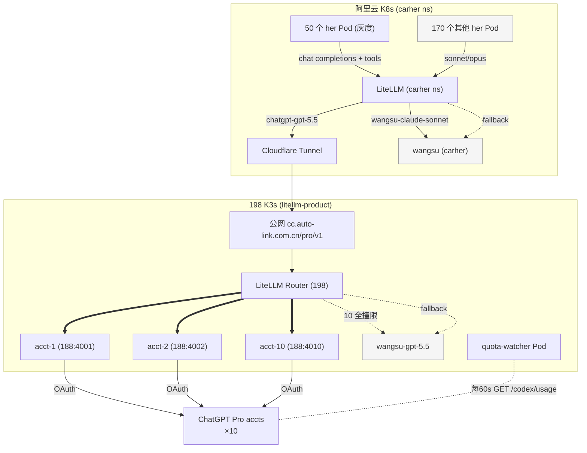
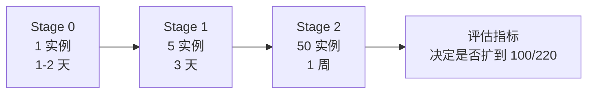

# CarHer 主程序切 ChatGPT Pro gpt-5.5 灰度方案

**状态**：调研完成，待用户拍板进入实施
**日期**：2026-05-17
**版本**：v1（基于阿里云 carher / 198 LiteLLM / 188 chatgpt / CarHer 源码 + dev 端到端实测的完整调研）
**范围**：10 账号 + 50 实例灰度，wangsu 兜底

---

## Quick Reference（一页速查）

### 架构

```
50 个 her 实例 → carher LiteLLM ──► 198 LiteLLM ──► 188 chatgpt ×10 ──► ChatGPT Pro ×10
                       │                  │
                       │ fallback         │ fallback
                       ▼                  ▼
                wangsu-claude-sonnet  wangsu-gpt-5.5
                  (终极兜底)            (中间兜底)
```

双层 fallback：用户 ToS 风险自担时也不会真停服。

### 5 步实施顺序

| # | 改动 | 位置 |
|---|------|------|
| 1 | `config_gen.py` 加 `gpt-5.5` 别名映射 | carher-admin |
| 2 | docker-compose up 9 个新容器（端口 4002-4010）| 188 |
| 3 | 扩 model_list 到 10 deployment + cooldown/retries/usage-based-routing | 198 prod |
| 4 | 加 `chatgpt-gpt-5.5` model_list + fallback to wangsu-sonnet | aliyun carher ns |
| 5 | quota-watcher 最小版（cron + python，监控 10 账号 weekly%）| 198 |

### 灰度节奏（12 天）

| 阶段 | 时间 | 实例数 | Gate 条件 |
|------|------|--------|-----------|
| Stage 0 | Day 1-2 | 1 个沙盒 | 200 OK ≥ 99%，p95 < 30s，无 tool 解析错误 |
| Stage 1 | Day 3-5 | 5 低活跃 | 5 实例并发不互扰，无账号 weekly > 30% |
| Stage 2 | Day 6-12 | 50 中活跃（每天 10）| 14 天无账号撞 weekly 90%，成功率 ≥ 99.5% |

### 容量算账

| 维度 | 数字 |
|---|---|
| 50 实例 5h 峰值 | ~2,500 calls |
| 10 账号 5h 容量 | 32,000 messages |
| **5h 余量** | **~13x** |
| Promo 退坡后 (5-31) | 仍 3-6x 余量，wangsu 自然吸收 |
| 单账号 weekly 估算 | 36,000 calls/week，富余 7x |

### 一行紧急回滚（5 秒全实例切回 sonnet）

```bash
kubectl -n carher get herinstance -o json \
  | jq -r '.items[] | select(.spec.model == "gpt-5.5") | .metadata.name' \
  | xargs -I{} kubectl -n carher patch herinstance {} --type merge \
      -p '{"spec":{"model":"sonnet"}}'
```

operator reconcile 5s 内全部生效。

### Pre-flight 第一件事

跑「附 A 探针脚本」确认 `/codex/usage` endpoint 可访问（quota-watcher 命脉）。

---

## 0. 决策摘要

| 项 | 值 |
|---|---|
| 目标 | 把 50 个 her 实例主模型从 `sonnet`（Claude Sonnet 4.6）切到 `gpt-5.5`（ChatGPT Pro GPT-5.5）|
| ChatGPT Pro 账号数 | **10 个**（含现网 acct-1，新增 9 个）|
| 灰度实例数 | **50 个**（中等活跃 50-200 calls/day 的实例池里挑）|
| 兜底 | LiteLLM fallback chain `chatgpt-gpt-5.5 → wangsu-gpt-5.5` |
| ToS 风险 | 用户自担（封号 → 全实例切回 wangsu，5s 内）|
| Promo 退坡（2026-05-31）| 用 wangsu fallback 自然吸收，不主动扩账号 |
| 协议改造 | 零代码改动（LiteLLM `chatgpt/` provider 内置 chat completions ↔ /responses 转换）|

---

## 1. 调研三大事实（决策依据）

### 1.1 协议链路 — ✅ 可切，零代码改动

**实测证据**（dev 环境 `https://cc.auto-link.com.cn/dev/v1/chat/completions`）：
- chat completions + tools 数组 + stream 请求 → **标准 OpenAI `tool_calls` 增量 SSE**
- LiteLLM v1.84.0 的 `chatgpt/` provider 自动 transform 到 Codex `/responses`
- pi-ai `openai-completions.js` 解析路径零改动可用
- ⚠️ 唯一不一致：`finish_reason="stop"` 而非 `"tool_calls"`，但 pi-ai 用「tool_calls 数组非空」判定，**不踩**

### 1.2 gpt-5.5 能力 — ⚠️ 部分可行

| 维度 | carher 需求 | gpt-5.5 实测 | 判定 |
|---|---|---|---|
| Tool calling（并发 + 多轮）| ✅ 高频 | ✅ 完整支持 | OK |
| Stream tool_calls 增量 | 必须 | ✅ 标准 | OK |
| Context 200k tokens | p95 200k | ✅ 实测 OK | OK（单条 message <1MB chars）|
| 10 并发 | 单实例不并发 | ✅ 不互踢 | OK |
| 非流式 | OpenClaw 默认 stream | ❌ HTTP 500 | **必须强制 stream** |
| Prompt cache | Anthropic 端命中 60% | ⚠️ 不稳定（3 次 1 miss）| **token 量翻倍** |
| Rate limit headers | LiteLLM SpendLogs | ❌ 无 x-codex-\* 暴露 | **盲飞，须 quota-watcher** |
| Reasoning 文本 | 不展示思考 | ⚠️ 只有计数无文本 | 不影响 |
| 多模态 image | 部分图片场景 | ✅ 支持 | OK |

### 1.3 容量精算（50 实例 + 10 账号是否够）

| 维度 | 数据 |
|---|---|
| carher 24h 活跃实例 | 121 / 220 |
| 50 实例（中等活跃 50-200 bucket）日 calls 估算 | ≈ 50 × 150 = **7,500/day** |
| 折合 5h 窗口 ~1,600 calls | 工作日下午峰值约 2,500 calls/5h |
| 10 账号 promo 期总容量 | 10 × 3,200 = **32,000 messages/5h** |
| **5h 余量** | **~13x**（极充裕）|
| 50 实例周流量 ≈ 52,500 calls/week | 分摊 10 账号 = 5,250/account |
| 单账号 weekly cap 保守估算 | ~36,000 calls/week |
| **Weekly 余量** | **~7x**（充裕）|
| Promo 结束（5-31）容量减半 | **仍有 3-6x 余量**，可吸收 |
| Prompt cache 失效成本 | token 量翻倍 → 推理时间翻倍 → 容量打 50% 折扣后**仍 3-7x 富余** |

**结论**：50 实例 + 10 账号在 promo 期和退坡后**都有富余**，是稳健灰度规模。

---

## 2. 整体架构



**链路解读**：
1. 50 个灰度实例的请求经 carher ns LiteLLM 走 `chatgpt-gpt-5.5` model
2. 该 model 通过 Cloudflare Tunnel → 公网 `cc.auto-link.com.cn/pro/v1` → 198 prod LiteLLM
3. 198 prod LiteLLM 用 usage-based-routing 在 10 个 acct 间路由
4. 任何一层撞限/失败 → 自动 fallback 到 wangsu-claude-sonnet-4-6（aliyun 内 wangsu 通道）

---

## 3. 5 步落地（含每步验证）

### Step 1 — carher-admin 加 `gpt-5.5` 别名映射

**改动文件**：`backend/config_gen.py`

```python
# 当前
PROVIDER_MODEL_MAP = {
    "openrouter": {
        "sonnet": "openrouter/anthropic/claude-sonnet-4.6",
        "opus": "openrouter/anthropic/claude-opus-4.6",
        "gpt": "openrouter/openai/gpt-5.4",
    },
    "wangsu": {
        "sonnet": "wangsu/claude-sonnet-4-6",
        "opus": "wangsu/claude-opus-4-6",
        # 新增
        "gpt-5.5": "wangsu-gpt-5.5",   # ← fallback 直连
    },
    "litellm": {
        "sonnet": "litellm/claude-sonnet-4-6",
        "opus": "litellm/claude-opus-4-6",
        # 新增
        "gpt-5.5": "litellm/chatgpt-gpt-5.5",   # ← 走 carher LiteLLM 转到 198
    },
}
```

**model 别名清单同步**（前端 UI / models.js）：

```javascript
{id: "gpt-5.5", name: "GPT-5.5 (ChatGPT Pro)", api: "openai-completions",
 reasoning: true, input: ["text", "image"], contextWindow: 400000, maxTokens: 128000,
 cost: {input: 0, output: 0, cacheRead: 0}}  // 订阅制，单次成本归零
```

**验证**：
```bash
cd /Users/Liuguoxian/codes/carher-admin
python -m pytest backend/tests/test_config_gen.py -v -k "gpt-5.5"
```

写一个测试用例确认 `provider=litellm, model_alias=gpt-5.5` 映射到 `litellm/chatgpt-gpt-5.5`。

### Step 2 — 188 加 9 个 chatgpt 容器

参考 `docs/chatgpt-pro-10-accounts-architecture.md` §5 Phase 1，docker-compose 上 9 个新容器（端口 4002-4010），每个绑独立 auth.json。

**前置**：10 个 ChatGPT Pro $200 账号的 auth.json 全部就位 `/Data/chatgpt-auth/acct-{1..10}/auth.json`。

**验证**：
```bash
ssh cltx@10.68.13.188 'for p in 4001 4002 4003 4004 4005 4006 4007 4008 4009 4010; do
  curl -sS http://localhost:$p/health 2>&1 | grep -q "healthy" && echo "$p OK" || echo "$p FAIL"
done'
```

### Step 3 — 198 prod LiteLLM 扩 model_list + router_settings

每个 chatgpt-\* 模型扩到 10 条同名 deployment，加 router_settings：

```yaml
router_settings:
  routing_strategy: usage-based-routing-v2
  cooldown_time: 300
  num_retries: 2
  allowed_fails: 3
  enable_tag_filtering: true
  fallbacks:
    - chatgpt-gpt-5.5: [wangsu-gpt-5.5]
    - chatgpt-gpt-5.4: [wangsu-gpt-5.4]
```

**验证**：
```bash
# 198 上跑 4 步回归测试
curl -sS -N https://cc.auto-link.com.cn/pro/v1/chat/completions \
  -H "Authorization: Bearer $PROD_KEY" \
  -d '{"model":"chatgpt-gpt-5.5","messages":[{"role":"user","content":"ping"}],"stream":true}' \
  | head -5
```

### Step 4 — 阿里云 carher LiteLLM 加 chatgpt-gpt-5.5 model_list + fallback

**改动**：`carher` ns 的 `litellm-config` ConfigMap

```yaml
model_list:
# 新增
- model_name: chatgpt-gpt-5.5
  litellm_params:
    model: openai/chatgpt-gpt-5.5
    api_base: https://cc.auto-link.com.cn/pro/v1
    api_key: os.environ/CARHER_TO_198_KEY      # ← 新 secret
  model_info:
    id: aliyun-carher-to-198-chatgpt-5.5
    mode: responses

# 现有 wangsu-gpt-5.5 已存在，无需新加（来自之前 chatgpt 接入）

router_settings:
  # 现有 fallback 不动，加一条
  fallbacks:
    - chatgpt-gpt-5.5:
      - wangsu-claude-sonnet-4-6    # ← 第一兜底（语义相近）
      - openrouter-claude-sonnet-4-6  # ← 第二兜底
```

**为什么 fallback 到 sonnet 不是 wangsu-gpt-5.5**：
- carher 跨网链路（aliyun → 198 → 188 → OpenAI）延迟 + 故障域大
- 当 chatgpt 完全不可用时，**用户场景是「her bot 必须有回复」**，sonnet 是当前主力，最稳
- wangsu-gpt-5.5 在 carher ns 现在也是 chatgpt 容器走通后的产物，独立性不如 sonnet

**前置 secret**：
```bash
# 在 198 prod 建一个专给 carher 用的 key（避免共用 cursor key）
# alias: aliyun-carher-bridge
# allowlist: chatgpt-gpt-5.5, chatgpt-gpt-5.4, chatgpt-gpt-5.3-codex, chatgpt-gpt-5.3-codex-spark
# budget: 无限（订阅制）
# tpm/rpm: 不设限（依赖 198 router cooldown）
kubectl -n carher create secret generic carher-to-198-bridge \
  --from-literal=CARHER_TO_198_KEY=sk-...
```

**验证**：
```bash
# 阿里云 carher ns 内 pod 跑
kubectl exec -n carher deploy/litellm-proxy -- \
  curl -sS http://localhost:4000/v1/chat/completions \
  -H "Authorization: Bearer $CARHER_MK" \
  -d '{"model":"chatgpt-gpt-5.5","messages":[{"role":"user","content":"ping"}],"stream":true}' \
  | head -3
```

### Step 5 — quota-watcher 部署（轻量版）

**位置**：198 K3s `litellm-product` ns 单 Pod，SQLite 持久化

参考 `docs/chatgpt-pro-10-accounts-architecture.md` §5 Phase 3 详细设计。本灰度阶段简化为：
- 每 60s poll 10 个账号的 `/codex/usage`
- 飞书告警：weekly ≥ 75% 提醒、≥ 90% 高危
- **不接管 LiteLLM 调度**（让 LiteLLM 自己 cooldown）
- 50 实例阶段流量小，主要价值是「监控可视化 + 提前预警」

**最小可用版**：先写一个 cron 脚本（10 行 bash + 30 行 python），跑通后再 k8s 化。

---

## 4. 三阶段灰度



### Stage 0：单实例 PoC（Day 1-2）

**选实例**：找一个**低风险沙盒实例**（owner = 你自己/团队成员），不是真实用户。
- 候选：通过 `kubectl get herinstance -n carher | grep -i test\|sandbox\|dev` 或新建一个

**改动**：
```bash
# 改 HerInstance CRD 的 model 字段
kubectl -n carher patch herinstance her-xxx --type merge -p '{"spec":{"model":"gpt-5.5"}}'
# operator reconcile 后 ~5s 内 pod 重启，生效
kubectl -n carher get pod -l her=her-xxx -w
```

**观察 24-48h**：
- [ ] tool calling 成功率（pi-ai 二轮 tool_result 能否正常）
- [ ] stream chunk 解析无报错（grep pod logs）
- [ ] 长 prompt（>50k tokens）能否过
- [ ] 飞书 bot 回复延迟 vs 切前 baseline
- [ ] LiteLLM SpendLogs 错误率（status != 200）
- [ ] 是否触发 fallback 到 wangsu-claude-sonnet

**Stage 0 Gate**（不通过则不进 Stage 1）：
- 200 OK 率 ≥ 99%
- p95 latency < 30s（vs sonnet baseline ~10-15s）
- 无 tool calling 解析错误
- 无 stream 截断

### Stage 1：5 低活跃实例（Day 3-5）

**选 5 个实例**：
```sql
-- 找日 calls 10-30 之间的 carher-* 实例
SELECT vt.key_alias, COUNT(*) AS calls
FROM "LiteLLM_SpendLogs" sl
JOIN "LiteLLM_VerificationToken" vt ON sl.api_key = vt.token
WHERE sl."startTime" > NOW() - INTERVAL '24 hours'
  AND vt.key_alias LIKE 'carher-%'
GROUP BY 1 HAVING COUNT(*) BETWEEN 10 AND 30
ORDER BY 2 LIMIT 5;
```

**改动**：
```bash
for i in <5 实例 id>; do
  kubectl -n carher patch herinstance her-$i --type merge -p '{"spec":{"model":"gpt-5.5"}}'
done
```

**新增观察点**（Stage 0 全 +）：
- [ ] 5 实例并发不互相干扰（看 198 SpendLogs 是否均匀分布到 acct-1~10）
- [ ] quota-watcher 数据连续 72h 无 gap
- [ ] 10 账号的 primary/weekly used_percent 增长曲线

**Stage 1 Gate**：
- 5 实例 200 OK 率全部 ≥ 99%
- 没有任一账号 weekly > 30%（保证 Stage 2 加 10x 不会撞）
- 飞书消息复盘没有「her 没回 / her 回错」用户投诉

### Stage 2：50 中活跃实例（Day 6-12）

**选实例**：
```sql
SELECT vt.key_alias FROM "LiteLLM_VerificationToken" vt
JOIN "LiteLLM_SpendLogs" sl ON sl.api_key = vt.token
WHERE sl."startTime" > NOW() - INTERVAL '7 days'
  AND vt.key_alias LIKE 'carher-%'
GROUP BY 1 HAVING COUNT(*) BETWEEN 50 AND 200    -- 中等活跃
  AND vt.key_alias NOT IN (<Stage 0/1 already>)
ORDER BY MD5(vt.key_alias)                       -- 随机打散
LIMIT 50;
```

**分批 rollout**（不要一把 50 个）：
```bash
# Day 6: 上 10 个
for i in $(head -10 /tmp/stage2-ids.txt); do
  kubectl -n carher patch herinstance her-$i --type merge -p '{"spec":{"model":"gpt-5.5"}}'
  sleep 30   # 给 operator + reconcile 缓冲
done

# Day 7: 上剩 10 个
# Day 8-10: 每天上 10 个
```

**新增观察点**：
- [ ] 50 实例稳态下 10 账号 weekly used_percent 增长率（推算撞 weekly 时间）
- [ ] 跨网链路（aliyun → 198）抖动率
- [ ] LiteLLM 198 prod cooldown 触发频次

**Stage 2 Gate**：
- 14 天观察期内无任一账号撞 weekly 90%
- 50 实例稳态成功率 ≥ 99.5%
- 平均回复延迟 < sonnet baseline × 1.5

---

## 5. 回滚（5 秒内全实例切回）

### 5.1 单实例回滚

```bash
kubectl -n carher patch herinstance her-xxx --type merge -p '{"spec":{"model":"sonnet"}}'
# operator reconcile ~5s, pod 自动重启切回 sonnet
```

### 5.2 全 50 实例紧急回滚（封号 / 全 10 账号撞限）

```bash
# 一行命令把所有 gpt-5.5 实例切回 sonnet
kubectl -n carher get herinstance -o json \
  | jq -r '.items[] | select(.spec.model == "gpt-5.5") | .metadata.name' \
  | xargs -I{} kubectl -n carher patch herinstance {} --type merge -p '{"spec":{"model":"sonnet"}}'
```

**回滚兜底（不依赖 carher-admin）**：

即使 carher-admin / operator 全挂，LiteLLM 层 fallback 也保证 carher 不断：
- 10 账号撞限 → 198 prod LiteLLM fallback 到 wangsu-gpt-5.5
- 198 prod 完全不可达 → carher ns LiteLLM fallback 到 wangsu-claude-sonnet-4-6
- **双层 fallback 保底**，最坏情况只是延迟增加，不会服务断流

### 5.3 验证回滚生效

```bash
# 查所有 her 当前实际跑的 model
kubectl -n carher get herinstance -o json \
  | jq -r '.items[] | "\(.metadata.name)\t\(.spec.model)"' \
  | sort | uniq -c -f1 | sort -rn
```

---

## 6. 风险矩阵

| 风险 | 概率 | 影响 | 缓解 | 监控 |
|------|------|------|------|------|
| 单实例 tool calling 解析失败 | 低 | 该 her 回复异常 | pi-ai 解析按 tool_calls 数组判定 | Stage 0 验证 |
| 10 账号同时撞 weekly | 低 | chatgpt 全 fallback wangsu | 错峰激活 + 50 实例规模容量富余 | quota-watcher |
| Prompt cache 失效成本 | 中 | reasoning 时间翻倍 | 容量仍 3-7x 富余 | SpendLogs 监控 latency |
| 跨网链路（aliyun→198）抖动 | 中 | 单次请求失败 | LiteLLM num_retries=2 + 双层 fallback | grafana 监控 |
| ChatGPT Pro 全 10 账号被封 | 低 | 全切回 wangsu | 用户自担，找供应商补 | plan_type 监控 |
| 188 单点故障 | 中 | 整 chatgpt 链路断 | fallback 到 wangsu-claude-sonnet | k8s health probe |
| Promo 2026-05-31 退坡 | **确定** | 单账号容量减半 | 50 实例规模仍富余 | 日期到了重评估 |
| Stream 中途断连 | 低 | 该次请求重试 | num_retries + 飞书消息超时机制 | pod 日志 |
| reasoning 时间偏长导致单消息 >60s | 低 | 用户体验抖动 | OpenClaw 已有 request_timeout=300 | latency p95 |

---

## 7. 监控告警清单

### 7.1 仪表盘

| 维度 | 指标 | 来源 |
|---|---|---|
| 灰度实例数 | 当前 model=gpt-5.5 的 her 数 | `kubectl get herinstance -o json` |
| 50 实例每日 calls | 按 her 维度的 24h calls | aliyun LiteLLM SpendLogs |
| 198 prod 收到的 chatgpt-\* 调用 | 来自 carher 的请求数 | 198 LiteLLM SpendLogs |
| 10 账号配额 | primary% / weekly% | quota-watcher SQLite |
| Fallback 触发率 | model_group=chatgpt 但 backend=wangsu 的占比 | LiteLLM SpendLogs |
| 链路延迟 | aliyun → 198 → openai 全链路 p50/p95 | LiteLLM duration |

### 7.2 飞书告警规则

| 阈值 | 严重度 | 动作 |
|---|---|---|
| 任一账号 weekly ≥ 75% | 🟡 | 提醒 |
| 任一账号 weekly ≥ 90% | 🟠 | quota-watcher 联动 LiteLLM cooldown + ping 运维 |
| 5 实例同时 status≠200 持续 5min | 🟠 | 主备链路全挂，立即介入 |
| 链路 p95 latency > 60s 持续 10min | 🟡 | 网络抖动或 ChatGPT 慢 |
| 任一账号 plan_type ≠ Pro | 🔴 | 账号被降级/封禁 |
| 全 10 账号 4xx 持续 1min | 🔴 | 集中事件，**自动触发 §5.2 全实例回滚**（可选自动化）|

复用 `cltx-her-feishu-bot` 通道。

---

## 8. 实施 checklist

### Pre-flight（实施前必做）

- [ ] 10 个 ChatGPT Pro $200 账号到位
- [ ] 10 个 auth.json 上传到 188 `/Data/chatgpt-auth/acct-{1..10}/`
- [ ] 用 acct-1（现网）跑通 `附 A 探针脚本` 验证 `/codex/usage` endpoint 可访问
- [ ] 决定 Stage 0 沙盒实例

### Day 0（准备日）

- [ ] Step 1：carher-admin `config_gen.py` 加 `gpt-5.5` 别名 + 测试 + 部署 admin
- [ ] Step 2：188 docker-compose up 9 个新容器 + 健康检查
- [ ] Step 3：198 prod LiteLLM ConfigMap 扩 model_list + router_settings + rollout + 回归
- [ ] Step 4：阿里云 carher ns LiteLLM ConfigMap 加 chatgpt-gpt-5.5 + fallback + rollout + 回归
- [ ] Step 5：quota-watcher 最小可用版上线（先 cron 跑）
- [ ] 飞书告警规则配置

### Day 1-2：Stage 0

- [ ] 选 1 个沙盒实例切 gpt-5.5
- [ ] 跑 10 轮 tool calling / 长 prompt / 图片输入手工测试
- [ ] 24h 观察 + Gate 判断

### Day 3-5：Stage 1

- [ ] 选 5 低活跃实例切 gpt-5.5
- [ ] 48h 观察 + Gate 判断

### Day 6-12：Stage 2

- [ ] 分批切 50 中活跃实例（每天 10 个）
- [ ] 周末观察周末流量
- [ ] Gate 判断后决定下一步

---

## 9. 不会做的事（明确边界）

- ❌ **不一把 220 实例**：风险太大，灰度才能暴露问题
- ❌ **不删 sonnet/wangsu 通道**：fallback 必须保留
- ❌ **不省 quota-watcher**：rate limit headers 被吃，没监控就是盲飞
- ❌ **不预先扩到 25-30 账号**：用户决定先 10 个验证，promo 退坡用 wangsu 兜底吸收
- ❌ **不主动避免 ToS 风险**：用户拍板自担，技术兜底（5s 回滚 + 双层 fallback）已经足够

---

## 附 A：探针脚本（Pre-flight 第一件事）

```bash
ssh cltx@10.68.13.188 << 'EOF'
TOKEN=$(jq -r '.tokens.access_token' /Data/chatgpt-auth/acct-1/auth.json)
AID=$(jq -r '.tokens.id_token' /Data/chatgpt-auth/acct-1/auth.json | \
  python3 -c "
import sys, base64, json
t = sys.stdin.read().strip().split('.')[1]
t += '=' * (-len(t) % 4)
d = json.loads(base64.urlsafe_b64decode(t))
print(d['https://api.openai.com/auth']['chatgpt_account_id'])
")

curl -sS https://chatgpt.com/backend-api/codex/usage \
  -H "Authorization: Bearer $TOKEN" \
  -H "chatgpt-account-id: $AID" \
  -H "Originator: codex_cli_rs" \
  -H "User-Agent: codex_cli_rs/0.30.0 (Linux; x86_64)" \
  | python3 -m json.tool
EOF
```

**预期**：JSON 含 `primary` / `secondary` / `plan_type=Pro`
**如果 403/401**：方案需调整为「scrape /status TUI 输出」备方

---

## 附 B：carher 用户视角 — 看不见的迁移

**用户感知的差异**（同事使用 her bot 时）：
1. 回复延迟可能 +20%（跨网链路 + 无 prompt cache）
2. 回复风格略不同（gpt-5.5 vs sonnet 4.6 的措辞、举例风格）
3. 工具使用模式可能更激进（gpt 系列更倾向多调工具）

**用户**看不见的**：
- 后端模型从 sonnet → gpt-5.5 切换
- fallback 触发（除非全 10 账号挂掉持续几分钟）

**建议给用户的通讯**：默认不主动告知（A/B 实验心态）；如果用户问"她回复变慢了"再解释。

---

## 附 C：相关文档 / skill

- `docs/chatgpt-pro-10-accounts-architecture.md` — 198 cursor 视角的 10 账号扩容方案（同步推进）
- `~/.claude/skills/chatgpt-pro-litellm/SKILL.md` — 单账号运维基线
- `~/.claude/skills/carher-bge-m3-embedding-fallback/SKILL.md` — fallback 操作模板（结构可复用）
- `~/.claude/skills/litellm-key-provider-swap/SKILL.md` — provider 切换运维
- `backend/config_gen.py` — model 别名映射核心代码
- `scripts/prod-add-chatgpt-overlay.py` — 198 prod 配置工具

---

## 附 D：调研数据快照（2026-05-17）

| 维度 | 关键数据 |
|---|---|
| carher 24h 活跃实例 | 121 / 220 |
| 5h 滚动窗口峰值 chat calls | 41,175（全部 220 实例）|
| 50 实例预估 5h 峰值 | ~2,500（流量散开）|
| 单账号 promo 期 5h 上限 | 600-3,200 |
| 10 账号 promo 期 5h 容量 | 32,000 |
| 50 实例 + 10 账号 5h 余量 | ~13x（极充裕） |
| 50 实例 7d 流量预估 | 52,500 calls |
| 单账号 weekly cap 估算 | ~36,000 calls/week |
| Anthropic prompt cache 命中率 | 60.3% (sonnet) / 55.1% (opus) |
| gpt-5.5 dev 实测 tool calling | ✅ 完整支持 parallel + 多轮 |
| 协议转换风险等级 | 低（LiteLLM 内置） |
