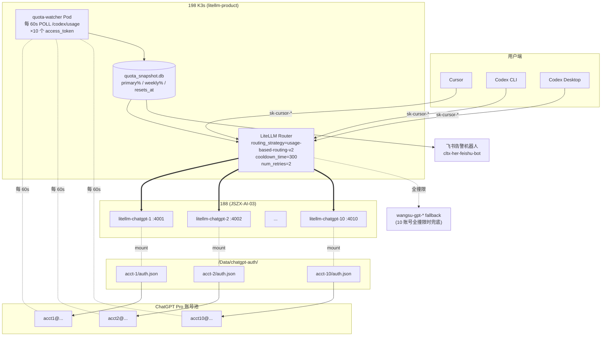

# 10 个 ChatGPT Pro $200 账号扩容方案（完整版）

**状态**：调研完成，待用户拍板进入实施
**日期**：2026-05-17
**版本**：v2（基于阿里云 carher / 198 LiteLLM / CarHer 源码三路调研结果重写）

---

## 0. TL;DR — 两个决策

### 决策 1：carher bot（阿里云 K8s）❌ 不接入 ChatGPT Pro

理由（量化）：
- carher 主力 LLM 是 **Claude Sonnet 4.6 + Opus 4.6/4.7**（7d 合计 ~338k calls / $32k spend），**GPT 占比 < 1%**
- carher 用 OpenClaw 框架，基于 `pi-ai` 包，**重度依赖 OpenAI Function Calling**（多文件操作、命令执行、技能调用）
- carher avg in tokens **8-17 万**，p95 上到 **20-53 万**，且依赖 Anthropic 1h prompt-caching。ChatGPT Pro **无 prompt cache 计费优惠**，单条请求成本不降反升
- 即使能切，10 个账号根本扛不动 220 实例 × 80k calls/day 的稳态负载

ChatGPT Pro 的"$200 固定费换无限聊天"对 carher 是个**假性套利** —— carher 用的不是 GPT，更不是 chat 形态。

### 决策 2：10 账号扩容 ✅ 专用于 198 cursor/codex 同事开发者

聚焦受众：**198 LiteLLM prod 上的 cursor / claude-code key 持有者**（当前 342 个开放 chatgpt-\* 权限的 key）

当前现状：
- prod 已配置 chatgpt-\* 4 个模型 + wangsu fallback，已铺 340 cursor key 白名单
- **过去 7 天 chatgpt-\* 仅 16 次真实调用** —— 配置就位但用户还没切过来
- 188 上仅 **1 个容器、1 个 auth.json**（aganeranin@mail.com），单点

扩容目标：
- **容量**：从 1 个账号 ~700-900 calls/5h 提升到 10 账号 6000-32000 messages/5h
- **可用性**：单账号 token 失效 / 撞限 / 被封不影响整体服务
- **可观测**：实时拿到每账号 primary(5h) / secondary(weekly) 剩余配额，撞限前主动调度

---

## 1. 调研事实速览（决策依据）

### 1.1 阿里云 carher ns 现状

| 指标 | 值 |
|---|---|
| HerInstance 数 | 220（219 Running + 1 Paused） |
| LiteLLM ConfigMap model_list 条目 | 23 |
| chatgpt-\* 模型条目 | **0** |
| 7d 总 calls | 850,084 |
| 7d 总 spend | $52,336 |
| 主力模型 | Claude Sonnet 4.6（200k calls / $20k）|
| 第二主力 | Claude Opus 4.6（94k calls / $17k）+ Opus 4.7（42k / $11k） |
| embedding | bge-m3 480k calls / $11（OpenRouter 单点，2026-05-17 起无 fallback） |
| GPT 系列总占比 | **2,375 + 1,815 = 4,190 calls (0.5%)** |
| 平均 in/out tokens (sonnet-4-6) | 83,845 in / 637 out（典型大上下文 agent）|

### 1.2 198 LiteLLM 现状

| 项 | dev | prod |
|---|---|---|
| model_list 总数 | 15 | 16 |
| chatgpt-\* 条目 | 6 | 4 |
| wangsu-gpt-\* 条目 | 0（已删）| 2（保留为 fallback）|
| router fallbacks | 仅 opus 内部 | chatgpt→wangsu 2 条 |
| model_group_alias | 8 个 picker bug 兜底 | 1 个 |
| cooldown_time / allowed_fails | **未配** | **未配** |
| 24h chatgpt-\* 调用 | <100 | **0** |
| 7d chatgpt-\* 调用 | 85 | **16** |
| 7d wangsu-gpt-\* 调用 | — | 2,721 |
| 工作日峰值 | — | 260 calls/h（05-15 19:00） |
| 单 5h 窗口峰值 | — | ~700-900 calls |

### 1.3 188 litellm-chatgpt 容器

| 项 | 值 |
|---|---|
| 容器名 | `litellm-chatgpt` |
| 镜像 | `ghcr.io/berriai/litellm:main-stable` |
| 端口 | 4000 |
| auth.json 路径 | host `/Data/chatgpt-auth/`、容器内 `/chatgpt-auth/` |
| auth.json mtime | 2026-05-15 00:41（access_token expires_at = 2026-05-24 16:41）|
| account_id | `59467168-b5d8-4514-9ba9-bf161452fd52` (aganeranin) |
| 多账号准备 | **无**，单 token 单进程 |

### 1.4 ChatGPT Pro $200 限速规则

| 窗口 | 大小 | Pro $200 额度（GPT-5.5）|
|---|---|---|
| Primary (5h) | 300 min sliding | **600-3200** local messages |
| Secondary (weekly) | 10080 min sliding | OpenAI 不公开，社区数据 ≈ 重度用户 2 天撞 |
| 度量单位 | reasoning 时间 | 不是消息数 |
| 促销加成 | 截止 2026-05-31 | 5h 限制 25x Plus（标准 20x）|

**官方未公开 endpoint**（核心抓手）：
```
GET https://chatgpt.com/backend-api/codex/usage
Authorization: Bearer <access_token>
chatgpt-account-id: <account_id>
Originator: codex_cli_rs
```

响应：
```json
{
  "primary":   { "used_percent": 45.2, "window_minutes": 300,   "resets_at": "..." },
  "secondary": { "used_percent": 12.8, "window_minutes": 10080, "resets_at": "..." },
  "credits":   { "has_credits": false, "unlimited": false, "balance": 0 },
  "plan_type": "Pro",
  "rate_limit_reached_type": null
}
```

---

## 2. 整体架构



---

## 3. 决策点（带推荐方案）

| # | 决策 | 选项 | 推荐 | 理由 |
|---|------|------|------|------|
| 1 | 188 编排 | 单容器多 model / **N 容器各独立** / k8s deploy | **N 个独立 docker 容器** | 调研显示 LiteLLM 单进程管多 OAuth 互踢概率 5-15%；故障隔离最重要 |
| 2 | 路由策略 | simple-shuffle / **usage-based-routing-v2** / least-busy | **usage-based-routing-v2** | 按 TPM 分散，最贴合 ChatGPT Pro 滚动窗口 |
| 3 | cooldown_time | 60 / **300** / 1800 | **300s (5min)** | 5h 窗口局部峰值典型回退时间 |
| 4 | num_retries | 1 / **2** / 3 | **2** | 撞限自动跳一次，不被一账号拖死 |
| 5 | allowed_fails | 2 / **3** / 5 | **3** | 配合 cooldown，避免单次抖动触发下线 |
| 6 | model_info.id 命名 | acct-N / 邮箱 / 哈希 | **`chatgpt-acct-N-{model}`** | SpendLogs 可分账，邮箱不入库 |
| 7 | 现有 4001 端口 | 重排 / **保留** | **保留当 acct-1** | 零中断，现网流量不动 |
| 8 | wangsu fallback | 删 / **保留** | **保留** | 10 账号全撞限概率非零；账号被封是真实风险 |
| 9 | dev 也铺 10 个？ | 跟 prod / **dev 留 1** | **dev 只 1 个** | dev 流量 < 100/7d，多账号纯浪费 |
| 10 | quota-watcher 部署位置 | 188 docker / **198 k8s** | **198 k8s Pod** | 跟 LiteLLM 同集群，调度联动方便 |
| 11 | 错峰首次激活 | 同日 / **错开 ≥12h** | **错开 12-24h** | 让 weekly 滚动窗口起点不同步 |

---

## 4. 容量评估（量化）

### 4.1 当前 1 账号容量天花板

- 单账号 5h 上限：600-3200 messages（GPT-5.5 高估值 25x Plus 促销期）
- 当前峰值消耗：**700-900 calls/5h**（接近下限 600）
- 撞限风险：**中**。如果广播指南后 cursor 用户大规模切到 `chatgpt-*`，3-5x 增长就会贴 GPT-5.5 单账号上限

### 4.2 10 账号扩容后理论容量

- **理论 10x**：6000-32000 messages/5h
- **折损因子**：
  - 路由不均衡（usage-based 比 simple-shuffle 损失 ≤ 5%）
  - OAuth token affinity 互踢（10 容器隔离 → 接近 0）
  - 账号失活（每周 ≈ 1-2 个账号要 re-login，损失 10-20%）
- **保守估计真实承载 6-7x** = 4200-22400 messages/5h
- **足以覆盖 50-100 个 cursor 用户工作日峰值**（典型 cursor 用户单 5h ≈ 30-80 messages）

### 4.3 Weekly cap 才是硬墙

- 5h 容量充裕，但 **weekly cap 是真敌人**
- 单账号重度用户 ≈ 2 天撞 weekly，撞了等 5-7 天
- 10 账号同步开通 → **第 2-3 天全员同时撞 weekly**
- 解法：**错峰首次激活**（见 §3 决策 11）

### 4.4 错峰开通时间表（推荐）

```
acct-1: 2026-05-20 周一 09:00 (现网已激活)
acct-2: 2026-05-20 周一 21:00
acct-3: 2026-05-21 周二 09:00
acct-4: 2026-05-21 周二 21:00
...
acct-10: 2026-05-24 周五 21:00
```

每 12 小时激活 1 个，5 天铺满 10 个。任何时刻最多 1-2 个账号在同步 weekly 窗口，剩余 8-9 个错峰扛流量。

---

## 5. 5 Phase 落地计划

### Phase 0 — 账号准备（人工，2-4 小时）

- [ ] 收集 10 个 ChatGPT Pro $200 账号凭据
- [ ] 在本地浏览器走 OAuth device code flow，每个账号生成 auth.json
- [ ] 把 10 个 auth.json 上传到 188 `/Data/chatgpt-auth/acct-{1..10}/auth.json`
- [ ] 在飞书私密 wiki 记录 `acct-N → 邮箱` 映射（**不入 git**）
- [ ] **保留 acct-1 = aganeranin（现网）** 不变

### Phase 1 — 188 容器化（30 分钟，可热加）

新增 `/Data/chatgpt-auth/docker-compose.yml`：

```yaml
x-chatgpt-common: &chatgpt-common
  image: ghcr.io/berriai/litellm:main-stable
  restart: unless-stopped
  environment:
    - LITELLM_LOG=INFO
    - CHATGPT_TOKEN_DIR=/chatgpt-auth
  networks: [chatgpt-net]

services:
  litellm-chatgpt-1:   # 保留现网（不动）
    <<: *chatgpt-common
    container_name: litellm-chatgpt
    ports: ["4001:4000"]
    volumes: ["./acct-1:/chatgpt-auth"]

  litellm-chatgpt-2:
    <<: *chatgpt-common
    container_name: litellm-chatgpt-2
    ports: ["4002:4000"]
    volumes: ["./acct-2:/chatgpt-auth"]

  # ... acct-3 ~ acct-10，端口 4003-4010

networks:
  chatgpt-net: { driver: bridge }
```

启停命令：
```bash
ssh cltx@10.68.13.188
cd /Data/chatgpt-auth
docker compose up -d litellm-chatgpt-2 litellm-chatgpt-3   # 先起 2 个验证
docker compose ps
curl -sS http://localhost:4002/health
```

资源占用：~250MB/容器 × 9 新容器 = ~2.3GB（188 余量充足）。

### Phase 2 — 198 LiteLLM 配置（5 分钟）

#### 2.1 ConfigMap 扩 model_list

每个 chatgpt-\* 模型从 1 条扩到 10 条同名 deployment：

```yaml
model_list:
# 4 个模型 × 10 个 deployment = 40 条
- model_name: chatgpt-gpt-5.5
  litellm_params:
    model: openai/chatgpt-gpt-5.5
    api_base: http://10.68.13.188:4001    # acct-1（现网）
    api_key: sk-chatgpt-188-...
  model_info: { id: chatgpt-acct-1-5.5, mode: responses }

- model_name: chatgpt-gpt-5.5
  litellm_params:
    model: openai/chatgpt-gpt-5.5
    api_base: http://10.68.13.188:4002    # acct-2
    api_key: sk-chatgpt-188-...
  model_info: { id: chatgpt-acct-2-5.5, mode: responses }
# ... 共 10 条
```

#### 2.2 补 router_settings（**当前 prod 缺这块**）

```yaml
router_settings:
  routing_strategy: usage-based-routing-v2
  cooldown_time: 300
  num_retries: 2
  allowed_fails: 3
  enable_tag_filtering: true   # 保留现有
  fallbacks:
    - chatgpt-gpt-5.5: [wangsu-gpt-5.5]
    - chatgpt-gpt-5.4: [wangsu-gpt-5.4]
    # codex-spark 系列保留无 fallback
```

#### 2.3 应用变更

```bash
# 通过 jms 连 198
kubectl -n litellm-product apply -f /root/litellm-product-manifests/30-cm-litellm-config.yaml
kubectl -n litellm-product rollout restart deploy/litellm-proxy
kubectl -n litellm-product rollout status deploy/litellm-proxy
```

### Phase 3 — quota-watcher 部署（核心创新，1-2 天开发）

#### 3.1 设计

新组件，部署位置 198 K3s `litellm-product` ns，单 Pod、SQLite 持久化。

#### 3.2 核心代码骨架（Python，约 200 行）

```python
# quota_watcher.py 核心循环
import requests, json, sqlite3, time, jwt
from datetime import datetime

ACCOUNTS = ["acct-1", ..., "acct-10"]

def fetch_usage(auth_json_path):
    auth = json.load(open(auth_json_path))
    tok = auth["tokens"]["access_token"]
    aid = jwt.decode(auth["tokens"]["id_token"], options={"verify_signature": False}) \
              .get("https://api.openai.com/auth", {}).get("chatgpt_account_id")

    r = requests.get(
        "https://chatgpt.com/backend-api/codex/usage",
        headers={
            "Authorization": f"Bearer {tok}",
            "chatgpt-account-id": aid,
            "Originator": "codex_cli_rs",
            "User-Agent": "codex_cli_rs/0.30.0 (Linux; x86_64)",
        }, timeout=10
    )
    r.raise_for_status()
    return r.json()

def classify(usage):
    p = usage["primary"]["used_percent"]
    w = usage["secondary"]["used_percent"]
    if w >= 90: return "RED"     # 周封
    if p >= 85: return "ORANGE"  # 5h 冷却
    if max(p, w) >= 60: return "YELLOW"  # 限速
    return "GREEN"

def main_loop():
    db = sqlite3.connect("/data/quota.db")
    while True:
        for acct in ACCOUNTS:
            try:
                u = fetch_usage(f"/data/auth/{acct}/auth.json")
                status = classify(u)
                db.execute(
                  "INSERT INTO snapshots VALUES (?,?,?,?,?,?,?)",
                  (acct, u["primary"]["used_percent"], u["secondary"]["used_percent"],
                   u["primary"]["resets_at"], u["secondary"]["resets_at"],
                   status, datetime.utcnow().isoformat())
                )
                db.commit()
                handle_status(acct, status, u)
            except Exception as e:
                alert_feishu(f"⚠️ {acct} usage poll failed: {e}")
        time.sleep(60)

def handle_status(acct, status, usage):
    if status == "RED":
        disable_litellm_deployment(acct)
        alert_feishu(f"🔴 {acct} weekly {usage['secondary']['used_percent']}%，已下线至 {usage['secondary']['resets_at']}")
    elif status == "ORANGE":
        litellm_cooldown_set(acct, until=usage["primary"]["resets_at"])
    elif status == "YELLOW":
        litellm_weight_set(acct, weight=0.5)
    else:
        litellm_weight_set(acct, weight=1.0)
```

#### 3.3 与 LiteLLM 联动

**软调控**（weight 调整）：调用 LiteLLM admin API
```bash
PATCH /model/{model_info.id}
{ "litellm_params": { "weight": 0.5 } }
```
（需先验证 LiteLLM v1.55+ 是否支持运行时改 weight，否则用方案 B）

**硬下线**（撞 weekly）：调用 LiteLLM admin API
```bash
DELETE /model/{model_info.id}
```
或写 ConfigMap 标记 `enabled: false` + rollout（5min 延迟）

**Cooldown**：复用 LiteLLM 内置 cooldown_time 机制，自然撞 429 即触发；watcher 主动调 cooldown 用未公开内部 API（v1.55 起有 `/cooldown` 内部 endpoint）

#### 3.4 SQLite Schema

```sql
CREATE TABLE snapshots (
  acct_id TEXT,
  primary_pct REAL,
  weekly_pct REAL,
  primary_resets TEXT,
  weekly_resets TEXT,
  status TEXT,
  polled_at TEXT
);
CREATE INDEX ix_polled ON snapshots(polled_at);
CREATE INDEX ix_acct_polled ON snapshots(acct_id, polled_at);
```

#### 3.5 飞书告警规则

| 阈值 | 动作 |
|------|------|
| 任一账号 weekly ≥ 75% | 🟡 提醒，1-2 天可能撞 |
| 任一账号 weekly ≥ 90% | 🟠 自动下线 + ping 运维 |
| ≥ 3 账号 weekly ≥ 75% 同时 | 🔴 高危 |
| `plan_type ≠ Pro` | 立即告警（账号被降级）|
| /usage endpoint 连续 5 次失败 | 🔴 token 失效，需 re-login |
| 任一账号 401 触发自动 refresh 失败 | 🔴 |

复用现有 `cltx-her-feishu-bot` 告警通道。

### Phase 4 — 灰度铺开（1 周）

**Day 1（周一）**：上 acct-2、acct-3（共 3 个）
- ConfigMap 加 6 条 model_list（2 acct × 3 model）+ router_settings
- quota-watcher 上线 + 跟 3 个账号联动
- 观察 24h：路由是否均匀、cooldown 是否触发、watcher 数据是否准

**Day 2-5**：每 12h 上一个，到 acct-10 全部就位
**Day 6-7**：稳定观察，确认 weekly 错峰生效

### Phase 5 — 监控 + 治理（持续）

- [ ] Grafana dashboard：按 `model_info.id` 分账的 RPM/TPM/成功率/recent_429
- [ ] 周度报告（脚本）：上周 weekly cap 撞限次数、平均使用率、需 re-login 次数
- [ ] 2026-05-31 促销结束后：5h 容量减半，需重新评估是否升级到 11+ 账号
- [ ] 季度审计：哪些 cursor key 真用 chatgpt-\*、哪些没切过来

---

## 6. 配套脚本 / skill 更新清单

| 文件 | 改动 |
|------|------|
| `~/.claude/skills/chatgpt-pro-litellm/SKILL.md` | 加「多账号扩容」章节 + 「quota-watcher 运维」runbook |
| `~/.claude/skills/chatgpt-pro-litellm/references/multi-account-ops.md`（新） | 详细操作步骤 |
| `scripts/add-chatgpt-account.sh`（新） | 输入 acct-N + auth.json，自动改 188 docker-compose + 198 ConfigMap + rollout |
| `scripts/chatgpt-account-health.sh`（新） | 巡检 10 端口的 /health + 当前 quota，输出表格 |
| `quota-watcher/`（新组件目录） | Python 守护 + Dockerfile + k8s manifest |
| `scripts/probe-codex-usage.py`（新，PoC 用） | 验证 `/codex/usage` endpoint 真实响应（用现网 acct-1 auth.json）|

---

## 7. 风险与缓解矩阵

| 风险 | 概率 | 影响 | 缓解 |
|------|------|------|------|
| 10 账号同 IP 被 OpenAI 风控 | 中 | 全员被封 | 错峰激活；保留 wangsu fallback；如出问题再上 aliyun NAT 多 IP |
| Cloudflare 挡 /usage endpoint | 中 | watcher 失效 | 模拟 codex_cli_rs UA + Originator；如 403 切到「scrape /status TUI 输出」备方 |
| OAuth refresh token 突然失效 | 低 | 该 acct 下线 | watcher 主动 refresh + 401 告警 + skill 里写 re-login 流程 |
| LiteLLM 升级导致全 10 deployment 同挂 | 低 | chatgpt 全断 | wangsu fallback 兜底；198 prod canary 升级 |
| 2026-05-31 促销结束 5h 减半 | **确定** | 容量减半 | 提前评估流量增长，必要时 6-7 月加买账号 |
| ChatGPT Pro 单账号被降级到 Plus | 低 | plan_type ≠ Pro | watcher 监测 plan_type 字段，立即告警 |
| weekly cap 全员同步撞墙 | 中 | 全 chatgpt 下线 5-7d | **错峰激活是关键缓解**；wangsu 兜底 |
| 188 单机故障 | 中 | 全 10 容器挂 | 短期接受；中期上 188+187 双机 docker swarm |
| quota-watcher 自己挂掉 | 中 | 没监控但流量仍通 | k8s Deployment + livenessProbe + 飞书 ping |

---

## 8. 待用户拍板的点（实施前 3 个 ASK）

1. **10 个账号现在到手了吗？** 如果还没，Phase 0 需要先预留 2-4 小时收集 + OAuth 登录
2. **节奏**：推荐 Phase 4 渐进（Day 1 上 2-3 个先验证），还是一把上 10 个？建议渐进
3. **quota-watcher 谁来写**：1-2 天 Python 工作量，我可以写，也可以你这边接手

---

## 9. 不会做的事（明确边界）

- ❌ **不接入 carher bot** — carher 用 Claude + tool calling + 大上下文，ChatGPT Pro 不匹配
- ❌ **不接 ChatGPT 网页 `/conversation` 端点** — proof-of-work 反爬 + 不支持 tool calling + ToS 风险显著高
- ❌ **不对外服务** — Pro 订阅 ToS 灰区，仅供内部研发提效
- ❌ **不删 wangsu fallback** — 10 账号全撞限 / 被封是真实风险
- ❌ **不在 LiteLLM 加 rate limit** — 2026-05-16 教训：100k TPM 太紧反而扰动流量

---

## 附 A：探针脚本（Phase 0 前置验证）

在实施任何东西之前，**先用 acct-1 现网 auth.json 验证 `/codex/usage` endpoint 真能拿到数据**。

```bash
ssh cltx@10.68.13.188 << 'EOF'
docker exec litellm-chatgpt cat /chatgpt-auth/auth.json > /tmp/auth.json
TOKEN=$(jq -r '.tokens.access_token' /tmp/auth.json)
AID=$(jq -r '.tokens.id_token' /tmp/auth.json | python3 -c "
import sys, base64, json
t = sys.stdin.read().strip().split('.')[1]
t += '=' * (-len(t) % 4)
d = json.loads(base64.urlsafe_b64decode(t))
print(d['https://api.openai.com/auth']['chatgpt_account_id'])
")

curl -sS https://chatgpt.com/backend-api/codex/usage \
  -H "Authorization: Bearer $TOKEN" \
  -H "chatgpt-account-id: $AID" \
  -H "Originator: codex_cli_rs" \
  -H "User-Agent: codex_cli_rs/0.30.0 (Linux; x86_64)" \
  | python3 -m json.tool
EOF
```

**预期输出**：JSON 含 `primary` / `secondary` / `plan_type=Pro`。
**如果 403/401**：方案需调整为「scrape /status TUI 输出」备方，或 reverse SSE。

---

## 附 B：相关 skill / 文档

- `~/.claude/skills/chatgpt-pro-litellm/SKILL.md` — 当前单账号运维手册
- `~/.claude/skills/carher-codex-setup/SKILL.md` — 用户接入指南
- `~/.claude/skills/litellm-ops/SKILL.md` — LiteLLM 通用运维
- `~/.claude/skills/litellm-budget-mgmt/SKILL.md` — key budget 管理
- `~/.claude/skills/litellm-key-activity/SKILL.md` — key 活跃度审计
- `docs/litellm-safe-upgrade-canary-plan.md` — LiteLLM canary 升级
- 飞书管理员文档：https://t83dfrspj4.feishu.cn/docx/YO2AdwHg8oFr1Cx7PQKc8nrfnre
- 飞书用户文档：https://t83dfrspj4.feishu.cn/docx/ZbJTdCmF6omRNqx0SG5c2tNwnOd

---

## 附 C：调研数据快照（2026-05-17）

| 数据来源 | 关键值 |
|----------|--------|
| 阿里云 carher ns | 220 实例 / 850k calls 7d / 主力 Claude Sonnet / GPT 占 0.5% |
| 198 LiteLLM prod | 16 chatgpt-\* model_list / 7d chatgpt 调用 16 次 / 342 个 chatgpt 白名单 key |
| 198 LiteLLM dev | 15 model_list / chatgpt 全权重 / 7d 调用 85 次 |
| 188 单容器 | aganeranin@mail.com / 5h 峰值 ~900 calls / auth.json 5d 内 refresh 过 |
| CarHer 源码 | OpenClaw 框架 / pi-ai SDK / tool calling 重度依赖 / chat completions 协议 |
