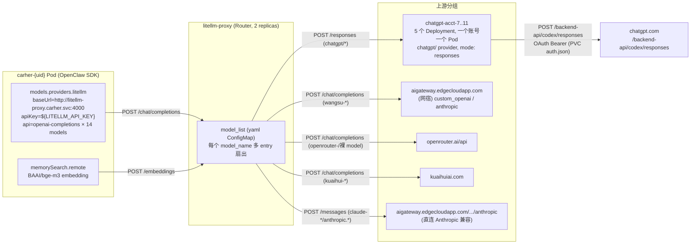
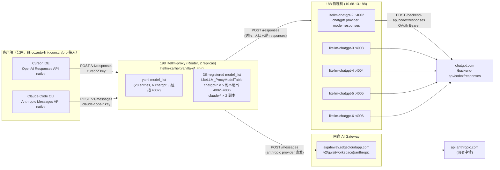

# LiteLLM 全链路（CarHer / Cursor / Claude Code）

> 两套独立的 LiteLLM 部署，服务 3 类客户端：
> - 阿里云 `carher` ns —— her bot pod（OpenClaw SDK）入口走 `/chat/completions`
> - 198 prod `litellm-product` ns —— Cursor IDE 走 `/v1/responses`；Claude Code CLI 走 `/v1/messages`
>
> 每段链路都给出**可复现的现场命令**，结论以现场为准，不要相信"应该是这样"，
> 要么 grep 配置要么 grep access log。

---

## 一、CarHer her bot 链路（阿里云 carher ns）

### 总图



## 各段实测

### 第 1 段 — carher pod → Router

| 维度 | 值 | 验证命令 |
|---|---|---|
| 入口 path | `POST /chat/completions`（业务）/ `POST /embeddings`（memorySearch）| `kubectl logs -n carher deploy/litellm-proxy --tail=5000 \| grep -oE '"POST /[^ "]*"' \| sort \| uniq -c \| sort -rn` |
| baseUrl | `http://litellm-proxy.carher.svc:4000` | `kubectl exec -n carher deploy/carher-1000 -c carher -- cat /data/.openclaw/openclaw.json \| jq .models.providers.litellm.baseUrl` |
| apiKey | per-instance vkey（CRD `spec.litellmKey`）| 同上 jq `.apiKey` |
| client IP 反查 | 全部命中 `app=carher-user` 227 个 pod | `kubectl get pod -A -o jsonpath='{range .items[*]}{.status.podIP} {.metadata.namespace}/{.metadata.name}{"\n"}{end}' \| grep <client_ip>` |

模型条目里写的是 `"api": "openai-completions"`，所以 SDK 一定走 `/chat/completions`，不走 `/responses`。
见 `operator-go/internal/controller/config_gen.go:220-233`。

### 第 2 段 — Router → upstream（分四组）

Router 同一个 `model_name` 配多 entry 实现 LB / fallback；不同 `model_name` 走完全不同的上游协议。

```bash
# 一行看清当前 Router 的所有上游分布
kubectl get cm litellm-config -n carher -o jsonpath='{.data.config\.yaml}' \
  | python3 -c "
import yaml,sys
cfg=yaml.safe_load(sys.stdin)
g={}
for m in cfg['model_list']:
    lp=m['litellm_params']
    g.setdefault((m['model_name'], lp.get('model','').split('/')[0]), set()).add(lp.get('api_base',''))
for (mn,prov),bases in sorted(g.items()):
    print(f'{mn:34s}  via {prov:14s}  sample={sorted(bases)[0][:60]}{\"\" if len(bases)==1 else f\" (+{len(bases)-1} more)\"}')
"
```

实测分组（2026-05-22）：

| 模型组（model_name 前缀） | provider 前缀 | 协议（Router→上游） | 上游 |
|---|---|---|---|
| `chatgpt-gpt-5.*` × 4 model × 5 acct | `openai/` + `model_info.mode: responses` | **`POST /responses`** | `chatgpt-acct-7..11.carher.svc:4000` |
| `wangsu-*` (gpt/gemini/glm/deepseek) | `custom_openai/` | `POST /chat/completions` | `aigateway.edgecloudapp.com/v1/...` |
| `claude-opus/sonnet-*`, `anthropic.*` | `anthropic/` | `POST /messages` | `aigateway.edgecloudapp.com/.../anthropic` |
| `openrouter-*`, 裸 `gpt-5.4` / `gemini-*` / `glm-5` / `minimax-m2.7` | `openrouter/` | `POST /chat/completions` | `openrouter.ai/api/v1` |
| `kuaihui-*` | `openai/` | `POST /chat/completions` | `kuaihuiai.com/v1` |
| `BAAI/bge-m3`（embedding） | `openrouter/` | `POST /embeddings` | `openrouter.ai/api/v1` |

**关键陷阱**：`model_info.mode: responses` 是 LiteLLM 用来决定要不要做 chat→responses **协议桥接**的开关。
入口虽然是 `/chat/completions`，命中带 `mode: responses` 的 entry 后，Router 出去给上游就是 `/responses`，**不是透传**。

### 第 3 段 — chatgpt-acct → chatgpt.com

```bash
# 现场看 acct pod 收到的 path（client IP 一定是 litellm-proxy 那两个 replica IP）
kubectl logs -n carher deploy/chatgpt-acct-7 --tail=2000 \
  | grep -oE '"POST /[^ "]*"' | sort | uniq -c | sort -rn
# 实测:   POST /responses   ← 全部
```

acct pod 自己也是一个 LiteLLM 实例，但 model_list 写的是 `chatgpt/gpt-5.5`（注意 provider 是 `chatgpt`，不是 `openai`）：

```bash
kubectl get cm chatgpt-pool-config -n carher -o jsonpath='{.data.config\.yaml}'
# model_list:
#   - model_name: chatgpt-gpt-5.5
#     litellm_params: { model: chatgpt/gpt-5.5 }
#     model_info: { mode: responses }
```

由 litellm 仓里的 `chatgpt/` provider 调 `https://chatgpt.com/backend-api/codex/responses`，
Bearer token 来自 PVC `/chatgpt-auth/auth.json`（OAuth device-code flow 拿到的 access_token，30 天 TTL）。

每个 acct Pod 一个账号 —— `CHATGPT_TOKEN_DIR` 是进程级 env，没法在同进程内多账号共存。
扩容靠加 Pod，不是加 token。

## 几个常见误解（已踩过 — carher 侧）

1. **"Router 是透传 proxy"** — 错。`model_info.mode: responses` 会让 Router 在出口做协议桥接。
   carher → Router 是 `/chat/completions`，Router → acct 是 `/responses`。
2. **"chatgpt 走 `openai/` provider"** — 一半对。Router 那层写 `openai/chatgpt-gpt-5.5`（因为
   acct 暴露的是 OpenAI 兼容入口）；acct 内部才是 `chatgpt/gpt-5.5`，由 litellm-fork 实现
   chatgpt.com 私有协议。
3. **"litellmUrl 可以指 https 公网"** — 默认硬编码 `http://litellm-proxy.carher.svc:4000`，
   公网要先在 ns 建 Service/ExternalName，目前 227/227 CRD `spec.litellmUrl` 都为空，没人这么用。
   见 `kubectl get her -n carher -o json | jq '[.items[].spec.litellmUrl] | unique'`。
4. **"memorySearch 不走 LiteLLM"** — 错。`shared-config.json5` 的 `memorySearch.remote`
   显式指 `http://litellm-proxy.carher.svc:4000`，embedding 也算到该实例 vkey（spend 可在
   `LiteLLM_SpendLogs` 看到 `model='BAAI/bge-m3'` 的行）。

## 配置面：写到哪里看到哪里（carher 侧）

| 字段 | 写在哪 | 渲染到哪 | 谁负责 |
|---|---|---|---|
| `spec.litellmUrl` | HerInstance CRD | `openclaw.json` → `models.providers.litellm.baseUrl` | operator `config_gen.go:240` |
| `spec.litellmKey` | HerInstance CRD | `models.providers.litellm.apiKey` + Pod env `LITELLM_API_KEY` | operator `config_gen.go:216` + `reconciler.go:365` |
| Router model_list | `cm/litellm-config` (yaml) | LiteLLM 启动加载 | 人手 + `litellm-reprice` skill |
| acct upstream | `cm/chatgpt-pool-config` (yaml) | acct pod 启动加载 | 人手（onboard 流程见 [[chatgpt-pool-aliyun-canary]]）|
| Auth token | PVC `/chatgpt-auth/auth.json` | mount 进 acct pod | `chatgpt-onboard/` 脚本，OAuth device-code |

---

## 二、Cursor / Claude Code 链路（198 prod litellm-product ns）

### 总图



### 关键不同：客户端协议跟 carher 不一样

| 维度 | carher（OpenClaw SDK）| Cursor IDE | Claude Code CLI |
|---|---|---|---|
| 客户端原生协议 | OpenAI Chat Completions | **OpenAI Responses API** | **Anthropic Messages API** |
| 入口 path | `POST /chat/completions` | `POST /v1/responses` | `POST /v1/messages` |
| `LiteLLM_SpendLogs.call_type` | `acompletion` | `aresponses` / `responses` / `acompact_responses` | `anthropic_messages` |
| Router 是否做协议桥接 | **是**（chat → responses，靠 `model_info.mode: responses`）| 否（透传 responses）| 否（透传 messages）|
| key alias 模式 | （不分）| `cursor-{user_hash}-aiNN` | `claude-code-{name}-{hash}` |

cursor / claude-code 客户端**自己就发原生协议**，不需要 LiteLLM 桥接，所以链路比 carher 那段短了一跳。

### 第 1 段 — 客户端 → Router

| 维度 | 值 | 验证命令 |
|---|---|---|
| 公网入口 | `cc.auto-link.com.cn/pro`（经 Cloudflare → 198 NodePort）| `backend/main.py:1178` `PRO_LITELLM_URL` |
| 主要 path 占比（4 小时窗）| `/v1/responses 985` > `/v1/messages 569` > `/v1/chat/completions 106` | `jms ssh AIYJY-litellm "kubectl logs -n litellm-product deploy/litellm-proxy --tail=20000" \| grep -oE 'POST /[a-zA-Z0-9_/.-]*' \| sort \| uniq -c \| sort -rn` |

按 key class 拆分（4 小时窗，from `LiteLLM_SpendLogs`）：

```sql
SELECT CASE
         WHEN metadata->>'user_api_key_alias' LIKE 'cursor-%'      THEN 'cursor-*'
         WHEN metadata->>'user_api_key_alias' LIKE 'claude-code-%' THEN 'claude-code-*'
         ELSE 'other' END AS key_class,
       call_type, COUNT(*) AS n
  FROM "LiteLLM_SpendLogs"
 WHERE "startTime" >= NOW() - INTERVAL '4 hours'
 GROUP BY 1, 2 ORDER BY 1, 3 DESC;
```

实测：
```
claude-code-*  | anthropic_messages   | 1757   ← 主流量, /v1/messages
claude-code-*  | acompletion          |   62
cursor-*       | aresponses           | 3446   ← 主流量, /v1/responses (async)
cursor-*       | responses            |  245
cursor-*       | acompact_responses   |   19   ← cursor compact API (prompt cache)
cursor-*       | acompletion          |   24
```

注意 client IP 在 198 Router log 全是 `10.42.0.1` —— 因为 k3s CNI NAT 后看不到真实 IP，
只能靠 `metadata->>'user_api_key_alias'` 区分客户端。

### 第 2a 段 — Router → 188 ChatGPT 池（cursor 流量）

| 维度 | 值 | 验证命令 |
|---|---|---|
| Router 出口 path | `POST /responses`（**和 carher 不同：这里是透传，不是桥接**，因为入口已经是 responses）| `jms ssh JSZX-AI-03 "docker logs litellm-chatgpt-2 --tail=2000" \| grep -oE 'POST /[a-zA-Z0-9_/-]*' \| sort \| uniq -c` |
| 实测占比（litellm-chatgpt-2，~2000 行窗口）| `POST /responses 661` + `POST /responses/compact 6` | 同上 |
| 上游 client IP | `10.68.13.198`（即 198 主机出方向 IP）| `jms ssh JSZX-AI-03 "docker logs litellm-chatgpt-2 --tail=200" \| grep responses \| tail` |
| 5 个上游端口 | 4002, 4003, 4004, 4005, 4006（每端口 = 一个 ChatGPT 账号 acct-2~6）| `jms ssh JSZX-AI-03 "docker ps --format '{{.Names}}\t{{.Ports}}' \| grep chatgpt"` |
| 同名扇出 | `LiteLLM_ProxyModelTable` 里 chatgpt-gpt-5.5/5.4/5.3-codex/5.3-codex-spark 各 5 行（DB-registered，加密 api_base）| `jms ssh AIYJY-litellm "kubectl exec -n litellm-product litellm-db-0 -- bash -c 'PGPASSWORD=\$POSTGRES_PASSWORD psql -U \$POSTGRES_USER \$POSTGRES_DB -c \"SELECT model_name, COUNT(*) FROM \\\"LiteLLM_ProxyModelTable\\\" GROUP BY model_name\"'"` |

### 第 2b 段 — Router → 网宿 Anthropic 网关（claude-code 流量）

| 维度 | 值 | 验证命令 |
|---|---|---|
| Router 出口 path | `POST /messages`（anthropic provider 透传）| Router yaml 里 `model: anthropic/anthropic.claude-opus-4-7` |
| 上游 base | `https://aigateway.edgecloudapp.com/v2/gws/{workspace_id}/anthropic` | `jms ssh AIYJY-litellm "kubectl get cm litellm-config -n litellm-product -o jsonpath='{.data.config\.yaml}'"` |
| workspace LB | claude-opus-4-7 / sonnet-4-6 / haiku-4-5 各 2 副本（不同 workspace ID）+ yaml 各 1 副本 | DB-registered + yaml 合并加入同 model_name pool |
| 模型分布（claude-code key 4h）| opus-4-7 (823) > sonnet-4-6 (699) > opus-4-6 (226) > haiku-4-5 (63) | 见上面 SQL |

### 第 3 段 — 188 chatgpt-acct → chatgpt.com

跟 carher 那侧**完全相同**：每个 acct 容器是独立 LiteLLM，`model: chatgpt/gpt-5.5` + `mode: responses`，
由 litellm-fork `chatgpt/` provider 调 `https://chatgpt.com/backend-api/codex/responses`。

```bash
jms ssh JSZX-AI-03 "cat /Data/chatgpt-litellm/config.yaml"
# 配置文件 5 个 acct 容器共用（bind-mount）
jms ssh JSZX-AI-03 "ls /Data/chatgpt-auth/"
# acct-2 acct-3 acct-4 acct-5 acct-6 ← 每账号一个目录, auth.json 各自隔离
```

OAuth token 是**进程级 env `CHATGPT_TOKEN_DIR`**，无法多账号共存于同进程；扩账号 = 加容器 + 加端口。
account 双轨与阿里云 acct-7~11 互不重叠（同账号同时用会被 chatgpt.com `token_invalidated`）。

## 两套部署对比速览

| 维度 | 阿里云 carher ns | 198 prod litellm-product ns |
|---|---|---|
| 服务对象 | her bot 实例（227 个）| Cursor 用户 + Claude Code 用户 |
| 客户端协议 | `/chat/completions`（OpenClaw SDK）| `/v1/responses` (Cursor) + `/v1/messages` (Claude Code) |
| ChatGPT 账号位置 | K8s 集群内（5 Deployment）| 集群外 188 物理机（5 docker container）|
| ChatGPT 账号编号 | acct-7~11 | acct-2~6 |
| Router 镜像 | `ghcr.io/berriai/litellm:v1.85.0` vanilla | `127.0.0.1:5000/litellm-carher:vanilla-v1.85.0` 本地 ACR 重打 |
| Router model_list 来源 | 纯 yaml ConfigMap | yaml + DB-registered 混合（chatgpt 主要在 DB）|
| Anthropic 上游 | 网宿 + OpenRouter（带 fallback）+ kuaihui | 网宿（多 workspace LB）|
| 公网入口 | 无（仅集群内 svc）| `cc.auto-link.com.cn/pro` |
| Router 是否桥协议 | **是** chat→responses（`model_info.mode: responses`）| **否** 透传（cursor 自己就发 /responses）|
