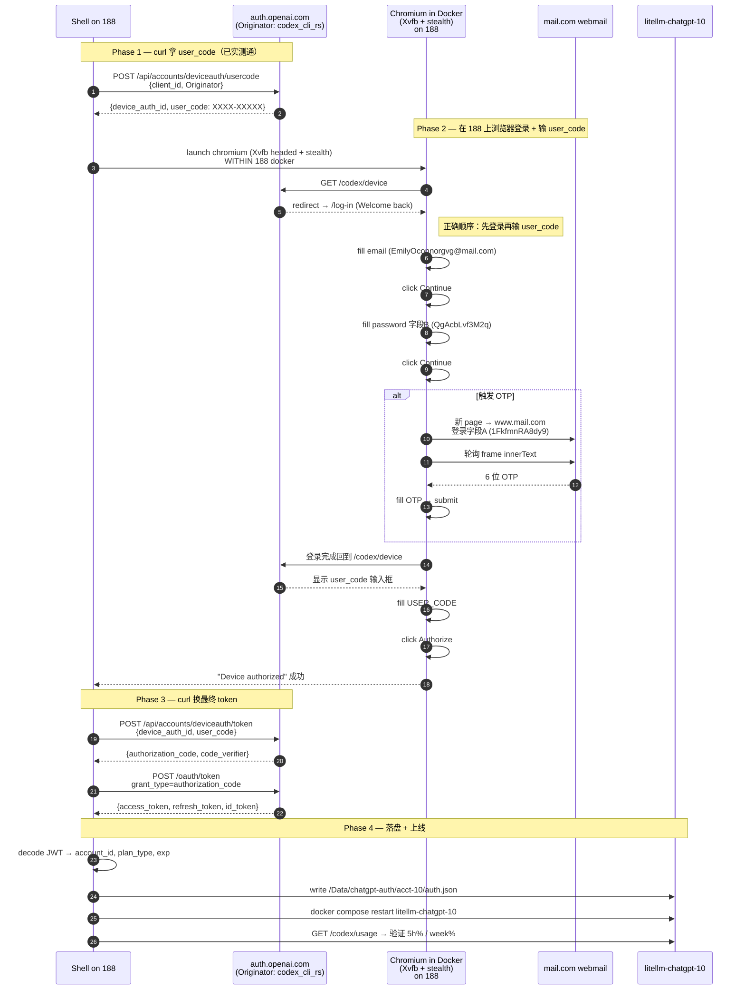
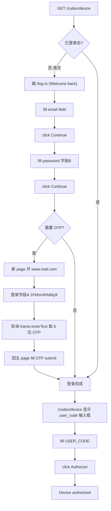

# ChatGPT Pro 重新登录流程（188 内网 OAuth）

> 目标：在 188（公司内网机）上为 acct-10 (EmilyOconnorgvg@mail.com) 完成 re-OAuth，输出 `auth.json` 给 LiteLLM。
> **所有动作均在 188 上执行**，不依赖外部跳板。
>
> **状态（2026-05-19）**：✅ **全流程跑通**。acct-10 从 `token_invalidated` → 🟢 HEALTHY。整套 SOP 已沉淀到 `~/.claude/skills/chatgpt-pro-litellm/SKILL.md` 方案 A。

## 0. 关键账户信息（仅当前案例）

| 字段 | 值 |
|------|-----|
| 邮箱（webmail 用户名） | `EmilyOconnorgvg@mail.com` |
| 字段A：mail.com webmail 密码 | `1FkfmnRA8dy9` |
| 字段B：ChatGPT 登录密码 | `QgAcbLvf3M2q` |
| 目标账号 | `acct-10` |
| 目标容器 | `litellm-chatgpt-10`（端口 4010） |
| auth.json 落地路径 | `/Data/chatgpt-auth/acct-10/auth.json` |

## 1. 关键技术突破（不要再走弯路）

### 1.1 CF 阻拦的真实指纹层

浏览器形态请求 `auth.openai.com/api/accounts/authorize/continue` 被 CF 返回 403 "Just a moment" HTML，前端 `JSON.parse(<!DOCTYPE...)` 崩成"Oops, Unexpected token '<'"。

**CF 不看 `Originator` header，看 TLS / HTTP2 指纹**。playwright bundled chromium 的 TLS 指纹被识别为 bot。

✅ **唯一已验证有效方案**：用 [`patchright`](https://github.com/Kaliiiiiiiiii-Vinyzu/patchright) — playwright 的 stealth fork，使用真实 Chrome 二进制（chromium-1217）+ TLS/CDP 反指纹补丁。**实测一行替换**：

```python
# ❌ from playwright.sync_api import sync_playwright
✅ from patchright.sync_api import sync_playwright
```

### 1.2 镜像版本绑定

patchright 内置 chromium-1217（Chrome 137），要求 playwright 镜像 v1.59.x：

| 组件 | 版本 |
|------|------|
| Docker 镜像 | `mcr.microsoft.com/playwright/python:v1.59.0-noble` |
| pip install | `patchright`（自带补丁） |
| chromium 路径 | `/ms-playwright/chromium-1217/` |

❌ 之前用的 `v1.49.0-noble` + `playwright-stealth` 不能过 CF（TLS 指纹层）。

### 1.3 188 网络可达性矩阵

| 端点 | curl 直连 | Playwright | patchright | 备注 |
|------|----------|-----------|-----------|------|
| `auth.openai.com/api/accounts/deviceauth/usercode` | ✅ JSON | — | — | 带 `Originator: codex_cli_rs` 白名单 |
| `auth.openai.com/api/accounts/deviceauth/token` | ✅ JSON | — | — | 同上 |
| `auth.openai.com/oauth/token` | ✅ JSON | — | — | 同上 |
| `auth.openai.com/log-in` | — | ⚠️ "Your session ended"（无 OAuth context） | ✅ | 必须从 /codex/device 进 |
| `auth.openai.com/codex/device` | — | ✅ | ✅ | 跳转到 /log-in 带 OAuth state |
| `auth.openai.com/api/accounts/authorize/continue` (POST SPA) | ❌ CF 403 HTML | ❌ CF 403 HTML | ✅ 200 JSON | **patchright 的关键收益** |
| `auth.openai.com/api/accounts/login` | ❌ CF | — | — | 不走这条 |
| `chatgpt.com/api/auth/*` | ❌ CF | ❌ CF | ❌ CF | 整片 NextAuth 锁死，绝对不走 |
| 188 出口 geo | — | — | JP | OpenAI 不地区拒 |


## 2. 总体流程图



## 3. Phase 2 浏览器登录细节（修正后的正确顺序）



**关键修正**（相比上版）：
- **先 email/password/OTP，后 user_code** —— 之前顺序反了，把 user_code 填到 email 框，导致 "Email is not valid"
- **必须在 188 上跑** —— Mac 上 IPv6 (240e:3a5...) 被 OpenAI 地理封禁，188 内网 IP 反而能通

## 4. Docker 运行环境（在 188 上）

```bash
ssh cltx@10.68.13.188 'docker run --rm \
  -v /tmp/chatgpt-litellm-oauth.py:/work/script.py \
  -v /tmp/mail_pw_emily.txt:/run/mail_pw.txt \         # 字段A
  -v /tmp/chatgpt_pw_emily.txt:/run/chatgpt_pw.txt \   # 字段B
  -v /tmp/screenshots-emily:/work/screenshots \
  -v /tmp:/work/out \
  -e MAIL_USER=EmilyOconnorgvg@mail.com \
  -e MAIL_LOGIN_PW_FILE=/run/mail_pw.txt \
  -e CHATGPT_PW_FILE=/run/chatgpt_pw.txt \
  -e AUTH_JSON_OUTPUT=/work/out/auth-emily.json \
  -e SCREENSHOT_DIR=/work/screenshots \
  -e PLAYWRIGHT_BROWSERS_PATH=/ms-playwright \
  -e DISPLAY=:99 \
  mcr.microsoft.com/playwright/python:v1.49.0-noble \
  bash -c "Xvfb :99 -screen 0 1280x800x24 & sleep 1 && \
           pip install playwright==1.49.0 playwright-stealth -q && \
           python3 /work/script.py"'
```

**反检测三件套**（在镜像里都已就绪）：
- `Xvfb :99` 虚拟显示，让 chromium 跑 headed（headless 过不了 CF Turnstile）
- `playwright-stealth` 抹掉 `navigator.webdriver` 等自动化指纹
- 启动参数：`--disable-blink-features=AutomationControlled --no-sandbox`

## 5. Phase 1 / Phase 3 实测命令

```bash
# Phase 1: 拿 user_code（已多次实测成功）
ssh cltx@10.68.13.188 'curl -s -X POST "https://auth.openai.com/api/accounts/deviceauth/usercode" \
  -H "Content-Type: application/json" \
  -H "Originator: codex_cli_rs" \
  -H "User-Agent: codex_cli_rs/0.30.0 (Linux 5.15; x86_64) unknown" \
  -d "{\"client_id\":\"app_EMoamEEZ73f0CkXaXp7hrann\"}"'
# 返回示例：
# {"device_auth_id":"deviceauth_6a0bb781b8388191920d82d4b1a10117",
#  "user_code":"9F29-9M6JA","interval":"5",
#  "expires_at":"2026-05-19T01:21:09Z"}

# Phase 3a: 授权前 poll（pending）/ 授权后 poll（拿 authorization_code）
ssh cltx@10.68.13.188 "curl -s -X POST 'https://auth.openai.com/api/accounts/deviceauth/token' \
  -H 'Content-Type: application/json' \
  -H 'Originator: codex_cli_rs' \
  -d '{\"device_auth_id\":\"\$DEVICE_AUTH_ID\",\"user_code\":\"\$USER_CODE\"}'"
# 授权前：{"error":{"code":"deviceauth_authorization_pending"}}
# 授权后：{"authorization_code":"ac_...","code_verifier":"...","code_challenge":"..."}

# Phase 3b: 换 access_token（form-urlencoded）
ssh cltx@10.68.13.188 "curl -s -X POST 'https://auth.openai.com/oauth/token' \
  -H 'Content-Type: application/x-www-form-urlencoded' \
  -H 'Originator: codex_cli_rs' \
  -d 'grant_type=authorization_code&code=\$AUTH_CODE&redirect_uri=https://auth.openai.com/deviceauth/callback&client_id=app_EMoamEEZ73f0CkXaXp7hrann&code_verifier=\$CODE_VERIFIER'"
# 返回：{"access_token":"eyJ...","refresh_token":"rt_...","id_token":"eyJ...","expires_in":86400}
```

## 6. Phase 4 落地

```bash
# 写 auth.json
scp /tmp/auth-emily.json cltx@10.68.13.188:/Data/chatgpt-auth/acct-10/auth.json

# 重启容器读取新 token
ssh cltx@10.68.13.188 'cd /Data/chatgpt-auth && docker compose restart litellm-chatgpt-10'

# 验证状态
ssh cltx@10.68.13.188 'python3 /tmp/chatgpt-acct-status.py | grep acct-10'
# 期望: acct-10  pro    0.0%   0.0%  🟢 HEALTHY
```

## 7. auth.json 结构

```json
{
  "access_token":  "eyJraWQiOi...",          // JWT, ~24h 有效
  "refresh_token": "rt_xxxxxxxxxxxx",         // 90 字符
  "id_token":      "eyJraWQiOi...",
  "expires_at":    1779978098,                // 来自 JWT claims.exp
  "account_id":    "07442ba4-c93b-...-90"     // 来自 JWT https://api.openai.com/auth.chatgpt_account_id
}
```

## 8. 调试历程（按时间顺序的踩坑清单）

| # | 现象 | 根因 | 修复 |
|---|------|------|------|
| 1 | 脚本走 chatgpt.com modal 入口 → `/api/auth/error` 卡 CF 50+s | 整片 `chatgpt.com/api/auth/*` 被 CF 锁死 | 改走 auth.openai.com/codex/device |
| 2 | Mac 跑直接 "Unable to load site" | China IPv6 (240e:3a5...) 被 OpenAI 地理封禁 | 必须在 188 跑 |
| 3 | headless 卡 "Verify you are human" CF Turnstile | headless 检测 | Xvfb headed |
| 4 | `oauth/device/authorize` POST 被 CF 挡 | 标准 OAuth 路径不在 codex 白名单 | 改用 `/api/accounts/deviceauth/usercode` + `Originator: codex_cli_rs` |
| 5 | 脚本步骤顺序错（先 user_code 后 email） | 误判 /codex/device 直接显示 user_code 框 | 改顺序：email → password → OTP → user_code |
| 6 | 填完 email 出 "Oops, Unexpected token '<', <!DOCTYPE..." | 前端 SPA POST `/api/accounts/authorize/continue` 收到 CF 403 HTML | **patchright 替换 playwright** |
| 7 | `ctx.route("**/*")` 注入 Originator header → Operation timed out | 全局拦截阻塞了 fetch | 用 `page.route(precise_url, ...)`；但发现 Originator 对此端点无效 |
| 8 | playwright + `Originator: codex_cli_rs` 仍被 CF 挡 | CF 看 TLS 指纹不看 header | patchright 提供真实 Chrome TLS 指纹 |
| 9 | patchright 报 chromium-1217 不存在 | playwright 镜像 v1.49.0 只有 chromium-1148 | 升镜像到 v1.59.0-noble |
| 10 | OTP 填完 ChatGPT 端 Continue 变灰但 URL 不变 | OTP 是旧的 / 后端处理慢被脚本提前 navigate 打断 | (a) `wait_for_url(lambda u: "email-verification" not in u, 40s)` (b) 抓 inbox 最顶端 ChatGPT 邮件 + timestamp 变化才认 |
| 11 | mail.com 加载 5s 后 inbox spinner 仍转 | mail.com 页面有 "Continue to Account" 拦截 + iframe 慢 | 加 30s 重试 + 关弹窗 + 等 frame.innerText > 50 chars |
| 12 | OpenAI 短时间多次测试触发 rate limit | 太多次 OTP 请求 | (a) 等 10+ 分钟冷却 (b) 别在调试中频繁重跑 |
| 13 | OTP 通过后 url=`deviceauth/callback?code=...` 看似已完成,但 `/deviceauth/token` poll 永远 pending | URL 是 callback 但**页面渲染的是 user_code 9-box 输入页**（"Use your device code to grant access to Codex CLI" + Security warning），不填 user_code 流程不绑 device_auth_id | 不看 URL，看页面 `inputs >= 9` 就填 user_code（去横杠 9 字符，每框 1 char）|
| 14 | 填完 user_code 点 Continue 跳 "Sign-in cancelled" → token 端点返回 `Device authorization failed` | `button:has-text('Continue')` 匹配到 Cancel 之前的元素，误点 | `page.get_by_role("button", name="Continue", exact=True)` |

## 9. 已确认通过 CF 的关键技术栈

| 层 | 技术 | 用途 |
|----|------|------|
| 镜像 | `mcr.microsoft.com/playwright/python:v1.59.0-noble` | 配 patchright 的 chromium-1217 |
| 浏览器 | `patchright` | 替换 playwright，反 TLS/HTTP2 指纹 |
| 显示 | `Xvfb :99 -screen 0 1280x800x24` | 跑 headed chromium 过 CF Turnstile |
| API 入口 | `Originator: codex_cli_rs` header | 让 CF 把 deviceauth/* 和 /oauth/token 走白名单 |
| 输入 | `page.keyboard.type(text, delay=80)` | 模拟人类输入（fill 直接赋值容易被 SPA 拒） |
| 时序 | `wait_for_url`/`wait_for_selector` | 不要硬 sleep 打断 SPA 跳转 |

## 10. 当前 auth.json 结构

```json
{
  "access_token":  "eyJraWQiOi...",          // JWT, ~24h
  "refresh_token": "rt_xxxxxxxxxxxx",         // 90 chars
  "id_token":      "eyJraWQiOi...",
  "expires_at":    1779978098,                // JWT claims.exp
  "account_id":    "07442ba4-c93b-...-90"     // JWT https://api.openai.com/auth.chatgpt_account_id
}
```

## 11. 当前状态 (2026-05-19) ✅

- ✅ Phase 1 curl 拿 user_code
- ✅ Phase 2 patchright 浏览器走完：email → password → OTP → consent → 9-box user_code → Authorize
- ✅ Phase 3 curl 换 authorization_code → access_token / refresh_token / id_token
- ✅ Phase 4 docker cp + restart → `200 OK` + 🟢 HEALTHY

## 12. 后续 TODO

- [x] 调整脚本步骤顺序为：email → password → OTP → consent → user_code
- [x] 在 188 上重跑 Phase 2 验证浏览器登录走通
- [x] 实测拿到 acct-10 auth.json,docker cp 落地,docker compose restart litellm-chatgpt-10
- [x] 验证 `chatgpt-acct-status.py` 显示 acct-10 = 🟢 HEALTHY
- [x] 流程沉淀回 `~/.claude/skills/chatgpt-pro-litellm/SKILL.md` 方案 A
- [ ] acct-1（aganeranin@mail.com）同样流程（需用对应字段A/B 密码替换跑一次）

## 13. 实测数据点（acct-10 EmilyOconnorgvg 2026-05-19）

```json
auth.json {
  account_id: "e513fd43-aa81-464b-af76-915b59ab8bb0",
  expires_at: 1780041780  (2026-05-29 08:03 UTC),
  refresh_token: "rt_NWLvqrULtcuDPfQY-...",
  plan_type: "pro",
  subscription_active_until: "2026-06-18T01:56:26+00:00"
}
```

容器 200 OK 日志（rebooted at 2026-05-19 16:07 CST）：
```
[INFO] LiteLLM Router: ageneric_api_call_with_fallbacks(model=chatgpt/gpt-5.5) 200 OK
[INFO] 10.68.13.198:49963 - "POST /responses HTTP/1.1" 200 OK
```
