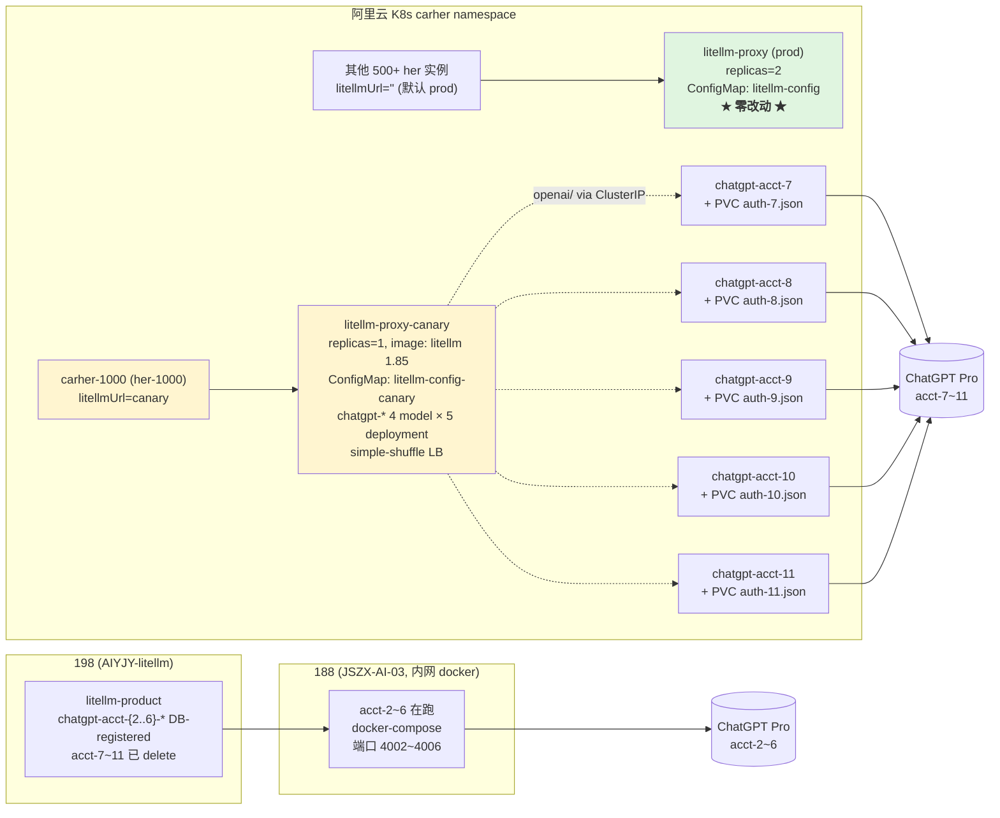
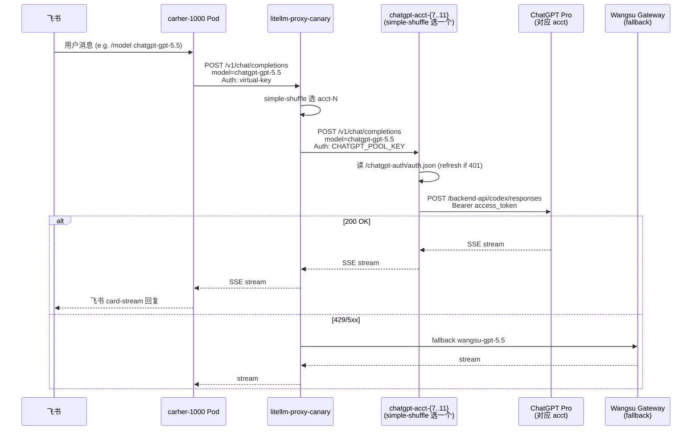

# ChatGPT Pro 账户池迁移到阿里云 K8s — C-2 五账号池金丝雀方案（最终版）

> 2026-05-20 完成。**C-2 是最终落地方案**（B-1 / B-2 / C-1 已迭代废弃，第 1 节有演进史）。

## 1. 方案演进

| 版本 | 描述 | 放弃原因 |
|------|------|---------|
| ~~B-2~~ | 阿里云独立 1 个 chatgpt-acct-11 Pod，主 litellm-proxy 通过 ClusterIP 调它 | 多一层架构无收益 |
| ~~B-1~~ | 主 litellm-proxy replicas=2→1 直跑 `chatgpt/` provider | 会影响 500+ her 实例 |
| ~~C-1~~ | canary（独立 ConfigMap）自跑 `chatgpt/` provider 服务 1 账号 acct-11 | 后续要扩 5 账号，单进程 `CHATGPT_TOKEN_DIR` 是全局 env，1 进程 = 1 账号 |
| **C-2** | 5 个独立 `chatgpt-acct-N` Pod（each 1 account）+ canary 作 openai/ 代理 simple-shuffle LB；her-1000 通过 `spec.litellmUrl` 切 canary | **采纳，已落地** |

## 2. 最终拓扑



**账号划分**：
- **acct-2~6 在 188 + 198**：团队 IDE / Codex 编程 (`cc.auto-link.com.cn/pro/v1`)
- **acct-7~11 已迁到阿里云**：carher bot（当前只 her-1000）通过 canary 走

## 3. 阿里云 K8s 资源（最终）

### 3.1 `k8s/chatgpt-acct-pool.yaml`（新建）

```
Secret      chatgpt-pool-master-key                # 共享 LITELLM_MASTER_KEY (sk-chatgpt-aliyun-...)
ConfigMap   chatgpt-pool-config                    # 共享 LiteLLM config.yaml (chatgpt provider 4 个 model)
PVC ×4      chatgpt-acct-{7,8,9,10}-auth           # NAS RWO 1Gi, acct-11-auth 复用已有
Deployment ×5  chatgpt-acct-{7,8,9,10,11}          # image=ghcr litellm 1.85, replicas=1, strategy: Recreate
Service ×5     chatgpt-acct-{7,8,9,10,11}:4000     # ClusterIP
```

每个 Pod：`CHATGPT_TOKEN_DIR=/chatgpt-auth` env + PVC 挂到 `/chatgpt-auth/auth.json` + memory limit 2Gi（1Gi 会 OOMKilled）。

### 3.2 `k8s/litellm-proxy-canary.yaml`（已改）

```yaml
- replicas: 1
- image: ghcr.io/berriai/litellm:v1.85.0
- imagePullPolicy: IfNotPresent
- nodeSelector: 已删（不再 pin 227 节点）
- env 新增: CHATGPT_POOL_KEY (from Secret chatgpt-pool-master-key)
- volumes 中 config 改用 litellm-config-canary
- (历史) chatgpt-auth volume 已删除
```

### 3.3 `k8s/litellm-proxy-canary-config.yaml`（独立 ConfigMap, prod 不动）

从 prod 复制后改 3 处：
- 删 openrouter 版 `gpt-5.4` / `gpt-5.3-codex`
- 加 4 个 chatgpt model × 5 deployment (chatgpt-acct-{7..11}.carher.svc:4000)，全部 `mode: responses`，api_key = `os.environ/CHATGPT_POOL_KEY`
- fallbacks: `chatgpt-gpt-5.5 → wangsu-gpt-5.5`, `gpt-5.4 → wangsu-gpt-5.4`

model_name 用 **`chatgpt-gpt-5.5`**（base-config + her vkey allowlist 用这个带前缀名字）；其他 3 个用裸名（`gpt-5.4` / `gpt-5.3-codex` / `gpt-5.3-codex-spark`）。

## 4. 数据流（her-1000 视角）



## 5. 执行的关键动作（已落地）

| 阶段 | 动作 | 结果 |
|------|------|------|
| A | 188 stop `litellm-chatgpt-{7,8,9,10,11}` 5 个容器 | ✅ 全部 Exit |
| A | scp 5 个 auth.json 到本地 `/tmp/chatgpt-acct-migrate/` | ✅ |
| F | apply `k8s/chatgpt-acct-pool.yaml` | ✅ 16 K8s 资源创建 |
| F | kubectl cp 4 个 auth.json (acct-11 复用 PVC 已有) | ✅ 5/5 Pod ready |
| F | curl 5 个 acct 各调 chatgpt 上游 | ✅ 5/5 返回 "ok"/"7"/"8"/.../ |
| G | 改 canary ConfigMap 4 model × 5 deployment | ✅ |
| G | 改 canary Deployment 删 chatgpt-auth + 加 CHATGPT_POOL_KEY env | ✅ rollout 完成 |
| G | her-1000 vkey 调 3 model | ✅ 全部 200 |
| D | 飞书发消息测试 → 10 个 POST /chat/completions 200 OK | ✅ |
| E | 198 prod 删 chatgpt-acct-7~11 共 20 个 deployment via admin API | ✅ HTTP 200 × 20 |
| E | 198 prod rollout restart litellm-proxy | ✅ stale router 已 clear |

## 6. 关键验证证据

### 5 个 Pod 各自调 ChatGPT 上游

```
=== acct-7  === content "7"   ✅
=== acct-8  === content "8"   ✅
=== acct-9  === content "9"   ✅
=== acct-10 === content "10"  ✅
=== acct-11 === content "11"  ✅
```

### 飞书 → carher-1000 → canary → 5 acct LB 链路

- canary access log: 10 个 `POST /chat/completions 200 OK` 来自 `172.16.0.37` (carher-1000 Pod IP)
- carher-1000 log: `"已切到 gpt-5.5，现在我在用 litellm/chatgpt-gpt-5.5"`
- 模型切换实际生效，飞书侧 card-stream 正常回复

### **核心未知风险已排除**

| 风险 | 状态 |
|------|------|
| 上游 IP 风控触发 token_invalidated（acct-N 源 IP 从 188 公网换阿里云 SG） | ✅ 5/5 acct 调用全部 200，未触发 |
| LiteLLM 1.85 vs canary 原 1.83.14 兼容性 | ✅ 1.85 正常 |
| 多账号并发 token refresh 冲突 | ✅ per-account 单进程 single-writer 设计排除 |

## 7. 回滚路径

| 失败场景 | 回滚 |
|---------|------|
| 阿里云 chatgpt-acct-N Pod 大规模挂了 | `kubectl patch her her-1000 -n carher --type=merge -p '{"spec":{"litellmUrl":""}}'` 切回 prod（prod 没 chatgpt 流量，会走 wangsu fallback） |
| canary 配置 / model_list 损坏 | `git revert k8s/litellm-proxy-canary-config.yaml + kubectl apply + rollout restart` |
| 某个 acct token_invalidated | 用 `re-oauth.sh acct-N` (188 上 SOP)，新 auth.json `kubectl cp` 到对应 Pod PVC + rollout restart Deployment |
| 想恢复 198 prod acct-7~11 流量（不太可能） | 188 `docker compose start litellm-chatgpt-{7..11}` + 198 admin API 重新 `/model/new` 注册（参考 chatgpt-pro-litellm skill） |

## 8. 待办 / 未来优化

- [ ] **撞限率监控**：5 acct simple-shuffle 跑一段时间观察单 acct 5h% 用量分布，必要时优化 routing
- [ ] **`chatgpt-acct-pool.yaml` 加 PVC chatgpt-acct-11-auth 定义**（当前定义在 `k8s/litellm-proxy-canary.yaml` 顶部，资源归属不清晰）
- [ ] **更广 her 实例接入**：当前只 her-1000；如果业务想推到其他 her，需评估上游 5 acct 容量
- [ ] **关 188 acct-7~11 容器后**保留 30 天作冷备份；30 天后清理 `/Data/chatgpt-auth/acct-{7..11}/` 目录
- [ ] **撞限自动切换 / IP 风控应急脚本**：再次出现 token_invalidated 时 5 acct pool 的应急运维 SOP

## 9. 与原始指令的差异说明

| 原始指令 | 实际落地 | 原因 |
|---------|---------|------|
| model 取名 `gpt-xxxx` 裸名 | gpt-5.4/5.3-codex/5.3-codex-spark 裸名；**gpt-5.5 用 `chatgpt-gpt-5.5`**（带前缀） | base-config 和 her vkey allowlist 命名是 `chatgpt-gpt-5.5`，不改命名兼容现有 |
| routing latency-based | 用默认 simple-shuffle | 5 个 acct 一致性强，simple-shuffle 配 LiteLLM 自带 cooldown 已足够；latency-based 是全局开关会影响其他 multi-deployment 组 |
| master key 复用 188 的 | 新建 `sk-chatgpt-aliyun-...`（按推荐） | 公网/内网 master key 隔离 |
| 通过 188 公网 NAT 调用 | 全部搬到阿里云内网（C-2 升级） | 阿里云能出国，无需中转 |
