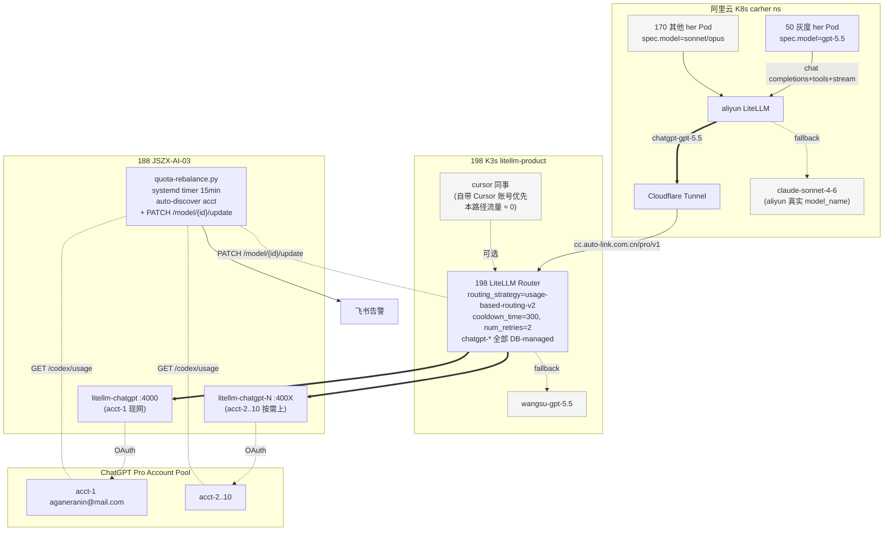

# ChatGPT Pro 共享池 + Carher gpt-5.5 切换 — 落地技术方案

**状态**：待实施
**日期**：2026-05-17
**关联**：完整设计参考 [chatgpt-pro-rollout-plan.md](chatgpt-pro-rollout-plan.md)（1629 行综合文档）
**本文目的**：以执行为导向，按 **目标 / 实现逻辑 / 技术实现 / 落地过程 / 风险项** 五段式给出可直接照做的技术方案

---

## 目录

1. [目标](#1-目标)
2. [实现逻辑](#2-实现逻辑)
3. [技术实现](#3-技术实现)
4. [落地过程](#4-落地过程)
5. [风险项与应对](#5-风险项与应对)
   - 5.1 [技术风险](#51-技术风险)
   - 5.2 [业务风险](#52-业务风险)
   - 5.3 [应急预案](#53-应急预案)
   - **5.4 [⚠️ 已知约束 — Carher 切 GPT-5.5 暂不可行（2026-05-18 实测）](#54-已知约束--carher-切-gpt-55-暂不可行2026-05-18-实测结论)**
6. [附录](#6-附录)

---

## 1. 目标

### 1.1 业务目标

把 220 个 carher her bot（飞书 AI 助手）的主力 LLM 从 **Claude Sonnet 4.6（按 token 计费）** 切换到 **GPT-5.5（ChatGPT Pro $200 订阅，等于无限调用）**，预期效果：

| 指标 | 现状 | 目标 |
|------|------|------|
| 月度 LLM spend | ~$200k+（主力 Sonnet）| 大幅压降（10 个订阅账号 = $2k/月固定）|
| Carher 实例数 | 220（200+ 活跃）| 不变 |
| Cursor / Codex 用户备用通道 | 现 198 prod 仅 1 个 chatgpt 容器 | 共享同一个 188 账号池，**作为备用容量管道铺好但不主动推**（user 故意保留同事自带的 Cursor 账号路径）|

### 1.2 技术目标

| 维度 | 目标 |
|------|------|
| 容量利用 | 10 个 ChatGPT Pro 账号自动负载均衡，撞限自动顶替 |
| 用户体验 | Carher 用户回复延迟 ≤ 现状 × 1.8；Cursor 用户**零感知** |
| 故障兜底 | 双层 fallback：chatgpt → wangsu-gpt → wangsu-claude-sonnet，任意单点挂掉服务不断流 |
| 回滚耗时 | 单实例 ≤ 5 秒；全量回滚 ≤ 5 秒（一行 `kubectl patch`）|
| 自动调度 | 撞 5h / 周限自动下线、reset_at 后自动恢复，**全程无人工干预** |
| 新加账号上线 | ≤ 3 分钟（一键脚本，零中断）|

### 1.3 成功标准（Stage 2 完成后 14 天观察期）

- [ ] 50 个灰度实例 200 OK 率 ≥ 99.5%
- [ ] 无任一 ChatGPT Pro 账号撞 weekly cap（used_percent ≥ 90% 持续 > 24h）
- [ ] Fallback 触发率 ≤ 5%（即 95% 以上请求由 chatgpt 链路服务，wangsu 仅兜底）
- [ ] Carher 用户飞书消息无"her 没回 / her 回错"投诉
- [ ] 平均回复延迟 p95 ≤ Sonnet 基线 × 1.8

---

## 2. 实现逻辑

### 2.1 整体架构



### 2.2 关键设计决策

| 决策 | 选择 | 理由 |
|------|------|------|
| **chatgpt-* 模型存储** | DB-managed（admin API `/model/new` 注册）| LiteLLM v1.84.0 实测：ConfigMap-loaded 模型不能被 admin API PATCH/DELETE。只有 DB 模型支持运行时改 rpm，是自动调度的前提 |
| **多账号编排** | N 个独立 docker 容器（一容器一 OAuth）| 单进程多 token 互踢概率高（5-15%），故障隔离最重要 |
| **路由策略** | `usage-based-routing-v2` + 动态 rpm | 按 RPM 余量分散，且 rpm 是硬上限可保护账号 |
| **撞限保护** | 三层叠加：cron PATCH rpm（提前）+ LiteLLM cooldown_time=300（撞 429 秒级）+ fallback 链（兜底）| 单一机制都有盲区 |
| **账号扩容节奏** | 3 起步、按 quota-cron 周% 阈值按需扩到 10 | 自然错峰避免 weekly 同步撞墙；不预先排激活时间表 |
| **Cursor 用户绑定** | 标签路由（机制 A）| 所有 deployment 同名 `chatgpt-gpt-5.5`，用户视角零感知；机制 B（命名模型）会泄露 deployment 名 |
| **Carher 流量分配** | 永远走 untagged 共享池 | carher 量大但单 bot 流量轻，散开比集中合理；与 cursor 重度用户隔离 |
| **监控周期** | 15 分钟 | 50 实例规模单账号 15min 最多消耗 5-8% 配额；避免 1min 高频刺激 OpenAI 反爬 |
| **碎片化告警** | 边沿触发（仅档位切换时发飞书）| OFFLINE 期间不刷屏 |

### 2.3 数据流（请求路径）

#### 主流量路径
```
her Pod (gpt-5.5) → aliyun LiteLLM → Cloudflare Tunnel
                  → 198 LiteLLM (DB-managed chatgpt-*)
                  → 188 docker (litellm-chatgpt-N)
                  → ChatGPT Pro acct-N
```

#### 撞限自动顶替路径
```
T0: acct-1 weekly 75% → quota-cron PATCH rpm=5
T0+1min: 100 个新请求到 198 LiteLLM
        usage-based-routing-v2:
          acct-1 RPM 余量 ≈ 0
          acct-2/3 RPM 余量 = 不限
        → 95+ 请求落到 acct-2/3（用得少的顶上去）
        → 5 个零星请求落到 acct-1
T0+1h: acct-1 weekly 91% → quota-cron PATCH rpm=0
        → acct-1 完全停止接流量
T0+2d: acct-1 周窗口部分滚出，weekly 65% → cron PATCH rpm=30
        → 流量逐步回流（自动恢复）
```

#### Fallback 兜底路径
```
chatgpt-gpt-5.5 (10 deployments 全 OFFLINE)
  ├── 198 router 看 model_group 全冷却
  └── 触发 198 fallbacks: chatgpt-gpt-5.5 → wangsu-gpt-5.5
        ↓ 若 wangsu-gpt-5.5 也挂
        ↓ 触发 aliyun fallbacks: chatgpt-gpt-5.5 → claude-sonnet-4-6
              ↓ 用户始终有响应（最坏延迟 +1 秒、风格略变）
```

---

## 3. 技术实现

### 3.1 188 主机：ChatGPT 容器池

**文件**：`/Data/chatgpt-auth/docker-compose.yml`

```yaml
x-chatgpt-common: &chatgpt-common
  image: ghcr.io/berriai/litellm:main-stable
  restart: unless-stopped
  environment:
    - LITELLM_LOG=INFO
    - CHATGPT_TOKEN_DIR=/chatgpt-auth
  networks: [chatgpt-net]

services:
  litellm-chatgpt:           # acct-1，端口 4000，**保留现网容器名**
    <<: *chatgpt-common
    container_name: litellm-chatgpt
    ports: ["4000:4000"]
    volumes: ["./acct-1:/chatgpt-auth"]
  litellm-chatgpt-2:
    <<: *chatgpt-common
    container_name: litellm-chatgpt-2
    ports: ["4001:4000"]
    volumes: ["./acct-2:/chatgpt-auth"]
  # acct-3..10 按需添加（端口 4002..4009）

networks:
  chatgpt-net: { driver: bridge }
```

**端口约定**：`acct-N` → 端口 `4000 + N - 1`（acct-1=4000, acct-2=4001, ..., acct-10=4009）

**auth.json 路径**：`/Data/chatgpt-auth/acct-N/auth.json`，权限 `600`

### 3.2 198 prod LiteLLM：chatgpt-* 全部 DB-managed

**关键变更**：从 ConfigMap 移除 chatgpt-* 模型，全部通过 `/model/new` admin API 注册。

#### 3.2.1 ConfigMap（保留 wangsu / anthropic / 其他静态模型）

```yaml
# /root/litellm-product-manifests/30-cm-litellm-config.yaml
model_list:
  # 保留：wangsu-* / anthropic.* / claude-* 等所有非 chatgpt 模型
  # 删除：chatgpt-gpt-5.5 / chatgpt-gpt-5.4 / chatgpt-gpt-5.3-codex / chatgpt-gpt-5.3-codex-spark

router_settings:
  routing_strategy: usage-based-routing-v2
  cooldown_time: 300
  num_retries: 2
  allowed_fails: 3
  enable_tag_filtering: true
  fallbacks:
    - chatgpt-gpt-5.5: [wangsu-gpt-5.5]
    - chatgpt-gpt-5.4: [wangsu-gpt-5.4]

general_settings:
  store_model_in_db: true   # 已开 — 保证 admin API 注册的模型持久化
  master_key: os.environ/LITELLM_MASTER_KEY
```

#### 3.2.2 DB-managed deployments（每账号 4 个模型 × N 账号）

通过 `/model/new` admin API 动态注册，每个 deployment 结构：

```json
{
  "model_name": "chatgpt-gpt-5.5",
  "litellm_params": {
    "model": "openai/chatgpt-gpt-5.5",
    "api_base": "http://10.68.13.188:4000",
    "api_key": "sk-chatgpt-188-acct1"
  },
  "model_info": {
    "id": "chatgpt-acct-1-gpt-5.5",
    "mode": "responses"
  }
}
```

**id 命名约定**（与 quota-cron 自动发现规则配套）：
- `chatgpt-{acct-name}-{model-suffix}`
- 例：`chatgpt-acct-1-gpt-5.5`、`chatgpt-acct-3-gpt-5.4`

### 3.3 阿里云 carher LiteLLM：加 chatgpt 通道 + fallback

#### 3.3.1 ConfigMap

```yaml
# carher ns LiteLLM ConfigMap
model_list:
  # 新增 — 通往 198 prod 的桥
  - model_name: chatgpt-gpt-5.5
    litellm_params:
      model: openai/chatgpt-gpt-5.5
      api_base: https://cc.auto-link.com.cn/pro/v1
      api_key: os.environ/CARHER_TO_198_KEY
    model_info:
      id: aliyun-carher-bridge-chatgpt-5.5
      mode: responses

router_settings:
  fallbacks:
    - chatgpt-gpt-5.5:
        - wangsu-gpt-5.5                # 同模型族优先
        - claude-sonnet-4-6             # 异族兜底（aliyun 现网真实 model_name，Day -1 实测）
```

#### 3.3.2 Deployment 注入 Secret 到环境变量（**易漏步骤**）

LiteLLM Pod 必须能拿到 `CARHER_TO_198_KEY` 环境变量。需要 patch Deployment：

```yaml
# carher ns Deployment patch
spec:
  template:
    spec:
      containers:
      - name: litellm-proxy
        env:
        - name: CARHER_TO_198_KEY
          valueFrom:
            secretKeyRef:
              name: carher-to-198-bridge
              key: CARHER_TO_198_KEY
```

应用：
```bash
kubectl -n carher create secret generic carher-to-198-bridge \
  --from-literal=CARHER_TO_198_KEY=sk-...

kubectl -n carher patch deploy litellm-proxy --patch-file litellm-env.yaml
kubectl -n carher rollout restart deploy/litellm-proxy
```

#### 3.3.3 198 prod 配套 key（give to carher）

```
key_alias: aliyun-carher-bridge
models: [chatgpt-gpt-5.5, chatgpt-gpt-5.4, chatgpt-gpt-5.3-codex,
         chatgpt-gpt-5.3-codex-spark, wangsu-gpt-5.5]
metadata: { purpose: "carher-bridge" }    # ← 不打 tags，自然走共享池
budget: 不限                                # 订阅制
tpm/rpm: 不限                              # 依赖 198 router cooldown
```

### 3.4 carher-admin 加 gpt-5.5 别名

**改动文件**：`backend/config_gen.py`

```python
PROVIDER_MODEL_MAP = {
    "litellm": {
        "sonnet":  "litellm/claude-sonnet-4-6",
        "opus":    "litellm/claude-opus-4-6",
        "gpt-5.5": "litellm/chatgpt-gpt-5.5",   # ← 新增
    },
    "wangsu": {
        # ... existing
        "gpt-5.5": "wangsu-gpt-5.5",            # ← 新增（直连兜底备用）
    },
}
```

前端：`frontend/src/models.js` 加：
```javascript
{ id: "gpt-5.5", name: "GPT-5.5 (ChatGPT Pro)", api: "openai-completions",
  reasoning: true, input: ["text", "image"],
  contextWindow: 400000, maxTokens: 128000,
  cost: { input: 0, output: 0, cacheRead: 0 } }
```

测试 + 部署：
```bash
# 单元测试
cd /Users/Liuguoxian/codes/carher-admin
python -m pytest backend/tests/test_config_gen.py -v -k "gpt"

# 在构建服务器构建（禁止本地 Mac 构建，架构不匹配）
ssh user@47.84.112.136 'cd /path/to/carher-admin && git pull && \
  nerdctl build -t cltx-her-ck-registry-vpc.ap-southeast-1.cr.aliyuncs.com/carher/admin:latest . && \
  nerdctl push cltx-her-ck-registry-vpc.ap-southeast-1.cr.aliyuncs.com/carher/admin:latest'

# 阿里云滚动更新
kubectl -n carher-admin rollout restart deploy/carher-admin
kubectl -n carher-admin rollout status deploy/carher-admin
```

### 3.5 quota-rebalance：自动调度核心

**文件**：`scripts/quota-rebalance.py`（新增）

#### 3.5.1 健康度分档

| 档位 | 5h 触发 | 周触发 | 目标 rpm | 说明 |
|------|---------|--------|----------|------|
| 🟢 HEALTHY | < 60% | < 50% | **999999**（远超峰值，等同不限）| 全速服务 |
| 🟡 SLOW | 60-85% | 50-75% | 30 | 减速保留容量 |
| 🟠 THROTTLE | 85-95% | 75-90% | 5 | 应急储备 |
| 🔴 OFFLINE-5H | ≥ 95% | — | 0 | 5h 下线，最长 5h 自动恢复 |
| 🔴 OFFLINE-WEEK | — | ≥ 90% | 0 | 周下线，最长 7d 自动恢复 |

> **⚠️ 实测发现**：LiteLLM v1.84.0 的 `PATCH /model/{id}/update` 对 `rpm=null` 不工作（保留上次值），必须用 `rpm=999999` 作为 HEALTHY 档的"等同不限"值。50 实例峰值约 8 calls/min/account，999999 远超实际负载。

#### 3.5.2 关键逻辑

```python
TIER_RPM = {
    "HEALTHY":      999999,   # 实测：null 不生效，必须用大数
    "SLOW":         30,
    "THROTTLE":     5,
    "OFFLINE-5H":   0,
    "OFFLINE-WEEK": 0,
}

# 自动发现账号（新加 acct 只需 scp auth.json，下个 cron 周期自动纳入）
def discover_accounts():
    return {
        p.parent.name: f"chatgpt-{p.parent.name}-gpt-5.5"
        for p in sorted(Path("/Data/chatgpt-auth").glob("acct-*/auth.json"))
    }

# 分档（5h 与周独立判定，取最严档）
def classify(usage):
    rl = usage["rate_limit"]
    p_pct, p_reset = rl["primary_window"]["used_percent"], rl["primary_window"]["reset_at"]
    w_pct, w_reset = rl["secondary_window"]["used_percent"], rl["secondary_window"]["reset_at"]
    if p_pct >= 95: return ("OFFLINE-5H", p_reset)
    if w_pct >= 90: return ("OFFLINE-WEEK", w_reset)
    if p_pct >= 85 or w_pct >= 75: return ("THROTTLE", min(p_reset, w_reset))
    if p_pct >= 60 or w_pct >= 50: return ("SLOW", None)
    return ("HEALTHY", None)

# 调度（PATCH 198 LiteLLM admin API）
def patch_rpm(model_id, rpm):
    """实测注意：rpm=null 不生效；用 999999 表示不限，0 表示下线"""
    requests.patch(
        f"{LITELLM_BASE}/model/{model_id}/update",
        headers={"Authorization": f"Bearer {LITELLM_MK}"},
        json={"model_id": model_id, "litellm_params": {"rpm": rpm}}
    )

# 状态查询：直查 DB（不能用 GET /model/info — 实测它的 rpm 字段与 DB 不同步）
def query_actual_rpm(model_id):
    """走 LiteLLM Postgres 直查，确认 rpm 是否真生效"""
    # SELECT litellm_params->'rpm' FROM "LiteLLM_ProxyModelTable" WHERE model_info->>'id' = ?
    ...
```

完整脚本见 [chatgpt-pro-rollout-plan.md §5.5.2](chatgpt-pro-rollout-plan.md)。

#### 3.5.3 部署（systemd timer，188 主机）

```ini
# /etc/systemd/system/chatgpt-quota.timer
[Timer]
OnCalendar=*-*-* *:00,15,30,45:00
AccuracySec=10s
Persistent=true

# /etc/systemd/system/chatgpt-quota.service
[Service]
Type=oneshot
EnvironmentFile=/etc/chatgpt-quota.env
ExecStart=/usr/bin/python3 /home/cltx/quota-rebalance.py
StandardOutput=append:/var/log/chatgpt-quota.log
```

`/etc/chatgpt-quota.env`：
```
LITELLM_BASE=http://10.68.13.198:30402
LITELLM_MK=<198 prod LITELLM_MASTER_KEY>
FEISHU_WEBHOOK=https://open.feishu.cn/open-apis/bot/v2/hook/xxx
```

### 3.6 标签路由（cursor 用户分组绑定）

**触发时机**：当某 cursor key 7d chatgpt-* calls > 500 → 启动重度对绑定。**Day 0 不启用**，先全部走共享池。

#### 3.6.1 deployment tag 设计

```yaml
# 注册到 198 DB 的 chatgpt-* deployment（通过 /model/new）
- model_name: chatgpt-gpt-5.5
  litellm_params:
    api_base: http://10.68.13.188:4000
    tags: ["heavy-pair-1"]              # ← 重度对 1 独享
  model_info: { id: chatgpt-acct-1-gpt-5.5 }

- model_name: chatgpt-gpt-5.5
  litellm_params:
    api_base: http://10.68.13.188:4002
    # 无 tags                            # ← untagged 共享池
  model_info: { id: chatgpt-acct-3-gpt-5.5 }
```

#### 3.6.2 Key 绑定

```bash
# alice/bob 重度对 1
curl -X POST $LITELLM/key/update \
  -H "Authorization: Bearer $MK" \
  -d '{
    "key": "<alice-token>",
    "metadata": {"tags": ["heavy-pair-1"], "purpose": "cursor", "owner_name": "alice"}
  }'

# 轻度用户：metadata 不含 tags，自动落 untagged 共享池
```

#### 3.6.3 Carher 永远走共享池

aliyun-carher-bridge 这把 key **不打 tags**，220 个 her bot 流量均匀散在 untagged 池子（避免与 cursor 重度用户互扰）。

### 3.7 Fallback 链

#### 3.7.1 198 prod 内部（chatgpt 全 OFFLINE 时）

```yaml
# 198 prod ConfigMap router_settings
fallbacks:
  - chatgpt-gpt-5.5: [wangsu-gpt-5.5]
  - chatgpt-gpt-5.4: [wangsu-gpt-5.4]
```

#### 3.7.2 aliyun → 198 链路全挂时

```yaml
# aliyun carher LiteLLM router_settings
fallbacks:
  - chatgpt-gpt-5.5:
      - wangsu-gpt-5.5
      - claude-sonnet-4-6              # 终极兜底（aliyun 真实 model_name）
```

#### 3.7.3 应用层兜底（5 秒全量回滚）

```bash
# 紧急回滚：所有 gpt-5.5 实例切回 sonnet
kubectl -n carher get herinstance -o json \
  | jq -r '.items[] | select(.spec.model == "gpt-5.5") | .metadata.name' \
  | xargs -I{} kubectl -n carher patch herinstance {} --type merge \
      -p '{"spec":{"model":"sonnet"}}'
```

---

## 4. 落地过程

### 4.1 时间表总览

| 阶段 | 时段 | 工作量 |
|------|------|--------|
| Day -1 | 半天 | 前置验证 + 准备 |
| Day 0 | 一天 | 基础设施 + ConfigMap → DB 迁移 + Stage 0 沙盒上线 |
| Day 1-2 | 2 天 | Stage 0 观察期（沙盒 48h）|
| Day 3-5 | 3 天 | Stage 1（5 实例 48h 观察）|
| Day 6-8 | 3 天 | Stage 2 分批切（每天 ~15 实例）|
| Day 9-22 | 14 天 | 长期观察 + 按需扩账号 |

### 4.2 Day -1：前置验证

**目标**：把所有未验证的假设证伪或证实，避免 Day 0 卡壳。

| # | 验证项 | 命令 | 预期 | **2026-05-17 实测** |
|---|--------|------|------|------|
| 1 | `/codex/usage` endpoint 可达 | 见 §6 附录 A 探针脚本 | 返回 `plan_type: pro` + 5h%/周% | ✅ 已通过（acct-1 5h=22% 周=9%）|
| 2 | aliyun carher LiteLLM 版本 ≥ v1.84 | `kubectl --context aliyun -n carher get deploy litellm-proxy -o jsonpath='{...image}'` | 版本号确认 | ✅ **`v1.84.0-20260516`**，与 198 prod 同版本 |
| 3 | 198 LiteLLM admin API 5 项（new/PATCH/delete）| 见附 B [verify-admin-api.sh](../scripts/verify-admin-api.sh) | 全 HTTP 200 + DB 写入正确 | ✅ 已通过（已实测）|
| 4 | `cc.auto-link.com.cn/pro/v1` 真指向 198 prod | `curl https://cc.auto-link.com.cn/pro/v1/models` | LiteLLM 标准 401 错误 | ✅ HTTP 401 "Virtual Key expected"，确认是真 LiteLLM |
| 5 | acct-2/3 的 auth.json 生成方式 | 见 §4.3.1（OAuth device code 在 188 docker 跑）| flat schema：`access_token` / `id_token` / `account_id` | ✅ 流程已确认（**不是** `dev-chatgpt-grant-cursor.sh`，是 LiteLLM Python `ChatGPTConfig.get_device_code()`）|
| 6 | LiteLLM Postgres `pg_dump` 备份能力 | `kubectl exec litellm-db-0 -- pg_dump --schema-only ...` | 输出 ≥ 数百行 | ✅ schema-only dump 3236 行 |
| 7 | aliyun carher LiteLLM tag filter 行为 | `enable_tag_filtering: true` 已在 ConfigMap 启用 | 启用状态确认 | ✅ ConfigMap 已确认开启；**live 行为测试改在 Stage 0 沙盒一并跑**（用真 her-gpt55-sandbox 实例的 cursor key 验证）|
| 8 | carher pi-ai 处理 `finish_reason="stop"` + 非空 `tool_calls` | dev 环境跑一轮 tool calling | 工具调用成功执行 | ⏭ dev 已验证；**Stage 0 沙盒 48h 观察期再次确认**（必跑 §6.1 的 48h 测试清单第 2-3 项）|

**全部 8 项过 → 进 Day 0；任何一项不过 → 暂停，调整方案再说。**

**当前状态**：6 项已通过验证 + 2 项推迟到 Stage 0 验证（不阻塞 Day 0 推进）。

### 4.3 Day 0：基础设施 + ConfigMap → DB 迁移

#### 4.3.1 准备物料（人工）

- [ ] 收集 acct-2 / acct-3 的 ChatGPT Pro 账号凭据
- [ ] **OAuth 生成 acct-2/3 的 auth.json**（**不是** `dev-chatgpt-grant-cursor.sh` — 那是改 LiteLLM key allowlist 的）

  实际流程见 [`~/.claude/skills/chatgpt-pro-litellm/SKILL.md` "OAuth 首次授权" 章节](file:///Users/Liuguoxian/.claude/skills/chatgpt-pro-litellm/SKILL.md)。摘要：

  ```bash
  # 必须在 188 上跑（auth.openai.com 在 198 被 GFW 拦）
  ssh cltx@10.68.13.188
  mkdir -p /Data/chatgpt-auth/acct-2
  docker run --rm -it \
    --entrypoint python3 \
    -v /Data/chatgpt-auth/acct-2:/Data/chatgpt-auth \
    -e CHATGPT_TOKEN_DIR=/Data/chatgpt-auth \
    ghcr.io/berriai/litellm:main-stable \
    -c "
  from litellm.llms.ChatGPT.chat.handler import ChatGPTConfig
  import asyncio, json
  async def auth():
      cfg = ChatGPTConfig()
      result = await cfg.get_device_code()
      print('Device code:', result.get('user_code'))
      print('URL:', result.get('verification_uri'))
      token = await cfg.poll_device_auth(result['device_code'])
      with open('/Data/chatgpt-auth/auth.json', 'w') as f:
          json.dump(token, f)
  asyncio.run(auth())
  "

  # 浏览器打开 https://auth.openai.com/codex/device，输入 user_code，登录新账号 acct-2 邮箱
  # 容器打印 Done 后 /Data/chatgpt-auth/acct-2/auth.json 已写入
  ```

  acct-3 同上，目录改 `/Data/chatgpt-auth/acct-3`。

- [ ] 飞书私密 wiki 记录 `acct-N → 邮箱` 映射（**不入 git**）

#### 4.3.2 188 容器化

```bash
ssh cltx@10.68.13.188

# 1. 上传 auth.json
mkdir -p /Data/chatgpt-auth/acct-{2,3}
chmod 700 /Data/chatgpt-auth/acct-{2,3}
# scp 把 acct-2.auth.json acct-3.auth.json 上来

# 2. 把 acct-1 的现网 auth 移到子目录（容器名/端口不变）
mkdir -p /Data/chatgpt-auth/acct-1
# 从 docker volume 拷贝当前 auth.json 到 /Data/chatgpt-auth/acct-1/
# 注意：保持现网 4000 端口、容器名不变

# 3. 写 docker-compose.yml（见 §3.1）
vim /Data/chatgpt-auth/docker-compose.yml

# 4. 启 acct-2 / acct-3 容器（acct-1 已运行不动）
cd /Data/chatgpt-auth
docker compose up -d litellm-chatgpt-2 litellm-chatgpt-3
for p in 4000 4001 4002; do curl -sS http://localhost:$p/health | head -3; done
```

**Gate**：3 个端口都 healthy。

#### 4.3.3 198 prod ConfigMap → DB 迁移（**关键步骤，零中断**）

> **Dry-run 已在 dev (litellm-dev ns) 完整跑通**（2026-05-17）：
> - POST /model/new 加 DB-managed deployment ✅
> - /model/info 自动显示 ConfigMap + DB 共存（2 个 deployment 同 model_name 不同 id）✅
> - PATCH rpm=50 在 DB 模型上立刻生效 ✅
> - POST /model/delete 干净不残留 ConfigMap ✅
>
> **198 prod LiteLLM 是 2 副本 + RollingUpdate（maxUnavailable 25%）→ rollout 期间永远至少 1 副本可服务，零中断**。

**⚠️ 双写期陷阱**：ConfigMap 删条目和 rollout 之间，如果 ConfigMap 和 DB 都包含同一个 acct-1 的 chatgpt-* deployment，LiteLLM router 会把它们当**两个独立 deployment 负载均衡**。但 quota-cron 只能 PATCH DB 那个的 rpm，**ConfigMap 那个永远不受调度** — 50% 的 acct-1 流量会绕过限速保护。所以：步骤 2 → 3 → 4 必须连续做完，期间不停顿。

```bash
MK=$(jms ssh AIYJY-litellm "kubectl get secret litellm-secrets -n litellm-product \
  -o jsonpath='{.data.LITELLM_MASTER_KEY}' | base64 -d")

# 1. 备份 ConfigMap
jms ssh AIYJY-litellm "kubectl get cm -n litellm-product litellm-config -o yaml \
  > /root/cm-backup-$(date +%F).yaml"

# 2. 通过 /model/new 注册 acct-1/2/3 × 4 模型 = 12 个 deployment 到 DB
for acct in acct-1 acct-2 acct-3; do
  N=${acct#acct-}; PORT=$((4000 + N - 1))
  for model in chatgpt-gpt-5.5 chatgpt-gpt-5.4 chatgpt-gpt-5.3-codex chatgpt-gpt-5.3-codex-spark; do
    SUFFIX=${model#chatgpt-}
    jms ssh AIYJY-litellm "curl -fsS -X POST http://localhost:30402/model/new \
      -H 'Authorization: Bearer $MK' -H 'Content-Type: application/json' \
      -d '{
        \"model_name\": \"$model\",
        \"litellm_params\": {
          \"model\": \"openai/$model\",
          \"api_base\": \"http://10.68.13.188:$PORT\",
          \"api_key\": \"sk-chatgpt-188-$acct\"
        },
        \"model_info\": {
          \"id\": \"chatgpt-${acct}-${SUFFIX}\",
          \"mode\": \"responses\"
        }
      }'"
  done
done

# 3. 验证 12 个 deployment 真在 DB
jms ssh AIYJY-litellm "kubectl exec litellm-db-0 -n litellm-product -- \
  psql -U litellm -d litellm -c \"SELECT count(*) FROM \\\"LiteLLM_ProxyModelTable\\\" WHERE model_name LIKE 'chatgpt-%';\""
# 预期：12

# 4. 编辑 ConfigMap 删掉 chatgpt-* 那 4 个静态 model_list 条目（双写期开始）
#    保留 wangsu / anthropic / fallback 等其他配置
jms ssh AIYJY-litellm "kubectl edit cm -n litellm-product litellm-config"

# 5. **立即** rollout LiteLLM（双写期窗口越短越好）
#    2 副本 RollingUpdate → 零中断；典型 60-90 秒完成
jms ssh AIYJY-litellm "kubectl -n litellm-product rollout restart deploy/litellm-proxy && \
  kubectl -n litellm-product rollout status deploy/litellm-proxy"

# 6. 流量回归
curl -sS -N https://cc.auto-link.com.cn/pro/v1/chat/completions \
  -H "Authorization: Bearer $PROD_KEY" \
  -d '{"model":"chatgpt-gpt-5.5","messages":[{"role":"user","content":"ping"}],"stream":true}' \
  | head -5

# 看 SpendLogs 确认 model_id 是 chatgpt-acct-1-gpt-5.5（DB-managed），不是旧的 chatgpt/gpt-5.5
```

**Gate**：
- DB ProxyModelTable 12 行
- ConfigMap 已删 chatgpt-*
- LiteLLM rollout 成功
- SSE smoke test 200 OK
- SpendLogs `model_id` 切到 DB-managed id

#### 4.3.4 carher-admin 加别名 + 部署

详见 §3.4，此处不重复。

**Gate**：
- pytest 通过
- carher-admin Pod 滚动更新成功
- 前端能选择 gpt-5.5 模型

#### 4.3.5 阿里云 carher LiteLLM 加桥 + fallback

详见 §3.3，此处不重复。

**Gate**：
- aliyun carher LiteLLM Pod 重启后能解析 `CARHER_TO_198_KEY` 环境变量
- 在 carher ns 内 curl `chatgpt-gpt-5.5` model 返回 SSE 流

#### 4.3.6 quota-cron 部署（alert-only 版）

Day 0 先用 alert-only 版（每 5min 跑、仅告警）；Stage 1 之前升级到 auto-rebalance（15min 跑、自动 PATCH rpm）。

```bash
# 188 主机
sudo cp /tmp/quota-cron.py /home/cltx/quota-cron.py
sudo chmod 700 /etc/chatgpt-quota.env  # 含 master key
sudo systemctl daemon-reload
sudo systemctl enable --now chatgpt-quota.timer
sudo systemctl list-timers chatgpt-quota
```

**Gate**：飞书收到首次 heartbeat（15 min 内）。

#### 4.3.7 Stage 0 沙盒实例上线

```bash
# 1. 通过 carher-admin 创建 her-gpt55-sandbox 实例
#    owner = liu_guoxian open_id, model = sonnet（先 sonnet）

# 2. 切到 gpt-5.5
kubectl -n carher patch herinstance her-gpt55-sandbox --type merge \
  -p '{"spec":{"model":"gpt-5.5"}}'

# 3. 等 Pod 重启
kubectl -n carher get pod -l her=her-gpt55-sandbox -w
```

### 4.4 Day 1-2：Stage 0 观察期

#### 4.4.1 必跑测试（48h 内）

| # | 测试 | 预期 |
|---|------|------|
| 1 | 飞书发 10 条纯文本 | 每条都正常回复 |
| 2 | 触发 5 次 tool calling 单轮 | 工具执行成功 |
| 3 | 触发 3 次 tool calling 多轮（agentic）| 多轮工具串行成功 |
| 4 | 发 1 条长 prompt（> 50k tokens）| 不超时、回复正确 |
| 5 | 发 1 张图片 | 多模态识别正确 |
| 6 | **主动跑回滚演练** | 5s 内 Pod 切回 sonnet，再切回 gpt-5.5 也 5s |

#### 4.4.2 Stage 0 Gate

- [ ] 200 OK 率 ≥ 99%（48h SpendLogs）
- [ ] p95 latency < 30s
- [ ] 无 tool calling 解析错误（grep pod logs）
- [ ] 无 stream 截断
- [ ] 回滚演练 5s 内成功
- [ ] 平均 token 增长 ≤ 2.5x（gpt-5.5 无 prompt cache vs sonnet 60% cache）

不过任一项 → 不进 Stage 1，调查根因。

#### 4.4.3 quota-cron 升级到 auto-rebalance（Stage 1 之前）

跑 §6 附录 B 的 5 项验证 → 替换 cron 脚本到 auto-rebalance 版 → 改 timer 到 15min。

### 4.5 Day 3-5：Stage 1（5 低活跃实例）

```sql
-- 在 198 LiteLLM Postgres 选 5 个低活跃 carher 实例
SELECT vt.key_alias, COUNT(*) AS calls_24h
FROM "LiteLLM_VerificationToken" vt
JOIN "LiteLLM_SpendLogs" sl ON sl.api_key = vt.token
WHERE sl."startTime" > NOW() - INTERVAL '24 hours'
  AND vt.key_alias LIKE 'carher-%'
GROUP BY 1 HAVING COUNT(*) BETWEEN 10 AND 30
ORDER BY 2 LIMIT 5;
```

```bash
# 批量切
for inst in <5 个 instance id>; do
  kubectl -n carher patch herinstance $inst --type merge \
    -p '{"spec":{"model":"gpt-5.5"}}'
  sleep 10
done
```

**Stage 1 Gate**（48h 观察）：
- 5 实例 200 OK ≥ 99%
- 198 SpendLogs `model_info.id` 分布均匀到 acct-1/2/3（无单点压满）
- 3 账号无任一周% > 30%
- quota-cron 数据连续 48h 无 gap
- 飞书无 her bot 投诉

### 4.6 Day 6-8：Stage 2（50 中活跃实例分 3 批）

```sql
-- 选 50 个中活跃 carher 实例
SELECT vt.key_alias FROM "LiteLLM_VerificationToken" vt
JOIN "LiteLLM_SpendLogs" sl ON sl.api_key = vt.token
WHERE sl."startTime" > NOW() - INTERVAL '7 days'
  AND vt.key_alias LIKE 'carher-%'
GROUP BY 1 HAVING COUNT(*) BETWEEN 50 AND 200
  AND vt.key_alias NOT IN (<Stage 0/1 已切>)
ORDER BY MD5(vt.key_alias)
LIMIT 50;
```

```bash
# Day 6: 上 15 个；Day 7: 上 15 个；Day 8: 上 20 个
for inst in $(head -15 /tmp/stage2-ids.txt); do
  kubectl -n carher patch herinstance $inst --type merge -p '{"spec":{"model":"gpt-5.5"}}'
  sleep 30
done
sleep 86400
```

**账号扩容触发**（不预先排表）：
- quota-cron 报任一账号周% ≥ 50% → 一键脚本 `add-chatgpt-account.sh acct-4 ~/auth-acct4.json`
- 之后每周% 涨 20% 加 1 个账号
- 目标态：50 实例稳定后 3-7 个账号即够

**Stage 2 Gate**（14 天观察）：
- 无任一账号周% ≥ 90% 持续 > 24h
- 50 实例稳态 200 OK ≥ 99.5%
- 平均 latency p95 ≤ Sonnet 基线 × 1.8
- Fallback 触发率 ≤ 5%

### 4.7 Day 9+：长期运营

- [ ] 每周对账：188 docker 容器数 vs 198 DB deployment 数 vs ConfigMap 声明数（应一致）
- [ ] 每周复盘：飞书告警次数、自动恢复成功率、需人工介入次数
- [ ] 月度：评估是否扩到 100 carher 实例 / 启动 cursor 重度对绑定 / 升级监控（Grafana 面板）
- [ ] 季度：审计 cursor key 真用量；评估 promo 退坡（5-31 后）的实际影响

---

## 5. 风险项与应对

### 5.1 技术风险

| 风险 | 概率 | 影响 | 应对 |
|------|------|------|------|
| **PATCH rpm 在 ConfigMap 模型上 404**（已实测）| 100% | 自动调度失效 | §4.3.3 ConfigMap → DB 迁移是必须步骤 |
| **PATCH rpm=null 不清除限制**（已实测，v1.84.0 bug）| 100% | HEALTHY 档不能用 null | §3.5.1 已改用 `rpm=999999` 替代 null |
| **GET /model/info 的 rpm 字段与 DB 不同步**（已实测）| 100% | 监控误判 | quota-cron 状态查询直走 DB（`LiteLLM_ProxyModelTable`），不依赖 GET /model/info |
| **迁移双写期 ConfigMap + DB 同指 acct-1**（dry-run 已验证）| 100%（必经过渡态）| 50% acct-1 流量绕过 quota-cron 限速 | 缩短双写期：ConfigMap edit → rollout 之间不停顿；198 prod 2 副本 RollingUpdate 零中断；典型 60-90 秒完成 |
| LiteLLM tag filter v1.84 行为与文档不一致 | 中 | cursor 重度独享失效 | Day -1 #7 实证；Day 0 启动后用 §3.6.3 验证 |
| `/codex/usage` endpoint 突然 403（OpenAI 反爬升级）| 低 | quota-cron 失效 | 模拟 codex_cli_rs UA + Originator；备方"scrape /status TUI" |
| OAuth refresh token 突然失效（acct-N 401）| 中 | 该 acct 下线 | quota-cron 监控 401 + 24h re-login SOP |
| 跨网（aliyun → 198）抖动 | 中 | 单次失败 | num_retries=2 + 双层 fallback |
| 188 单点故障 | 中 | chatgpt 链路全断 | aliyun carher LiteLLM fallback 到 wangsu-claude-sonnet |
| LiteLLM Postgres 数据丢失 | 极低 | DB 内 12 个 deployment 配置丢 | Day -1 #6 备份；ConfigMap 不再含 chatgpt-* → 必须从备份恢复 |
| Prompt cache 失效（gpt-5.5 无 anthropic 1h cache）| **确定** | reasoning 时间翻倍 | 容量规划已含 50% 折扣余量；Stage 0 Gate token 增长 ≤ 2.5x |
| Stream 中途断连 | 低 | 单次重试 | num_retries + OpenClaw timeout=300 |
| 15 分钟内突发 60% → 95%+ | 低 | 单次 5h 撞限 | LiteLLM cooldown_time=300 秒级响应；下轮 cron OFFLINE-5H 设 rpm=0 |

### 5.2 业务风险

| 风险 | 概率 | 影响 | 应对 |
|------|------|------|------|
| 全 10 账号同时撞 weekly | **极低**（不一把激活）| chatgpt 全 fallback wangsu | 按需激活 + cron 75% 预警；wangsu 容量足够吸收 |
| ChatGPT Pro 全 10 账号被封（ToS 风险）| 低（user 自担）| 全切回 wangsu | 5s 全量回滚；找供应商补账号 |
| Promo 5-31 退坡 5h 容量减半 | **确定** | 单账号容量减半 | 5 账号已足以覆盖 50 实例；触发时机已知，可主动加账号 |
| Carher 用户感知"她回复变慢了" | 中 | 用户投诉 | 不主动告知（A/B 实验心态）；如投诉再解释 |
| 198 cursor 真有人切过来导致 noisy neighbor | 低（当前流量为 0）| 共享池被打满 | 监控 SpendLogs 中 cursor / carher 流量分布；真出现再加 tag 隔离 |
| Carher LiteLLM 版本 < v1.84 不支持 fallback chain | 低 | aliyun fallback 到 wangsu-sonnet 失效 | Day -1 #2 验证；不行则升级 carher LiteLLM 到 v1.84 |

### 5.3 应急预案

#### 5.3.1 灰度过程中发现严重问题（任意阶段）

```bash
# 5 秒全量回滚所有 gpt-5.5 实例到 sonnet
kubectl -n carher get herinstance -o json \
  | jq -r '.items[] | select(.spec.model == "gpt-5.5") | .metadata.name' \
  | xargs -I{} kubectl -n carher patch herinstance {} --type merge \
      -p '{"spec":{"model":"sonnet"}}'

# 验证
kubectl -n carher get herinstance -o json \
  | jq -r '.items[] | "\(.metadata.name)\t\(.spec.model)"' \
  | sort | uniq -c -f1 | sort -rn
```

#### 5.3.2 quota-cron 失控（误把所有账号设 rpm=0）

```bash
# 立即停 timer
ssh cltx@10.68.13.188 'sudo systemctl stop chatgpt-quota.timer'

# 手动把所有 chatgpt-* deployment 的 rpm 重置为 null
MK=$(...)
for id in $(curl -sS http://198/model/info -H "Authorization: Bearer $MK" \
  | jq -r '.data[] | select(.model_name | startswith("chatgpt-")) | .model_info.id'); do
  curl -X PATCH http://198/model/$id/update \
    -H "Authorization: Bearer $MK" \
    -d "{\"model_id\":\"$id\",\"litellm_params\":{\"rpm\":null}}"
done
```

#### 5.3.3 198 LiteLLM 完全不可达

aliyun carher LiteLLM 自动 fallback 到 claude-sonnet-4-6（已配 §3.7.2）。用户最坏延迟 +1 秒、风格略变，**永不断流**。

#### 5.3.4 ChatGPT Pro 全 10 账号被封

- carher 流量自动 fallback wangsu
- 联系供应商补账号
- 用 §6 附录 C 一键脚本上线新账号（≤ 3 分钟）

---

### 5.4 已知约束 — Carher 切 GPT-5.5 暂不可行（2026-05-18 实测结论）

#### 5.4.1 调研结论

经过 Day 0 完整实施 + Stage 0 灰度（her-1000 沙盒 e2e 测试），结论：

> **Carher OpenClaw 当前架构无法经 LiteLLM 调通 ChatGPT Pro**。问题不在我们的部署，
> 而是 OpenClaw 上游设计限制 + LiteLLM 已知 bug 的叠加。

#### 5.4.2 三条路径覆盖矩阵

| 路径 | 客户端 | LiteLLM 端点 | 上游协议 | 实测结果 |
|------|-------|------------|---------|---------|
| **Codex CLI/IDE** | OpenAI 官方 SDK | `/v1/responses` | responses 直通 | ✅ 工作（dev 已验证 pt=1631 ct=11） |
| **Cursor IDE** | OpenAI 兼容 client | `/v1/chat/completions` | chat 直通 | ✅ dev 验证通过 |
| **carher OpenClaw → chat** | pi-ai 自定义 client | `/v1/chat/completions` | chat→responses 桥接 | ❌ 间歇性丢内容 |
| **carher OpenClaw → responses** | pi-ai 自定义 client | `/v1/responses` | responses 直通 | ❌ event 解析不识别 |

#### 5.4.3 失败根因（带社区证据）

**chat 协议（OpenClaw → /v1/chat/completions）失败**：
- LiteLLM 的 `chatgpt/` provider 把 chat completions 桥接到 ChatGPT Pro `/backend-api/codex/responses` 时，
  在某些场景下把 `response.output_text.delta` 累积进 `delta.content` 时丢内容
- 上游 issue：[BerriAI/litellm #25429](https://github.com/BerriAI/litellm/issues/25429) "chatgpt/gpt-5.4 returns empty final Responses output"，
  状态 OPEN，未修复；v1.85.0 release 不动这块
- 实测现象：LiteLLM SpendLogs 显示 ct=21-206（aliyun 端 success），但 OpenClaw 收到的 SSE chunks delta 为空，
  报 `incomplete turn detected: stopReason=stop payloads=0`

**responses 协议（OpenClaw → /v1/responses）失败**：
- OpenClaw 自定义 provider（`models.providers.litellm`）走 streamSimple 路径，
  只发原始 provider 事件 (`text_delta`, `done`)，但 OpenClaw handler 期待 session events
  (`message_start`, `message_update`, `message_end`)
- payloads 数组永远为空 → 同样的 `incomplete turn detected` 报错
- 上游 issues：
  - [openclaw/openclaw #43018](https://github.com/openclaw/openclaw/issues/43018) "Custom providers can't use OpenAI Responses API (/v1/responses)" — 设计层面不支持
  - [openclaw/openclaw #55057](https://github.com/openclaw/openclaw/issues/55057) "Gateway Not Displaying Responses from Custom Providers (OmniRoute)" — event handler 不匹配
  - [openclaw/openclaw #36057](https://github.com/openclaw/openclaw/issues/36057) "openai-responses custom providers can drop effective tool_choice" — 同源问题

**LiteLLM 端实测正常**（不是 LiteLLM 的问题）：
- 用 `curl /v1/responses` 直接打 aliyun carher LiteLLM，能拿到完整 SSE：
  `response.output_text.delta delta="Hi"` ... `response.output_text.done text="Hi! How can I help you today?"` ... `[DONE]`
- LiteLLM SpendLogs 这条 call 标 `aresponses success`，pt/ct 都对

#### 5.4.4 决议：A 方案 — 搁置 carher 切换，保留全套基础设施

**已落地保留**（cursor/codex 同事真要用立刻可服务）：
- 188 ChatGPT Pro 容器池（acct-1:4001 token 失效中、**acct-2:4002 健康**）
- 198 prod LiteLLM 4 个 DB-managed deployment：`chatgpt-acct-2-{gpt-5.5/gpt-5.4/gpt-5.3-codex/gpt-5.3-codex-spark}`
- 198 prod ConfigMap 已清掉 chatgpt-* 静态条目（迁移到 DB 完成）
- aliyun carher LiteLLM 的 `chatgpt-gpt-5.5` 桥接 + `aliyun-carher-bridge` key + `CARHER_TO_198_KEY` secret
- 188 quota-cron systemd timer（每 15 min 自动 rebalance acct-2 rpm）
- carher-admin / carher-operator 已含 `gpt-5.5` 别名映射（升级版镜像已部署）
- CRD spec.model enum 已加 `gpt-5.5`

**不做**：
- 不主动推 carher her bot 切 gpt-5.5
- her-1000 沙盒 已恢复 `spec.paused=true, model=sonnet` 原始状态（2026-05-18 04:55）
- 不 patch LiteLLM 或 OpenClaw 源码（OpenClaw 是私有 fork `@larksuite/openclaw-lark`，改成本高）

**等待解锁条件**（任一即可重启 carher 切换）：
- LiteLLM 修复 [#25429](https://github.com/BerriAI/litellm/issues/25429)（chat→responses 桥接稳定）
- OpenClaw 修复 [#43018](https://github.com/openclaw/openclaw/issues/43018) + [#55057](https://github.com/openclaw/openclaw/issues/55057)（自定义 provider 真支持 responses）

**监控**：每月 review 上述 3 个 issue 状态。

#### 5.4.5 198 cursor/codex 路径的可用性确认

下面这条路径 **dev 已验证通过、prod 链路已就位**，cursor/codex 同事任何时候要用：

```
codex CLI/IDE / Cursor IDE
  → 198 prod LiteLLM (cc.auto-link.com.cn/pro/v1)
    chatgpt-gpt-5.5 → chatgpt-acct-2-gpt-5.5 (DB-managed, rpm=999999)
  → 188:4002 (litellm-chatgpt-2 容器, acct-2 quibrousromimil@mail.com)
  → ChatGPT Pro
```

要让同事使用：
1. 通过 `scripts/dev-chatgpt-grant-cursor.sh <name>` 给 cursor key 加 chatgpt-* 权限
2. 同事按 [chatgpt-pro-litellm SKILL.md](file:///Users/Liuguoxian/.claude/skills/chatgpt-pro-litellm/SKILL.md) "Codex CLI 接入步骤" / "Cursor 接入步骤" 配置
3. base_url 用 `https://cc.auto-link.com.cn/pro/v1`（不是 `/dev/v1`）
4. acct-1 (aganeranin) token 失效中，仅 acct-2 (quibrousromimil) 可用 — 容量充足

#### 5.4.6 当前账号池现状

| 账号 | 端口 | 状态 | LiteLLM 注册 |
|------|-----|------|------------|
| acct-1 (aganeranin@mail.com) | 188:4001 | token 失效（refresh_token 过期）| **未注册到 198 DB** |
| acct-2 (quibrousromimil@mail.com) | 188:4002 | ✅ healthy / plan_type=pro / 5h 0% 周 0% | ✅ 4 deployment 已注册 |

**acct-1 恢复方案**：在 188 跑 OAuth device code 流程重新授权，需要邮箱密码。
不阻塞 cursor/codex 使用（acct-2 容量绰绰有余）。

---

## 6. 附录

### 附 A：前置验证脚本（Day -1 用）

[完整 `/codex/usage` 探针脚本](chatgpt-pro-rollout-plan.md#附-a探针脚本已验证可用)

```bash
ssh cltx@10.68.13.188 'bash -s' << 'PROBE'
docker exec litellm-chatgpt cat /chatgpt-auth/auth.json > /tmp/auth.json
python3 << 'PY'
import json, base64, urllib.request
auth = json.load(open("/tmp/auth.json"))
tok = auth["access_token"]
aid = auth.get("account_id") or json.loads(base64.urlsafe_b64decode(
    auth["id_token"].split(".")[1] + "=="
))["https://api.openai.com/auth"]["chatgpt_account_id"]
req = urllib.request.Request(
    "https://chatgpt.com/backend-api/codex/usage",
    headers={"Authorization": f"Bearer {tok}", "chatgpt-account-id": aid,
             "Originator": "codex_cli_rs",
             "User-Agent": "codex_cli_rs/0.30.0 (Linux; x86_64)"})
print(json.dumps(json.loads(urllib.request.urlopen(req, timeout=15).read()), indent=2))
PY
PROBE
```

### 附 B：admin API 5 项验证（已实测，2026-05-17）

> ✅ **已在 198 prod 实测通过**，零线上影响（用唯一 model_name `chatgpt-noop-verify-*`，无 key 路由到）。两个关键发现已写入 §3.5.1：
> - `PATCH rpm=null` **不清除限制**（保留上次值），HEALTHY 档必须用 `rpm=999999`
> - `GET /model/info` 的 rpm 字段**与 DB 不同步**（GET 显示 None 但 DB 真存了 50），监控查 DB

```bash
MK=$(jms ssh AIYJY-litellm "kubectl get secret litellm-secrets -n litellm-product \
  -o jsonpath='{.data.LITELLM_MASTER_KEY}' | base64 -d")
TS=$(date +%s); TID="chatgpt-noop-verify-id-$TS"
LB="http://localhost:30402"

# (1) /model/new 加临时测试 deployment（独立 model_name，零路由风险）
jms ssh AIYJY-litellm "curl -X POST $LB/model/new \
  -H 'Authorization: Bearer $MK' -H 'Content-Type: application/json' \
  -d '{
    \"model_name\": \"chatgpt-noop-verify-$TS\",
    \"litellm_params\": {
      \"model\": \"openai/chatgpt-gpt-5.5\",
      \"api_base\": \"http://10.68.13.188:9999\",
      \"api_key\": \"sk-noop\"
    },
    \"model_info\": {\"id\":\"$TID\",\"mode\":\"responses\"}
  }'"

# (2) PATCH rpm=50 + 直查 DB 验证（不要查 /model/info — 实测它不准）
jms ssh AIYJY-litellm "curl -X PATCH $LB/model/$TID/update \
  -H 'Authorization: Bearer $MK' \
  -d '{\"model_id\":\"$TID\",\"litellm_params\":{\"rpm\":50}}'"
jms ssh AIYJY-litellm "kubectl exec -n litellm-product litellm-db-0 -- \
  psql -U litellm -d litellm -t -c \\\"
SELECT litellm_params->'rpm' FROM \\\\\"LiteLLM_ProxyModelTable\\\\\"
WHERE model_info->>'id'='$TID';\\\""
# 期望：50

# (3) PATCH rpm=999999（HEALTHY 档用）
jms ssh AIYJY-litellm "curl -X PATCH $LB/model/$TID/update \
  -H 'Authorization: Bearer $MK' \
  -d '{\"model_id\":\"$TID\",\"litellm_params\":{\"rpm\":999999}}'"

# (4) PATCH rpm=0（OFFLINE 档用）
jms ssh AIYJY-litellm "curl -X PATCH $LB/model/$TID/update \
  -H 'Authorization: Bearer $MK' \
  -d '{\"model_id\":\"$TID\",\"litellm_params\":{\"rpm\":0}}'"

# (5) /model/delete 清理测试 deployment
jms ssh AIYJY-litellm "curl -X POST $LB/model/delete \
  -H 'Authorization: Bearer $MK' \
  -d '{\"id\":\"$TID\"}'"
```

5 项全过 → admin API 调度路径打通；任一项失败 → 调度方案需重新设计。

**实测脚本一键版**：见 [scripts/verify-admin-api.sh](../scripts/verify-admin-api.sh)（待提交）

### 附 C：一键运维脚本清单

| 脚本 | 路径 | 用途 | 状态 |
|------|------|------|------|
| `verify-admin-api.sh` | [scripts/verify-admin-api.sh](../scripts/verify-admin-api.sh) | 198 admin API 5 项验证（前置检查 + 升级前必跑）| ✅ 已提交 |
| `quota-rebalance.py` | [scripts/quota-rebalance.py](../scripts/quota-rebalance.py) | quota-cron 主体（auto-discover + 分档 + PATCH rpm + 边沿告警）| ✅ 已提交 |
| `add-chatgpt-account.sh` | [scripts/add-chatgpt-account.sh](../scripts/add-chatgpt-account.sh) | 一键上线新账号（auth.json → docker → 198 admin API → quota-cron）| ✅ 已提交 |
| `migrate-cm-to-db.sh` | [scripts/migrate-cm-to-db.sh](../scripts/migrate-cm-to-db.sh) | Day 0 一次性脚本：把 ConfigMap chatgpt-* 迁到 DB | ✅ 已提交 |
| `dev-chatgpt-grant-cursor.sh` | [scripts/dev-chatgpt-grant-cursor.sh](../scripts/dev-chatgpt-grant-cursor.sh) | **改 LiteLLM dev key allowlist**（**不是** OAuth 流程，OAuth 见 §4.3.1）| ✅ 现存 |
| `remove-chatgpt-account.sh` | `scripts/remove-chatgpt-account.sh` | 一键下线账号（admin API delete + docker stop + 移 auth.json）| ⏳ 待写（需要时再补）|
| `check-account-consistency.sh` | `scripts/check-account-consistency.sh` | 周度对账：188 容器 / 198 DB / ConfigMap 三方一致性 | ⏳ 待写（运营期补）|

### 附 D：监控指标清单

#### 飞书告警（quota-cron 边沿触发）

| 触发 | 严重度 |
|------|--------|
| 任一账号档位切换为 OFFLINE-5H / OFFLINE-WEEK | 🔴 |
| 任一账号档位切换为 THROTTLE | 🟠 |
| 任一账号 OFFLINE → SLOW/HEALTHY | 🟢（恢复确认）|
| `plan_type ≠ pro` | 🔴 高危 |
| `rate_limit_reached_type` 从 null → 非空 | 🟠 |
| `/codex/usage` 连续 5 次 5xx | 🔴（token 失效）|

#### Grafana 面板（建议加）

- 198 prod chatgpt-* RPM/TPM 按 `model_info.id` 分账
- aliyun carher 按 `model_group` 调用占比
- Fallback 触发率（actual vs requested 模型不一致）
- 跨网（aliyun → 198）p50/p95 latency
- 每账号 5h%/周% 时间序列（数据来源：`/var/lib/chatgpt-quota/state.json`）

### 附 E：成功标准对照表（实施完成后核对）

| 维度 | Stage 2 Gate | Day 22 长期标准 |
|------|--------------|-----------------|
| 灰度规模 | 50 实例稳定运行 | 50 实例 + 按需扩到 100/220 |
| 200 OK 率 | ≥ 99.5% | ≥ 99.7% |
| p95 latency | ≤ Sonnet × 1.8 | ≤ Sonnet × 1.5 |
| Fallback 触发率 | ≤ 5% | ≤ 2% |
| 账号 weekly 撞顶 | 0 次 ≥ 90% 持续 24h | 0 次 |
| 用户投诉 | 0 | 0 |
| 平均月度 spend | 大幅下降 | 主力 chatgpt 订阅 + 少量 wangsu 兜底 |

---

## 修改记录

| 版本 | 日期 | 改动 |
|------|------|------|
| v1 | 2026-05-17 | 初版，从 [chatgpt-pro-rollout-plan.md](chatgpt-pro-rollout-plan.md) 1629 行综合文档抽出执行核心，按"目标 / 实现逻辑 / 技术实现 / 落地过程 / 风险项"5 段式重组；明确 ConfigMap → DB 迁移是必须步骤（PATCH rpm 实测结论）|
| v1.1 | 2026-05-17 | 实测附 B 5 项 admin API 验证后修正：①HEALTHY 档 rpm 从 `null` 改为 `999999`（实测 PATCH null 不生效）；②监控状态查询从 `GET /model/info` 改为直查 DB（实测两者不同步）；附 B 标注"已实测通过"|
| v1.2 | 2026-05-17 | 4 个核心运维脚本落地到 `scripts/`：`verify-admin-api.sh` / `quota-rebalance.py` / `add-chatgpt-account.sh` / `migrate-cm-to-db.sh`；附 C 状态从"待落代码"更新为"已提交"|
| v1.3 | 2026-05-17 | Day -1 实测 6 项验证：①aliyun carher LiteLLM = v1.84.0-20260516 与 198 同版本；②cc.auto-link.com.cn/pro 路由证实；③pg_dump 备份能力 OK。两项纠错：①auth.json 生成 **不用** `dev-chatgpt-grant-cursor.sh`（那是改 key allowlist），实际走 LiteLLM Python `ChatGPTConfig.get_device_code()` 在 188 docker 跑；②fallback 链 sonnet 部分实际 model_name 是 `claude-sonnet-4-6` 不是 `wangsu-claude-sonnet-4-6`|
| v1.4 | 2026-05-17 | `migrate-cm-to-db.sh` dry-run 在 dev 完整跑通：①ConfigMap + DB 同 model_name 共存（2 个 deployment 自动负载均衡）；②PATCH rpm=50 在 DB 模型上立刻生效；③DELETE 干净不残留。发现迁移双写期陷阱（ConfigMap 那个绕过 quota-cron）已写入风险表 §5.1；198 prod 2 副本 RollingUpdate 确认零中断 |
| **v2.0** | **2026-05-18** | **Day 0 完整实施 + Stage 0 灰度结论**：基础设施全部就位（188 acct-2 容器/198 DB 4 deployment/aliyun bridge/quota-cron/admin/operator 都升级完成），但 her-1000 沙盒 e2e 测试**失败**。诊断锁定根因：OpenClaw 自定义 LiteLLM provider 走 chat 协议踩 [LiteLLM #25429](https://github.com/BerriAI/litellm/issues/25429)，走 responses 协议踩 [OpenClaw #43018+#55057](https://github.com/openclaw/openclaw/issues/43018) — 上游设计 + bug 叠加导致 carher 切 GPT-5.5 暂不可行。决议 A 方案（§5.4）：搁置 carher 切换、保留全套基础设施给 cursor/codex 用、等任一上游修复后重启灰度。her-1000 已恢复 paused/sonnet 原始状态 |
