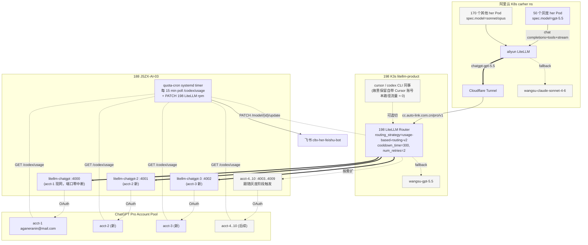

# ChatGPT Pro 账号池 + Carher gpt-5.5 灰度统一方案

**状态**：调研 + 探针验证完成，待实施
**日期**：2026-05-17
**版本**：v3（合并 `chatgpt-pro-10-accounts-architecture.md` + `carher-switch-to-chatgpt-pro-gpt55.md`，旧两份归档至 `archive/`）

---

## TL;DR

**做什么** — 把 220 个 carher her bot 的主力 LLM 从 Claude Sonnet（按 token 计费）切到 GPT-5.5（订阅制，等于无限调用），共享 10 个 ChatGPT Pro $200 账号池；198 cursor 路径作为备用容量管道铺好但**不主动推**用户切换。

**为什么不会出事** — 双 LiteLLM（198 cursor / aliyun carher）共享 188 主机的 N 个独立 docker 容器池；LiteLLM 标签路由实现 cursor 重度独享 / 轻度共享、对用户零感知；quota-cron 每 15 分钟基于 `/codex/usage` 自动调度 rpm（用得少的顶上去 / 撞限自动下线 / 到期自动恢复）；双层 fallback 兜底（`chatgpt → wangsu-gpt → wangsu-claude-sonnet`）保证永不断流；5 秒一行命令全量回滚。

**节奏** — Day 0 半天铺基础设施 → Day 1-2 Stage 0 沙盒 → Day 3-5 Stage 1（5 实例）→ Day 6-8 Stage 2（50 实例）→ 后续按周% 触阈值时按需扩到 10 账号。

| 关键数字 | 值 |
|---|---|
| 灰度规模 | 50 实例（220 总，中等活跃 50-200 calls/day 实例）|
| 起步账号数 | **3**（按周% 触阈值时按需扩到 10）|
| 容量余量 | 13× 5h、7× 周（promo 期）|
| Promo 退坡（5-31）后 | 仍 3-7× 富余 |
| 探针轮询周期 | 15 分钟（轻量、不刺激反爬）|
| 全量回滚耗时 | **5 秒**（一行 `kubectl patch`）|
| Fallback 兜底链 | chatgpt → wangsu-gpt → wangsu-claude-sonnet |

---

## 文档导航

| 想做什么 | 跳到 |
|---|---|
| 5 分钟读完核心 | [TL;DR](#tldr) + [设计思路](#设计思路) + [§1 架构](#1-架构) |
| 验证 `/codex/usage` endpoint | [附 A 探针脚本](#附-a探针脚本已验证可用) |
| 在 188 加新 ChatGPT 账号容器 | [§5.1](#51-188-docker-composestep-2) |
| 改 198 prod LiteLLM 模型/路由 | [§5.2](#52-198-prod-configmapstep-3) |
| 升级 carher-admin 加 gpt-5.5 别名 | [§5.3](#53-carher-admin-config_genpy-加别名step-4) |
| 改阿里云 carher LiteLLM | [§5.4](#54-aliyun-carher-litellm-加-model--fallbackstep-5) |
| 部署 Day 0 告警 cron | [§5.5.1](#551-day-0--alert-only-版最小可用) |
| 升级到 Stage 1+ 自动调度 cron | [§5.5.2](#552-stage-1--auto-rebalance-升级自动下线--自动恢复--用得少的自动顶上去) |
| Cursor 重度用户分组绑定 | [§5.6](#56-按用量绑定-cursor-key-到账号机制-a标签路由) |
| **新增 / 移除 ChatGPT 账号（一键脚本）** | [§5.7](#57-新增--移除-chatgpt-账号-runbook) |
| 跑 Stage 0 / 1 / 2 灰度 | [§6.1](#61-stage-0--1-沙盒实例day-1-2) / [§6.2](#62-stage-1--5-低活跃实例day-3-5) / [§6.3](#63-stage-2--50-中活跃实例day-6-8) |
| 紧急回滚（单实例 / 全 50）| [§7](#7-紧急回滚) |
| 监控告警阈值 | [§8](#8-监控告警) |
| 风险矩阵 | [§9](#9-风险矩阵) |
| 边界 — 会做 / 不会做 | [§10](#10-边界--会做的事--不会做的事) |
| 开放决策点 | [§11](#11-开放决策点) |

---

## 设计思路

**1. 背景与目标** — 我们有 10 个 ChatGPT Pro $200 订阅账号，希望让 220 个 carher her bot 的主力 LLM 从 Claude Sonnet（按 token 计费）切到 GPT-5.5（订阅制等于无限调用），同时给 198 LiteLLM 上的 cursor/codex 同事保留这条容量管道作为备用。核心约束是 **ChatGPT Pro 有 5 小时滚动窗口和周滚动窗口两层限速**，且 OpenAI 未公开具体阈值，撞到就被强制冷却。

**2. 硬件层 — 188 主机容器池** — 把 10 个账号封装成 188 主机上的 N 个独立 docker 容器（每容器一个 OAuth token，故障隔离 — 单 token 失效不影响其他账号）。**3 账号起步、按观察到的周% 增长按需扩到 10**，账号扩容跟着 carher 灰度节奏自然错峰，避免 weekly 同步撞墙。

**3. 路由层 — 双 LiteLLM + 标签路由** — 上面架两个 LiteLLM 共享这个池子：198 给 cursor、阿里云给 carher，都走 `usage-based-routing-v2`。**Cursor 用户绑定层面用 `enable_tag_filtering` + `key.metadata.tags` 实现「重度 2:1 独享、轻度 N:1 共享」**：所有 deployment 同名 `chatgpt-gpt-5.5`、靠 tag 区分账号归属，**用户在 cursor 里看到的还是同一个模型名、零感知**；标签 deployment 撞限自动降级到 untagged 共享池。

**4. 调度层 — quota-cron 自动顶替/下线/恢复** — 每 15 分钟轮询 `/codex/usage`，按 5h%/周% 实时调整每账号的 `rpm` 上限（`HEALTHY→null`、`SLOW→30`、`THROTTLE→5`、`OFFLINE→0`），靠 LiteLLM `usage-based-routing-v2` 的"避开接近上限的 deployment"特性，让流量自动从高水位账号转移到低水位账号 —— **用得少的自动顶上去、撞限的自动下线、到期的自动恢复，全程不需要人工干预**。LiteLLM 自身 `cooldown_time=300` 提供秒级 429 兜底，与 cron 的 15 分钟提前 throttle 互补。

**5. UX 兜底层 — 双层 fallback** — 哪怕全 10 账号都撞墙、哪怕 188 / 198 整条链路挂了，aliyun carher LiteLLM 也走双层 fallback：`chatgpt-gpt-5.5 → wangsu-gpt-5.5 → wangsu-claude-sonnet-4-6`。最差情况只是延迟 +1 秒、回复风格略变，**永不断流**。

**6. 灰度层 — Carher 三阶段 + 5s 回滚** — Carher 灰度走 `1 → 5 → 50` 三阶段，每阶段有明确 Gate 和 5 秒一行命令的全量回滚；Stage 0 必须主动跑回滚演练。198 cursor 路径基础设施跟着一起铺，但**不主动推用户切换**（user 故意保留 cursor 同事自带的 Cursor 账号路径），把 198 当成"备好的容量管道"而非当前 UX 重点。

---

## 1. 架构



**链路解读**（数据流方向）：

1. **Carher 侧（主流量）**：50 个灰度 her Pod 的 chat completions 请求 → 阿里云 LiteLLM `chatgpt-gpt-5.5` model → Cloudflare Tunnel → 公网 → 198 LiteLLM → 188 上 N 个 docker 容器 → ChatGPT Pro
2. **Cursor 侧（备用）**：198 LiteLLM 同时对 342 个 cursor key 开放，但当前流量近 0（user 故意），相当于"备好的容量管道"
3. **Fallback 兜底**：任一层断流自动 fallback：单账号 cooldown → 198 LiteLLM 跳到下个账号；全 chatgpt 链路挂 → 198 LiteLLM fallback 到 wangsu-gpt-5.5；198 整个不可达 → 阿里云 LiteLLM fallback 到 wangsu-claude-sonnet-4-6

---

## 2. 探针实测

`/codex/usage` endpoint 已验证可用。**Schema 跟旧文档写的不一样**，以下是实测真值：

```json
{
  "plan_type": "pro",
  "rate_limit": {
    "allowed": true,
    "limit_reached": false,
    "primary_window": {
      "used_percent": 22,
      "limit_window_seconds": 18000,    // 5h = 18000s
      "reset_after_seconds": 2654,
      "reset_at": 1779013979             // unix timestamp
    },
    "secondary_window": {
      "used_percent": 9,
      "limit_window_seconds": 604800,   // 7d
      "reset_after_seconds": 560120,
      "reset_at": 1779571445
    }
  },
  "additional_rate_limits": [
    {
      "limit_name": "GPT-5.3-Codex-Spark",
      "metered_feature": "codex_bengalfox",
      "rate_limit": { /* 同结构，独立子配额池 */ }
    }
  ]
}
```

**关键发现**：

| 发现 | 含义 |
|---|---|
| 单 acct-1 当前 5h 22% / 周 9% | 当前流量极轻，10 账号是为未来留的余量，不是当前必须 |
| `additional_rate_limits` 含独立子配额 | **GPT-5.3-Codex-Spark 走独立池子**，跟 GPT-5.5 主池子分账，监控时要分开看 |
| `rate_limit_reached_type` 字段 | 当前 null；撞限时会变为 `primary` 或 `secondary`，是关键告警信号 |
| `reset_at` 是 unix timestamp | 直接可拿来调度（"距离 reset 还有多少秒"） |
| auth.json schema 是 flat 不是嵌套 | `access_token` / `refresh_token` / `id_token` / `expires_at` / `account_id` 平铺，不在 `tokens` 子对象里 |

---

## 3. 现实校准（不要被 5h/周 reset 吓到）

| 维度 | 数字 | 含义 |
|---|---|---|
| 单 acct 当前 5h 用量 | 22% | 单账号现状用量低，5h 不是约束 |
| 单 acct 周用量 | 9% | 周配额远没贴墙 |
| 50 实例预估 5h 峰值 | ~2,500 calls | 灰度规模 |
| 3 账号容量 (promo 期) | 1,800-9,600 messages/5h | 已覆盖灰度峰值 |
| 50 实例周流量 | ~52,500 calls/week | |
| 单账号周保守上限估算 | ~36,000 calls/week | 3 账号 = 108k/week，富余 2x |
| 10 账号容量 (promo 期) | 32,000 messages/5h | 13x 富余 |
| Promo 退坡 (5-31 后) | 容量减半 | **5 账号已足以覆盖 50 实例**，仍富余 |

**结论**：
- 5h 限速：3 账号已绰绰有余
- 周限速：3 账号灰度期内（7 天 7,500 calls/account）远不会撞，唯一威胁是「10 账号同一天激活同一天撞」→ 解法是**不一把激活**
- 10 账号是**目标态而非起点**

---

## 4. 实施步骤（9 步，分两阶段）

### 阶段 A — 基础设施（Day 0，半天工作量）

| # | 改动 | 位置 | 验证 |
|---|---|---|---|
| 1 | Pre-flight 探针 | 188 acct-1 | ✅ 已完成，see §2 |
| 2 | 188 docker-compose 启 acct-2 / acct-3 容器 | 188 `/Data/chatgpt-auth/` | `curl :4002/health` `:4003/health` |
| 3 | 198 prod ConfigMap 扩 model_list ×3 + 加 router_settings | 198 K3s litellm-product | SSE smoke test |
| 4 | carher-admin `config_gen.py` 加 `gpt-5.5` 别名 | carher-admin | pytest |
| 5 | aliyun carher LiteLLM 加 `chatgpt-gpt-5.5` 模型 + fallback 链 | aliyun carher ns | curl SSE |
| 6 | 部署 quota-cron（30 行 bash + python）| 188 或 198 | 飞书收到首次 heartbeat |

### 阶段 B — Carher 灰度（Day 1-7）

| # | 改动 | Stage | Gate |
|---|---|---|---|
| 7 | `kubectl patch herinstance` 1 个沙盒切 gpt-5.5 | Stage 0 (1 实例 / 48h) | 200 OK ≥99% / p95<30s / 主动跑回滚演练 |
| 8 | 切 5 个低活跃实例 | Stage 1 (5 实例 / 48h) | 5 实例并发不互扰 / 3 账号无周% > 30% |
| 9 | 分 3 批切 50 个中活跃实例 | Stage 2 (50 实例 / 3 天) | 每批切完观察 24h；周% 触阈值时同步加 acct-4...10 |

---

## 5. 阶段 A 详细实施

### 5.1 188 docker-compose（Step 2）

文件：`/Data/chatgpt-auth/docker-compose.yml`

```yaml
x-chatgpt-common: &chatgpt-common
  image: ghcr.io/berriai/litellm:main-stable
  restart: unless-stopped
  environment:
    - LITELLM_LOG=INFO
    - CHATGPT_TOKEN_DIR=/chatgpt-auth
  networks: [chatgpt-net]

services:
  litellm-chatgpt:        # acct-1 现网，**保留容器名 + 端口 4000 不变**（零中断）
    <<: *chatgpt-common
    container_name: litellm-chatgpt
    ports: ["4000:4000"]
    volumes: ["./acct-1:/chatgpt-auth"]

  litellm-chatgpt-2:
    <<: *chatgpt-common
    container_name: litellm-chatgpt-2
    ports: ["4001:4000"]
    volumes: ["./acct-2:/chatgpt-auth"]

  litellm-chatgpt-3:
    <<: *chatgpt-common
    container_name: litellm-chatgpt-3
    ports: ["4002:4000"]
    volumes: ["./acct-3:/chatgpt-auth"]

  # acct-4 .. acct-10 待 Stage 2 触发后加（端口 4003..4009）

networks:
  chatgpt-net: { driver: bridge }
```

前置：把 acct-1 的现网 auth.json 移到 `/Data/chatgpt-auth/acct-1/auth.json`（保留容器名 + 端口 4000 兼容现网），新拿 2 个账号 auth.json 放 `acct-2/` `acct-3/`。

启停：
```bash
ssh cltx@10.68.13.188
cd /Data/chatgpt-auth
docker compose up -d litellm-chatgpt-2 litellm-chatgpt-3
docker compose ps
for p in 4000 4001 4002; do curl -sS http://localhost:$p/health | head -3; done
```

### 5.2 198 prod ConfigMap（Step 3）

每个 chatgpt-* 模型扩到 3 deployment（同名）：

```yaml
model_list:
- model_name: chatgpt-gpt-5.5
  litellm_params:
    model: openai/chatgpt-gpt-5.5
    api_base: http://10.68.13.188:4000          # acct-1 现网
    api_key: sk-chatgpt-188-acct1
  model_info: { id: chatgpt-acct-1-gpt-5.5, mode: responses }
- model_name: chatgpt-gpt-5.5
  litellm_params:
    model: openai/chatgpt-gpt-5.5
    api_base: http://10.68.13.188:4001          # acct-2 新
    api_key: sk-chatgpt-188-acct2
  model_info: { id: chatgpt-acct-2-gpt-5.5, mode: responses }
- model_name: chatgpt-gpt-5.5
  litellm_params:
    model: openai/chatgpt-gpt-5.5
    api_base: http://10.68.13.188:4002          # acct-3 新
    api_key: sk-chatgpt-188-acct3
  model_info: { id: chatgpt-acct-3-gpt-5.5, mode: responses }
# 同样模式扩 chatgpt-gpt-5.4 / chatgpt-gpt-5.3-codex / chatgpt-gpt-5.3-codex-spark

router_settings:
  routing_strategy: usage-based-routing-v2
  cooldown_time: 300                   # 撞 429 → 冷却 5min
  num_retries: 2                       # 失败自动跳一次
  allowed_fails: 3                     # 3 次失败才触发 cooldown
  enable_tag_filtering: true
  fallbacks:
    - chatgpt-gpt-5.5: [wangsu-gpt-5.5]
    - chatgpt-gpt-5.4: [wangsu-gpt-5.4]
    # codex / codex-spark 保留无 fallback
```

应用：
```bash
# 通过 jms 连 198
kubectl -n litellm-product apply -f /root/litellm-product-manifests/30-cm-litellm-config.yaml
kubectl -n litellm-product rollout restart deploy/litellm-proxy
kubectl -n litellm-product rollout status deploy/litellm-proxy
```

回归 smoke test：
```bash
curl -sS -N https://cc.auto-link.com.cn/pro/v1/chat/completions \
  -H "Authorization: Bearer $PROD_KEY" \
  -d '{"model":"chatgpt-gpt-5.5","messages":[{"role":"user","content":"ping"}],"stream":true}' \
  | head -5
```

### 5.3 carher-admin `config_gen.py` 加别名（Step 4）

改动：

```python
PROVIDER_MODEL_MAP = {
    "litellm": {
        "sonnet": "litellm/claude-sonnet-4-6",
        "opus":   "litellm/claude-opus-4-6",
        "gpt-5.5": "litellm/chatgpt-gpt-5.5",   # ← 新增
    },
    "wangsu": {
        # ... 现有
        "gpt-5.5": "wangsu-gpt-5.5",            # ← 新增（直连兜底备用）
    },
    # openrouter 保持不变
}
```

测试：
```bash
cd /Users/Liuguoxian/codes/carher-admin
python -m pytest backend/tests/test_config_gen.py -v -k "gpt"
```

前端 `frontend/src/models.js` 加 model 元数据：
```javascript
{ id: "gpt-5.5", name: "GPT-5.5 (ChatGPT Pro)", api: "openai-completions",
  reasoning: true, input: ["text", "image"],
  contextWindow: 400000, maxTokens: 128000,
  cost: { input: 0, output: 0, cacheRead: 0 } }
```

部署：
```bash
# 在构建服务器 47.84.112.136 上 nerdctl 构建
ssh build@47.84.112.136
cd /path/to/carher-admin
git pull
./build.sh   # nerdctl build + push to ACR
# 阿里云上滚动更新
kubectl -n carher-admin rollout restart deploy/carher-admin
```

### 5.4 aliyun carher LiteLLM 加 model + fallback（Step 5）

aliyun carher ns ConfigMap：

```yaml
model_list:
# 新增
- model_name: chatgpt-gpt-5.5
  litellm_params:
    model: openai/chatgpt-gpt-5.5
    api_base: https://cc.auto-link.com.cn/pro/v1
    api_key: os.environ/CARHER_TO_198_KEY
  model_info:
    id: aliyun-carher-to-198-chatgpt-5.5
    mode: responses

router_settings:
  fallbacks:
    # 新增（追加到现有 fallbacks 数组）
    - chatgpt-gpt-5.5:
        - wangsu-gpt-5.5                # 同模型族优先（用户体验风格一致）
        - wangsu-claude-sonnet-4-6      # 异族兜底（GPT 整体不可用时）
```

前置 secret（在 198 上建一把专给 carher 用的 key）：
```bash
# 198 LiteLLM admin UI 或 API 创建一把 key:
#   alias: aliyun-carher-bridge
#   models: [chatgpt-gpt-5.5, chatgpt-gpt-5.4, chatgpt-gpt-5.3-codex, chatgpt-gpt-5.3-codex-spark, wangsu-gpt-5.5]
#   tpm/rpm: 不限（依赖 198 router cooldown 即可）
#   budget: 不限（订阅制）

# 在 aliyun carher ns 写入 secret
kubectl -n carher create secret generic carher-to-198-bridge \
  --from-literal=CARHER_TO_198_KEY=sk-...
# 注入到 LiteLLM Pod env
kubectl -n carher rollout restart deploy/litellm-proxy
```

回归：
```bash
kubectl -n carher exec deploy/litellm-proxy -- \
  curl -sS http://localhost:4000/v1/chat/completions \
    -H "Authorization: Bearer $CARHER_MK" \
    -d '{"model":"chatgpt-gpt-5.5","messages":[{"role":"user","content":"ping"}],"stream":true}' \
    | head -5
```

### 5.5 quota-cron 与自动调度

quota-cron 有两个版本：**Day 0 启用 alert-only（5.5.1），Stage 1+ 升级到 auto-rebalance（5.5.2）**。两者数据采集逻辑相同，区别在是否触发 LiteLLM admin API 改 rpm。

#### 5.5.1 Day 0 — alert-only 版（最小可用）

**位置**：188 主机 systemd timer（不部 K3s，避开把 auth.json 跨主机暴露的复杂度）
**功能**：每 5 分钟轮询所有 acct 的 `/codex/usage`，weekly% 阈值告警 + plan_type 降级告警

文件：`scripts/quota-cron.py`（新增）+ k8s CronJob

```python
#!/usr/bin/env python3
"""
轮询 188 上所有 chatgpt 容器的 /codex/usage，
任一账号 weekly_pct ≥ 75 或 plan_type ≠ pro 时发飞书告警。
"""
import json, base64, urllib.request, os, sys, time
from pathlib import Path

ACCOUNTS_DIR = "/data/chatgpt-auth"  # mounted from 188 /Data/chatgpt-auth
FEISHU_WEBHOOK = os.environ["FEISHU_WEBHOOK"]

def parse_account(auth_path):
    auth = json.load(open(auth_path))
    tok = auth["access_token"]
    aid = auth.get("account_id")
    if not aid:
        seg = auth["id_token"].split(".")[1]
        seg += "=" * (-len(seg) % 4)
        claims = json.loads(base64.urlsafe_b64decode(seg))
        aid = claims["https://api.openai.com/auth"]["chatgpt_account_id"]
    return tok, aid

def fetch_usage(tok, aid):
    req = urllib.request.Request(
        "https://chatgpt.com/backend-api/codex/usage",
        headers={
            "Authorization": f"Bearer {tok}",
            "chatgpt-account-id": aid,
            "Originator": "codex_cli_rs",
            "User-Agent": "codex_cli_rs/0.30.0 (Linux; x86_64)",
        },
    )
    with urllib.request.urlopen(req, timeout=15) as r:
        return json.loads(r.read())

def alert_feishu(text):
    body = {"msg_type": "text", "content": {"text": text}}
    req = urllib.request.Request(
        FEISHU_WEBHOOK, method="POST",
        data=json.dumps(body).encode(),
        headers={"Content-Type": "application/json"},
    )
    urllib.request.urlopen(req, timeout=10).read()

def main():
    accounts = sorted(p.parent.name for p in Path(ACCOUNTS_DIR).glob("acct-*/auth.json"))
    alerts = []
    for acct in accounts:
        try:
            tok, aid = parse_account(f"{ACCOUNTS_DIR}/{acct}/auth.json")
            u = fetch_usage(tok, aid)
            plan = u["plan_type"]
            p_pct = u["rate_limit"]["primary_window"]["used_percent"]
            w_pct = u["rate_limit"]["secondary_window"]["used_percent"]
            reached = u.get("rate_limit_reached_type")
            print(f"{acct}: plan={plan} 5h={p_pct}% week={w_pct}% reached={reached}")
            if plan != "pro":
                alerts.append(f"🔴 {acct} plan_type={plan}（被降级）")
            if w_pct >= 90:
                alerts.append(f"🔴 {acct} weekly={w_pct}%")
            elif w_pct >= 75:
                alerts.append(f"🟡 {acct} weekly={w_pct}%")
            if reached:
                alerts.append(f"🟠 {acct} reached={reached}")
        except Exception as e:
            alerts.append(f"⚠️ {acct} probe error: {e}")
    if alerts:
        alert_feishu("ChatGPT Pro quota:\n" + "\n".join(alerts))

if __name__ == "__main__":
    main()
```

K8s CronJob（部署在 198 K3s litellm-product ns）：
```yaml
apiVersion: batch/v1
kind: CronJob
metadata:
  name: chatgpt-quota-cron
  namespace: litellm-product
spec:
  schedule: "*/5 * * * *"   # 每 5 分钟
  successfulJobsHistoryLimit: 1
  failedJobsHistoryLimit: 3
  jobTemplate:
    spec:
      template:
        spec:
          restartPolicy: OnFailure
          containers:
          - name: cron
            image: python:3.12-alpine
            command: ["python3", "/scripts/quota-cron.py"]
            env:
            - { name: FEISHU_WEBHOOK, valueFrom: { secretKeyRef: { name: feishu, key: webhook } } }
            volumeMounts:
            - { name: scripts, mountPath: /scripts }
            - { name: chatgpt-auth, mountPath: /data/chatgpt-auth, readOnly: true }
          volumes:
          - { name: scripts, configMap: { name: quota-cron-scripts } }
          - { name: chatgpt-auth, hostPath: { path: /Data/chatgpt-auth } }   # 仅 188 上有
```

**注意**：`/Data/chatgpt-auth` 在 188 主机，不在 198 K3s 节点。要么把 cron 部到 188（直接 cron 调度脚本），要么通过 NFS/rsync 把 auth.json 同步到 198。**最简推荐：把 cron 跑在 188 上 systemd timer**：

```bash
# 188 上
sudo tee /etc/systemd/system/chatgpt-quota.service <<EOF
[Unit]
Description=ChatGPT Pro quota check
[Service]
Type=oneshot
EnvironmentFile=/etc/chatgpt-quota.env
ExecStart=/usr/bin/python3 /home/cltx/quota-cron.py
EOF

sudo tee /etc/systemd/system/chatgpt-quota.timer <<EOF
[Unit]
Description=Run chatgpt-quota every 5 min
[Timer]
OnCalendar=*:0/5
Persistent=true
[Install]
WantedBy=timers.target
EOF

sudo systemctl enable --now chatgpt-quota.timer
```

`/etc/chatgpt-quota.env`：
```
FEISHU_WEBHOOK=https://open.feishu.cn/open-apis/bot/v2/hook/xxx
```

#### 5.5.2 Stage 1+ — auto-rebalance 升级（自动下线 + 自动恢复 + 用得少的自动顶上去）

**触发时机**：Stage 0 通过、进 Stage 1 之前升级 quota-cron 脚本，开启自动调度。

**核心机制**：

```
quota-cron (每 15 分钟整点)
  ├─ 拉每个 acct 的 /codex/usage → 拿 primary_pct(5h) / weekly_pct(周) + 各自 reset_at
  ├─ 健康度分档（5h 与周独立判定，取最严档）
  ├─ 计算每 acct 目标 rpm + restore_at
  ├─ PATCH http://198/model/{model_id}/update {"litellm_params": {"rpm": <目标>}}
  └─ 状态对比上次：仅在档位"切换"时发飞书（边沿触发，不刷屏）

LiteLLM Router (usage-based-routing-v2)
  └─ 每个请求路由前查每 deployment 的 RPM 余量，自动避开接近 rpm 上限的 deployment
     → 流量自然转移到 rpm 富余的（= 用得少的）deployment

LiteLLM cooldown_time=300（兜底，与 cron 互补）
  └─ 任何 deployment 撞 429 立即冷却 5 分钟，秒级生效
     → 即使 cron 间隔 15 分钟没赶上，撞限时还能立刻被 LiteLLM 自身保护
```

**为什么 15 分钟够用**（不是 60 秒）：
- 50 实例峰值约 2,500 calls/5h ≈ 8 calls/分钟/账号（3 账号分担），单账号 15 分钟最多消耗 5-8% 的 5h 配额 → THROTTLE 阈值留 10% 安全余量足够
- LiteLLM `cooldown_time=300` 在请求维度实时保护（撞 429 秒级跳别的 deployment），cron 是防御性提前 throttle，两者互补
- 15 分钟 vs 1 分钟：对账号 weekly 配额更友好（10× 频率减少 → 不给 OpenAI 反爬留把柄），10 账号一天约 960 次 `/codex/usage` 调用

**健康度分档 — 5h 与周独立判定**：

| 档位 | 5h 触发 | 周触发 | 目标 rpm | 含义 | 自动恢复路径 |
|------|---------|--------|---------|------|------|
| 🟢 HEALTHY | primary < 60% | weekly < 50% | null（不限）| 全速服务 | — |
| 🟡 SLOW | primary 60-85% | weekly 50-75% | 30 | 减速保留容量 | used% 跌回阈值下 → 升档 |
| 🟠 THROTTLE | primary 85-95% | weekly 75-90% | 5 | 应急储备 | 同上 |
| 🔴 OFFLINE-5H | **primary ≥ 95%** | — | 0 | 5h 下线 | primary `reset_at` 后窗口滚出，**最长 5h** 自动 HEALTHY |
| 🔴 OFFLINE-WEEK | — | **weekly ≥ 90%** | 0 | 周下线 | secondary `reset_at` 后，**最长 7d** 自动 HEALTHY |

**关键点**：
1. **5h 与周下线是两条独立路径**：哪个先撞哪个，决定 `restore_at`（5h 最多 5 小时回来；周最多 7 天回来）
2. **取最严档**：同时撞时按更严的设 rpm，restore_at 用更晚的
3. **OFFLINE → HEALTHY 不需要专门"恢复"动作**：每 15 分钟 cron 重新轮询，`used_percent` 自然滚出窗口下降，下一轮分档自动从 OFFLINE 升回 THROTTLE / SLOW / HEALTHY，PATCH 把 rpm 调回去 — **全自动，无需人工干预**
4. **告警是边沿触发**：只在档位切换时发一次（OFFLINE 进入 + 恢复退出），OFFLINE 期间不刷屏

为什么是 **rpm** 而不是 weight：
- `weight` 在 `usage-based-routing-v2` 里只影响相对偏好，无硬约束 → 调度还是会撞墙
- `rpm` 是硬上限，撞到 LiteLLM 直接跳别的 deployment → 真能保护账号
- LiteLLM v1.84.0 实测 PATCH `/model/{id}/update` 修改 `litellm_params.rpm` 秒级生效（`store_model_in_db: true` 已开）

**Auto-rebalance 脚本骨架**（替换 5.5.1 的 quota-cron.py）：

```python
# /home/cltx/quota-rebalance.py
import json, base64, urllib.request, os, time
from datetime import datetime, timezone
from pathlib import Path

ACCOUNTS_DIR = "/Data/chatgpt-auth"
STATE_FILE = "/var/lib/chatgpt-quota/state.json"
LITELLM_BASE = os.environ["LITELLM_BASE"]      # http://10.68.13.198:30402
LITELLM_MK = os.environ["LITELLM_MK"]
FEISHU_WEBHOOK = os.environ["FEISHU_WEBHOOK"]

# 账号自动发现 — 新加 acct 只需 scp auth.json，下个 cron 周期自动纳入调度
# 模型 id 命名约定：chatgpt-{acct-name}-gpt-5.5（与 §5.7 一键脚本注册保持一致）
def discover_accounts():
    return {
        p.parent.name: f"chatgpt-{p.parent.name}-gpt-5.5"
        for p in sorted(Path(ACCOUNTS_DIR).glob("acct-*/auth.json"))
    }

ACCT_TO_MODEL_ID = discover_accounts()

TIER_RPM = {
    "HEALTHY":      None,   # 不设上限
    "SLOW":         30,
    "THROTTLE":     5,
    "OFFLINE-5H":   0,
    "OFFLINE-WEEK": 0,
}

def classify(usage):
    """
    返回 (tier, cause, primary_pct, weekly_pct, restore_at)
    - tier: 健康度档位
    - cause: 触发原因文本
    - restore_at: unix ts，预计自动恢复时间（仅 OFFLINE/THROTTLE 时有意义）
    """
    rl = usage["rate_limit"]
    p_pct  = rl["primary_window"]["used_percent"]
    p_reset = rl["primary_window"]["reset_at"]
    w_pct  = rl["secondary_window"]["used_percent"]
    w_reset = rl["secondary_window"]["reset_at"]

    # 5h 优先（恢复快），周次之
    if p_pct >= 95:
        return ("OFFLINE-5H", f"primary 5h={p_pct}% >= 95", p_pct, w_pct, p_reset)
    if w_pct >= 90:
        return ("OFFLINE-WEEK", f"weekly={w_pct}% >= 90", p_pct, w_pct, w_reset)
    if p_pct >= 85:
        return ("THROTTLE", f"primary 5h={p_pct}% >= 85", p_pct, w_pct, p_reset)
    if w_pct >= 75:
        return ("THROTTLE", f"weekly={w_pct}% >= 75", p_pct, w_pct, w_reset)
    if p_pct >= 60 or w_pct >= 50:
        return ("SLOW", f"primary={p_pct}%/weekly={w_pct}%", p_pct, w_pct, None)
    return ("HEALTHY", None, p_pct, w_pct, None)

def patch_rpm(model_id, rpm):
    """PATCH /model/{model_id}/update — rpm=None 表示移除 rpm 限制"""
    body = {"model_id": model_id, "litellm_params": {"rpm": rpm}}
    req = urllib.request.Request(
        f"{LITELLM_BASE}/model/{model_id}/update",
        method="PATCH",
        data=json.dumps(body).encode(),
        headers={"Authorization": f"Bearer {LITELLM_MK}",
                 "Content-Type": "application/json"},
    )
    with urllib.request.urlopen(req, timeout=10) as r:
        return r.status

def parse_account(auth_path):
    auth = json.load(open(auth_path))
    tok = auth["access_token"]
    aid = auth.get("account_id")
    if not aid:
        seg = auth["id_token"].split(".")[1]
        seg += "=" * (-len(seg) % 4)
        claims = json.loads(base64.urlsafe_b64decode(seg))
        aid = claims["https://api.openai.com/auth"]["chatgpt_account_id"]
    return tok, aid

def fetch_usage(tok, aid):
    req = urllib.request.Request(
        "https://chatgpt.com/backend-api/codex/usage",
        headers={
            "Authorization": f"Bearer {tok}",
            "chatgpt-account-id": aid,
            "Originator": "codex_cli_rs",
            "User-Agent": "codex_cli_rs/0.30.0 (Linux; x86_64)",
        },
    )
    with urllib.request.urlopen(req, timeout=15) as r:
        return json.loads(r.read())

def alert_feishu(text):
    req = urllib.request.Request(
        FEISHU_WEBHOOK, method="POST",
        data=json.dumps({"msg_type": "text", "content": {"text": text}}).encode(),
        headers={"Content-Type": "application/json"},
    )
    urllib.request.urlopen(req, timeout=10).read()

def fmt_local(ts):
    if not ts: return "-"
    return datetime.fromtimestamp(ts, tz=timezone.utc).astimezone().strftime("%m-%d %H:%M")

def main():
    Path(STATE_FILE).parent.mkdir(parents=True, exist_ok=True)
    prev = json.loads(Path(STATE_FILE).read_text()) if Path(STATE_FILE).exists() else {}
    new = {}
    transition_alerts = []   # 边沿触发：仅在档位切换时告警

    for acct, model_id in ACCT_TO_MODEL_ID.items():
        try:
            tok, aid = parse_account(f"{ACCOUNTS_DIR}/{acct}/auth.json")
            u = fetch_usage(tok, aid)
            tier, cause, p, w, restore_at = classify(u)
            target_rpm = TIER_RPM[tier]
            patch_rpm(model_id, target_rpm)
            new[acct] = {
                "tier": tier, "cause": cause,
                "primary_pct": p, "weekly_pct": w,
                "rpm": target_rpm, "restore_at": restore_at,
                "plan_type": u["plan_type"],
                "ts": int(time.time()),
            }

            old_tier = (prev.get(acct) or {}).get("tier", "HEALTHY")
            # 边沿触发：仅档位变化时发告警
            if old_tier != tier:
                if tier in ("OFFLINE-5H", "OFFLINE-WEEK"):
                    transition_alerts.append(
                        f"🔴 {acct} → {tier}（{cause}）"
                        f"\n   预计 {fmt_local(restore_at)} 自动恢复"
                    )
                elif tier == "THROTTLE":
                    transition_alerts.append(
                        f"🟠 {acct} → THROTTLE rpm=5（{cause}）"
                    )
                elif old_tier in ("OFFLINE-5H", "OFFLINE-WEEK", "THROTTLE") \
                     and tier in ("SLOW", "HEALTHY"):
                    transition_alerts.append(
                        f"🟢 {acct} 已自动恢复（{old_tier} → {tier}，"
                        f"primary={p}% weekly={w}%）"
                    )
                # SLOW <-> HEALTHY 微调不打扰

            # 即时告警：plan_type 异常 / rate_limit_reached_type 触发
            if u["plan_type"] != "pro":
                transition_alerts.append(f"🔴 {acct} plan_type={u['plan_type']}（被降级！）")
            if u.get("rate_limit_reached_type"):
                rt = u["rate_limit_reached_type"]
                if (prev.get(acct) or {}).get("rate_limit_reached_type") != rt:
                    transition_alerts.append(f"🟠 {acct} reached={rt}（用户已感知 429）")
                new[acct]["rate_limit_reached_type"] = rt

        except Exception as e:
            transition_alerts.append(f"⚠️ {acct} probe error: {type(e).__name__}: {e}")
            # 探针失败不改档位（保持上轮 rpm），状态文件也保留上轮值
            new[acct] = prev.get(acct, {"tier": "UNKNOWN"})

    # 落地状态文件（监控可读 / 下次 cron 对比基准）
    Path(STATE_FILE).write_text(json.dumps(new, indent=2))

    if transition_alerts:
        # 加汇总：当前所有账号一行状态
        summary = "\n".join(
            f"  {a}: {(new[a] or {}).get('tier','?')} "
            f"5h={(new[a] or {}).get('primary_pct','?')}% "
            f"week={(new[a] or {}).get('weekly_pct','?')}% "
            f"rpm={(new[a] or {}).get('rpm','-')}"
            for a in ACCT_TO_MODEL_ID
        )
        alert_feishu("ChatGPT Pro auto-rebalance 状态变更：\n"
                     + "\n".join(transition_alerts)
                     + "\n\n当前全景：\n" + summary)

if __name__ == "__main__":
    main()
```

**关键设计点**：

1. **15 分钟整点轮询**（`OnCalendar=*-*-* *:00,15,30,45:00`）— 一天 96 次/账号
2. **边沿触发告警** — 只在档位"切换"那一刻发飞书，OFFLINE 期间不刷屏；恢复时也单发一次
3. **状态持久化**到 `/var/lib/chatgpt-quota/state.json`，cron 重启不丢"上次档位"
4. **HEALTHY 用 `rpm: null`** 而不是 `rpm: 99999` — null 是 LiteLLM 真正的"无限制"语义
5. **5h 与周分别处理**：5h 撞限恢复快（最长 5h）、周撞限恢复慢（最长 7d），告警里都标 "预计 MM-DD HH:MM 自动恢复" 让运维心里有数
6. **探针失败不改档位**：保留上轮 rpm 与状态，避免 `/codex/usage` 短暂 5xx 把账号误下线

**部署**（systemd timer，每 15 分钟整点）：

```ini
# /etc/systemd/system/chatgpt-quota.timer
[Unit]
Description=ChatGPT Pro auto-rebalance

[Timer]
OnCalendar=*-*-* *:00,15,30,45:00      # 每整 15 分钟
AccuracySec=10s
Persistent=true

[Install]
WantedBy=timers.target
```

```ini
# /etc/systemd/system/chatgpt-quota.service
[Unit]
Description=ChatGPT Pro quota rebalance one-shot
After=network.target

[Service]
Type=oneshot
EnvironmentFile=/etc/chatgpt-quota.env
ExecStart=/usr/bin/python3 /home/cltx/quota-rebalance.py
StandardOutput=append:/var/log/chatgpt-quota.log
StandardError=append:/var/log/chatgpt-quota.log
```

`/etc/chatgpt-quota.env`：
```
LITELLM_BASE=http://10.68.13.198:30402
LITELLM_MK=<198 prod LITELLM_MASTER_KEY>
FEISHU_WEBHOOK=https://open.feishu.cn/open-apis/bot/v2/hook/xxx
```

启用：
```bash
sudo systemctl daemon-reload
sudo systemctl enable --now chatgpt-quota.timer
sudo systemctl list-timers chatgpt-quota
journalctl -u chatgpt-quota.service -f
```

**升级前必做的 5 项验证**（在 198 prod 上跑，**不影响线上**）：

```bash
MK=$(jms ssh AIYJY-litellm "kubectl get secret litellm-secrets -n litellm-product \
  -o jsonpath='{.data.LITELLM_MASTER_KEY}' | base64 -d")

# (1) PATCH 是否真生效
jms ssh AIYJY-litellm "curl -sX PATCH http://localhost:30402/model/chatgpt%2Fgpt-5.5/update \
  -H 'Authorization: Bearer $MK' -H 'Content-Type: application/json' \
  -d '{\"model_id\":\"chatgpt/gpt-5.5\",\"litellm_params\":{\"rpm\":50}}'"

# (2) 查 model_info 是否真有 rpm=50
jms ssh AIYJY-litellm "curl -sS http://localhost:30402/model/info \
  -H 'Authorization: Bearer $MK' | python3 -c '
import json, sys
d = json.load(sys.stdin)
m = [x for x in d[\"data\"] if x[\"model_info\"][\"id\"]==\"chatgpt/gpt-5.5\"][0]
print(\"rpm:\", m[\"litellm_params\"].get(\"rpm\"))
'"

# (3) 验证 rpm=null 真的清掉限制（关键 — HEALTHY 档要靠这条）
jms ssh AIYJY-litellm "curl -sX PATCH http://localhost:30402/model/chatgpt%2Fgpt-5.5/update \
  -H 'Authorization: Bearer $MK' -H 'Content-Type: application/json' \
  -d '{\"model_id\":\"chatgpt/gpt-5.5\",\"litellm_params\":{\"rpm\":null}}'"

# (4) 跑 60 个 RPS（>50 rpm 上限）看是否触发 cooldown / 跳到其他 deployment
# （Stage 0 只有 1 个 deployment，跳不了；Stage 1+ 多 deployment 时再做）

# (5) 查 /model_group/info 看路由实时聚合状态
jms ssh AIYJY-litellm "curl -sS http://localhost:30402/model_group/info \
  -H 'Authorization: Bearer $MK' | python3 -m json.tool | head -50"
```

5 项全过 → 部署 auto-rebalance 版 cron。

**容错与边界**：

| 异常场景 | 处理 |
|---|---|
| quota-cron 自身挂掉 | 上次设的 rpm 保持（DB 持久）。systemd `Restart=on-failure`。LiteLLM `cooldown_time=300` 兜底，撞 429 仍秒级保护账号 |
| 某 acct 的 `/codex/usage` 暂时 5xx | 跳过该 acct（保留上轮 rpm 与状态），下一轮 15 分钟后重试。状态文件不更新避免误判恢复 |
| LiteLLM PATCH 5xx | 当轮跳过该 acct，下一轮重试 |
| LiteLLM 重启 | `store_model_in_db: true` → DB 内 rpm 持久。如 ConfigMap 重建覆盖了 rpm 字段，下个 cron 周期（≤15min）重新写回。窗口期靠 cooldown_time 兜底 |
| `reset_at` 已过但 used_percent 还没回落 | 滚动窗口性质：reset_at 是"最早 burn 的请求过期时间"，仍可能保留较高 used_percent。cron 不主动"强制恢复"，等 used_percent 真正下降到阈值以下才升档 — 安全 |
| 15 分钟内突发流量从 60% 直冲 95%+ | 极端情况。`cooldown_time=300` 在 LiteLLM 层秒级响应 429；下一轮 cron 把该 acct 设为 OFFLINE-5H 防御性 throttle |
| cron 重启状态文件丢失 | 第一轮全部按"上次 = HEALTHY"对比，会把当前 OFFLINE 当成"切换告警"重发一次（不影响功能，只是多一条 alert）|
| 多个账号同时 OFFLINE | 流量按 fallback 链：tagged 账号 OFFLINE → untagged 共享池 → 全部 OFFLINE → wangsu。用户始终有响应 |

**为什么这套机制 = "用得少的自动顶上去 + 自动下线 + 自动恢复"**：

```
T0:    acct-1 weekly 75%, acct-2/3 各 30%
       cron classify:
         acct-1 → THROTTLE (rpm=5)
         acct-2 → HEALTHY (rpm=null, 不限)
         acct-3 → HEALTHY (rpm=null, 不限)
       飞书告警："acct-1 → THROTTLE rpm=5（weekly=75% >= 75）"

T0+10min: 来 100 个请求
       LiteLLM router (usage-based-routing-v2):
         acct-1 RPM 余量 ≈ 0（很快用完 5/min）
         acct-2/3 RPM 余量 = 不限
       → 95+ 请求落到 acct-2/3，5 个落到 acct-1（用得少的顶上去）

T0+1h: acct-1 weekly 涨到 91% → cron classify
       acct-1 → OFFLINE-WEEK (rpm=0)
       飞书告警："acct-1 → OFFLINE-WEEK（weekly=91% >= 90）
                  预计 05-23 14:30 自动恢复"
       LiteLLM router 看到 acct-1 rpm=0 → 完全跳过（自动下线）

T0+2d: acct-1 周窗口部分滚出，weekly 降到 65% → cron classify
       acct-1 → SLOW (rpm=30)
       飞书告警："acct-1 已自动恢复（OFFLINE-WEEK → SLOW，
                  primary=15% weekly=65%）"

T0+3d: weekly 进一步降到 45% → cron classify
       acct-1 → HEALTHY (rpm=null)
       静默切换（HEALTHY ↔ SLOW 不触发告警）

→ 全程用户视角：cursor IDE 永远拿到响应；
  运维视角：飞书只在档位真切换时收 4 条 alert（THROTTLE 进入 / OFFLINE 进入 + 预期恢复 / SLOW 恢复 / 隐式 HEALTHY），不刷屏
```

**与机制 A（标签路由）的兼容性**：完全兼容。每个 tagged deployment（如 acct-1 heavy-pair-1 独享）也参与 rpm 调度，独享重度对的账号撞限时同样会 throttle / OFFLINE，触发 LiteLLM 的"tag 全 cooldown 时降级到 untagged 池"行为。重度用户照样无感知；他们专属账号下线时透明地落到共享池，账号自动恢复后又回到独享。

### 5.6 按用量绑定 cursor key 到账号（机制 A：标签路由）

**目标**：让重度 cursor 用户两两共享一个独享 ChatGPT 账号，轻度用户多人共享剩余账号池，**整个绑定对用户零感知**。

#### 5.6.1 机制选择 — 用 LiteLLM 标签路由

LiteLLM v1.84.0 已实测支持以下能力（198 prod ConfigMap 已在用 `enable_tag_filtering: true`）：

| 能力 | 用法 | 状态 |
|---|---|---|
| `enable_tag_filtering` | router_settings 全局开关 | 198 prod 已开 |
| deployment 级 `litellm_params.tags` | 标记账号归属 | v1.84.0 支持 |
| key 级 `metadata.tags` | 标记 key 隶属哪个组 | v1.84.0 支持 |
| 撞限自动 fallback 到 untagged 池 | tagged 全 cooldown 时降级 | 默认行为 |

**为什么不用机制 B（命名模型 `chatgpt-gpt-5.5-acct-1` + key.models 白名单）**：
- 用户在 cursor 模型下拉框 (`/v1/models`) 会看到 `chatgpt-gpt-5.5-acct-1`、`chatgpt-gpt-5.5` 等多个名字 → **泄露内部分组**
- 标签路由机制下所有 deployment 同名 `chatgpt-gpt-5.5`，用户视角永远只有一个名字 → **零感知**

#### 5.6.2 ConfigMap deployment tag 设计

```yaml
model_list:
# === 重度独享：tagged ===
- model_name: chatgpt-gpt-5.5
  litellm_params:
    model: openai/chatgpt-gpt-5.5
    api_base: http://10.68.13.188:4000     # acct-1 现网，独享给重度对 1
    api_key: sk-chatgpt-188-acct1
    tags: ["heavy-pair-1"]
  model_info: { id: chatgpt-acct-1-gpt-5.5, mode: responses }

- model_name: chatgpt-gpt-5.5
  litellm_params:
    model: openai/chatgpt-gpt-5.5
    api_base: http://10.68.13.188:4001     # acct-2，独享给重度对 2
    api_key: sk-chatgpt-188-acct2
    tags: ["heavy-pair-2"]
  model_info: { id: chatgpt-acct-2-gpt-5.5, mode: responses }

# === 共享池：untagged，所有人都能落 ===
- model_name: chatgpt-gpt-5.5
  litellm_params:
    model: openai/chatgpt-gpt-5.5
    api_base: http://10.68.13.188:4002     # acct-3
    api_key: sk-chatgpt-188-acct3
    # 无 tags
  model_info: { id: chatgpt-acct-3-gpt-5.5, mode: responses }
# acct-4..10 均同上 untagged，按需扩

router_settings:
  enable_tag_filtering: true              # ← 已开
  routing_strategy: usage-based-routing-v2
  cooldown_time: 300
  num_retries: 2
  fallbacks:
    - chatgpt-gpt-5.5: [wangsu-gpt-5.5]
```

**关键点**：
- 只对 `chatgpt-gpt-5.5` 模型分组（其他 chatgpt-gpt-5.4 / 5.3-codex / 5.3-codex-spark 仍走简单负载均衡，不分组，因为这些模型流量极少）
- 重度对 1/2 各占 1 个独享账号，共 2 个；剩余 8 个（acct-3..10）全 untagged 进共享池
- `enable_tag_filtering` 默认行为：tag 命中失败 / 全 cooldown 时降级到 untagged，**保证撞限不卡死**

#### 5.6.3 用量分组判定标准

按 **过去 7 天 `chatgpt-*` 调用次数** 分档（数据从 198 LiteLLM_SpendLogs 取）：

| 档位 | 7d calls | tags | 分配 |
|------|----------|------|------|
| 重度 | > 500 | `heavy-pair-N` | 2 人对 → 1 个独享账号 |
| 中等 | 100-500 | (无) | untagged 共享池 |
| 轻度 | < 100 | (无) | untagged 共享池 |

**当前现状**：342 个 cursor key 中过去 7 天 chatgpt-* 调用 16 次（user 故意没推），暂时**无重度**用户。
- **Day 0 实施时**：所有 key 暂不打 tag，全部走共享池
- **后续观察**：当某个 key 7d calls > 500 时再启动「重度对」分组流程

判定查询：
```sql
-- 在 198 LiteLLM Postgres 跑
SELECT vt.key_alias, vt.metadata->>'owner_name' AS owner,
       COUNT(*) AS calls_7d
FROM "LiteLLM_VerificationToken" vt
JOIN "LiteLLM_SpendLogs" sl ON sl.api_key = vt.token
WHERE sl."startTime" > NOW() - INTERVAL '7 days'
  AND sl.model LIKE 'chatgpt-%'
  AND vt.key_alias LIKE 'cursor-%'
GROUP BY 1, 2
ORDER BY calls_7d DESC
LIMIT 30;
```

#### 5.6.4 Key 改造命令（启用重度对 1/2 时再跑）

**前置**：通过查询拿到 4 个重度用户的 key token + key_alias，规划成 2 对：
- pair-1: alice + bob → acct-1 (tag `heavy-pair-1`)
- pair-2: charlie + dave → acct-2 (tag `heavy-pair-2`)

**改造脚本**（admin API，不用动 ConfigMap，秒级生效）：

```bash
MK=$(jms ssh AIYJY-litellm "kubectl get secret litellm-secrets -n litellm-product \
  -o jsonpath='{.data.LITELLM_MASTER_KEY}' | base64 -d")

LITELLM_BASE="http://10.68.13.198:30402"   # 198 prod LiteLLM 内网

# 给 alice 打 tag
curl -X POST $LITELLM_BASE/key/update \
  -H "Authorization: Bearer $MK" \
  -H "Content-Type: application/json" \
  -d '{
    "key": "<alice-token>",
    "metadata": {
      "tags": ["heavy-pair-1"],
      "purpose": "cursor",
      "owner_name": "alice"
    }
  }'

# 给 bob 打同 tag（同独享账号）
curl -X POST $LITELLM_BASE/key/update \
  -H "Authorization: Bearer $MK" \
  -H "Content-Type: application/json" \
  -d '{
    "key": "<bob-token>",
    "metadata": {
      "tags": ["heavy-pair-1"],
      "purpose": "cursor",
      "owner_name": "bob"
    }
  }'

# 给 charlie/dave 打 heavy-pair-2，同理
```

**回滚分组**：把 `metadata.tags` 字段去掉即可（key 立即回到共享池）：
```bash
curl -X POST $LITELLM_BASE/key/update -H "Authorization: Bearer $MK" \
  -d '{"key": "<token>", "metadata": {"purpose": "cursor", "owner_name": "alice"}}'
```

#### 5.6.5 用户感知验证清单

实施前必须验证零感知。**步骤**：

1. **Cursor 模型下拉**：alice 在 cursor 配置 `https://cc.auto-link.com.cn/pro/v1` + alice key，模型列表应该和未打 tag 时**完全一致**（`chatgpt-gpt-5.5` 一项）
2. **请求路由**：alice 发一条 `model=chatgpt-gpt-5.5` 请求，检查 198 SpendLogs 的 `model_info.id` 是否落到 `chatgpt-acct-1-gpt-5.5`
3. **撞限降级**：人为把 acct-1 容器停掉，alice 再发请求，应该自动落到 untagged 池子（其他 acct-3..10），用户视角无错误
4. **完全不可达 fallback**：把 acct-1..10 容器全停，alice 请求应该 fallback 到 wangsu-gpt-5.5
5. **回滚效果**：把 alice 的 tags 移除，alice 请求应该立刻随机分到 untagged 池

5 个验证全过 → 才启用真实分组。

#### 5.6.6 Carher 始终走共享池（不打 tag）

阿里云 carher LiteLLM 通过 `aliyun-carher-bridge` 这把 key 走 198 prod，**这把 key 不打 `metadata.tags`**，让 220 个 her bot 流量均匀散在共享池（acct-3..10）。这样设计的理由：
- carher 流量绝对值大但平均到每个 bot 很轻，散开比集中在独享账号合理
- 重度 cursor 同事跟 carher 完全隔离，不会互扰
- 独享账号即使 carher 全挂也保留对 cursor 重度用户的独享 SLA

---

### 5.7 新增 / 移除 ChatGPT 账号 Runbook

> 这是高频操作：1 → 2 → 3 → ... → 10 都走这个路径。设计目标 **3-5 分钟从拿到 auth.json 到承担流量、零中断、无需 LiteLLM rollout**。

#### 5.7.1 设计原则

| 原则 | 实现 |
|------|------|
| **秒级生效** | 用 198 LiteLLM admin API `/model/new`（不改 ConfigMap 不 rollout） |
| **持久化** | `store_model_in_db: true` 已开 → admin API 写入直接落 DB，LiteLLM 重启不丢 |
| **声明式兜底** | ConfigMap 异步用 git 同步全量声明（防 LiteLLM 完全重建罕见场景丢数据）|
| **quota-cron 自动接管** | quota-rebalance.py 已改自动发现（§5.5.2），下个 15 min 周期把新账号纳入调度 |
| **健康门控** | 容器健康检查失败 → 不进 198 注册步骤，避免脏配置 |
| **命名约定** | `model_info.id = chatgpt-{acct-name}-gpt-5.5`（与 quota-cron 自动发现规则配套）|

#### 5.7.2 一键新增脚本

文件：`scripts/add-chatgpt-account.sh`

```bash
#!/bin/bash
# 用法：./add-chatgpt-account.sh acct-N /path/to/local/auth.json
# 把一个新 ChatGPT Pro 账号上线到 188 + 198 + quota-cron
set -euo pipefail

ACCT="${1:?acct-N required}"          # 例 acct-4
LOCAL_AUTH="${2:?auth.json required}" # 本地 auth.json 路径
N="${ACCT#acct-}"
PORT=$((4000 + N - 1))                # acct-1=4000, acct-2=4001, ..., acct-10=4009
SSH_188="cltx@10.68.13.188"

if [[ ! -f "$LOCAL_AUTH" ]]; then
  echo "ERROR: $LOCAL_AUTH not found"; exit 1
fi

echo "==[1/6]== 上传 auth.json 到 188:/Data/chatgpt-auth/$ACCT/"
ssh $SSH_188 "mkdir -p /Data/chatgpt-auth/$ACCT && chmod 700 /Data/chatgpt-auth/$ACCT"
scp -q "$LOCAL_AUTH" $SSH_188:/Data/chatgpt-auth/$ACCT/auth.json
ssh $SSH_188 "chmod 600 /Data/chatgpt-auth/$ACCT/auth.json"

echo "==[2/6]== 启动 docker 容器 litellm-chatgpt-$N (端口 $PORT)"
ssh $SSH_188 "cd /Data/chatgpt-auth && docker compose up -d litellm-chatgpt-$N"

echo "==[3/6]== 健康检查（最长等 30s）"
for i in $(seq 1 15); do
  if ssh $SSH_188 "curl -fsS http://localhost:$PORT/health" >/dev/null 2>&1; then
    echo "  ✅ port $PORT healthy"; break
  fi
  sleep 2
  if [[ $i -eq 15 ]]; then
    echo "  ❌ port $PORT 30s 内未健康，停止后续步骤"; exit 1
  fi
done

echo "==[4/6]== 验证 /codex/usage 真能拿到数据（plan_type=pro）"
ssh $SSH_188 "docker exec litellm-chatgpt-$N cat /chatgpt-auth/auth.json" \
  | python3 -c '
import json, base64, urllib.request, sys
auth = json.load(sys.stdin)
tok = auth["access_token"]
aid = auth.get("account_id") or json.loads(base64.urlsafe_b64decode(
    auth["id_token"].split(".")[1] + "=="
))["https://api.openai.com/auth"]["chatgpt_account_id"]
req = urllib.request.Request(
    "https://chatgpt.com/backend-api/codex/usage",
    headers={"Authorization": f"Bearer {tok}", "chatgpt-account-id": aid,
             "Originator": "codex_cli_rs",
             "User-Agent": "codex_cli_rs/0.30.0 (Linux; x86_64)"})
u = json.loads(urllib.request.urlopen(req, timeout=15).read())
assert u["plan_type"] == "pro", f"plan_type={u[\"plan_type\"]} (not pro)"
print(f"  ✅ plan=pro 5h={u[\"rate_limit\"][\"primary_window\"][\"used_percent\"]}% "
      f"week={u[\"rate_limit\"][\"secondary_window\"][\"used_percent\"]}%")
'

echo "==[5/6]== 注册到 198 prod LiteLLM (admin API 秒级生效)"
MK=$(jms ssh AIYJY-litellm "kubectl get secret litellm-secrets -n litellm-product \
  -o jsonpath='{.data.LITELLM_MASTER_KEY}' | base64 -d")

for model in chatgpt-gpt-5.5 chatgpt-gpt-5.4 chatgpt-gpt-5.3-codex chatgpt-gpt-5.3-codex-spark; do
  MID="chatgpt-${ACCT}-${model#chatgpt-}"
  echo "  注册 model_name=$model id=$MID"
  jms ssh AIYJY-litellm "curl -fsS -X POST http://localhost:30402/model/new \
    -H 'Authorization: Bearer $MK' -H 'Content-Type: application/json' \
    -d '{
      \"model_name\": \"$model\",
      \"litellm_params\": {
        \"model\": \"openai/$model\",
        \"api_base\": \"http://10.68.13.188:$PORT\",
        \"api_key\": \"sk-chatgpt-188-$ACCT\"
      },
      \"model_info\": {
        \"id\": \"$MID\",
        \"mode\": \"responses\"
      }
    }'" >/dev/null
done

echo "==[6/6]== 触发 quota-cron 立即跑一轮（不等下个 15 min 整点）"
ssh $SSH_188 "sudo systemctl start chatgpt-quota.service"
sleep 5
ssh $SSH_188 "cat /var/lib/chatgpt-quota/state.json" \
  | python3 -c "
import json, sys
d = json.load(sys.stdin)
if '$ACCT' in d:
    a = d['$ACCT']
    print(f'  ✅ quota-cron 已识别 $ACCT: tier={a[\"tier\"]} '
          f'5h={a[\"primary_pct\"]}% week={a[\"weekly_pct\"]}% rpm={a[\"rpm\"]}')
else:
    print(f'  ⚠️  state.json 里还没有 $ACCT，等下个 cron 周期（≤15 min）')
"

echo ""
echo "🎉 $ACCT 上线完成。后续异步任务："
echo "   1. 编辑 /root/litellm-product-manifests/30-cm-litellm-config.yaml"
echo "      加入对应 4 个 deployment（acct=$ACCT api_base=http://10.68.13.188:$PORT）"
echo "      git commit + push 给同事 review（不立即 rollout，下次维护一起 apply）"
echo "   2. 飞书私密 wiki 记录 $ACCT → 邮箱映射（不入 git）"
```

#### 5.7.3 单账号上线（典型 3-5 分钟）

```bash
# 1. 本地走 OAuth flow 拿 auth.json
./scripts/dev-chatgpt-grant-cursor.sh > /tmp/auth-acct4.json   # 5 分钟

# 2. 一键上线
./scripts/add-chatgpt-account.sh acct-4 /tmp/auth-acct4.json   # 30 秒

# 3. 验证流量真到位（5 分钟后看 SpendLogs）
jms ssh AIYJY-litellm "kubectl exec -n litellm-product litellm-db-0 -- \
  psql -U litellm -d litellm -c \"
SELECT model, count(*) FROM \\\"LiteLLM_SpendLogs\\\"
WHERE \\\"startTime\\\" > NOW() - INTERVAL '5 min'
  AND model_id LIKE 'chatgpt-acct-4-%'
GROUP BY 1;
\""
```

#### 5.7.4 批量扩容（3 → 10 一次扩 7 个）

```bash
# 假设 10 个账号的 auth.json 都准备在 ~/chatgpt-auth/ 下
for n in 4 5 6 7 8 9 10; do
  echo "=== 上线 acct-$n ==="
  ./scripts/add-chatgpt-account.sh acct-$n ~/chatgpt-auth/acct-$n/auth.json
  sleep 10                  # 给 admin API 缓冲，避免连续打满
done

# 全部上完后，下个 15 min cron 周期 quota-cron 自动看到 7 个新账号
# 期间 LiteLLM 已经在 routing 流量到新账号（admin API 已注册）
```

quota-cron 之后做的事（**自动**，无需手动）：
- 第一轮（≤15 min 内）发现新 acct，按当前 used% 分档（通常 HEALTHY，因为新账号没用过）
- 后续每 15 min 持续观测，超阈值时按 §5.5.2 规则 throttle/offline

#### 5.7.5 移除账号（被封 / 主动下线）

文件：`scripts/remove-chatgpt-account.sh`

```bash
#!/bin/bash
# 用法：./remove-chatgpt-account.sh acct-N
set -euo pipefail
ACCT="${1:?acct-N required}"
N="${ACCT#acct-}"
PORT=$((4000 + N - 1))
SSH_188="cltx@10.68.13.188"

echo "==[1/4]== 从 198 prod 删除 4 个 deployment"
MK=$(jms ssh AIYJY-litellm "kubectl get secret litellm-secrets -n litellm-product \
  -o jsonpath='{.data.LITELLM_MASTER_KEY}' | base64 -d")
for model in gpt-5.5 gpt-5.4 gpt-5.3-codex gpt-5.3-codex-spark; do
  MID="chatgpt-${ACCT}-${model}"
  jms ssh AIYJY-litellm "curl -fsS -X POST http://localhost:30402/model/delete \
    -H 'Authorization: Bearer $MK' -H 'Content-Type: application/json' \
    -d '{\"id\": \"$MID\"}'" >/dev/null
  echo "  ✅ deleted $MID"
done

echo "==[2/4]== 停 docker 容器 + 移走 auth.json"
ssh $SSH_188 "cd /Data/chatgpt-auth && docker compose stop litellm-chatgpt-$N \
  && docker compose rm -f litellm-chatgpt-$N"
TS=$(date +%Y%m%d-%H%M%S)
ssh $SSH_188 "mkdir -p /Data/chatgpt-auth-archived \
  && mv /Data/chatgpt-auth/$ACCT /Data/chatgpt-auth-archived/${ACCT}-${TS}"

echo "==[3/4]== 触发 quota-cron 重新发现（自动剔除 $ACCT）"
ssh $SSH_188 "sudo systemctl start chatgpt-quota.service"

echo "==[4/4]== 同步 ConfigMap (异步)"
echo "请编辑 /root/litellm-product-manifests/30-cm-litellm-config.yaml 删除对应 4 个 deployment"
echo "git commit; 不立即 rollout"
```

#### 5.7.6 容错与恢复路径

| 场景 | 行为 | 应对 |
|------|------|------|
| auth.json 无效 / 过期 | 步骤 4 探针 401 → 脚本 abort | 重新生成 auth.json |
| docker 容器健康检查超时 30s | 步骤 3 abort | 看 `docker logs litellm-chatgpt-$N` |
| 198 admin API 5xx | 步骤 5 部分失败 | 已注册的 deployment 留在 DB；重跑脚本（`/model/new` 是非幂等的，需先 `/model/delete` 再 add）|
| ConfigMap 与 DB 不一致 | LiteLLM 启动会以 ConfigMap 初始化 + DB 增量合并 | 周期性脚本对账（见下） |
| LiteLLM Postgres 数据丢失（极端）| DB 内的 `/model/new` 注册数据丢，回到 ConfigMap 状态 | ConfigMap git 同步是底线 — 这就是 §5.7.1 "异步同步 ConfigMap" 的意义 |

**对账脚本**（建议每周或每次维护跑）：
```bash
# scripts/check-chatgpt-account-consistency.sh
# 列出 188 上有几个 docker 容器，198 admin API 报有几个 chatgpt deployment，
# ConfigMap 写了几个，三者应当一致
```

#### 5.7.7 时间预算

| 步骤 | 耗时 | 备注 |
|------|------|------|
| OAuth 拿 auth.json（人工 + 浏览器）| 3-5 min | chatgpt-pro-litellm grant 流程 |
| `add-chatgpt-account.sh` 自动化部分 | 30-60 sec | 含健康检查 + 探针 + admin API 注册 |
| quota-cron 自动接管 | ≤15 min | 下次 15 min 整点；脚本会强制触发一次 |
| 流量验证（看 SpendLogs）| 5 min 后 | 确认 routing 真在分配流量 |
| ConfigMap git 同步（异步）| 5-10 min | 不阻塞流量，不影响 SLA |
| **从 OAuth 完成到承担流量** | **≈ 1-2 min** | 不含人工 OAuth 时间 |

---

## 6. 阶段 B — Carher 灰度详细

### 6.1 Stage 0 — 1 沙盒实例（Day 1-2）

**选实例**：找一个 owner = 你/团队成员的沙盒 her，**不是真实用户**。

```bash
kubectl -n carher get herinstance -l 'role=sandbox' \
  || kubectl -n carher get herinstance | grep -iE 'test|sandbox|dev'
```

**切换**：
```bash
kubectl -n carher patch herinstance her-sandbox-xxx --type merge \
  -p '{"spec":{"model":"gpt-5.5"}}'
kubectl -n carher get pod -l her=her-sandbox-xxx -w
```

**48h 观察清单**：
- [ ] 跑 10 轮飞书消息触发：纯文本、tool calling 单轮、tool calling 多轮、长 prompt（>50k tokens）、图片输入
- [ ] grep pod logs 确认 stream tool_calls 解析无异常
- [ ] LiteLLM SpendLogs 200 OK 率 ≥ 99%
- [ ] p95 latency < 30s（vs sonnet baseline ~10-15s）
- [ ] 检查是否触发 fallback（model_group=chatgpt 但 actual=wangsu 的占比应为 0）

**主动回滚演练**（必做）：
```bash
# T0：切到 sonnet
kubectl -n carher patch herinstance her-sandbox-xxx --type merge \
  -p '{"spec":{"model":"sonnet"}}'

# T1：5s 后查 pod 是否真切回
sleep 5
kubectl -n carher get pod -l her=her-sandbox-xxx -o yaml | grep -A 2 'image:'

# T2：发一条飞书消息确认走 sonnet（看 SpendLogs model_group）
# T3：切回 gpt-5.5
kubectl -n carher patch herinstance her-sandbox-xxx --type merge \
  -p '{"spec":{"model":"gpt-5.5"}}'
```

**Stage 0 Gate**：
- 200 OK ≥ 99%
- p95 < 30s
- 无 tool calling 解析错误
- 无 stream 截断
- 回滚演练 5s 内成功
- 平均 token 增长 ≤ 2.5x（gpt-5.5 无 prompt cache vs sonnet 60% cache）

不过任一项 → 不进 Stage 1。

### 6.2 Stage 1 — 5 低活跃实例（Day 3-5）

**选实例**：
```sql
-- 在 198 LiteLLM postgres 跑（用 admin token 通过 jms 连）
SELECT vt.key_alias, COUNT(*) AS calls
FROM "LiteLLM_SpendLogs" sl
JOIN "LiteLLM_VerificationToken" vt ON sl.api_key = vt.token
WHERE sl."startTime" > NOW() - INTERVAL '24 hours'
  AND vt.key_alias LIKE 'carher-%'
GROUP BY 1 HAVING COUNT(*) BETWEEN 10 AND 30
ORDER BY 2 LIMIT 5;
```

**批量切换**：
```bash
for inst in her-001 her-042 her-088 her-134 her-176; do
  kubectl -n carher patch herinstance $inst --type merge \
    -p '{"spec":{"model":"gpt-5.5"}}'
  sleep 10
done
```

**Stage 1 Gate**：
- 5 实例并发不互扰（看 198 SpendLogs `model_info.id` 分布是否均匀到 acct-1/2/3）
- 3 账号无任一周% > 30%
- quota-cron 数据连续 48h 无 gap
- 无飞书消息复盘"her 没回 / her 回错"

### 6.3 Stage 2 — 50 中活跃实例（Day 6-8）

**选实例**：
```sql
SELECT vt.key_alias FROM "LiteLLM_VerificationToken" vt
JOIN "LiteLLM_SpendLogs" sl ON sl.api_key = vt.token
WHERE sl."startTime" > NOW() - INTERVAL '7 days'
  AND vt.key_alias LIKE 'carher-%'
GROUP BY 1 HAVING COUNT(*) BETWEEN 50 AND 200
  AND vt.key_alias NOT IN (<Stage 0/1 已切>)
ORDER BY MD5(vt.key_alias)
LIMIT 50;
```

**分 3 批 rollout**：
```bash
# Day 6: 上 15 个
for inst in $(head -15 /tmp/stage2-ids.txt); do
  kubectl -n carher patch herinstance $inst --type merge -p '{"spec":{"model":"gpt-5.5"}}'
  sleep 30
done
sleep 86400   # 观察 24h

# Day 7: 上 15 个
# Day 8: 上 20 个
```

**Account 扩容触发**（按观察决定，不预先排表）：
- 观察 quota-cron 日志，**任一账号周% ≥ 50% 时启动 acct-4**
- 之后每周% 涨 20% 就加 1 个新账号
- 目标态：50 实例稳定后 3-7 个账号即够，10 个是上限

**Stage 2 Gate**：
- 14 天观察期内无任一账号周% ≥ 90%
- 50 实例稳态成功率 ≥ 99.5%
- 平均回复延迟 ≤ sonnet baseline × 1.8

---

## 7. 紧急回滚

### 单实例
```bash
kubectl -n carher patch herinstance her-xxx --type merge \
  -p '{"spec":{"model":"sonnet"}}'
# operator reconcile ~5s 内 pod 重启
```

### 全 50 实例（5 秒）
```bash
kubectl -n carher get herinstance -o json \
  | jq -r '.items[] | select(.spec.model == "gpt-5.5") | .metadata.name' \
  | xargs -I{} kubectl -n carher patch herinstance {} --type merge \
      -p '{"spec":{"model":"sonnet"}}'
```

### 兜底（不依赖 admin/operator）
LiteLLM 双层 fallback 即使在 admin/operator 全挂时也保证 carher 不断流：
- 单账号撞限 → 198 LiteLLM 内部跳到下个 deployment
- 全 chatgpt 链路挂 → 198 LiteLLM fallback 到 wangsu-gpt-5.5
- 198 整个不可达 → aliyun LiteLLM fallback 到 wangsu-claude-sonnet-4-6

---

## 8. 监控告警

> **重要**：账号配额相关的告警全由 §5.5.2 quota-cron 边沿触发，已对应到 HEALTHY/SLOW/THROTTLE/OFFLINE 档位切换；本节只列**与档位无关的事件类告警**和**仪表盘指标**，避免与 §5.5.2 重复。

### 8.1 事件类告警（quota-cron 之外）

| 事件 | 严重度 | 触发与动作 |
|---|---|---|
| `plan_type` ≠ `pro` | 🔴 高危 | 账号被降级 / 封禁；quota-cron 即时发飞书，需人工确认 |
| `/codex/usage` 连续 5 次 5xx | 🔴 | 该 acct 的 token 失效，需 24h 内 re-login（按 chatgpt-pro-litellm skill 流程）|
| `rate_limit_reached_type` 从 null 变为非空 | 🟠 | 用户已实际撞限（429 已发生），quota-cron 边沿告警 |
| 5 个灰度实例同时 status≠200 持续 5min | 🔴 | 主备链路全挂，需立即介入；fallback 应已生效但对外失败说明 fallback 也挂 |
| Carher SpendLogs 中 `model_group=chatgpt-*` 但 `actual=wangsu-*` 占比 > 5% | 🟡 | fallback 频繁触发，反查 chatgpt 链路稳定性 |
| 跨网链路（aliyun → 198）p95 latency > 60s 持续 10min | 🟡 | 网络抖动 / Cloudflare Tunnel 问题 |

档位切换告警（HEALTHY ↔ SLOW ↔ THROTTLE ↔ OFFLINE）见 [§5.5.2](#552-stage-1--auto-rebalance-升级自动下线--自动恢复--用得少的自动顶上去) 健康度分档表。

### 8.2 仪表盘（Grafana 现有 + 新增）

| 指标 | 数据源 | 用途 |
|---|---|---|
| 198 prod chatgpt-* RPM/TPM 按 `model_info.id` 分账 | LiteLLM Prometheus | 看每账号实时调用量 |
| aliyun carher 按 `model_group` 调用占比 | LiteLLM Prometheus | 看 carher 灰度切换比例 |
| Fallback 触发率 | 计算：`actual_model ≠ requested_model` | 看 fallback 健康度 |
| 跨网链路 p50/p95 latency | LiteLLM duration metric | 看 aliyun → 198 链路抖动 |
| 每账号 5h%/周% 使用率（新增）| `/var/lib/chatgpt-quota/state.json` | 看 quota-cron 状态全景 |
| 档位转换次数（新增）| 解析 quota-cron 日志 | 评估调度激进度 |

---

## 9. 风险矩阵

| 风险 | 概率 | 影响 | 缓解 |
|------|------|------|------|
| 单实例 tool calling 解析失败 | 低 | 该 her 异常 | Stage 0 验证 + pi-ai 用 array 判定 |
| 10 账号周限同步撞墙 | **极低**（不一把激活）| 全 fallback wangsu | 按需激活 + cron 75% 预警 |
| Prompt cache 失效 | 中 | reasoning 时间翻倍 | 容量仍 3-7x 富余；UX 上 latency +1.5x |
| 跨网（aliyun→198）抖动 | 中 | 单次失败 | num_retries=2 + 双层 fallback |
| ChatGPT Pro 全 10 账号被封 | 低 | 全切 wangsu | 用户自担；5s 全量回滚 |
| 188 单点故障 | 中 | chatgpt 链路断 | fallback wangsu-claude-sonnet |
| Promo 5-31 退坡 | **确定** | 单账号容量减半 | 5 账号已足以覆盖 50 实例 |
| Stream 中途断连 | 低 | 该次重试 | num_retries + OpenClaw timeout=300 |
| Token 过期未及时 refresh | 中 | 该 acct 401 | quota-cron 监控 + 24h re-login SOP |
| 198 ↔ aliyun cursor/carher 噪声邻居 | 低（cursor 当前 0 流量）| 互扰 | 监控 SpendLogs；真出现再加权重隔离 |

---

## 10. 边界 — 会做的事 / 不会做的事

### ✅ 会做

- **3 账号起步、按需扩**到 10（按 quota-cron 周% 阈值触发）
- **自动调度 rpm**（HEALTHY/SLOW/THROTTLE/OFFLINE 四档，每 15 min 重算）
- **5h 与周独立分档**自动下线 + 到期自动恢复，全程无需人工
- **保留 sonnet / wangsu 双层 fallback**（UX 底线）
- **Cursor 重度用户独享 + 轻度共享**（标签路由零感知）
- **Carher 始终走 untagged 共享池**（不与 cursor 重度用户互扰）
- **Stage 0 必跑回滚演练**（不演练 = 真出事时不知道命令好不好使）
- **Carher 灰度三阶段 + 每阶段 Gate**（不一把 220）

### ❌ 不会做

- **不一把激活 10 个账号**（按观察按需扩，避免 weekly 同步撞墙）
- **不写 quota-watcher 守护进程**（cron 足够，达到 100+ 实例规模再升级）
- **不删 sonnet / wangsu fallback**（双层兜底是 UX 底线）
- **不主动推 cursor 同事切到 198 chatgpt**（user 故意保留 cursor 自带账号路径）
- **不一把 220 实例**（必须灰度暴露问题）
- **不在 LiteLLM 加 rate limit**（2026-05-16 教训：100k TPM 太紧反而扰流）
- **不接 ChatGPT 网页 `/conversation` 端点**（PoW 反爬 + 不支持 tool calling）
- **不在 cursor 用户 key 里暴露内部命名模型**（机制 B 会泄露 deployment，故选机制 A 标签路由）

---

## 11. 开放决策点

### 已决（待执行时直接照办）

| # | 项 | 决议 |
|---|---|---|
| 1 | acct-2 / acct-3 的 auth.json 怎么生成 | 复用 `scripts/dev-chatgpt-grant-cursor.sh`（chatgpt-pro-litellm skill 流程），本地 OAuth → scp 到 188 |
| 2 | Stage 0 沙盒实例 | 临时新建 `her-gpt55-sandbox`，owner = `liu_guoxian` open_id；Stage 0 跑完保留作为长期回归冒烟环境 |
| 3 | 重度 cursor 用户分组（§5.6）何时启动 | Day 0 不启用，先建 untagged 共享池；当某 key 7d chatgpt-* calls > 500 时再启动重度对绑定 |
| 4 | 路由策略与 cooldown 参数 | `usage-based-routing-v2` + `cooldown_time=300` + `num_retries=2` + `allowed_fails=3` |
| 5 | quota-cron 部署位置 | 188 主机 systemd timer（不部 K3s，避开 auth.json 跨主机暴露）|
| 6 | quota-cron 轮询周期 | 15 分钟（实测 1 min 太频、不友好；15 min 配合 cooldown_time=300 兜底足够）|

### 待你给信号（仅剩这一项）

| # | 项 | 等待 |
|---|---|---|
| 7 | **Step 3-5 操作时间窗** | user 后续告知（推荐周一上午或周末，避开 carher 高峰 14:00-18:00）|

---

## 附 A：探针脚本（已验证可用）

```bash
ssh cltx@10.68.13.188 'bash -s' << 'PROBE'
docker exec litellm-chatgpt cat /chatgpt-auth/auth.json > /tmp/auth.json
python3 << 'PY'
import json, base64, urllib.request, urllib.error
auth = json.load(open("/tmp/auth.json"))
tok = auth["access_token"]
aid = auth.get("account_id")
if not aid:
    seg = auth["id_token"].split(".")[1]
    seg += "=" * (-len(seg) % 4)
    claims = json.loads(base64.urlsafe_b64decode(seg))
    aid = claims["https://api.openai.com/auth"]["chatgpt_account_id"]
req = urllib.request.Request(
    "https://chatgpt.com/backend-api/codex/usage",
    headers={
        "Authorization": f"Bearer {tok}",
        "chatgpt-account-id": aid,
        "Originator": "codex_cli_rs",
        "User-Agent": "codex_cli_rs/0.30.0 (Linux; x86_64)",
    },
)
with urllib.request.urlopen(req, timeout=15) as r:
    print(json.dumps(json.loads(r.read()), indent=2, ensure_ascii=False))
PY
PROBE
```

**预期输出**：包含 `plan_type: "pro"` + `rate_limit.primary_window.used_percent` + `rate_limit.secondary_window.used_percent`

---

## 附 B：相关 skill / 文档

- `~/.claude/skills/chatgpt-pro-litellm/SKILL.md` — 单账号运维基线
- `~/.claude/skills/carher-codex-setup/SKILL.md` — 用户接入指南
- `~/.claude/skills/litellm-ops/SKILL.md` — LiteLLM 通用运维
- `~/.claude/skills/litellm-key-provider-swap/SKILL.md` — provider 切换
- `docs/litellm-safe-upgrade-canary-plan.md` — LiteLLM canary 升级
- `docs/archive/chatgpt-pro-10-accounts-architecture.md` — 旧 v2（198 视角，已归档）
- `docs/archive/carher-switch-to-chatgpt-pro-gpt55.md` — 旧 v1（carher 视角，已归档）
- `backend/config_gen.py` — model 别名映射核心代码

---

## 附 C：调研数据快照（2026-05-17）

| 维度 | 关键数据 |
|---|---|
| carher 总实例 | 220（219 Running + 1 Paused） |
| carher 24h 活跃 | 121 |
| carher 7d 总 calls / spend | 850k / $52k |
| 主力模型 | Claude Sonnet 4.6（200k calls / $20k）|
| GPT 占比 | 0.5% |
| 198 prod 7d chatgpt-* | 16 calls（用户故意没切）|
| 198 prod chatgpt-* 白名单 | 342 个 cursor key |
| 188 现网容器 | 1 个（acct-1, aganeranin@mail.com，**端口 4000**）|
| 单 acct-1 当前 5h% / 周% | 22% / 9%（实测）|
| 单账号 5h promo 上限 | 600-3,200 messages |
| Promo 截止 | 2026-05-31 |
| auth.json schema | flat: access_token / refresh_token / id_token / expires_at / account_id |
| auth.json access_token TTL | ~10 天（acct-1 expires 2026-05-24）|
| `/codex/usage` 验证状态 | ✅ 可达，schema 见 §2 |
| 198 prod LiteLLM 版本 | v1.84.0 vanilla（已开 `enable_tag_filtering: true`、已用 `model_group_alias` 和 `fallbacks`，机制 A 现成可用）|

---

## 附 D：修改记录

| 版本 | 日期 | 改动 |
|------|------|------|
| v1 | 2026-05-17 | 拆分为 198 cursor 视角 + carher 视角两份 |
| v2 | 2026-05-17 | 198 视角文档基于实地调研重写为 5 phase |
| **v3** | **2026-05-17** | **合并两份；以 carher 灰度为价值主线，198 cursor 路径作为副产物**；探针实测 `/codex/usage` 通过；机制 A 标签路由替代机制 B 命名模型 |
| v3.1 | 2026-05-17 | 加 quota-cron auto-rebalance 自动调度（rpm 四档 + 5h/周独立分档 + 自动下线/恢复 + 边沿触发告警）|
| v3.2 | 2026-05-17 | TL;DR + 文档导航 + 设计思路分层 + 章节标题统一 + 告警去重 + 边界双向清单 + ASK 收敛 |
| v3.3 | 2026-05-17 | 加 §5.7「新增 / 移除账号 Runbook」一键脚本（admin API 秒级生效 + auto-discover + 健康门控）；quota-rebalance.py 改自动发现，加新账号无需改代码 |
