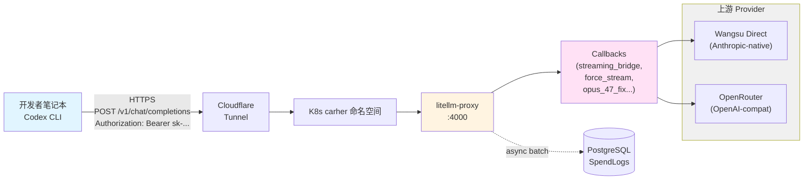
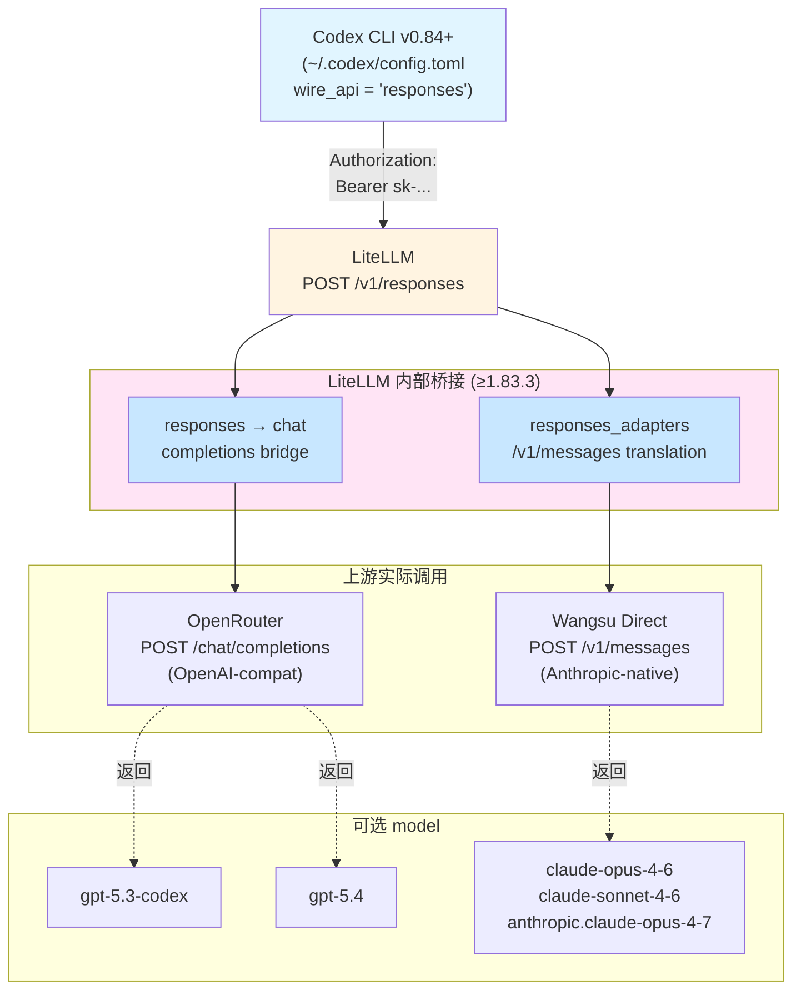
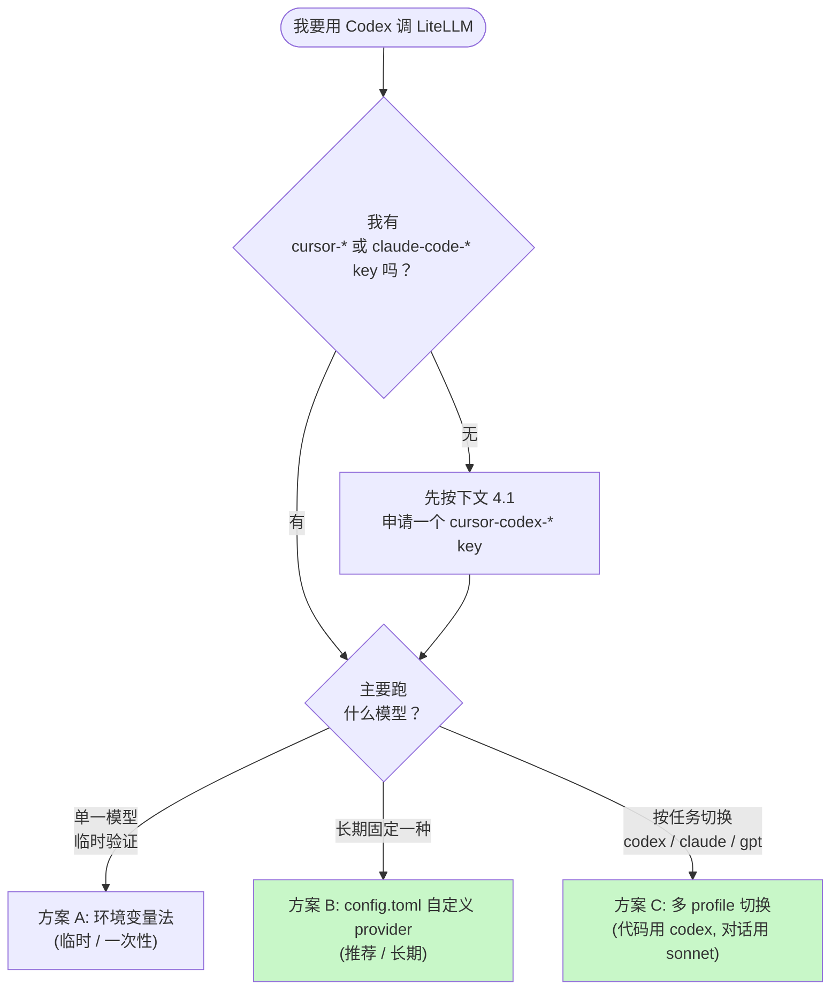

# 用 LiteLLM 上的 Claude / Cursor Key 接入 Codex CLI

> 调研日期：2026-04-28（**v2 修订**：跟进 OpenAI 在 2026-02-03 硬移除 `wire_api = "chat"` 之后的最新最佳实践）
> 适用范围：carher 项目内 LiteLLM Proxy（`https://litellm.carher.net`）
> 客户端：OpenAI Codex CLI（`@openai/codex`，**v0.84+ 必须用 `wire_api = "responses"`**）

## TL;DR（先抄作业）

1. **当前 Codex CLI 强制走 Responses API**。`wire_api = "chat"` 在 [PR #10498](https://github.com/openai/codex/pull/10498)（2026-02-03 merged）后被彻底移除，现在配 `chat` 直接报 `invalid configuration: wire_api = "chat" is no longer supported`。**只能用 `wire_api = "responses"`**。
2. **复用现有 key**。`claude-code-*` / `cursor-*` 下的虚拟 key 都可以直接给 Codex 用，allowlist 已含 GPT-5.4、GPT-5.3-codex、Claude Opus/Sonnet 4.6/4.7、Haiku 4.5 全套。
3. **重要前置：LiteLLM ≥ 1.83.3**。LiteLLM 在 1.83.3-stable 完整稳定了 `/v1/responses` ↔ `/v1/chat/completions` 双向桥接（[PR #24690 reasoning_items round-trip](https://docs.litellm.ai/release_notes/v1.83.3/v1-83-3-stable)、[PR #23784 Anthropic tool results](https://docs.litellm.ai/release_notes/v1.83.3/v1-83-3-stable) 等）。**当前线上是 1.82.x（v20260414 镜像），先升级再用 Codex 才稳**。否则可能在 OpenRouter 后端模型上撞到 `tools[0].name missing` / streaming 中断之类的转换 bug。

---

## 1. 现状盘点

### 1.1 LiteLLM 部署

| 维度 | 值 |
|------|----|
| 公网入口 | `https://litellm.carher.net`（Cloudflare Tunnel → `svc/litellm-proxy:4000`）|
| 镜像 | `cltx-her-ck-registry-vpc...cr.aliyuncs.com/her/litellm-proxy:v20260414-f07afd809c`（**基于 ghcr.io/berriai/litellm 1.82.x — 给 Codex 用前需先升到 ≥ 1.83.3**）|
| 认证 | Bearer Token（`Authorization: Bearer <key>`）|
| 协议 | OpenAI 兼容（`/v1/chat/completions`、`/v1/embeddings`） + Anthropic 兼容（`/v1/messages`） + **Responses（`/v1/responses`，Codex 唯一支持的协议）**|
| 配置源 | `k8s/litellm-proxy.yaml` 单文件（YAML-as-source-of-truth）|

### 1.2 模型清单（Codex 关心的部分）

来源：`k8s/litellm-proxy.yaml` 中的 `model_list`。

#### Anthropic 家族（Claude）

| `model_name` | 上游 | 入价 / 出价（per 1M token） | 备注 |
|--------------|------|------|------|
| `claude-opus-4-6` | Wangsu Direct（主） + OpenRouter（备） | $5 / $25 | bot 默认 OpenAI-compat 模式 |
| `claude-sonnet-4-6` | Wangsu Direct（主） + OpenRouter（备） | $3 / $15 | bot 默认 OpenAI-compat 模式 |
| `anthropic.claude-opus-4-6` | Wangsu Direct（Anthropic-native） | $5 / $25 | 走 `/v1/messages` |
| `anthropic.claude-opus-4-7` | Wangsu cheliantianxia6（主） + OpenRouter Anthropic-native（备） | $5 / $25 | **目前最强**；fallback 链 3 跳 |
| `anthropic.claude-sonnet-4-6` | Wangsu Direct（Anthropic-native） | $3 / $15 | 走 `/v1/messages` |
| `anthropic.claude-haiku-4-5` | Wangsu Direct（Anthropic-native） | $1 / $5 | 便宜快速；含 dated alias `claude-haiku-4-5-20251001` |
| `openrouter-claude-opus-4-6` | OpenRouter | 同 OR 当时价 | 兜底 |
| `openrouter-claude-opus-4-7` | OpenRouter | 同 OR 当时价 | 兜底 |
| `openrouter-claude-sonnet-4-6` | OpenRouter | 同 OR 当时价 | 兜底 |

> **Codex via Responses API 的协议适配**：Codex 现在只发 `/v1/responses` 请求；LiteLLM 收到后看上游 provider 是否原生支持 Responses：
> - **OpenAI 自家 (GPT-5.x via OpenRouter)**：OpenRouter 不支持原生 Responses，LiteLLM 自动桥接 `/v1/responses` → `/chat/completions`（[/responses Bridge](https://docs.litellm.ai/docs/response_api#calling-non-responses-api-endpoints-responses-to-chatcompletions-bridge)）。
> - **Anthropic via Wangsu Direct**：LiteLLM 也走 [v1/messages → /responses 适配器](https://docs.litellm.ai/docs/anthropic_unified/messages_to_responses_mapping)，把 Codex 的 Responses 调用翻译到 Anthropic 原生 `/v1/messages`，工具调用、thinking、context_management 全自动映射。
>
> 所以 **Codex 用户视角看是同一套 Responses API**，可以无差别选 `gpt-5.3-codex`、`claude-opus-4-7`、`claude-sonnet-4-6` 等。如果某个 model 上桥接出 bug（比如 tool schema 残缺），先优先换 `claude-opus-4-6`（OpenRouter chat 路径转 responses 是 LiteLLM 测试覆盖最完整的链路），其次 `gpt-5.3-codex`。

#### OpenAI 家族（GPT / Codex）

| `model_name` | 上游 | 入价 / 出价（per 1M token） | 备注 |
|--------------|------|------|------|
| `gpt-5.4` | OpenRouter（主） + Wangsu（备） | $2.5 / $15 | 通用 GPT 旗舰 |
| `wangsu-gpt-5.4` | Wangsu | 同 | 备份 |
| **`gpt-5.3-codex`** | OpenRouter | $3 / $15 | **Codex 官方推荐**：代码任务专精 |

#### Embedding 与其他

| `model_name` | 用途 |
|------|------|
| `BAAI/bge-m3` | 向量记忆检索（不是 Codex 用） |
| `gemini-3.1-pro-preview` / `wangsu-gemini-3.1-pro-preview` | 备选大模型 |
| `minimax-m2.7` / `glm-5` | 国产备选 |

### 1.3 Key 命名规则与默认限额

| 前缀 | 用途 | 默认每日预算 | allowlist |
|------|------|-------------|-----------|
| `carher-*` | Her bot 实例（业务用） | $150/天 | 全模型（含 bge-m3） |
| `claude-code-*` | Claude Code CLI 开发账户 | $100/天 | 全模型，含 Anthropic-native |
| `cursor-*` | Cursor IDE 开发账户 | $100/天 | 全模型 |

> **重要约定**：每次给 LiteLLM `model_list` 增加新 model_name 后，需要**批量同步** `claude-code-*` / `cursor-*` 的 `models` allowlist，否则会 401。详见 `.cursor/skills/litellm-key-mapping/SKILL.md` 的「批量同步 allowlist」章节。

---

## 2. 架构总览

### 2.1 调用拓扑



### 2.2 Codex Responses API 在 LiteLLM 内部的桥接

Codex CLI 只会发 `POST /v1/responses`。LiteLLM 收到后按上游 provider 决定怎么落地：



要点：
- **Codex 端只发 Responses**；上游协议差异完全被 LiteLLM 的 `responses_adapters` 隔离。
- **必须 LiteLLM ≥ 1.83.3**：1.82.x 的桥接器对 OpenRouter `tools[0].name` 和 streaming reasoning_items 还有边界 bug（[issue #14846](https://github.com/BerriAI/litellm/issues/14846)）。
- **不依赖 chat/completions**：哪怕你给 Codex 配的是上游不支持 Responses 的模型，LiteLLM 也会代你做 chat ↔ responses 双向转换。

### 2.3 Codex CLI 接入决策树



---

## 3. 三种接入方案

> **共同前提（必看）**：先把 LiteLLM Proxy 升级到 ≥ 1.83.3。1.82.x 时 Codex 跑 OpenRouter 后端模型有较高概率撞 [tools schema 转换 bug](https://github.com/BerriAI/litellm/issues/14846)。升级流程见 `.cursor/skills/litellm-ops/SKILL.md` 的「升级 LiteLLM 镜像」章节，做完一次 `bash scripts/litellm-healthcheck.sh` 确保 PASS=15 再继续。

### 方案 A：环境变量法（最简，临时验证用）

```bash
export OPENAI_BASE_URL="https://litellm.carher.net"
export OPENAI_API_KEY="sk-vr...你的cursor或claude-code key..."

codex --model gpt-5.3-codex
```

特点：
- 零配置改动，session 级生效；Codex 默认就走 Responses API（`wire_api = "responses"`）
- `OPENAI_BASE_URL` 不需要带 `/v1`，Codex 自己会拼 `/v1/responses`
- 缺点：每次开新 shell 都要 `export`；想切多个 profile 不方便
- 适合**临时跑通连通性**

### 方案 B：`~/.codex/config.toml`（推荐，长期使用）

写一个独立的 `litellm` provider，**`wire_api = "responses"`**（这是 0.84+ 唯一合法值）。**key 直接明文写在 `http_headers.Authorization` 里**——省掉环境变量和 shell rc 文件那一步。

```toml
# ~/.codex/config.toml

# ────── 默认模型 ──────
model = "gpt-5.3-codex"
model_provider = "litellm"
model_reasoning_effort = "medium"
show_raw_agent_reasoning = true

# ────── 模型 Provider 定义 ──────
[model_providers.litellm]
name = "carher LiteLLM"
base_url = "https://litellm.carher.net"
wire_api = "responses"
# key 直接以静态 header 写死，不走环境变量
http_headers = { "Authorization" = "Bearer sk-vr...你的key..." }
# 适当放宽 SSE idle，配合 LiteLLM 的 streaming_bridge heartbeat
stream_idle_timeout_ms = 120000
request_max_retries = 3
stream_max_retries = 5
```

> **原理**：Codex 的 provider 段没有专门的 `api_key` 字段，认证路径只有两条：① `env_key` 从环境变量读；② `http_headers` 直接写整条 header。把 `env_key` 删掉、用 `http_headers` 写死 `Authorization: Bearer <key>` 就完全等价 LiteLLM 接受的认证形式。
>
> **安全提醒**：明文 key 落在磁盘上，建议至少做两件事：
> ```bash
> chmod 600 ~/.codex/config.toml
> ```
> 并且**不要** commit 这个文件到 git / 同步到云盘 / 共享给同事。如果这台机器丢了或被入侵，立刻按下文 4.3 把对应 key 的 `max_budget` 调成 0 或直接 `/key/delete`。

随后：

```bash
codex                              # 用默认 gpt-5.3-codex
codex --model claude-sonnet-4-6    # 临时换 Claude
codex --model gpt-5.4              # 临时换 GPT-5.4
```

> Codex 的 `--model` 是 session 级覆盖，不会改 config.toml；想长期换默认模型把上面 `model = "..."` 改一下即可。

### 方案 C：多 Profile（按任务切换 codex / claude / gpt）

如果你想做到「代码任务跑 gpt-5.3-codex，复杂推理跑 opus-4.7，日常对话跑 sonnet-4.6」，用 `[profiles.*]` 段：

```toml
# ~/.codex/config.toml

profile = "codex"           # 默认 profile
model_provider = "litellm"  # 全局默认 provider

[model_providers.litellm]
name = "carher LiteLLM"
base_url = "https://litellm.carher.net"
wire_api = "responses"
http_headers = { "Authorization" = "Bearer sk-vr...你的key..." }
stream_idle_timeout_ms = 120000

# ────── Profile 定义 ──────
[profiles.codex]
model = "gpt-5.3-codex"
model_reasoning_effort = "high"

[profiles.opus]
model = "anthropic.claude-opus-4-7"   # LiteLLM 会通过 v1/messages → /responses 适配器
                                        # 把 Codex 的 Responses 调用翻译到 Anthropic 原生协议
                                        # 工具调用、thinking、context_management 全自动映射

[profiles.sonnet]
model = "claude-sonnet-4-6"
model_reasoning_effort = "low"

[profiles.gpt]
model = "gpt-5.4"
```

使用：

```bash
codex --profile codex   "重构 auth 模块的错误处理"
codex --profile opus    "帮我审计 streaming_bridge.py 的并发安全性"
codex --profile sonnet  "看下这个 PR diff 帮我写 commit message"
codex --profile gpt     "把这段 Python 翻译成 TypeScript"
```

profile 优先级：CLI `--profile` > config.toml 顶层 `profile = "..."` > 各字段单独的 top-level 默认值。

---

## 4. Key 申请与管理

### 4.1 申请新 key（cursor-codex-* 命名建议）

如果你想专门给 codex 划一个 key（便于按用途分账），在 LiteLLM Web UI 或通过 API 创建：

```bash
# 0. 起 kubectl 隧道 + port-forward（按需）
pgrep -af 'jms.*proxy laoyang' >/dev/null \
  || nohup scripts/jms proxy laoyang 16443 172.16.1.163 6443 > /tmp/jms-proxy.log 2>&1 &
sleep 2
kubectl port-forward -n carher svc/litellm-proxy 4000:4000 &

# 1. 拿到 master key
MK=$(kubectl get secret litellm-secrets -n carher \
       -o jsonpath='{.data.LITELLM_MASTER_KEY}' | base64 -d)

# 2. 创建 key
curl -s -X POST http://127.0.0.1:4000/key/generate \
  -H "Authorization: Bearer $MK" \
  -H "Content-Type: application/json" \
  -d '{
    "key_alias": "cursor-codex-liuguoxian",
    "max_budget": 100.0,
    "budget_duration": "1d",
    "models": [
      "gpt-5.3-codex",
      "gpt-5.4",
      "wangsu-gpt-5.4",
      "claude-opus-4-6",
      "claude-sonnet-4-6",
      "openrouter-claude-opus-4-6",
      "openrouter-claude-opus-4-7",
      "openrouter-claude-sonnet-4-6",
      "anthropic.claude-opus-4-6",
      "anthropic.claude-opus-4-7",
      "anthropic.claude-sonnet-4-6",
      "anthropic.claude-haiku-4-5"
    ],
    "metadata": {"purpose": "codex-cli", "owner": "liuguoxian"}
  }' | jq
```

返回里的 `"key": "sk-..."` 就是你要写进 `~/.codex/config.toml` 中 `http_headers.Authorization = "Bearer <这里>"` 的值。**只显示一次**，丢了只能重建。

> 命名前缀建议沿用 `cursor-codex-*` 或 `claude-code-codex-*`，这样默认会被 `litellm-budget-mgmt` skill 的批量脚本识别为「CLI 开发者账户」类，沿用 $100/d 预算。

### 4.2 复用现有 key

如果懒得新建，可以直接用你现有的 `cursor-liuguoxian` 或 `claude-code-liuguoxian-*`：

```bash
# 列出自己的 key
curl -s "http://127.0.0.1:4000/spend/keys?limit=600" \
  -H "Authorization: Bearer $MK" \
  | jq '.[] | select(.key_alias | test("liuguoxian"; "i")) | {key_alias, max_budget, budget_duration, spend, token}'
```

注意：复用 key 意味着 codex 调用会和原来 Cursor / Claude Code 的 spend **混在一起**。账面上不容易拆分，但简单。

### 4.3 调整预算（按需）

```bash
# 把某个 key 的每日预算改成 $50
curl -s -X POST http://127.0.0.1:4000/key/update \
  -H "Authorization: Bearer $MK" \
  -H "Content-Type: application/json" \
  -d '{"key": "<token-hash>", "max_budget": 50.0, "budget_duration": "1d"}'
```

详见 `.cursor/skills/litellm-budget-mgmt/SKILL.md`。

---

## 5. 验证连通性

按从下到上的顺序排查：先确认 LiteLLM 端 `/v1/responses` 通，再让 Codex 跑。

### 5.1 直接打 LiteLLM 的 Responses 端点（curl）

```bash
KEY="sk-..."   # 直接贴进来，shell 局部变量，不持久化

# 非流式
curl -s https://litellm.carher.net/v1/responses \
  -H "Authorization: Bearer $KEY" \
  -H "Content-Type: application/json" \
  -d '{
    "model": "gpt-5.3-codex",
    "input": "say hi in 5 words",
    "stream": false
  }' | jq
```

期望：返回 `{"id": "resp_...", "object": "response", "output": [...], "usage": {...}}`。

> 注意 Responses API 的 schema 与 chat-completions **不一样**：
> - 用 `input`（字符串或消息数组）替代 `messages`
> - 返回里是 `output` 数组（含 `output_text` / `function_call` 等），不是 `choices[0].message`
> - `max_tokens` 改名 `max_output_tokens`
>
> 完整字段映射见 [LiteLLM v1/messages → /responses Mapping](https://docs.litellm.ai/docs/anthropic_unified/messages_to_responses_mapping)。

### 5.2 流式（SSE）

```bash
curl -N https://litellm.carher.net/v1/responses \
  -H "Authorization: Bearer $KEY" \
  -H "Content-Type: application/json" \
  -d '{
    "model": "claude-sonnet-4-6",
    "input": "数到 10",
    "stream": true
  }'
```

期望：看到一连串 `event: response.output_text.delta` / `event: response.completed` 等 Responses-style SSE 帧。**注意不是** chat-completions 那种 `data: [DONE]` 终止符。

### 5.3 兼容性自检（旧 chat-completions 端点应被旁路）

LiteLLM `/v1/chat/completions` 端点继续可用（carher-* / claude-code-* 业务还在用），不影响 Codex。两个端点对同一个 key 都能通：

```bash
# chat-completions 仍工作（其他业务用）
curl -s https://litellm.carher.net/v1/chat/completions \
  -H "Authorization: Bearer $KEY" \
  -d '{"model": "gpt-5.3-codex", "messages": [{"role":"user","content":"hi"}]}' | jq '.choices[0].message.content'

# responses 也工作（Codex 用）
curl -s https://litellm.carher.net/v1/responses \
  -H "Authorization: Bearer $KEY" \
  -d '{"model": "gpt-5.3-codex", "input": "hi"}' | jq '.output[0].content'
```

### 5.4 Codex 一把过

```bash
codex --model gpt-5.3-codex "echo hello"
# 或
codex --profile codex "解释一下当前目录的代码结构"

# 调试模式（看到完整请求/响应链路）
RUST_LOG=debug codex e "say hi"
```

如果跑不通，看 RUST_LOG=debug 输出里的：
- `Configuring session: model=...; provider=ModelProviderInfo {...}` —— 确认 wire_api=Responses, base_url 对
- 第一条 HTTP 请求的状态码和 body —— 直接对照下文「常见坑」

---

## 6. 常见坑与排错

| 症状 | 根因 | 处置 |
|------|------|------|
| `invalid configuration: wire_api = "chat" is no longer supported` | Codex ≥ 0.84.0 不再接受 chat 协议（[PR #10498 2026-02-03](https://github.com/openai/codex/pull/10498)） | config.toml 改 `wire_api = "responses"`；本文档 v2 推荐配置 |
| `401 key not allowed to access model: gpt-5.3-codex` | key 的 `models` allowlist 不含该 model | 按 4.1 重建 key 或 `/key/update` 补 allowlist |
| `400 Missing required parameter: 'tools[0].name'` | LiteLLM 1.77.x 桥接 Codex Responses 到 OpenRouter chat 时 tool schema 翻译漏字段（[issue #14846](https://github.com/BerriAI/litellm/issues/14846)） | 升级 LiteLLM 到 ≥ 1.83.3（社区确认 1.78.7 修复主路径，1.83.3 修齐 reasoning_items / tool_results 边界 case）|
| `stream error: unexpected status 400` 或 SSE 中途断 | 同上，LiteLLM responses ↔ chat 桥接转换 bug | 升级 LiteLLM；临时换一个 model（`claude-opus-4-6` 是测试覆盖最完整的）|
| Codex 提示 `item not found in turn state` | OpenRouter 部分模型不支持 Responses-style turn state（[issue #9679](https://github.com/openai/codex/issues/9679)） | 换走 Wangsu Direct 的模型（`anthropic.claude-*` 系列）；或用 OpenRouter 上同档不同 provider |
| 每次请求等 ~600s 才超时 | httpx 默认 timeout 没被 patch（旧 streaming_bridge） | 检查 LiteLLM pod boot log 应有 `streaming_bridge: patched anthropic httpx client timeout (read=120.0s)`；缺则按 `litellm-ops` skill 的 sync 流程修 |
| Codex tool calling 丢失参数 | LiteLLM responses ↔ messages 桥接对某些 tool schema 字段映射不全 | 优先 `claude-opus-4-6` / `gpt-5.3-codex`；再不行升 LiteLLM 到 nightly |
| Codex 报 `Budget exceeded` | key 的 `spend` 累计触顶 | `litellm-budget-mgmt` skill 步骤 3 重置 spend 为 0；或临时上调 `max_budget` |
| 502 Bad Gateway | LiteLLM proxy 自身故障 | 跑 `bash scripts/litellm-healthcheck.sh`；详见 `litellm-ops` skill |

### 6.1 LiteLLM 版本要求与升级

| 你当前的 LiteLLM 版本 | Codex 可用性 | 建议 |
|---------------------|------------|------|
| < 1.63.8 | ❌ 不支持 `/v1/responses` 端点 | 强制升级 |
| 1.63.8 ~ 1.77.x | ⚠️ 端点存在但桥接 bug 多（OpenRouter tool schema、reasoning items） | 升级 |
| 1.78.7 ~ 1.82.x | ⚠️ 主路径可用，OpenRouter 后端模型上仍偶发 streaming 断流 | **当前 carher 状态**；建议升级 |
| ≥ 1.83.3-stable | ✅ Responses ↔ chat / Responses ↔ messages 双向稳定 | 推荐目标版本 |

升级流程（参考 `.cursor/skills/litellm-ops/SKILL.md` 的「升级 LiteLLM 镜像」章节）：

```bash
# 1. 拉新镜像到构建服务器
scripts/jms ssh k8s-work-227 'nerdctl pull ghcr.io/berriai/litellm:v1.83.3-stable'

# 2. Kaniko 推到 ACR（更新 k8s/litellm-build-job.yaml --destination tag 后 apply）

# 3. 更新 k8s/litellm-proxy.yaml 中 initContainers 和 containers 的 image 一起改
kubectl apply -f k8s/litellm-proxy.yaml
kubectl rollout status deploy/litellm-proxy -n carher --timeout=300s

# 4. 健康检查
bash scripts/litellm-healthcheck.sh        # 期望 PASS=15
curl -s -o /dev/null -w "%{http_code}\n" \
  https://litellm.carher.net/health         # 期望 401（不是 502）

# 5. Codex 端到端冒烟
codex --model gpt-5.3-codex "say hi"
codex --model claude-opus-4-7  "say hi"
codex --model claude-sonnet-4-6 "say hi"
```

### 6.2 排查请求轨迹的 SQL

如果 Codex 跑出问题想定位具体请求：

```bash
KEY_ALIAS="cursor-codex-liuguoxian"   # 改成你的
kubectl exec litellm-db-0 -n carher -- psql -U litellm -d litellm -c "
SELECT
  to_char(sl.\"startTime\" AT TIME ZONE 'Asia/Shanghai', 'MM-DD HH24:MI:SS') AS bjt,
  EXTRACT(EPOCH FROM (sl.\"endTime\" - sl.\"startTime\"))::int AS dur_s,
  sl.completion_tokens AS toks,
  sl.model,
  sl.spend
FROM \"LiteLLM_SpendLogs\" sl
JOIN \"LiteLLM_VerificationToken\" vt ON sl.api_key = vt.token
WHERE vt.key_alias = '$KEY_ALIAS'
  AND sl.\"startTime\" > NOW() - INTERVAL '1 hour'
ORDER BY sl.\"startTime\" DESC LIMIT 30;"
```

判读规则参考 `litellm-ops` skill 「症状字典」。

---

## 7. Cheat Sheet

> **前提**：LiteLLM 已升级到 ≥ 1.83.3（见 6.1）。

复制下面两段就能 3 分钟跑起来（把 `KEY` 替换成你自己的 sk-... key）：

**第 1 步：写配置**

```bash
KEY="sk-vr...你的key..."
mkdir -p ~/.codex
cat > ~/.codex/config.toml <<TOML
model = "gpt-5.3-codex"
model_provider = "litellm"
model_reasoning_effort = "medium"

[model_providers.litellm]
name = "carher LiteLLM"
base_url = "https://litellm.carher.net"
wire_api = "responses"
http_headers = { "Authorization" = "Bearer ${KEY}" }
stream_idle_timeout_ms = 120000
TOML
chmod 600 ~/.codex/config.toml
```

**第 2 步：跑**

```bash
codex --model gpt-5.3-codex "讲个笑话验证一下"
```

完事。需要切换到 Claude？`codex --model claude-sonnet-4-6`。需要按任务划分 profile？翻到方案 C。

---

## 附录 A：参考资料（按权威性排序）

### Codex CLI（OpenAI 官方）

- [Codex CLI 高级配置](https://developers.openai.com/codex/config-advanced) —— `model_providers`、`wire_api`、`http_headers` 等字段权威定义
- [Codex CLI 配置示例](https://developers.openai.com/codex/config-sample/) —— 全字段含注释的样例 `config.toml`
- [GitHub: Deprecating chat/completions support](https://github.com/openai/codex/discussions/7782) —— 废弃公告，硬移除时间线、迁移指引
- [PR #10498: drop wire_api from clients](https://github.com/openai/codex/pull/10498)（2026-02-03 merged）—— "chat" 真正被移除的 commit
- [Issue #9679: item not found in turn state when use chat/completion protocol](https://github.com/openai/codex/issues/9679) —— 官方推荐换 responses

### LiteLLM Responses API 桥接

- [/responses 端点文档](https://docs.litellm.ai/docs/response_api) —— 总览，包含 streaming / WebSocket / fallback / loadbalancing
- [/responses → /chat/completions Bridge](https://docs.litellm.ai/docs/response_api#calling-non-responses-api-endpoints-responses-to-chatcompletions-bridge) —— 不原生支持 Responses 的 provider 怎么自动桥接
- [v1/messages → /responses 参数映射](https://docs.litellm.ai/docs/anthropic_unified/messages_to_responses_mapping) —— Anthropic 协议↔Responses 全字段对照表
- [v1.83.3-stable Release Notes](https://docs.litellm.ai/release_notes/v1.83.3/v1-83-3-stable) —— 关键的 Responses 稳定性 PR 清单
- [Issue #14846: LiteLLM proxy for Codex CLI does not work with the new gpt-5-codex model](https://github.com/BerriAI/litellm/issues/14846) —— 已知 bug 历史和修复版本

### 第三方对比阅读

- [Codex Provider Configuration: --provider, config.toml & Custom Endpoints (morphllm)](https://www.morphllm.com/codex-provider-configuration) —— 各种 provider 配置示例的速查
- [LiteLLM 官方 OpenAI Codex 教程](https://docs.litellm.ai/docs/tutorials/openai_codex) —— 注意：这页样例还是旧的 chat 协议风格，仅作背景阅读

## 附录 B：相关项目内 Skill 索引

| Skill | 何时翻 |
|------|------|
| `.cursor/skills/litellm-key-mapping/SKILL.md` | 查/删 key、批量同步 allowlist |
| `.cursor/skills/litellm-budget-mgmt/SKILL.md` | 改预算、重置 spend |
| `.cursor/skills/litellm-ops/SKILL.md` | LiteLLM 升级（6.1 步骤的母本）、502/524、流式假成功、callback drift |
| `.cursor/skills/litellm-hook-dev/SKILL.md` | 给 LiteLLM 加新 callback / hook |
| `.cursor/skills/k8s-via-bastion/SKILL.md` | 起 kubectl 隧道 |

## 附录 C：变更记录

| 版本 | 日期 | 主要变更 |
|------|------|---------|
| v1 | 2026-04-28 | 初版，推荐 `wire_api = "chat"` |
| **v2** | 2026-04-28 (傍晚) | 跟进 Codex 0.84+ 硬移除 chat 协议：① 全量改 `wire_api = "responses"`；② 新增 LiteLLM 版本要求（≥ 1.83.3）；③ 重画架构图反映 Responses Bridge；④ 重写「常见坑」表，移除已失效的 chat 兜底建议 |
