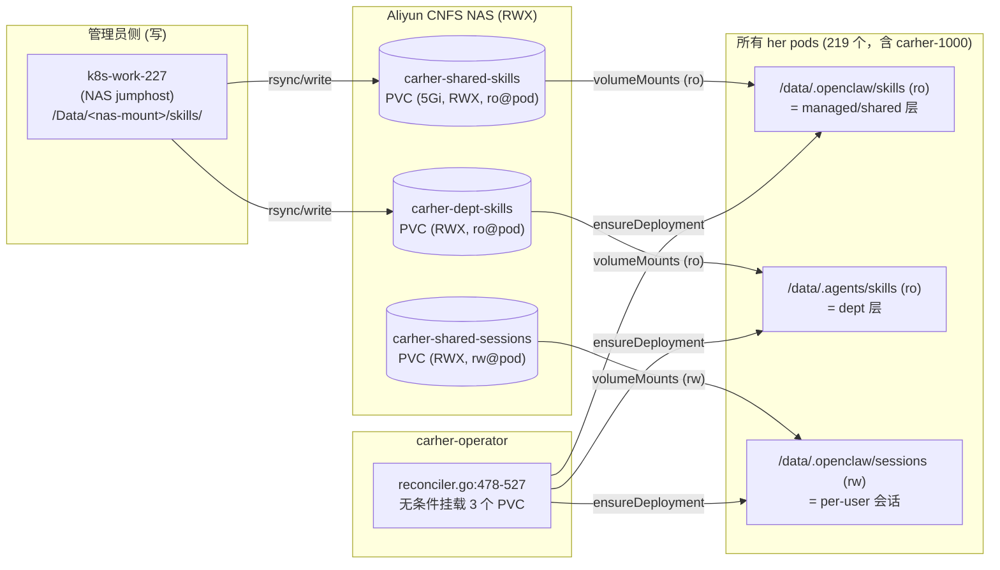
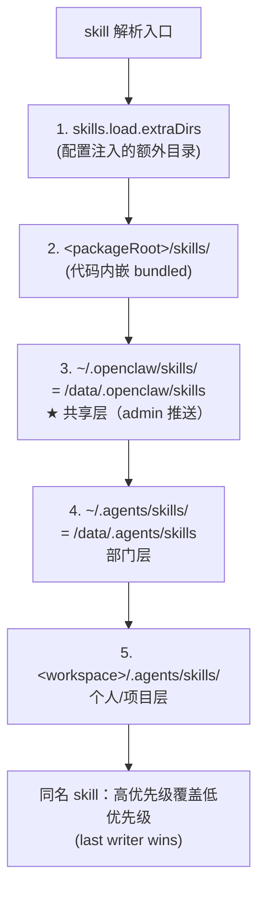
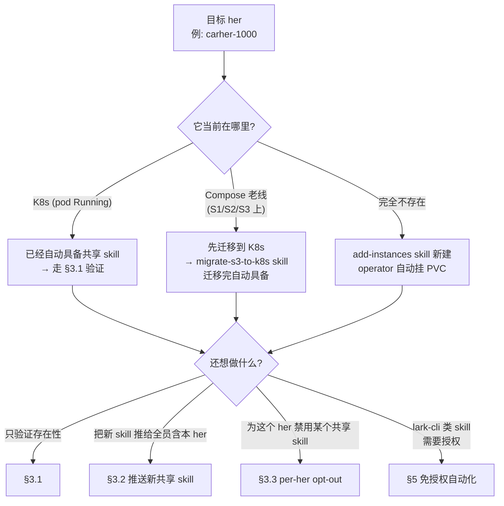
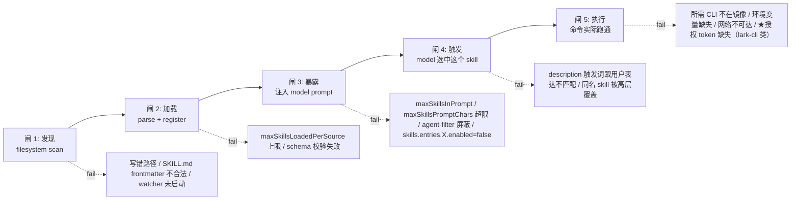
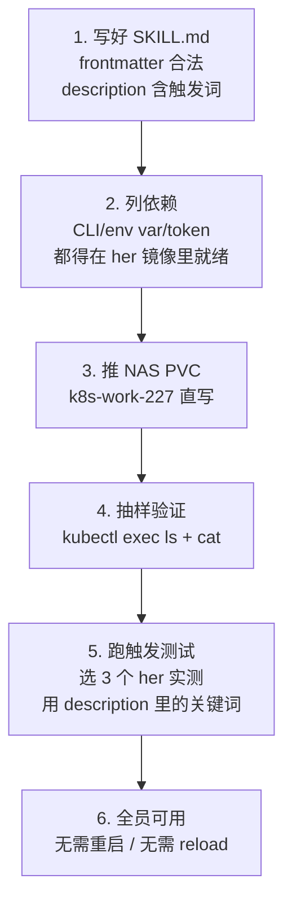
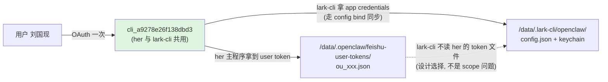
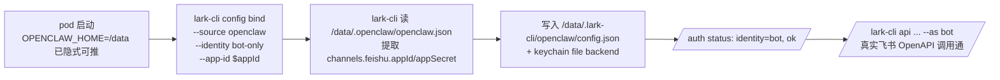
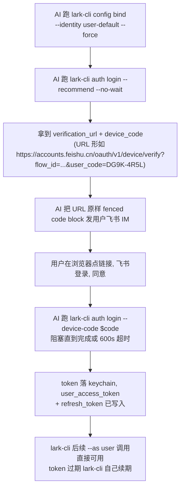

# 让某个 her 自动具备共享 Skills 能力 — 架构原理与操作手册

> 适用范围：carher 主程序 v2026+ + carher-admin/operator 当前版本。
> 触发场景：用户给定 `carher-1000` 这种已知 her id（连带 owner、bot id、appSecret），要"快速、自动、零中断"让它具备共享 skill 的使用能力。

---

## 0. TL;DR（先看结论）

**只要 her 已经在 K8s 上跑（pod 存在且 Running），它就已经具备共享 skill 能力，不需要再开关、不需要改 CRD、不需要改 openclaw.json。** 真正需要做的是：

1. **验证** — `kubectl exec` 进 pod 看 `/data/.openclaw/skills/` 是否挂上、有内容。
2. **如果想给"全体 her（含 carher-1000）" 新增一个共享 skill** — 把 SKILL.md 写进 `carher-shared-skills` PVC（这是 Aliyun NAS RWX PVC），所有 219 个 pod 立即可见，下次 `/new` session 自动加载。
3. **如果这个 her 还在 Compose 老线（S1/S2/S3）上跑** — 它不在 K8s 上，没有 NAS PVC 挂载，需要先走迁移（`migrate-s3-to-k8s` skill），落到 K8s 后自动具备。

但**"挂上 ≠ 用户能立刻用上"**。从 SKILL.md 落盘到用户在飞书里说一句话能触发，要过 5 道闸（详见 §4）。其中 **lark-cli 类 skill 还卡着用户授权**——这是当前最大的体验阻塞，§5 给出"免授权自动化"设计。

> 关键：你说的 **owner / bot id / appSecret** 不参与 skill 加载链路。它们用于 her 实例的 OAuth、IM 接入、消息授权，跟 skill 完全正交。这里不需要它们。

---

## 1. 架构原理

### 1.1 共享 skill 是怎么"自动"挂到每个 her 的



要点：

- **挂载是无条件的**。`operator-go/internal/controller/reconciler.go:478-527` 没有任何 `if spec.SharedSkillsEnabled` 之类的 gate。CRD schema (`k8s/crd.yaml`) 也没有 skill 相关字段。
- **PVC 是 RWX (ReadWriteMany)**，pod 端只读。这意味着任何 pod 都能立刻看到管理员写到 NAS 上的新文件，不用 reload、不用重启。
- **管理员写入路径**：建议走 `k8s-build-buildkit-config` skill 里讲到的方式 — k8s-work-227 已经把所有阿里云 NAS root 挂在 `/Data`，可以直接写文件，省掉 `kubectl cp + 临时 pod` 这条容易出错的链路。

### 1.2 CarHer 主程序如何发现并加载 skill

主仓 (`~/codes/CarHer`) 的 skill loader (`src/agents/skills/refresh.ts:56-72`, `workspace.ts:549`) 在每次启动 / 每次 `/new` 时按以下顺序扫描：



| 层 | 容器内路径 | 来源 | 优先级 | 当前是否启用 |
|---|---|---|---|---|
| bundled | `<pkg>/skills/` | 镜像内嵌 | 最低 | 自动 |
| **managed/shared** | `/data/.openclaw/skills` | `carher-shared-skills` PVC | 中 | **自动（默认全员）** |
| dept | `/data/.agents/skills` | `carher-dept-skills` PVC | 高 | 自动 |
| personal/project | `<workspace>/.agents/skills` | per-user PVC | 最高 | 自动 |

**没有 skill 级"feature flag"**。要单独禁用某个 skill 只能在 her 的 `openclaw.json` 加 `skills.entries.<name>.enabled = false`，但默认全开。

### 1.3 为什么 owner / bot id / appSecret 在本任务中不起作用

| 字段 | 作用 | 跟共享 skill 加载有关吗 |
|---|---|---|
| `owner` (per-app open_id) | DM 授权、commands.allowFrom | ✗ 无关 |
| `appId` / `appSecret` | 飞书 OAuth、IM webhook 验签 | ✗ 无关 |
| `botOpenId` | 群聊里识别自己 | ✗ 无关 |
| **PVC 挂载** | 把 NAS 上的 skill 文件投射进容器 | ✓ **唯一决定因素** |

→ "我有 owner+bot id+secret" 这条信息，对**新建/重置/迁移** her 是关键，但对"让 her 拥有共享 skill 能力"这个独立操作完全不必要。

---

## 2. 操作决策树



---

## 3. 具体操作（含可直接复制的命令）

> 所有 kubectl 必须走 `scripts/jms` 包装器（k8s-via-bastion）。下面命令省略前缀，假设隧道已起。

### 3.1 验证 carher-1000 已具备共享 skill 能力

```bash
# Step 1：确认 pod 存在
kubectl -n carher get pod -l app=carher-1000 -o wide

# Step 2：列出共享 skill 目录
kubectl -n carher exec deploy/carher-1000 -c carher -- \
  ls -la /data/.openclaw/skills

# Step 3：确认 mount 类型是 NFS (而不是空目录)
kubectl -n carher exec deploy/carher-1000 -c carher -- \
  mount | grep "/data/.openclaw/skills"
```

**期望输出**（与 §1.1 数据点对应）：
- Step 2 至少有 16 个子目录（antitalker / cron-delivery-guard / feishu-* / her-self-inspect / skill-creator …）
- Step 3 显示 `... type nfs ... ro,...`

### 3.2 推送一个新的共享 skill 给全员（含 carher-1000）

**推荐路径：k8s-work-227 NAS jumphost**（不会触发 kubectl cp 那条不稳定链路）

```bash
# Step 1：在 k8s-work-227 上定位 carher-shared-skills 在本地的 mount
ssh k8s-work-227 'ls /Data | grep nas-429a1fe7'
# 例：/Data/nas-429a1fe7-c0cb-4cf4-9349-8268e39c9acb/

# Step 2：把 SKILL.md 写进去
SKILL=my-new-shared-skill
ssh k8s-work-227 "mkdir -p /Data/nas-429a1fe7.../skills/${SKILL} && \
  cat > /Data/nas-429a1fe7.../skills/${SKILL}/SKILL.md" < ./SKILL.md

# Step 3：立即在任一 pod（含 carher-1000）验证可见
kubectl -n carher exec deploy/carher-1000 -c carher -- \
  cat /data/.openclaw/skills/${SKILL}/SKILL.md | head -20
```

### 3.3 让 carher-1000 单独禁用某个共享 skill（罕见）

在 carher-1000 的 user-config ConfigMap（per-instance）里追加：

```json
{
  "skills": {
    "entries": {
      "name-of-skill-to-disable": { "enabled": false }
    }
  }
}
```

走 `carher-instance-config-override` skill 的 single-instance 覆盖流程；reloader sidecar 5s 内会让新配置生效，不需要重启 pod。

---

## 4. 共享 ≠ 立刻可用：从落盘到触发的 5 道闸

**这是关键认知**。把 SKILL.md 写进 NAS 只完成了第 1 道闸；用户在飞书说一句话能真正触发 skill，要全部 5 道闸都过：



### 4.1 每道闸的检查清单

| 闸 | 通过条件 | 验证手段 | 失败的典型表现 |
|---|---|---|---|
| **1 发现** | SKILL.md 落在 `/data/.openclaw/skills/<name>/SKILL.md`；frontmatter 合法（`name` + `description` 必填）| `kubectl exec -- ls /data/.openclaw/skills/<name>` | her 日志里看不到 skill 注册行 |
| **2 加载** | 解析成功，注册进 skill 注册表；不超过 `skills.limits.maxSkillsLoadedPerSource` | `kubectl exec -- cat /data/.openclaw/logs/skills.log` | 注册数 < 文件数 |
| **3 暴露** | 注入到 model system prompt / tool 目录；总 token 数 < `maxSkillsPromptChars`；当前 agent 的 filter 允许 | `kubectl exec -- ... skill list`（如果有此命令）；或在 her 飞书里 `/skill list` | 模型回复"我不知道这个能力"，但 ls 能看到文件 |
| **4 触发** | 用户消息里的关键词命中 skill 的 `description` 字段；模型决定调用 | 实际用户测试；或在 her 里输入 trigger 词 | 用户说话后 skill 不被调用，模型走默认回复 |
| **5 执行** | skill 内部命令需要的 CLI 已在镜像 / 环境变量已注入 / 授权 token 可用 | 跑一遍真实场景，看是否 success | 报错"command not found"、"401 unauthorized"、"missing token" |

### 4.2 上架一个新共享 skill 的最小 checklist



关键点：

- **`description` 字段是触发关键**。模型只看 description 决定要不要 invoke。"触发词" 列得越具体（飞书 / 邮件 / 日历 / 妙记 等中文常用词），命中率越高。
- **依赖必须 in-image**。共享 skill 是只读 PVC，不能 `npm install` / `apt install`。所有可执行 CLI 必须打进 `her/carher` 镜像（或放到一个 sidecar）。
- **触发测试不能省**。"它在 ls 里能看见" 不证明 "用户能用" — 必须有一次"用户输入触发词 → her 真的调用 → 拿到结果"的端到端验证。

### 4.3 当前已知的 5 类执行卡点

| 卡点类别 | 例子 skill | 解法 |
|---|---|---|
| **CLI 不在镜像** | 某 skill 需要 `gh` 但镜像无 | 加进 `her/carher` Dockerfile，重新构建滚动 |
| **环境变量未注入** | LITELLM_API_KEY 在 admin 没下发 | 走 base-config 注入 / 走 per-her Secret |
| **网络不可达** | 调外网 API 但 K8s egress 限制 | 加 Aliyun egress route 或走 LiteLLM 代理 |
| **per-user 数据缺失** | 需要个人 Calendar 历史 | 用 user-data PVC 持久化 |
| **★ 用户授权缺失** | lark-cli 全家桶 (im/calendar/mail/doc) | 见 §5 免授权自动化 |

第 5 类是当前最大的体验阻塞，独立成节。

---

## 5. lark-cli 授权自动化（实测重写版，2026-05-16）

> 本节内容在 2026-05-16 通过 carher-2000 沙盒（user_id=2000，复用 carher-1000 凭据）实地验证后重写。
> 此前版本基于推测，多处与实情不符，已替换。

### 5.1 关键事实（已现场验证）

| # | 事实 | 实测数据点 |
|---|---|---|
| 1 | her 容器 `HOME` | `/data` |
| 2 | lark-cli 安装路径 | `/data/.openclaw/local/bin/lark-cli`（npm `@larksuite/cli@1.0.31`，**非镜像自带，按需 npm install**）|
| 3 | lark-cli 配置目录 | `/data/.lark-cli/openclaw/`（容器 root，**不在 user-data PVC 内**，pod 重启丢）|
| 4 | her 与 lark-cli **共用同一个飞书 app** | her-1000 CRD `spec.appId = cli_a9278e26f138dbd3`；lark-cli config `appId = cli_a9278e26f138dbd3` ← **同一个** |
| 5 | her 主程序的 user OAuth token 存放 | `/data/.openclaw/feishu-user-tokens/ou_<open_id>.json` |
| 6 | her token 字段 | `open_id, name, access_token, refresh_token, access_token_expires_at, refresh_token_expires_at, scopes(56 项), created_at, updated_at` |
| 7 | lark-cli 登录方式 | 仅 device flow，无 `--token` 直接导入参数 |
| 8 | lark-cli 凭证后端 | OS keychain；Linux 容器内走 `99designs/keyring` 的 file 回退 |
| 9 | **官方有 OpenClaw 集成入口** | `lark-cli config bind --source openclaw --app-id <id>` — 自动从 `$OPENCLAW_HOME/.openclaw/openclaw.json` 拿 app credentials 写自己 keychain，**不走 OAuth** |
| 10 | bot 身份 0 步免授权 | her-2000 实测：bind 后直接 `lark-cli api GET /open-apis/bot/v3/info --as bot` 返回 code:0（拿到 bot 自己的 app_name + open_id）|
| 11 | user 身份仍需 1 次 OAuth | bind --identity user-default 后还要 `auth login --recommend`；**lark-cli 不读 `feishu-user-tokens/` 文件**，her 主程序已有的 token 不能直接给 lark-cli 用 |
| 12 | 颠覆旧假设：用户**从未用过** lark-cli | her-1000 实测 `lark-cli auth status` = `not configured` → 之前推测"用户被 device flow 卡住"是错的，**真相是 lark-cli 在所有 her 上都是 first time setup** |

### 5.2 ★ 推翻之前的"两个不同 app"假设

之前文档把 her 主程序的 app 和 lark-cli 的 app 画成两个独立 app（蓝/红方框）。**事实是同一个 app**：



scope 通的，问题不在 scope；问题是 lark-cli 没实现"从外部 file 加载 user token"的代码路径。

### 5.3 官方解：`config bind --source openclaw`

lark-cli 在 `config bind --help` 里明确写：

> Bind an AI Agent's (OpenClaw / Hermes / Lark Channel) Feishu credentials to a lark-cli workspace.
> `--source` is auto-detected from env (OPENCLAW_HOME / HERMES_HOME / LARK_CHANNEL).

bot 身份的完整 0 步链路：



**实测命令**（her-2000 沙盒已通）：

```bash
# 1. 拿 appId（从 openclaw.json 解析，不能 hard-code）
APP_ID=$(python3 -c "import json; print(json.load(open('/data/.openclaw/openclaw.json'))['channels']['feishu']['appId'])")

# 2. bind（OPENCLAW_HOME 不存在则 fallback /data；不冲突）
OPENCLAW_HOME=/data /data/.openclaw/local/bin/lark-cli \
  config bind --source openclaw --identity bot-only --app-id "$APP_ID"

# 3. 验证
OPENCLAW_HOME=/data /data/.openclaw/local/bin/lark-cli auth status
# → identity: bot, ok

# 4. 真实调用
OPENCLAW_HOME=/data /data/.openclaw/local/bin/lark-cli \
  api GET /open-apis/bot/v3/info --as bot
# → code: 0, bot.app_name, bot.open_id, ...
```

### 5.4 user 身份：1 次 OAuth（不可绕过）

user 身份必须走一次 device flow。bind 之后流程是：



关键 hint（lark-cli 自己 stderr 里讲了）：
- **不要让用户自己跑命令**，要 AI 替用户跑；用户只点链接
- URL 原样输出，不要 URL encode / Markdown link 包装 / 加空格
- device_code 10 分钟过期；超时重跑 `auth login --no-wait`

### 5.5 PVC 边界陷阱（init hook 必须每次启动跑）

| 路径 | 是否在 user-data PVC | pod 重启后 |
|---|---|---|
| `/data/.openclaw/local/bin/lark-cli` | ✅ 在 PVC | 保留 |
| `/data/.openclaw/feishu-user-tokens/` | ✅ 在 PVC | 保留 |
| `/data/.openclaw/skills/` | ✅ NAS RWX PVC | 保留 |
| **`/data/.lark-cli/openclaw/config.json`** | ❌ **不在 PVC（容器 root）** | **丢** |
| **`/data/.lark-cli/openclaw/keychain (file backend)`** | ❌ **不在 PVC** | **丢** |

→ **凡是依赖 `lark-cli config bind` / `lark-cli auth login` 结果的自动化，必须每次 pod 启动重跑**。这是 §5.7 init hook 的根本动机。

实测：her-2000 在 image patch `fix-compact-eb348941 → 67ffa406-clean` 后，新 pod 里 `/data/.lark-cli/` 完全不存在；要重跑 `config bind` 才能恢复。

### 5.6 token 续期（lark-cli 自己管，无需 admin 后台 worker）

之前文档画了 admin 后台轮询 refresh 的 worker。**实测：lark-cli 自己持有 refresh_token，在每次 API 调用时按需自动 refresh，无需 admin 介入**。

- bot 身份的 tenant_access_token：lark-cli 每次调用时若已过期即 self-refresh
- user 身份的 user_access_token：同上，用 lark-cli 自己存的 refresh_token
- 仅当 refresh_token 过期（默认 30 天）才需要重走 §5.4 OAuth；30 天内的 user 操作都是免感知

admin 后台**不需要**写 refresh worker。文档老版本里的 `backend/sync_worker.py` 加 refresh 循环 / `carher-{uid}-lark-cli-auth` Secret 都**不必要**。

### 5.7 落地方案（取代旧版 ABC 三方案）

#### 5.7.1 bot 身份：init hook（无用户参与，全自动）

每次 pod 启动跑一次幂等 bind 脚本，bot 全员立即可用。

**实现位置选择**：

| 落点 | 改动量 | 用户感知 | 适用 |
|---|---|---|---|
| **carher 主仓 `docker/entrypoint.sh`** | 1 行 shell | 0 — 全 219 个 her 自动具备 | 推荐 — 镜像层永久 |
| 一次性 `kubectl exec` 推送 | 0 改代码，~30s 全员 | 0 | 应急 / 临时验证 |
| OpenClaw skill 内置流程 | 改 lark-shared skill | 0 — AI 首次需要时自动跑 | 备选 — 不依赖镜像更新 |

参考实现见 `scripts/lark-cli-auto-bind.sh`（本仓自带）。镜像 entrypoint 集成只需追加一行：

```sh
# carher 主仓 docker/entrypoint.sh 末尾追加
/data/.openclaw/local/bin/lark-cli config bind --source openclaw \
  --identity bot-only \
  --app-id "$(jq -r .channels.feishu.appId /data/.openclaw/openclaw.json)" \
  >/data/.openclaw/logs/lark-bind.log 2>&1 || true
```

#### 5.7.2 user 身份：admin 引导式 OAuth（用户点 1 次链接，30 天免感知）

```mermaid
flowchart TD
  M1[admin POST /api/instances/{uid}/lark-cli/user-auth<br/>请求颁发 user 身份] --> M2[admin kubectl exec her pod:<br/>lark-cli config bind --identity user-default --force]
  M2 --> M3[admin kubectl exec her pod:<br/>lark-cli auth login --recommend --no-wait]
  M3 --> M4[拿 verification_url + device_code]
  M4 --> M5["用 her 自己的 IM 把 URL 推给 owner<br/>(飞书 webhook 卡片或纯文本)"]
  M5 --> M6[用户在飞书点链接 → 浏览器 → 同意]
  M6 --> M7[admin kubectl exec her pod:<br/>lark-cli auth login --device-code $code<br/>阻塞等用户授权完成]
  M7 --> M8[完成，token 落 her pod 内 keychain<br/>30 天内 lark-cli 自动续期 access_token]
```

需要在 admin 新增的代码点（远比旧文档简单）：

| 文件 | 改动 |
|---|---|
| `backend/main.py` | 加 `POST /api/instances/{uid}/lark-cli/user-auth` — exec into pod 跑 bind + login --no-wait，把 URL 回给前端 / 推飞书 |
| `backend/main.py` | 加 `POST /api/instances/{uid}/lark-cli/complete` — exec into pod 跑 `auth login --device-code <code>`，等结果 |
| 前端 Dashboard | 加"颁发 user 身份"按钮：调上面两个 endpoint，把 URL 转成飞书卡片自动推 |

**不需要**：K8s Secret 存 token、reloader sidecar 投射、refresh worker、CRD 加字段 — 这些是旧版基于"两个 app"假设的过设计。

### 5.8 沙盒回顾（carher-2000 完整验证轨迹，2026-05-16）

| 步骤 | 结果 | 关键命令 |
|---|---|---|
| 1. 复用 carher-1000 凭据建 her-2000 | Pod Running 2/2 (21s) | `POST /api/instances` body 含 app_id/app_secret/owner |
| 2. PVC 干净（feishu-user-tokens 空）| 确认沙盒 | `ls /data/.openclaw/feishu-user-tokens/` → NotFound |
| 3. shared-skills 41 个全可见 | 跟 1000 同源 NAS | `ls /data/.openclaw/skills/` |
| 4. lark-cli not pre-installed | 颠覆假设 | `which lark-cli` → not found |
| 5. npm install @larksuite/cli@1.0.31 | 装到 PVC `/data/.openclaw/local/bin/` | `npm install -g --prefix /data/.openclaw/local` |
| 6. config bind bot-only | ok | `OPENCLAW_HOME=/data lark-cli config bind ...` |
| 7. 修 secret base64 错（中间踩坑）| reloader sidecar 1 次同步滞后，pod 自我重启后正确 | patch Secret → 等 reloader → 等 pod 重启 |
| 8. bot API GET /open-apis/bot/v3/info | **code: 0**, 返回 app_name 国现的her(阿里云) | `lark-cli api GET ... --as bot` |
| 9. 拷 her-1000 的 user token 试复用 | 失败 — lark-cli 不读这个文件 | `cp ou_xxx.json` + `bind --identity user-default` |
| 10. her-1000 token 直接调 API 验证有效性 | access_token 已过 6 天，但 refresh_token 30 天有效 | `curl -H "Bearer u-xxx"` |
| 11. patch image 跟 carher-30 对齐 | image=`67ffa406-clean`，70s 滚动完成，零中断 | `kubectl patch herinstance her-2000 ... spec.image` |
| 12. 重启后 lark-cli config 丢，bot bind 重跑可恢复 | PVC 边界发现 | 再跑一次 §5.3 命令即可 |

文档之前的 §5 ABC 三方案（含 K8s Secret / reloader / refresh worker / CRD 字段）**全部基于错误假设**，已撤掉。

---

## 6. 容易踩的坑

| 坑 | 现象 | 规避 |
|---|---|---|
| **走 kubectl cp 推 skill** | 文件丢失、临时 pod 卡 Pending、写权限错 | 改走 k8s-work-227 `/Data` 直写 NAS |
| **改 base-config 想加 skill 目录** | base-config.yaml `commands.nativeSkills:auto` 只控原生命令，**和 shared-skills 挂载路径无关** | 路径是 operator 硬编码 `/data/.openclaw/skills`，不要改 |
| **以为 CRD 有 `sharedSkills` 字段** | 在 spec 加字段不生效 | 当前 CRD schema 没有，加了也不被 operator 读 |
| **以为要重启 pod 才能看到新 skill** | 无效操作 | NFS 是实时的；watcher 或 `/new` 即可生效 |
| **同名覆盖记错方向** | personal 层加了个同名 skill 屏蔽了 shared | 优先级是 **personal > dept > shared > bundled**，shared 同名会被屏蔽，按需重命名 |
| **Compose 老线 her 没有这条路径** | S1/S2/S3 上的 her 没挂 NAS PVC | 走 migrate-s3-to-k8s 迁到 K8s 再说 |
| **以为 lark-cli 镜像自带** | 新 her 找不到 lark-cli 二进制 | 是 npm `@larksuite/cli`，按需 `npm install -g --prefix /data/.openclaw/local` 装到 PVC；要永久化建议进 her image entrypoint |
| **以为 lark-cli config 在 PVC 里持久** | pod 重启后 `lark-cli auth status` 又回到 not configured | 配置在容器 root `/data/.lark-cli/`，**不在 user-data PVC**；每次 pod 启动需要重跑 `config bind`（见 §5.5 / §5.7.1）|
| **以为 her token 跟 lark-cli token 不互通** | （之前文档错误假设）| 实测同一个 app `cli_a9278e26f138dbd3`，scope 通；问题在 lark-cli 不读 `feishu-user-tokens/` 文件 |
| **以为要 admin worker 续 lark-cli token** | （之前文档错误设计）| lark-cli 持有 refresh_token 自动续期；admin 不需要管，refresh_token 30 天有效 |
| **手动给单个 her 跑 lark-cli auth** | 单个能跑，但 200 个 her 每次重启都要 | 走 §5.7.1 init hook（bot 身份全自动）+ §5.7.2 admin 引导（user 身份 30 天 1 次）|
| **手动修 secret 后立刻验证 lark-cli** | reloader sidecar 第 1 次同步可能滞后，openclaw.json 仍是旧 secret | 走 admin API PATCH 让 admin 整体重生成 ConfigMap；或忍一轮（~30s）+ 可能伴随 pod 自我重启 |

---

## 7. 关键文件 / 行号速查

| 用途 | 路径 |
|---|---|
| Operator 挂 PVC | `operator-go/internal/controller/reconciler.go:478-527` |
| CRD schema | `k8s/crd.yaml:22-82` |
| Base config（与 skills 无关，仅 commands.nativeSkills） | `k8s/base-config.yaml:54` |
| Skill 扫描入口（主仓） | `~/codes/CarHer/src/agents/skills/refresh.ts:56-72` |
| 优先级解析（主仓） | `~/codes/CarHer/src/agents/skills/workspace.ts:549` |
| 配置 schema（主仓） | `~/codes/CarHer/src/config/types.skills.ts` |
| Agent-level 过滤 | `~/codes/CarHer/src/agents/skills/agent-filter.ts:9-24` |
| 共享 skill 发布脚本（主仓本地版） | `~/codes/CarHer/scripts/publish-shared-skills.sh` |
| her 内 lark-cli 二进制 | `/data/.openclaw/local/bin/lark-cli` |
| her 内 lark-cli 配置 | `/data/.lark-cli/openclaw/config.json` |
| her 内自己已有的飞书 token | `/data/.openclaw/feishu-user-tokens/ou_<open_id>.json` |

---

## 8. 一句话总结

> **共享 skill 在 K8s 新线上是 operator 默认行为的副产品 — 但"自动挂上 ≠ 用户能用上"**。挂上只是 5 道闸的第 1 道；第 5 道（执行）的最大阻塞是 lark-cli 授权。
>
> **lark-cli 与 her 共用同一个飞书 app**（实测推翻之前的"两个 app"假设），官方提供 `config bind --source openclaw` 入口可零步绑定 — bot 身份完全免授权可用；user 身份仍需用户点 1 次 device-flow 链接，但 30 天内 lark-cli 自动续期。
>
> **落地两件事**：(1) bot 身份走 init hook（参考 `scripts/lark-cli-auto-bind.sh`，放进 her image entrypoint 即可，全 219 个 her 自动具备）；(2) user 身份在 admin Dashboard 加"颁发"按钮，exec into pod 跑 bind+login --no-wait，URL 自动推飞书 — 不需要 K8s Secret / reloader / refresh worker（之前 §5 旧版本的过设计已撤掉）。
>
> owner / bot_id / appSecret 在共享 skill 挂载链路里不参与；在 lark-cli init hook 里只用到 appId（从 openclaw.json 自取，无需手填）。
