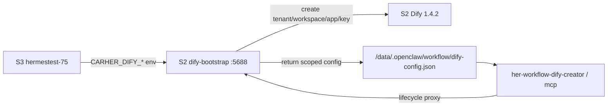
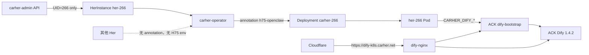
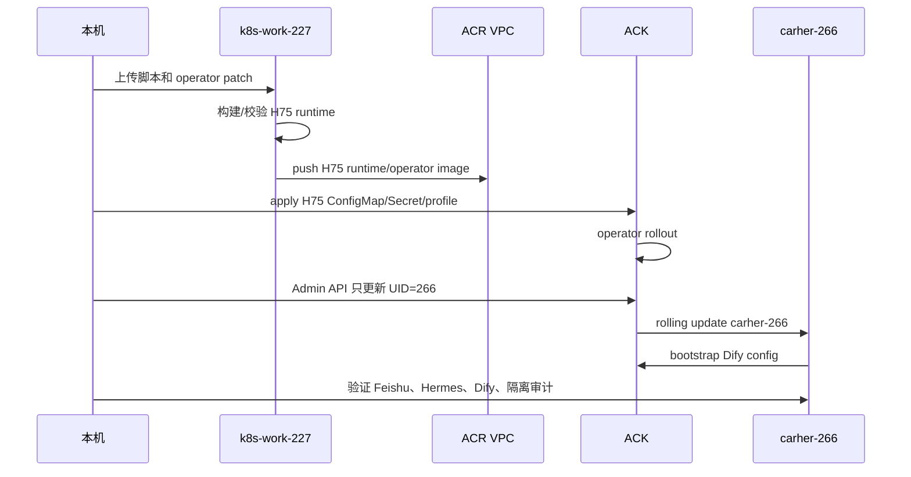

# her-266 H75/Dify 行为对齐复盘与运行手册

> 本地源稿。飞书文档 URL、画板 token 在发布后回填。本文只记录脱敏事实，不保存真实密钥、完整飞书会话 ID、临时登录链接或私有凭证。

## 发布信息

- 飞书文档：https://t83dfrspj4.feishu.cn/docx/UMKZdayI8oWOLwxfIjycDPMnnih
- 飞书画板：
  - ACK 架构 Mermaid：`R7HBwy6P1hUj6LbZt8XcxzBSnFb`
  - 实施步骤 Mermaid：`Gt1gwOXCghgMAAbqjvDcAMaHnMd`
  - 总览画板：`XCTHwdS9rhASxrbcJCBcO3w3ntd`
- 复盘对象：ACK 上的 `her-266`
- 目标行为：对齐 S3 `hermestest-75` 的 OpenClaw/Hermes/Dify workflow 能力
- 隔离边界：只允许 `her-266` 使用 H75 profile，旧 Her 继续保持默认 runtime

## 背景与目标

`her-266` 是阿里云 ACK 上的单个 beta Her。目标不是把 S3 Docker Compose 形态原样搬到 K8s，而是在 ACK Operator/Admin 的形态下，让 `her-266` 获得 `hermestest-75` 已验证过的能力：

- OpenClaw/Hermes 双引擎切换，飞书 `/hermes`、`/openclaw` 被 hook 拦截，不进入普通 LLM 对话。
- Dify workflow bootstrap，启动时自动生成 `workflow/dify-config.json`，并安装 `her-workflow-dify-*` 工具。
- A2A/ACP/OpenClaw runtime plugin 入口在 K8s 中可解析、可探测。
- 灰度只影响 `her-266`，不触发 `stable`、`normal` 或其他批量组。

## 当前验证状态

- `her-266` 镜像：`h75-runtime-b600887-acpfast-feishu-dualswitch-chatidfix-litellmchat-20260530`
- 部署组：`beta-her-266`
- Runtime profile：`h75-openclaw`
- Pod 状态：`2/2 Running`
- 飞书 WS：`Connected`
- 引擎切换：`/hermes` 端到端验证通过，当前 active engine 可切到 Hermes
- Dify 公网入口：`https://dify-k8s.carher.net`
- Dify bootstrap：`dify-bootstrap.dify.svc.cluster.local:5688`
- Dify stateless HA：API/Web/Worker/bootstrap/Nginx 已扩到 `2/2`，使用 ACR VPC 镜像并加 PDB；DB/Redis/Weaviate 仍是单副本，不是严格端到端 HA
- 隔离审计：Her Deployment 共 259 个，命中 H75/profile/chatidfix 的只有 `carher-266` 与本轮验证目标 `carher-268`
- `her-268` 快速回滚：重复验证可在 46 秒内回到 `stable / fix-compact-eb348941 / no runtime-profile`
- `her-268` 快速再灰度：重复验证可在 41 秒内回到 H75 `litellmchat` tag；Dify 立即恢复，A2A/Hermes 在冷启动完成后恢复

本轮发现 ACK Hermes 与 S3 的关键差异：S3 `hermestest-75` 的 `chatgpt-pro` 指向旧 `cc.auto-link` endpoint；ACK 使用 per-Her LiteLLM key 走 `litellm.carher.net`。ACK 上 Hermes `codex_responses` transport 会触发 `'NoneType' object is not iterable`，改为 `chat_completions` 后 direct Hermes 与 A2A 均可返回内容。

## S2/S3 对照

S2 的 Dify 不是单独的 Web UI，而是一套给 Her 分配 Dify workspace/app/API key 的 bootstrap 服务。



关键事实：

- S2 `dify-bootstrap` 运行在 host network，服务 `/healthz`、`/v1/bootstrap/carher-bot`、`/v1/lifecycle/*`、`/v1/user-login/*`、`/v1/exchange`、`/auto`。
- S2 Dify raw stack 使用 Dify `1.4.2`，包含 API、Web、Worker、Nginx、Redis、DB、plugin-daemon 等服务。
- `hermestest-75` 通过 `CARHER_DIFY_ENABLED=1`、`CARHER_DIFY_BASE_URL`、`CARHER_DIFY_BOOTSTRAP_URL`、`CARHER_DIFY_WORKSPACE_SLUG=carher-75` 等环境变量接入 S2 Dify。
- bootstrap 返回 per-bot Dify 配置，Her 写入本地 `workflow/dify-config.json`，后续 workflow 工具只使用这份 scoped config。
- S2 上当前 `carher-221` 不是 Dify-enabled 示例；真正的参照链路是 S3 `hermestest-75` 和 S2 tenant 中的 `carher-75`。

## ACK 架构



ACK 侧改造点：

- H75 profile 通过 annotation 开启：`carher.io/runtime-profile=h75-openclaw`。
- profile 只给目标实例注入 H75 base config、Dify env、ACP env、gateway token、runtime plugin refresh 和 A2A/ACP 服务端口。
- Dify bootstrap token 从 Secret 注入，不进入 ConfigMap 或文档。
- `carher-base-config-h75` 复用 H75 pinned config，但适配 ACK 挂载路径和 LiteLLM provider 形态。
- Dify Web/API/bootstrap 统一经 `https://dify-k8s.carher.net` 暴露，集群内 Her 走 `dify-bootstrap.dify.svc.cluster.local:5688`。

## 实施步骤



执行顺序：

1. 冻结 S3 `hermestest-75` live image digest 与 labels，确认 upstream overlay ref。
2. 在 `k8s-work-227` 准备 runtime/operator 镜像，推送到 ACR VPC endpoint。
3. 在 ACK 部署或确认 Dify raw stack 与 `dify-bootstrap` 健康。
4. 给 operator 增加 opt-in H75 profile，默认 Her 不改变。
5. 创建 `carher-base-config-h75`、Dify bootstrap Secret、H75 runtime/ACP Secret。
6. 只对 `her-266` 增加 runtime profile annotation。
7. 只用 Admin API 更新 UID `92629155-7299-4e5e-acd0-566e28a4234e` 到 `beta-her-266` 与目标镜像。
8. 等待 `carher-266` rollout，验证 Dify、飞书 WS、LiteLLM、Hermes 切换。
9. 全量审计其他 Her，确认没有 H75 image/profile 泄漏。

## 验证清单

- K8s：
  - `her-266` HerInstance phase 为 `Running`
  - Deployment image 为目标 H75 tag
  - Pod `2/2 Running`
  - `carher.io/runtime-profile=h75-openclaw`
  - 其他 Her 没有 H75 profile、H75 image、chatidfix 或 Dify env
- Dify：
  - `https://dify-k8s.carher.net/healthz` 返回 200
  - 集群内 `dify-bootstrap` `/healthz` 返回 ok
  - `workflow/dify-config.json` 存在，`bot_id=carher-266`
  - `her-workflow-dify-creator`、`her-workflow-dify-mcp` 可执行
  - lifecycle health 返回 200
  - `dify-api`、`dify-web`、`dify-worker`、`dify-bootstrap`、`dify-nginx` 是 `2/2`，使用 ACR VPC 镜像并加 PDB
  - `dify-db`、`dify-redis`、`dify-weaviate` 仍是单副本 RWO PVC，不是严格多副本 HA
- 飞书与引擎：
  - Feishu WS connected
  - `/hermes` 被 hook 拦截，不进入普通聊天
  - 切换后 active engine 为 Hermes
  - `/openclaw` 可切回 OpenClaw
  - direct Hermes 能输出 marker
  - A2A `her-268 -> her-266` 与 `her-266 -> her-268` 都能输出 marker
- 隔离：
  - 只有 `carher-266` 与 `carher-268` 命中 H75/profile/chatidfix
  - sample old Her 不包含 H75/Dify/profile env

## 回滚方案

触发条件：

- 新 Pod 超过 10 分钟不 Ready
- Hermes/OpenClaw 切换失败且无法快速定位
- 飞书 WS 断连
- Dify bootstrap/lifecycle 失败影响核心对话
- 发现 H75 profile 泄漏到非目标 Her

回滚动作：

```bash
./scripts/her266-h75/20-ack-her266-ops.sh rollback
```

回滚效果：

- 删除 `her-266` 的 H75 runtime profile annotation
- Admin API 改回 `image=fix-compact-eb348941`
- Admin API 改回 `deploy_group=stable`
- 等待 `carher-266` 回旧 Pod 并复测飞书 WS 与基础回复

Dify bootstrap 和 H75 ConfigMap/Secret 可以保留；没有 annotation 时不会影响旧 Her。

## 后续优化项

- 把 `30-post-rollout-audit.sh` 包装成 ACK 内部一次性 Job，适合本地网络差时运行。
- 把 `40-fast-gray-rollout.sh verify` 升级为功能级 verify，至少串起 `30-post-rollout-audit.sh` 与 `50-a2a-functional-probe.sh`。
- 优化 H75 cold start：避免每次在 NAS 上全量复制 OpenClaw extension `node_modules`，否则 Deployment Ready 会早于 A2A Ready 几分钟。
- 若“Dify 高可用”按严格 HA 理解，需要继续把 Redis/DB/Weaviate 持久层迁到托管 HA 或 StatefulSet/集群 HA 形态；当前只证明 stateless 层 HA 与 Dify 链路可用。
- 将 H75 runtime build 从手工 patch 链路收敛为一条 pinned source build pipeline。
- 把 `/hermes`、`/openclaw` 切换命令做成固定回归测试，覆盖飞书 chat_id fallback。
- 给 Dify bootstrap 增加更清晰的 readiness、tenant cache 命中和 lifecycle proxy 观测指标。
- 将单点灰度路径推广为 `beta-her-266 -> canary -> early -> stable` 的标准 runbook。
- 定期清理和轮换 bootstrap token、ACP token、gateway token，并沉淀 Secret 来源说明。

## 快速多用户灰度与双环境回滚

前提：沿用当前已验证的 H75 runtime、operator profile、ACK Dify/bootstrap 和 Cloudflare 路由；不重新构建镜像，不改 `stable`/`normal` 批量发布路径。

### 速度优化目标

- 快速自动化路径：3-5 个用户 20-45 分钟，6-10 个用户 45-90 分钟。适用于镜像、operator、Dify 都已验证，且目标用户清单明确。
- 保守观察路径：3-5 个用户 60-90 分钟，6-10 个用户 2-3 小时。适用于需要人工业务验收或第一波观察窗口不能省略的场景。
- 核心优化：提前生成 target manifest 和 rollback manifest；ACK 在集群内 Job 并发 watch；内网 Compose 在目标服务器 tmux 执行；本机只发起短命命令。

### 执行策略

1. 收到目标清单后，写成 `targets.tsv`；每行声明环境：ACK 用 `ack`，内网 Compose 用 `compose`。
2. 先执行 `40-fast-gray-rollout.sh plan targets.tsv` 估算波次和耗时。
3. 执行 `snapshot` 生成 rollback manifest。没有 rollback manifest 不允许 `apply`。
4. ACK 目标使用 annotation + Admin API 并行切换；内网 Compose 目标使用 override 文件切换镜像，不改原 compose 文件。
5. 第一波至少 1 个用户；如果只追求快速路径，第一波验证通过后直接扩剩余用户，不固定等待 15-20 分钟。
6. 每波结束后执行 `verify` 和隔离审计，确认 H75/profile 只出现在目标清单内。

快速脚本入口：

```bash
./scripts/her266-h75/40-fast-gray-rollout.sh plan targets.tsv
./scripts/her266-h75/40-fast-gray-rollout.sh snapshot targets.tsv rollback.tsv
./scripts/her266-h75/40-fast-gray-rollout.sh apply rollback.tsv
./scripts/her266-h75/40-fast-gray-rollout.sh verify rollback.tsv
./scripts/her266-h75/40-fast-gray-rollout.sh rollback rollback.tsv
```

### 回滚保证

可以保证的是“有记录、有命令、按用户恢复到原 image/deploy_group/profile 状态”；不能保证的是业务侧完全无感，因为 Pod 回滚仍会触发该 Her 的重建和飞书 WS 重连。

- 单用户回滚目标时间：3-8 分钟，取决于镜像拉取、Pod 调度和飞书 WS 重连。
- 3-5 个用户整波回滚目标时间：10-20 分钟，建议并行提交 Admin API 更新，再逐个 watch Ready。
- ACK 回滚动作：恢复原 runtime profile annotation 状态；Admin API 按 UID/ID 改回原 `image` 和原 `deploy_group`；等待 Deployment 回旧 Pod Ready；复测飞书 WS、基础回复和默认 OpenClaw 行为。
- 内网 Compose 回滚动作：删除本次生成的 override 文件；用原 compose 文件执行 `docker compose up -d --no-deps <service>`；确认容器回到原 image；复测飞书 WS、引擎和 Dify。
- 自动回滚触发：Pod/容器 10 分钟不 Ready、飞书 WS 断连、`/hermes`/`/openclaw` 无法切换、Dify bootstrap/lifecycle 失败、H75 profile 泄漏到非目标用户。
- 双环境问题处理：如果确认是公共问题（Dify、Cloudflare、H75 runtime、engine-swap），ACK 与内网 Compose 同时冻结扩容，并用同一份 rollback manifest 对已变更目标执行整波回滚；如果只是单个用户问题，只回滚该用户。

## 脚本与 Skill 索引

- 本次沉淀总索引：`docs/her266-h75-session-artifacts.md`
- `scripts/her266-h75/README.md`：H75 单实例灰度 runbook
- `scripts/her266-h75/20-ack-her266-ops.sh`：实际 rollout/rollback 脚本
- `scripts/her266-h75/21-apply-ack-ops-job.sh`：ACK 内部 Job 入口
- `scripts/her266-h75/30-post-rollout-audit.sh`：只读完成审计
- `scripts/her266-h75/40-fast-gray-rollout.sh`：ACK/内网 Compose 快速灰度与 rollback manifest 脚本
- `scripts/her266-h75/50-a2a-functional-probe.sh`：真实 A2A JSON-RPC marker 探针
- `scripts/her266-h75/60-dify-ha-audit.sh`：Dify 单副本/HA 风险只读审计
- `scripts/her266-h75/21-build-h75-runtime-litellm-chat-completions.sh`：ACK LiteLLM chat completions runtime 补丁构建脚本
- 项目内 skill：`.codex/skills/carher-h75-dify-single-her-rollout/SKILL.md`
- 上游参考快照：`docs/references/carher-upstream/her-dify-architecture.md`
- 上游参考快照：`docs/references/carher-upstream/hermes-openclaw-session-memory-and-switch-ux.md`

后续新增 H75/Dify/ACK 单 Her 灰度相关 skill、脚本、画板和复盘文档，都放在 `carher-admin`。`../CarHer` 只作为 upstream 代码和历史资料来源，避免本地运营沉淀与 OpenClaw 上游产生冲突。

## 飞书画板

- 飞书文档内自动生成了两张 Mermaid 画板：ACK 架构、实施步骤。
- 总览画板使用 `diagrams/2026-05-30T120000-her266-h75-dify/diagram.svg` 渲染并写入，覆盖架构总览、Dify 数据流、引擎切换时序、灰度执行泳道、回滚与后续优化。
