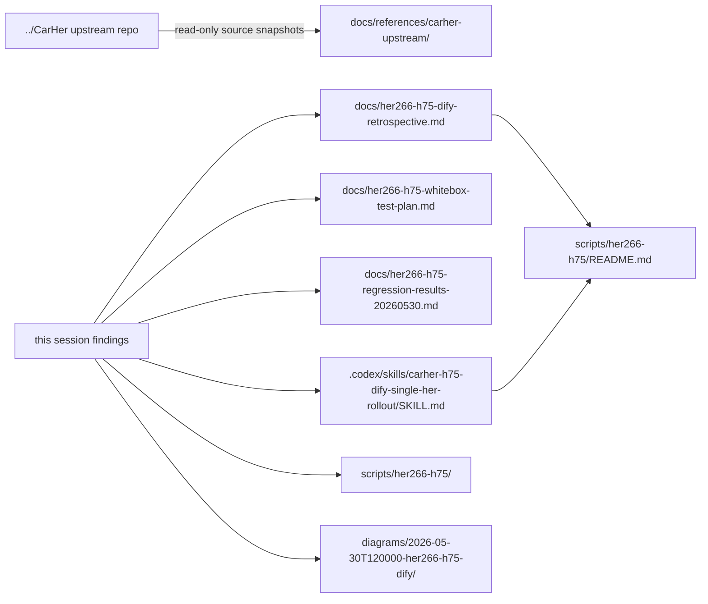
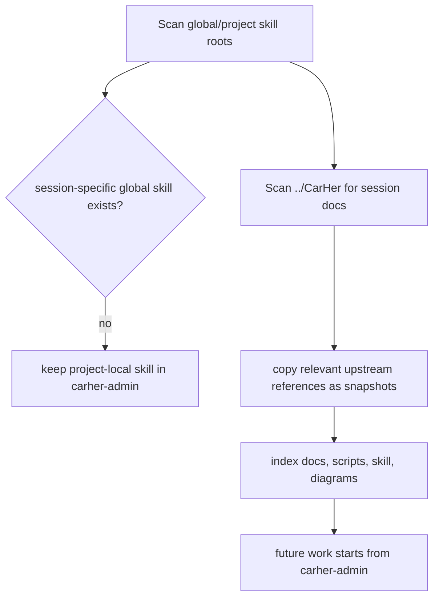

# her-266 H75/Dify Session Artifacts Index

This repo is now the owner for the her-266/H75/Dify rollout notes, scripts, diagrams, and project-specific Codex skill. Keep these artifacts in `carher-admin` instead of the upstream `CarHer` repo so local operations do not conflict with OpenClaw upstream work.

## Ownership Boundary

Rule of thumb: `../CarHer` is only an upstream code/source-of-truth reference. New rollout skills, ACK scripts, Dify notes, and Feishu board exports for this work belong here.

## Artifact Map

| Artifact | Local path | Purpose |
| --- | --- | --- |
| Retrospective and runbook | `docs/her266-h75-dify-retrospective.md` | Human-readable background, architecture, execution, validation, rollback, and follow-up notes. |
| White-box test plan | `docs/her266-h75-whitebox-test-plan.md` | Evidence-backed H75 + S1/S2/S3 function inventory and comprehensive white-box regression matrix. |
| Live regression results | `docs/her266-h75-regression-results-20260530.md` | Actual ACK, Feishu group, A2A, Dify, LiteLLM, and S1/S2/S3 read-only regression evidence from 2026-05-30. |
| Session artifact index | `docs/her266-h75-session-artifacts.md` | This file; explains where the session material lives and how to avoid upstream conflicts. |
| Feishu benchmark runner | `.her266-h75-state/feishu-regression-benchmark.mjs` | Local, untracked runner for marked group mention latency tests. Keep out of commits unless scrubbed. |
| Feishu benchmark output | `.her266-h75-state/regression-20260530T152256Z/feishu-group-benchmark-20260530T1547.json` | Local, untracked live benchmark output. Contains message ids; do not commit unsanitized. |
| Project Codex skill | `.codex/skills/carher-h75-dify-single-her-rollout/SKILL.md` | Reusable project-local workflow for H75/Dify single-Her rollout, `/hermes` debugging, and rollback guardrails. |
| Script runbook | `scripts/her266-h75/README.md` | Operational entry point for image prep, ACK rollout, audit, fast gray, and rollback. |
| Rollout scripts | `scripts/her266-h75/*.sh` | Server-side and cluster-side automation used for long-running work. |
| A2A functional probe | `scripts/her266-h75/50-a2a-functional-probe.sh` | Sends a real A2A JSON-RPC message and checks the returned marker text. |
| Dify HA audit | `scripts/her266-h75/60-dify-ha-audit.sh` | Read-only report for Dify replicas, PDBs, services, and single-replica risks. |
| Dify stateless image mirror | `scripts/her266-h75/61-mirror-dify-stateless-images.sh` | Mirrors Dify stateless-layer images into the ACR VPC repository used by ACK Pods. |
| Dify stateless HA apply/verify | `scripts/her266-h75/62-dify-stateless-ha.sh` | Snapshots, applies, verifies, and rolls back stateless Dify HA for API/Web/Worker/bootstrap/Nginx. |
| Operator patch snapshot | `scripts/her266-h75/operator-h75-profile.patch` | Patch captured for the H75 profile/operator behavior. |
| Feishu/diagram export | `diagrams/2026-05-30T120000-her266-h75-dify/` | Local whiteboard/diagram source and rendered previews. |
| Upstream Dify reference snapshot | `docs/references/carher-upstream/her-dify-architecture.md` | Copied reference from `../CarHer/docs/her/her-dify-architecture.md`; do not edit upstream for this runbook. |
| Upstream engine-switch reference snapshot | `docs/references/carher-upstream/hermes-openclaw-session-memory-and-switch-ux.md` | Copied reference from `../CarHer/artifacts/2026-05-11-hermes-openclaw-session-memory-and-switch-ux.md`. |

## Migration Status

- No session-specific global `~/.codex/skills/carher-h75-dify-single-her-rollout` copy was found during this cleanup.
- The active skill copy is project-local under `carher-admin/.codex/skills/`.
- `../CarHer` had relevant tracked reference documents; they were copied here as snapshots instead of deleting or editing upstream files.
- Existing `carher-admin` scripts, diagrams, and docs remain the active operational source for future H75/Dify work.

## Maintenance Rules

- Put future H75/Dify/ACK single-Her rollout notes in `docs/` or `scripts/her266-h75/`, not in `../CarHer`.
- Put future Codex process guidance in `.codex/skills/` inside this repo unless it is truly cross-project.
- Refresh `docs/references/carher-upstream/` intentionally when upstream facts change; include the source path in the commit or handoff note.
- Keep copied snapshots and docs scrubbed: no tokens, full chat IDs, cookies, AK/SK, API keys, or temporary login links.
