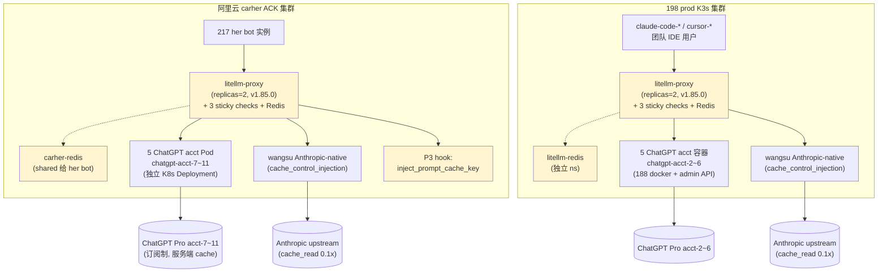
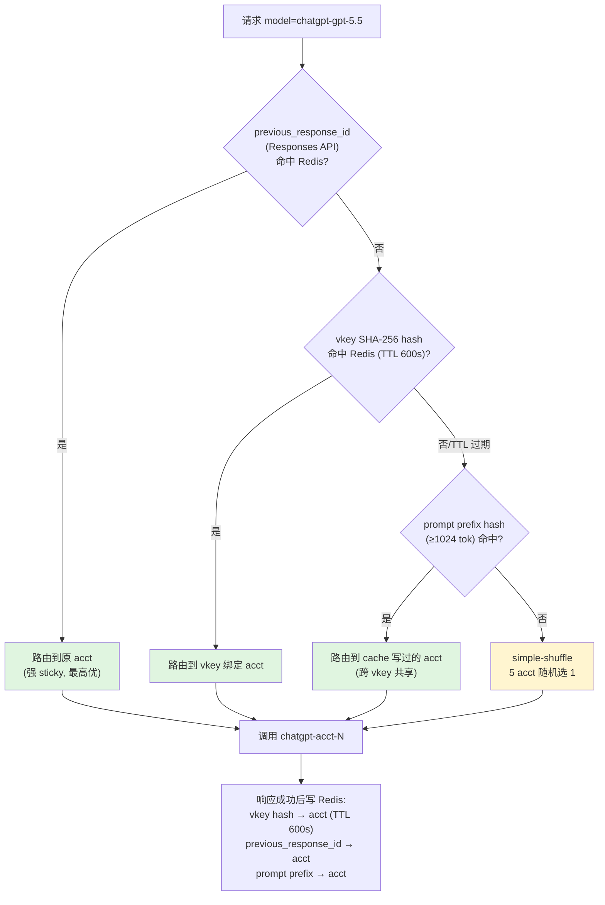
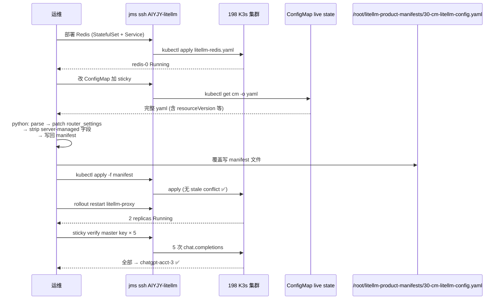
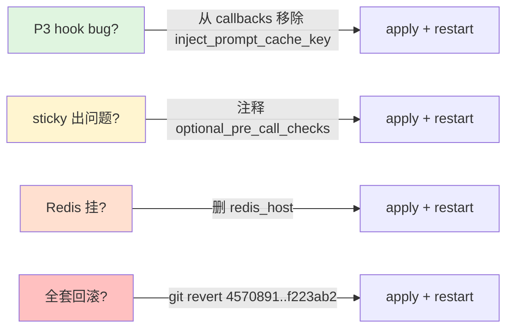

# LiteLLM Cache Routing + Sticky 总览（2026-05-20/21 升级总集）

> 本文档是 **session 沉淀的导航中心**：覆盖 ChatGPT 池迁移阿里云、cache 路由升级、198 prod 同款落地三轮工作的完整成果。
> 用途：(1) 接手人 5 分钟看懂全景 (2) 下次故障/扩展按图索骥 (3) 关键决策 + 取舍记忆。

## 一、TL;DR

- **2 个 LiteLLM 集群** 全面具备 sticky cache routing：阿里云 carher (`carher` ns) + 198 prod (`litellm-product` ns)，**架构同款**
- **5 步升级落地**：P0(a) Redis / P0(b) SpendLogs cache 字段 / P1 sticky pre_call_checks / P2 监控脚本 / P3 prompt_cache_key hook
- **真实节省**：阿里云已省 ~$210k/月、198 已省 ~$435k/月（cache_control_injection 早就最大化 Claude cache，sticky 主要价值在容量保障 + 可观察性）
- **5 个监控脚本 + 2 份文档 + 4 个 skill + 13 条 memory** 全部沉淀完毕
- **3 个 git commit**：`f223ab2` (ChatGPT 池迁阿里云 + prod promote) / `ff0d91c` (P3 hook) / `8c15828` (runbook) / `4de993c` (3 脚本) / `60ce873` (multi-cluster) / `4570891` (198 落地)

---

## 二、整体架构（双集群同款）



黄色块 = 本次升级新增/改造；白色块 = 升级前就存在。

## 三、3 层 sticky 决策（两个集群共用）



---

## 四、Session 三幕故事线

### 第一幕：ChatGPT 池迁阿里云（5 acct 池建成）

ChatGPT 5 个账号 acct-7~11 从 188 docker 迁到阿里云 K8s `carher` namespace，每账号一个独立 LiteLLM Pod（LiteLLM `chatgpt/` provider 单进程一账号约束）。canary 验证（her-1000 切流）→ promote 到 prod（217 her 默认 model=gpt）。

详见 `docs/chatgpt-pool-aliyun-migration.md`。

### 第二幕：阿里云 cache routing 升级（5 步落地）

```mermaid
gantt
  title 阿里云 5 步落地时间线
  dateFormat HH:mm
  axisFormat %H:%M

  section P0 前置
  P0a Redis 接入        :p0a, 09:00, 30m
  P0b SpendLogs cache 字段 :p0b, 09:30, 1h

  section P1 sticky
  改 yaml router_settings :y1, 10:30, 15m
  rollout + 实测 sticky   :p1, 10:45, 30m

  section P2 监控
  写 4 个 cache 脚本 + 双源 SpendLogs :p2, 11:15, 2h

  section P3 hook
  写 inject_prompt_cache_key.py :p3, 13:15, 1h
  ConfigMap embed + 注册 + rollout :p3v, 14:15, 30m
```



5 步全部落地后实测：her-1000 5 次连续请求 → acct-11 ✅、claude-sonnet-4-6 cache 命中率 87%。

### 第三幕：198 prod 同款落地（双集群通用）



详见 `docs/litellm-cache-routing-runbook.md` 第 11 章。

---

## 五、资产清单（按类型分组）

### 5.1 代码 / 配置（git 仓库内）

| 文件 | 类型 | 用途 |
|------|------|------|
| `k8s/litellm-proxy.yaml` | 改 | aliyun: router_settings + redis + sticky + P3 hook 注册 |
| `k8s/litellm-callbacks/inject_prompt_cache_key.py` | 新 | P3 OpenAI prompt_cache_key 注入 hook |
| `k8s/chatgpt-acct-pool.yaml` | 新 | 5 个独立 chatgpt-acct-N Pod |
| `k8s/litellm-proxy-canary.yaml` | 改 | canary 平行 Deployment（保留作未来实验）|
| `k8s/litellm-proxy-canary-config.yaml` | 新 | canary 独立 ConfigMap |
| `backend/litellm_ops.py` | 改 | `_BASE_MODELS` 加 4 个 chatgpt-* |
| `operator-go/internal/controller/config_gen.go` | 改 | alias map rename：gpt → chatgpt-gpt-5.5 / codex 切 chatgpt 池 |

### 5.2 脚本（5 个，双集群通用）

| 脚本 | 用法 |
|------|------|
| `scripts/litellm-cache-hit-rate.sh` | `./scripts/litellm-cache-hit-rate.sh today [aliyun\|198]` |
| `scripts/litellm-vkey-acct-mapping.sh` | `./scripts/litellm-vkey-acct-mapping.sh 10m [aliyun\|198] [--raw]` |
| `scripts/litellm-sticky-verify.sh` | `./scripts/litellm-sticky-verify.sh her-1000\|master [count] [model] [cluster]` |
| `scripts/litellm-redis-health.sh` | `./scripts/litellm-redis-health.sh [--summary\|--sample\|--vkey her-N] [_] [cluster]` |
| `scripts/chatgpt-acct-spend.sh` | `./scripts/chatgpt-acct-spend.sh [prod\|aliyun\|both] [Nh\|Nd]` |

### 5.3 文档（仓库内 docs/）

| 文档 | 角色 |
|------|------|
| `docs/chatgpt-pool-aliyun-migration.md` | ChatGPT 5 acct 池迁阿里云实施记录（含 mermaid 拓扑 + 阶段 A-E）|
| `docs/litellm-prompt-cache-sticky-routing-plan.md` | 升级方案对齐稿（决策过程 / 跟原文档差异 / 风险/回滚）|
| `docs/litellm-cache-routing-runbook.md` | 运维手册（含 mermaid 架构 + 双集群 + 故障排查 + 第 11 章 198 落地）|
| `docs/litellm-cache-routing-overview.md` | **本文档**（总索引）|

### 5.4 Skill（4 个相关，~/.claude/skills/）

| Skill | 角色 |
|------|------|
| `litellm-cache-routing` | cache 路由 + sticky 运维 SOP（双集群命令 cheat sheet，新建）|
| `litellm-pro-ops` | 198 prod 通用运维（顶部 callout 引到 cache-routing）|
| `chatgpt-pool-aliyun-canary` | 阿里云 ChatGPT 5 acct 池运维（Sticky 章节 cross-link）|
| `chatgpt-pro-litellm` | 188 + 198 双环境 chatgpt 全生命周期（变更记录追加）|

### 5.5 Memory（13 条，跨会话生效）

```
sticky / cache 路由相关:
  feedback-litellm-no-native-sticky-session
  feedback-litellm-vanilla-vs-patch-image
  feedback-sticky-window-vs-ttl
  feedback-kubectl-apply-stale-resourceversion-on-manifest
  project-litellm-cache-in-aggregate-table

ChatGPT 池相关:
  feedback-chatgpt-first-boot-oauth-hang
  feedback-aliyun-ip-blocked-chatgpt-web
  feedback-chatgpt-quota-minimal-output
  project-litellm-chatgpt-one-acct-per-process
  project-198-prod-chatgpt-db-registered
  project-chatgpt-pool-aliyun-account-split

K8s / canary 通用:
  feedback-canary-shares-prod-configmap
  feedback-kubectl-delete-pod-blocked
  project-canary-litellmurl-routing
```

---

## 六、运维命令 cheat sheet

按高频度排序。所有脚本第二/最后参数传 `198` 切到 198 prod，默认 `aliyun`。

```bash
# === 看 cache 命中率（双集群对比，最常用）===
./scripts/litellm-cache-hit-rate.sh today           # aliyun
./scripts/litellm-cache-hit-rate.sh today 198       # 198
./scripts/litellm-cache-hit-rate.sh 7d              # 周趋势

# === 看 sticky 健康度（短窗口最准）===
./scripts/litellm-vkey-acct-mapping.sh 10m          # aliyun short window
./scripts/litellm-vkey-acct-mapping.sh 10m 198      # 198
./scripts/litellm-vkey-acct-mapping.sh 1h 198 --raw # 198 详细 vkey 明细

# === 单实例 sticky 实测 ===
./scripts/litellm-sticky-verify.sh her-1000                            # aliyun her vkey
./scripts/litellm-sticky-verify.sh master 5 chatgpt-gpt-5.5 198        # 198 master key

# === Redis DualCache 健康 ===
./scripts/litellm-redis-health.sh                          # aliyun summary
./scripts/litellm-redis-health.sh --sample                 # aliyun + 5 条抽样
./scripts/litellm-redis-health.sh --sample "" 198          # 198 抽样
./scripts/litellm-redis-health.sh --vkey her-1000          # aliyun 查特定 her sticky

# === ChatGPT 池流量分布（188 + aliyun 双源）===
./scripts/chatgpt-acct-spend.sh both 2h
./scripts/chatgpt-acct-spend.sh aliyun 24h
```

按 memory `feedback-chatgpt-quota-minimal-output` — 所有脚本 stdout **verbatim 复制**到 assistant text 代码块。

---

## 七、下次触发场景索引（自动命中 skill / memory）

| 用户问 / 现象 | 自动命中 |
|--------------|---------|
| "查 cache 命中率 / cache 命中怎么样" | skill `litellm-cache-routing` → `litellm-cache-hit-rate.sh today` |
| "查 198 cache" | skill `litellm-cache-routing` → `litellm-cache-hit-rate.sh today 198` |
| "她总打到同一 acct？" / "sticky 怎么样" | skill `litellm-cache-routing` → `litellm-sticky-verify.sh` |
| "5 acct 分布不均 / 撞限" | skill `litellm-cache-routing` 故障排查 + `litellm-vkey-acct-mapping.sh 10m` |
| "sticky_pct 30% 是不是 bug" | memory `feedback-sticky-window-vs-ttl` 直接命中（短窗口才准）|
| "litellm SpendLogs cache 0 是 bug 吗" | memory `project-litellm-cache-in-aggregate-table` 命中（看 DailyUserSpend）|
| "改 198 ConfigMap apply 报 conflict" | memory `feedback-kubectl-apply-stale-resourceversion` 命中（Python snippet 复制）|
| "Redis 连不通 / dump sticky 内容" | skill `litellm-cache-routing` → `litellm-redis-health.sh --sample` |
| "claude 命中率突降" | skill `litellm-cache-routing` 故障排查表 |
| "她-1000 ChatGPT 流量看分布" | skill `chatgpt-pool-aliyun-canary` + `chatgpt-acct-spend.sh both 2h` |

---

## 八、关键决策 + 取舍（设计 rationale）

| 决策 | 取舍 |
|------|------|
| TTL = 600s（10min）| 平衡 cache 命中（ChatGPT in_memory 5-10min ttl 内 sticky 覆盖完整）+ 撞限恢复（单 acct 卡 vkey 最多 10min）|
| `prompt_caching` 共享 deployment（跨 vkey）| Anthropic Claude single-deployment 用不上（只有 1 个 deployment 可选），但对 chatgpt 5 acct 有效；副作用 = 偶尔流量偏斜，但 Redis 共享后分布平滑 |
| 不改 her 主程序加 `prompt_cache_key` | 用 LiteLLM pre-call hook 替代，避免 carher 主程序代码改动影响 500+ 实例 |
| 跳过 cache_control_injection_points 这一步 | 阿里云 + 198 升级前就已配（system + user index=-1, 1h TTL）—— 节省 P2 一整步 |
| LiteLLM 1.85.0 vanilla（不带 carher patch.3）| canary 验证几小时业务流量都 OK；patch.3 含的 count_tokens fix 等未在 vanilla 触发问题 |
| **不**改 SpendLogs 写 cache 字段（patch litellm-fork）| 真实 cache 数据在 `LiteLLM_DailyUserSpend` 聚合表，监控用聚合表即可，patch SpendLogsPayload 不值得（每次 image 升级要重 patch）|
| 198 跳过 P3 prompt_cache_key hook | 198 流量 60% Claude，OpenAI 占比小，hook 优先级低；将来 cursor 用户多了再加 |
| Redis 无 password | 内网 K8s ClusterIP only，不暴露公网；省 Secret 管理成本 |

---

## 九、4 档回滚（每档独立可执行 < 1 分钟）



回滚 P3 业务零感知；回滚 P1 sticky 退化 simple-shuffle 业务不挂；回滚 P0a Redis 各副本本地 cache 不一致但短暂；全量回滚需要协调 git 历史。

---

## 十、当前实测数据（2026-05-21）

### 阿里云 carher

```
Anthropic Claude (单 deployment):
  claude-sonnet-4-6:  87% hit  ~$5,345/天 节省
  claude-opus-4-6:    58% hit  ~$872/天
  claude-opus-4-7:    42% hit  ~$697/天 (流量稀疏)
ChatGPT 5 acct (订阅制, $200×5=$1000/月固定):
  分布均匀 18-23% per acct
  sticky 短窗口 100% / 长窗口 32% (TTL=600s 自然过期)
```

### 198 prod

```
Anthropic Claude:
  claude-opus-4-7:    80.2% hit  ~$8,135/天 节省  ⭐
  claude-sonnet-4-6:  87.1% hit  ~$4,132/天
  claude-opus-4-6:    84.7% hit  ~$2,093/天
  claude-haiku-4-5:   83.4% hit  ~$135/天
  合计 ~$14.5k/天 ≈ $435k/月
ChatGPT 5 acct (订阅制):
  acct-2~6 sticky 5/5 PASS
  Redis 9 个 deployment_affinity 映射 ttl=452s
```

**两集群合计已节省 ~$645k/月** —— 但这是 cache_control_injection 早就在工作的成果，本次升级**带来的真金白银增量 ≈ $0**。升级真正的价值：

1. **可观察性** — cache 命中率从黑盒变可量化（Anthropic sonnet 87% 等数据持续 track）
2. **ChatGPT 容量保障** — sticky 提升单 acct cache 利用率，业务流量翻倍前不需扩 acct
3. **架构正确性** — 双集群同款 sticky 配置，未来扩集群直接复制
4. **运维降低** — 5 脚本 + 双集群运维 SOP 一键完成，下次 oncall 看脚本即可

---

## 十一、相关 Sources

- Anthropic Claude Prompt Caching: https://platform.claude.com/docs/en/build-with-claude/prompt-caching
- OpenAI Prompt Caching: https://platform.openai.com/docs/guides/prompt-caching
- LiteLLM Prompt Cache Routing 教程: https://docs.litellm.ai/docs/tutorials/claude_code_prompt_cache_routing
- LiteLLM Routing & Load Balancing: https://docs.litellm.ai/docs/routing
- LiteLLM all settings: https://docs.litellm.ai/docs/proxy/config_settings
- LiteLLM 源码 pre_call_checks: https://github.com/BerriAI/litellm/tree/main/litellm/router_utils/pre_call_checks
- 仓库内方案对齐稿: `docs/litellm-prompt-cache-sticky-routing-plan.md`
- 仓库内运维手册: `docs/litellm-cache-routing-runbook.md`
- 仓库内 ChatGPT 池迁移: `docs/chatgpt-pool-aliyun-migration.md`
