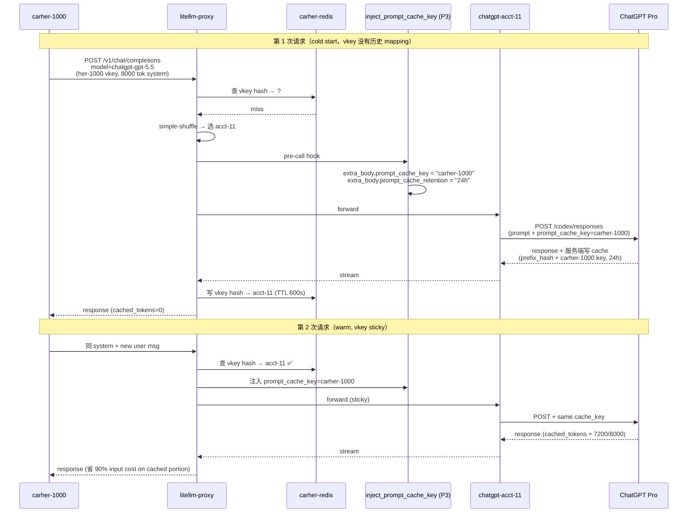

# carher LiteLLM Cache 路由 + 5 acct 分配策略运维手册

> 2026-05-20 落地。本文档是**操作手册** —— 涵盖整体 cache 方案、5 acct 分配策略、查看命令、使用方式、原理深挖与故障排查。
> 方案对齐稿见 [`docs/litellm-prompt-cache-sticky-routing-plan.md`](./litellm-prompt-cache-sticky-routing-plan.md)（决策过程 + 跟原 5 步方案的差异）。

## TL;DR

1. **5 层 cache 优化已全部落地**（P0a Redis / P0b SpendLogs 字段 / P1 sticky / P2 监控 / P3 prompt_cache_key 注入）
2. **每个 her vkey 永远 sticky 同一个 chatgpt-acct-N**（TTL 600s），分配是首次 simple-shuffle 随机选 + Redis 持久化
3. **Claude 本来就在省 ~$210k/月**（cache_control_injection 一直工作好，sonnet 命中率 87%）
4. **看 cache 命中率**：`./scripts/litellm-cache-hit-rate.sh today`
5. **看 ChatGPT 池流量**：`./scripts/chatgpt-acct-spend.sh both 2h`

---

## 一、整体架构

```mermaid
flowchart LR
  subgraph Her["217 carher her 实例 + 7 opus her"]
    direction TB
    H1["carher-1000<br/>carher-1001<br/>...<br/>(各自 carher-* vkey)"]
  end

  subgraph LP["litellm-proxy (replicas=2, ghcr litellm v1.85.0)"]
    direction TB
    PRE["pre_call_checks (P1):<br/>① deployment_affinity (vkey hash)<br/>② responses_api_deployment_check<br/>③ prompt_caching (prefix hash)"]
    LB["routing_strategy: simple-shuffle<br/>(默认，兜底)"]
    HOOK["pre-call hook (P3):<br/>inject_prompt_cache_key<br/>= vkey_alias"]
    CCI["cache_control_injection_points<br/>(已配，自动注入<br/>system + user index=-1)"]
  end

  subgraph Redis["carher-redis (P0a)<br/>StatefulSet, 无 password"]
    direction TB
    RC["DualCache 共享:<br/>vkey hash → deployment (TTL 600s)<br/>prompt prefix hash → deployment<br/>previous_response_id → deployment"]
  end

  subgraph ChatGPT5["ChatGPT 池 (5 acct, carher ns)"]
    direction TB
    A7["chatgpt-acct-7"]
    A8["chatgpt-acct-8"]
    A9["chatgpt-acct-9"]
    A10["chatgpt-acct-10"]
    A11["chatgpt-acct-11"]
  end

  subgraph Wangsu["wangsu Anthropic-native<br/>(aigateway.edgecloudapp.com)"]
    W1["Claude opus-4-6/4-7<br/>sonnet-4-6 / haiku-4-5<br/>(1h extended cache)"]
  end

  subgraph Mon["监控 (P2)"]
    M1["scripts/litellm-cache-hit-rate.sh<br/>读 LiteLLM_DailyUserSpend"]
    M2["scripts/chatgpt-acct-spend.sh<br/>读 LiteLLM_SpendLogs 双源"]
  end

  Her -->|virtual key + Anthropic/OpenAI req| LP
  LP -.->|查 + 写 sticky 映射| Redis
  LP --> CCI
  LP --> HOOK
  LP -->|sticky to same acct<br/>(if vkey/prefix/response_id hit)| ChatGPT5
  LP -->|cache_control auto-injected| Wangsu

  ChatGPT5 -->|prompt cache hit ~100%<br/>per acct (24h extended)| OAI[("ChatGPT Pro upstream<br/>acct-7~11")]
  Wangsu -->|cache_read 0.1x base<br/>(命中率 87% sonnet)| ANT[("Anthropic upstream")]

  Mon -.->|SQL 聚合表| Redis
  Mon -.->|SQL SpendLogs| LP

  style PRE fill:#fff5d0
  style HOOK fill:#fff5d0
  style Redis fill:#fff5d0
  style CCI fill:#e0f5e0
  style Mon fill:#fff5d0
```

> 黄色块 = 本次升级（P0-P3）；绿色块 = 升级前就有。

---

## 二、5 acct 分配策略

### 2.1 三层 sticky 决策树

```mermaid
flowchart TB
  REQ["her 请求<br/>chatgpt-gpt-5.5"]
  REQ --> Q1{previous_response_id?<br/>(responses_api_deployment_check)}
  Q1 -->|有 + Redis 命中| STICK1["路由到原 acct<br/>(强 sticky, 优先级最高)"]
  Q1 -->|无 / Redis 缺失| Q2{vkey hash → acct?<br/>(deployment_affinity, TTL 600s)}
  Q2 -->|命中| STICK2["路由到 vkey 历史绑定 acct"]
  Q2 -->|未命中 / TTL 过期| Q3{prompt prefix hash<br/>→ acct?<br/>(prompt_caching, ≥1024 tok)}
  Q3 -->|命中| STICK3["路由到 cache 写过的 acct<br/>(跨 vkey 共享)"]
  Q3 -->|未命中| SHUFFLE["simple-shuffle<br/>5 acct 随机选 1"]

  STICK1 --> EXEC["调用 chatgpt-acct-N"]
  STICK2 --> EXEC
  STICK3 --> EXEC
  SHUFFLE --> EXEC
  EXEC --> SAVE["响应成功后写 Redis:<br/>vkey hash → acct (TTL 600s)<br/>previous_response_id → acct<br/>prompt prefix hash → acct"]

  style STICK1 fill:#e0f5e0
  style STICK2 fill:#e0f5e0
  style STICK3 fill:#e0f5e0
  style SHUFFLE fill:#fff5d0
```

### 2.2 各 check 角色对比

| 优先级 | check | 路由 key | 触发条件 | 角色 |
|--------|-------|---------|---------|------|
| 1（最强）| `responses_api_deployment_check` | `previous_response_id` | OpenAI Responses API 多轮对话 | 一个对话不切 acct（避免 Responses state 丢失）|
| 2 | `deployment_affinity` | vkey SHA-256 hash | Redis 内 TTL 600s 有映射 | her 实例本身 sticky 同 acct |
| 3（最弱）| `prompt_caching` | prompt prefix hash | prompt ≥ 1024 tok 且 cache 写过 | 跨 her 同 system prompt 也 sticky 同 acct |
| 兜底 | `simple-shuffle` | 随机 | 上面 3 都未命中 | 第一次请求分配 |

### 2.3 acct 分配的实际行为

- **首次分配**：simple-shuffle 在 5 acct 中**随机**选 1 个（等权重）
- **稳态**：vkey 在 Redis 里记住的那个 acct，TTL 600s 内永远 sticky
- **TTL 过期**：vkey 重新 simple-shuffle，可能换 acct 也可能还是同一个
- **撞限**：TTL 内不切走，router cooldown 5s 短期绕开 + fallback `chatgpt-gpt-5.5 → wangsu-gpt-5.5` 兜底

### 2.4 实测验证

```bash
# her-1000 vkey × 5 连续请求 → 全部 chatgpt-acct-11 ✅
# her-10001 vkey × 3 连续请求 → 全部 chatgpt-acct-8 ✅
```

```bash
# 今天 5 acct 分布（10:00-15:00, ChatGPT 池）：
acct-7   708 calls  $305  21%
acct-11  798 calls  $279  23%
acct-8   706 calls  $254  21%
acct-9   628 calls  $258  18%
acct-10  685 calls  $262  19%
# 均匀分布 18-23%（217 her × 1/5 ≈ 43.4 her/acct 自然平摊）
```

---

## 三、Cache 命中数据流

### 3.1 OpenAI ChatGPT 隐式 cache（自动）



### 3.2 Anthropic Claude 显式 cache（cache_control_injection_points）

```mermaid
sequenceDiagram
  participant Her as carher-1000
  participant LP as litellm-proxy
  participant CCI as cache_control_injection
  participant W as wangsu Anthropic-native
  participant ANT as Anthropic

  Note over Her,ANT: 第 1 次请求
  Her->>LP: 调 claude-sonnet-4-6 (不传 cache_control)
  LP->>CCI: 自动注入<br/>system + user index=-1<br/>ttl=1h
  LP->>W: POST /v1/messages (含 cache_control)
  W->>ANT: 透传 + anthropic-beta:<br/>prompt-caching, extended-cache-ttl
  ANT-->>W: response + cache_creation_input_tokens=2000
  W-->>LP-->>Her: 第 1 次 (cache write, 1.25x ~ 2x base)

  Note over Her,ANT: 第 2 次同 conversation
  Her->>LP: 同 system + new user
  LP->>CCI: 注入
  LP->>W: POST
  W->>ANT: 透传
  ANT-->>W: cache_read_input_tokens=1900<br/>(命中 1h cache, 0.1x base)
  W-->>LP-->>Her: 第 2 次 (省 90%)
```

---

## 四、怎么看 / 监控（运营常用）

### 4.1 看 cache 命中率（所有模型）

```bash
./scripts/litellm-cache-hit-rate.sh today        # 今天
./scripts/litellm-cache-hit-rate.sh 7d           # 近 7 天
./scripts/litellm-cache-hit-rate.sh 2026-05-19   # 指定日期
```

**输出 3 张表**：
1. 按模型 cache 命中率（含 spend）
2. Anthropic Claude 节省估算（按 list 价 0.1x 折扣计算）
3. ChatGPT 5 acct 流量分布

**判读标准**：
- `claude-sonnet-4-6` 命中率正常 80-90%，跌破 70% 要 triage
- `claude-opus-4-7` 命中率 42%（业务流量稀疏 + 1h TTL 间隙大）属正常
- `chatgpt-gpt-5.5` 显示 0% 是 LiteLLM 1.85 SpendLogsPayload 不写 OpenAI cache 字段（**不是真 0%**，OpenAI 上游服务端自动 cache）

### 4.2 看 ChatGPT 5 acct 流量分布（sticky 是否生效）

```bash
./scripts/chatgpt-acct-spend.sh both 2h          # 198 + 阿里云双源
./scripts/chatgpt-acct-spend.sh aliyun 2h        # 仅阿里云 (acct-7~11)
```

**输出 4 张表** × 数据源：按账号 / 按模型 / 总计 / 按账号 × 模型 pivot。

**判读 sticky 是否生效**：5 acct calls 差异在 ±25% 内 = 正常（vkey hash 平摊到 5 acct），单 acct 流量持续 >50% = 有 vkey 集中或 sticky 失效。

### 4.3 看上游 ChatGPT 配额（5h% / wk%）

```bash
./scripts/chatgpt-acct-usage.sh                  # 默认所有 acct
./scripts/chatgpt-acct-usage.sh --json           # raw JSON
```

acct-7~11 走阿里云 fresh auth.json 路径（kubectl cp → scp 188 → 借 188 IP 调 chatgpt.com）；acct-2~6 走 188 本地 auth.json。

### 4.4 看具体 vkey → acct 映射（Redis 直查）

```bash
# vkey alias 算 sha256 → 查 Redis
HER_ID=1000
VKEY=$(kubectl exec -n carher carher-${HER_ID}-... -c carher -- sh -c "python3 -c \"import json; print(json.load(open('/data/.openclaw/openclaw.json'))['models']['providers']['litellm']['apiKey'])\"")
HASH=$(echo -n "$VKEY" | sha256sum | awk '{print $1}')
kubectl exec -n carher carher-redis-0 -- redis-cli --scan --pattern "deployment_affinity:v1:*${HASH}*" | head
kubectl exec -n carher carher-redis-0 -- redis-cli get "deployment_affinity:v1:user_key:${HASH}:chatgpt-gpt-5.5"
```

### 4.5 实时 sticky 行为验证（连续打）

```bash
POD=carher-1000-...
VK=$(kubectl exec -n carher $POD -c carher -- sh -c "python3 -c \"import json; print(json.load(open('/data/.openclaw/openclaw.json'))['models']['providers']['litellm']['apiKey'])\"")
for i in 1 2 3 4 5; do
  kubectl run curl-stick-$i -n carher --image=curlimages/curl:8.5.0 --restart=Never --rm -i --quiet -- \
    sh -c "curl -sS -X POST http://litellm-proxy.carher.svc:4000/v1/chat/completions \
      -H 'Authorization: Bearer $VK' \
      -d '{\"model\":\"chatgpt-gpt-5.5\",\"stream\":false,\"messages\":[{\"role\":\"user\",\"content\":\"ok $i\"}]}' \
      --max-time 25 -D /tmp/h 2>&1; grep -i 'x-litellm-model-id' /tmp/h"
done
# 期望 5 次都打到同一个 chatgpt-acct-N
```

---

## 五、怎么配置 / 使用（代码与 yaml）

### 5.1 关键 yaml 段（`k8s/litellm-proxy.yaml`）

```yaml
router_settings:
  # P0(a) Redis (DualCache 跨副本共享，2 副本必须)
  redis_host: carher-redis.carher.svc.cluster.local
  redis_port: 6379
  # redis_password 不需要（carher-redis 无 requirepass）

  # P1 Sticky pre_call_checks
  optional_pre_call_checks:
    - deployment_affinity                # vkey hash → 同 acct
    - responses_api_deployment_check     # Responses API previous_response_id sticky
    - prompt_caching                     # prefix hash → 同 deployment
  deployment_affinity_ttl_seconds: 600   # 10min（平衡 cache 命中 + 撞限恢复）

litellm_settings:
  callbacks:
    - opus_47_fix.thinking_schema_fix
    - embedding_sanitize.embedding_sanitize
    - force_stream.force_stream
    - streaming_bridge.streaming_bridge
    - null_byte_sanitize.null_byte_sanitize
    - anthropic_passthrough_pingfix.anthropic_passthrough_pingfix
    - inject_prompt_cache_key.inject_prompt_cache_key  # ← P3 新加
```

### 5.2 Anthropic cache_control_injection_points（每个 Claude model 已配）

```yaml
- model_name: claude-sonnet-4-6
  litellm_params:
    model: anthropic/anthropic.claude-sonnet-4-6
    api_base: https://aigateway.edgecloudapp.com/v2/gws/yqhhclqf/anthropic
    extra_headers:
      anthropic-beta: "prompt-caching-2024-07-31,extended-cache-ttl-2025-04-11"
    cache_control_injection_points:
      - location: message
        role: system
        control: { type: ephemeral, ttl: "1h" }
      - location: message
        role: user
        index: -1
        control: { type: ephemeral, ttl: "1h" }
```

不需要 her 客户端传 `cache_control` —— LiteLLM 自动在 system message 和 user 最后一条 block 注入 `cache_control: {type: ephemeral, ttl: "1h"}`。

### 5.3 P3 hook 代码位置

- 源码：`k8s/litellm-callbacks/inject_prompt_cache_key.py`
- 镜像内挂载：`/app/inject_prompt_cache_key.py`（ConfigMap subPath）
- 注册名：`inject_prompt_cache_key.inject_prompt_cache_key`（文件名.实例名）

**触发条件**：
- `call_type` ∈ {`completion`, `responses`}
- `model` 字符串含 `openai/` / `chatgpt-` / `chatgpt/` / `gpt-5` / `gpt-4` / `custom_openai/`
- **Anthropic / OpenRouter 路径不触发**

**注入内容**：
- `extra_body.prompt_cache_key = vkey_alias`（如 `carher-1000`）
- `extra_body.prompt_cache_retention = "24h"`

### 5.4 改 5 acct 分配策略（不推荐）

修改 `router_settings.deployment_affinity_ttl_seconds`：
- **600**（当前，10min）：平衡
- **3600**（1h，LiteLLM 默认）：cache 最大化但撞限恢复慢
- **300**（5min）：撞限快恢复但 cache 命中率下降
- **86400**（24h）：极致 sticky，单 acct 撞限一天卡住，不推荐

```bash
# rollout 自动加载新 ttl
kubectl apply -f k8s/litellm-proxy.yaml
kubectl rollout restart deployment/litellm-proxy -n carher
```

---

## 六、原理深挖

### 6.1 LiteLLM 三个 sticky check 内部实现（v1.85.0 源码）

| 实现 class | 文件 | 路由 key 生成 |
|-----------|------|-------------|
| `DeploymentAffinityCheck` | `/app/litellm/router_utils/pre_call_checks/deployment_affinity_check.py` | `_hash_user_key(api_key_or_alias)` → SHA-256 hex |
| `PromptCachingDeploymentCheck` | `/app/litellm/router_utils/pre_call_checks/prompt_caching_deployment_check.py` | `is_prompt_caching_valid_prompt(messages, model)` 判 ≥ 1024 tok → hash(messages, tools) |

DeploymentAffinityCheck 一个 class 同时实现 3 个 flag：
```python
VALID_FLAGS = frozenset(
    {"deployment_affinity", "responses_api_deployment_check", "session_affinity"}
)
```

- `deployment_affinity`：vkey hash → deployment_id
- `responses_api_deployment_check`：previous_response_id → deployment_id
- `session_affinity`：client 传的 session_id → deployment_id（carher 没用）

### 6.2 Redis key 格式（DualCache）

```
deployment_affinity:v1:user_key:<sha256_hex>:<model_group>
deployment_affinity:v1:response_id:<previous_response_id>
prompt_caching:<hash(messages, tools)>
```

每个 key 关联一个 `{"model_id": "chatgpt-acct-N/chatgpt-gpt-5.5"}` JSON value，TTL 由 `deployment_affinity_ttl_seconds` 控制。

### 6.3 cache_read / cache_creation 数据流（Anthropic 显式）

```
her client (不传 cache_control)
  → litellm-proxy
    → cache_control_injection_points 自动注入到 system + user(-1)
      → wangsu gateway (含 anthropic-beta extended-cache-ttl)
        → Anthropic upstream
          ← usage.cache_read_input_tokens / usage.cache_creation_input_tokens
        ← LiteLLM logging path
          → 写 LiteLLM_DailyUserSpend.cache_read_input_tokens (聚合表，能查到)
          → 不写 LiteLLM_SpendLogs.cache_read_input_tokens (1.85 vanilla SpendLogsPayload TypedDict 没声明这字段)
```

**关键事实**：LiteLLM 1.85.0 vanilla 把 cache 数据写到聚合表（`LiteLLM_DailyUserSpend` / `DailyTeamSpend` / `DailyTagSpend`）**不写 per-request 表**。`P2` 监控脚本基于聚合表实现。

### 6.4 ChatGPT 路径 cache 命中数据不可观察

OpenAI ChatGPT prompt cache 在 OpenAI 服务端完全隐式，response.usage.prompt_tokens_details.cached_tokens 是 OpenAI 返回的字段，但 LiteLLM 1.85 没把它映射到 SpendLogs 任何列。要看 ChatGPT 真实 cache 命中率只能：
- 在 chatgpt-acct-N Pod 内 verbose log 看每个 response
- 或写定制 callback 在 post-call hook 里抓 `cached_tokens` 写到 DB

---

## 七、故障排查（5 类常见症状）

### 7.1 sticky 失效（同 vkey 路由到不同 acct）

| 可能原因 | 排查 |
|---------|------|
| Redis 连不通 | `kubectl exec deploy/litellm-proxy -- python3 -c "import redis; print(redis.Redis(host='carher-redis.carher.svc.cluster.local').ping())"` |
| Redis pod restart 导致 cache 清空 | `kubectl get pod -n carher carher-redis-0` 看 AGE |
| TTL 过期 | 默认 600s，超过会重新 simple-shuffle |
| 2 副本中一个没接 Redis | `kubectl logs deploy/litellm-proxy -c litellm | grep -i redis | head` |
| `optional_pre_call_checks` 被改 | `kubectl exec deploy/litellm-proxy -- grep optional_pre_call_checks /app/config.yaml` |

### 7.2 cache 命中率突然下降

| 模型 | 排查 |
|------|------|
| claude-sonnet-4-6 (本来 87%) | 看 `cache_control_injection_points` 是否还在 yaml；wangsu cheliantianxia1 gateway 是否拒绝 cache_control |
| claude-opus-4-6/4-7 | TTL 1h 过期；流量稀疏 cache 自然过期；正常 50% 左右 |
| chatgpt-* | SpendLogs 不记，只能看 chatgpt-acct-N Pod 内 access log |

### 7.3 单 acct 撞限（limit_reached_type=primary）

```bash
# 看哪个 acct 撞限
./scripts/chatgpt-acct-usage.sh    # 看 5h% / wk%
```

| 行为 | 解释 |
|------|------|
| sticky 在 TTL 内不切走 vkey | 设计如此，避免 cache 命中率波动 |
| router 自动 cooldown 5s | LiteLLM 内置，短期 5xx 自动绕开 |
| fallback `chatgpt-gpt-5.5 → wangsu-gpt-5.5` 兜底 | 已在 `router_settings.fallbacks` 配 |
| 持续撞限 → vkey TTL 600s 后重新 LB | 自动恢复 |

**应急停 sticky**（极端情况）：
```bash
kubectl edit configmap litellm-config -n carher
# 注释掉 optional_pre_call_checks 段
kubectl rollout restart deployment/litellm-proxy -n carher
```

### 7.4 P3 hook 没生效（OpenAI 路径没注入 prompt_cache_key）

```bash
# 1. 文件 mount 是否存在
kubectl exec deploy/litellm-proxy -c litellm -- ls /app/inject_prompt_cache_key.py

# 2. 启动 import 有没有错
kubectl logs deploy/litellm-proxy -c litellm 2>&1 | grep -iE "inject_prompt|InjectPromptCacheKey|importerror|traceback"

# 3. 看实际 callback 列表（运行时）
kubectl exec deploy/litellm-proxy -c litellm -- python3 -c "
import litellm
print([type(cb).__name__ for cb in litellm.callbacks])
"
```

### 7.5 cache 字段读不到（SpendLogs 全 0）

**不是 bug**：LiteLLM 1.85 vanilla 不把 cache 写 SpendLogs，只写聚合表。
- 错的查询：`SELECT cache_read_input_tokens FROM "LiteLLM_SpendLogs"`（永远 0）
- 对的查询：`SELECT cache_read_input_tokens FROM "LiteLLM_DailyUserSpend" WHERE date='2026-05-20'`

监控脚本 `scripts/litellm-cache-hit-rate.sh` 已经走聚合表，直接用就行。

---

## 八、回滚路径

按"影响面从小到大"列：

| 回滚什么 | 命令 |
|---------|------|
| P3 hook（如果注入有 bug）| 从 `litellm_settings.callbacks` 移除 `inject_prompt_cache_key.inject_prompt_cache_key` + apply + restart |
| P1 sticky（恢复 simple-shuffle）| 注释 `optional_pre_call_checks` 整段 + apply + restart |
| P0(a) Redis（极端）| 删 `redis_host/redis_port` + restart，sticky 退化本地 DualCache（不一致但不挂）|
| 整套（全量回滚）| `git revert ff0d91c` + `kubectl apply -f k8s/litellm-proxy.yaml` + rollout restart |

每步独立可回滚，每个回滚 ≤ 1 分钟。

---

## 九、数据现状（2026-05-20 实测）

### Anthropic Claude cache 命中率

| 模型 | 命中率 | 节省（按 0.1x list 价估算）|
|------|--------|--------------------------|
| claude-sonnet-4-6 | **87%** ⭐ | ~$5,345/天 |
| claude-opus-4-6 | 58% | ~$872/天 |
| claude-opus-4-7 | 42% | ~$697/天 |
| **合计** | | **~$6,914/天 ≈ $210k/月** |

### ChatGPT 5 acct 分布（10:00-15:00）

| acct | calls | spend (订阅制) | 占比 |
|------|-------|--------------|------|
| acct-7 | 708 | $305 | 21% |
| acct-8 | 706 | $254 | 21% |
| acct-9 | 628 | $258 | 18% |
| acct-10 | 685 | $262 | 19% |
| acct-11 | 798 | $279 | 23% |

均匀分布 18-23%（217 her × 1/5 ≈ 43.4 her/acct 自然平摊）。

### 上游 ChatGPT 5h%/wk%

| acct | 5h% | wk% | 健康 |
|------|-----|-----|------|
| acct-7~11 | 3-4% | 3-4% | ✅ 全部健康，远未撞限 |

---

## 十、关键脚本和文件清单

| 路径 | 用途 |
|------|------|
| `k8s/litellm-proxy.yaml` | LiteLLM Proxy 主 ConfigMap + Deployment + Service（含 sticky 配置）|
| `k8s/litellm-callbacks/inject_prompt_cache_key.py` | P3 pre-call hook 源码 |
| `scripts/litellm-cache-hit-rate.sh` | P2 监控（双集群 aliyun/198）|
| `scripts/litellm-vkey-acct-mapping.sh` | vkey × acct 分布健康度（双集群） |
| `scripts/litellm-sticky-verify.sh` | sticky 实测（aliyun 用 her-N / 198 用 master key）|
| `scripts/litellm-redis-health.sh` | Redis 健康（双集群）|
| `scripts/chatgpt-acct-spend.sh` | ChatGPT 池流量（198 + 阿里云双源）|
| `docs/litellm-prompt-cache-sticky-routing-plan.md` | 升级方案对齐稿（决策过程）|
| `docs/litellm-cache-routing-runbook.md` | **本文档**（运维手册）|
| `docs/chatgpt-pool-aliyun-migration.md` | ChatGPT 5 acct 池迁移阿里云的实施记录 |

---

## 十一、198 prod 同款落地（2026-05-21）

阿里云 carher 验证稳定后，同套方案 promote 到 198 prod (`litellm-product` ns) 落地。**架构同款**，只是少量集群差异。

### 11.1 198 跟阿里云的差异

| 维度 | 阿里云 carher | 198 prod |
|------|--------------|----------|
| 集群 | 阿里云 ACK | 198 K3s（jms ssh AIYJY-litellm 访问）|
| Namespace | `carher` | `litellm-product` |
| Redis | `carher-redis` (共享给 her bot) | `litellm-redis` (独立 ns，仅 LiteLLM 用)|
| Storage | NAS（cnfs）| `local-path`（rancher）|
| `model_id` 命名 | `chatgpt-acct-N/<model>`（用 `/` 拆）| `chatgpt-acct-N-<model>`（用 `-` 拆）|
| 5 acct ChatGPT 池 | acct-7~11（K8s Pod）| acct-2~6（188 docker + admin API DB-registered）|
| LiteLLM master key | `sk-carher-litellm-...`（不公开）| `sk-pro-litellm-ce077e2b0721bb419a633e4d`（多个 skill 提及）|
| 用户 vkey 体系 | `carher-N` 自动生成 | `claude-code-*` / `cursor-*` 团队 IDE |

### 11.2 198 落地步骤（已完成）

**P0(a) 部署 Redis**：
```bash
# StatefulSet redis:7-alpine + emptyDir + Service ClusterIP
scripts/jms ssh AIYJY-litellm "kubectl apply -f /tmp/litellm-redis.yaml"
```

**P0(b) ConfigMap 改动**：
```yaml
router_settings:
  redis_host: litellm-redis.litellm-product.svc.cluster.local
  redis_port: 6379
  optional_pre_call_checks:
    - deployment_affinity
    - responses_api_deployment_check
    - prompt_caching
  deployment_affinity_ttl_seconds: 600
```

实施：拉 live ConfigMap → python patch → 写回 manifest `/root/litellm-product-manifests/30-cm-litellm-config.yaml` → `kubectl apply` + `rollout restart`。

注意：直接 `kubectl apply -f manifest` 会因 stale resourceVersion 报 conflict。要先用 `kubectl get cm -o yaml` 拉 live state + strip server 字段（`resourceVersion` / `creationTimestamp` / `uid` / `managedFields` / `kubectl.kubernetes.io/last-applied-configuration`），再 apply。

**P1 验证 sticky**：`./scripts/litellm-sticky-verify.sh master 5 chatgpt-gpt-5.5 198` 5 次全部 → `chatgpt-acct-3-gpt-5.5` ✅。

### 11.3 198 当前数据

```
Anthropic Claude cache 命中率 + 节省（今天）:
  claude-opus-4-7:    80.2% hit  ~$8,135/天
  claude-sonnet-4-6:  87.1% hit  ~$4,132/天
  claude-opus-4-6:    84.7% hit  ~$2,093/天
  claude-haiku-4-5:   83.4% hit  ~$135/天
  合计 ~$14.5k/天 ≈ $435k/月  (vs 阿里云 ~$210k/月)
```

198 已经在省 $435k/月（**比阿里云大一倍**），主因团队 IDE 用户连续编程密度高，opus-4-7 命中率 80%（vs 阿里云 42%）。

### 11.4 198 监控命令（双集群通用）

所有脚本第二个参数（或对应位置）传 `198` 切换集群：

```bash
./scripts/litellm-cache-hit-rate.sh today 198
./scripts/litellm-cache-hit-rate.sh 7d 198

./scripts/litellm-vkey-acct-mapping.sh 10m 198
./scripts/litellm-vkey-acct-mapping.sh 1h 198 --raw

./scripts/litellm-sticky-verify.sh master 5 chatgpt-gpt-5.5 198

./scripts/litellm-redis-health.sh
./scripts/litellm-redis-health.sh --sample "" 198
```

`litellm-redis-health.sh --vkey <her>` 仅 aliyun 模式（198 没 her CRD 对应 vkey 体系）。

### 11.5 198 ROI

跟阿里云结论一致：**真金白银增量 ≈ $0**（cache_control_injection 早就最大化 Anthropic cache）。升级 sticky 的实际价值：
1. **可观察性**：198 上的 cache 命中率、5 acct 流量分布、sticky 健康度都可量化监控
2. **ChatGPT 池容量保障**：198 ChatGPT 1.47B tok 是阿里云 4x，撞限风险高，sticky 后单 acct cache 命中率提升 → 减少 token 计入 quota
3. **未来扩展**：方案双集群同款，新加集群（如 dev）走相同流程

---

## 十二、关键脚本和文件清单（重复见第十节，留作 anchor）

---

## 十一、相关 memory（auto memory）

- `feedback-canary-shares-prod-configmap` — canary 跟 prod 共用 ConfigMap 陷阱
- `feedback-chatgpt-first-boot-oauth-hang` — 新 chatgpt Pod 首次启动 OAuth hang
- `feedback-litellm-no-native-sticky-session` — LiteLLM 1.85 sticky session 3 方案对比（**本方案落地的是 deployment_affinity**）
- `feedback-litellm-vanilla-vs-patch-image` — vanilla 1.85 vs carher patch.3 镜像差异
- `feedback-chatgpt-quota-minimal-output` — verbatim 输出规则
- `feedback-aliyun-ip-blocked-chatgpt-web` — 阿里云 IP 不能直调 chatgpt.com web 端点
- `project-litellm-chatgpt-one-acct-per-process` — chatgpt provider 单进程一账号
- `project-chatgpt-pool-aliyun-account-split` — acct-2~6 在 188+198 / acct-7~11 在阿里云

---

## 十二、Sources

- LiteLLM Prompt Cache Routing：https://docs.litellm.ai/docs/tutorials/claude_code_prompt_cache_routing
- LiteLLM Router：https://docs.litellm.ai/docs/routing
- LiteLLM all settings：https://docs.litellm.ai/docs/proxy/config_settings
- LiteLLM 通用 prompt caching：https://docs.litellm.ai/docs/completion/prompt_caching
- LiteLLM 自动注入 cache_control：https://docs.litellm.ai/docs/tutorials/prompt_caching
- Anthropic prompt caching：https://platform.claude.com/docs/en/build-with-claude/prompt-caching
- OpenAI prompt caching：https://platform.openai.com/docs/guides/prompt-caching
- LiteLLM 源码 pre_call_checks：https://github.com/BerriAI/litellm/tree/main/litellm/router_utils/pre_call_checks
