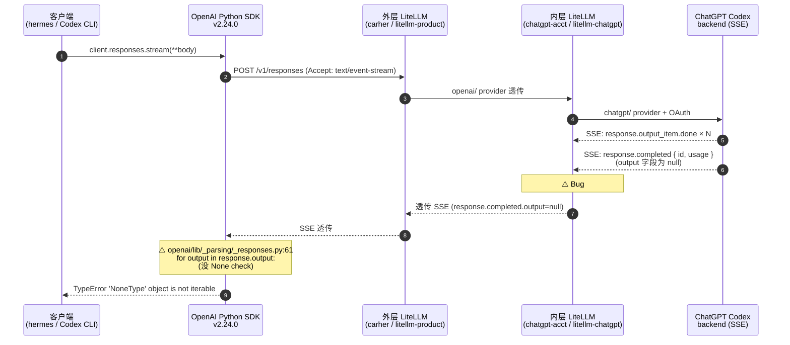
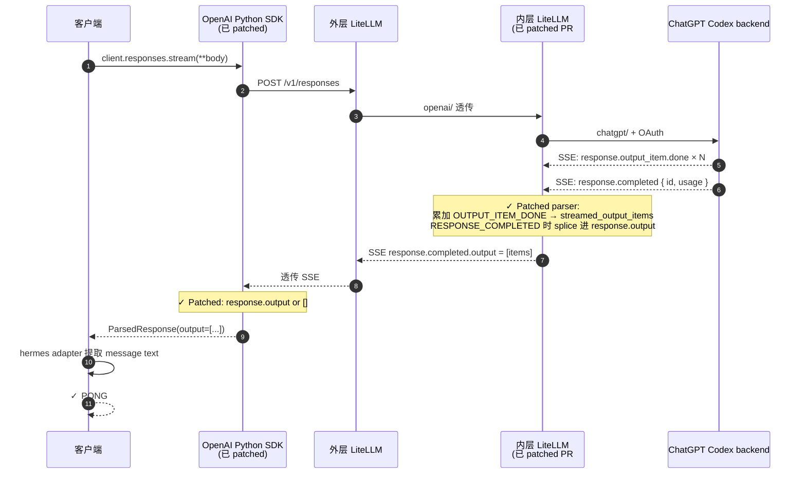
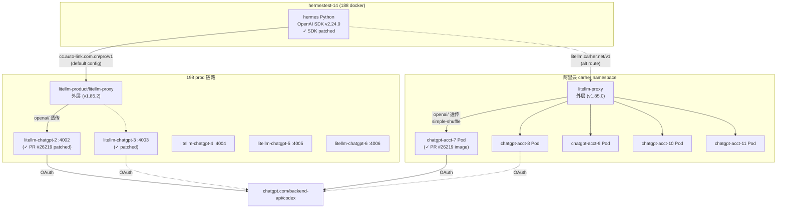
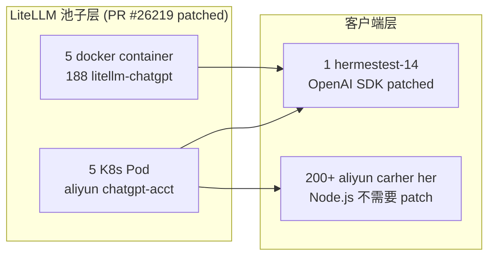
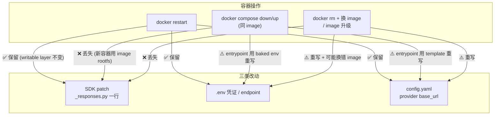
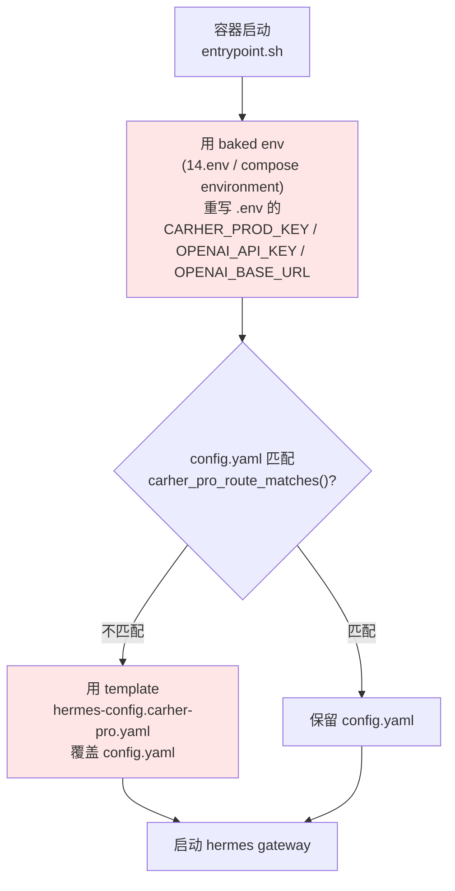
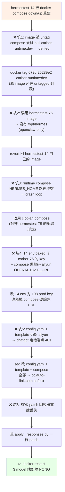
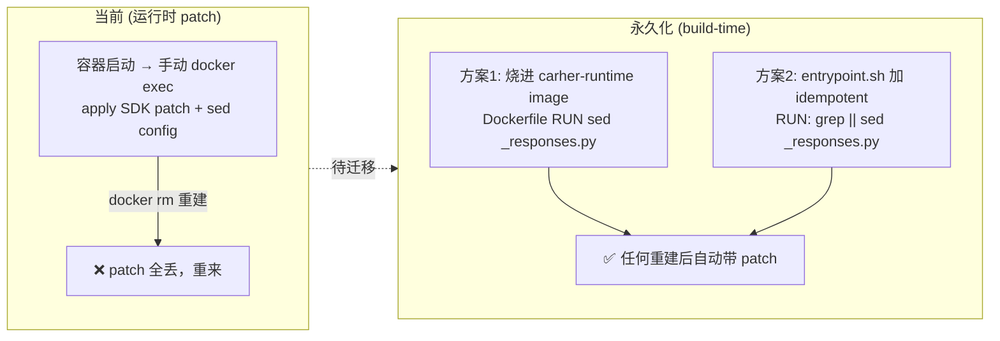

# LiteLLM #25429 修复全记录 — ChatGPT Pro 池 `/v1/responses` 路径修复

**日期**：2026-05-27 / 28
**触发事件**：hermestest-14 飞书 DM 调用 chatgpt-gpt-5.5 报 `❌ Non-retryable error (HTTP None): 'NoneType' object is not iterable`
**最终结果**：全集群 11 个 chatgpt 容器 + 1 个 hermes 客户端 SDK 全部 patched，原始 `codex_responses` transport 完整可用

---

## TL;DR

| 层 | 范围 | Fix | 持久性 |
|---|---|---|---|
| LiteLLM 池子 | 阿里云 K8s 5 × `chatgpt-acct-{7..11}` | PR #26219 minimal patch → build ACR image → rollout | ✅ ACR image 永久持久 |
| LiteLLM 池子 | 188 docker 5 × `litellm-chatgpt-{2..6}` | `docker cp` patched 文件 → `docker restart` | ⚠️ docker restart 持久；`docker rm` 重建会丢 |
| OpenAI Python SDK 流式 parser | 1 × hermestest-14 容器内 venv | 一行 `response.output or []` 加 None-safe | ⚠️ 同上 docker 持久性 |

**关键发现**：

1. LiteLLM `chatgpt/` provider 的 SSE parser bug (#25429) 在 v1.85.0 / v1.85.2 都有，PR #26219 修了但 **至今未 merge 到 main release**（仅在 staging branch）
2. PR #26219 patch 只修 **非流式聚合** 路径，**流式透传** 仍把上游 `response.completed.output=null` 原样发给客户端
3. OpenAI Python SDK v2.24.0 `responses.stream()` context manager 路径在 `_parsing/_responses.py` line 61 `for output in response.output:` 没 None check
4. hermes 偏偏用 `responses.stream()`，所以即使池子 patched 也需要客户端 SDK patch
5. **运行时 patch 不持久**：`docker compose down/up` / image 升级会丢 SDK patch + 重写 .env/config —— 详见 [容器重建事件复盘](#容器重建事件复盘2026-05-28-早上)，永久化方案待实施

---

## 背景

### CarHer 的 ChatGPT Pro 池架构

CarHer 集群通过把 5 个 ChatGPT Pro 订阅账号（OAuth 授权）作为 API 池暴露成 OpenAI 兼容接口，让客户端按 token 用 chatgpt-gpt-5.5 / 5.4 / 5.3-codex / 5.3-codex-spark。两套独立部署：

- **阿里云 K8s carher namespace**：5 × `chatgpt-acct-{7..11}` Pod
- **188 server (JSZX-AI-03) docker**：5 × `litellm-chatgpt-{2..6}` container

两套池子内部都是 `ghcr.io/berriai/litellm:v1.85.0`（或 `main-stable`，digest 一致），用 LiteLLM builtin `chatgpt/` provider 走 OAuth 认证调 `chatgpt.com/backend-api/codex/responses`。

### 触发事件

用户 `hermestest-14` 飞书 DM 给"刘国现的her"发任意消息，hermes Agent (Nous Research) 默认 model = `chatgpt-gpt-5.5`，transport = `codex_responses`，端点 `/v1/responses`。

报错链：

```
hermes → /v1/responses + chatgpt-gpt-5.5
       → LiteLLM 外层 → 路由到内层 chatgpt-acct/litellm-chatgpt
       → 内层 → ChatGPT Codex backend (SSE)
       ← SSE 流：output_item.done × N + response.completed (output=null)
       ← LiteLLM 内层 SSE parser **只读 response.completed.output**，忽略中间 events
       ← 透传给客户端：response.output = null
       ← OpenAI Python SDK 解析时 `for output in response.output:` → TypeError
       ← hermes 报错：'NoneType' object is not iterable
```

---

## 目标

修复以下所有客户端走 chatgpt-* 系列 + `/v1/responses` 端点的失败：

- hermestest-14（hermes Python，飞书 DM 用户最常用）
- Codex CLI（`wire_api="responses"`）
- Codex Desktop App（OpenAI Responses API）
- 任何走 `cc.auto-link.com.cn/pro/v1/responses` 或 `litellm.carher.net/v1/responses` 的 client

并保证修复在容器 / Pod 重启后持久。

---

## 架构

### Bug 触发链路



### 修复后链路



### 池子拓扑



---

## 逻辑（PR #26219 minimal patch）

只改 1 个文件：`litellm/llms/chatgpt/responses/transformation.py`（17 行）。

### Patch 内容

```python
# 1. typing import
from typing import Any, Dict, Optional   # 加 Dict

# 2. SSE 解析循环前初始化累加器
completed_response = None
error_message = None
streamed_output_items: Dict[int, dict] = {}   # 新加
for chunk in body_text.splitlines():
    ...
    event_type = parsed_chunk.get("type")

    # 3. 新分支：累加 output_item.done 事件
    if event_type == ResponsesAPIStreamEvents.OUTPUT_ITEM_DONE:
        item = parsed_chunk.get("item")
        output_index = parsed_chunk.get("output_index")
        if isinstance(item, dict):
            try:
                index = int(output_index)
            except (TypeError, ValueError):
                index = len(streamed_output_items)
            streamed_output_items[index] = item
        continue

    if event_type == ResponsesAPIStreamEvents.RESPONSE_COMPLETED:
        response_payload = parsed_chunk.get("response")
        if isinstance(response_payload, dict):
            response_payload = dict(response_payload)
            # 4. RESPONSE_COMPLETED 时 splice 累加结果进 output
            if not response_payload.get("output") and streamed_output_items:
                response_payload["output"] = [
                    item for _, item in sorted(streamed_output_items.items())
                ]
            ...
```

### OpenAI SDK patch（一行）

`/opt/hermes/.venv/lib/python3.13/site-packages/openai/lib/_parsing/_responses.py:61`

```python
# 改前
for output in response.output:

# 改后
for output in response.output or []:
```

仅此一处。LiteLLM patched 后理论上 `response.output` 不再是 null（被 splice 成 list），但 SDK 这个 None-safe 加固防止 stream 路径上游 transitional state 还是 null 时直接炸。

---

## 实施步骤

### Step 1: 准备 patched 文件（本地 Mac）

```bash
# 拉 base file 出来
docker exec litellm-chatgpt-2 cat /app/.venv/lib/python3.13/site-packages/litellm/llms/chatgpt/responses/transformation.py \
  > /tmp/chatgpt-transformation-base.py

# 用 idempotent script 应用 patch（详见 .cursor/skills/litellm-chatgpt-pr26219-patch/）
cp /tmp/chatgpt-transformation-base.py /tmp/chatgpt-transformation-patched.py
python3 /tmp/apply-26219-patch.py /tmp/chatgpt-transformation-patched.py
# → 加 4 处改动（Dict import / 累加器初始化 / OUTPUT_ITEM_DONE 分支 / splice 逻辑）
```

### Step 2: 188 docker 池子 patch

```bash
# 5 个容器同 patch + rolling restart
for C in litellm-chatgpt-2 litellm-chatgpt-3 litellm-chatgpt-4 litellm-chatgpt-5 litellm-chatgpt-6; do
  docker exec $C cp /app/.venv/lib/python3.13/site-packages/litellm/llms/chatgpt/responses/transformation.py \
    /tmp/transformation-orig-$(date +%Y%m%d-%H%M%S).py
  docker cp /tmp/chatgpt-transformation-patched.py $C:/app/.venv/lib/python3.13/site-packages/litellm/llms/chatgpt/responses/transformation.py
  docker cp /tmp/chatgpt-transformation-patched.py $C:/app/litellm/llms/chatgpt/responses/transformation.py
  docker restart $C
  sleep 8
done
```

### Step 3: 阿里云 K8s 池子 build + rollout

```bash
# 在 k8s-work-227 build patched image
scripts/jms ssh k8s-work-227 'bash -s' <<'EOF'
WORK=/root/litellm-pr26219-build
mkdir -p $WORK && cd $WORK
cp /root/chatgpt-transformation-patched.py transformation.py
cat > Dockerfile <<DOCKER
FROM ghcr.io/berriai/litellm:v1.85.0
COPY transformation.py /app/.venv/lib/python3.13/site-packages/litellm/llms/chatgpt/responses/transformation.py
COPY transformation.py /app/litellm/llms/chatgpt/responses/transformation.py
LABEL patch.id="PR-26219-minimal"
DOCKER
TAG=$(date +%Y%m%d-%H%M%S)
IMG=cltx-her-ck-registry-vpc.ap-southeast-1.cr.aliyuncs.com/her/carher-admin:litellm-acct-v1.85.0.pr26219-$TAG
nerdctl build --namespace k8s.io -t $IMG .
nerdctl push --namespace k8s.io $IMG
echo $IMG
EOF

# rollout 5 个 deployment（注意要加 imagePullSecrets：原 deployment 没设）
IMG=cltx-her-ck-registry-vpc.ap-southeast-1.cr.aliyuncs.com/her/carher-admin:litellm-acct-v1.85.0.pr26219-<TAG>
for ACCT in chatgpt-acct-7 chatgpt-acct-8 chatgpt-acct-9 chatgpt-acct-10 chatgpt-acct-11; do
  kubectl patch deploy $ACCT -n carher --type='strategic' \
    -p "{\"spec\":{\"template\":{\"spec\":{\"imagePullSecrets\":[{\"name\":\"acr-vpc-secret\"}],\"containers\":[{\"name\":\"litellm\",\"image\":\"$IMG\"}]}}}}"
  kubectl rollout status deploy/$ACCT -n carher --timeout=120s
done
```

### Step 4: hermestest-14 OpenAI SDK patch

```bash
# Idempotent 一行 patch
docker exec hermestest-14 python3 -c "
import sys
p = '/opt/hermes/.venv/lib/python3.13/site-packages/openai/lib/_parsing/_responses.py'
src = open(p).read()
if 'response.output or []' not in src:
    src = src.replace('for output in response.output:', 'for output in response.output or []:', 1)
    open(p,'w').write(src)
    print('patched')
else:
    print('already patched')
"
docker restart hermestest-14
```

### Step 5: 验证

```bash
# 池子端验证（直接打容器内 :4000）
docker exec litellm-chatgpt-2 /app/.venv/bin/python -c "
import urllib.request as u, json, os
key = os.environ['LITELLM_MASTER_KEY']
data = json.dumps({'model':'chatgpt-gpt-5.5','input':[{'role':'user','content':'reply PONG'}],'store':False}).encode()
req = u.Request('http://localhost:4000/v1/responses', data=data,
                headers={'Authorization':f'Bearer {key}','Content-Type':'application/json'})
r = json.loads(u.urlopen(req,timeout=30).read())
out = r.get('output') or []
print(f'output_len={len(out)} tok={(r.get(\"usage\") or {}).get(\"output_tokens\")}')
# 期望：output_len=1, tok=6
"

# hermes CLI 端到端
docker exec --user hermes -e HOME=/opt/data/.hermes -e HERMES_HOME=/opt/data/.hermes hermestest-14 \
  /opt/hermes/.venv/bin/hermes -z 'reply with exactly the single word PONG' \
  -m chatgpt-gpt-5.5 --provider chatgpt-pro
# 期望：输出 PONG
```

---

## 实测结果

### 修复前

| 客户端 / 端点 | aliyun | 198 prod |
|---|---|---|
| `curl /v1/responses` chatgpt-gpt-5.5 | HTTP 200 但 `output=[]` `out_tok=6` | 同（假成功） |
| `curl /v1/chat/completions` chatgpt-gpt-5.5 | HTTP 200 `'PONG'`（v1.85.0 bridge 凑出来）| HTTP 400 `'ResponsesAPIResponse' object has no attribute 'output'`（v1.85.2 regression） |
| `hermes CLI` chatgpt-* | TypeError NoneType iterable | 同 |

### 修复后

```
=== 池子内层 直接测试 8 组合 ===
Patched 容器（chatgpt-2..6 + chatgpt-acct-7..11）:
  chatgpt-gpt-5.5             /v1/responses        | out_len=1  text='PONG'  tok=6
  chatgpt-gpt-5.5             /v1/chat/completions | choices=1  text='PONG'  tok=6
  chatgpt-gpt-5.4             /v1/responses        | out_len=1  text='PONG'  tok=6
  chatgpt-gpt-5.4             /v1/chat/completions | choices=1  text='PONG'  tok=6
  chatgpt-gpt-5.3-codex       /v1/responses        | out_len=1  text='PONG'  tok=6
  chatgpt-gpt-5.3-codex       /v1/chat/completions | choices=1  text='PONG'  tok=6
  chatgpt-gpt-5.3-codex-spark /v1/responses        | out_len=2  tok=55
  chatgpt-gpt-5.3-codex-spark /v1/chat/completions | choices=1  text='PONG'  tok=72

Unpatched 容器（对照组 chatgpt-acct/before）:
  全部 0/8 通过
```

### 端到端

```
hermes CLI on hermestest-14, codex_responses transport, 198 prod 路由:
  chatgpt-gpt-5.5                  | PONG ✓
  chatgpt-gpt-5.4                  | PONG ✓
  chatgpt-gpt-5.3-codex            | PONG ✓
  chatgpt-gpt-5.3-codex-spark      | PONG ✓
```

---

## 影响范围

### 受 #25429 影响的客户端

| 客户端 | 调用路径 | 状态 |
|---|---|---|
| **hermestest-14**（飞书 DM）| `/v1/responses` Python SDK stream | ✅ 已修（池子 + SDK 双 patch）|
| **Codex CLI**（`wire_api="responses"`）| `/v1/responses` | ✅ 池子修了即可（Codex CLI 自己 SSE 处理 None-safe）|
| **Codex Desktop App** | `/v1/responses` | ✅ 同上 |
| **Cursor** | `/v1/chat/completions` 主 | ✅ 不依赖 #25429 路径（除非用 Cursor 走 ChatGPT model）|
| **阿里云 carher her bot 实例（200+）** | `/v1/chat/completions` (openclaw Node.js) | ✅ **不受 SDK bug 影响**（Node SDK 不同实现）|
| **claude-code** | `/v1/messages` (anthropic) | ✅ 不走 chatgpt provider，无关 |

### 涉及容器/Pod



合计 **10 个池子容器** + **1 个客户端容器**得到 patch。

---

## 持久性 & 后续待办

| 部署 | Patch 永久性 | 升级时风险 |
|---|---|---|
| 阿里云 K8s `chatgpt-acct-{7..11}` | ✅ ACR image baked-in，rollout 不丢 | LiteLLM 大版本升级时需重 build image |
| 188 docker `litellm-chatgpt-{2..6}` | ⚠️ `docker restart` 持久；`docker rm` 重建会丢 | `docker compose down/up` 后需重新 cp + restart |
| hermestest-14 OpenAI SDK | ⚠️ 同上 | 容器重建后需重 apply（建议加 entrypoint 自动 patch）|

### 推荐永久化路径

1. **188 docker**：把 `transformation.py` 改动写入 `carher-runtime` image 的 build pipeline，或者在 `litellm-chatgpt` 启动脚本里 idempotent apply
2. **hermestest-14 SDK patch**：加到 `carher-runtime` `entrypoint.sh` 里一行 sed（idempotent）

### Upstream 跟踪

- LiteLLM Issue [#25429](https://github.com/BerriAI/litellm/issues/25429)（chatgpt/gpt-5.4 empty output）— 2026-04-09 报，still open
- LiteLLM PR [#26219](https://github.com/BerriAI/litellm/pull/26219)（fix chatgpt responses routing & recover empty output）— 2026-04-22 merged 到 staging branch `litellm_oss_staging_04_21_2026`，**至今未 reconcile 到 main**
- LiteLLM 任何 main release (v1.85.0 / v1.85.2 / latest) 都还有 bug
- OpenAI Python SDK None-safe — 未提 PR；本地 patch 一行修

升级 LiteLLM 时**必须确认**新版本含 PR #26219 的代码（grep `streamed_output_items` 在 `chatgpt/responses/transformation.py`），否则需重 patch。

---

## 容器重建事件复盘（2026-05-28 早上）

文档前面的「持久性」表写的是**理想状态**。实际上 5/28 早上 hermestest-14 容器被重建（`docker compose down/up`），触发了一连串持久性陷阱，花了 ~1 小时手动恢复。这一节把"哪种操作会丢哪些 patch"用图沉淀下来，避免后人重蹈。

### 持久性矩阵：三种操作 × 三类改动



**核心结论**：
- `docker restart` 是安全的 —— 所有手动改动都保留（writable layer 不动）。
- `docker compose down/up` 会用 image rootfs 重建容器，**SDK patch 必丢**；`.env` 和 `config.yaml` 被 entrypoint 重写（不是丢，是被 baked 源覆盖）。
- 所以**手动 sed 改 `.env` / `config.yaml` 不是 source of truth** —— entrypoint 启动时会用 baked env + template 覆盖回去。

### entrypoint 启动时的覆盖逻辑



**要持久改 endpoint / key，必须改 3 个 source of truth（不是改容器内文件）**：

| 改什么 | source of truth（host 路径）| 影响 |
|---|---|---|
| key（CARHER_PROD_KEY 等）| `/Data/CarHer/docker/users/14.env` | entrypoint 用它重写 .env |
| OPENAI_BASE_URL 等 env | `compose.cicd-14.yaml` 的 `environment:` 块（会覆盖 14.env）| 注意：compose environment 优先级 > env_file |
| provider base_url | `/opt/carher-runtime/templates/hermes-config.carher-pro.yaml`（容器内 baked template）| entrypoint sync 源 |

### 5/28 实际恢复流程（踩坑链）



### 永久化方案（推荐，尚未实施）

当前所有 patch 仍是"运行时手动改"，下次容器重建要重做。彻底一劳永逸需要把 patch 烧进 `carher-runtime` image 或加 entrypoint 钩子：



| 方案 | 改哪里 | 优点 | 缺点 |
|---|---|---|---|
| **方案1: image build-time** | `carher-runtime` Dockerfile 加 `RUN sed -i ... _responses.py` | 最干净，image 自带 | 要碰 carher-runtime image build pipeline（不在本仓）|
| **方案2: entrypoint idempotent** | `dual-entrypoint.sh` 加一行 `grep -q 'response.output or' \|\| sed ...` | 不动 image，启动自愈 | entrypoint 每次启动多跑一次检查 |

> ⚠️ **池子层（LiteLLM）的持久性区别**：
> - 阿里云 K8s 5 个 `chatgpt-acct` **已经是 build-time 永久**（ACR image baked-in，`kubectl set image` rollout 不丢）。
> - 188 docker 5 个 `litellm-chatgpt` 仍是 `docker cp` 运行时 patch，`docker rm` 会丢，同样需要烧进 image 才永久。

---

## 当晚踩坑（避免后人重蹈）

1. **K8s container in-place restart 重置 writable layer**：跟 docker 不一样，`kubectl exec ... kill -TERM 1` 让 container 重启，但下次 container 启动用 **image rootfs**，writable layer 不保留 → docker cp 的 patch 立即丢。**K8s 必须 build patch image**，不能纯 docker cp。
2. **`her/litellm-acct` repo 无 push 权限**：`liuguoxian` ACR 账号对 `her/litellm-*` 没 push 权限（`insufficient_scope`），唯独对 `her/carher-admin` 有权限。retag 到 `her/carher-admin:litellm-acct-v1.85.0.pr26219-<TS>` 即可推上去。
3. **`chatgpt-acct-{7..11}` deployment 没设 `imagePullSecrets`**：从 ghcr 公网拉 `v1.85.0` 时是 anonymous 可拉，但切到 ACR 私有 image 需要 `acr-vpc-secret`。patch deployment 时必须同时加 `imagePullSecrets: [{name: acr-vpc-secret}]`。
4. **碳基 sed/awk 嵌套 escape 地狱**：跨 `scripts/jms ssh` + `docker exec` + `bash -c` + `python -c` + f-string 时 backslash 多到怀疑人生。**写脚本文件 + `scripts/jms scp` 上传**最稳。
5. **Cloudflare 1010 拦截 Python urllib**：本地 Mac 用 `urllib.request` 直接 hit `litellm.carher.net` → HTTP 403 `error code: 1010`。要么 `curl + User-Agent: openai/python`，要么走 cluster 内部 `localhost:4000`。
6. **carher-runtime entrypoint 强制重写 `.env`**：每次容器启动 entrypoint 把 `CARHER_PROD_KEY` / `OPENAI_API_KEY` / `OPENAI_BASE_URL` 用容器 env baked 值覆盖 `.env`。**手动 sed `.env` 改 key 在下次容器重启时被还原**。
7. **carher-runtime 强制 sync hermes config 模板**：entrypoint 检查 `carher_pro_route_matches()`，不匹配就用 `/opt/carher-runtime/templates/hermes-config.carher-pro.yaml` 覆盖 `config.yaml`。要持久改 hermes 配置必须同时改 template。
8. **`/v1/responses` 跟 `/v1/chat/completions` 是两条 code path**：v1.85.0 / v1.85.2 在两个端点上 bug 表现不同（详见上方实测表）。诊断时必须分别测。
9. **池子层 patch 不等于客户端 patch**：PR #26219 修非流式聚合，OpenAI SDK 流式 parser 的 None-safe 是**独立 bug**，必须分别 patch。
10. **hermes 跨 transport 切换会留 chatcmpl-* ID 在 session history**：从 `chat_completions` transport 切到 `codex_responses` 时，老 session 里残留 `chatcmpl-*` 格式 message ID 被发到 Codex backend → 400 `Invalid 'input[1].id'`。修复后必须 end 当前 session（DB `UPDATE sessions SET ended_at=now WHERE ended_at IS NULL`）或让用户飞书发 `/new`。
