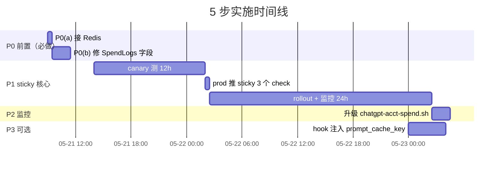

# carher LiteLLM Prompt Cache + Sticky Routing 最优方案

> 2026-05-20 起草。结合 Anthropic / OpenAI / LiteLLM 三家官网铁数据 + carher 当前实际架构（v1.85.0 / wangsu Anthropic-native / 5 acct ChatGPT 池 / 2 副本 litellm-proxy）+ 原 `litellm-prompt-cache-routing-plan-20260520.md` 调研稿。

## TL;DR

1. **carher LiteLLM 1.85.0 已具备**：4 个 sticky pre_call_checks 内置 + Claude cache_control_injection_points 已配 + wangsu Anthropic-native + 5 个 ChatGPT acct 池
2. **缺 3 件**：(P0a) Redis 连接（2 副本必须）/ (P0b) SpendLogs cache 字段记录 / (P1) `optional_pre_call_checks` sticky 开关
3. **不改 her 主程序**：用 LiteLLM pre-call hook 注入 `prompt_cache_key`，替代"客户端加参数"
4. **TTL 用 600s 不是 3600s**：平衡 ChatGPT cache 命中（5-10min in_memory + gpt-5.5 24h extended）与单 acct 撞限恢复
5. **核心收益**：217 her 默认 `model=gpt`（→ chatgpt-gpt-5.5）流量从 simple-shuffle 1/5 分散 → sticky 后 prompt cache 命中率接近 100%，预计省 60-80% input token 成本

---

## 一、三家官网铁数据（精确表，2026-05 复核）

### 1.1 Anthropic Claude Prompt Caching

**官方**：https://platform.claude.com/docs/en/build-with-claude/prompt-caching

| 维度 | 数据 |
|------|------|
| 触发 | 客户端**必须**传 `cache_control: {"type": "ephemeral"}`（自动模式 = 顶层一个 / 显式模式 = 最多 4 断点）|
| 触发阈值 | Claude 3.x = 1024 tok / **Claude Sonnet 4.5+/4.6 + Opus 4 = 2048 tok** / **Haiku 4.5 / Opus 4.5+ = 4096 tok** |
| TTL | 5min（1.25x base input write 费）/ 1h（2x write 费）—— 每次命中自动刷新 |
| Cache Read 折扣 | **0.1x base input（省 90%）** |
| 覆盖范围 | `tools → system → messages` 按顺序缓存到加 `cache_control` 那个 block 为止 |

**carher 主力 Claude 模型阈值**：opus-4-6/4-7 / sonnet-4-6 都是 **2048**。1024-2048 之间静默跳过不报错。

### 1.2 OpenAI ChatGPT Prompt Caching

**官方**：https://platform.openai.com/docs/guides/prompt-caching

| 维度 | 数据 |
|------|------|
| 触发 | **完全自动**，零客户端改动 |
| 触发阈值 | prompt ≥ **1024 tok** |
| 服务端路由 | 按 prompt prefix hash **自动 sticky** 到同一 server（OpenAI 内部）|
| TTL `in_memory`（默认）| 5-10 分钟，最长 1h（gpt-4o / gpt-4.1 / gpt-5 等）|
| TTL `24h` extended | 24 小时（**gpt-5.5 / gpt-5.5-pro / gpt-5.4 / gpt-5-codex** 等默认就是 24h）|
| 关键参数 | `prompt_cache_key` 字符串（与 prefix hash 组合）+ `prompt_cache_retention: 24h`|
| 隐藏坑 | 同 `(prefix + cache_key)` > **15 req/min** 会溢出到其他 server → cache 失效 |
| Cache Read 折扣 | up to **90%** input cost，cache write 无额外费 |

**carher ChatGPT 主路径**：217 her 默认 `model=gpt` → `chatgpt-gpt-5.5` → 默认 24h extended cache。**最大 sticky 收益场景**。

### 1.3 LiteLLM Router pre_call_checks

**官方**：https://docs.litellm.ai/docs/tutorials/claude_code_prompt_cache_routing + 源码 `litellm/router_utils/pre_call_checks/`

| flag | 实现 class | 路由 key | 触发条件 | 适用 carher |
|------|----------|---------|---------|------------|
| `deployment_affinity` | `DeploymentAffinityCheck` | **API key hash** | TTL 内有 vkey mapping | ⭐ 217 her 各自 carher-* vkey → sticky 同 acct |
| `responses_api_deployment_check` | `DeploymentAffinityCheck` | `previous_response_id` | OpenAI Responses API 多轮 | ⭐ ChatGPT 池用 `mode: responses` 完美匹配 |
| `session_affinity` | `DeploymentAffinityCheck` | 客户端传 `session_id` | 客户端主动传 | ❌ carher bot 不传 session_id |
| `prompt_caching` | `PromptCachingDeploymentCheck` | **prompt prefix hash** | prompt ≥ Anthropic/OpenAI 阈值 | ⭐ 跨 vkey 但同 system prompt 共享 deployment cache |

源码 `VALID_FLAGS`（确认存在）：
```python
VALID_FLAGS = frozenset(
    {"deployment_affinity", "responses_api_deployment_check", "session_affinity"}
)
```

`Router.__init__` 默认 TTL：
```python
deployment_affinity_ttl_seconds: int = 3600  # 1h，可配
```

---

## 二、carher 当前架构（核实，2026-05-20）

### 2.1 LiteLLM 版本 + 副本数

| 资源 | 值 |
|------|---|
| `litellm-proxy` image | `ghcr.io/berriai/litellm:v1.85.0` ✅ |
| replicas | **2**（多副本 → sticky 必须 Redis 同步）|
| Redis service | `carher-redis` (192.168.25.185:6379) **存在但 litellm-proxy 未接** |

### 2.2 Claude 主路径（wangsu Anthropic-native）

`k8s/litellm-proxy.yaml` 当前 Claude opus-4-6 配置：
```yaml
- model_name: claude-opus-4-6
  litellm_params:
    model: anthropic/anthropic.claude-opus-4-6                       # Anthropic-native provider
    api_base: https://aigateway.edgecloudapp.com/v2/gws/yqhhclqf/anthropic  # wangsu gateway
    api_key: os.environ/WANGSU_DIRECT_API_KEY
    extra_headers:
      anthropic-beta: "prompt-caching-2024-07-31,extended-cache-ttl-2025-04-11"
    cache_control_injection_points:                                  # ✅ 已配
      - location: message
        role: system
        control: { type: ephemeral, ttl: "1h" }
      - location: message
        role: user
        index: -1
        control: { type: ephemeral, ttl: "1h" }
```

**原方案 Step 2（cache_control_injection_points）已完成 ≥80%**：
- ✅ Claude opus-4-6/4-7、sonnet-4-6、haiku-4-5 都配了双注入（system + user index=-1）
- ✅ extended-cache-ttl-2025-04-11 anthropic-beta 启用 1h TTL（非默认 5min）
- ⚠️ wangsu gateway 是否透传 cache_control 给 Anthropic 上游 → 需在 P0(b) 修完 SpendLogs 后实测

### 2.3 ChatGPT 5 acct 池（2026-05-20 接入）

```yaml
- model_name: chatgpt-gpt-5.5
  litellm_params:
    model: openai/chatgpt-gpt-5.5
    api_base: http://chatgpt-acct-{7..11}.carher.svc:4000           # 5 deployment × 4 model_name
    api_key: os.environ/CHATGPT_POOL_KEY
  model_info: { mode: responses, id: chatgpt-acct-{N}/chatgpt-gpt-5.5 }
```

- 217 her 默认 `spec.model=gpt` → 经 operator alias map → `litellm/chatgpt-gpt-5.5`
- 当前 simple-shuffle 5 个 acct 均匀分布（实测 ~310-370 calls / acct / 2h）
- 每 acct 上游 ChatGPT prompt cache 命中率 ≈ 1/5（同 her 流量分散到 5 acct，cache 各自维护）

### 2.4 SpendLogs cache 字段缺失

```sql
SELECT cache_hit, prompt_tokens, metadata->'usage'->'prompt_tokens_details'->>'cached_tokens'
FROM "LiteLLM_SpendLogs" WHERE model='claude-opus-4-6' ORDER BY "startTime" DESC LIMIT 5;
-- 结果全部:  False  |  0  |  (空)  |  (空)
```

LiteLLM 1.85 schema 没 `cache_read_input_tokens` / `cache_creation_input_tokens` 列；`metadata.usage.cached_tokens` 也是空 → **真实 cache 命中率不可观察**，原文档诊断的"淼熠 cache 0%"是**统计盲**而非真实路由问题。

---

## 三、整体架构（mermaid）

### 3.1 当前 + 目标拓扑

```mermaid
flowchart LR
  subgraph Her["217 carher her 实例 + 7 opus her"]
    direction TB
    H1[carher-1000<br/>carher-1001<br/>...]
  end

  subgraph LP["litellm-proxy (replicas=2, v1.85.0)"]
    direction TB
    PRE["pre_call_checks (新增)<br/>① deployment_affinity (vkey hash sticky)<br/>② responses_api_deployment_check (Responses API)<br/>③ prompt_caching (prefix hash sticky)"]
    LB["routing_strategy: simple-shuffle (默认)"]
    HOOK["pre-call hook (新增)<br/>注入 prompt_cache_key=vkey_alias"]
    CCI["cache_control_injection_points<br/>(Claude 模型已配，自动注入<br/>system + user index=-1)"]
  end

  subgraph Redis["carher-redis (新增接入)"]
    direction TB
    RC["DualCache 共享<br/>vkey hash → deployment 映射<br/>prompt prefix hash → deployment 映射<br/>previous_response_id → deployment"]
  end

  subgraph ChatGPT5["ChatGPT 池 (5 acct, carher ns)"]
    direction TB
    A7["chatgpt-acct-7"]
    A8["chatgpt-acct-8"]
    A9["chatgpt-acct-9"]
    A10["chatgpt-acct-10"]
    A11["chatgpt-acct-11"]
  end

  subgraph Wangsu["wangsu Anthropic-native<br/>(aigateway.edgecloudapp.com)"]
    W1["Claude opus-4-6/4-7<br/>sonnet-4-6 / haiku-4-5<br/>(1h extended cache)"]
  end

  Her -->|virtual key + Anthropic/OpenAI request| LP
  LP -.->|查 + 写 sticky 映射| Redis
  LP --> CCI
  LP --> HOOK
  LP -->|sticky to same acct<br/>(if vkey/prefix/response_id hit)| ChatGPT5
  LP -->|cache_control auto-injected<br/>(prompt-caching + 1h TTL)| Wangsu

  ChatGPT5 -->|prompt cache hit ~100%<br/>per acct (24h extended)| OAI[("ChatGPT Pro upstream<br/>acct-7~11")]
  Wangsu -->|cache_read 0.1x base| ANT[("Anthropic upstream<br/>(via wangsu gateway)")]

  style PRE fill:#fff5d0
  style HOOK fill:#fff5d0
  style Redis fill:#fff5d0
  style CCI fill:#e0f5e0
```

> 黄色块 = 本方案新增 / 改动；绿色块 = 已存在不动。

### 3.2 请求路由决策流（pre_call_checks 链）

```mermaid
flowchart TB
  REQ["her 请求<br/>(carher-* vkey + model_name + messages)"]
  REQ --> Q1{model_name 是<br/>chatgpt-gpt-5.5 / 5.4<br/>/ 5.3-codex / 5.3-codex-spark?}
  Q1 -->|否| WANGSU["走 wangsu Anthropic-native /<br/>openrouter / kuaihui<br/>(单 deployment 或 fallback 链)"]
  Q1 -->|是| HEALTHY["healthy_deployments = 5 个 acct Pod"]
  HEALTHY --> P1{previous_response_id?<br/>(responses_api_deployment_check)}
  P1 -->|有 + Redis 命中| STICK1["路由到原 deployment<br/>(强 sticky)"]
  P1 -->|无 / Redis 缺失| P2{vkey hash → deployment?<br/>(deployment_affinity, TTL 内)}
  P2 -->|命中| STICK2["路由到同 acct<br/>(TTL=600s)"]
  P2 -->|未命中 / TTL 过期| P3{prompt prefix hash<br/>→ deployment?<br/>(prompt_caching, ≥1024 tok)}
  P3 -->|命中| STICK3["路由到 cache 写过的 acct<br/>(跨 vkey 共享)"]
  P3 -->|未命中| SHUFFLE["simple-shuffle<br/>5 acct 随机选 1"]

  STICK1 --> EXEC["执行调用 chatgpt-acct-N"]
  STICK2 --> EXEC
  STICK3 --> EXEC
  SHUFFLE --> EXEC
  EXEC --> SAVE["成功后写 Redis:<br/>vkey hash → acct (TTL 600s)<br/>response_id → acct<br/>prompt prefix → acct"]
  SAVE --> RESP["返回 her<br/>(stream / non-stream)"]

  style STICK1 fill:#e0f5e0
  style STICK2 fill:#e0f5e0
  style STICK3 fill:#e0f5e0
  style SHUFFLE fill:#fff5d0
```

### 3.3 Cache 命中数据流（OpenAI + Anthropic 对比）

```mermaid
sequenceDiagram
  participant Her as carher-1000<br/>(her vkey)
  participant LP as litellm-proxy
  participant Redis as carher-redis<br/>(DualCache)
  participant Acct as chatgpt-acct-8<br/>(via sticky)
  participant W as wangsu Anthropic
  participant OAI as ChatGPT Pro
  participant ANT as Anthropic

  Note over Her,OAI: 场景 A: 同 her 反复调 chatgpt-gpt-5.5 (OpenAI 隐式 cache)
  Her->>LP: 第 1 次 gpt-5.5 (8000 tok system)
  LP->>Redis: 查 vkey hash → ?
  Redis-->>LP: miss
  LP->>LP: simple-shuffle → acct-8
  LP->>Acct: forward
  Acct->>OAI: POST /codex/responses (8000 tok)
  OAI-->>Acct: response + 服务端写 cache (24h)
  Acct-->>LP: stream
  LP->>Redis: 写 vkey hash → acct-8 (TTL 600s)
  LP-->>Her: response

  Her->>LP: 第 2 次 gpt-5.5 (同 system + new user msg)
  LP->>Redis: 查 vkey hash → acct-8 ✅
  LP->>Acct: forward (sticky)
  Acct->>OAI: POST /codex/responses
  OAI-->>Acct: response<br/>(prompt_tokens_details.cached_tokens ≈ 7200/8000 = 90%)
  Acct-->>LP: stream
  LP-->>Her: response (省 90% input cost)

  Note over Her,ANT: 场景 B: 同 her 反复调 claude-opus-4-6 (Anthropic 显式 cache)
  Her->>LP: 调 claude-opus-4-6 (不传 cache_control)
  LP->>LP: cache_control_injection_points 自动注入<br/>(system + user index=-1, ttl=1h)
  LP->>W: POST /v1/messages (含 cache_control)
  W->>ANT: 透传 cache_control + anthropic-beta extended-ttl
  ANT-->>W: response + cache_creation_input_tokens=8000
  W-->>LP: stream
  LP-->>Her: 第 1 次：cache write (1.25x ~ 2x base)

  Her->>LP: 第 2 次同 conversation
  LP->>W: POST (注入 cache_control)
  W->>ANT: 透传
  ANT-->>W: cache_read_input_tokens=7800<br/>(命中 1h cache, 0.1x base)
  W-->>LP-->>Her: 第 2 次：省 90%
```

---

## 四、carher 实际 vs 原文档假设（差异表）

| # | 维度 | 原文档假设 | carher 实际 | 处理 |
|---|------|-----------|-------------|------|
| 1 | LiteLLM 版本 | "v1.84+" | **v1.85.0 ✅** | 已具备 |
| 2 | Claude 主路径 | wangsu / anthropic / openrouter 多源 | **wangsu Anthropic-native** + `anthropic-beta: prompt-caching,extended-cache-ttl-2025-04-11` | native 已配 |
| 3 | `cache_control_injection_points` | "Step 2 才加" | **已配 system + user index=-1 + 1h TTL** | **Step 2 跳过** |
| 4 | LiteLLM_SpendLogs schema | 有 `cache_read_input_tokens` / `cache_creation_input_tokens` 列 | **没这两列**，只有 `cache_hit` (bool) + `cache_key` | 监控 SQL 重写 |
| 5 | 当前 SpendLogs Claude 数据 | "淼熠 cache 0%" | `cache_hit=False, prompt_tokens=0` 全部 → 是 LiteLLM 1.85 没回填 → **统计盲不是真路由问题** | P0(b) 先修字段 |
| 6 | Redis | "Step 1 配 Redis" | carher-redis service 存在但 litellm-proxy **未接** | P0(a) 前置 |
| 7 | 副本数 | 没明说 | **replicas=2** | sticky 必须 Redis 否则副本间不一致 |
| 8 | ChatGPT 5 acct 池 | 没单独提 | **核心场景**（217 her 默认 gpt）| sticky 收益最大入口 |

---

## 五、最终方案（5 步，按优先级排序）

### P0(a) — 接 Redis（前置，30min）

**为什么必须**：litellm-proxy 2 副本，pre_call_checks 用 DualCache 维护 sticky 映射。Redis 缺失时两副本各自本地缓存，**同 vkey 50% 概率路由到不同 deployment**，sticky 失效。

```yaml
# k8s/litellm-proxy.yaml 改动
router_settings:
  redis_host: carher-redis.carher.svc.cluster.local
  redis_port: 6379
  redis_password: os.environ/REDIS_PASSWORD     # 加到 litellm-secrets

# k8s/litellm-secrets.yaml 加 REDIS_PASSWORD 字段（从 carher-redis Secret 拷过来）
```

**验证**：`kubectl exec litellm-proxy -- python3 -c "import redis; r=redis.from_url('redis://...'); r.ping()"`

### P0(b) — 修 SpendLogs cache 字段（前置，1-2h）

**为什么必须**：当前 SpendLogs `cache_hit=False, prompt_tokens=0` 全部 → 真实 cache 命中率**不可观察** → sticky 推上线**无法量化收益**。

需要先 triage：
- 看 LiteLLM 1.85 是否需要显式 `litellm_settings.log_cached_tokens_to_db: True`
- 看 `LiteLLM_SpendLogs` schema 是否需要 prisma migrate 新列（`cache_read_input_tokens` / `cache_creation_input_tokens`）
- 看 Anthropic provider 的 `usage_response_object` callback 是否把 `cache_read_input_tokens` 传回 LiteLLM logging path

参考 LiteLLM Anthropic provider 代码 + LiteLLM_SpendLogs prisma schema。

### P1 — 启 sticky pre_call_checks（核心，1h）

```yaml
# k8s/litellm-proxy.yaml router_settings 加：
router_settings:
  optional_pre_call_checks:
    - deployment_affinity              # vkey hash → 同 acct (TTL 内)
    - responses_api_deployment_check   # OpenAI Responses API previous_response_id 强 sticky
    - prompt_caching                   # ≥1024 tok prompt prefix → 同 deployment
  deployment_affinity_ttl_seconds: 600  # 10min（不是文档默认 3600）
  # redis_* 来自 P0(a)
```

**TTL=600s 决策依据**：

| TTL | 利弊 |
|-----|------|
| 24h | cache 命中最高，单 acct 撞限卡 24h |
| 1h（默认）| 折衷，但 carher 业务高峰期单 acct 撞限 1h 会影响 ~45 her |
| **10min**（推荐）| ChatGPT 默认 in_memory 5-10min cache 重叠；撞限 10min 后切走，影响窗口小 |
| 5min | cache 容易过期；不推荐 |

ChatGPT gpt-5.5 默认 24h extended cache，但实际命中率取决于"同 prefix 是否能在 acct 上保持 routing"——TTL 10min 内连续请求维持 sticky，每个请求自动延长 ChatGPT 上游 cache。

### P2 — 升级监控（cache 命中率，2h）

升级 `scripts/chatgpt-acct-spend.sh` 加列（前提 P0(b) 修好 cache 字段）：

```sql
-- 新列
SUM(COALESCE(cache_read_input_tokens, 0)) AS cache_read,
SUM(COALESCE(cache_creation_input_tokens, 0)) AS cache_write,
ROUND(100.0 * SUM(COALESCE(cache_read_input_tokens, 0)) / NULLIF(SUM(prompt_tokens), 0), 1) AS hit_pct
```

输出新表"按模型 × cache 命中率"，对比 P1 上线前后曲线。

### P3 — 自动注入 prompt_cache_key（可选，4h）

**触发条件**：监控发现 ChatGPT 池命中率 < 60%，或单 acct 撞 15 req/min 同 prefix 上限。

**为什么不改 her 主程序**：carher 主程序代码改动影响 500+ 实例 + CI/CD 流程长。LiteLLM pre-call hook 替代：

```python
# backend/litellm_callbacks/inject_prompt_cache_key.py
class InjectPromptCacheKey(CustomLogger):
    async def async_pre_call_hook(self, user_api_key_dict, cache, data, call_type):
        # 仅对 OpenAI/ChatGPT 路径生效
        model = data.get("model", "")
        if not model.startswith(("chatgpt-", "gpt-5")):
            return data
        # 用 vkey alias (carher-1000) 作 cache key
        vkey_alias = user_api_key_dict.key_alias or "default"
        data.setdefault("extra_body", {})["prompt_cache_key"] = vkey_alias
        data["extra_body"]["prompt_cache_retention"] = "24h"
        return data
```

挂到 `litellm-callbacks` ConfigMap，YAML 加：
```yaml
litellm_settings:
  callbacks:
    - inject_prompt_cache_key.InjectPromptCacheKey
```

效果：每个 her vkey 自动分散到独立 routing key，避免 ChatGPT 服务端 15 req/min 溢出。

---

## 六、跟原文档对比（差异 + 取舍）

| 原文档 4 步 | 我的方案 | 差异说明 |
|------------|---------|---------|
| Step 1 启 pre_call_checks | **P1** + **P0(a) Redis 前置** | 加 Redis 必须前置；TTL 600s 不是 3600s |
| Step 2 加 cache_control_injection_points | **跳过**（已配）| Claude 全模型已注入 system + user index=-1 |
| Step 3 her 客户端加 prompt_cache_key | **P3 LiteLLM hook** | 不改 her 主程序 |
| Step 4 监控按模型分组 | **P2** + **P0(b) 先修 cache 字段** | 当前 SpendLogs cache 列空，监控前要先记录 |

---

## 七、风险与缓解

| 风险 | 概率 | 缓解 |
|------|------|------|
| Redis 单点 (carher-redis) 挂掉 | 低 | sticky 退化为 simple-shuffle，业务不挂；可上 Redis Sentinel |
| TTL 600s 偏短 cache 命中率不达预期 | 中 | P2 监控数据后调（300/600/1200s 多次试）|
| `prompt_caching` 跨 vkey 共享导致 deployment 偏斜 | 中 | Redis 共享后看分布；偏斜严重则去掉 prompt_caching 只留 deployment_affinity |
| 单 acct 撞 limit_reached_type 卡 TTL 内 ~45 her | 高 | LiteLLM router 自动 cooldown 5s 短期 5xx；TTL 内有 fallback `chatgpt-gpt-5.5 → wangsu-gpt-5.5` 保命 |
| LiteLLM 1.85 没回填 cache_read_input_tokens 是 bug 而非配置 | 中 | P0(b) 排查时如果发现是 bug，升级到 v1.85.x patch 或回 v1.84 |
| wangsu gateway 不透传 cache_control | 低 | extra_headers 已加 anthropic-beta prompt-caching；P2 监控 cache_read 列即可验证 |

---

## 八、回滚路径

| 失败场景 | 回滚 |
|---------|------|
| Redis 接入后 litellm-proxy 起不来 | `git revert` ConfigMap 改动 + `kubectl apply` 回旧版 |
| sticky 推 prod 后业务大量 5xx | 删除 `optional_pre_call_checks` 段 + `kubectl apply` + rollout restart（恢复 simple-shuffle）|
| cache 命中率没提升反而下降 | TTL 调回 3600s 或回退到 simple-shuffle |
| P3 hook 注入异常 | 从 `litellm_settings.callbacks` 移除 + rollout restart |

每一步独立可回滚。

---

## 九、推荐执行顺序



**Day 1 上午**：P0(a) Redis 接入（不动 sticky 配置）+ 验证
**Day 1 下午**：P0(b) SpendLogs cache 字段 triage + 修复
**Day 1 下午晚**：在 `litellm-proxy-canary` 加 sticky 配置，灌入测试流量跑 12h
**Day 2 上午**：对比 canary vs prod 的 cache 命中率（前提 P0(b) OK），命中率上升、错误率不变 → 灰度 prod
**Day 2 下午**：P1 推 prod + 监控 24h
**Day 3**：P2 监控脚本升级
**Day 4+**：按需 P3 hook

---

## 十、关键验证点（每步验证 SQL/命令）

### P0(a) Redis 接入

```bash
kubectl exec deploy/litellm-proxy -n carher -- python3 -c "
import os, redis
r = redis.Redis(host=os.environ['REDIS_HOST'], port=6379, password=os.environ['REDIS_PASSWORD'])
print(r.ping())  # 期望 True
"
```

### P0(b) cache 字段记录

```sql
SELECT cache_hit, prompt_tokens, completion_tokens,
       metadata->'usage'->'prompt_tokens_details'->>'cached_tokens' AS cached
FROM "LiteLLM_SpendLogs" WHERE model='claude-opus-4-6' ORDER BY "startTime" DESC LIMIT 5;
-- 期望 cached 非 NULL
```

### P1 sticky 生效

```bash
# 同 her 连续 10 次请求，看是否打到同 acct
for i in {1..10}; do
  curl -s -X POST http://litellm-proxy.carher.svc:4000/v1/chat/completions \
    -H "Authorization: Bearer <her-1000-vkey>" \
    -d '{"model":"chatgpt-gpt-5.5","messages":[...]}' | jq -r '.id'
done | sort -u | wc -l
# 期望: 1 个 unique deployment_id（sticky 生效）
```

### P2 cache 命中率

```bash
./scripts/chatgpt-acct-spend.sh both 2h
# 看新加的 hit_pct 列，期望 chatgpt-gpt-5.5 命中率 ≥ 60%（实施后）
```

---

## Sources

- Anthropic Claude Prompt Caching：https://platform.claude.com/docs/en/build-with-claude/prompt-caching
- OpenAI Prompt Caching：https://platform.openai.com/docs/guides/prompt-caching
- LiteLLM Prompt Cache Routing 教程：https://docs.litellm.ai/docs/tutorials/claude_code_prompt_cache_routing
- LiteLLM Routing & Load Balancing：https://docs.litellm.ai/docs/routing
- LiteLLM 通用 prompt caching：https://docs.litellm.ai/docs/completion/prompt_caching
- LiteLLM 自动注入 cache_control：https://docs.litellm.ai/docs/tutorials/prompt_caching
- LiteLLM all settings：https://docs.litellm.ai/docs/proxy/config_settings
- LiteLLM 源码 pre_call_checks 目录：https://github.com/BerriAI/litellm/tree/main/litellm/router_utils/pre_call_checks
- 原调研稿：`~/Downloads/litellm-prompt-cache-routing-plan-20260520.md`
- 当前 carher 配置：`k8s/litellm-proxy.yaml` / `k8s/chatgpt-acct-pool.yaml`
- ChatGPT 5 acct 池迁移记录：`docs/chatgpt-pool-aliyun-migration.md`
