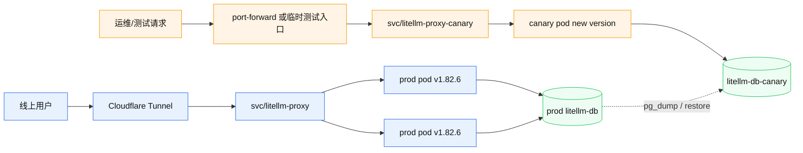
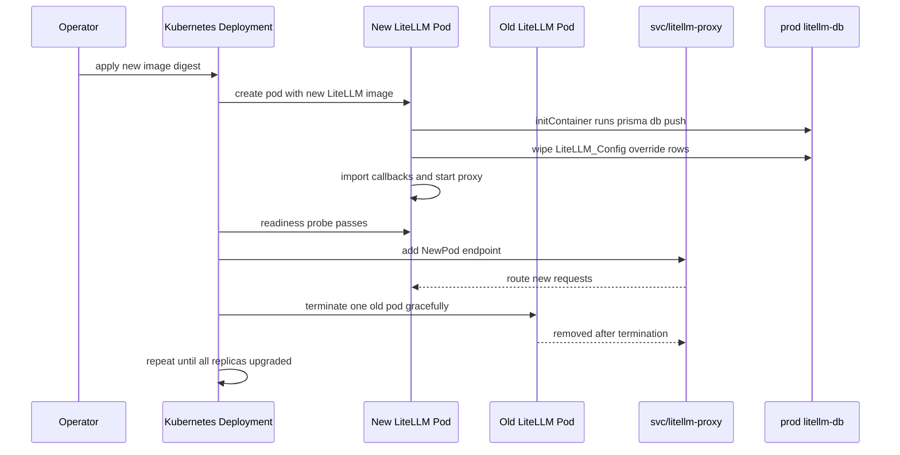
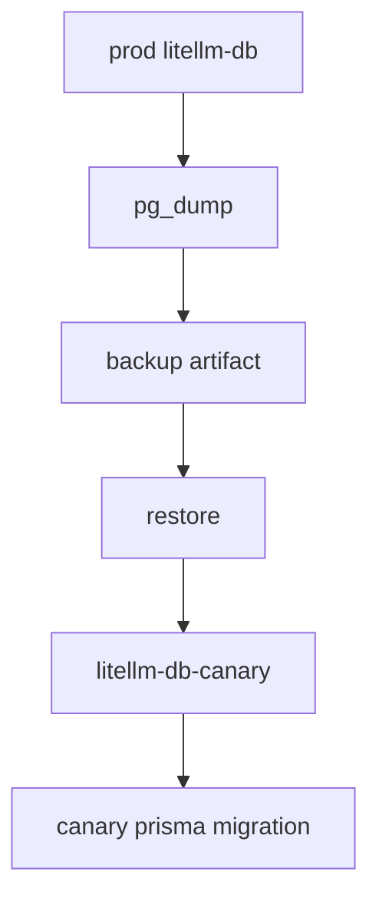
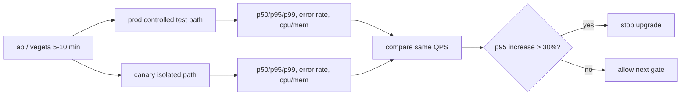
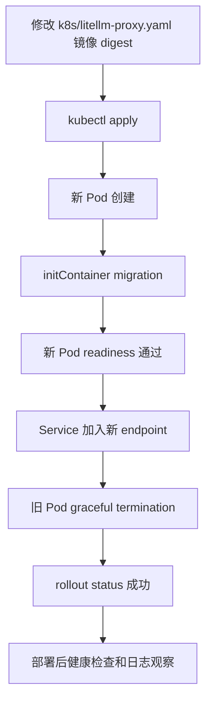

# LiteLLM 安全升级与隔离 Canary 方案

## 目标

在将线上 LiteLLM 从当前旧版本升级到新版本时，做到：

- 线上用户无感：正式入口 `https://litellm.carher.net` 不被测试环境接管。
- 可灰度验证：新版镜像先在隔离环境启动和压测。
- 可回滚：应用镜像可快速回滚，数据库变更有备份兜底。
- 最低变更：升级阶段只替换 LiteLLM 镜像，不同时改模型路由、fallback、callback 逻辑。

## 核心原则

1. Canary 第一阶段不是线上流量灰度，而是隔离测试环境。
2. Canary 不接正式 Service，不会被 `svc/litellm-proxy` 选中。
3. Canary 不连接生产 LiteLLM DB，避免新版 Prisma migration 影响线上。
4. 正式升级前必须验证 DB migration 是否为 additive-only。
5. 正式环境只通过 Deployment rolling update 切换，禁止手动删除正在服务的 Pod。
6. Canary 必须包含稳态压测，不只做功能冒烟。
7. 正式升级必须有数字化 SLO；新 Pod 超过 5 分钟未 Ready 即自动回滚。
8. Readiness 通过不等于业务可用；必须额外跑真实 provider smoke test。
9. 每个 gate 必须记录确认人和时间，不能只留下 `[ ]` 勾选。

## 当前线上基础

线上 `litellm-proxy` 当前已经具备用户无感滚动升级的基础：

- `replicas: 2`
- `strategy.type: RollingUpdate`
- `maxUnavailable: 0`
- `maxSurge: 1`
- readiness/liveness probe 已配置
- `terminationGracePeriodSeconds: 600`

这意味着正式升级时，K8s 会先启动新版 Pod，待新版 Pod Ready 后再逐步移除旧 Pod，Service 不应出现无可用 endpoint 的窗口。

注意：`terminationGracePeriodSeconds: 600` 对长流式请求友好，但也有副作用。若新版有 bug、旧 Pod Terminating 又拖满 10 分钟，rollout 期间可能积压长连接。升级期间必须监测 old pod in-flight 请求数、SSE 长连接、Pod `Terminating` 时长；若旧 Pod 已从 Service endpoints 移除且卡住超过 300 秒，可以由当班 owner 执行受控清理：

```bash
kubectl delete pod <old-pod> -n carher --grace-period=60
```

这不是常规升级动作，只是“旧 Pod 已不接新流量但终止卡死”的例外处置。

## 总体架构

### 隔离 Canary 架构



关键隔离点：

- `litellm-proxy-canary` 使用独立 label，例如 `app=litellm-proxy-canary`。
- 正式 `svc/litellm-proxy` 的 selector 仍然只匹配 `app=litellm-proxy`。
- Canary DB 来自生产 DB 备份恢复，不是生产 DB 本体。
- Canary 入口只允许 port-forward、内部临时 Service 或测试域名，不挂到正式 `litellm.carher.net`。

### 正式滚动升级架构



正式升级只在以下条件满足后执行：

- Canary 使用 clone DB 启动成功。
- callback boot log 正常。
- runtime callbacks 和 fallbacks 数量符合预期。
- 关键接口测试通过。
- Canary 与 prod 同 QPS 压测下 p95 latency 上涨不超过 30%。
- migration 在 clone DB 上没有发现 destructive change。
- 生产 DB 已完成备份。
- 回滚命令链已在 canary 环境演练成功。

## 阶段设计

### 阶段 0：升级前冻结范围

本次升级只允许变更：

- LiteLLM 镜像 tag/digest。
- 如需符合集群规范，将镜像来源从公网 `ghcr.io` 切到 ACR VPC digest。

本次升级不同时变更：

- `model_list`
- `router_settings.fallbacks`
- custom callbacks 代码
- key/budget 配置
- DB 数据修复脚本

这样可以把风险边界收敛到“新版 LiteLLM 与现有配置/DB/callback 是否兼容”。

ConfigMap schema 早期红灯：

- Canary 必须挂载与生产等价的 LiteLLM 配置内容原样启动。
- 新版启动日志中只要出现 config schema、unknown field、deprecated field、model config parse、callback import 相关 warning/error，即视为早期红灯。
- 早期红灯命中后停止升级评审，不进入正式滚动阶段；先确认新版 LiteLLM 对配置结构的兼容性。

### 阶段 1：准备新版镜像

流程：

1. 在构建节点拉取目标 LiteLLM 镜像。
2. 校验镜像签名或至少记录 upstream tag/digest。
3. 推送到 ACR VPC 仓库。
4. 在 YAML 中使用 ACR VPC digest，而不是公网 `ghcr.io` tag。

注意：正式 Deployment 中主容器和两个 initContainer 必须使用同一个 LiteLLM 镜像 digest：

- `prisma-migrate`
- `wipe-db-config-rows`
- `litellm`

#### `wipe-db-config-rows` 说明与 dry-run

`wipe-db-config-rows` 是当前线上防止 DB 配置覆盖 YAML 的安全阀。LiteLLM 启动时 DB 中的 `LiteLLM_Config` 优先级高于 YAML；如果历史上有人通过 Admin UI 或脚本写入过配置行，可能导致 YAML 中的 callbacks、fallbacks、`store_model_in_db` 等不生效。

当前预期行为：

- 操作表：`LiteLLM_Config`
- 清理行：`param_name IN ('router_settings', 'litellm_settings', 'general_settings')`
- 目标：保证启动时以 `k8s/litellm-proxy.yaml` 为唯一配置源

升级风险：

- 新版 LiteLLM 如果新增或改名配置字段，旧版 DB override 可能被 `wipe-db-config-rows` 默默清掉。
- 如果新版开始依赖新的 DB 配置行，而 YAML 没同步表达，会出现“启动能过、运行配置缺失”的隐性风险。

Canary 必须先 dry-run：

```sql
SELECT param_name, param_value
FROM "LiteLLM_Config"
WHERE param_name IN ('router_settings', 'litellm_settings', 'general_settings');
```

dry-run 要求：

- 在 prod DB 和 clone DB 上分别记录上述查询结果。
- 在 canary 上跑完新版 initContainer 后，再查 clone DB，确认只清理预期 3 类配置行。
- 如果新版出现新的 `LiteLLM_Config.param_name`，必须由 DB migration review owner 判断是否需要纳入 YAML source-of-truth 或保留在 DB，不能默认清理。
- `wipe-db-config-rows` 日志必须纳入 canary 验证证据。

### 阶段 2：创建 clone DB

从生产 LiteLLM DB 做备份并恢复到 canary DB。



要求：

- `litellm-db-canary` 与生产 DB 网络隔离或至少使用不同 Service/数据库名。
- Canary 的 `DATABASE_URL` 必须指向 clone DB。
- 禁止 canary 使用生产 `DATABASE_URL`。
- `pg_restore --list` 必须能列出全部预期核心表，例如 `LiteLLM_SpendLogs`、`LiteLLM_VerificationToken`、`LiteLLM_Config`。
- clone DB 恢复后，核心表记录数与生产 DB 对比偏差必须小于 `0.1%`。偏差超过阈值时，不能用该 clone DB 判定 migration 安全。

### 阶段 3：启动隔离 Canary

创建独立资源：

- `deploy/litellm-proxy-canary`
- `svc/litellm-proxy-canary`
- `secret/litellm-secrets-canary` 或等效注入方式
- 必要时复制 `litellm-config-canary`，避免误改正式 ConfigMap

Canary Deployment 的 label 必须与正式 Service 隔离：

```yaml
metadata:
  name: litellm-proxy-canary
spec:
  selector:
    matchLabels:
      app: litellm-proxy-canary
  template:
    metadata:
      labels:
        app: litellm-proxy-canary
```

正式 Service 只能继续选择：

```yaml
selector:
  app: litellm-proxy
```

### 阶段 4：Canary 验证

Canary 验证分三层：启动检查、功能冒烟、稳态压测。

启动检查必须至少验证以下内容：

- Pod `1/1 Running`
- `prisma-migrate` initContainer 成功
- `wipe-db-config-rows` initContainer 成功
- `pip show litellm` 显示目标版本
- boot log 中 custom callbacks import 正常
- runtime callbacks 符合预期：当前基线为 `6` 个
- runtime fallbacks 符合预期：当前基线为 `13` 条
- `/health/readiness` 正常
- 生产等价 ConfigMap 原样加载，无 config schema warning/error
- `wipe-db-config-rows` dry-run 和执行日志均符合预期

当前 callback 基线：

- `opus_47_fix.thinking_schema_fix`
- `embedding_sanitize.embedding_sanitize`
- `force_stream.force_stream`
- `streaming_bridge.streaming_bridge`
- `null_byte_sanitize.null_byte_sanitize`
- `anthropic_passthrough_pingfix.anthropic_passthrough_pingfix`

如果 callbacks 数量不是 `6`，或 fallbacks 数量不是 `13`，默认判定 canary 失败；除非本次升级评审显式更新基线并说明原因。

功能冒烟必须至少验证以下内容：

- `/v1/messages` 测试请求正常
- `/v1/chat/completions` 测试请求正常
- embedding 测试请求正常
- 真实 provider 可达：至少验证 Anthropic-native 或 OpenRouter 其中一路真实上游成功返回
- rollout 后正式新 Pod 加入 Service 后，也必须立刻跑同一套真实 provider smoke test，不能只看 `/health/readiness`
- 最近 10-20 分钟无明显 Prisma error、callback import error、5xx 风暴

稳态压测必须至少验证以下内容：

- 使用 `ab`、`vegeta` 或等价工具，在 canary 上跑 5-10 分钟稳态压测。
- 使用同一批测试 payload、同一 QPS，对 prod 和 canary 分别压测，避免把请求差异误判为版本差异。
- 记录 p50、p95、p99 latency、错误率、CPU、memory、Pod restart、5xx 数量。
- 断崖阈值：同 QPS 下 canary p95 latency 相比 prod 上涨 `> 30%`，或 5xx/error rate 明显高于 prod，即叫停升级。
- 压测只打隔离 canary 入口；prod 对比压测必须使用低风险测试 key 和受控 QPS，不能冲击真实用户容量。
- 当前正式环境只有 `replicas: 2`，滚动过程中最多形成约 50% 新版覆盖率，真实流量采样有限；因此 canary 压测需要覆盖高并发场景。
- 如果要靠正式流量扩大采样面，可以在升级窗口临时扩到 `replicas: 3`、`maxSurge: 2`，但这属于额外变更，必须单独确认资源容量和回滚路径。最低方案默认用 canary 高并发压测补位。



### 阶段 5：判断 DB migration 风险

这是能否“用户无感正式升级”的关键 gate。

Owner：

- 必须指定一名 DB migration review owner。
- owner 负责对 canary migration 结果签字，不能由执行升级的人默认代判。

允许进入无感滚动的情况：

- migration 只新增表、列、索引或兼容性字段。
- 旧版本 LiteLLM 在新 schema 下仍可继续短暂服务。
- 新旧 Pod 共存期间不会读写冲突。

不允许直接无感滚动的情况：

- 删除列或删除表。
- 修改字段类型。
- 增加旧版本写入无法满足的 NOT NULL 约束。
- 修改唯一索引导致旧数据或旧写入失败。
- 新增或修改 FK 约束导致旧版本写入路径可能失败。
- canary migration 后旧版本无法连接或写 SpendLogs。

Destructive migration checklist：

- [ ] `DROP TABLE` / `DROP COLUMN`
- [ ] `ALTER TYPE` / 字段类型变更
- [ ] 新增无默认值的 `NOT NULL`
- [ ] `UNIQUE` 索引新增或语义变更
- [ ] FK 新增、删除或约束范围变化
- [ ] enum 值删除或重命名
- [ ] 表/列重命名
- [ ] 旧版本 LiteLLM 对新 schema 写入 `SpendLogs` 失败

任一项命中即视为 destructive，不进入无感滚动升级路径。

如果发现 destructive migration，需要改成维护窗口、双写兼容方案或先做 DB forward migration 评审，不能按本方案直接升级。

### 阶段 6：回滚链演练

命令列出来不等于能用。Canary 全部验证通过后，正式升级前必须在 canary Deployment 上演练一次回滚链。

演练要求：

- 先让 `deploy/litellm-proxy-canary` 从旧镜像升级到新镜像。
- 确认 canary 新 Pod Ready。
- 执行 `kubectl rollout undo deploy/litellm-proxy-canary -n carher`。
- 确认 canary 回到旧镜像且 Pod Ready。
- 记录演练耗时和失败点。
- 验证旧版 digest 仍在 ACR VPC 可拉取，避免真正回滚时发现镜像被 retention policy 清理。

只有回滚演练成功，才能进入正式 Deployment 升级。

### 阶段 7：正式滚动升级

正式升级只替换镜像 digest。



执行纪律：

- 禁止手动 `kubectl delete pod`。
- 使用 `kubectl rollout status` 等待完成。
- 若新 Pod 未 Ready，不继续扩大影响。
- 新 Pod 从创建到 Ready 的 SLO 是 5 分钟。
- 超过 5 分钟仍未 Ready，自动执行 `kubectl rollout undo deploy/litellm-proxy -n carher`，不等待人工继续判断。
- 若 rollout 卡住，优先暂停或回滚，不手动干预正在服务的旧 Pod。
- rollout 期间同时监测 Cloudflare Tunnel 连接状态和外部入口 502/503/524。
- 新 Pod Ready 后必须立即执行真实 provider smoke test；若 smoke test 失败，即使 readiness 正常也回滚。
- 观察 old pod in-flight 请求数和 Terminating 时长；old pod 已移出 endpoints 且 Terminating 超过 300 秒时，允许当班 owner 使用 `--grace-period=60` 受控清理。

自动回滚参考命令：

```bash
kubectl apply -f k8s/litellm-proxy.yaml
kubectl rollout status deploy/litellm-proxy -n carher --timeout=300s \
  || kubectl rollout undo deploy/litellm-proxy -n carher
```

### 阶段 8：Cloudflare Tunnel 观察

正式入口路径是 `https://litellm.carher.net` -> Cloudflare Tunnel -> `svc/litellm-proxy:4000`。升级期间必须把 Cloudflare Tunnel 当成独立风险点观察。

需要确认：

- Tunnel 对后端 Service endpoint 变化的行为：连接复用、断开重连、重试策略。
- rollout 期间是否出现 Tunnel connection churn。
- 外部入口是否出现 502、503、524 或明显 tail latency 抬升。
- 长连接/SSE 请求在旧 Pod graceful termination 期间是否被正常处理。

观察项：

- cloudflared 日志中的 reconnect、connection lost、stream error。
- `https://litellm.carher.net/health` 的状态码和耗时。
- LiteLLM Pod termination 日志和 readiness 变化。
- Service endpoints 从旧 Pod 到新 Pod 的切换过程。

### 阶段 9：分档观察窗口

升级后观察不能只看 30 分钟。按三档验收：

- 升级后 10 分钟：确认 rollout 完成、Service endpoints 正常、外部 `/health` 无 502/503、真实 provider smoke test 通过。
- 升级后 1 小时：确认有足够真实流量采样，p95/p99、5xx、524、callback error、Prisma error 没有异常抬升。
- 升级后 24 小时：覆盖夜间/晨间流量峰谷，确认 SpendLogs 写入、长流式请求、embedding 路径、Cloudflare Tunnel 均稳定。

24 小时观察完成前，旧版镜像 digest 和 DB 备份不得删除。

## 回滚策略

### 应用层回滚

如果正式升级后发现应用行为异常，但 DB schema 仍兼容旧版本：

```bash
kubectl rollout undo deploy/litellm-proxy -n carher
kubectl rollout status deploy/litellm-proxy -n carher --timeout=300s
```

或者将 YAML 中镜像 digest 改回旧 digest 后重新 apply。

### DB 层回滚

如果新版 migration 对 DB 造成旧版本不兼容，仅回滚镜像可能不够，需要使用升级前备份恢复或做 forward-fix。

因此正式升级前必须准备：

- 生产 DB `pg_dump` 备份。
- `pg_restore --list` 校验备份对象清单。
- clone DB 恢复后校验核心表记录数，偏差必须小于 `0.1%`。
- 恢复演练或至少在 clone DB 验证备份可用。

## 风险与防护

| 风险 | 影响 | 防护 |
|---|---|---|
| Canary 误连生产 DB | 0 流量也可能修改生产 schema | Canary 使用独立 `DATABASE_URL` 指向 clone DB |
| Canary 被正式 Service 选中 | 真实用户流量进入测试 Pod | Canary 使用 `app=litellm-proxy-canary`，正式 Service selector 不变 |
| 新版 Prisma migration 破坏旧版本兼容 | 新旧 Pod 共存期间线上异常 | clone DB 先跑 migration，并评估 additive-only |
| 只回滚镜像但 DB 已不兼容 | 回滚后仍然故障 | 升级前备份，destructive migration 不进入无感升级流程 |
| 自定义 callback 与新版 LiteLLM 内部结构不兼容 | 流式、计费、embedding 等路径异常 | canary 验证 callback boot log 和三类真实请求 |
| 新版功能正常但性能断崖 | 用户侧长尾延迟或超时 | canary 与 prod 同 QPS 压测，p95 上涨 >30% 即叫停 |
| ConfigMap 结构被新版隐式拒绝 | 启动后配置缺失或路由异常 | canary 挂生产等价 ConfigMap 原样启动，schema warning/error 即红灯 |
| Cloudflare Tunnel 在 endpoint 切换时抖动 | 外部入口 502/503/524 或 SSE 中断 | rollout 期间监控 cloudflared churn、外部 health 和长连接表现 |
| 回滚命令首次在事故中使用 | 回滚耗时变长、操作失误 | canary 通过后先演练 `rollout undo` |
| 健康检查脚本预期过旧 | 误判通过或失败 | 升级前明确当前验证标准，必要时更新脚本 |
| 公网镜像拉取慢或失败 | rollout 卡住 | 新镜像预先推到 ACR VPC，并使用 digest |
| ACR VPC 旧 digest 被 retention policy 清理 | 需要回滚时旧镜像拉取失败 | 回滚演练时验证旧 digest 可拉取，24 小时观察完成前禁止清理 |
| Readiness 通过但真实上游不可达 | 新 Pod 接流量后请求 5xx | 新 Pod Ready 后跑真实 provider smoke test，失败即回滚 |
| `wipe-db-config-rows` 清掉新版需要的 DB 配置 | 启动后配置缺失或 fallback/callback 异常 | canary dry-run 比对 `LiteLLM_Config`，新 param_name 必须 review |

## 验收 Checklist

每个 checklist 项都必须记录 `by`、`at`、`evidence`。不得只勾选 `[ ]`。执行记录建议同步到飞书文档或变更单，并 @mention 对应 owner。

执行记录模板：

| Gate | Result | by | at | Evidence |
|---|---|---|---|---|
| 示例：canary p95 latency <= prod * 1.3 | pass/fail | name | YYYY-MM-DD HH:mm | vegeta report link / log path |

### Canary 前

- [ ] 目标 LiteLLM 版本和镜像 digest 已确认。
- [ ] 新镜像已推到 ACR VPC。
- [ ] 生产 DB 备份完成。
- [ ] `pg_restore --list` 已列出全部预期核心表。
- [ ] clone DB 创建完成。
- [ ] clone DB 核心表记录数与 prod 偏差 `< 0.1%`。
- [ ] Canary `DATABASE_URL` 指向 clone DB。
- [ ] Canary label 不匹配正式 Service。

### Canary 验证

- [ ] canary Pod Ready。
- [ ] Prisma migration 成功。
- [ ] callbacks import 正常。
- [ ] runtime callbacks = `6`，且名称与当前 callback 基线一致。
- [ ] runtime fallbacks = `13`。
- [ ] 生产等价 ConfigMap 原样加载，无 schema warning/error。
- [ ] `wipe-db-config-rows` dry-run 和执行日志符合预期。
- [ ] `/v1/messages` 测试通过。
- [ ] `/v1/chat/completions` 测试通过。
- [ ] embedding 测试通过。
- [ ] 至少一路真实 provider smoke test 通过。
- [ ] canary 与 prod 同 QPS 稳态压测 5-10 分钟完成。
- [ ] canary p95 latency 相比 prod 上涨 `<= 30%`。
- [ ] 日志无明显 Prisma/callback/5xx 异常。
- [ ] DB migration review owner 已签字。
- [ ] destructive migration checklist 全部未命中。
- [ ] migration 被确认可兼容滚动升级。

### 正式升级前

- [ ] YAML 只改镜像 digest。
- [ ] initContainer 和主容器镜像 digest 一致。
- [ ] `replicas=2`。
- [ ] `maxUnavailable=0`。
- [ ] `maxSurge=1`。
- [ ] 旧版 digest 已验证在 ACR VPC 可拉取。
- [ ] canary 环境已演练 `rollout undo` 成功。
- [ ] 正式 `rollout status --timeout=300s || rollout undo` 命令已准备。
- [ ] Cloudflare Tunnel 观察项已准备。
- [ ] 观察窗口和负责人已明确。

### 正式升级后

- [ ] rollout 成功。
- [ ] 两个正式 Pod Ready。
- [ ] Service endpoints 数量正常。
- [ ] 外部 `/health` 非 502/503。
- [ ] 新 Pod 真实 provider smoke test 通过。
- [ ] Cloudflare Tunnel 无异常 connection churn。
- [ ] runtime callbacks/fallbacks 正常。
- [ ] 升级后 10 分钟基础观察通过。
- [ ] 升级后 1 小时流量采样观察通过。
- [ ] 升级后 24 小时峰谷观察通过。
- [ ] 用户侧关键路径无新增 524/5xx/长时间卡死。

## 最小执行策略总结

最安全的最低限度策略是：

1. 新版 LiteLLM 镜像先进入 ACR VPC。
2. 用生产 DB 备份恢复 clone DB。
3. 启动隔离 canary，连接 clone DB，不接正式流量。
4. 在 canary 上验证 migration、`wipe-db-config-rows` dry-run、callbacks、三类请求路径、真实 provider smoke、ConfigMap schema 和 5-10 分钟稳态压测。
5. 指定 DB migration owner，确认 destructive checklist 全部未命中。
6. 在 canary 上演练回滚链，并验证旧版 ACR VPC digest 可拉取。
7. 确认 migration 不破坏旧版本兼容后，只替换正式 Deployment 镜像 digest。
8. 依赖 K8s rolling update 完成正式升级，新 Pod 5 分钟未 Ready 或真实 provider smoke 失败自动回滚。
9. rollout 期间同步观察 old pod in-flight、Cloudflare Tunnel 和外部入口。
10. 按 10 分钟、1 小时、24 小时三档观察。
11. 异常时先应用层回滚；如 DB 不兼容，使用备份恢复或 forward-fix。

这套方案的核心不是“让少量真实用户先试”，而是先把新版镜像和 DB migration 的不确定性隔离在 clone 环境里。只有在确认不会影响旧版本和生产 DB 后，才进入正式滚动升级。
