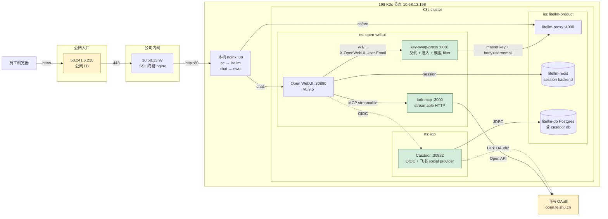
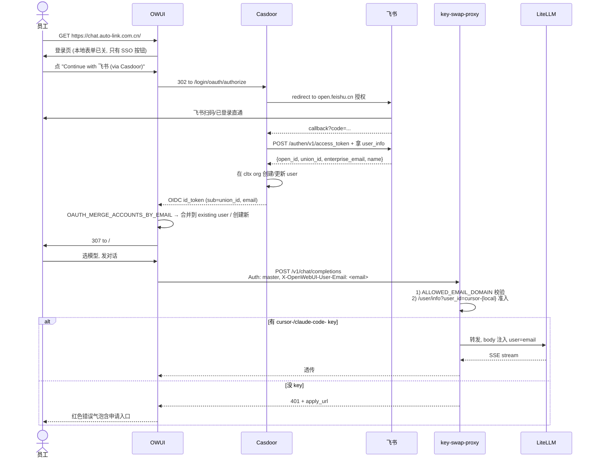

# Open WebUI 内网建设手册

> 2026-05-22 ~ 2026-05-23 建设。198 K3s 集群 (AIYJY-litellm) 上跑的内部 ChatGPT 风格 Web UI，
> 接入 LiteLLM 全模型池，飞书 SSO 统一登录，未来接 lark-mcp 让大模型直接读飞书文档。

---

## 1. 背景

公司内部已有 **198 LiteLLM Pro** (`litellm-product`) 跑全模型池 (claude-code / chatgpt-pro / cursor / gemini / glm / minimax)，但只服务**程序客户端** (VS Code / Cursor / Codex CLI / her bot)，**没有人类友好的浏览器入口**。需求是：

1. 给员工一个 ChatGPT 风格 web 界面
2. 走飞书 SSO 登录（**900 人量级，必须 SSO**）
3. 每个人 LiteLLM 消费按个人归类（报表可见）
4. 禁 Claude 系列（成本控制，跟 198 prod cursor-* key 对齐）
5. 利用现有 LiteLLM key 申请流程，**不引入第二套发 key 系统**

---

## 2. 关键决策表（也是踩过的坑总结）

| 决策点 | 选型 | 否决路径 + 原因 |
|--------|------|----------------|
| **OWUI 路径形态** | `chat.auto-link.com.cn/` (独立子域) | ❌ `cc.auto-link.com.cn/open` 子路径: OWUI SvelteKit 硬编码 `/static/` `/_app/` 绝对路径, 官方 WONTFIX |
| **IdP** | Casdoor + 内置 Lark provider | ❌ Keycloak + `tedgxt/keycloak-service-social-lark`: 插件目标 Keycloak 8.0.1 (2019), 跑不了现代 25/26 |
| **Casdoor 后端 DB** | 复用 `litellm-db` postgres (新 db `casdoor`) | ❌ SQLite: Casdoor v2.45.0 镜像没编进 `sqlite3` driver, panic `unknown driver "sqlite3"` |
| **Casdoor app 关系** | 复用 SSO app `cli_a9278e26f138dbd3` 给 lark-mcp 一起用 | (用户选择, 关注点未隔离但操作简单) |
| **Casdoor 用户落 organization** | 新建 `cltx` org, 不能用 `built-in` | ❌ built-in 默认禁止新建用户 (Casdoor 自身管理 org) |
| **个人 key 注入方式** | master key + body 注入 `user=<email>` → SpendLogs.end_user | ❌ 反查 raw user key 转发: LiteLLM 存 hash 不存 raw, `/key/regenerate` 是 Enterprise 付费功能 |
| **没 key 用户处置** | 反代 401 + apply_url 提示，不主动建 key | (用户决定, 利用现有飞书审批入口) |
| **域名白名单** | 反代加 `ALLOWED_EMAIL_DOMAIN=auto-link.com.cn` | OWUI 原生无 `OAUTH_ALLOWED_DOMAINS`, 在反代统一拦最干净 |
| **OWUI session backend** | Redis (`ENABLE_STAR_SESSIONS_MIDDLEWARE=true`) | ❌ 默认 cookie-based: SessionMiddleware 把 token 序列化到 cookie, 边界 nginx buffer 撑不住 |
| **HTTPS 终结** | 公司边界 nginx (10.68.13.97) → 198:80 (cleartext) | 198 nginx 不动 :443, 复用现有公司证书 (节省申请) |
| **lark MCP 部署** | `@larksuiteoapi/lark-mcp mcp -m streamable -p 3000`, K8s Deployment | OWUI v0.6.31+ 原生支持 streamable HTTP, 比 stdio+mcpo 更现代 |

---

## 3. 端到端架构



**新建组件 (绿色)**：Casdoor、key-swap-proxy、lark-mcp。其余复用既有基础设施。

---

## 4. 关键流程

### 4.1 首次用户登录



### 4.2 SpendLogs 按人归类（核心机制）

LiteLLM 收到带 `body.user=<email>` 的请求 → 把 `<email>` 写入 `LiteLLM_SpendLogs.end_user` 列。

报表查询：
```sql
SELECT end_user, model, SUM(spend)::numeric(10,4) AS spend
FROM "LiteLLM_SpendLogs"
WHERE "startTime" > NOW() - INTERVAL '30 days'
  AND end_user LIKE '%@%'
  AND api_key = 'litellm_proxy_master_key'  -- 反代用 master key
GROUP BY 1,2 ORDER BY spend DESC;
```

---

## 5. K8s 拓扑

| Namespace | Pod | 镜像 | 端口 | 持久化 |
|-----------|-----|------|------|--------|
| `idp` | casdoor | `127.0.0.1:5000/casdoor:v2.45.0` | NodePort 30882 → 8000 | 复用 `litellm-db` (db=casdoor) |
| `open-webui` | open-webui | `127.0.0.1:5000/open-webui:v0.9.5` | NodePort 30880 → 8080 | PVC `open-webui-data` 10Gi |
| `open-webui` | key-swap-proxy (2 副本) | `127.0.0.1:5000/key-swap-proxy:v0.2.0` | ClusterIP 8081 | 无 |
| `open-webui` | lark-mcp (1 副本) | `127.0.0.1:5000/lark-mcp:v0.1.0` | ClusterIP 3000 | 无 |
| `litellm-product` | litellm-redis-0 | (复用) | ClusterIP 6379 | StatefulSet PVC |
| `litellm-product` | litellm-db-0 | (复用) | ClusterIP 5432 | StatefulSet PVC |

---

## 6. 关键文件

### 198 节点 (访问: `scripts/jms ssh AIYJY-litellm`)

```
/root/open-webui-manifests/
├── open-webui.yaml              # OWUI Deployment + Service + PVC + Secret
├── key-swap-proxy.yaml          # 反代 Deployment + Service + ConfigMap
├── README.md                     # 198 节点本地运维笔记
└── .secrets.env                  # OAUTH client secret / master key 备份 (chmod 600)

/root/key-swap-proxy/
├── main.py                       # FastAPI 反代源码 (~250 行)
├── Dockerfile                    # python:3.12-slim + 阿里云 pip mirror
└── requirements.txt              # fastapi / uvicorn / httpx

/root/casdoor-manifests/
└── casdoor.yaml                  # Casdoor Deployment + ConfigMap + Service + Namespace + Secret

/root/keycloak-manifests/.secrets.env  # 历史命名遗留 (实际是 casdoor 凭据), 含飞书 app_id/app_secret

/root/lark-mcp/
├── Dockerfile                    # node:20-slim + 阿里云 mirror + npm install
└── (镜像构建目录)

/root/lark-mcp-manifests/
└── lark-mcp.yaml                 # MCP server Deployment + ClusterIP

/etc/nginx/sites-enabled/
├── cc.auto-link.com.cn.conf      # LiteLLM 三环境反代 (历史已有)
└── chat.auto-link.com.cn.conf    # OWUI 反代 (新增, 含 buffer 256k 兼容大 cookie)
```

### Repo 内文档/Skill

```
docs/openwebui-litellm-perkey-binding.md       # 本文档
.cursor/skills/owui-ops/SKILL.md                # OWUI 综合运维
.cursor/skills/owui-casdoor-sso/SKILL.md        # Casdoor 飞书 SSO 管理
.cursor/skills/owui-key-swap-proxy/SKILL.md     # 反代代码维护
.cursor/skills/owui-lark-mcp/SKILL.md           # lark MCP 部署管理
```

---

## 7. 重要环境变量速查

### OWUI Deployment env

| Env | 值 | 作用 |
|-----|---|------|
| `OPENAI_API_BASE_URLS` | `http://key-swap-proxy.open-webui.svc.cluster.local:8081` | 所有上游调用走反代 |
| `OPENAI_API_KEY` | `<LITELLM_MASTER_KEY>` | 反代实际不读用户传的, 自己用 secret 注入 |
| `ENABLE_FORWARD_USER_INFO_HEADERS` | `true` | 把 `X-OpenWebUI-User-Email` 注入到反代请求头 |
| `ENABLE_OLLAMA_API` | `false` | 关 Ollama 本地模型 |
| `WEBUI_URL` | `https://chat.auto-link.com.cn` | OAuth callback 基地址 |
| `OPENID_PROVIDER_URL` | `http://10.68.13.198:30882/.well-known/openid-configuration` | Casdoor OIDC discovery |
| `OAUTH_CLIENT_ID` / `OAUTH_CLIENT_SECRET` | (Casdoor application `open-webui` 凭据) | OIDC 凭据 |
| `OAUTH_PROVIDER_NAME` | `飞书 (via Casdoor)` | 登录按钮显示文案 |
| `OAUTH_MERGE_ACCOUNTS_BY_EMAIL` | `true` | 按 email 合并到现有 user |
| `ENABLE_OAUTH_SIGNUP` | `true` | 新 SSO 用户自动建账号 |
| `ENABLE_SIGNUP` | `false` | 关本地注册 |
| `ENABLE_LOGIN_FORM` | `false` | 隐藏密码框, 强制 SSO |
| `REDIS_URL` | `redis://litellm-redis.litellm-product.svc.cluster.local:6379/1` | OWUI session backend |
| `ENABLE_STAR_SESSIONS_MIDDLEWARE` | `true` | **关键**: 触发 OWUI 用 Redis store 而非 cookie 序列化 (缩 owui-session cookie 体积) |
| `ENABLE_OAUTH_ID_TOKEN_COOKIE` | **`false`** | **🔴 必须关!** 不关的话 OAuth callback Set-Cookie 含完整 OIDC id_token (2-6KB), 触发公司 LB nginx `large_client_header_buffers` 默认 4×8k 撑不住 → 浏览器看 502。这是 OAuth 502 的**真正根因**, 不是 owui-session cookie 或 buffer 配置 |
| `ENABLE_WEBSOCKET_SUPPORT` | **`false`** | **🔴 必须关!** OWUI Socket.IO 默认走 WebSocket upgrade, 公司 LB 不支持 (吃掉 Sec-WebSocket-Key header), 流式 token 推不到浏览器, **症状: 发消息页面不显示但刷新后消息已到**。设 false 后 Socket.IO 走 HTTP long-polling, 公司 LB 当普通 HTTP 处理通过 |
| `RAG_OPENAI_API_BASE_URL` | `http://litellm-proxy.litellm-product.svc.cluster.local:4000` | RAG embedding 直连 LiteLLM (不经反代) |

### key-swap-proxy ConfigMap env

| Env | 值 | 作用 |
|-----|---|------|
| `LITELLM_URL` | `http://litellm-proxy.litellm-product.svc.cluster.local:4000` | 转发目标 |
| `LITELLM_MASTER_KEY` | (Secret 复用 OPENAI_API_KEY) | 实际 Authorization Bearer |
| `APPLY_URL` | `https://t83dfrspj4.feishu.cn/wiki/...` | 没 key 用户提示链接 |
| `ALLOWED_EMAIL_DOMAIN` | `auto-link.com.cn` | 邮箱域名白名单 |
| `CACHE_TTL` | `600` | 准入闸门 cache 时长 |

### lark-mcp Deployment args

```
mcp --mode streamable --host 0.0.0.0 --port 3000
    --app-id $(FEISHU_APP_ID) --app-secret $(FEISHU_APP_SECRET)
    --tools preset.default,preset.doc.default,preset.base.default,preset.calendar.default,preset.im.default
    --language zh
```

`NODE_OPTIONS=--max-old-space-size=3000` 给 V8 heap 3GB（默认 1.4GB 加载所有 tools 会 OOM）。

---

## 8. 已知坑 / Lessons Learned

1. **OWUI 不支持子路径**: SvelteKit 硬编码 `/static/` 等根路径, 必须独立子域
2. **Casdoor built-in org 禁止建用户**: 必须新建 cltx org 安置飞书用户
3. **Casdoor 镜像没 sqlite driver**: 必须用 postgres backend
4. **LiteLLM raw key 不可反查**: DB 是 hash, `/key/regenerate` Enterprise 付费
5. **OWUI cookie 默认巨大**: 必须 `REDIS_URL + ENABLE_STAR_SESSIONS_MIDDLEWARE=true` 才走 Redis store (缩 owui-session)
6.1. **🔴 流式 token 不显示 (发消息要刷新才看到) = WebSocket 被公司 LB 拦** (2026-05-24 踩穿):
   - 症状: OWUI 发消息, **页面卡在"等待回复"但 LiteLLM SpendLogs 已扣费**, 刷新页面消息显示
   - 根因: OWUI Socket.IO 默认走 WebSocket transport, 公司 LB (10.68.13.97 那台 nginx) 不识别 WS upgrade, 把 `Sec-WebSocket-Key` header 吃掉; OWUI uvicorn 看到 缺 header 的 upgrade request → 返回 400; Socket.IO 客户端不能 fallback (因为 OWUI 源码硬编码 `transports=['websocket']` 当 `ENABLE_WEBSOCKET_SUPPORT=true`)
   - **修法**: `kubectl set env deployment/open-webui ENABLE_WEBSOCKET_SUPPORT=false`, OWUI 改走 HTTP long-polling
   - **诊断**: nginx access log 看 `/ws/socket.io/?...&transport=websocket` 返回 400; 直访 198 nginx 或 OWUI Pod 模拟 WS upgrade 返回 101 (说明 nginx/OWUI 都 OK), 只走完整链路时公司 LB 那一段拦
6. **🔴 OAuth callback 502 真根因 = ENABLE_OAUTH_ID_TOKEN_COOKIE 默认 true** (2026-05-24 踩穿, 钻了 3 个错误方向后才定位):
   - OWUI v0.9.5 callback 成功时设 3 个 cookie: `token` (完整 user JWT) + `oauth_session_id` (小) + `oauth_id_token` (**完整 OIDC id_token, 2-6KB**)
   - `oauth_id_token` 是 legacy 兼容 cookie, 注释明说 "for compatibility with older frontend versions", 新版前端不用
   - 公司 LB nginx 默认 `large_client_header_buffers 4 8k`, 几个大 cookie 加起来 > 8k → LB 拒绝 → 给浏览器 502
   - **诊断陷阱**: 198 nginx access log 显示 OWUI 返回 307 "成功", 但浏览器收到的是上游 LB 改成的 502. fake code 因为 OWUI 不进 success 分支不设大 cookie, **测不出 502**. 必须看 OWUI **真实成功 callback 处理代码**才能定位
   - **修法**: `ENABLE_OAUTH_ID_TOKEN_COOKIE=false`, 一行 env 解决
7. **Lark MCP 默认 OOM**: `keytar` 加载所有 tool preset 时 V8 heap 不够, 必须 `NODE_OPTIONS=--max-old-space-size=3000` + limit 4Gi
8. **lark-mcp 不能用 alpine**: keytar native 编译需 python+g+++libsecret, alpine 太麻烦, 用 debian slim
9. **K8s envFrom Secret 引用要用 `$(VAR)`**: yaml args 数组里写 `$(FEISHU_APP_ID)` 才会替换
10. **K8s pod name 必须小写**: `owui-spkA-1` 报错, 改 `owui-spka1`
11. **K3s containerd 用 docker push 不通**: 必须 push 到 `127.0.0.1:5000` local registry (insecure)
12. **OWUI Redis backend ≠ 关 oauth_id_token cookie**: 两件事都要做, 缺一个 502 仍会出
13. **bash heredoc 变量替换陷阱**: `<<PY` (未引号) 在本地 shell 展开, `<<'PY'` 才保留. `set -a` 后 source 才能让 python `os.environ` 读到
14. **K3s registry mirror 拉 postgres 镜像失败**: dockerhub mirror manifest 损坏, **复用现有 statefulset 镜像** 是绕路
15. **lark-cli `base:record:read` scope 被禁用**: 用户身份申请失败, 走 raw API `bitable/v1/...` + `bitable:app:readonly` 旧 scope 可绕
16. **诊断方法论 — 不要盲信 access log 状态码**: OWUI access log 307 ≠ 浏览器收到 307. 上游 LB 可能改 status code. **判断 502 来源看 `Server:` header 有没有版本号**: 198 nginx 带版本 `nginx/1.18.0 (Ubuntu)`, 公司 LB `server_tokens off` 只显示 `nginx`. 不一致就说明是不同的机器

---

## 9. 当前未完成（Follow-up）

| 编号 | 事项 | 阻塞点 | 优先级 |
|------|------|-------|-------|
| F1 | 飞书 app 扩 scope (docs/wiki/bitable/sheets/drive/im/calendar) | 你去飞书后台审批 | P1, lark MCP 真用必须 |
| F2 | OWUI Admin Panel 配 MCP server URL | 等 F1, 然后 Admin Panel → Settings → External Tools | P1 |
| F3 | nginx 边界 (10.68.13.97) buffer 加大 | 找 IT 或拿 ssh, 不影响主功能但 F12 callback 显示 502 | P2 |
| F4 | 个人 budget 软限制 | 反代加 30 天累计 spend 查询 + deny cache | P2 |
| F5 | Casdoor Lark Syncer 同步飞书全员 | F1 拿到 scope 后, Casdoor UI 配 syncer | P2 |
| F6 | 监控告警 | Prometheus + dashboards (反代 metrics, Casdoor 失败率) | P3 |
| F7 | 公告 + 用户引导文档 | 待主功能完全验证 | P3 |

---

## 10. 相关 Skill

| Skill | 触发场景 |
|------|---------|
| `owui-ops` | OWUI 部署/升级/查日志/env 变更/Redis session/账号合并 |
| `owui-casdoor-sso` | Casdoor 加/改 provider, application, organization, 飞书 SSO 故障 |
| `owui-key-swap-proxy` | 反代代码改/build/rollout, 准入规则调整, 模型 allowlist |
| `owui-lark-mcp` | lark MCP 升级/工具集变更/飞书 scope 申请 |

---

## 11. Sources

- [Open WebUI Docs](https://docs.openwebui.com/)
- [Open WebUI MCP 支持](https://docs.openwebui.com/features/) (v0.6.31+ streamable HTTP)
- [Casdoor Docs - Lark provider](https://casdoor.org/docs/provider/oauth/lark/)
- [larksuite/lark-openapi-mcp](https://github.com/larksuite/lark-openapi-mcp) - 官方飞书 MCP server
