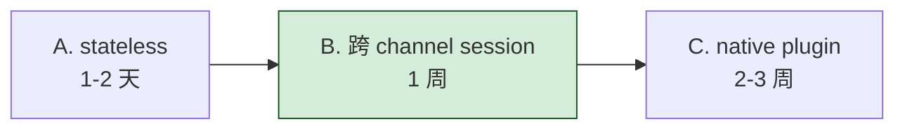
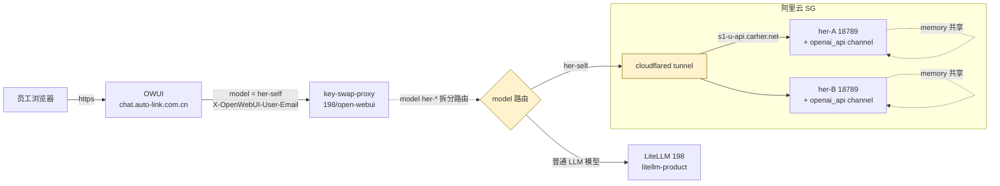
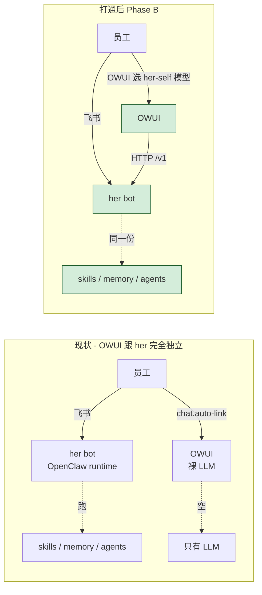

# OWUI ↔ her (OpenClaw) 打通调研

> 2026-05-24。仅为调研, 暂不实施。给后续决策提供事实底盘 + 三个方案权衡 + 推荐路径细节。

---

## 1. 背景与目标

### 现状
- **OWUI** 跑在 198 K3s, 内部 chat 入口 `https://chat.auto-link.com.cn`, 通过 key-swap-proxy 转发到 LiteLLM, 作为**通用 LLM 客户端**用
- **her bot** 跑在阿里云 SG K8s `carher` namespace, **每人独占一个 Pod**, 通过 OpenClaw runtime 服务飞书消息, 含 per-user memory / agents / skills (lark-cli 等)
- 两者目前**完全独立**: OWUI 用户跟 her 用户是同一批人, 但 OWUI 里跟 her 没任何关系, 用 OWUI 等于跑 raw LLM, 失去 her 的 agent 能力 / per-user memory / 已装 skills

### 想要的形态
让员工**在 OWUI 里能跟自己的 her bot 对话**:
- 共享 her 的 system prompt / agent persona
- 复用 her 的 skills (lark-cli, 各种 agent skills)
- (可选) 跟飞书对话**共享 memory** —— OWUI 里讲过的事, 飞书 her 也记得

### 不在本期范围 (但调研要标清楚)
- 不替代飞书入口, 飞书仍是主战场
- 不涉及 her 本身重构, OpenClaw upstream 不动 (如必须动, 走 fork)

---

## 2. 上游 OpenClaw 能力 (这是 carher 的上游, 不是自研)

[OpenClaw](https://github.com/openclaw/openclaw) 是 Peter Steinberger 写的开源 personal AI assistant 框架, **设计就是 multi-channel**: 飞书 / Slack / Discord / iMessage / WhatsApp / WebChat / IRC / ... 都是平等的 channel, 共享同一个 agent runtime + memory。

| 能力 | 状态 | 备注 |
|------|------|------|
| **Multi-channel 设计** | ✅ 原生 | channel 之间平等, 互不依赖 |
| **OpenAI 兼容 `/v1/chat/completions`** | ✅ 内置 (gateway HTTP endpoint) | **默认禁用**, 需 `gateway.http.endpoints.chatCompletions.enabled: true` |
| **SSE streaming** | ✅ | OpenAI 协议标准 |
| **Function calling / tools** | ✅ | 跟 OpenAI 协议一致 |
| **conversation_id** | ❌ | OpenClaw 不用 conversation_id, **用 `body.user` 字段做 session key**: 同一 `user` 字符串持续对话, OpenClaw 保留 context |
| **stateful vs stateless** | 混合 | 不带 `user` 字段 = stateless; 带 `user` = stateful, 自动绑定 session |
| **Multi-channel 共享 memory** | ✅ 可配 | 默认按 `[channel, user_id]` 二维分粒度. 要让 channel=openai_api 跟 channel=feishu 共享, 需把 memory 维度改为单 `user_id` (上游有 guide) |
| **ACP (Agent Communication Protocol)** | ✅ | OpenClaw 跨 channel 通信协议, 文本命令驱动 |
| **认证模式** | gateway `auth.mode=token` | 当前 carher 配 token 模式, 内部 K8s 调用 |

**关键事实**: ⚠️ 部分细节(如 `conversation_id` 是否支持) 来自 Explore agent 整合官方文档的解读, 实施前**必须**实测 (起一个测试 her 实例, curl 真实 endpoint 验证)。

来源:
- https://github.com/openclaw/openclaw
- https://docs.openclaw.ai/gateway/openai-http-api (Explore 推断 URL, 待验证)
- https://docs.openclaw.ai/channels/feishu

---

## 3. CarHer 当前形态 (调研结果)

### 3.1 operator 生成的 openclaw.json

`operator-go/internal/controller/config_gen.go:GenerateOpenclawJSON` (L91-291) 给每个 her 实例生成的配置:

```json
{
  "channels": {
    "feishu": {
      "appId": "<from CRD>",
      "appSecret": "<from secret>",
      "oauthRedirectUri": "https://s1-u<uid>-auth.carher.net/feishu/oauth/callback",
      "botOpenId": "<from CRD>",
      "dm": { "allowFrom": [<per-app open_id>] },
      ...
    }
  },
  "agents": { "defaults": { "model": "...", "models": [...] } },
  "gateway": {
    "port": 18789,
    "mode": "local",
    "auth": { "mode": "token" }
  },
  "plugins": {
    "entries": [
      { "name": "realtime", "port": 18790 }
    ]
  }
}
```

**关键缺失**:
- ❌ 没有 `channels.openai_api` 配置 (单 channel 只有 feishu)
- ❌ 没有 `gateway.http.endpoints.chatCompletions.enabled` 字段
- ❌ memory 维度默认 `[channel, user]`, 不是单 `user` (cross-channel 不共享)

### 3.2 her 实例 K8s Service 端口 (reconciler.go:713-767)

| 端口 | 名字 | 用途 | 当前对外? |
|------|------|------|----------|
| 18789 | gateway | OpenClaw HTTP gateway (含 OpenAI API) | ❌ 仅 ClusterIP |
| 18790 | realtime | OpenClaw realtime (WS) | ❌ 仅 ClusterIP |
| 18891 | oauth | 飞书 OAuth callback handler | ✅ via cloudflared `s1-uN-auth` |
| 8000 | fe | her 自带 web frontend | ✅ via cloudflared `s1-uN-fe` |
| 8080 | ws-proxy | WebSocket proxy | ✅ via cloudflared `s1-uN-proxy` |
| 18795 | a2a | (用途待查) | ❌ |

全是 ClusterIP TCP, 内部 K8s 网络可达 Pod IP。

### 3.3 cloudflared tunnel ingress 命名规则

`backend/cloudflare_ops.py:_build_instance_hostnames` (L121-127):
```
s1-u{uid}-auth.carher.net  → :18891 (oauth)
s1-u{uid}-fe.carher.net    → :8000 (frontend)
s1-u{uid}-proxy.carher.net → :8080 (ws-proxy)
```

220 个 her 实例 = 660 个 cloudflared ingress 子域 (auth + fe + proxy)。**没有 api 子域**, gateway :18789 当前不对外。

### 3.4 carher 已有 LiteLLM Proxy

- 阿里云 SG `carher` namespace, `litellm.carher.net` 公网域名
- 接 wangsu / OpenRouter / 阿里云 chatgpt-pro pool 等 provider
- her bot 默认用 carher LiteLLM 作为 model provider, **每个 her 有自己的 `carher-{uid}` key**

---

## 4. Gap 分析

OWUI 要调 her, 缺三样:

1. **her 实例 gateway HTTP endpoint 不对外**: 18789 只 ClusterIP, OWUI 公网/198 内网都访问不到
2. **OpenClaw OpenAI API 默认禁用**: openclaw.json 没启用 `gateway.http.endpoints.chatCompletions`
3. **多入口 memory 共享**: 默认按 channel 分桶, OWUI 跟飞书 memory 不互通

每条都有对应改动, 见 §6 实施步骤。

---

## 5. 三方案对比



| 方案 | 工作量 | 用户体验 | 风险 | 适用场景 |
|------|--------|---------|------|---------|
| **A. Stateless** | 1-2 天 | OWUI 里跟 her 对话, 但 her 不记得; 每次都从 system prompt 开始 | 低: 不动 memory pipeline, OpenClaw 行为退化为普通 LLM | PoC, 验证全链路可行 |
| **B. 跨 channel session 共享 (推荐, 你选了)** | ~1 周 | OWUI ↔ 飞书 memory 互通; 同一员工跨入口连续上下文 | 中: per-user memory 多入口并发写需 OpenClaw 内部 sync 保证, 上游应有但未验证 | 真正"打通"语义 |
| **C. Native OWUI channel plugin** | 2-3 周 | OWUI 成为 OpenClaw 平等 channel, 体验跟飞书一样 | 高: 要 fork OpenClaw 写 `openclaw-plugin-openwebui` (类似已有 `openclaw-plugin-feishu`); 后续 OpenClaw upstream 升级要同步 | 长期、规模化 |

**用户已选 D (先调研不实施), 但选了 B 作为目标方向**。本文档以 B 为推荐路径详写实施步骤, A/C 作为对比。

---

## 6. 推荐方案 B 详细实施步骤 (~1 周)

### 6.1 端到端架构 (Phase B 完成形态)



### 6.2 改动清单

| 子项 | 改动 | 文件/位置 |
|------|------|----------|
| **B-1** | operator `config_gen.go` 给生成的 openclaw.json 加 `channels.openai_api` + 启用 `gateway.http.endpoints.chatCompletions.enabled=true` | `operator-go/internal/controller/config_gen.go` |
| **B-2** | operator 让 memory 维度从 `[channel, user]` → 单 `user` (跨 channel 共享) | 同上, 看 OpenClaw 文档要求加什么字段 |
| **B-3** | 给 220 个 her 实例 cloudflared 新增 `s1-u{uid}-api.carher.net` → `:18789` | `backend/cloudflare_ops.py:_build_instance_hostnames` 加第 4 条 |
| **B-4** | OpenClaw gateway 配 token 认证, 每个 her 实例的 token 存 Secret | 用现有 carher-{uid} 凭据 / 单独发 token |
| **B-5** | OWUI 接 her 入口: 一种是 OWUI 直接调 `s1-u<uid>-api.carher.net/v1`, 另一种是 OWUI → key-swap-proxy → her routing | **决策点, 见 §7** |
| **B-6** | key-swap-proxy 加 her routing 逻辑: 如果 model=`her-self`, 解析 email → uid → 转到 `s1-u<uid>-api.carher.net/v1` | `key-swap-proxy/main.py` 加 200 行 |
| **B-7** | OWUI workspace 里加一个 `her-self` 虚拟模型, 列在模型列表 | OWUI Admin Panel 配置 (或通过 API) |
| **B-8** | user 字段注入: 反代要保证 body.user = email 一致, OpenClaw 才会用同一个 session key | key-swap-proxy 已实现, 直接复用 |
| **B-9** | per-her 灰度上线: 先给一两个 her (含你自己的) 启用 openai_api channel, 验证 1 周后全员 | 用 `carher-instance-config-override` skill |

### 6.3 用户身份映射

| 入口 | 用户身份 | 备注 |
|------|---------|------|
| 飞书 channel | feishu `open_id` (per-app, ou_xxx) | 已有 |
| OWUI channel (新) | `email` (zhangsan@auto-link.com.cn) | 反代 X-OpenWebUI-User-Email 注入 |
| OpenClaw session key (跨 channel) | **统一用 enterprise_email**, 或者用 `union_id` | 需要在 OpenClaw memory adapter 里把 feishu open_id → email 反查 |

**统一 session key 是 Phase B 的灵魂**, 没统一就回退到 Phase A (各 channel 独立 session)。

---

## 7. 关键决策点 (未来开工前要定)

1. **OWUI 调 her 的路径**: 直连 cloudflared (`s1-u<uid>-api.carher.net`) vs 经反代中转
   - 直连: 简单, 但 OWUI 要按 user 切 model URL, 配置复杂 + 不能 reuse 反代的限额/日志
   - 反代中转: 反代加 her routing, OWUI 只看到 `her-self` 一个模型, 但反代要新增 200 行
   - **推荐反代中转**, 集中管理 + 复用现有 spend log + 准入闸门

2. **OpenClaw gateway 认证模式**: token 共享 vs per-her token
   - 共享 token: 反代用一把 token 调所有 her, 简单但泄漏面大
   - per-her token: 反代要存 `uid → token` 映射, 多一个 secret 管理负担
   - **推荐 per-her token** (跟 her 自己的飞书 app secret 同生命周期)

3. **OWUI 用户没 her 怎么办**: 现在 her 只有 220 人, OWUI 想给 900 人用
   - 没 her 的人选不到 `her-self` 模型, 只能用普通 LLM
   - 或: 给所有员工开 her? (容量翻 4 倍, 不现实)
   - **推荐**: `her-self` 只对 220 个有 her 的人可见; 用户首次访问通过反代查 her 实例存在性

4. **memory 写冲突**: 同一员工同时在飞书和 OWUI 聊, OpenClaw 怎么处理并发?
   - OpenClaw 上游应该处理 (multi-channel 是核心 feature), 但未实测
   - **B-9 灰度阶段**必测这个场景

5. **OpenClaw 上游迭代风险**: openai_api channel 是相对新的 feature, upstream API 可能变
   - 如果 her image pin 在某个 OpenClaw 版本, 改 openclaw.json 字段名要跟 OpenClaw 版本对齐
   - **改 config_gen.go 前先确认 carher 镜像里 OpenClaw 版本对应文档**

---

## 8. 风险登记

| 风险 | 严重度 | 缓解 |
|------|-------|------|
| OpenClaw `/v1/chat/completions` stateful 行为跟文档不符 (Explore 推断, 未实测) | 🔴 高 | 实施 B-1 前先 spike: 单 her 实例启 openai_api, curl 实测 |
| 220 个 cloudflared ingress 子域翻倍 → 660 → 880, hit DNS / cloudflare 配额限制 | 🟡 中 | 实施 B-3 前先查 cloudflare 子域配额 |
| OpenClaw cross-channel memory share 配置文档不全, Explore 找到的 [vectorize.io guide](https://hindsight.vectorize.io/guides/2026/04/15/guide-openclaw-per-user-memory-across-channels-setup) 是第三方而非上游官方 | 🟡 中 | 上游 issue tracker 找 confirm, 或退回 Phase A |
| `her-self` 模型 OWUI 用户跨人混用 (user 选别人的 her) | 🟢 低 | 反代按 email 强制路由到 own her, OWUI 模型 selector 不让选别人 |
| OpenClaw gateway HTTP endpoint 性能未测; 220 人 OWUI + 飞书并发 LLM 调用可能压力大 | 🟡 中 | 灰度上线时观察 her Pod CPU/内存 |
| 现有 her 实例需要 rolling restart 才能加载 openai_api channel | 🟢 低 | operator rollout 走标准 zero-downtime |

---

## 9. 跟 Phase A 的对比 (退路)

如果 B-1 spike 发现 OpenClaw cross-channel memory share 实际不靠谱, 退回 Phase A:

| 差异 | Phase A | Phase B |
|------|---------|---------|
| openclaw.json 配置 | 仅启 `gateway.http.endpoints.chatCompletions` | A + 配 `channels.openai_api` + 调 memory 维度 |
| 用户体验 | OWUI 跟 her 对话, **每次重启上下文** (stateless) | OWUI ↔ 飞书 memory 互通 |
| 工作量 | 1-2 天 | 1 周 |
| 退路成本 | 改一行 config, 立刻退到不打通 | 同左, 但 cloudflared 子域已新增 |

**做 B 前先把 A 跑通**是合理的工程节奏: A 验证全链路, B 加 memory 共享。

---

## 9.5 打通后的用户体验形态 (重要!)

### 9.5.1 跟现状对比 (一图看清)



**一句话**: OWUI 不再是普通 chatbot, 变成"你 her bot 的 Web 版" —— 同一个 her, 两个皮肤。

### 9.5.2 5 个真实使用场景 (Phase B 完成后)

**场景 1: 业务咨询 + 自动调 her skill**
```
OWUI 用户: "帮我看今天日程, 重点说一下下午 3 点那个会"
her (在背后):
  → 调 lark-cli skill 拉飞书日历
  → 跟 LiteLLM 总结
  → 返回 markdown 给 OWUI
OWUI 用户看到:
  📅 今天日程:
  - 10:00 周会
  - 14:30 智驾 Sync
  - 15:00 ⭐ Q3 OKR 评审 (你问的)
    会议室: 5F-A, 与会人: 张总/李工/...
```

**场景 2: 跨 channel 持续对话 (Phase B 的灵魂)**
```
飞书 (上午): "帮我记一下: 客户 A 周五要 demo, 重点演示自动泊车"
   her: 好的, 已记下
OWUI (下午, 同一员工): "客户 A 那个 demo 咱们准备得怎么样了"
   her: 你早上提到的 A 客户周五 demo 重点是自动泊车, 目前...
        (记得! 因为飞书 + OWUI 共享 memory)
```

**场景 3: 浏览器优势的任务**
- OWUI 渲染 markdown / 代码块比飞书好, 适合代码 / 长文档场景
- her 调 skill 的能力 + OWUI 的渲染 = 1+1 > 2

**场景 4: 起草邮件 / 写文档 (her 已有 skill 自动调)**
```
OWUI: "起草邮件通知 IT 部周五停电 14-16 点"
her: 调 lark-mail skill 起草 → 飞书邮箱草稿箱有了
```

**场景 5: 浏览器看历史 + 飞书继续聊**
- OWUI 翻昨天某会议纪要 (markdown 搜索顺手)
- 飞书路上继续问后续, her 知道你昨天看的是哪个

### 9.5.3 Phase A vs Phase B 体验对照

| 能力 | 打通前 (现状) | Phase A (1-2 天) | Phase B (1 周) |
|------|--------------|----------------|---------------|
| OWUI 里用模型对话 | ✅ 普通 LLM | ✅ her 包装的 LLM | ✅ 完整 her |
| 调 her 的 skills (lark-cli 等) | ❌ | ✅ 可调 | ✅ 可调 |
| her system prompt / agent persona | ❌ | ✅ 生效 | ✅ 生效 |
| 长期 memory (her 记住过去) | ❌ | ⚠️ OWUI 内单 session, 关页面就丢 | ✅ 跨 session 持久 |
| 跟飞书共享 memory (跨入口) | ❌ | ❌ 两套独立 session | ✅ **真正共享** |
| 在 OWUI 看到飞书的对话历史 | ❌ | ❌ | ⚠️ 取决于 OpenClaw 是否暴露 history API |
| OWUI 原生功能 (代码块/上传 RAG) | ✅ | ✅ | ✅ |
| 飞书 cards / @mention | ✅ (仅飞书) | ⚠️ OWUI 看不到 cards | ⚠️ 同 A |
| 主动推送 (her 找你) | ✅ (飞书) | ❌ OWUI 没 push | ⚠️ 看 her 端是否实现 webpush |

### 9.5.4 不能做 / Limitation

| 不能 | 原因 |
|------|------|
| 飞书原生卡片在 OWUI 显示 | her 在飞书发的是飞书 message card schema, OWUI 渲染不出 |
| OWUI 里 @飞书同事 | OWUI 不是飞书客户端, 没有 @member 机制 |
| 共享文件/附件 | OWUI 上传文件走 OWUI knowledge base, her 飞书 RAG 是另一套, **是否互通要看 OpenClaw 实现** (未确认) |
| 没 her 的人在 OWUI 用 her | 220 个 her 实例, 没 her 的员工 OWUI 看不到 `her-self` 模型 |
| her 主动推送 (her 找你) | 依赖 channel push API, OWUI web 端无 |

---

## 9.6 性能权衡 (Phase B 会变慢吗? 怎么保持快?)

### 9.6.1 链路 + 延迟拆解

普通 OWUI:
```
浏览器 → OWUI → LiteLLM → LLM  (1 跳, 1 次 LLM)
首 token ~ 1-3 秒
```

Phase B OWUI:
```
浏览器 → OWUI → key-swap-proxy → cloudflared → her Pod
                                                  ↓
                                              OpenClaw runtime
                                              · 加载 memory
                                              · Router LLM 决定调啥 skill
                                              · 调 lark-cli / 其他 skill
                                              · Generate LLM 拼回答
                                                  ↓
                                              流式返回
首 token ~ 3-15 秒 (取决于是否调 skill)
```

```mermaid
gantt
    title 用户问"帮我查今天日程"的延迟分解
    dateFormat ss
    axisFormat %S 秒
    section 普通 OWUI
    LLM 思考 + 流式首 token  :done, 0, 2s
    section Phase B (调 her skill)
    跨集群网络 + cloudflared  :crit, 0, 500ms
    OpenClaw 加载 memory     :active, 500ms, 1s
    Router LLM 决定调啥 skill :active, 1s, 3s
    调 lark-cli 拉飞书日历    :crit, 3s, 4s
    Generate LLM 总结回答    :active, 4s, 8s
    流式输出                :active, 8s, 10s
```

**关键开销**:
1. **跨集群网络** (~500ms): 198 → cloudflared → 阿里云 SG, 摆在那里
2. **OpenClaw runtime** (~500ms-2s): load memory / parse user context / agent state
3. **Agent loop** (×N): 每轮 think→act→observe 一次 LLM 调用, 复杂任务 5-10 轮不奇怪
4. **Skill 执行**: lark-cli 调飞书 API ~ 0.5-2s

**本质**: agent 系统就是慢, 不是 bug, 是 ReAct/工具调用必须的代价。

### 9.6.2 保持"又快又能用智能体"的 5 个策略

**策略 1: 双路模型 + 用户自选** (推荐, 最简单)

OWUI 模型 selector 给 2 个选项, 用户自己选:
```
[ 普通 GPT (fast)        ] ← 走 LiteLLM, 不绕 her, 1-3s
[ her-self (agent, slow) ] ← 走 her, 能调 skill, 3-15s
```

把"快 vs 智能"的取舍**转化为产品 UX**, 不靠技术猜意图。

**策略 2: OpenClaw 智能 router** (Phase B 必带)

her 已有的 carher-{uid} key 模型 allowlist 必须包含一个**快模型做 router**:
```
用户问 "你好" → router (haiku/gpt-5.4-mini, 200ms) → 简单聊天, 直接 LLM passthrough
用户问 "查日程" → router → 需要 skill → 进 agent loop
```
**不能全用 opus / gpt-5.5 当 router**, 第一步就慢。

**策略 3: prompt cache + sticky session 复用**

已有 sticky session 机制保证同 her 反复打同 ChatGPT 账号 → prompt cache 命中 ~100%, system prompt + skill 列表大头是 cache hit。

**跨入口红利**: OWUI 跟飞书都打同一个 her, sticky 后端是同一个 ChatGPT 账号, prompt cache **互利** (飞书聊过的 system prompt cache, OWUI 也命中)。

**策略 4: streaming status — 让用户"感觉快"**

OpenClaw 原生支持 step-by-step status 暴露, OWUI 端展示:
```
🔍 查飞书日历中...
📋 拿到 3 条日程
✍️ 整理回答...

📅 今天日程:
- 10:00 周会
- ...
```
实际总用时 8 秒, 但**用户感知"在干活, 不是卡住"**。这是 Cursor / Claude Code 核心 UX trick。

**策略 5: fast path / slow path 自适应** (高级, 慎用)

反代按消息复杂度判断走哪条:
```python
def route(messages, model):
    if model == "her-self":
        last = messages[-1]["content"]
        if len(last) < 30 and not has_skill_keyword(last):
            return forward_to_litellm("fast")  # 短问句绕过 her
        return forward_to_her_via_cloudflared()
```
**问题**: 破坏 memory 持久性 (fast path 不进 her)。不推荐初期就上, 等 PoC 数据再评估。

### 9.6.3 工程节奏

| 阶段 | 性能目标 | 措施 |
|------|---------|------|
| **Phase A 初版** | 验证可行性, 接受慢 | 不优化, 用现有 her 配置 |
| **Phase B 初版** | 双路模型让用户自选 + router 用 fast model | 调 prompt + 模型配置, 不动代码 |
| **Phase B 优化** | streaming status UX | OWUI 端开发, 约 1 周 |
| **Phase B 极致** | fast/slow path 自适应 | 慎重, 看真实数据决定 |

### 9.6.4 三问总结

| 你问 | 答案 |
|------|------|
| Phase B vs 普通 OWUI 区别 | 个性化 + 工具化 换 延迟翻倍 |
| 会不会慢? | 会, 调 skill 时 5-15 秒是 agent 本质, 不是 bug |
| 又快又能用智能体? | 用户自己分流 (her-self vs fast) + streaming UX 把感知速度做上去, **不要试图让 agent 跟纯 chat 一样快, 那本就不可能** |

---

## 10. 相关文档 / Skill

| 资源 | 关系 |
|------|-----|
| `docs/openwebui-litellm-perkey-binding.md` | OWUI 当前主文档 (LiteLLM 入口) |
| [[owui-ops]] | OWUI 端 model 配置 / env 修改 |
| [[owui-key-swap-proxy]] | 反代加 her routing (B-6) |
| [[carher-instance-config-override]] | 单实例灰度 (B-9) |
| [[carher-deploy]] | her image 升级跟 OpenClaw 版本对齐 |
| [[cloudflare-tunnel-routing]] | 新增 cloudflared ingress 子域 (B-3) |
| 上游 https://github.com/openclaw/openclaw | OpenClaw 主项目 |
| 上游 https://docs.openclaw.ai/ | OpenClaw 文档 (待跟实际 carher 镜像版本对齐) |
| 第三方 [Per-User Memory Across Channels Guide](https://hindsight.vectorize.io/guides/2026/04/15/guide-openclaw-per-user-memory-across-channels-setup) | memory 跨 channel 配置 (非官方) |

---

## 11. 总结

**结论**: 可以打通, 上游 OpenClaw 设计支持, CarHer 当前没启用而已。

**关键事实**:
1. OpenClaw 内置 OpenAI 兼容 `/v1/chat/completions`, 默认禁用
2. OpenClaw 是 multi-channel 设计, OWUI 当 channel 是 native pattern, 不是 hack
3. CarHer 当前 her 实例只暴露飞书 channel + 3 个 cloudflared 子域 (auth/fe/proxy), 没暴露 gateway HTTP
4. 让 OWUI 跟飞书共享 memory 需要在 OpenClaw memory 维度里去掉 channel 这一维

**用户体验形态 (§9.5)**: OWUI 不再是普通 chatbot, 变成"你 her bot 的 Web 版" — 同一个 her, 两个皮肤。能调 lark-cli 等 skill, 跨入口共享 memory; 但飞书 cards / @同事 / 主动推送在 OWUI 体验不全。

**性能权衡 (§9.6)**: agent 系统本质就慢, 调 skill 单次 5-15 秒是 ReAct loop 必然代价。保持快靠 5 策略 — 双路模型让用户自选 / fast router 模型 / sticky session prompt cache / streaming status UX / fast-slow 自适应。**核心心态**: 不要试图让 agent 跟纯 chat 一样快, 那本就不可能。

**推荐路径**: 先做 Phase A (1-2 天) 跑通全链路 stateless, 再迭代 Phase B (1 周) 加 memory 共享。Phase B 初版上线即可享受 §9.5 全部场景, §9.6 优化按需迭代。

**待你决策**: 何时启动, 灰度对象 (建议先给你自己和几个 alpha tester), 以及 §7 列的 5 个决策点。
