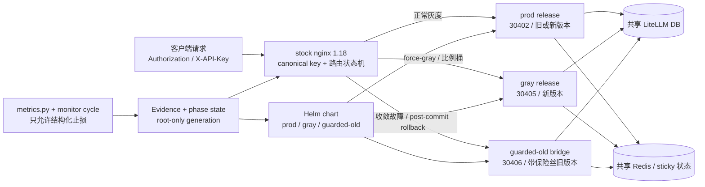

# LiteLLM 198 灰度升级手册

这是一份给变更执行人和 on-call 使用的操作手册。它说明灰度系统由什么组成、
每个阶段应该执行什么、发现问题如何把新请求切回旧版本。

设计约束和审计记录见：

- [升级设计方案](./litellm-198-gray-upgrade-plan.md)
- [单次执行记录模板](./litellm-198-gray-rollout-runbook.md)

本手册不包含真实 key、Secret、数据库连接串、Pod 日志或生产 values。生产执行必须
使用 root-only 的冻结 run 目录和本次 run 的 evidence 文件。

## 1. 功能架构

### 1.1 组件关系



### 1.2 路由优先级

推理入口的最终 upstream 按以下顺序判断：

1. 控制面和后台路径固定到 prod（收敛模式除外）。
2. `protected-prod`：永久留在 prod 的 master/admin/自动化 key。
3. `force-prod`：事故名单，优先级高于灰度名单和比例桶。
4. `force-gray`：指定验证 key，优先级高于比例桶。
5. canonical key 的稳定哈希比例桶：`0 / 1 / 5 / 10 / 50 / 100`。
6. 任何无法解析或不匹配的请求 fail-closed 到 prod。

`/v1/images/generations` 与 messages、responses、chat completions、completions、
embeddings 一样纳入推理路由。没有 canonical key 的请求不会因为匿名分桶而进入
gray。

### 1.3 三个运行版本

| 版本 | Service / NodePort | 用途 | 备注 |
|---|---:|---|---|
| prod | `litellm-proxy` / `30402` | 稳定版本或已验证的新版本 | 生产控制面默认入口 |
| gray | `litellm-proxy-gray` / `30405` | 目标版本灰度 | 独立 Helm release，关闭 Pod schema update |
| guarded-old | `litellm-proxy-guarded-old` / `30406` | 收敛和回滚的旧版本承载面 | 必须提前扩到全量容量并完成直连 smoke |

> 🔴 **2026-09-24 收敛现状（避免"gray 是生产"的误解）**：此前一段时间里路由标签
> `carher.net/litellm-production-route=enabled` 漂在 `litellm-proxy-gray` 上，
> 也就是"名叫 gray 的车道实际在扛 30402 生产流量"——这是历史漂移，不是设计意图。
> 09-24 已把标签搬回 `litellm-proxy`，使实际状态与上表设计重新对齐：
>
> | Deployment | 副本 | 版本 | 是否在服务 |
> |---|---:|---|---|
> | `litellm-proxy` | 4 | 1.100.1 | **是（唯一生产车道）** |
> | `litellm-proxy-gray` | 0 | 1.100.1 | 否（已排空，留作回滚） |
> | `litellm-proxy-guarded-old` | 0 | 1.90.2（老版本）| 否（已退役） |
>
> 判"谁在服务"永远只认路由标签、按 Pod（`get pods -l`）反查，**不要按名字**——
> `get deploy -l <路由标签>` 返回 "No resources found" 是假红（标签在 Pod 上不在 Deployment 上）。
> 下一次灰度升级时 gray 会重新扩起来承接新版本，这套三车道结构本身不变。

节点分工：198 是生产数据库所在节点；当前 4 个 prod LiteLLM Pod 分布为 198×2、225×2。225 的 Kubernetes hostname 是 `aiyjy-litellm-standby`，用于 clone、migration qualification、目标镜像启动和“不切流量”gray smoke，但不是空闲机器：它还有开发 Pod 和多批 `zero-*` Pod，并带 `dedicated=standby:NoSchedule`；固定到 225 的 workload 必须带匹配 toleration。仓库中的 gray 模板默认 pin 到 225，但这只是调度位置，不是资源隔离承诺。真正开始放量前必须重新检查两节点资源、磁盘和故障域，并生成单独的容量 values；不能把“225 能启动 Pod”当成“225 能单独扛全量”。

磁盘必须区分系统盘和数据盘。225 的 root filesystem 可能只有约 20 GiB，
但 K3s agent 和 `local-path` PVC 应落在 `/Data/rancher` 与
`/Data/rancher/storage`。执行时必须同时保存 `df -h / /Data`、live
`local-path-config`、PV 的 `.spec.local.path` 和 storage probe 结果；任一
clone PV 不在 `/Data`，或挂载文件系统可用空间低于 20 GiB，都立即停止。

三个 release 共享数据库，这是用户 key、预算、SpendLogs、ProxyModel 和 Team
状态一致的前提。schema 变更只能由独立 migration Job 完成，Pod 不得自行执行
Prisma migration。

无流量资格验证不直接写生产 Redis。先部署 `litellm-clone-redis`，让 stable/target
version-test 只连接这份隔离、无持久化实例，验证 sticky/cache 的序列化、TTL 和
跨版本读写；只有该 gate 明确 PASS 后，才允许讨论 gray 与 prod 共用生产 Redis。

### 1.4 状态机

```text
preflight
  ├─ bridge_preparing -> bridge_verified -> preflight   (需要先给旧 prod 加保险丝时)
  └─ normal_gray
       └─ convergence_ready
            └─ prod_offline_upgrading
                 └─ prod_verified
                      └─ committed

normal_gray / convergence_ready       -> rolled_back
prod_offline_upgrading / prod_verified -> aborting_to_bridge -> aborted
committed                              -> post_commit_bridge
                                         -> post_commit_prod_verified
                                         -> post_commit_rolled_back
```

phase、generation、名单、比例、bridge override 都保存在 active generation。每次
变更都会生成下一代目录，做 checksum、`nginx -t`、reload 和 post-reload 检查；
不能手改 `state.env` 或 `.map` 文件。

## 2. 目录和工具

从仓库根目录执行命令：

```bash
cd /path/to/carher-admin
export GRAY_ROOT=/root/litellm-gray-run
export GRAY_GATE_EVIDENCE_DIR="$GRAY_ROOT/evidence"
```

| 路径 | 用途 |
|---|---|
| `litellm-gray-rollout/chart/` | 三个 release 共用的参数化 Helm chart |
| `litellm-gray-rollout/k8s/` | clone、migration、NetworkPolicy 和 values 模板 |
| `litellm-gray-rollout/scripts/gray-*.sh` | 路由、phase、名单、比例、workload 钉子和回滚事务 |
| `litellm-gray-rollout/scripts/*.py` | migration、runtime、metrics、渲染和 evidence 工具 |
| `litellm-gray-rollout/scripts/fixtures/nginx/` | 离线 nginx 路由 fixture |
| `litellm-gray-rollout/tests/` | 离线契约测试 |
| `$GRAY_ROOT/generations/` | root-only 的每代路由状态 |
| `$GRAY_ROOT/evidence/` | root-only 的结构化 gate/metrics evidence |

### 2.1 Evidence 契约

生产脚本不接受裸 `PASS` 或临时环境变量。默认从
`$GRAY_GATE_EVIDENCE_DIR/<gate>.json` 读取 mode `0600` 文件，并校验：

- `gate` 和当前动作匹配；
- `status` 为 `PASS`；
- `run_id`、`generation`、`config_checksum` 与 active generation 完全一致；
- `captured_at` 带时区且没有超过冻结的 freshness 窗口；
- 文件是 root-owned regular file，不是 symlink。

常用默认文件名：

| 动作 | Evidence 文件 |
|---|---|
| 进入 `normal_gray` | `gray_entry.json` |
| 调整比例 | `split_sample.json`、`split_monitor_continuity.json`（`check-monitor-continuity.py` 产）；50% 以上再加 `split_capacity.json`（`check-split-capacity.py` 产，见 6.2.2）、`split_bridge.json` |
| 准备收敛 | `convergence_stable.json`、`convergence_control_plane.json`、`convergence_bridge.json`、`convergence_bypass_disposition.json` |
| 宣布 prod 动态归零 | `prod_zero.json` |
| 标记新 prod 已验证 | `prod_verified.json` |
| 普通全局回滚 | `global_rollback.json` |
| 提交收敛 | `convergence_commit.json` |
| 收敛期间切 bridge | `convergence_abort.json` |
| committed 后三段回滚 | `post_commit_bridge.json`、`post_commit_prod_restored.json`、`post_commit_finish.json` |
| 关闭 run | `run_close.json` |

这张表里**只有两份是工具量出来的**（`split_monitor_continuity.json`、
`split_capacity.json`），其余都是人签的确认——哪份是哪种见 6.2.3，别把二者当同一种
保证读。

`config_checksum` 里除了 7 个路由文件，还有 `workload.env`——chart package / values /
镜像 digest 的摘要（见 4.1）。所以**给活 release 打一次补丁并如实钉住之后，上面这张
表里的每一份 evidence 都会因为 checksum 变了而作废**，这正是它该有的行为：证据描述的
是某一组字节的表现，字节换了证据就不再成立。

路由事务成功后 generation 和 checksum 会变化；下一步必须重新采集并审批 evidence，
不能复制上一代文件改名字。`GRAY_GATE_EVIDENCE_FILE` 只适合一个动作显式指定单个
文件；像 convergence prepare 这样一次校验多个 gate 的命令，应使用默认目录和标准
文件名。

## 3. 执行前检查

### 3.1 本地代码和 artifact 检查

```bash
python3 -m pytest litellm-gray-rollout/tests -q
python3 litellm-gray-rollout/scripts/verify-readiness.py --developer-mode
```

变更机还必须在真实工具版本上执行完整 readiness：

```bash
python3 litellm-gray-rollout/scripts/verify-readiness.py \
  --output /root/litellm-gray-run/readiness.json
```

生产模式缺少 Helm、stock nginx 1.18、ShellCheck 或 kubeconform 时会失败，不能用
`--developer-mode` 冒充生产通过。

### 3.1.1 选目标版本：`/releases` 是坏尺子

判「官方最新稳定版是哪个」**必须同时查三处**，缺一处就会看漏：

```bash
# ① git tag（唯一完整的）——去掉 rc/dev 后取最大
curl -s 'https://api.github.com/repos/BerriAI/litellm/tags?per_page=30' \
  | python3 -c "import sys,json;print([t['name'] for t in json.load(sys.stdin) if not any(x in t['name'] for x in ('rc','dev'))][:5])"
# ② PyPI 的 info.version
curl -s https://pypi.org/pypi/litellm/json | python3 -c "import sys,json;print(json.load(sys.stdin)['info']['version'])"
# ③ ghcr 上镜像真的存在（拿 amd64 manifest digest，部署按它钉）
```

🔴 **`GET /repos/BerriAI/litellm/releases` 会漏版本**：`v1.102.0`（2026-09-20）有 git tag、
有 PyPI release、有 ghcr 镜像，但**没有 GitHub Release 条目**，在 releases 列表里
一条都查不到 —— 2026-09-21 我就是只看 releases，把 1.101.0 当成了最新稳定版。
形状上「releases 里最新的那个 stable」和「真的最新 stable」长得一模一样，不会报错。

选定后按 `patches/<tag>/` 建目录并做锚点重定（见 `patches/v1.102.0/README.md` 的做法）：
拿该 tag 的真源文件干跑两个补丁脚本，要求**锚点各命中 1 次、`py_compile` 通过、
重跑得 SKIP、补丁块引用的名字在新作用域里全部可解析**。锚点命中数对了还不够 ——
必须确认注入点仍落在原来那个函数/类里，不然会静默插进一个不会被执行的分支。

### 3.2 生产前置条件

在运行 `gray-run-init.sh` 前，执行单必须已经冻结并 checksum 以下内容：

- prod、gray、guarded-old 的 198 本地 registry immutable digest（`127.0.0.1:5000/...@sha256:...`）；ACR VPC 地址仅用于 ACK，不用于 198/225 K3s；
- 同一份 chart package 和三套 values；
- migration ledger、clone A/B/C 结果和 `check-migration.py` PASS；
- 若本轮要建 `start_time` 索引：先用 `v195-concurrent-index-runner.sh inspect` 量一次
  DB 余量（最老事务、prepared 事务、正在跑的 VACUUM、两张表 dead tuple 占比、
  `LiteLLM_SpendLogs` 上次 vacuum 距今、索引体积），把五个阈值环境变量
  （`GRAY_INDEX_MAX_XACT_AGE_SECONDS`、`GRAY_INDEX_MAX_DEAD_TUP_PERCENT`、
  `GRAY_INDEX_MAX_VACUUM_AGE_SECONDS`、`GRAY_INDEX_FREE_BYTES`、
  `GRAY_INDEX_REQUIRED_BYTES`）按实测填进 Job，**占位符留在那里等于 FAIL**。
  `GRAY_INDEX_FREE_BYTES` 来自数据盘 `df`，必须 ≥ 索引体积 ×2；`create` 失败时 runner
  会自己把留下的 INVALID 索引 `DROP INDEX CONCURRENTLY` 掉并记在 `cleanup` 字段，
  只有连删都失败才需要人工收尾；
- callback、API surface、acct/ProxyModel/quota/sticky 对账；
- 30402 直连消费者分类：控制面写、控制面读、推理/探针；
- nginx base template、render/test/reload/post-reload hook；
- bridge 全容量 Ready、直连 smoke 和 NetworkPolicy probe；
- 变更窗口、负责人、观察时长和回滚审批。

任何 `FILL-`、占位 digest、生产公网镜像、未解释的 acct 漂移或未验证的旁路消费者
都必须停在 preflight。

## 4. 初始化一次灰度 run

先在 root-only 目录准备执行单和 live summary。二者不得包含明文 key 或 Secret。

```bash
PLAN=/root/litellm-gray-run/execution-plan.md
LIVE=/root/litellm-gray-run/live-summary.json

sha256sum "$PLAN" "$LIVE"
litellm-gray-rollout/scripts/gray-run-init.sh --help

litellm-gray-rollout/scripts/gray-run-init.sh \
  --run-id litellm-198-v195-YYYYMMDD \
  --execution-plan "$PLAN" \
  --live-summary "$LIVE" \
  --expected-live-sha256 '<LIVE_SHA256>' \
  --execution-plan-sha256 '<PLAN_SHA256>'
```

生产环境还必须预先设置并冻结 `GRAY_RENDER_CMD`、`GRAY_NGINX_TEST_CMD`、
`GRAY_RELOAD_CMD`、`GRAY_POST_RELOAD_CMD`、`GRAY_INITIAL_ROLLBACK_CMD`、
`GRAY_ABORT_VERIFY_CMD` 和 renderer/base-template/debug-token 的身份与 checksum。
脚本成功后应处于 `phase=preflight`。

查看当前状态：

```bash
litellm-gray-rollout/scripts/gray-phase.sh current
litellm-gray-rollout/scripts/gray-phase.sh verify
```

### 4.1 钉住 workload：升级中途打补丁为什么必须过这一步

`config_checksum` 过去只覆盖 nginx 那 7 个路由文件。chart package、三套 values 和
镜像 digest 是**只靠执行单的文字冻结**的，代码里没有任何一处摘它们。于是中途给活
release 打补丁（改 values → `helm upgrade` → 新的内容寻址 immutable ConfigMap →
滚动重启）走完之后：

- generation 不轮转，`gray-phase.sh verify` 照样过；
- gate evidence 绑的是 `run_id` + `generation` + `config_checksum`，所以**打补丁之前
  批准的每一份证据，对打补丁之后的负载依然有效**；
- `gray-monitor-cycle.sh` 只在跨 generation 时丢 sustain 计数，旧 build 挣来的连续
  窗口会继续替新 build 累加。

结果是：跑着的 build 已经不是被批准的那个 build，而没有任何一把尺子能说出这件事。

修法不是新加一层纪律，是**往本来就存在的那个 hash 里再加一项**。记录一次 workload
会轮转 `config_checksum`，于是一步之内让所有 gate evidence 失效——放量必须重新挣
`split_sample`、`split_monitor_continuity`，到 50% 以上还要重新挣 `split_capacity`，
sustain 连续计数从零开始。「我打了补丁」和「我改了线上配置」从此是同一件事，因为
对用户来说它们本来就是同一件事。

```bash
# preflight 里做一次（init 之后、进 normal_gray 之前）；之后每次打补丁再做一次。
# 每个 --release 后面紧跟它自己的三个摘要，顺序无关（内部按 LC_ALL=C 排序后入 hash）。
litellm-gray-rollout/scripts/gray-workload-pin.sh \
  --reason 'preflight: v1.100.1 frozen artifacts' \
  --shape-evidence "$GRAY_ROOT/evidence/pod-spec-shape.json" \
  --release litellm-product-gray \
    --chart-package-sha256 '<TGZ_SHA256>' \
    --values-sha256 '<GRAY_VALUES_SHA256>' \
    --image-digest 'sha256:<GRAY_IMAGE_DIGEST>' \
  --release litellm-product-guarded-old \
    --chart-package-sha256 '<TGZ_SHA256>' \
    --values-sha256 '<GUARDED_OLD_VALUES_SHA256>' \
    --image-digest 'sha256:<OLD_IMAGE_DIGEST>'
```

几个容易读错的地方：

- **chart package 的摘要取自当天在 198 上 `helm package` 出来的那个 `.tgz`**，不是本机
  算的，也不是"再打一次包比一比"——helm 3 把打包时刻写进内层 tar，那个动作在 198 上
  **必然**假红（见运行单冻结产物一节）。
- `--shape-evidence` 吃的是 `check-pod-spec-shape.py` 的输出，脚本会读 `tool` 和
  `status` 两个字段，**不是"文件存在就算过"**。它是唯一能证明补丁真的挂进去了的东西：
  生产的补丁机制活在 Pod spec 内部（40 个 volumeMount / 38 个 subPath 单文件覆盖），
  一个 ConfigMap 都不删、Deployment 收敛、`/health` 200，而补丁可以全部静默失效。
  确实没有这份证据时可以 `--no-require-shape-evidence` 放行，但那会往 stderr 打一行
  `residual_risk:`，并把 `shape_evidence=waived` 写进被 hash 的文件里——**弃权本身进
  记录**，不是只留在某个人的记忆里。
- 摘要没变时再跑一次是 **no-op**（打印 `workload unchanged; generation not rotated`），
  不会白白轮转 generation 把所有 gate 作废。轮转由 workload 变化引起，不由"跑了这条
  命令"引起。
- `workload.env` 只能由这个脚本写。手改它之后 `verify_generation` 会红
  （`workload checksum mismatch`）——改回原字节即可恢复，这是内容校验不是一次性引信。
- 没钉过 workload 的 run：`gray-split-update.sh`（比例 > 0）、
  `gray-convergence-prepare.sh`、`gray-convergence-commit.sh` 三个前进动作**拒绝执行**；
  但 `load_state` 和回滚照常可用——把可见性洞换成一个救不回来的 run 不是修好。

## 5. 启动 gray 和指定 key 灰度

### 5.1 部署 gray / bridge

三套 release 必须使用同一冻结 chart package，不要直接引用可变 chart 工作区。
values 模板中的 digest、Secret 和配置快照必须先由 `prepare-values.py` 生成到
root-only run 目录，再执行 Helm。`prepare-values.py` 还要求 `--ingress-cidr`：
宿主 nginx 走 NodePort，kube-proxy 把源地址呈现为**节点地址**，只有 selector
的 NetworkPolicy 会把真实流量黑洞掉。`/24` 或更窄，禁 `0.0.0.0/0`。

🔴 **要枚举的是"全部消费者"，不止公网入口那条腿。** 2026-09-19 只声明了
NodePort 源地址，结果切流之后集群内 Pod→Pod 全被拒 3.5 小时（ws-ingress 的
codex 增量传输停摆、OWUI 用户被判成「没申请过 key」401），而**公网入口全程绿**
所以完全没告警。所以上面 6 条里后 4 条是集群内那条腿：三个节点的 podCIDR
加节点 LAN。细节与三段式见 `docs/nodeport-source-cidr-evidence.md` §1.1。

⚠️ **写一条 per 转发路径，不是 per 节点**，而且**不是节点的业务 IP**。2026-09-13
实测（`docs/nodeport-source-cidr-evidence.md`）：pod 侧看到的源地址跨节点是 198 的
`flannel.1`、同节点是 198 的 `cni0`，`10.68.13.198` **一次都没出现过**；
连 188 跨机打进来也被换成同一个 flannel 地址。填 `10.68.13.198/32` = 全站黑洞。

```bash
# ① 先产调度器证据（15 分钟有效期，所以这一步就在窗口里跑）。
#    三个 observations 计数**必须自己量过**再填：没量过的 0 读起来是干净的绿，
#    比没有证据更糟。--source 记下是直连生产控制面（direct:）还是 qualification
#    clone（clone:）量的。
#    摘要不用手算也**不许手算**：本脚本转调 prepare-values.py --emit-bindings，
#    余下参数原样透传给它（所以下面 prepare-values 的参数在这里也要写一遍）。
litellm-gray-rollout/scripts/collect-scheduler-evidence.py \
  --mode disabled \
  --source 'direct:<HOW-MEASURED>' \
  --duplicate-scheduler-runs 0 \
  --duplicate-background-jobs 0 \
  --unexpected-control-writes 0 \
  --evidence-output /root/litellm-gray-run/gray-scheduler-evidence.json \
  --profile litellm-gray-rollout/k8s/values-gray.yaml \
  --ingress-cidr '10.42.0.0/32' --ingress-cidr '10.42.0.1/32' \
  --ingress-cidr '10.42.0.0/24' --ingress-cidr '10.42.1.0/24' \
  --ingress-cidr '10.42.2.0/24' --ingress-cidr '10.68.13.0/24' \
  ...

# ② 再冻结 values。--scheduler-evidence 不能省略。
litellm-gray-rollout/scripts/prepare-values.py \
  --profile litellm-gray-rollout/k8s/values-gray.yaml \
  --ingress-cidr '10.42.0.0/32' \
  --ingress-cidr '10.42.0.1/32' \
  --ingress-cidr '10.42.0.0/24' \
  --ingress-cidr '10.42.1.0/24' \
  --ingress-cidr '10.42.2.0/24' \
  --ingress-cidr '10.68.13.0/24' \
  --scheduler-evidence /root/litellm-gray-run/gray-scheduler-evidence.json \
  ... \
  --output /root/litellm-gray-run/gray-values.yaml
```

> `--mode`：prod release 填 `primary`（它拥有 scheduler），gray 与 guarded-old
> 填 `disabled`（绝不能第二次跑起来）。脚本会和 profile 对账，填反直接红。
> 证据文件**拒绝覆盖**：陈旧证据悄悄变成新鲜证据正是这道闸门要防的，
> 重跑请先改文件名。

> 这两个值**执行当天必须重取**（集群重建后 flannel 的 `/32` 会变）：
> `ip -4 -o addr show dev flannel.1; ip -4 -o addr show dev cni0`。

⚠️ **frozen values 本身不能提前生成**：`prepare-values.py` 的
`MAX_SCHEDULER_EVIDENCE_AGE = timedelta(minutes=15)` 让 evidence 15 分钟就过期
（设计如此，防陈旧 values 偷渡漂移的 schema）。窗口前能定死的只有上面这两个 CIDR。

策略生效后、接真实流量前必须做完 §0.2 第 10 条的两条实测（阳性 + 证伪腿），
并把 Pod 侧实际看到的源地址回写执行单。
⚠️ 证伪腿**不能拿 188 当"未声明源"**——它经 NodePort 进来后同样被 SNAT 成
`10.42.0.0`，属于已声明，会读出假绿；要在 pod 网络里找一个客户端直连
`10.42.x.y:4000`。

```bash
CHART=/root/litellm-gray-run/litellm-gray-rollout-<VERSION>.tgz
NS=litellm-product
GUARDED_RELEASE='<FROZEN-GUARDED-OLD-RELEASE>'

helm upgrade --install litellm-product-gray "$CHART" -n "$NS" \
  --values /root/litellm-gray-run/gray-values.yaml \
  --reset-values

helm upgrade --install "$GUARDED_RELEASE" "$CHART" -n "$NS" \
  --values /root/litellm-gray-run/guarded-old-values.yaml \
  --reset-values
```

guarded-old 初始可以为 0 副本，但进入比例 `50%`、`100%` 或 convergence 前必须
扩到能独立承载全量的副本数，并完成 30406 直连验证。

如果 live prod 还没有 `DISABLE_SCHEMA_UPDATE=True`，先走 bridge 保险丝子链：

```bash
litellm-gray-rollout/scripts/gray-bridge-route.sh activate
# 等待 bridge_preparing 的 gate 和直连验证
litellm-gray-rollout/scripts/gray-bridge-route.sh verified
# 排空旧 prod、离线加保险丝并验证新 prod 后：
litellm-gray-rollout/scripts/gray-bridge-route.sh deactivate
```

### 5.2 进入 normal_gray

gray 直连 smoke、runtime gate、migration gate、selector/digest 校验都通过后：

```bash
litellm-gray-rollout/scripts/gray-phase.sh set normal_gray
```

`gray-phase.sh` 在生产模式会要求与当前 generation 绑定的 gate evidence；不要用
环境变量伪造 gate。

### 5.3 指定 key 送 gray

key 只通过 stdin 输入，不能写在命令行参数、Git、审计日志或文档中：

```bash
read -r -s -p 'Virtual key: ' KEY
printf '\n'
printf '%s\n' "$KEY" | \
  litellm-gray-rollout/scripts/gray-key-route.sh force-gray
unset KEY
```

验证名单和路由时只显示 sid，不显示 key：

```bash
litellm-gray-rollout/scripts/gray-key-route.sh list
litellm-gray-rollout/scripts/gray-key-route.sh verify
```

验证该 key 的新请求命中 gray 后，再做真实 payload、SSE、Responses、embedding、
image 和 SpendLogs 对账。指定 key 不会被比例调整冲走。

### 5.4 单 key 迅速切回 prod

发现某个 key 在 gray 有问题时：

```bash
read -r -s -p 'Virtual key to return to prod: ' KEY
printf '\n'
printf '%s\n' "$KEY" | \
  litellm-gray-rollout/scripts/gray-key-route.sh force-prod
unset KEY
```

这会在一个路由事务中清掉该 key 的其它名单、加入 `force-prod`、执行 nginx test、
reload 和 post-reload 检查。它只保证新请求切回 prod；已经建立的 gray SSE/长请求
不会被 reload 迁移，需按连接排空规则观察。

恢复该 key 到普通灰度前，先确认故障原因已经关闭，再使用 `force-gray`，不要直接
手改 map 文件。

## 6. 比例放量

比例只能使用 `0、1、5、10、50、100`。每一档都要有当前 generation 的 sample
evidence 和连续性 evidence（6.2）；`50%` 以上还需要**量出来的**容量 evidence（6.2.2）
和 guarded-old evidence。

```bash
litellm-gray-rollout/scripts/gray-split-update.sh 1
# 观察一个批准窗口并完成 metrics / SpendLogs / error 对账
litellm-gray-rollout/scripts/gray-split-update.sh 5
litellm-gray-rollout/scripts/gray-split-update.sh 10
litellm-gray-rollout/scripts/gray-split-update.sh 50
litellm-gray-rollout/scripts/gray-split-update.sh 100
```

不要把比例设成任意数字，也不要同时运行名单事务和比例事务。脚本会在锁内创建
下一代配置并自动做 nginx test/reload。

### 6.1 metrics 监控周期

放量**之前**先冻结基线（`split=0` 时做一次，产物整轮复用）。100% 阶段没有可比的
prod 对照组，止损全靠它；手写的基线进不来：

```bash
python3 litellm-gray-rollout/scripts/collect-metrics.py \
  --access-log /root/litellm-gray-run/raw/access.log \
  --emit-baseline \
  --run-id '<RUN_ID>' \
  --generation '<GENERATION>' \
  --config-checksum '<CONFIG_CHECKSUM>' \
  --phase preflight \
  --rollout-percent 0 \
  --output /root/litellm-gray-run/evidence/baseline.json
```

每个 `uri_class` 不足 100 样本会直接拒绝——换更长/更有代表性的窗口重采，
不要靠调低 `--baseline-min-samples` 蒙混过去。

每次周期先用真实 access log 和新鲜的 hard-error/backend-health/SpendLogs 快照生成
脱敏输入，再由 monitor cycle 保存结构化 evidence 并调用 dispatcher：

```bash
python3 litellm-gray-rollout/scripts/collect-metrics.py \
  --access-log /root/litellm-gray-run/raw/access.log \
  --hard-errors /root/litellm-gray-run/raw/hard-errors.json \
  --backend-health /root/litellm-gray-run/raw/backend-health.json \
  --spend-reconciliation /root/litellm-gray-run/raw/spend.json \
  --baseline /root/litellm-gray-run/evidence/baseline.json \
  --run-id '<RUN_ID>' \
  --generation '<GENERATION>' \
  --config-checksum '<CONFIG_CHECKSUM>' \
  --phase normal_gray \
  --rollout-percent 10 \
  --output /root/litellm-gray-run/metrics-input.json

litellm-gray-rollout/scripts/gray-monitor-cycle.sh \
  --input /root/litellm-gray-run/metrics-input.json \
  --evidence-dir /root/litellm-gray-run/evidence
```

cron/systemd 只能调用这条编排链，不能直接调用 `gray-global-rollback.sh`、
`gray-convergence-abort.sh` 或 dispatcher。prod backend health 未明确为 true 时，
硬错误只会产生 `alert_only`，不会把流量切到未验证的 prod。

#### 6.1.1 两个窗口，两把尺子

`--latency-window-minutes`（默认 30）只管 p95/p99；5xx 止损仍然只读 5 分钟的
`records`。这不是可调偏好，是量过的：

- **1.3/1.5 这两个阈值原本落在被测指标自身的噪声底以下。** 把 stable 随机劈成
  两半和自己比（同一批人、同一版本、同一瞬间，真值必须是 0），324 个窗口里有
  **48 个判红 = 14.8%**。相邻窗口 stable 对自己的 p95 中位数抖 **2.42x**、p99 抖
  **3.01x**，所以 81% 的相邻窗口本来就越过 1.3 线。
- **样本地板才是主导杠杆，不是阈值数值**：加上 `p95≥200 / p99≥500` 后假阳从
  15.1% 降到 2.1%，再加"连续 2 窗口"降到 **0.0%**；同时阳性对照仍能抓到
  lat1.5x 62% / lat2x 70% / 5xx+2% 86%。
- 5 分钟窗口里 `responses` 类延迟样本中位数只有 **57** 条，`MIN_P99_SAMPLE` 永远
  达不到，p99 那条腿会**永久熄灯却看起来是武装状态**。30 分钟窗口把延迟覆盖率
  拉到 80%。

**每条腿各有自己的地板，`MIN_SAMPLE` 不再一刀砍掉整个 class。** 原来
`gray_count < MIN_SAMPLE` 直接 `continue`，把 5xx 止损腿和延迟腿一起熄灯——而延迟腿
本来就有 `MIN_P95_SAMPLE`/`MIN_P99_SAMPLE`，所以那个 100 对延迟是冗余的，对止损是
有害的。2026-09-18 实测线上：5 分钟窗里**五个 class 全部低于 100**，止损腿全线熄灯，
而门禁自报武装。现在 5xx 腿单独看 `MIN_FIVE_XX_SAMPLE`：

- 地板 200 的作用是「让单窗口的比率不再被计数噪声主导」，**不是压假阳——它几乎压不住**。
  阴性对照（stable 劈半对自己，2026-09-14..18，1223 个 5 分钟桶，阈值 0.01，
  **只算真实推理 class**，真值恒为 0）：地板 100 单窗判红 **10.42%**，地板 200
  **10.94%**——基本没动。真正压住它的是 `SUSTAIN_WINDOWS`：要求连续 2 窗同一条判红，
  假阳降到 **0.00%**，同时仍抓住注入 +2pp 的 **54.7%**。
  ⛔**别指望调高地板买精度**：地板 300 四天里只有 6 个窗够样本，地板 500 一个都没有。
- ⚠️**重跑这份标定时必须排掉 `other`**。`other`（健康检查/探针）占武装窗口约 **90%**
  且几乎从不判红，混进去会把假阳率稀释 10 倍以上——本节早期版本写的
  「地板 200 判红 0.00%」就是这么来的，那个数是错的。
- 样本不够时报 `FIVE_XX_SAMPLE_BELOW_FLOOR` 诚实熄灯，而不是拿不够的请求数算出一个
  比率装作武装。
- 🔴**熄灯不等于修好了，`FIVE_XX_DELTA` 这条腿在生产量级上永远武装不起来。**
  本节早期版本预测「分流到 100% 就有 13.5% 武装率」，**那个预测是错的**：
  2026-09-19 切满后实测 65 个 5 分钟窗，canary 侧逐 class 中位数 chat 65、
  responses 44、messages 12、embedding 20，**把四个推理 class 全并起来峰值也只有 185**，
  十二小时内**一个窗口都没够 200**。所以 `five_xx_qualified` 在任何分流比例下都是
  false——这条腿不是"等分流上去就活",是结构上到不了。
  ⇒ 处置见 6.1.2：另开一条绝对率腿，`FIVE_XX_DELTA` 保留但不再指望它止损。

`comparisons[].qualified` 的含义是"至少有一条腿能判"，**不是"每条腿都活着"**；
具体哪条活看 `five_xx_qualified`。

🔴**`P95_RATIO` / `P99_RATIO` 已经不再触发任何动作**（`LATENCY_OBSERVED_ONLY`）。
本节上面那套延迟标定（2.42x/3.01x、地板 200/500、连续 2 窗）**是真的量过的**，但它
量的是"这条腿在同深度样本上的噪声有多大"，而线上两侧样本**根本不同深度**：

- 冻结 baseline 每 class 有 **2043~5156** 条，实时 canary 窗只有 **189~317** 条，
  比值两边差约 **8 倍**——跨深度的分位数比值量的是**样本方差**，不是回归。
  这和"canary/stable 的 p50 直接对比是坏尺子"是同一个毛病。
- 实测 148 个真实周期（`litellm-198-v195-20260914` 切满、`five_xx_count` 全程恒 0）：
  **每个 class 的比值中位数都低于 1.0**（chat 0.527 / responses 0.564 / messages
  0.664，即 canary 更快），而 chat 仍判红 6 次、responses 11 次。
  `responses` 有一段 30 分钟读数是
  `1.369 1.799 1.746 1.034 0.727 0.725 0.725 0.751 1.127 1.428 1.648 1.656`
  ——**四次穿过 1.3 线、摆动 2.5 倍、零个 5xx**。
- `messages` 比"吵"更糟：80 个窗口里 `p95_qualified` **一次都没 true**，
  整轮全程熄灯却自报武装。

⇒ 处置：**数字留着**（那确实是对某样东西的真实测量），**但不许拿它动生产流量**。
要重新武装，前提是先把分母修好（等深 cohort：同一批 sid，或两侧都用足够宽的窗口），
那是另一件工作。

⚠️**字段名跟着改了，不要照旧读**：`p95_qualified` / `p99_qualified` 已不存在，换成
`p95_above_floor` / `p99_above_floor`，另有 `thresholds.latency_observed_only: true`。
改名是故意的——老名字读起来像"这条腿武装且样本够了"，现在只剩后半句为真；
`thresholds` 里也**不再保留** `p95_ratio` / `p99_ratio` 这两个阈值，
**给一条开不了火的腿留着阈值，正是它看起来还武装着的原因**。

#### 6.1.2 绝对率 5xx 止损腿（`FIVE_XX_ABSOLUTE`）

6.1.1 的结论是 `FIVE_XX_DELTA` 在生产量级上结构性武装不起来。**先试过三条"省事"的
路，全都量过并否掉了，别再重试：**

- **降地板不行。** 100 条请求的窗口只装得下约 2 条请求的 2pp 偏移。同版本
  leave-one-out 阴性对照：地板 50 武装率 51.6%，但武装窗口里 **3.8% 判红**
  （约每 1.5 小时误回滚一次），而注入 +2pp 只抓到 **11%**。
- **Fisher 精确检验不行。** 直接对原始计数做单边检验：假阳 0.00%，但检出只有
  **0.41%~14.5%**。n≈100 时 2pp 就是两条请求，**信息不在这个窗口里**。
- **加宽到 60 分钟也不行。** 中位 n=2323，检出仍只有 **26.99%**，假阳反而 7.77%。

⇒ **换尺子：判绝对率，不判差值。** 坏版本不会产出 2% 错误，它产出几十个百分点，
而"几十个百分点"在 n=100 上是分得出来的。

参数与量过的依据：

| 旋钮 | 值 | 依据 |
|------|-----|------|
| `MIN_ABS_FIVE_XX_SAMPLE` | 30 | 四个推理 class 合池后，5 分钟窗 **99%** 够 30（切满后实测 200 窗） |
| `ABS_FIVE_XX_RATE` | 0.10 | 同版本 5 分钟窗 5xx 率 p90=0.043 / p99=0.206，0.10 落在两者之间 |
| `MIN_ABS_FIVE_XX_EVENTS` | 3 | 挡住 1/30 这种"一条请求 = 3.3%"的算术噪声 |
| `ABS_SUSTAIN_WINDOWS` | 4 | canary 历史 1310 窗：深度 2 → 2.07 次误触/天，深度 3 → 0.89，**深度 4 → 0.30**，而 +20pp 检出仍有 88.6% |

🔴**阈值故意没有定在历史最大值之上。** 同版本窗口在上游抖动时真的会冲到 62%
（stable max 0.6355 / canary max 0.5811），所以**任何一个率阈值都分不开"上游抽风"和
"版本坏了"**——真正分开它们的是**持续时长**：

- **持续时长** = `ABS_SUSTAIN_WINDOWS = 4`（20 分钟）。注意它比对照腿的
  `SUSTAIN_WINDOWS = 2` 深，靠 `SUSTAIN_DEPTH` 逐 code 配置，**不是全局调深**——
  调深全局会把别的腿一起弄钝。

🔴**共同命运否决已经降级成只观测，不再否决流量。** 它原本的设计是：同一窗口里
stable 的推理 cohort 也超过同一条线就判上游天气、不动流量。注入实验里它确实有效
（两侧同注 30pp：无否决 **164.14 次误触/天**，有否决深度 2 剩 **0.44/天**、
深度 4 剩 **0.0/天**，只坏 canary 的检出只从 94.23% 掉到 91.13%）。
**但那是合成流量上的效果，线上切满后这个 cohort 结构性读不到**：

- stable 推理 cohort 够 `SHARED_FATE_MIN_SAMPLE`（30）条的窗口，只占 gray 武装窗口
  **27.78%（近 6h）**，近 2h 是 **0%**（stable 推理请求每窗中位数 = 0）。
  切满后 stable 只剩健康检查（`other`，已排除）加少量 force-prod key。
- **加宽窗口救不回来**：5/15/30/60 分钟分别只有 27.78% / 30.56% / 34.72% / **43.06%**。

⇒ **一条 ≥72% 的窗口里瞎着的否决腿，比没有否决腿更糟**——因为它不是惰性的：
瞎的时候它要么装作看见（放过真回归），要么照样开火（那它根本不叫否决）。
所以现在它只写读数、不改结论，字段名也跟着改了：
`shared_fate_vetoed` → `shared_fate_observed_only` + `shared_fate_concurrent_breach`。
**读老 payload 里的 `shared_fate_vetoed: true` 不要理解成"流量被这条腿挡住了"。**

**兜底的一直是深度，不是否决**：全量日志 1318 个窗、4.58 天，真实突发的连续长度
**p50 = 1 窗、p90 = 3 窗、max = 4 窗**（canary 22 个判红窗聚成 15 段，
stable 40 个聚成 29 段），**只有 1 段够到深度 4**⇒ 否决腿全程失明，
误回滚也只有 **0.22 次/天**。
⛔**别因为否决腿降级就把深度调回 2**：深度 2 在同一份历史上是 2.07 次/天。

⚠️`other` 仍然必须排掉（两个 cohort 都排）。它占 stable 请求约 90% 且从不触达
provider；早期把它混进 cohort 会把突发抑制率从 **89.47% 稀释到 64.44%**。
这条对绝对率腿本身仍然有效，不是只对已降级的否决腿有效。

实测（把线上 nginx 日志逐窗喂给真 `metrics.py`，带线上那份冻结 baseline）：

| 指标 | 改前 (HEAD) | 改后 |
|------|------------|------|
| 武装率（切满后 200 窗） | **0.0%** | **99.0%** |
| 按原样回放的 `FIVE_XX_ABSOLUTE` 误回滚（1314 窗 / 4.56 天） | — | **0** |
| 两版总 rollback 次数（1314 窗，须完全一致） | 23 | **23** |
| 注入 +20pp 的检出（切满后 200 窗） | 30/200 | **187/200 = 93.5%** |
| 真实流量上共同命运 cohort 同窗破线 | — | 10 次（**现在只记读数，不再否决**） |
| 假设否决腿全程失明的误回滚 | — | **0.22 次/天** |

线上第一个带新腿的 verdict（`metrics-20260918T220650Z`）：
`qualified: true`、`gray_count: 129`、`gray_five_xx_rate: 0.0`、
`shared_fate_readable: false`——武装、判绿、否决腿瞎，三件事都如实写出来了。
那个 `shared_fate_readable: false` 就是后来把这条腿降级的直接证据。

⚠️**回放时 baseline 必须用线上那份冻结文件**（`/root/l3/base/baseline-*.json`）。
早期这版回放自己编了个 `five_xx_rate: 0.001`，结果让 `FIVE_XX_DELTA` 在一个真实率
1.3% 的窗口上判红，差点被读成新腿的缺陷。

读法：`absolute_five_xx.qualified` 为 true 才算在岗；`gray_five_xx_rate` 是判据；
`shared_fate_five_xx_rate` / `shared_fate_concurrent_breach` 只是同窗读数（供人判
"这波是不是上游天气"），`shared_fate_readable` 说明那个读数当窗有没有读到。
样本不够时报 `ABS_FIVE_XX_SAMPLE_BELOW_FLOOR`；`gray_count == 0` 时不报它——
那个事实由 `CANARY_SAMPLE_MISSING` 负责，两条一起报是重复计数。

`101` 是 websocket upgrade，它的 `rt` 是连接存活时长（实测中位 74s、最大 17.8h），
不是服务时长；它计入 `count` 和 `five_xx_rate`，但不进 p95/p99。
**注意：摘掉 101 单独并不能修好门禁**（回放仍有 61% 判红），它是放大器不是根因。

`latency_records` 和 `latency_window_minutes` 必须同时出现，且声明的分钟数必须
≥ `MIN_LATENCY_WINDOW_MINUTES`：只给一半、或声明 5 分钟，`metrics.py` 直接
`INVALID_LATENCY_WINDOW` / `LATENCY_WINDOW_TOO_SHORT` 拒绝，不会拿对不上的两个
窗口互比。

#### 6.1.3 连续窗口状态文件

走持续窗口的是 `THRESHOLD_TRIGGER_CODES` = `FIVE_XX_DELTA` / `FIVE_XX_ABSOLUTE` /
`USER_FAILURE_RATE` 这三条**统计腿**：要连续 `SUSTAIN_WINDOWS`（=2，
`FIVE_XX_ABSOLUTE` 配 4、`USER_FAILURE_RATE` 配 3，逐 code 在 `SUSTAIN_DEPTH` 里）
个窗口都破线才会升级成 trigger。计数存在
`$GRAY_GATE_EVIDENCE_DIR/monitor-sustain.json`（0600），由 monitor cycle 在
**dispatch 之前**写盘——回滚路径不会返回，差一个窗口就成streak的那次必须先落账。

- 文件缺失/损坏 = 按空处理，重新攒满 streak。**丢这个文件只会延迟回滚，不会造成
  回滚。**
- `run_id`/`generation` 不匹配时计数作废：换了 generation 就是换了线上配置，旧配
  置上攒的破线说明不了新配置的事。
- **硬错误、SpendLogs、`READY_CONTAINERS_SHORT`、`DATA_SOURCE_SILENT` 都不受这道闸
  约束**——那些是精确计数器上观察到的事实，不是抽样比值。数据活性腿尤其**不能**等
  复窗：它检测的正是"监控自己停了"，那个用来确认的第二个窗口可能永远不会到。
- ⚠️ 代价：`FIVE_XX_DELTA` 也在闸内，所以错误率突增的回滚从 1 个周期变成 2 个
  周期（按 300s 间隔 ≈ 10 分钟）。校准里 `5xx+2%` 这档阳性对照在连续 2 窗口下仍
  有 86% 命中，这是量过后接受的代价，不是漏网。

#### 6.1.4 门禁现在就这四条腿

2026-09-14 那轮的教训不是"腿不够"，是**腿太多、且大部分开不了火**：五个放量档里有三档
的止损腿其实没武装，而门禁全程报绿。所以这一版反过来做——**砍到四条，每条上线前都要过
阴性对照**（拿 stable 打自己，判红率须 ≈0）。

| 腿 | reason code | 尺子 | 闸门 |
|----|-------------|------|------|
| 5xx **绝对率** | `FIVE_XX_ABSOLUTE` | 合池推理 class 的 5xx 率 | 率 0.10 + ≥3 事件 + **连续 4 窗** |
| **ready 容器数** | `READY_CONTAINERS_SHORT` | `ready_containers` vs 运行单给的 `expected_containers` | 精确计数，**不过持续闸** |
| **数据活性** | `DATA_SOURCE_SILENT` | 每个数据源 `observed_at` 相对**本轮最新观测**的滞后 | >300s 判红，**不过持续闸** |
| **用户面失败** | `USER_FAILURE_RATE` | access log 状态码里**proxy 自己吐的那些**：5xx + 429 + 413 | 率 0.02 + ≥3 事件 + **连续 3 窗** |

砍掉的三样，每一样都带着它被砍的测量（见 6.1.1 / 6.1.2）：
`P95_RATIO`/`P99_RATIO`（两侧样本差 8 倍，量的是方差）· 共同命运否决（切满后 ≥72%
的窗口读不到）· `MIN_SAMPLE = 100` 硬编码（5 分钟活窗永远够不到，`continue` 熄灯整条腿）。

**为什么 ready 数只认 `ready_containers`：** `replicas` 是 spec 数字，而且它往危险的方
向撒谎——**副本数 0 的 Deployment 照样 `Available: True`**（号池上 165 个
`replicas>0` 的 deployment 只有 54 个在服务）。
⚠️`expected_containers` **必须由采集侧/运行单给**，`metrics.py` 里一个字面量都不许写：
写死就是 `llm-stab-scrape-down` 那个硬编码 5——扩缩容后静默算错，且永远不会红。
**缺这一段是 `NOT_PROVIDED` 不是 0**：「没读到读数」和「一个容器都没 ready」是相反的事
实，只有后者是故障。`rollout > 0` 时缺段直接 `READINESS_MISSING` 拒判。

**为什么数据活性腿必须存在：** 这个模块里**其他每一条腿在空窗口上都报"干净"**，
所以一个输入死掉的监控和一个盯着健康系统的监控，产出的 payload 长得一模一样。
它锚在**本轮最新那个观测**上，不是 `evidence.captured_at`——后者在采集侧是各源时间戳的
**最小值**，拿它当锚会让"真正哑掉的那个源"读出 age 0，其余全读成未来时刻（这条腿第一次
试跑就是这么错的）。锚在最新观测上让它**故意是相对的**：它回答的是"其他源都活着、
是不是有一个在掉队"。整包都陈旧（一起停）由 `evidence_errors` 的 `MAX_EVIDENCE_AGE`
按墙钟兜，采集侧 `MAX_LOG_AGE` 还会更早拒掉陈旧 access log。
🔴**这条腿绝不能等复窗**：它检测的正是监控自己停了，用来确认的第二个窗口可能永远不来。
`MAX_SOURCE_SILENCE_SECONDS` == `gray-progress.py: DEFAULT_CYCLE_INTERVAL`
== `gray-monitor-loop.sh: GRAY_CYCLE_INTERVAL_SECONDS` 默认值，**三处同一个 300**，
由 `test_data_liveness_floor_matches_the_frozen_cycle_interval` 和读 shell 默认值的那条
测试钉住——改采样间隔不同步改这个，这条腿要么每轮假报、要么静默丢分辨率。

**为什么用户面失败腿和绝对率腿不是重复的：** 两条读同一批行，但绝对率腿是**止损**，
门槛故意高（0.10 / 连续 4 窗），调成"上游天气不动流量"；这条是**用户视角**，门槛低
（0.02 / 连续 3 窗），并且**计 proxy 自己吐的 429 / 413**——坏构建刷出来的 429 风暴
对 5xx 尺子完全隐形，对挨着的那个人完全可见。实测这条分工是真的：3pp 的 502 注入，
用户面腿在 185 个窗口里判红 180 个，而止损腿（0.10）一个都不响。

🔴**这条腿的"总体"口径 2026-09-20 改过一次，是阴性对照抓出来的，不是调参。**
原口径是"状态码 ≥400 全算"，拿真实 stable 流量打自己（两边同一批请求，判红即假红）
**6 个窗口里 3 个升级成 `rollback`**。错的不是阈值是**总体**——15.4h / 66393 条
stable 推理行 / 185 个 ≥30 样本窗：

| 总体 | 分布 | 破 0.02 的窗口 |
|------|------|----------------|
| 调用方侧 4xx：`499×508 400×326 405×296 403×107 401×70` | p50 0.0043 · p90 0.0330 · max 0.1222 | **39/185（21.1%）** |
| proxy 自己吐：`503×371 500×124 429×92 413×4` | p50 0.0000 · p90 0.0065 · max 0.2283 | **7/185（3.8%）** |

`499` 是 nginx 记"客户端先挂断"，`405`（296 条全在 `responses`）是调用方打了这条路由
不提供的方法，`400` 是请求体不合法——**没有一条是被测构建干的**，而且它们在完全没有
版本故障的流量上就长这个量。⇒ 开火只认 proxy 侧，调用方侧 4xx 留在 payload 里并有
自己的告警线 `MAX_USER_CLIENT_ERROR_RATE = 0.10`（0.03 会一天喊 35.9 次，0.05 喊
15.6 次，0.10 喊 1.56 次且仍低于实测 0.1222 的天花板）——**看得见，永远不动流量**。
阈值本身**没有往上抬**：在正确总体上 0.02 已经是 p90 的 3 倍，抬了反而看不见 429 风暴。

**深度 3 也是量出来的**：同一批窗口里 proxy 侧连续破线的段长是 `[1,1,1,2,2]`，**max 2**
⇒ 深度 2 仍然一天假触 3.13 次，深度 3 是 **0**。代价是真回归晚 5 分钟动流量，
底下还垫着深度 4 的 5xx 止损。

⚠️**读老 payload 注意**：`failure_count` / `failure_rate` 这两个字段名没变但**总体变了**，
老值 = 新 `failure_count` + `client_four_xx_count`，两个数不可直接比。

⛔**判用户受损只认用户面计数，`ERROR` 行数是坏尺子**：那数的是重试层的上游尝试，
一次用户可见失败按重试次数出现 1~N 遍，重试策略一改这个数就动而系统什么事都没有。
⚠️两个比较都是**严格大于**：6/300 正好 0.02 **不破线**，某个源正好滞后 300s **判绿**。
两处边界都由测试钉在线上，改成 `>=` 会直接红——不然"可接受的上限"会静默变成"开火条件"。

⛔**别因为否决腿降级就把 `ABS_SUSTAIN_WINDOWS` 调回 2**：同一份历史上深度 2 是
**2.07 次误触/天**，深度 4 是 **0.30**，而 +20pp 的检出仍有 88.6%。

#### 6.1.5 阴性/阳性对照怎么跑（每次改门禁都要跑）

上面每条腿的数字都不是推的，是这个脚本跑出来的，它也是改完门禁**唯一**的验收方式：

```bash
# 阴性对照：拿 stable 打自己，同一批请求既当 canary 又当 stable，判红即假红
python3 litellm-gray-rollout/scripts/replay-gate-negative-control.py \
  --access-log <nginx access log> \
  --baseline /root/l3/base/baseline-<ts>.json \
  --expected-ready 6 \
  --json-out <evidence>/neg.json

# 阳性对照：同一批窗口，把 canary 一侧按比例改成 502
… --inject 0.20      # 止损腿 + 用户面腿都该响
… --inject 0.03      # 只有用户面腿该响（这就是两条腿分工的证据）
# ready 腿的阳性对照：把实际值报成比运行单少一个
… --ready 5 --expected-ready 6
```

⛔**只跑阴性对照等于没跑**：全绿只证明这些腿很安静，**不证明它们能开火**。
合成绿和合成红同样不可信，两边都必须跑。
⛔`--baseline` 必须是线上冻结的那份，**没有默认值、不许现场合成**：早先一次 replay
自己编了个 `five_xx_rate: 0.001`，让 `FIVE_XX_DELTA` 在真实率 1.3% 的窗口上判红，
那个假红被当成"新腿有 bug"查了一轮。

**2026-09-20 的验收结果**（185 个窗口 / 15.4h 真实 stable 流量）：

| 跑法 | hard_triggers | 说明 |
|------|---------------|------|
| 阴性 | **0 / 185** | 修 leg 4 之前是 6 个窗口里 3 个 |
| `--inject 0.03` | 180 / 185 | 只有 `USER_FAILURE_RATE` |
| `--inject 0.20` | 183 / 185 | 两条 5xx 腿都响；差的 2 个是持续闸在攒到深度 3 |
| `--ready 5` | 4 / 4 | `READY_CONTAINERS_SHORT` 第一个窗口就响，不过持续闸 |

⚠️**`DATA_SOURCE_SILENT` 只有阴性对照，它那个 0 不是量出来的**：replay 给每个窗口
造的都是健康的滞后分布，这条腿读到 0 是因为**从没被喂过一个死掉的源**，不是因为
喂了还保持安静。它的阳性对照在单元测试里（和它必须算对的锚点规则放在一起——锚是
**本轮最新观测**，不是 `evidence.captured_at`，后者是 `min()`，会把最死的那个源判成
滞后 0）。这是故意不给 `--stale-source` 开关的：这个 harness 合成出来的滞后本身就是
fixture，fixture 该待在测试里。

**这条"每条腿两个对照"的要求对放量门禁也成立，不只对 `metrics.py` 的四条腿。**
`check-monitor-continuity.py`（6.2）和 `check-split-capacity.py`（6.2.2）的对照都在
`tests/test_litellm_gray_audit.py` 里，并且容量那一组在
`tests/test_litellm_gray_routing.py` 里还有一条端到端腿：把工具自己产出的 `FAIL`
证据喂给 `gray-split-update.sh 50` 必须被拒。少了那一条，门禁就只是"接受这个工具吐的
任何文件"，又回到上一层的形状问题。

### 6.2 放量前的 deadman gate

每个成功周期会往 `$GRAY_GATE_EVIDENCE_DIR/monitor-heartbeat.jsonl` 追加一条心跳。
这条账本是唯一能证明"漏过的周期"的东西：metrics 文件只记录**跑过**的周期，调度器
死了的窗口和一切正常的窗口在文件系统上长得一模一样。

每次 `gray-split-update.sh <N>`（N>0）之前跑一次，把上一段观察窗口的连续性变成
gate 证据：

```bash
python3 litellm-gray-rollout/scripts/check-monitor-continuity.py \
  --ledger /root/litellm-gray-run/evidence/monitor-heartbeat.jsonl \
  --run-id "$GRAY_RUN_ID" \
  --generation "$GRAY_GENERATION" \
  --config-checksum "$GRAY_CONFIG_CHECKSUM" \
  --window-start '<上一次放量的 UTC 时间戳>' \
  --cycle-interval-seconds '<执行单冻结的调度间隔>' \
  --output /root/litellm-gray-run/evidence/split_monitor_continuity.json
```

`--cycle-interval-seconds` 抄执行单里冻结的那个值，不要现场估。下面任一条都会写出
`status=FAIL` 并返回 1，`gray-split-update.sh` 随即拒绝放量：

| errors 里的码 | 含义 |
|---|---|
| `MONITORING_GAP` | 任一缺口超过 `间隔 ×(1+--max-missed-cycles)`（默认允许漏 1 次） |
| `NO_CYCLES_IN_WINDOW` | 窗口内一个周期都没有 |
| `INSUFFICIENT_CYCLES` | 窗口内周期数 < `--min-cycles`（默认 4）——**见下** |
| `FOREIGN_RUN_ID` | 心跳 run_id 不是本次 run |
| `FAILED_CYCLE_IN_WINDOW` | 窗口内有 `metrics_status=FAIL` 的周期 |

补救办法是**把监控修好、重新观察一个完整窗口**，不是调大 `--max-missed-cycles`
把缺口盖过去。

#### 6.2.1 `--min-cycles` 为什么必须 == `ABS_SUSTAIN_WINDOWS`

缺口检查看不见"窗口太短"这种形状：两个周期间隔 5 分钟，缺口为零，而深度 4 的
绝对 5xx 止损腿需要**连续 4 个窗口**同向越线才促发 —— 停留只有 2 个周期的那一档，
止损腿在物理上根本没武装过，门禁却全绿。

2026-09-14 那一轮实测（从 `monitor-heartbeat.jsonl` 反推，162 个周期）：

| 档位 | 停留 | 监控周期 | 深度 4 的止损腿 |
|---|---|---|---|
| 1% | 48min33s | 4 | 武装了 |
| 5% | 8min58s | **2** | **没武装** |
| 10% | 15min12s | **2** | **没武装** |
| 50% | 12min50s | **2** | **没武装** |
| 100% | 17h52min | 139 | 武装了 |

五档里有三档的止损腿是熄灯的。**"止损腿没武装"和"止损腿促发过但没发现问题"在
证据上长得一模一样**，这正是诊断纪律禁止的空数据栏。

所以 `--min-cycles` 默认 4，和 `metrics.py` 的 `ABS_SUSTAIN_WINDOWS` 是同一个数。
改深度必须同时改它，否则止损腿会被静默重新缴械 —— 这个耦合由
`tests/test_litellm_gray_progress.py::test_min_cycles_equals_absolute_sustain_depth`
看着，改一个不改另一个当场红。

#### 6.2.2 50% 以上的容量门禁：`split_capacity`

`gray-split-update.sh` 从运行单写出来那天起就在 `>= 50%` 上要求这道门禁，
而**到 2026-09-20 之前这个仓库里没有任何东西生产它** —— 证据文件是手写的。
那正是 6.1.4 存在的理由的另一面：**门禁只校验形状不校验真相**，一个人在 JSON 里
打上 `"status": "PASS"` 只证明有人打了字。现在由 `check-split-capacity.py` 量出来：

```bash
python3 litellm-gray-rollout/scripts/check-split-capacity.py \
  --access-log <nginx access log> \
  --readiness /root/litellm-gray-run/raw/readiness.json \
  --run-id "$GRAY_RUN_ID" \
  --generation "$GRAY_GENERATION" \
  --config-checksum "$GRAY_CONFIG_CHECKSUM" \
  --target-split 50 \
  --per-container-concurrency '<运行单冻结的单容器上限>' \
  --output /root/litellm-gray-run/evidence/split_capacity.json
```

**尺子是 upstream-秒/秒/ready 容器，不是请求数。** 这两个在本系统上对不上：
2026-09-18 那个窗口里 canary 车道承了 **21.4% 的请求**和 **44.9% 的工作量** ——
两个池子的 class 组成不一样，一次 `responses` 抵好几次 `chat`。按请求数除等于在答
一个没人问的问题（"这条车道能不能接日志里一半的行数"）：车道服务的不是行，是上游
秒，工人耗尽的也是秒。这个量同时**就是一个并发数**（Little 定律：在飞的上游请求均值），
而这正是 worker 池真正封顶的东西。

| errors 里的码 | 含义 |
|---|---|
| `INSUFFICIENT_CAPACITY` | 投影出来的单容器并发 > `上限 ×(1-headroom)` |
| `CEILING_BELOW_DEMONSTRATED` | 给的上限**低于车道当前已经在跑的量** —— 输入错了，不是容量结论 |
| `UNPRICED_CLASS` | 某个 class 有真实需求但 gray 侧样本 < 30，定不了价 |
| `READY_CONTAINERS_SHORT` / `ZERO_READY_CONTAINERS` | ready 容器数不等于运行单的期望值 |
| `READINESS_STALE` | readiness 读数比一个监控周期还老（>300s），那不叫读数 |
| `WINDOW_TOO_SHORT` / `WINDOW_TOO_LONG` | 跨度 <5min 算不出稳定速率；>6h 会把峰值平均掉 |
| `NO_INFERENCE_TRAFFIC` | 窗口里没有推理 class，没有东西可量 |

⚠️**`--per-container-concurrency` 没有默认值，故意的。** 容器"扛不住"的那个点，
不把它推到那儿就量不出来，而写个默认值就是又一个 `llm-stab-scrape-down` 里那个字面量
`5`：改一次架构就不再成立，且**永远不会红**。所以这个工具只做人手做不了的部分
（逐 class 定价、请求→秒的换算、按目标比例投影、除以 ready 容器数），缺这一个数就拒跑。
反过来 `CEILING_BELOW_DEMONSTRATED` 是**校验输入本身**：上限低于车道已经在演示的吞吐
是个错的输入，不许伪装成容量结论 —— 否则操作者会去查一个不存在的容量问题。

⛔**分母是观测到的跨度，不是请求的窗口。** 要了 30 分钟、里面只有 4 分钟流量，那就是
一次 4 分钟的测量；除以 1800 会把到达率报成真值的七分之一 —— **这是让这道门禁变绿
最容易的一条路**。用观测跨度还会偏高（两端各少算一个到达间隔），偏在安全那侧。

⛔**没定价的 class 不是免费的。** 跳过它 = 报无限余量 = 给一条没人量过的车道发绿灯。
gray 侧样本不够又确实要放行时用 `--impute-class-cost-from-stable <class>` 拿 stable
侧的单价来顶，并且**只会抬价不会降价**（取 `max(gray, stable)`）：让一个对新构建的
假设把投影变便宜，豁免就变成了折扣。class 名打错直接在参数校验里拒 —— 不然它会以
`UNPRICED_CLASS` 报出同一个 class 名，操作者原样再输一遍那个错字，这个循环没有出口。

🔴`MAX_READINESS_AGE_SECONDS = 300` 和 `collect-metrics.py: MAX_LOG_AGE`、
`metrics.py: MAX_SOURCE_SILENCE_SECONDS`、`gray-monitor-loop.sh:
GRAY_CYCLE_INTERVAL_SECONDS` 是同一个 300。**调采样间隔不同步调它，一条完全健康的
监控循环上每次容量检查都会失败。**

**它量不到什么，写进 `residual_risk` 跟着证据走**：单容器上限是运行单输入；headroom
是留给突发的余量而突发本身**没有被量**（投影是个**均值**，按均值配的车道每个峰值都排队）；
需求是按**当前的 class 组成**投影的，组成变了这份文件不会自己失效。

对照（6.1.5 的要求对每条门禁腿都成立，新工具的两个对照落在测试里）：

| 对照 | 结果 |
|------|------|
| 阴性：需求宽松装得下 | `PASS`，`errors: []`，单容器 0.167 / 上限 2.0 |
| 阳性：低 canary 份额 fixture，上限 1.0 | `FAIL ['INSUFFICIENT_CAPACITY']`，投影 1.106 vs 已演示 0.211（**5.2 倍差，按请求数量会整条漏掉**） |
| 阳性：上限 0.10 | `FAIL ['CEILING_BELOW_DEMONSTRATED', 'INSUFFICIENT_CAPACITY']` |
| 阳性：ready 0 / 2 of 3、readiness 900s 前 | 各自 `ZERO_READY_CONTAINERS` / `READY_CONTAINERS_SHORT` / `READINESS_STALE` |
| 阳性：gray `responses` 只 5 个样本 | `FAIL ['UNPRICED_CLASS']`；加 `--impute-class-cost-from-stable responses` 后 `PASS` 且单价只升 |
| 阳性：跨度 120s | `FAIL ['WINDOW_TOO_SHORT']` |
| 阳性：`--impute-class-cost-from-stable respones`（错字） | 参数校验拒跑，不写证据文件 |
| 端到端：FAIL 的证据喂给 `gray-split-update.sh 50` | 被拒（`gate/status mismatch`），PASS 的放行 |

它从不连集群、从不改路由状态，所以放量中途随时能跑。

#### 6.2.3 哪些门禁是量出来的，哪些是人签的

`split_capacity` 那件事暴露的不是一道门禁的问题：脚本里一共 **22 处**
`require_gate_evidence`，其中**只有 2 道有生产者**。剩下 20 道并不都是缺陷——
有一批本来就是人的判断（"我确认 bypass 消费者都处置完了"这种东西没有量具），
但**代码和文档过去都没有标出哪道是哪种**，读到 `require_gate_evidence` 的人
默认它"已经在管"。这就是上面那个坑的普遍形式。

| 门禁 | 谁产的 | 性质 |
|------|--------|------|
| `split_monitor_continuity` | `check-monitor-continuity.py` | **量出来的**（6.2） |
| `split_capacity` | `check-split-capacity.py` | **量出来的**（6.2.2） |
| `split_sample`、`split_bridge` | 无 | 人签：抄执行单里冻结的采样/bridge 结论 |
| `key_pilot_entry` | 无 | 人签：把指名 key 放到新 build 上（6.2.4） |
| `gray_entry`、`prod_zero`、`prod_verified` | 无 | 人签：阶段跃迁的判断 |
| `bridge_*`（3）、`convergence_*`（6）、`post_commit_*`（3）、`global_rollback`、`run_close` | 无 | 人签：不可逆动作前的确认 |

**这两类现在在代码里是不同的形状，不是同一个文件配两种读法。**
`gate_expected_producer()`（`_lib.sh`）是一张白名单，`require_gate_evidence` 按它分岔：

- **量出来的**那两道：`tool` 必须等于对应脚本名，`schema_version` 必须是 1，
  并且 **`result_sha256` 会被重算**——工具写完之后改过任何一个字段就红在这里。
  手写一份 `{"status":"PASS"}` 现在进不来了，这正是 6.1.4 那个坑的本体。
- **人签**那 20 道：不许带 `tool`（带了就是冒充量具），必须带 **`signer`**——
  一个真名，模板占位（`FILL_ME`/`TBD`）、角色名（`operator`/`admin`）和
  `root` 全部拒收（sudo 之下所有人的 `$USER` 都是 `root`，那不指向任何人）。

两类都额外加了一条：`status=PASS` 但 `errors` 非空 → 红。以前只读 `status`，
所以一次 FAIL 的工具输出被手改成 PASS 之后，它自己的 reason code 会跟着过闸门。

还有两道不走 `require_gate_evidence` 的前置检查，但性质要一起看。

**`require_workload_binding`**（5 处：`gray-split-update.sh` 比例 > 0、
`gray-convergence-prepare.sh`、`gray-key-route.sh` 的 `force-gray` 与
split≠0 时的 `remove`，加上被 `require_pinned_release` 内部复用那次）。
它不批准任何结论，只拒绝在「跑着的 build 没被记录」的状态下前进。它是**量出来的**——
判据是 `state.env` 里 `workload_checksum` 是不是 `unbound`，没有人的签字能绕过去。
它的价值不在自己红不红，而在于让上面那两道量出来的门禁**摘的是真的那组字节**：
workload 没钉住时 `config_checksum` 根本没在说「哪个 build 在跑」，那两把尺子量得
再准也绑在一个不表示 build 的数上。

**`require_pinned_release <release>`**（2 处：`gray-phase.sh` 的
`prod_offline_upgrading → prod_verified`、`gray-convergence-commit.sh`）。
上面那道只问「有没有钉住东西」，而从 preflight 起答案永远是「有」——preflight 钉的是
**gray** 那个 release。于是第 7 节那条 `helm upgrade litellm-product-proxy --reset-values`
（全程半径最大的一步）直到 2026-09-21 都是**唯一没有任何 pin 覆盖的 release**：
最终变成稳定服务 build 的那一份，恰好缺着 pin 本身要堵的那个洞。
这道检查按 key 精确匹配 `workload.env` 里的 `release_<name>_image_digest`
（子串匹配会让 `litellm-product-proxy-old` 冒充 `litellm-product-proxy`），
所以 `prod_verified` 和收敛提交现在都拿得到「被批准的 prod build 是哪一组字节」。

**所以判一道门禁有没有用，看的是「这份证据是谁量的」，不是「有没有 `require_`」。**
人签的门禁自有价值——它把不可逆动作钉在一个具名的人和一个时刻上（`signer` 现在是
代码里的硬要求，不再只是这段话里的说法），而且同样吃
`run_id`/`generation`/`config_checksum`/24h 那套形状校验，所以上一轮的签字进不来。
但它证明的是**有人签了**，不是**事情是真的**。哪天给某道人签门禁写了量具，
**要同时改两处**：往 `gate_expected_producer()` 的白名单里加一行，
并把它在上表里挪到量出来的那两行——只改一半，分类表就又在撒谎。改完按 6.1.5 补两个对照。

#### 6.2.4 指名 key 试点（`key_pilot_entry`）：split=0 不等于没有真实流量

`route_model.py` 的 `evaluate()` 里，`force_gray` 命中**排在**
`bucket_for(key, split_percent)` **前面**。所以第 ④ 环（指名 key 试点、上一轮跑了
84.8h）虽然 `split=0`，它就是**新 build 上的第一批真实生产流量**。
而在 2026-09-21 之前，`require_workload_binding` 只守 split > 0，
于是这一环是整条流水线里**唯一没有任何东西检查「跑的是哪个 build」**的一环。

现在 `gray-key-route.sh` 按方向分岔：

| 动作 | 方向 | 检查 |
|------|------|------|
| `force-gray` | 升级（把人放到新 build 上）| `require_workload_binding` + `require_gate_evidence key_pilot_entry` |
| `remove` | 看 split 而定 | split≠0 时 `require_workload_binding`——摘掉 `protected-prod` 之后这个 key 会落回 `bucket_for()`，可能就上了 gray |
| `force-prod`、`protect-prod` | 降级（把人拉回旧 build）| **不设门禁** |

降级永远不许被门禁挡住：出事时把用户拉回旧 build 这条路必须在任何状态下都能走，
包括证据过期、workload 没钉、签字没人签的状态。

### 6.3 进度台账：现在在第几环

`gray-progress.py` 把 `generations/` 目录**反推**成一张进度表。它只读不写、不碰路由
状态、不发网络请求、恒 `exit 0`（它是观测者不是门禁；红要在
`check-monitor-continuity.py` 里出）。所以随时可以在生产上、放量中途跑。

```bash
sudo python3 litellm-gray-rollout/scripts/gray-progress.py \
  --generations /etc/nginx/gray-route/generations \
  --ledger /etc/nginx/gray-route/evidence/monitor-heartbeat.jsonl
```

不需要任何新的状态文件：`write_state()` 不存时间戳，但**每一代的目录名里带 UTC
时间戳**，而 generations 从来不清理（上一轮 675 个目录全在）。换代恰好是产生时间轴
的动作，不是毁掉它的动作，所以历史 run 也能事后重建 —— 加 `--run-id <旧 run>` 即可。

它打印：当前第几/共几环、走过哪些环、跳过哪些环（optional 的跳过标 `○`，非 optional
的标 `⚠`）、每环进入时刻与停留时长、每个放量档实际观察到几个周期 vs 要求几个、
从开始到现在多久、以及剩余时间。

**剩余时间分两栏报，不混算**：机器时间是算术（`min_cycles × 间隔`，可预测）；等人签
的环节不可预测，只报"另有 N 个环节等人签"。上一轮"指名 key 试点"那一环实测 78.9
小时，其中 79 小时是没人动 —— 把它折进 ETA 就是编一个自己都不信的数字。

`⑤.x 放量` 那几行的 `观察窗口` 列是 `实际/要求`。小于要求时它会写明"深度 4 的止损腿
在这一档没有武装过"，和 6.2.1 的 `INSUFFICIENT_CYCLES` 是同一个事实的两种表达：
台账让它**看得见**，门禁让它**拦得住**。

## 7. 全量收敛

只有 gray 稳定、`split=100`、`force-prod` 为空、控制面/acct mutation 已冻结或改道、
所有 30402 旁路已分类、guarded-old 全容量 Ready，并且 `prod_zero` evidence 通过后，
才能收敛。

```bash
# 1. 准备 convergence mode：一次事务冻结路由并让整个 /pro/ 新请求到 gray
litellm-gray-rollout/scripts/gray-convergence-prepare.sh

# 2. 消费当前 convergence_ready generation 的 prod_zero evidence
litellm-gray-rollout/scripts/gray-phase.sh set prod_offline_upgrading

# 3. nginx 保持 100% gray，离线升级 prod。以下是示意，实际 values/package 必须用冻结副本。
#    先过删除集 gate：`--reset-values` 换 chart 会删掉旧 release 拥有、新 chart 不渲染的对象
#    （PDB、额外 Service/ConfigMap 都在其列），而 rollout status 看不出来。
helm get manifest litellm-product-proxy -n litellm-product \
  > /root/litellm-gray-run/prod-live-manifest.yaml
helm template litellm-product-proxy /root/litellm-gray-run/chart.tgz \
  -n litellm-product --values /root/litellm-gray-run/prod-target-values.yaml \
  > /root/litellm-gray-run/prod-target-manifest.yaml
litellm-gray-rollout/scripts/check-release-deletion-set.py \
  --live-manifest /root/litellm-gray-run/prod-live-manifest.yaml \
  --target-manifest /root/litellm-gray-run/prod-target-manifest.yaml \
  --release litellm-product-proxy --namespace litellm-product \
  --run-id "$GRAY_RUN_ID" --generation "$GRAY_GENERATION" \
  --approval /root/litellm-gray-run/prod-deletion-approval.json \
  --output /root/litellm-gray-run/prod-deletion-set.json
#    再过 Pod spec 形状 gate：删除集看的是对象，补丁活在 Pod spec 内部（40 个
#    volumeMount / 38 个 subPath 单文件覆盖 / postStart）。这些 ConfigMap 一个都不删，
#    所以删除集绿、rollout status 绿、/health 200 探针也绿，而补丁全部静默失效。
#    live 一侧必须是 kubectl 读的活对象，不是 helm get manifest（后者会跟 set image
#    造成的漂移对不上，喂错就是拿目标跟自己比）。
kubectl -n litellm-product get deploy litellm-proxy -o yaml \
  > /root/litellm-gray-run/prod-live-deployment.yaml
#    ConfigMap 快照是为了摘要「挂载进去的字节」：chart 的 CM 名字是内容寻址的
#    （<release>-<snapshot>-<checksum>），现网是手写的，所以同一份字节会换名字出现，
#    不喂快照时 40 条挂载会全部读成 changed，审批退化成 40 行「同一份字节」橡皮章。
#    不喂 = 什么都不 inert（工具行为退回旧版），只是审批会很长；喂错（例如喂渲染出来的
#    CM）会硬红 LIVE_CONFIGMAPS_ARE_NOT_LIVE_OBJECTS。0600、用完即删；输出只有 sha256。
umask 077 && kubectl -n litellm-product get configmap -o yaml \
  > /root/litellm-gray-run/prod-live-configmaps.yaml
litellm-gray-rollout/scripts/check-pod-spec-shape.py \
  --live /root/litellm-gray-run/prod-live-deployment.yaml \
  --target /root/litellm-gray-run/prod-target-manifest.yaml \
  --live-configmaps /root/litellm-gray-run/prod-live-configmaps.yaml \
  --name litellm-proxy --namespace litellm-product \
  --run-id "$GRAY_RUN_ID" --generation "$GRAY_GENERATION" \
  --approval /root/litellm-gray-run/prod-pod-spec-approval.json \
  --output /root/litellm-gray-run/prod-pod-spec-shape.json
shred -u /root/litellm-gray-run/prod-live-configmaps.yaml
kubectl apply --dry-run=server -f /root/litellm-gray-run/prod-target-manifest.yaml
if kubectl diff -f /root/litellm-gray-run/prod-target-manifest.yaml; then rc=0; else rc=$?; fi
[ "$rc" -le 1 ] || { echo "FATAL: kubectl diff error rc=$rc"; exit 1; }
helm upgrade litellm-product-proxy /root/litellm-gray-run/chart.tgz \
  -n litellm-product \
  --values /root/litellm-gray-run/prod-target-values.yaml \
  --reset-values --atomic=false
kubectl -n litellm-product rollout status deploy/litellm-proxy --timeout=600s

# 3.5 把刚升上去的 prod release 钉进 workload.env
#     `gray-phase.sh set prod_verified` 和 `gray-convergence-commit.sh` 现在都要求
#     `litellm-product-proxy` 已被 pin（require_pinned_release），没有这一步过不去。
#     这一步必须在 helm upgrade **之后**跑：pin 记的是「跑着的那组字节」，
#     upgrade 之前这个 digest 还不存在。
#     顺序也是承重的：先 pin 再挣 prod_verified。pin 会轮转 generation，
#     先签 prod_verified 的话那份证据会被紧随其后的 pin 当场作废。
#
#     ⚠ **一次 pin 记的是整张表，不是往表里追加。** 这一刻 gray 还在扛 100% 真实流量，
#     所以同一条命令里必须把 gray 那三项一起重报，否则服务中的 build 的身份
#     会从记录里消失（require_workload_binding 仍然绿，因为它只问"有没有钉住东西"）。
#     gray 那三个值从当前 workload.env 里读，不要手抄。
GRAY_WL=/etc/nginx/gray-route/active/workload.env
g_chart=$(sudo awk -F= '$1=="release_litellm-product-gray_chart_package_sha256"{print $2}' "$GRAY_WL")
g_values=$(sudo awk -F= '$1=="release_litellm-product-gray_values_sha256"{print $2}' "$GRAY_WL")
g_image=$(sudo awk -F= '$1=="release_litellm-product-gray_image_digest"{print $2}' "$GRAY_WL")
[ -n "$g_chart" ] && [ -n "$g_values" ] && [ -n "$g_image" ] \
  || { echo "FATAL: gray release is not pinned; refusing to drop it from the record"; exit 1; }
p_image=$(kubectl -n litellm-product get deploy litellm-proxy \
  -o jsonpath='{.spec.template.spec.containers[?(@.name=="litellm")].image}')
case "$p_image" in *@sha256:*) ;; *) echo "FATAL: prod image is a tag, not a digest: $p_image"; exit 1 ;; esac
litellm-gray-rollout/scripts/gray-workload-pin.sh \
  --reason "section 7 prod upgrade to $GRAY_TARGET_VERSION" \
  --release litellm-product-gray \
    --chart-package-sha256 "$g_chart" --values-sha256 "$g_values" --image-digest "$g_image" \
  --release litellm-product-proxy \
    --chart-package-sha256 "$(sha256sum /root/litellm-gray-run/chart.tgz | cut -d' ' -f1)" \
    --values-sha256 "$(sha256sum /root/litellm-gray-run/prod-target-values.yaml | cut -d' ' -f1)" \
    --image-digest "${p_image#*@}" \
  --shape-evidence /root/litellm-gray-run/prod-pod-spec-shape.json

# 4. 校验完整 workload digest、Ready 副本和 30402 全 surface smoke
#    prod_verified 的证据必须带 signer（真名，不是 root/operator/FILL_ME），见 6.2.3
litellm-gray-rollout/scripts/gray-phase.sh set prod_verified

# 5. 一次事务完成 mode=0、比例 0%、清空 force-gray，并把新请求交给已升级 prod
litellm-gray-rollout/scripts/gray-convergence-commit.sh
```

commit 成功后观察 gray 活跃连接排空，再按冻结 package 将 gray release 缩到 0。
不要在 prod 滚动期间把 nginx 切回 prod，也不要只运行 `gray-phase.sh set ...` 绕过
专用事务脚本。

### 7.1 排水预算

排空不是「等一会儿」，是一条算得出来的预算：

```text
terminationGracePeriodSeconds >= drain.preStopSeconds + drain.streamDrainSeconds
nginx proxy_read_timeout      == drain.streamDrainSeconds
当前：600 >= 30 + 570，nginx 570s
```

preStop 的 30s 让 Endpoints/NodePort 先停送新请求；SIGTERM 之后只剩 570s 给在途
SSE 收尾，到点 SIGKILL。**nginx 不能承诺等得比 Pod 活得久**——那不会让流更长，只会
把干净的 504 换成没有错误码的中途截断。chart 会直接拒绝不满足这两条关系的 values。

放量前从 access log 量出各 `uri_class` 的 `upstream_response_time` p100 写进执行单。
超过 570s 就同步抬高 grace 和 nginx `proxy_read_timeout`（只改一个等于拧断关系），
或者明确接受截断并记录受影响比例与消费者。

## 8. 故障处理和回滚

先查看 phase，再按 phase 选动作。不要凭感觉执行普通 rollback。

```bash
litellm-gray-rollout/scripts/gray-phase.sh current
```

| 当前 phase | 安全动作 | 目标承载面 |
|---|---|---|
| `normal_gray` | `gray-global-rollback.sh` | 健康旧 prod |
| `convergence_ready` | `gray-global-rollback.sh` | 健康旧 prod |
| `prod_offline_upgrading` | 保持 gray；gray 也失败时 `gray-convergence-abort.sh` | guarded-old |
| `prod_verified` | 保持 gray；gray 也失败时 `gray-convergence-abort.sh` | guarded-old |
| `committed` | `gray-post-commit-rollback.sh` 三阶段 | guarded-old，再恢复旧 prod |

### 8.1 普通灰度全局回滚

只允许在 `normal_gray` 或 `convergence_ready` 且 prod 完整健康时执行：

```bash
litellm-gray-rollout/scripts/gray-global-rollback.sh
```

脚本会在一次事务中把 `force-gray` 批量转为 `force-prod`、清零比例、关闭
convergence mode、reload 并写入 `rolled_back`。确认 gray 新连接停止增长并排空后，
才允许将 gray Helm release 缩容。下一次灰度必须新建 run id。

### 8.2 收敛期间切 guarded-old

prod 正在离线升级或新 prod 尚未完成 smoke 时，禁止普通全局回滚：

```bash
litellm-gray-rollout/scripts/gray-convergence-abort.sh
```

只有当前 evidence 同时证明 gray 不健康、guarded-old 健康，脚本才会把全部新请求切到
bridge。若 bridge 验证失败，phase 会停在 `aborting_to_bridge`，保持该承载面和 mutation
freeze；修好 bridge 后用同一 run、同一冻结验证 hook 重试，不得手工改 route。

### 8.3 committed 后回滚

新版本已经成为 prod 后，不能在 serving prod 上直接 `helm rollback`：

```bash
# 前提：guarded-old 已扩到全量容量并完成直连 smoke，且 evidence 已绑定当前 generation。
litellm-gray-rollout/scripts/gray-post-commit-rollback.sh prepare
# 此时新请求在 guarded-old。证明新 prod 动态归零后，离线 helm rollback 到冻结的
# 带 DISABLE_SCHEMA_UPDATE=True 的旧 prod revision，并完成全 surface smoke。
litellm-gray-rollout/scripts/gray-post-commit-rollback.sh prod-restored
# prod-restored 仍保持 bridge；旧 prod、旁路/acct 对账和恢复清单通过后才切流量。
litellm-gray-rollout/scripts/gray-post-commit-rollback.sh finish
```

三步对应 `committed → post_commit_bridge → post_commit_prod_verified →
post_commit_rolled_back`。任一步失败都保持 bridge，不允许手动切回未经验证的 prod。

## 9. 结束和归档

只在终态 `committed`、`rolled_back`、`aborted` 或 `post_commit_rolled_back`，并且观察期、
SpendLogs 对账、acct/quota/registry/sticky 对账、补偿队列和 bridge 保留审批都完成后：

```bash
litellm-gray-rollout/scripts/gray-run-close.sh
```

它会归档 active generation。终态 run 不得复用；重新灰度必须新的 run id、证据和
generation。旧 digest、guarded-old、migration ledger、clone evidence 和配置快照至少
保留到批准的峰谷观察结束。

## 10. 常用排障

| 现象 | 先检查 | 处理 |
|---|---|---|
| `phase ... is illegal` | `gray-phase.sh current` | 按状态机走专用入口，不能用通用 `phase set` 绕过 |
| `gate evidence is stale` | evidence 的 `captured_at`、run/generation/checksum | 重新采集当前 generation 的 evidence |
| key 不进 gray | canonical key、`gray-key-route.sh list`、route fixture | 确认没有同时在 protected/force-prod，重新走 stdin 操作 |
| 比例更新被拒绝 | 当前 phase、sample/capacity/bridge evidence | 先完成对应 gate，不能强制写比例 |
| nginx reload 失败 | candidate、`nginx -t`、transaction journal | 等脚本自动恢复上一代；不要手工覆盖 active symlink |
| 普通 rollback 被拒绝 | 当前是否在 `prod_offline_upgrading`/`committed` | 使用 convergence abort 或 post-commit rollback |
| 收敛后仍有 30402 连接 | 旁路清单、`conntrack`/`ss`、acct mutation | 不升级 prod，恢复旁路冻结/改道并重新生成 `prod_zero` |

## 11. 禁止事项

- 不要把 key 放在命令行参数、shell history、日志、Git 或截图中。
- 不要手改 `.map`、`state.env`、`split.conf`、`convergence-mode.map` 或 active symlink。
- 不要直接调用 dispatcher、rollback、abort 作为定时任务入口。
- 不要用 `test -s force-prod.map` 判断名单为空，应使用 `gray-key-route.sh verify`。
- 不要在 serving prod 上直接 `helm rollback`。
- 不要手动 `kubectl delete pod`；使用 Helm/Deployment rolling update 和 rollout status。
- 不要把 full dump 当作在线 DDL 回滚；迁移失败按 ledger 对账和 forward-fix 处理。
