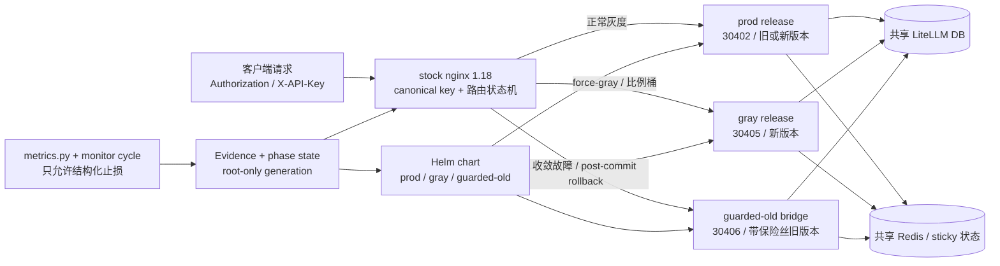

# LiteLLM 198 灰度升级手册

这是一份给变更执行人和 on-call 使用的操作手册。它说明灰度系统由什么组成、
每个阶段应该执行什么、发现问题如何把新请求切回旧版本。

设计约束和审计记录见：

- [升级设计方案](./litellm-198-gray-upgrade-plan.md)
- [单次执行记录模板](./litellm-198-gray-rollout-runbook.md)

本手册不包含真实 key、Secret、数据库连接串、Pod 日志或生产 values。生产执行必须
使用 root-only 的冻结 run 目录和本次 run 的 evidence 文件。

## 1. 功能架构

### 1.1 组件关系



### 1.2 路由优先级

推理入口的最终 upstream 按以下顺序判断：

1. 控制面和后台路径固定到 prod（收敛模式除外）。
2. `protected-prod`：永久留在 prod 的 master/admin/自动化 key。
3. `force-prod`：事故名单，优先级高于灰度名单和比例桶。
4. `force-gray`：指定验证 key，优先级高于比例桶。
5. canonical key 的稳定哈希比例桶：`0 / 1 / 5 / 10 / 50 / 100`。
6. 任何无法解析或不匹配的请求 fail-closed 到 prod。

`/v1/images/generations` 与 messages、responses、chat completions、completions、
embeddings 一样纳入推理路由。没有 canonical key 的请求不会因为匿名分桶而进入
gray。

### 1.3 三个运行版本

| 版本 | Service / NodePort | 用途 | 备注 |
|---|---:|---|---|
| prod | `litellm-proxy` / `30402` | 稳定版本或已验证的新版本 | 生产控制面默认入口 |
| gray | `litellm-proxy-gray` / `30405` | 目标版本灰度 | 独立 Helm release，关闭 Pod schema update |
| guarded-old | `litellm-proxy-guarded-old` / `30406` | 收敛和回滚的旧版本承载面 | 必须提前扩到全量容量并完成直连 smoke |

节点分工：198 是生产数据库所在节点；当前 4 个 prod LiteLLM Pod 分布为 198×2、225×2。225 的 Kubernetes hostname 是 `aiyjy-litellm-standby`，用于 clone、migration qualification、目标镜像启动和“不切流量”gray smoke，但不是空闲机器：它还有开发 Pod 和多批 `zero-*` Pod，并带 `dedicated=standby:NoSchedule`；固定到 225 的 workload 必须带匹配 toleration。仓库中的 gray 模板默认 pin 到 225，但这只是调度位置，不是资源隔离承诺。真正开始放量前必须重新检查两节点资源、磁盘和故障域，并生成单独的容量 values；不能把“225 能启动 Pod”当成“225 能单独扛全量”。

磁盘必须区分系统盘和数据盘。225 的 root filesystem 可能只有约 20 GiB，
但 K3s agent 和 `local-path` PVC 应落在 `/Data/rancher` 与
`/Data/rancher/storage`。执行时必须同时保存 `df -h / /Data`、live
`local-path-config`、PV 的 `.spec.local.path` 和 storage probe 结果；任一
clone PV 不在 `/Data`，或挂载文件系统可用空间低于 20 GiB，都立即停止。

三个 release 共享数据库，这是用户 key、预算、SpendLogs、ProxyModel 和 Team
状态一致的前提。schema 变更只能由独立 migration Job 完成，Pod 不得自行执行
Prisma migration。

无流量资格验证不直接写生产 Redis。先部署 `litellm-clone-redis`，让 stable/target
version-test 只连接这份隔离、无持久化实例，验证 sticky/cache 的序列化、TTL 和
跨版本读写；只有该 gate 明确 PASS 后，才允许讨论 gray 与 prod 共用生产 Redis。

### 1.4 状态机

```text
preflight
  ├─ bridge_preparing -> bridge_verified -> preflight   (需要先给旧 prod 加保险丝时)
  └─ normal_gray
       └─ convergence_ready
            └─ prod_offline_upgrading
                 └─ prod_verified
                      └─ committed

normal_gray / convergence_ready       -> rolled_back
prod_offline_upgrading / prod_verified -> aborting_to_bridge -> aborted
committed                              -> post_commit_bridge
                                         -> post_commit_prod_verified
                                         -> post_commit_rolled_back
```

phase、generation、名单、比例、bridge override 都保存在 active generation。每次
变更都会生成下一代目录，做 checksum、`nginx -t`、reload 和 post-reload 检查；
不能手改 `state.env` 或 `.map` 文件。

## 2. 目录和工具

从仓库根目录执行命令：

```bash
cd /path/to/carher-admin
export GRAY_ROOT=/root/litellm-gray-run
export GRAY_GATE_EVIDENCE_DIR="$GRAY_ROOT/evidence"
```

| 路径 | 用途 |
|---|---|
| `litellm-gray-rollout/chart/` | 三个 release 共用的参数化 Helm chart |
| `litellm-gray-rollout/k8s/` | clone、migration、NetworkPolicy 和 values 模板 |
| `litellm-gray-rollout/scripts/gray-*.sh` | 路由、phase、名单、比例和回滚事务 |
| `litellm-gray-rollout/scripts/*.py` | migration、runtime、metrics、渲染和 evidence 工具 |
| `litellm-gray-rollout/scripts/fixtures/nginx/` | 离线 nginx 路由 fixture |
| `litellm-gray-rollout/tests/` | 离线契约测试 |
| `$GRAY_ROOT/generations/` | root-only 的每代路由状态 |
| `$GRAY_ROOT/evidence/` | root-only 的结构化 gate/metrics evidence |

### 2.1 Evidence 契约

生产脚本不接受裸 `PASS` 或临时环境变量。默认从
`$GRAY_GATE_EVIDENCE_DIR/<gate>.json` 读取 mode `0600` 文件，并校验：

- `gate` 和当前动作匹配；
- `status` 为 `PASS`；
- `run_id`、`generation`、`config_checksum` 与 active generation 完全一致；
- `captured_at` 带时区且没有超过冻结的 freshness 窗口；
- 文件是 root-owned regular file，不是 symlink。

常用默认文件名：

| 动作 | Evidence 文件 |
|---|---|
| 进入 `normal_gray` | `gray_entry.json` |
| 调整比例 | `split_sample.json`、`split_monitor_continuity.json`；50% 以上再加 `split_capacity.json`、`split_bridge.json` |
| 准备收敛 | `convergence_stable.json`、`convergence_control_plane.json`、`convergence_bridge.json`、`convergence_bypass_disposition.json` |
| 宣布 prod 动态归零 | `prod_zero.json` |
| 标记新 prod 已验证 | `prod_verified.json` |
| 普通全局回滚 | `global_rollback.json` |
| 提交收敛 | `convergence_commit.json` |
| 收敛期间切 bridge | `convergence_abort.json` |
| committed 后三段回滚 | `post_commit_bridge.json`、`post_commit_prod_restored.json`、`post_commit_finish.json` |
| 关闭 run | `run_close.json` |

路由事务成功后 generation 和 checksum 会变化；下一步必须重新采集并审批 evidence，
不能复制上一代文件改名字。`GRAY_GATE_EVIDENCE_FILE` 只适合一个动作显式指定单个
文件；像 convergence prepare 这样一次校验多个 gate 的命令，应使用默认目录和标准
文件名。

## 3. 执行前检查

### 3.1 本地代码和 artifact 检查

```bash
python3 -m pytest litellm-gray-rollout/tests -q
python3 litellm-gray-rollout/scripts/verify-readiness.py --developer-mode
```

变更机还必须在真实工具版本上执行完整 readiness：

```bash
python3 litellm-gray-rollout/scripts/verify-readiness.py \
  --output /root/litellm-gray-run/readiness.json
```

生产模式缺少 Helm、stock nginx 1.18、ShellCheck 或 kubeconform 时会失败，不能用
`--developer-mode` 冒充生产通过。

### 3.2 生产前置条件

在运行 `gray-run-init.sh` 前，执行单必须已经冻结并 checksum 以下内容：

- prod、gray、guarded-old 的 198 本地 registry immutable digest（`127.0.0.1:5000/...@sha256:...`）；ACR VPC 地址仅用于 ACK，不用于 198/225 K3s；
- 同一份 chart package 和三套 values；
- migration ledger、clone A/B/C 结果和 `check-migration.py` PASS；
- 若本轮要建 `start_time` 索引：先用 `v195-concurrent-index-runner.sh inspect` 量一次
  DB 余量（最老事务、prepared 事务、正在跑的 VACUUM、两张表 dead tuple 占比、
  `LiteLLM_SpendLogs` 上次 vacuum 距今、索引体积），把五个阈值环境变量
  （`GRAY_INDEX_MAX_XACT_AGE_SECONDS`、`GRAY_INDEX_MAX_DEAD_TUP_PERCENT`、
  `GRAY_INDEX_MAX_VACUUM_AGE_SECONDS`、`GRAY_INDEX_FREE_BYTES`、
  `GRAY_INDEX_REQUIRED_BYTES`）按实测填进 Job，**占位符留在那里等于 FAIL**。
  `GRAY_INDEX_FREE_BYTES` 来自数据盘 `df`，必须 ≥ 索引体积 ×2；`create` 失败时 runner
  会自己把留下的 INVALID 索引 `DROP INDEX CONCURRENTLY` 掉并记在 `cleanup` 字段，
  只有连删都失败才需要人工收尾；
- callback、API surface、acct/ProxyModel/quota/sticky 对账；
- 30402 直连消费者分类：控制面写、控制面读、推理/探针；
- nginx base template、render/test/reload/post-reload hook；
- bridge 全容量 Ready、直连 smoke 和 NetworkPolicy probe；
- 变更窗口、负责人、观察时长和回滚审批。

任何 `FILL-`、占位 digest、生产公网镜像、未解释的 acct 漂移或未验证的旁路消费者
都必须停在 preflight。

## 4. 初始化一次灰度 run

先在 root-only 目录准备执行单和 live summary。二者不得包含明文 key 或 Secret。

```bash
PLAN=/root/litellm-gray-run/execution-plan.md
LIVE=/root/litellm-gray-run/live-summary.json

sha256sum "$PLAN" "$LIVE"
litellm-gray-rollout/scripts/gray-run-init.sh --help

litellm-gray-rollout/scripts/gray-run-init.sh \
  --run-id litellm-198-v195-YYYYMMDD \
  --execution-plan "$PLAN" \
  --live-summary "$LIVE" \
  --expected-live-sha256 '<LIVE_SHA256>' \
  --execution-plan-sha256 '<PLAN_SHA256>'
```

生产环境还必须预先设置并冻结 `GRAY_RENDER_CMD`、`GRAY_NGINX_TEST_CMD`、
`GRAY_RELOAD_CMD`、`GRAY_POST_RELOAD_CMD`、`GRAY_INITIAL_ROLLBACK_CMD`、
`GRAY_ABORT_VERIFY_CMD` 和 renderer/base-template/debug-token 的身份与 checksum。
脚本成功后应处于 `phase=preflight`。

查看当前状态：

```bash
litellm-gray-rollout/scripts/gray-phase.sh current
litellm-gray-rollout/scripts/gray-phase.sh verify
```

## 5. 启动 gray 和指定 key 灰度

### 5.1 部署 gray / bridge

三套 release 必须使用同一冻结 chart package，不要直接引用可变 chart 工作区。
values 模板中的 digest、Secret 和配置快照必须先由 `prepare-values.py` 生成到
root-only run 目录，再执行 Helm。`prepare-values.py` 还要求 `--ingress-cidr`：
宿主 nginx 走 NodePort，kube-proxy 把源地址呈现为**节点地址**，只有 selector
的 NetworkPolicy 会把真实流量黑洞掉。`/24` 或更窄，禁 `0.0.0.0/0`。

⚠️ **写一条 per 转发路径，不是 per 节点**，而且**不是节点的业务 IP**。2026-09-13
实测（`docs/nodeport-source-cidr-evidence.md`）：pod 侧看到的源地址跨节点是 198 的
`flannel.1`、同节点是 198 的 `cni0`，`10.68.13.198` **一次都没出现过**；
连 188 跨机打进来也被换成同一个 flannel 地址。填 `10.68.13.198/32` = 全站黑洞。

```bash
# ① 先产调度器证据（15 分钟有效期，所以这一步就在窗口里跑）。
#    三个 observations 计数**必须自己量过**再填：没量过的 0 读起来是干净的绿，
#    比没有证据更糟。--source 记下是直连生产控制面（direct:）还是 qualification
#    clone（clone:）量的。
#    摘要不用手算也**不许手算**：本脚本转调 prepare-values.py --emit-bindings，
#    余下参数原样透传给它（所以下面 prepare-values 的参数在这里也要写一遍）。
litellm-gray-rollout/scripts/collect-scheduler-evidence.py \
  --mode disabled \
  --source 'direct:<HOW-MEASURED>' \
  --duplicate-scheduler-runs 0 \
  --duplicate-background-jobs 0 \
  --unexpected-control-writes 0 \
  --evidence-output /root/litellm-gray-run/gray-scheduler-evidence.json \
  --profile litellm-gray-rollout/k8s/values-gray.yaml \
  --ingress-cidr '10.42.0.0/32' --ingress-cidr '10.42.0.1/32' \
  ...

# ② 再冻结 values。--scheduler-evidence 不能省略。
litellm-gray-rollout/scripts/prepare-values.py \
  --profile litellm-gray-rollout/k8s/values-gray.yaml \
  --ingress-cidr '10.42.0.0/32' \
  --ingress-cidr '10.42.0.1/32' \
  --scheduler-evidence /root/litellm-gray-run/gray-scheduler-evidence.json \
  ... \
  --output /root/litellm-gray-run/gray-values.yaml
```

> `--mode`：prod release 填 `primary`（它拥有 scheduler），gray 与 guarded-old
> 填 `disabled`（绝不能第二次跑起来）。脚本会和 profile 对账，填反直接红。
> 证据文件**拒绝覆盖**：陈旧证据悄悄变成新鲜证据正是这道闸门要防的，
> 重跑请先改文件名。

> 这两个值**执行当天必须重取**（集群重建后 flannel 的 `/32` 会变）：
> `ip -4 -o addr show dev flannel.1; ip -4 -o addr show dev cni0`。

⚠️ **frozen values 本身不能提前生成**：`prepare-values.py` 的
`MAX_SCHEDULER_EVIDENCE_AGE = timedelta(minutes=15)` 让 evidence 15 分钟就过期
（设计如此，防陈旧 values 偷渡漂移的 schema）。窗口前能定死的只有上面这两个 CIDR。

策略生效后、接真实流量前必须做完 §0.2 第 10 条的两条实测（阳性 + 证伪腿），
并把 Pod 侧实际看到的源地址回写执行单。
⚠️ 证伪腿**不能拿 188 当"未声明源"**——它经 NodePort 进来后同样被 SNAT 成
`10.42.0.0`，属于已声明，会读出假绿；要在 pod 网络里找一个客户端直连
`10.42.x.y:4000`。

```bash
CHART=/root/litellm-gray-run/litellm-gray-rollout-<VERSION>.tgz
NS=litellm-product
GUARDED_RELEASE='<FROZEN-GUARDED-OLD-RELEASE>'

helm upgrade --install litellm-product-gray "$CHART" -n "$NS" \
  --values /root/litellm-gray-run/gray-values.yaml \
  --reset-values

helm upgrade --install "$GUARDED_RELEASE" "$CHART" -n "$NS" \
  --values /root/litellm-gray-run/guarded-old-values.yaml \
  --reset-values
```

guarded-old 初始可以为 0 副本，但进入比例 `50%`、`100%` 或 convergence 前必须
扩到能独立承载全量的副本数，并完成 30406 直连验证。

如果 live prod 还没有 `DISABLE_SCHEMA_UPDATE=True`，先走 bridge 保险丝子链：

```bash
litellm-gray-rollout/scripts/gray-bridge-route.sh activate
# 等待 bridge_preparing 的 gate 和直连验证
litellm-gray-rollout/scripts/gray-bridge-route.sh verified
# 排空旧 prod、离线加保险丝并验证新 prod 后：
litellm-gray-rollout/scripts/gray-bridge-route.sh deactivate
```

### 5.2 进入 normal_gray

gray 直连 smoke、runtime gate、migration gate、selector/digest 校验都通过后：

```bash
litellm-gray-rollout/scripts/gray-phase.sh set normal_gray
```

`gray-phase.sh` 在生产模式会要求与当前 generation 绑定的 gate evidence；不要用
环境变量伪造 gate。

### 5.3 指定 key 送 gray

key 只通过 stdin 输入，不能写在命令行参数、Git、审计日志或文档中：

```bash
read -r -s -p 'Virtual key: ' KEY
printf '\n'
printf '%s\n' "$KEY" | \
  litellm-gray-rollout/scripts/gray-key-route.sh force-gray
unset KEY
```

验证名单和路由时只显示 sid，不显示 key：

```bash
litellm-gray-rollout/scripts/gray-key-route.sh list
litellm-gray-rollout/scripts/gray-key-route.sh verify
```

验证该 key 的新请求命中 gray 后，再做真实 payload、SSE、Responses、embedding、
image 和 SpendLogs 对账。指定 key 不会被比例调整冲走。

### 5.4 单 key 迅速切回 prod

发现某个 key 在 gray 有问题时：

```bash
read -r -s -p 'Virtual key to return to prod: ' KEY
printf '\n'
printf '%s\n' "$KEY" | \
  litellm-gray-rollout/scripts/gray-key-route.sh force-prod
unset KEY
```

这会在一个路由事务中清掉该 key 的其它名单、加入 `force-prod`、执行 nginx test、
reload 和 post-reload 检查。它只保证新请求切回 prod；已经建立的 gray SSE/长请求
不会被 reload 迁移，需按连接排空规则观察。

恢复该 key 到普通灰度前，先确认故障原因已经关闭，再使用 `force-gray`，不要直接
手改 map 文件。

## 6. 比例放量

比例只能使用 `0、1、5、10、50、100`。每一档都要有当前 generation 的 sample
evidence；`50%` 以上还需要容量和 guarded-old evidence。

```bash
litellm-gray-rollout/scripts/gray-split-update.sh 1
# 观察一个批准窗口并完成 metrics / SpendLogs / error 对账
litellm-gray-rollout/scripts/gray-split-update.sh 5
litellm-gray-rollout/scripts/gray-split-update.sh 10
litellm-gray-rollout/scripts/gray-split-update.sh 50
litellm-gray-rollout/scripts/gray-split-update.sh 100
```

不要把比例设成任意数字，也不要同时运行名单事务和比例事务。脚本会在锁内创建
下一代配置并自动做 nginx test/reload。

### 6.1 metrics 监控周期

放量**之前**先冻结基线（`split=0` 时做一次，产物整轮复用）。100% 阶段没有可比的
prod 对照组，止损全靠它；手写的基线进不来：

```bash
python3 litellm-gray-rollout/scripts/collect-metrics.py \
  --access-log /root/litellm-gray-run/raw/access.log \
  --emit-baseline \
  --run-id '<RUN_ID>' \
  --generation '<GENERATION>' \
  --config-checksum '<CONFIG_CHECKSUM>' \
  --phase preflight \
  --rollout-percent 0 \
  --output /root/litellm-gray-run/evidence/baseline.json
```

每个 `uri_class` 不足 100 样本会直接拒绝——换更长/更有代表性的窗口重采，
不要靠调低 `--baseline-min-samples` 蒙混过去。

每次周期先用真实 access log 和新鲜的 hard-error/backend-health/SpendLogs 快照生成
脱敏输入，再由 monitor cycle 保存结构化 evidence 并调用 dispatcher：

```bash
python3 litellm-gray-rollout/scripts/collect-metrics.py \
  --access-log /root/litellm-gray-run/raw/access.log \
  --hard-errors /root/litellm-gray-run/raw/hard-errors.json \
  --backend-health /root/litellm-gray-run/raw/backend-health.json \
  --spend-reconciliation /root/litellm-gray-run/raw/spend.json \
  --baseline /root/litellm-gray-run/evidence/baseline.json \
  --run-id '<RUN_ID>' \
  --generation '<GENERATION>' \
  --config-checksum '<CONFIG_CHECKSUM>' \
  --phase normal_gray \
  --rollout-percent 10 \
  --output /root/litellm-gray-run/metrics-input.json

litellm-gray-rollout/scripts/gray-monitor-cycle.sh \
  --input /root/litellm-gray-run/metrics-input.json \
  --evidence-dir /root/litellm-gray-run/evidence
```

cron/systemd 只能调用这条编排链，不能直接调用 `gray-global-rollback.sh`、
`gray-convergence-abort.sh` 或 dispatcher。prod backend health 未明确为 true 时，
硬错误只会产生 `alert_only`，不会把流量切到未验证的 prod。

### 6.2 放量前的 deadman gate

每个成功周期会往 `$GRAY_GATE_EVIDENCE_DIR/monitor-heartbeat.jsonl` 追加一条心跳。
这条账本是唯一能证明"漏过的周期"的东西：metrics 文件只记录**跑过**的周期，调度器
死了的窗口和一切正常的窗口在文件系统上长得一模一样。

每次 `gray-split-update.sh <N>`（N>0）之前跑一次，把上一段观察窗口的连续性变成
gate 证据：

```bash
python3 litellm-gray-rollout/scripts/check-monitor-continuity.py \
  --ledger /root/litellm-gray-run/evidence/monitor-heartbeat.jsonl \
  --run-id "$GRAY_RUN_ID" \
  --generation "$GRAY_GENERATION" \
  --config-checksum "$GRAY_CONFIG_CHECKSUM" \
  --window-start '<上一次放量的 UTC 时间戳>' \
  --cycle-interval-seconds '<执行单冻结的调度间隔>' \
  --output /root/litellm-gray-run/evidence/split_monitor_continuity.json
```

`--cycle-interval-seconds` 抄执行单里冻结的那个值，不要现场估。任一缺口超过
`间隔 ×(1+--max-missed-cycles)`（默认允许漏 1 次）、窗口内一个周期都没有、心跳
run_id 不是本次 run、或窗口内有 `metrics_status=FAIL` 的周期，都会写出
`status=FAIL` 并返回 1，`gray-split-update.sh` 随即拒绝放量。

补救办法是**把监控修好、重新观察一个完整窗口**，不是调大 `--max-missed-cycles`
把缺口盖过去。

## 7. 全量收敛

只有 gray 稳定、`split=100`、`force-prod` 为空、控制面/acct mutation 已冻结或改道、
所有 30402 旁路已分类、guarded-old 全容量 Ready，并且 `prod_zero` evidence 通过后，
才能收敛。

```bash
# 1. 准备 convergence mode：一次事务冻结路由并让整个 /pro/ 新请求到 gray
litellm-gray-rollout/scripts/gray-convergence-prepare.sh

# 2. 消费当前 convergence_ready generation 的 prod_zero evidence
litellm-gray-rollout/scripts/gray-phase.sh set prod_offline_upgrading

# 3. nginx 保持 100% gray，离线升级 prod。以下是示意，实际 values/package 必须用冻结副本。
#    先过删除集 gate：`--reset-values` 换 chart 会删掉旧 release 拥有、新 chart 不渲染的对象
#    （PDB、额外 Service/ConfigMap 都在其列），而 rollout status 看不出来。
helm get manifest litellm-product-proxy -n litellm-product \
  > /root/litellm-gray-run/prod-live-manifest.yaml
helm template litellm-product-proxy /root/litellm-gray-run/chart.tgz \
  -n litellm-product --values /root/litellm-gray-run/prod-target-values.yaml \
  > /root/litellm-gray-run/prod-target-manifest.yaml
litellm-gray-rollout/scripts/check-release-deletion-set.py \
  --live-manifest /root/litellm-gray-run/prod-live-manifest.yaml \
  --target-manifest /root/litellm-gray-run/prod-target-manifest.yaml \
  --release litellm-product-proxy --namespace litellm-product \
  --run-id "$GRAY_RUN_ID" --generation "$GRAY_GENERATION" \
  --approval /root/litellm-gray-run/prod-deletion-approval.json \
  --output /root/litellm-gray-run/prod-deletion-set.json
#    再过 Pod spec 形状 gate：删除集看的是对象，补丁活在 Pod spec 内部（40 个
#    volumeMount / 38 个 subPath 单文件覆盖 / postStart）。这些 ConfigMap 一个都不删，
#    所以删除集绿、rollout status 绿、/health 200 探针也绿，而补丁全部静默失效。
#    live 一侧必须是 kubectl 读的活对象，不是 helm get manifest（后者会跟 set image
#    造成的漂移对不上，喂错就是拿目标跟自己比）。
kubectl -n litellm-product get deploy litellm-proxy -o yaml \
  > /root/litellm-gray-run/prod-live-deployment.yaml
#    ConfigMap 快照是为了摘要「挂载进去的字节」：chart 的 CM 名字是内容寻址的
#    （<release>-<snapshot>-<checksum>），现网是手写的，所以同一份字节会换名字出现，
#    不喂快照时 40 条挂载会全部读成 changed，审批退化成 40 行「同一份字节」橡皮章。
#    不喂 = 什么都不 inert（工具行为退回旧版），只是审批会很长；喂错（例如喂渲染出来的
#    CM）会硬红 LIVE_CONFIGMAPS_ARE_NOT_LIVE_OBJECTS。0600、用完即删；输出只有 sha256。
umask 077 && kubectl -n litellm-product get configmap -o yaml \
  > /root/litellm-gray-run/prod-live-configmaps.yaml
litellm-gray-rollout/scripts/check-pod-spec-shape.py \
  --live /root/litellm-gray-run/prod-live-deployment.yaml \
  --target /root/litellm-gray-run/prod-target-manifest.yaml \
  --live-configmaps /root/litellm-gray-run/prod-live-configmaps.yaml \
  --name litellm-proxy --namespace litellm-product \
  --run-id "$GRAY_RUN_ID" --generation "$GRAY_GENERATION" \
  --approval /root/litellm-gray-run/prod-pod-spec-approval.json \
  --output /root/litellm-gray-run/prod-pod-spec-shape.json
shred -u /root/litellm-gray-run/prod-live-configmaps.yaml
kubectl apply --dry-run=server -f /root/litellm-gray-run/prod-target-manifest.yaml
if kubectl diff -f /root/litellm-gray-run/prod-target-manifest.yaml; then rc=0; else rc=$?; fi
[ "$rc" -le 1 ] || { echo "FATAL: kubectl diff error rc=$rc"; exit 1; }
helm upgrade litellm-product-proxy /root/litellm-gray-run/chart.tgz \
  -n litellm-product \
  --values /root/litellm-gray-run/prod-target-values.yaml \
  --reset-values --atomic=false
kubectl -n litellm-product rollout status deploy/litellm-proxy --timeout=600s

# 4. 校验完整 workload digest、Ready 副本和 30402 全 surface smoke
litellm-gray-rollout/scripts/gray-phase.sh set prod_verified

# 5. 一次事务完成 mode=0、比例 0%、清空 force-gray，并把新请求交给已升级 prod
litellm-gray-rollout/scripts/gray-convergence-commit.sh
```

commit 成功后观察 gray 活跃连接排空，再按冻结 package 将 gray release 缩到 0。
不要在 prod 滚动期间把 nginx 切回 prod，也不要只运行 `gray-phase.sh set ...` 绕过
专用事务脚本。

### 7.1 排水预算

排空不是「等一会儿」，是一条算得出来的预算：

```text
terminationGracePeriodSeconds >= drain.preStopSeconds + drain.streamDrainSeconds
nginx proxy_read_timeout      == drain.streamDrainSeconds
当前：600 >= 30 + 570，nginx 570s
```

preStop 的 30s 让 Endpoints/NodePort 先停送新请求；SIGTERM 之后只剩 570s 给在途
SSE 收尾，到点 SIGKILL。**nginx 不能承诺等得比 Pod 活得久**——那不会让流更长，只会
把干净的 504 换成没有错误码的中途截断。chart 会直接拒绝不满足这两条关系的 values。

放量前从 access log 量出各 `uri_class` 的 `upstream_response_time` p100 写进执行单。
超过 570s 就同步抬高 grace 和 nginx `proxy_read_timeout`（只改一个等于拧断关系），
或者明确接受截断并记录受影响比例与消费者。

## 8. 故障处理和回滚

先查看 phase，再按 phase 选动作。不要凭感觉执行普通 rollback。

```bash
litellm-gray-rollout/scripts/gray-phase.sh current
```

| 当前 phase | 安全动作 | 目标承载面 |
|---|---|---|
| `normal_gray` | `gray-global-rollback.sh` | 健康旧 prod |
| `convergence_ready` | `gray-global-rollback.sh` | 健康旧 prod |
| `prod_offline_upgrading` | 保持 gray；gray 也失败时 `gray-convergence-abort.sh` | guarded-old |
| `prod_verified` | 保持 gray；gray 也失败时 `gray-convergence-abort.sh` | guarded-old |
| `committed` | `gray-post-commit-rollback.sh` 三阶段 | guarded-old，再恢复旧 prod |

### 8.1 普通灰度全局回滚

只允许在 `normal_gray` 或 `convergence_ready` 且 prod 完整健康时执行：

```bash
litellm-gray-rollout/scripts/gray-global-rollback.sh
```

脚本会在一次事务中把 `force-gray` 批量转为 `force-prod`、清零比例、关闭
convergence mode、reload 并写入 `rolled_back`。确认 gray 新连接停止增长并排空后，
才允许将 gray Helm release 缩容。下一次灰度必须新建 run id。

### 8.2 收敛期间切 guarded-old

prod 正在离线升级或新 prod 尚未完成 smoke 时，禁止普通全局回滚：

```bash
litellm-gray-rollout/scripts/gray-convergence-abort.sh
```

只有当前 evidence 同时证明 gray 不健康、guarded-old 健康，脚本才会把全部新请求切到
bridge。若 bridge 验证失败，phase 会停在 `aborting_to_bridge`，保持该承载面和 mutation
freeze；修好 bridge 后用同一 run、同一冻结验证 hook 重试，不得手工改 route。

### 8.3 committed 后回滚

新版本已经成为 prod 后，不能在 serving prod 上直接 `helm rollback`：

```bash
# 前提：guarded-old 已扩到全量容量并完成直连 smoke，且 evidence 已绑定当前 generation。
litellm-gray-rollout/scripts/gray-post-commit-rollback.sh prepare
# 此时新请求在 guarded-old。证明新 prod 动态归零后，离线 helm rollback 到冻结的
# 带 DISABLE_SCHEMA_UPDATE=True 的旧 prod revision，并完成全 surface smoke。
litellm-gray-rollout/scripts/gray-post-commit-rollback.sh prod-restored
# prod-restored 仍保持 bridge；旧 prod、旁路/acct 对账和恢复清单通过后才切流量。
litellm-gray-rollout/scripts/gray-post-commit-rollback.sh finish
```

三步对应 `committed → post_commit_bridge → post_commit_prod_verified →
post_commit_rolled_back`。任一步失败都保持 bridge，不允许手动切回未经验证的 prod。

## 9. 结束和归档

只在终态 `committed`、`rolled_back`、`aborted` 或 `post_commit_rolled_back`，并且观察期、
SpendLogs 对账、acct/quota/registry/sticky 对账、补偿队列和 bridge 保留审批都完成后：

```bash
litellm-gray-rollout/scripts/gray-run-close.sh
```

它会归档 active generation。终态 run 不得复用；重新灰度必须新的 run id、证据和
generation。旧 digest、guarded-old、migration ledger、clone evidence 和配置快照至少
保留到批准的峰谷观察结束。

## 10. 常用排障

| 现象 | 先检查 | 处理 |
|---|---|---|
| `phase ... is illegal` | `gray-phase.sh current` | 按状态机走专用入口，不能用通用 `phase set` 绕过 |
| `gate evidence is stale` | evidence 的 `captured_at`、run/generation/checksum | 重新采集当前 generation 的 evidence |
| key 不进 gray | canonical key、`gray-key-route.sh list`、route fixture | 确认没有同时在 protected/force-prod，重新走 stdin 操作 |
| 比例更新被拒绝 | 当前 phase、sample/capacity/bridge evidence | 先完成对应 gate，不能强制写比例 |
| nginx reload 失败 | candidate、`nginx -t`、transaction journal | 等脚本自动恢复上一代；不要手工覆盖 active symlink |
| 普通 rollback 被拒绝 | 当前是否在 `prod_offline_upgrading`/`committed` | 使用 convergence abort 或 post-commit rollback |
| 收敛后仍有 30402 连接 | 旁路清单、`conntrack`/`ss`、acct mutation | 不升级 prod，恢复旁路冻结/改道并重新生成 `prod_zero` |

## 11. 禁止事项

- 不要把 key 放在命令行参数、shell history、日志、Git 或截图中。
- 不要手改 `.map`、`state.env`、`split.conf`、`convergence-mode.map` 或 active symlink。
- 不要直接调用 dispatcher、rollback、abort 作为定时任务入口。
- 不要用 `test -s force-prod.map` 判断名单为空，应使用 `gray-key-route.sh verify`。
- 不要在 serving prod 上直接 `helm rollback`。
- 不要手动 `kubectl delete pod`；使用 Helm/Deployment rolling update 和 rollout status。
- 不要把 full dump 当作在线 DDL 回滚；迁移失败按 ledger 对账和 forward-fix 处理。
