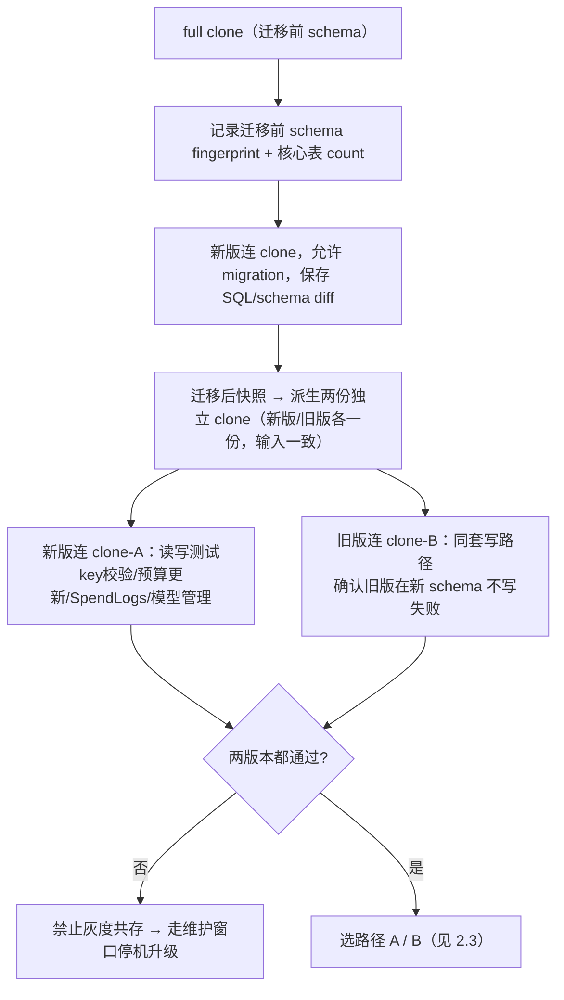

# LiteLLM 198 Helm 灰度升级方案（指定 key + 比例分桶 · 用户无感）

> 关联 `docs/litellm-safe-upgrade-canary-plan.md`（隔离 canary 通用纪律）——**注意：该文档描述的 `prisma-migrate`/`wipe-db-config-rows` initContainer 属于另一套部署；198 product 无 initContainer**，见第 1 节实测。
> **本次目标版本 v1.95.0**，现场候选固定为
> `127.0.0.1:5000/litellm-carher@sha256:50e647bd5ee32010317378335d5830dbbcd793b4dd1a9a4460bd34a9272cda95`。
> schema 相对生产 v1.90.2 仍是向前扩展，但包含一个 13 GB 日志索引，
> 因此“列兼容”和“索引在线安全”必须分开审批（见 2.2/2.3）。
>
> **当前状态：仓库内开发产物已落盘；本地 Python 全套、ShellCheck、Helm lint/template、Chart 可复现打包和 nginx 路由模型测试均通过；仍不可直接执行生产升级。** 执行前必须在 198 变更机完成 0.2 的 live gate（stock nginx 1.18 真实 HTTP fixture、server dry-run/diff、clone migration、NetworkPolicy、runtime/account/30402 旁路对账）。禁止临场手写生产脚本或直接操作 nginx/Helm。

## 0. 目标与硬约束

**目标**：198 `litellm-product` LiteLLM 从 prod 版本平滑升到新版本：

1. **用户无感** — 不改 base_url / key / 任何配置。
2. **指定 key 先行灰度** — 运维可主动把某几把 key 定向送 gray（force-gray），不影响其它用户（第 3 节状态机）。
3. **单 key 快速切回** — 某 key 在 gray 出问题，一条命令原子转入 force-prod + reload 即停止其新增 gray 流量；目标是正常情况下秒级、以 reload 后验证为准，其它灰度用户不受影响。
4. **自动灰度部分用户** — 指定 key 验证通过后，按比例把一部分用户「稳定」迁到新版，其余留旧版。
5. **双版本共存** — 新旧 Pod 同时在线，随时调比例/名单、可回滚。
6. **单库不分裂** — 共用同一 litellm DB；靠「禁止新版改表 + 前置 migration gate」隔离，不分库（第 6 节）。
7. **Helm 可持续管理** — 灰度作为独立 Helm release，参数化，不手抄 chart（第 4 节）。

**硬约束（违反即停）**：

| 约束 | 原因 |
|------|------|
| gray 主容器带 `DISABLE_SCHEMA_UPDATE=True`，且**校验 entrypoint 实际未触发 prisma migrate**（不止 grep 变量名）| 198 DB schema 写入唯一入口是主容器 entrypoint 的 prisma；禁了它才不会改坏共享库 |
| gray Pod label **不匹配 prod Service 完整 selector**（不止删一个已知 label）| 防 gray Pod 被 prod Service 选中，真实流量误入 |
| gray 固定 release/resource 名为 `litellm-product-gray` / `litellm-proxy-gray`，Service selector 为 `app: litellm-proxy-gray`；版本只由 digest + run evidence 表达 | 与 prod selector `app: litellm-proxy` 隔离，也避免每次升级复制一套带版本号的 chart/release |
| 现存历史 gray（如 `litellm-proxy-gray-v192`）在新 release 前必须核验 selector/Service、确认 0 副本且不被任何入口使用，并纳入归档清单 | 防旧手工 gray 被误扩容、重复执行 scheduler 或成为未审计的第三个版本 |
| prod/gray/guarded-old 的 config/callback ConfigMap 必须 **release-scoped + 内容 checksum 命名 + `immutable: true`**，Pod 只引用自己的快照；共享 Secret 若不版本化则整个 run 冻结轮换 | 旧 bridge 镜像固定但挂载的共享 ConfigMap 被新版覆盖时，rollback 面会静默变质；独立 Helm release 复用同名资源还会发生 ownership 冲突 |
| 灰度前必须过 **expand/contract migration gate**（第 2 节）：新旧版本都能在目标 schema 上跑真实读写 | 保险丝只挡「新版不主动改表」，挡不住「新版依赖旧库没有的列」或「旧版在迁移后 schema 写入失败」 |
| 流量按 **canonical key 哈希**分桶，不是按 request | 按 request 分会让同用户每请求跳版本，打断 sticky cache / Responses 会话 |
| 路由是**五个判定层 + fail-closed 兜底**：控制面路径 → protected-prod key → incident force-prod → force-gray → 比例分桶 → 兜底 prod（第 3 节）| 指定 key 灰度靠 force-gray，快速切回靠 force-prod；保护 key 不混入 incident 名单，调比例不冲走它们 |
| 正常灰度期 **protected-prod、incident force-prod、force-gray 两两互斥**，控制面路径固定 prod；全量收敛前必须显式进入 `convergence_mode=1`，一次把整个 `/pro/` 提升到 gray | 防日常灰度误伤控制面；同时解决 prod 离线时 `/v1/models`/UI/健康检查仍打旧 prod 的矛盾 |
| 指定 key 名单**只由 `litellm-gray-rollout/scripts/gray-key-route.sh` 维护**：key 走隐藏 stdin、目录700/文件600 root-only 不进 Git、三名单目标状态整组事务、nginx -t 通过才 reload | 防 key 泄露 / 写坏名单 / 两个 reload 竞态 / 忘 reload（第 3.5 节）|
| **5.7 收敛前 incident force-prod 名单必须为空**，且 gray 已通过控制面/UI 回归后才能开启 `convergence_mode=1` | incident force-prod 非空说明仍有新版兼容问题；convergence mode 会让 protected/control/UI 也进入 gray，必须先完成明确回归而非靠“冻结流量”掩盖 |
| 全量收敛用**完整 manifest 固定所有 schema 敏感容器同一 immutable digest**，不用 `set image` 只改主容器 | 防新旧组件混装；防依赖「当前只有一个容器」的脆假设 |
| 198 K3s 的 clone/灰度镜像必须使用现场已验证的 **198 本地私有 registry 别名 `127.0.0.1:5000` + immutable digest**；阿里云 ACK 才使用 ACR VPC。拒绝公网仓库和 tag | 198/225 位于 IDC，实测无法解析 ACR VPC 域名；225 的 K3s runtime 已验证能通过该别名拉取 198 registry 镜像，避免公网与跨环境依赖 |
| 收敛顺序：**nginx 保持 100% gray → prod 无流量时离线升级 → 验证 prod 全新版 → nginx 切回 prod → gray 排空后缩容**；禁止「先切回旧 prod 再滚动升级」| 后者会让 gray 用户瞬间弹回旧版，且 prod 滚动期新旧 Pod 混在一个 Service，同 key 乱跳——砸核心约束 |
| 回滚**比例归零 + force-gray 批量转 incident force-prod（一次事务）→ reload → 等 gray 活跃连接排空 → 再缩容**；禁止只改比例或直接 scale=0 | force-gray 优先级高于比例；只归零比例仍会有新流量进 gray，直接缩容会断长请求 |
| 进入 `convergence_mode=1` 前，**guarded-old rescue bridge 必须已按全量容量 Ready 并保持到 prod 提交完成**；收敛中不得用普通 gray rollback 直接切回正在离线升级/可能混装的 prod | 若 prod 升级失败或 gray 在收敛期突发故障，必须有一个完整、已验证的旧版本承载面；否则“全程单一完整版本”只覆盖成功路径 |
| 禁止手动 `kubectl delete pod` 正在服务的旧 Pod | 零中断规则 |
| **Path A 顺序固定**：先确保所有 serving 旧版 Pod 都带 `DISABLE_SCHEMA_UPDATE=True`，**之后**才允许 migration Job 迁生产；若 live prod 缺保险丝，须经 guarded-old bridge 排空后离线修改（2.3）| 防迁移后某个旧版 Pod 重启，用旧 Prisma schema 再次 db push 打回/冲突；同时避免 env rollout 切断活跃 SSE |
| 若旧 prod 尚无保险丝，Path A 必须经 **guarded-old bridge**（旧 digest + 保险丝）排空原 prod 后再离线改 env；禁止直接滚动重启有活跃 SSE 的 prod | env 变更必然重建 Pod；当前 surge=0/unavailable=1、grace=30s 不能支撑“用户无感”承诺 |
| **additive DDL ≠ 在线安全**：migration Job 必须过「在线 DDL gate」（2.2）| CREATE INDEX / 加约束 / 部分 ALTER 虽 schema 兼容，仍可能 ACCESS EXCLUSIVE 长持锁、重写大表，阻塞 SpendLogs/预算更新 |
| 灰度前必须过 **runtime compatibility gate**（2.4）：现网 callbacks/monkey-patches、Redis sticky/cache keyspace、后台任务与三类协议均在目标镜像验证 | PostgreSQL schema 兼容不代表 198 的自定义补丁、共享 Redis 序列化和异步任务仍兼容；失败可能是静默路由/计费回归 |
| **5.7 收敛前必须过「全部 prod 流量归零 gate」（5.6）**：推理 100% gray ≠ prod 已无业务流量 | 正常模式下控制面/UI/protected 仍进 prod，另有绕过 nginx 直连 30402 的消费者；必须先开 convergence mode，再清旁路并动态验尸 |
| 30402 旁路必须按**控制面写 / 控制面读 / 推理或探针**分类并逐项处置；不能把“仓库 grep 命中”或“暂停 cron”当作完成 | `/model/new`、`/key/update`、quota pause/resume 会改变共享 DB/ProxyModel 或内存 registry；convergence mode 只影响 nginx，不能自动改变直连脚本 |
| `chatgpt-acct-*` 池是共享上游运行时状态，gray/prod 必须对账号注册、quota take/offline、sticky/cooldown 和 model registry 得到同一解释 | K8s 中存在多于当前启用集合的 acct Deployment；只看 `ProxyModel` 行数或只看 Pod ready 会漏掉注册漂移、过期账号和跨版本热加载问题 |
| 本方案只升级 `litellm-proxy`，不顺带滚动 `chatgpt-acct-*` 上游 Pod | acct 池有独立的 auth/PVC/quota 生命周期；把 proxy 升级和账号池重启捆绑会扩大影响面并破坏 quota/sticky 归因。若 acct manifest/image/config 在窗口内发生变化，必须单独审批并重新跑 1.1/2.4 对账 |

### 0.1 开发产物与固定路径

以下路径是开发接口，不再允许实现时另起一套命名。缺任一产物或测试，方案保持“不可执行”：

| 路径 | 责任 |
|------|------|
| `litellm-gray-rollout/scripts/gray-run-init.sh` | 从受控 live nginx 摘要和冻结执行单创建新 run id、首个 `preflight` generation 与 root-only 工作目录；拒绝复用终态 run |
| `litellm-gray-rollout/scripts/gray-key-route.sh` | 单 key `force-gray/force-prod/protect-prod/remove/list/verify`，隐藏输入、目标状态事务、脱敏审计 |
| `litellm-gray-rollout/scripts/gray-phase.sh` | run/generation/phase 状态机与共享事务库；phase/config checksum 不一致时 fail-closed |
| `litellm-gray-rollout/scripts/gray-global-rollback.sh` | prod 仍完整健康时，普通灰度全局回滚 |
| `litellm-gray-rollout/scripts/gray-split-update.sh` | 校验 phase、样本和容量后原子更新比例；convergence 或 prod 离线阶段拒绝运行 |
| `litellm-gray-rollout/scripts/gray-bridge-route.sh` | 仅在批准 phase 中把全部新流量原子切入/切出 guarded-old bridge，用于 Path A 保险丝准备 |
| `litellm-gray-rollout/scripts/gray-post-commit-rollback.sh` | `committed` 后按 bridge-first 三事务完成旧版回滚路由，禁止 serving prod 直接滚动回旧版 |
| `litellm-gray-rollout/scripts/gray-run-close.sh` | 审批后归档终态 active generation，释放下一轮 run；禁止人工删除 active |
| `litellm-gray-rollout/scripts/gray-convergence-prepare.sh` | 原子校验收敛前置条件并提交 `mode=1 + phase=convergence_ready + 路由冻结` |
| `litellm-gray-rollout/scripts/gray-convergence-commit.sh` | `prod_verified` 后原子切回新版 prod 并写 `committed` |
| `litellm-gray-rollout/scripts/gray-convergence-abort.sh` | prod 离线阶段把全部新流量切 guarded-old bridge，完成后写 `aborted` |
| `litellm-gray-rollout/scripts/gray-auto-dispatch.sh` | 指标止损唯一入口；按 phase 和后端健康选择 rollback、保持 gray 或 abort，绝不由监控脚本直接改路由 |
| `litellm-gray-rollout/scripts/gray-monitor-cycle.sh` | 单次 fail-closed 监控周期：消费冻结 metrics 输入，先原子保存结构化结果，再调用 dispatcher；成功后向 `monitor-heartbeat.jsonl` 追加一条心跳；cron/systemd 频率与采集命令由执行单冻结 |
| `litellm-gray-rollout/scripts/check-monitor-continuity.py` | 放量前的 deadman gate：从心跳账本证明观察窗口内没有漏过周期，输出 `split_monitor_continuity` gate 证据，有缺口就 fail-closed |
| `litellm-gray-rollout/scripts/render-production-nginx.py` | 从审核冻结的完整 live nginx 模板与指定 generation 渲染真实生产候选；安全嵌入 split 规则，原子替换候选文件 |
| `litellm-gray-rollout/scripts/collect-runtime.py` | 把同批次 callback/API surface/30402/acct/Redis/scheduler/mutation 快照组装为带来源时间与 checksum 的 runtime evidence |
| `litellm-gray-rollout/scripts/audit-runtime.py` | 生成 callback/patch、API surface、30402 旁路和 acct/Redis/SpendLogs 脱敏审计快照 |
| `litellm-gray-rollout/scripts/collect-job-attestation.py` / `collect-migration-evidence.py` | 先把 runner 结果绑定 Job/Pod UID、实际 imageID、runner checksum、DB fingerprint、run/generation，再组装 normalized schema、DDL 与 clone A/B/C 证据 |
| `litellm-gray-rollout/scripts/check-migration.py` | clone、schema diff、DDL ledger、锁等待和新旧版本 A/B/C 兼容证据 |
| `litellm-gray-rollout/scripts/check-release-deletion-set.py` | 换 chart 前对 live release manifest 与目标渲染做对象级 diff；每个待删对象必须有具名消费者，否则 fail-closed |
| `litellm-gray-rollout/scripts/collect-metrics.py` | 从带 `ts=` 的 nginx 日志最近 5 分钟窗口及带时间/checksum 的辅助快照生成脱敏、状态绑定的 metrics 输入 |
| `litellm-gray-rollout/scripts/metrics.py` | 按 `pool_label + uri_class` 计算样本量、5xx、p95/p99，并输出 dispatcher 可消费的结构化结果 |
| `litellm-gray-rollout/scripts/prepare-values.py` / `prepare-migration-run.py` | 从 live workload/config/callback 和 clone qualification 生成不可直接误用的冻结 values/Job 产物 |
| `litellm-gray-rollout/scripts/migration-ledger-runner.py` / `compatibility-runner.py` | Job 内固定执行受审 `ADD COLUMN` ledger 与 rollback-only 新旧版本 A/B/C 数据路径探针 |
| `litellm-gray-rollout/scripts/verify-readiness.py` | 生产模式 fail-closed 汇总 pytest、ShellCheck、Helm、正式 renderer nginx HTTP fixture 和固定 K8s 版本 kubeconform 证据 |
| `litellm-gray-rollout/scripts/fixtures/nginx/` | nginx 1.18.0 完整候选配置和假 key 路由矩阵 |
| `litellm-gray-rollout/chart/` | prod/gray/guarded-old 共用参数化 chart；ConfigMap release-scoped、checksum 命名、immutable |
| `litellm-gray-rollout/k8s/` | prod/gray/guarded-old values、clone DB/dump/restore、clone/production migration、NetworkPolicy 与测试 Pod 模板 |
| `litellm-gray-rollout/docs/litellm-198-gray-rollout-runbook.md` | 冻结执行单模板；执行时填入 release/service/digest/owner/窗口/revision/证据路径 |
| `litellm-gray-rollout/tests/` | 路由状态机、证据审计、migration、chart、nginx fixture 和失败恢复的 pytest 契约测试 |

所有 shell 入口共用同一事务库，禁止分别实现 generation/symlink/reload 逻辑。参数化 chart 必须在 schema/测试中拒绝非 198 本地 registry repository、非 digest 镜像、未知 workload/initContainer 和未填占位符。这里的本地 registry 别名是 `127.0.0.1:5000`；ACR VPC 只适用于 ACK，不适用于 198/225 这套 IDC K3s。

### 0.2 Artifact readiness gate

执行前必须同时满足：

1. 上述产物已落盘；必须由 `verify-readiness.py` 生成 `0600` 结构化 PASS。生产模式缺 `shellcheck`、`helm`、stock nginx 或固定版本 `kubeconform` 直接非零；`--developer-mode` 只能得到 `DEVELOPER_PASS`，不能执行上线。正式 HTTP fixture 必须使用 `render-production-nginx.py` 的产物，不接受独立测试模板替代。
2. `gray-run-init.sh` 能从冻结输入建立首个 `preflight` generation，拒绝已有 active run、权限不合格和 live 摘要漂移。每次事务必须持久化 `transaction-in-progress` journal；SIGTERM/SSH 中断后由 signal trap 或下一入口启动恢复旧 active/live nginx，不能只处理 hook 正常返回失败。hook 命令引用的脚本/二进制也必须按文件 checksum 冻结。终态只能通过 `gray-run-close.sh` 审批归档，禁止人工删除 active。其它路由测试覆盖并发 `flock`、kill-point、render/`nginx -t`/reload/post-check 回切和 phase/checksum 损坏。
3. `litellm-gray-rollout/scripts/gray-convergence-prepare.sh` 是进入 `convergence_mode=1` 的唯一入口；不得手工分别改 mode、split、名单和 phase。
4. `litellm-gray-rollout/scripts/gray-auto-dispatch.sh` 是自动止损的唯一写入口；`gray-monitor-cycle.sh` 是调度器唯一允许调用的单次编排入口，必须先保存 `0600` metrics 证据再 dispatch。每周期先由 `collect-metrics.py` 从真实 access log 最近 5 分钟窗口和带 `captured_at + payload_sha256` 的 hard-error/backend-health/SpendLogs 快照生成新 input；旧行会被排除，辅助快照过期或被篡改时 fail-closed。指标采集脚本只报告事实，不直接 reload/rollback；仓库不假装替现场选择 cron/systemd，具体采集命令、周期、超时和告警接收人必须冻结进执行单。100% 阶段所依赖的冻结基线必须在放量前由 `collect-metrics.py --emit-baseline` 产出（详见 3.6），消费侧只接受本工具产出、绑定同一 `run_id` 且 24h 内的基线。
5. migration Job 固定目标 digest，使用独立 migration role，配置 `lock_timeout`/`statement_timeout`、`restartPolicy: Never`、`backoffLimit: 0`。ledger 只接受共享严格白名单的普通 `ADD COLUMN`，拒绝 UNIQUE/PK/FK/CHECK/GENERATED/IDENTITY、函数 default 和其他约束。runner 输出必须由 `collect-job-attestation.py` 绑定 Job/Pod UID、实际 imageID、runner checksum、DB target fingerprint、run/generation 与 freshness；production render 还必须消费同 run 新鲜 qualification，并证明当前 production normalized schema 等于 clone 的 before checksum。
6. A/B/C compatibility Job 必须启动镜像内真实 `/app/docker/prod_entrypoint.sh`，经 HTTP 执行 `/key/generate`、`/key/update`、`/model/new`、`/model/delete`、鉴权 mock inference 和 SpendLogs 对账；clone-C 只用同步起跑 barrier，不得用全局排它锁把两个版本串行化。
7. runtime evidence 必须冻结 expected callback/API/acct/mutation inventory。callback 每项需 import/behavior 探针摘要和目标 image/config；API smoke 每项需 request-id/时间/响应摘要；双向 mutation 需 operation、writer/reader、request-id、时间、SLA 和结果摘要。名称字符串或方向级 `PASS` 一律无效。
8. 冻结执行单已填实且无 digest、chart package、debug token 等占位符；所有证据有路径、owner、时间和 checksum。
9. 单次 run 主链只允许文档状态图中的转换。Path A bridge 子链先 `bridge_preparing`（bridge=off，直连验证），只有 `verified` 事务才切全量 bridge。成功提交后的旧版回滚只允许 `committed → post_commit_bridge → post_commit_prod_verified → post_commit_rolled_back`。终态关闭后重试必须创建新 run id。
10. **NodePort 可达性 gate（NetworkPolicy 与真实流量路径对齐）**。宿主 nginx 是经 NodePort 打到 Pod 的，kube-proxy 会把源地址呈现为节点地址，因此只有 namespace/pod selector 的 `ingressFrom` 会把真实流量全部黑洞掉。冻结 values 必须由 `prepare-values.py --ingress-cidr` 显式声明节点地址（每节点一条，`/24` 或更窄，禁 `0.0.0.0/0`），并在应用 NetworkPolicy 后、承接任何真实流量前完成两条实测：
    - **阳性**：从宿主 nginx 所在节点 `curl -sS -o /dev/null -w '%{http_code}' http://127.0.0.1:<nodePort>/health/liveliness` 必须 200。
    - **证伪腿**：源地址不在声明列表内的一次同样请求（例如从另一台未声明节点发起）必须超时/拒绝。两条都拿到才算 gate 通过；只做阳性无法区分"策略生效"和"策略压根没匹配上"。
      实测到的源地址必须回写执行单（`kubectl logs` 里 nginx 侧 `$remote_addr`，或 Pod 侧抓包），与 `--ingress-cidr` 声明逐条对上；对不上就停，禁止靠放宽 CIDR 让它通过。

状态转换由 `litellm-gray-rollout/scripts/gray-phase.sh` 拒绝所有未列出的边：

```text
preflight -> bridge_preparing -> bridge_verified -> preflight
preflight -> normal_gray -> convergence_ready -> prod_offline_upgrading
prod_offline_upgrading -> prod_verified -> committed
normal_gray|convergence_ready -> rolled_back
prod_offline_upgrading|prod_verified -> aborting_to_bridge -> aborted
```

`bridge_preparing`、`bridge_verified`、`convergence_ready`、`prod_offline_upgrading`、`prod_verified` 和所有终态均禁止单 key/比例变更；phase 缺失、损坏或 generation/checksum 不匹配时，任何写操作都必须失败关闭。

guarded-old bridge 同时作为**全量收敛后的旧版 rollback bridge**。它的旧 digest、冻结 config/callback/Secret 引用及 checksum、values、Service、nginx upstream 和离线 `helm rollback` revision 必须保留到至少 24h 峰谷观察结束；可缩到 0，但删除前必须有明确批准。任何共享 Secret 轮换、ConfigMap refresh 或 callback 同步都会使 bridge 证据失效，必须先重建/复验 bridge。

> 文档中的 nginx/Helm/shell 片段是**设计约束示例**，不是 artifact readiness gate 的替代品。

## 1. 运行基线与动态重采

```text
198 K3s · namespace litellm-product
├── litellm-proxy            4/4  单容器  initContainers: 无
│     image vanilla-v1.90.2.capacity.sse-fix-bare-20260711-122004   grace=30s  surge=0/unavail=1
│     └── svc litellm-proxy-nodeport  NodePort 30402   selector app=litellm-proxy
├── litellm-proxy-gray-v192  0/0  单容器  initContainers: 无  历史手工 gray，不作为本方案 release；上线前核验后归档
│     image vanilla-v1.92.0.capacity.sse-fix-bare-pro-20260712-200203
│     └── svc litellm-proxy-gray-v192  ClusterIP :4000  selector app=litellm-proxy-gray-v192（执行前审计并避免复用）
└── litellm-db-0             共享 DB：SpendLogs 845,870 · ProxyModel 199 · Team 58 · vkey 1,322 · Config 2
      注：ProxyModel=`LiteLLM_ProxyModelTable` 是 DB 动态模型表行数；`/model/info` 还包含静态 config、DB 行和别名展开，
      1.1 的 acct-backed rows 则是上游账号关联行数。三者口径不同，执行时从同一批次重新采集，不能互相替代。

nginx  cc.auto-link.com.cn（成熟多环境前缀路由）
├── upstream litellm_dev 30400 / litellm_staging 30401 / litellm_product 30402
└── location /pro/  rewrite ^/pro/(.*)$ /$1 break;  proxy_pass http://litellm_product;   ← 灰度切流在此
```

**设计时确认的稳定事实**：

- 198 product 的 prod 与现有 gray 均无 initContainer；schema 写入口是主容器 entrypoint 的 Prisma，由 `DISABLE_SCHEMA_UPDATE` 控制。
- prod/gray 共用 PostgreSQL 与上游 `chatgpt-acct-*` 池；运行时 ProxyModel、SpendLogs、预算、sticky/cooldown 都是共享状态。
- 入口是 stock nginx 1.18.0，无 njs/lua；product NodePort 当前为 30402，gray/bridge 使用独立端口。
- 以上资源名、镜像、replica、selector、callback、模型和账号集合在执行前都必须重新导出并保存 checksum；本节示意图不作为执行常量。

### 1.1 `chatgpt-acct-*` 上游池边界（必须纳入本次升级）

acct Pod 不是 LiteLLM proxy 的第二套 schema，也不会因为起 gray proxy 而自动复制一份；它们是 prod/gray 共同访问的上游 Deployment/Service。本方案默认**不改 acct Pod 的镜像、auth PVC、Service 或 quota 状态**。

执行前必须在**同一采集批次**导出并对账：

- `chatgpt-acct-*` Deployment/Service 的完整集合、desired/ready replica 与镜像/PVC。
- quota state 的 `ONLINE/PAUSED/OFFLINE/take/cause/subscription`。
- `/model/info` 的 acct-backed `model_info.id/api_base`。
- Redis sticky/cooldown key 与近窗 SpendLogs 的 provider/model_id。

必须产出 `deployment id → Service → quota state → ProxyModel/model_info.id → recent request` 对账表。任何未解释的 active-but-unregistered、registered-but-scaled-down、`take=yes` 但 Pod/Service 不 ready，均阻断灰度。账号池新增、删除、暂停、恢复、quota rebalance、权重或模型注册都属于本方案的运行时写路径，见 2.4 与 5.6。

## 2. 阶段一 · expand/contract gate 与生产 schema 准备（灰度前置）

> 目的：证明「新版 + 旧版 都能在**同一个目标 schema** 上正确读写」。additive-only 只是必要条件，不是充分条件。
>
> **执行属性的准确表述**：2.1-2.2 clone 资格验证对生产 DB 只读（`pg_dump` 会产生读负载），但会创建 namespace/Secret/NetworkPolicy/clone DB/测试 Pod；2.3 Path A 则是明确的**生产变更**（guarded bridge/保险丝 rollout/生产 migration Job），必须单列变更窗口、审批和回滚条件，不能标成绿色只读步骤。
>
> **gate 必须产出四份证据**，缺一不得进入后续阶段：① 迁移前后完整 schema diff（规范化 `pg_dump --schema-only` 全文）；② migration 的精确 DDL 清单 + 各条执行时长；③ 锁表/表重写风险结论（对照 2.2 在线 DDL gate）；④ 「diff 为空 / 非空」的明确结论（决定 Path A/B）。

### 2.1 完整 schema + 关键元数据 clone（排除历史日志数据）

198 当前数据库约 166 GB，其中 `LiteLLM_SpendLogs` 约 153 GB、`LiteLLM_SpendLogToolIndex` 约 13 GB；排除这两张表的数据后，其余 public 表物理体量约 454 MB（2026-08-05 快照）。为避免 clone 把生产数据盘写满，本轮资格验证采用 custom-format **完整 schema + 全部非日志表数据**，两张历史日志表只保留 schema、索引、约束，不复制历史行。clone 内由兼容测试写入新的专用 SpendLogs/ToolIndex 测试记录。

这个精简 clone 能发现关键元数据的数据兼容问题、旧/新版真实读写问题和新日志写入问题，但**不能证明大日志表上的 DDL 执行时间或锁风险**。任何命中 `LiteLLM_SpendLogs` / `LiteLLM_SpendLogToolIndex` 的索引、约束、类型转换或表重写，必须另过大表生产规模 gate；精简 clone PASS 不能批准该类生产 DDL。

```bash
export KUBECONFIG=/etc/rancher/k3s/k3s.yaml
# 由 clone Job 在 standby 节点的受限 4Gi PVC 中导出；禁止写 /root 或生产 /Data
pg_dump --snapshot="$SNAPSHOT" --dbname="$DATABASE_URL" -Fc \
  --exclude-table-data='public."LiteLLM_SpendLogs"' \
  --exclude-table-data='public."LiteLLM_SpendLogToolIndex"' \
  --file=/dump/litellm-metadata.dump
# 起独立 clone DB pod，restore
pg_restore --list "$DUMP"   # 校验核心表对象齐全
# restore 后与“同一导出快照”内记录的基准 count 核对，不和数分钟后的 live prod 直接比
# 所有非日志 public 表逐表精确对账；两张日志表必须为 0 行
```

**count 基准必须与 dump 同一 MVCC snapshot**：使用 `REPEATABLE READ + pg_export_snapshot()`，让所有非日志表 count 与 `pg_dump --snapshot=<id>` 共用快照。恢复后逐表精确核对，并明确断言两张日志表为 0 行；保存脚本/结果 checksum。

**磁盘 gate（命中任一项立即 STOP）**：

- clone/dump 必须固定到 `aiyjy-litellm-standby`，不得调度到生产 DB 节点。dump PVC 和 clone A/B/C 数据卷必须显式使用 `local-path`；现场 provisioner 的根目录为 `/Data/rancher/storage`。禁止用 `emptyDir` 承载 clone 数据，因为 225 系统盘当前只余约 7.2Gi，三个 4Gi clone 可能共同耗尽系统盘。
- 禁止使用 `pg_basebackup` 或物理全库副本完成本轮 qualification；它会包含 `LiteLLM_SpendLogs`/`LiteLLM_SpendLogToolIndex` 历史行并产生约 166GB 数据，违反本节的精简 clone 口径。现场遗留 `litellm-v195-clone/full-basebackup` 必须保持 `suspend: true`，在受控 `pg_dump` clone 验证完成前不得启用。
- dump PVC 和每份 clone `emptyDir` 都设 `4Gi` 硬上限。
- 非日志表物理体量超过 1 GiB、dump 成品超过 2 GiB，或 dump 文件系统可用不足 2 GiB时自动失败；必须重新评估排除清单，禁止临时放大到生产盘。
- 禁止使用 188 `/Data`（2026-08-05 已 100%）或 198 `/root`（仅约 61 GB 可用）作为备份目录。

**clone 是敏感生产数据（真实 vkey/Team/预算/账单），隔离要求（缺一不可）**：

- 独立 namespace（如 `litellm-clone`），不复用 product ns。
- 独立临时 DB Secret，与生产 `litellm-secrets` 不共用。
- `NetworkPolicy` default-deny，仅放行 migration/test Pod → clone DB。
- 测试 Pod 若调真实 provider：用**专用测试 key** 或限制 egress，避免 clone 里的**生产凭证触发真实消费**。
- 测试完成后**销毁 clone DB + Secret + dump 文件**，不留公共路径。

> 「仅 ClusterIP」≠ 隔离：ClusterIP 集群内任意 Pod 可达。必须靠 namespace + NetworkPolicy + 独立 Secret 三者合围。
> **NetworkPolicy 不能只看对象已创建**：用允许标签的测试 Pod 证明能连 clone DB，再用无标签 attacker Pod 证明连接超时/拒绝；若 198 当前 CNI 不执行 NetworkPolicy，立即 STOP，改用独立 network/host firewall 后再继续。

### 2.2 四步 gate（全过才允许灰度）



> 新旧版本**不顺序写同一 clone**：预算/模型/SpendLogs 测试会改数据，先跑者污染后跑者。从同一迁移后快照派生 **clone-A / clone-B** 两份，或在两套测试间恢复同一 checkpoint，保证输入一致。

**clone-C（并发共写测试）**：A/B 只证明两个版本**各自**能在新 schema 读写，没证明它们能**并发写同一个 DB**——正式灰度中 prod/gray 会同时更新共享表。再派生一份 clone-C，新旧两版本**同时连接**，用专用测试 key/模型行并发执行预算更新、SpendLogs 写入、模型管理和读取，验证无数据语义冲突、相互覆盖或锁竞争。A/B 与 C 解决的问题不同，都要保留。

对照 `litellm-safe-upgrade-canary-plan.md` 的 destructive checklist（DROP/ALTER TYPE/新增无默认 NOT NULL/改唯一索引/改 FK/enum 删改/表列改名）任一命中即 STOP。

**在线 DDL gate（additive-only 之外的独立关卡）**：additive DDL 不等于可在线执行——`CREATE INDEX`、加约束、部分 `ALTER TABLE` 虽 schema 兼容，仍可能长时间锁表或重写大表、阻塞预算更新。v1.95.0 的 live diff 已包含 `CREATE INDEX "LiteLLM_SpendLogToolIndex_start_time_idx" ON "LiteLLM_SpendLogToolIndex"("start_time")`，v1.100.1 的待执行集合里它仍在（`20260724000000_add_spend_log_tool_index_start_time_idx`），且**仍是普通 `CREATE INDEX`**。因此精简 clone 只能验证索引定义，**不能批准直接执行普通 CREATE INDEX**。该索引必须拆成独立 `CREATE INDEX CONCURRENTLY` runner，先做重复/无效索引检查，设置取消与失败清理策略，并在生产规模副本或独立大表环境取得耗时、I/O、锁等待证据；否则转维护窗口。放行条件（全部满足，否则该 DDL 改走维护窗口）：

> **2026-09-13 实测更新（详见 [migration-cost-evidence-2026-09-13.md](migration-cost-evidence-2026-09-13.md)）**
>
> - 上面「约 13 GB / 1122 万行」是 v1.95.0 时代的读数，**已过时**：现在是
>   **24,992,272 行 / 26 GB**（heap 1,216,700 页 ≈ 9.7 GB），翻了一倍以上。
> - v1.90.2 → v1.100.1 共 **31 条**待执行迁移，逐条 grep 尺寸相关操作后，
>   **碰得到大表的只有两条**：本索引，以及 `LiteLLM_SpendLogs` 上的
>   `ADD COLUMN created_at/updated_at NOT NULL DEFAULT CURRENT_TIMESTAMP`。
>   其余 12 处 index/constraint/UPDATE 的目标表都是同批迁移刚建出来的空表。
> - 那条 `ADD COLUMN` **不重写表**：clone-c 上按生产形状造 3,000,000 行 / 1181 MB
>   实测 **2.063 ms**，`filenode` 前后一致；VOLATILE 默认值的阳性对照为
>   **21,128 ms** 且 `filenode` 改变。⇒ 按 141 GB 数据量外推的长维护窗口是**假设**，
>   已被证伪，不要再写进方案。残余风险是 `ACCESS EXCLUSIVE` **锁获取**排队，
>   即下方第 2 条的短 `lock_timeout`，不是语句时长。
> - 本索引已按本节要求**在迁移窗口之外用 `CREATE INDEX CONCURRENTLY` 预建完成**
>   （2026-09-13 19:05:12 → 19:14:47，耗时 **9 分 34.7 秒**，索引 213 MB，
>   `indisvalid=true`，全库 invalid 索引数 = 0）。证据文件 §6：全程 `waitLock=0`、
>   该表插入计数持续增长 ⇒ **未阻塞 DML**，4 个 proxy 副本无新增重启。
>   建成后 migration 里的 `CREATE INDEX IF NOT EXISTS` 按索引名判重变成 no-op
>   （实际索引定义与 migration 原句逐字一致，已核对），
>   **尺寸相关语句从迁移窗口里彻底消失**。
>   回滚方式：`DROP INDEX CONCURRENTLY "LiteLLM_SpendLogToolIndex_start_time_idx"`。
> - 硬约束：生产 postgres `shared_buffers` 仅 128 MB，容器 cgroup 上限 3 Gi 且
>   `memory.current` 长期贴在 99.8%（绝大部分是可回收 page cache，`anon` 仅 ~226 MB，
>   `oom_kill=0`）。迁移 Job / 索引 runner **禁止**把 `maintenance_work_mem`
>   调到几百 MB 以上，否则挤掉 page cache 拖慢全库，调过头会把容器打到 OOMKilled
>   ——那才是真正的生产中断。本次预建只用 session 级 `256MB`。
> - **迁移之后的兼容性也已实测**（证据文件 §7，三个 clone 各跑一次迁移演练，
>   均恰好应用 31 条、终态 1085 列 / 86 表 / 162 条迁移）：
>   - **回滚方向**：v1.90.2 对着已迁移的库正常启动并**写入成功**，新增的
>     `created_at/updated_at` 由 DB 默认值自动填上，`LiteLLM_ErrorLogs = 0`。
>   - **灰度方向**：v1.90.2 与 v1.100.1 **同时**连 clone-c 各打 3 条，6 行按
>     `request_id` 全部认领成功且在 7.2 s 窗口内真实交错；共存前后 schema 指纹
>     逐字一致（`1085|86|162|ba58039648be3e85d7267ce48524ad26`）
>     ⇒ 老版本启动时的 schema 更新逻辑对已迁移库是 **no-op，不会把 schema 往回拽**，
>     历史担心的 "schema thrashing" 在这条路径上不成立。
>   - **补丁存活**：v1.100.1 补丁版运行时镜像内两个锚点仍命中
>     （`selected model is at capacity`、`_BARE_STATUS_MAP`），3/3 round-trip 通过。
>   ⇒ 因此下方「迁移后老版本可能改写 schema」这一类防御措施是**加固而非前提**，
>   `DISABLE_SCHEMA_UPDATE` 可以设但不设也不会破。

1. 拿到 migration 的**精确 DDL 清单**（clone 迁移时保存），逐条核对锁级别。本轮仓库内的 transactional ledger runner **只接受已经审定的 `ALTER TABLE ... ADD COLUMN` 子集**；`CREATE INDEX`、约束和其他 `ALTER` 一律 fail-closed，不得塞进该 Job。未来若出现索引，必须拆到独立的**非事务** runner，并只允许 `CREATE INDEX CONCURRENTLY`；在该 runner、对应测试与维护/取消策略落盘前，索引变更只能走维护窗口。
   对本轮 `ADD COLUMN`，ledger 记录 PostgreSQL 实际锁 `ACCESS EXCLUSIVE`；validator 只接受当前已审定的锁模式，未知/与批准清单不符的模式 fail-closed。`ACCESS EXCLUSIVE` 本身不是放行理由，仍必须同时满足短 `lock_timeout`、实测 lock wait/总时长/p95 阈值和 `table_rewrite=false`。
2. migration Job 设保守 `lock_timeout`（如 5s）+ `statement_timeout`，拿不到锁快速失败，不排队阻塞业务。**失败后禁止自动重跑整个 Job**：DDL 可能已部分提交，必须先导出实际 schema，与批准的逐条 DDL/迁移 ledger 对账；仅执行确认未落地且幂等的剩余语句。状态不明确时停止升级，转维护窗口恢复备份或人工完成，不得靠反复 `prisma db push` 猜测收敛。
3. 在 **full clone 上加并发负载**（模拟 SpendLogs/预算写入）执行整套 migration：记录执行时长、`pg_locks`/`pg_stat_activity` 锁等待、`pg_stat_progress_create_index`、请求 p95——全部低于门槛才算过。
4. **不把裸 `prisma db push` 自动等同于在线安全**：它是「schema 收敛工具」，不是 online-DDL 工具。

clone Job 结束后禁止手工拼 `check-migration.py` 输入。必须用 `collect-migration-evidence.py` 绑定 normalized before/after/expected schema、批准 ledger、runner 原始结果、逐 DDL lock/rewrite 观测、NetworkPolicy/count 结果、阈值和 stable/target digest；collector 会验证 runner 自校验值和 A/B/C 探针全集，输出 `0600` 新文件，再交 `check-migration.py`。任一 migration partial state、runner checksum、schema checksum 或 ledger/image binding 不一致立即 STOP。

### 2.3 生产 schema 的两条路径

**v1.95.0 live clone 核验（2026-08-05）**：用生产 schema + 全部非日志
元数据恢复 clone-A，再由目标 digest 执行 Prisma schema convergence。生产列在
clone 中全部保留，新增对象包括：

- 六张既有 Daily spend 表新增 compression/prompt-caching savings 字段，均有默认值；
- 新表 `LiteLLM_DailyToolSpend`、`LiteLLM_MCPServerOAuthClient`、
  `LiteLLM_SSOIdentityAssertion`；
- `LiteLLM_MCPServerTable` 新增 OAuth/token-exchange 相关可空列；
- VerificationToken/DeletedVerificationToken 新增可空 `key_type`；
- `LiteLLM_SpendLogToolIndex` 新增单列 `start_time` btree 索引。

列和新表没有 DROP、ALTER TYPE 或无默认值地改造既有大表，旧版向后兼容仍需由
clone-B/C 的真实读写 gate 最终确认。索引是独立风险：生产表约 13 GB、统计约
1133 万行，生产当前只有主键及 `(tool_name, start_time)` 索引，没有单列
`start_time` 索引。因此 **Path A 分成两段**：列/表使用审定的 transactional
ledger；索引只允许固定用途 runner 执行 `CREATE INDEX CONCURRENTLY`，并在取得
生产规模耗时、I/O、锁等待证据和审批 checksum 前保持 Job suspended。普通 Prisma
`CREATE INDEX` 不得进入生产。

**索引 runner 的 create gate（`v195-concurrent-index-runner.sh`）**：`CREATE INDEX
CONCURRENTLY` 不是「慢一点的 DDL」，它要扫两遍表、等掉所有比它老的事务，并在整段时间里
持有 `ShareUpdateExclusiveLock`。索引目录看不见的四件事会把一次构建变成一次事故，所以
`create` 之前先用一条快照把它们量出来，任一不达标直接 FAIL、不开始构建：

| 量 | 来源 | 阈值环境变量 | 不达标的后果 |
|---|---|---|---|
| 最老事务年龄 | `pg_stat_activity.xact_start` | `GRAY_INDEX_MAX_XACT_AGE_SECONDS` | 构建挂在它后面数小时，VACUUM 又排在构建后面 |
| prepared transaction 数 | `pg_prepared_xacts` | 必须为 0 | 孤儿 prepared 事务让构建永远等不完 |
| 目标表上正在跑的 VACUUM | `pg_stat_progress_vacuum` | 必须为 0 | 同一把锁，两边互等 |
| 两张表的 dead tuple 占比 | `pg_stat_user_tables` | `GRAY_INDEX_MAX_DEAD_TUP_PERCENT` | 膨胀会在整段构建窗口里继续长 |
| `LiteLLM_SpendLogs` 上次 vacuum 距今 | `pg_stat_user_tables` | `GRAY_INDEX_MAX_VACUUM_AGE_SECONDS`（从未 vacuum 直接 FAIL） | autovacuum 已经跟不上，构建期间只会更糟——198 的盘满 502 就是这么来的 |
| 数据盘可用空间 | 执行单写入 `GRAY_INDEX_FREE_BYTES`（`df` 实测） | 必须 ≥ `GRAY_INDEX_REQUIRED_BYTES × 2` | 新索引写到一半把盘写满，数据库直接不可用 |

这些阈值在 runner 里**没有默认值**：留空或留 `REPLACE_WITH_` 占位就 FAIL。
`GRAY_INDEX_REQUIRED_BYTES` 取 clone 演练实测的索引体积，`GRAY_INDEX_FREE_BYTES` 取
`df` 实测值，两者都写进执行单，连同实测快照一起进 `preflight` 字段（`schema_version: 2`）。

**失败清理是动作不是措辞**：失败的 `CREATE INDEX CONCURRENTLY` 会留下一个 INVALID
索引——读不用它、写照样维护它，而且 `create` 要求 `state=absent`，所以它还会卡住重试。
旧版只在失败原因里写了一句 `drop_invalid_explicitly`，没有人去删。现在 runner 自己
重新 inspect、对 INVALID 索引执行 `DROP INDEX CONCURRENTLY`、再 inspect，并把结果写进
`cleanup` 字段；连删都失败时原因是
`create_failed_invalid_index_drop_failed_manual_cleanup_required`，必须人工收尾。

先看 **migration diff**：

- **diff 为空**（新版不需要任何 schema 变化）→ 可走 **Path B**：额外建「未迁移 clone」，让 gray 按生产当前配置（`DISABLE_SCHEMA_UPDATE=True` + 迁移前 schema）启动，跑完整套真实读写，证明新版在**迁移前 schema** 上也正常。
- **diff 非空**（新版确实要求 additive schema）→ **必须走 Path A**，Path B 不适用：

  **Path A（独立 migration Job，顺序固定，禁止调换）**：
  1. **先核 live 保险丝**：逐 Pod 查 `DISABLE_SCHEMA_UPDATE=True` + 启动日志 + schema fingerprint。若所有旧 prod Pod 已带保险丝，直接到第 4 步；只要有一个 Pod 缺失，不得原地 rollout，必须走第 2-3 步 guarded bridge。
  2. **起 guarded-old bridge**：状态机进入 `bridge_preparing`；独立 Helm release 使用与当前 prod 完全相同的旧 immutable image digest，但把 live config/callbacks 导出为 **bridge release-scoped、内容 checksum 命名、`immutable: true`** 的 ConfigMap 快照，Pod 按精确名称引用；不得与 prod/gray 共用同名 Helm-managed ConfigMap。Secret 也优先版本化快照；若只能引用共享 Secret，则从 bridge 验证开始到 committed/aborted 终态禁止轮换，并记录 Secret resourceVersion/checksum。bridge 带 `DISABLE_SCHEMA_UPDATE=True`、独立 label/Service/NodePort（建议 30406）、关闭可能重复执行的 scheduler/background task。直连跑 2.4 runtime gate，schema 启动前后全文 diff 必须为空，通过后写 `bridge_verified`。
  3. **无断流替换旧 stable**：运行 `litellm-gray-rollout/scripts/gray-bridge-route.sh activate`，把所有 `/pro/` 新请求（含控制面）原子切到 guarded-old bridge；原 prod 不再接新请求后等待 SSE/在途连接排空。通过与 5.6 同等级的动态归零证据后，才离线给原 prod 加保险丝并完成 rollout/验证；随后必须生成独立的 `bridge_deactivate` 证据，证明 prod 全副本 Ready、digest/保险丝/全 surface 直连 smoke 均正确，再运行 `gray-bridge-route.sh deactivate` 切回已 guarded 的原 prod。`prod drained` 只证明可离线修改，不能证明可重新承载。bridge release/旧 digest 不删除，保留为全量收敛后的 rollback bridge。任何切换都遵循“先停新增、后排空、再缩容”。
  4. **验证所有正在服务的旧版 Pod 均有保险丝**：Pod live env、readiness、schema 全文 diff、entrypoint 日志无 migrate 痕迹。此步必须在 migration Job **之前**——否则迁移后任何旧版 Pod 重启都会用旧 Prisma schema 再次 `db push`，打回/冲突新 schema。
  5. **临近执行时间做一份生产 full 备份**（custom-format，非复用几小时前的 gate dump）。这份备份是灾难恢复证据，**不是在线 DDL 的一键回滚**：迁移后生产仍持续写入，直接恢复会丢失新写。默认失败策略是停止放量、按 migration ledger forward-fix；只有在停写、明确 RPO、完成迁移后增量对账/补偿并单独批准的维护窗口，才允许整库恢复。
  6. **独立 migration Job**（非任何应用 Pod）对生产执行本轮批准的 `ADD COLUMN` 向前迁移，且已过 2.2 在线 DDL gate（`lock_timeout`/并发负载实测）；Job 必须逐条记录 DDL 开始/完成状态和最终 schema checksum，失败按 2.2 的 partial-DDL 分支处置，禁止 Kubernetes 自动重启后盲重跑。索引不属于该 transactional runner 的能力范围。
  7. **立即验证当前 serving stable 旧版**：读写 smoke（key 校验/预算/SpendLogs 落库）+ 至少一发真实 provider 请求全通过。
  8. 以上全绿才允许起 gray 接流量。gray 同样带 `DISABLE_SCHEMA_UPDATE=True`。

> **禁止**的四种做法：① 等 prod 全量新版后再迁移——未验证的 schema 变化直接作用于全量；② prod 滚动期间迁移——回到新旧并存乱跳风险；③ **先迁移后上保险丝**——迁移与旧 Pod 重启之间存在空窗，旧版 entrypoint 会对已迁移库再次执行旧 schema 的 `db push`；④ prod 缺保险丝时直接原地 rollout——会重建承载活跃 SSE 的旧 Pod，违反本方案的无断流目标。
>
> Path B **仅适用于 diff 为空**。diff 非空一律 Path A，不允许延后迁移再先起 gray；否则新版 Pod 重启/扩容时行为不可控。若确实无法接受 Path A 的迁移成本，结论是「本次不升级」，不是降级走 Path B。

### 2.4 runtime compatibility gate（DB schema 之外）

198 不是 vanilla LiteLLM：生产有自定义 callback/monkey-patch、Redis sticky/cache 状态、后台脚本和多种 API 协议。升级 gate 必须审计**当前实际加载路径上的全部补丁**，不能只比较 upstream `schema.prisma`。

按仓库 Diagnosis Discipline，对每个 callback/patch/env 开关逐项记录：

1. **假设**：目标 v1.95.0 仍需要该补丁，或 upstream 已等价修复，可安全删除。
2. **证伪条件**：若判断错误，哪条固定输入会复现旧错误、import/monkey-patch 目标符号会如何变化、应出现哪条日志/SpendLogs 形态。
3. **数据**：prod 当前 ConfigMap/Deployment/镜像内文件、目标 gray 启动日志和固定回归请求的可复现查询路径。

硬 gate（全部通过）：

- 从 live `litellm-config`、`litellm-callbacks`、Deployment volumeMount/env 和镜像启动命令生成 callback/patch 清单；目标 gray 每一项都必须 import 成功，**0 callback import error**，且没有因模块路径/函数签名变化而失效的 monkey-patch。**以 live config 的 callbacks 全集为准**（2026-07-20 04:30 UTC 只读复核为 **16 个**：`log_truncate`、`mock_heartbeat`、`chatgpt_responses_normalize`、`opus_47_fix`、`embedding_sanitize`、`force_stream`、`streaming_bridge`、`null_byte_sanitize`、`anthropic_passthrough_pingfix`、`chatgpt_responses_output_fallback`、`client_metadata_strip`、`encrypted_content_degrade_strip`、`openrouter_provider_pin`、`baiyu_image_route`、`streaming_output_backfill`、`weighted_affinity`），执行前重采并保存完整 callback 字符串与 ConfigMap checksum，不止下方举例的几项。其中 `weighted_affinity.proxy_handler_instance` 是持进程内状态的 CustomLogger，与 acct sticky/权重强相关，必须纳入 2.4 交叉可见性测试。
- 用固定 payload 回归现网已知修复：Responses typed system/reasoning、`stream=true` heartbeat mock、Responses output fallback、`count_tokens`、ChatGPT pool 分类 fallback、图像生成路由。验证的是行为和真实 `model_id/api_base`，不是只看 HTTP 200。
- gray 与 prod 共享 Redis 前先导出连接配置、key prefix、序列化/TTL 约定并在隔离 Redis clone 验证新旧版本读写；若无法证明跨版本兼容，gray 使用**独立 Redis prefix/DB**，接受灰度初期 cache cold，但不得清空或迁移生产 Redis。
- 共享 Redis 灰度期间监控 keyspace、eviction、错误日志和 sticky 命中率；任何反序列化错误、key 冲突、全局 flush/大量 expiry 抖动立即停止放量。
- 后台任务/scheduler 若随每个 proxy Pod 启动，必须确认双 release 不会重复执行全局任务；无法证明幂等时，gray 显式关闭 scheduler/background worker，只保留请求处理路径。
- 用受控 virtual key 覆盖 `/v1/messages`、`/v1/chat/completions`、`/v1/responses`（stream/non-stream）、`/v1/embeddings`、`/v1/images/generations`、`count_tokens`，并按 request id 对账 SpendLogs、预算增量、实际 provider/model_id。执行前还要从 live `/model/info` 的 `mode`、近窗 SpendLogs 和入口 access log 自动发现所有**实际启用或近期有流量**的推理 API surface；新发现的 audio/rerank/batch 等端点必须先纳入路由 fixture 和 smoke，不能等到 convergence 才首次进入新版。
- **acct 池专项 gate**：先在 clone 做本版本内部闭环，再在隔离的 stable/gray 双版本环境做**交叉可见性**测试：写请求只发给 stable（`/model/new`、`/model/delete`、`/key/update`），gray 必须在规定传播 SLA 内无需人工重启就从共享 DB/cache 收敛，并通过 `/model/info`、鉴权/alias、实际请求看到同一状态；反向 gray 写→stable 也要测。若任一方向只更新收到请求的进程内 registry，或需不可接受的重启/长延迟，本方案不得在双版本共存期允许这些 mutation：必须冻结所有 acct/key 控制面写，或先实现可验证的广播/刷新机制。测试不得写 198 prod 的 ProxyModel。
- 对 198 live 生成不含凭据的 acct 对账快照：`chatgpt-acct-*` Deployment/Service（desired/ready）、`quota-rebalance` state（ONLINE/PAUSED/OFFLINE/take/cause/subscription）、LiteLLM `/model/info` 的 `model_info.id/api_base`、Redis sticky/cooldown key、近窗 SpendLogs 的 provider/model_id。资源与 active 集合会实时变化；执行时必须在同一采集批次重取全部观察面、保存 checksum，并解释集合差异，禁止跨时点拼数。
- 账号池的 `quota-rebalance`、`/model/new`、`/model/delete`、`/key/update` 等后台写操作要么在窗口内冻结，要么改为走 nginx 正规入口并明确 location 固定 prod；不得让脚本继续默认直连 30402。收敛时必须保存 queue/state 快照，恢复后逐项核对没有漏注册、重复注册或错误恢复。
- sticky/cache/cooldown 不能因双版本启动而发生跨代反序列化、全局 flush 或 key prefix 冲突；如果不能证明兼容，gray 使用独立 prefix/DB，接受 cache cold，但不得清生产 Redis。

> 该 gate 失败时，先修目标镜像/配置并在 clone/gray 复测；不能以「schema additive」覆盖运行时兼容失败。

## 3. 阶段二 · 灰度路由（指定 key + 比例分桶，统一控制层）

> 本方案的路由不是单纯比例分桶，而是**五个判定层 + fail-closed 兜底**：控制面路径 → protected-prod key → incident force-prod → force-gray → 比例分桶 → 兜底 prod。指定 key 灰度靠 force-gray，单 key 快速切回靠 incident force-prod；master/admin/自动化 key 则进入独立 protected-prod 名单。三类 override 都命中在比例桶**之前**，比例调整不会把它们冲走。

### 3.0 路由状态机（唯一权威）

```text
                  ┌─ 控制面路径（/model,/key,/team,/budget…） ───────────► prod
请求 canonical ───┼─ protected-prod key 命中 ───────────────────────────► prod
key（见 3.1）     ├─ incident force-prod 命中 ──────────────────────────► prod
                  ├─ force-gray 命中 ──────────────────────────────────► gray
                  ├─ 普通用户 key ── split_clients 比例 ────────────────► prod/gray
                  └─ 无 key / 格式异常 / 无法识别 ─────────────────────► prod
```

优先级从上到下短路求值。关键不变量（`nginx -t` 前脚本强校验，违反直接 fail）：

- **protected-prod、incident force-prod、force-gray 两两互斥**：同一 key 不得同时在两个名单。`gray-key-route` 变更时必须原子地从另外两个名单移除后再加入目标名单，不能先写新名单、后清旧名单。
- **正常灰度期控制面不灰度**：master key、admin、后台自动化 key在 protected-prod；且 `/model/new`、`/key/*`、`/team/*`、`/budget/*` 等控制面路径在 location 层固定 prod，只有明确枚举的推理端点进比例桶。
- **默认 prod**：任何识别不了的输入落 prod，不落 gray（新版是待验证方，未知输入不该承担风险）。
- **正常灰度与收敛是两个显式 mode**：默认 `convergence_mode=0`；仅在 gray 已稳定 24h、incident force-prod 为空且控制面/UI/健康检查已在 gray 直连通过后，才允许单次 reload 切 `convergence_mode=1`，把整个 `/pro/` 固定到 gray。mode 只能由 root-only 配置控制，不能由客户端 header 控制。

### 3.1 canonical key（分桶/名单的统一输入）

分桶键和 force 名单必须用**同一个 canonical token**，否则「指定某 key」在两处对不上。规范化规则：

1. `Authorization: Bearer sk-xxx` → 去掉 `Bearer` 前缀和首尾空格 → `sk-xxx`。
2. `x-api-key: sk-xxx` → 直接取值 → `sk-xxx`。
3. 两头同时存在：**按 LiteLLM 实际鉴权取值顺序**取（198 上线前需实测确认，通常 Authorization 优先）；若 Authorization 存在但格式非法，canonical 直接为空、走 prod，不回退到 x-api-key，避免 nginx 与 LiteLLM 对同一请求选了不同凭证。
4. 无 key / 空 / 格式异常 → canonical 为空 → 状态机兜底走 prod（**不进任何桶**，避免所有空串挤进同一灰度桶）。

```nginx
# canonical key：只接受规范 Bearer / x-api-key token；非法 Authorization 不参与分桶
map $http_authorization $auth_token {
    default "";
    ~*^\s*Bearer\s+(?<auth_token_value>[^\s]+)\s*$ $auth_token_value;
}
map $http_authorization $auth_present { "" 0; default 1; }
map $http_x_api_key $x_api_token {
    default "";
    ~^\s*(?<x_api_token_value>[^\s]+)\s*$ $x_api_token_value;
}
map "$auth_present:$auth_token" $canonical_key {
    "0:"       $x_api_token;        # Authorization 完全缺失才回退 x-api-key
    ~^1:.+      $auth_token;         # 有效 Bearer
    default     "";                 # Authorization 存在但非法：fail-closed 到 prod，不偷用 x-api-key
}

# 只有非空 canonical key 才能进入 split_clients；空 key 显式兜底 prod。
map $canonical_key $bucket_key {
    ""       "";
    default  $canonical_key;
}
```

> **前置核实**：上线前先在 access log 记录「两种头是否存在」的**布尔统计**（绝不记值），跑一个业务周期确认真实协议分布与鉴权取值顺序，再定死规则 3。`split_clients` 不能直接吃空字符串：空 key 也会被稳定哈希到某一桶；必须经 `$bucket_key` + 合流 map 显式令空值走 prod。

### 3.2 指纹匹配的实现选型（198 nginx 无 njs/lua）

**实测**：198 是 stock nginx 1.18.0（Ubuntu 包），**无 njs、无 lua、非 openresty**，`--with-compat` 开启但未装任何 JS/Lua 模块。stock `map` 只能匹配**收到的原始值**，不能在请求时算 HMAC。

**选型结论：`map` 直匹 canonical key 明文 + root-only include 名单**（不装模块、不动生产 nginx 二进制）。这里维护三类名单：`protected-prod.map`（长期保护）、`force-prod.map`（故障临时切回）、`force-gray.map`（指定灰度）。权衡：

| 方案 | 安全形态 | 风险 | 结论 |
|------|---------|------|------|
| **map + root-only include（选用）** | 名单文件存 canonical key 明文，文件 `600` root-only、不进 Git | 与 K8s Secret 明文存 etcd 同一信任边界；零 nginx 变更 | ✅ 采用 |
| njs 算 HMAC | 名单只存 HMAC 指纹 | 要在生产 1.18.0 装动态模块 + reload，装挂影响**整个 cc.auto-link 入口**；apt 可装性未确认 | ❌ 风险面 > 收益 |
| 本机路由服务 | 独立进程算 HMAC | 多一个常驻进程 + 故障点 | ❌ 过重 |

约束（把明文名单的风险限制在 root 信任边界内）：

- 名单文件 `/etc/nginx/gray-route/*.map`，目录权限 `700`、文件权限 `600`、owner root，**不进 Git**，不进任何备份到公共位置；nginx worker 必须能在 master 完成配置解析后正常工作，reload 前以实际运行用户验证。
- 只由 3.5 的操作脚本读写；key 从 stdin 读，绝不进命令行参数 / shell history / `ps`。
- access log 记录**指纹短 ID**（canonical key 的 `sha256` 前 12 hex）用于按 key 追踪，**绝不记 canonical key 本身**——日志侧仍是不可逆短 ID，只有 root-only 名单文件持明文。
- **禁止在终端直接运行/粘贴 `nginx -T`**：它会展开 include，把三类名单的 raw key 打到 stdout/stderr。生产取证必须 `umask 077` 后把 stdout+stderr 重定向到 root-only 临时文件，再由脚本生成不含 map entry/header token 的结构摘要；原始文件不得进工单、Git、聊天或普通日志，窗口结束按敏感文件流程销毁。

### 3.3 nginx 实现（贴现有风格）

现有 `upstream litellm_product` 后加：

```nginx
upstream litellm_gray { server 127.0.0.1:30405; keepalive 32; }   # gray NodePort 30405，见 4.3

# ---- force 名单（root-only include，由脚本维护，不进 Git）----
map $canonical_key $protected_prod { default 0; include /etc/nginx/gray-route/protected-prod.map; }
map $canonical_key $force_prod { default 0; include /etc/nginx/gray-route/force-prod.map; }  # 命中=1
map $canonical_key $force_gray { default 0; include /etc/nginx/gray-route/force-gray.map; }  # 命中=1

# ---- 比例分桶（普通 key）----
split_clients "$bucket_key" $pct_pool_raw {
    # 1%    gray;
    # 5%    gray;
    *       prod;
}
map "$bucket_key:$pct_pool_raw" $pct_pool {
    ~^:       prod;     # canonical key 为空：不得进入比例桶
    default   $pct_pool_raw;
}

# ---- 状态机合流：protected-prod > incident force-prod > force-gray > 比例 ----
map "$protected_prod:$force_prod:$force_gray:$pct_pool" $pool_decision {
    ~^1:             litellm_product;  # 永久保护 key
    ~^0:1:           litellm_product;  # incident force-prod
    ~^0:0:1:         litellm_gray;     # force-gray
    "0:0:0:gray"    litellm_gray;     # 比例命中 gray
    default          litellm_product;  # 兜底 + 比例未命中 + 非法状态 fail-closed
}
# 控制面/admin 单独在 location 层固定 prod（见下），不进此 map
```

> **保护 key 与事故 key 必须分开管理**：`protected-prod` 是长期规则，包含 master/admin/后台自动化 key；`force-prod` 只表示本轮故障处置。5.7 的“名单为空”只检查 `force-prod.map`，但 5.6 必须冻结并验证所有 protected-prod 旁路/推理流量，否则不能宣称 prod 离线。

三类 map 内容形态相同（脚本生成，明文行）：

```nginx
"sk-abc123..."  1;
"sk-def456..."  1;
```

`/pro/` 路由拆分——**控制面路径固定 prod，只推理端点进状态机**：

```nginx
    # 每个新增 location 必须从现网 `/pro/` location 继承/复制已验证的 proxy headers、
    # proxy_http_version、proxy_buffering、proxy_read/send_timeout、client_max_body_size、
    # SSE keepalive/flush 等指令；不能只复制 rewrite + proxy_pass。
    # 控制面：模型/key/team/budget 管理，永不灰度
    location ~ ^/pro/(model|key|team|budget|user|organization|customer)(/|$) {
        rewrite ^/pro/(.*)$ /$1 break;
        proxy_pass http://litellm_product;
    }
    # 推理端点：只枚举 live 已启用/近期有流量的推理 API，避免宽匹配 /v1/models、/v1/model/info 等控制面读接口
    location ~ ^/pro/(v1/(messages|responses|chat/completions|completions|embeddings|images/generations)(/|$)|messages(/|$)|responses(/|$)|chat/completions(/|$)|completions(/|$)|embeddings(/|$)|images/generations(/|$)) {
        rewrite ^/pro/(.*)$ /$1 break;
        proxy_pass http://$pool_decision;
    }
    # 其余 /pro/（含 UI/静态，3.x 已固定 prod）兜底 prod
    location /pro/ {
        rewrite ^/pro/(.*)$ /$1 break;
        proxy_pass http://litellm_product;
    }
```

> `/pro/ui/`、`/pro/_next/`、`/pro/swagger/` 等更高优先级 location 在 normal mode 仍固定 prod，
> 但它们的 `proxy_pass` 必须同样替换为受 `convergence_mode`/bridge override 控制的
> `$product_upstream`。生产 renderer 会枚举所有可能匹配 `/pro` 的 literal/regex location；任一
> location 未放置受管 marker 就 fail-closed，防止收敛时 UI/静态仍旁路到 prod。若现网 regex
> 同时匹配 `dev|pro` 等多个环境，必须先拆成独立 location；禁止整体替换后让其它环境误入 product 状态机。

全量收敛时不能继续依赖上述 location 固定 prod，否则 `/v1/models`、UI、健康检查仍会阻止 prod 离线。0.1 的 nginx fixture 必须实现 server-level `convergence_mode`：

```text
# 设计伪代码：0=正常灰度；1=整个 /pro/ 固定 gray。
# 实际 mode 变量与 effective upstream 合流方式由受测完整配置定义。
convergence_mode = 1 ? effective_upstream=litellm_gray : effective_upstream=normal_route;
```

`convergence_mode=1` 时，必须让 `/pro/` 下控制面、UI、健康、模型列表、推理全部固定到 gray；不能只把 split percentage 改 100%。受审核的完整 base template 必须在每个 `/pro` location 使用同一 `$product_upstream` 变量，renderer 拒绝任何未受管的高优先级 location。具体实现由等价 nginx 1.18.0 fixture 验证，不能把本段伪代码直接粘到生产。

> **location 回归 gate**：mode=0 时，验证 messages/responses/chat-completions/embeddings/**images-generations** 进状态机，v1/models/model-info/key-info/UI 固定 prod；mode=1 时，验证上述全部 endpoint 固定 gray。现网已确认 image API 有真实部署和调用，因此不能遗漏。执行时从 live `mode`/近窗流量生成 endpoint inventory；出现其它推理 surface 时先扩路由和 fixture。fixture 必须发真实 HTTP 请求验证变量形式 `proxy_pass http://$effective_upstream` 能命中命名 upstream；只过 `nginx -t` 不算路由生效证明。reload 前后保存**脱敏结构摘要**；原始 `nginx -T` 只能重定向到 root-only 临时文件，不能出现在终端/评审材料。

### 3.4 observability（运维可判、可归因、可按 key 追踪）

nginx access log 增加自定义字段（**绝不记 canonical key / Authorization / x-api-key**，只记不可逆短 ID）：

```nginx
# 指纹短 ID：stock nginx 无 sha256，短 ID 只对 force 名单内 key 预生成（名单有限，脚本产 key-sid.map）
map $canonical_key $key_sid { default "-"; include /etc/nginx/gray-route/key-sid.map; }

log_format gray 'ts=$time_iso8601 $remote_addr $status $request_time '
                'pool=$pool_label upstream=$upstream_addr rt=$upstream_response_time '
                'uri_class=$uri_class sid=$key_sid';

# 定义了 log_format 还必须真的挂到 access_log，否则 pool=/p95 数据源根本不存在；
# access_log 只能注入受管的 /pro location，禁止放在整个 http 级污染 dev/staging/其它 server：
location /pro/ { ... access_log /var/log/nginx/cc-auto-link.gray.log gray; ... }

# 按 API 路径分类，避免 embedding 短请求与长 SSE 混在一个分位里互相污染：
map $uri $uri_class {
    ~*/embeddings   embedding;
    ~*/images/      image;
    ~*/messages     messages;
    ~*/responses    responses;
    ~*/chat/        chat;
    default         other;
}
```

> 单 key 从 gray 切回 prod 后，用 `sid=` 短 ID 在日志确认：新请求已全 `pool=stable`、旧 canary SSE 何时结束、该 key 两池错误率/延迟。短 ID 不可逆，不泄露 key。

**最小样本量**：小比例阶段（1%/5%）gray 完成请求可能很少。任一判定窗口内 gray 完成请求 **< 100 条**时，p95/p99 比率阈值**不触发自动回滚**（只告警人工看）；5xx 差值阈值同理需要分母下限。p95/p99 比较按 `uri_class` 分组进行——gray 桶恰好落进重 embedding 或重 SSE 的用户群时，全局分位对比会系统性误判。

**pool 归属证明**（证同 key 稳定落同池，且不暴露内部资源名 / 不默认下发给所有客户端）：

```nginx
# 值用 stable/canary（非 litellm_product/litellm_gray）；必须基于 mode override 后的实际 upstream
map $effective_upstream $pool_label { litellm_gray canary; default stable; }
# 仅「受信运维来源 + 短期调试 token」双条件命中才回响应头；任意客户端自带同名 header 不够
geo $gray_debug_source { default 0; 127.0.0.1/32 1; 10.68.0.0/16 1; }
map "$gray_debug_source:$http_x_llm_debug" $pool_hdr {
    default "";
    "1:<runtime-debug-token>" $pool_label;
}
add_header X-LLM-Pool $pool_hdr always;
```

`<runtime-debug-token>` 只是 fixture 占位符；执行单必须生成一次性随机值，放 root-only include，不写进主配置/Git/命令行，窗口结束立即撤销。若现网 location 已定义其它 `add_header`，nginx 的继承规则会让 server 级 header 失效，必须通过脱敏结构摘要 + 实际请求确认推理 location 真返回该头。

`$effective_upstream` 表示经过 `convergence_mode` 覆盖后的**最终实际 upstream**，由完整 nginx artifact 定义。不能继续用 `$pool_decision` 记日志：mode=1 时控制面/protected 请求虽然实际去 gray，原状态机变量仍可能是 prod，会把监控和回滚判断记反。

### 3.5 单 key 操作工具（原子、不泄露 key）

**绝不手改 map 文件**——易泄 key、写坏名单、忘 reload。统一用 `litellm-gray-rollout/scripts/gray-key-route.sh`：

```bash
litellm-gray-rollout/scripts/gray-key-route.sh force-gray
litellm-gray-rollout/scripts/gray-key-route.sh force-prod
litellm-gray-rollout/scripts/gray-key-route.sh protect-prod
litellm-gray-rollout/scripts/gray-key-route.sh remove
litellm-gray-rollout/scripts/gray-key-route.sh list
litellm-gray-rollout/scripts/gray-key-route.sh verify
```

脚本硬性行为（每条都是安全要求）：

1. key 从 `read -rs`（隐藏 stdin）读，**绝不作命令行参数**，不进 history / `ps`。
2. 输入必须整串匹配受测的 LiteLLM key 格式（当前建议 `^sk-[A-Za-z0-9._~-]{8,512}$`，最终以 198 真实 key 形态冻结）；任何 CR/LF、空白、引号、反斜线、分号、花括号或超长值直接拒绝。不能靠 shell quote 把任意字符串拼进 nginx map，否则形成配置注入。
3. 名单文件只存 canonical key（3.2 已论证信任边界）；同时维护 `key-sid.map`（明文→短ID）供日志追踪。
4. **目标状态替换，而非单纯 append**：`force-prod` 必须在同一个 staging 事务里先从 protected-prod/force-gray 移除，再加入 force-prod；`force-gray`、`protect-prod` 同理。这样 `force-gray → force-prod` 不会因中间交集而失败，也不存在两个 reload 的竞态窗口。
5. 同一次操作 staging 新 generation：更新四份 map（protected-prod/force-prod/force-gray/key-sid），并复制/校验当前 mode、split、bridge override、phase 元数据 → 校验权限、语法、三名单两两无交集和 generation checksum → `nginx -t -c <staging-config>`；全部通过后才原子切换**单个 active-directory symlink**。不要逐文件 rename：多次 rename 之间仍可能被 reload/巡检读到混合代际。切换 symlink 后再跑最终 `nginx -t`；失败立即把 symlink 切回旧代，不 reload。
6. 只有最终 `nginx -t` 成功才 `nginx -s reload`；reload 后检查新 master/worker 存活并跑目标 key 调试请求，不能把 signal 成功当生效成功。若新 worker 未在超时内出现、调试请求未命中目标池或错误率异常，脚本必须自动切回旧 active-directory、再次 `nginx -t` + reload，并以非零退出；不能只报告“reload 后 worker 失败”。
7. `remove` 必须从三类名单同时移除该 key，避免历史残留；`list/verify` 输出三类状态。
8. 追加审计行：操作者 + 时间 + 指纹短 ID + 动作，**不记 key 明文**。
9. 从当前 active generation 读取 phase：只在 `normal_gray` 允许单 key/比例操作；进入 `convergence_ready` 后名单与比例冻结，`prod_offline_upgrading`/`prod_verified` 时任何单 key命令必须 fail-closed，防收敛中重新制造 force-prod 或改动 split。phase 与 map/mode/split checksum 不一致时同样拒绝。

> 「发现问题快速切回」= `litellm-gray-rollout/scripts/gray-key-route.sh force-prod`（stdin 输入那把 key）→ 脚本原子完成 `force-gray 删除 + force-prod 加入`，再 `nginx -t` + reload。该 key 的**新请求**立即回 prod；已在 gray 的 SSE 按第 7 节排空。其它灰度用户不受影响。

### 3.6 放量节奏 + 自动止损阈值

```text
0% + force-gray 内部测试 key      → 验证指定 key 灰度 + 切回 + 重新加入全链路
0% + force-gray 少量低风险真实 key → 真实流量小样本验证（仍无比例分桶）
1%   比例分桶                      → `litellm-gray-rollout/scripts/gray-split-update.sh 1`，观察窗口
5%   → `litellm-gray-rollout/scripts/gray-split-update.sh 5`，观察
10%  → `litellm-gray-rollout/scripts/gray-split-update.sh 10`，观察 1h
50%  → 前置：扩 gray 至 prod 等效容量（见 3.7）
100% → 比例桶覆盖全部普通推理 key（已等效容量；控制面/protected/旁路仍可能在 prod）
稳定 24h → 全量收敛（第 5.7）
```

> **先证指定 key 能稳定加入/切回/重加，再开比例分桶。** force-gray 阶段跑通「指定→发现问题→force-prod 切回→修复→重新 force-gray」闭环，是比例放量的前置。
>
> **百分比 = key 哈希空间比例，不是流量比例。** 单个高频 key 可能占很大 QPS，1% 哈希空间可能承载远高/低于 1% 的真实流量。每次放量后**以 nginx 实测 gray 请求率 / 并发 SSE / token 吞吐**判断真实负载，不把配置百分比当流量百分比。

**自动止损阈值（命中只调用 `litellm-gray-rollout/scripts/gray-auto-dispatch.sh`）**：

实际定时入口先运行 `collect-metrics.py` 生成本周期 `0600` input，再调用 `litellm-gray-rollout/scripts/gray-monitor-cycle.sh --input <本周期冻结输入> --evidence-dir <run/evidence>`；cycle 仅接受 mode `0600` 输入和受信可执行文件，`metrics.py` 返回内部错误/无效 JSON 时不调用 dispatcher。nginx 日志必须含 `ts=$time_iso8601`；collector 只取最近 5 分钟，`rt` 多 upstream 值按 nginx 顺序值求和，`rt=-` 的代理前失败退回 `$request_time`，不能把无 upstream 的 5xx 丢掉。cron/systemd 只能通过冻结的 collector+cycle 编排进入，不能直接调用 dispatcher/rollback/abort。

**调度器自己死了怎么办（deadman）**：`metrics-*.json` 只能证明**跑过**的周期。调度器挂掉、主机重启、collector 连续失败时，那段窗口在文件系统上和"一切正常"完全同形——放量时就会拿一个根本没观察过的窗口当证据，正是三段式里"数据"那栏为空。因此每个成功周期会向 `$GRAY_GATE_EVIDENCE_DIR/monitor-heartbeat.jsonl`（0600，append-only，dispatch 成功后才写）追加一条心跳；`gray-split-update.sh <N>`（N>0）新增消费 `split_monitor_continuity` gate，由 `check-monitor-continuity.py` 从心跳账本算出窗口内的实际缺口：

```bash
python3 litellm-gray-rollout/scripts/check-monitor-continuity.py \
  --ledger  "$GRAY_GATE_EVIDENCE_DIR/monitor-heartbeat.jsonl" \
  --run-id "$GRAY_RUN_ID" --generation "$GRAY_GENERATION" \
  --config-checksum "$GRAY_CONFIG_CHECKSUM" \
  --window-start '<上一次放量的 UTC 时间戳>' \
  --cycle-interval-seconds '<执行单冻结的调度间隔>' \
  --output "$GRAY_GATE_EVIDENCE_DIR/split_monitor_continuity.json"
```

FAIL 条件：任一相邻缺口 > `间隔 ×(1+max-missed-cycles)`（默认允许漏 1 次）、窗口内零周期、心跳 run_id 非本次 run、窗口内存在 `metrics_status=FAIL` 的周期。补救只有一条路——**修好监控、重新观察一个完整窗口**；调大 `--max-missed-cycles` 把缺口盖过去等于伪造观察记录，禁止。

- `normal_gray` 且 prod 完整健康：dispatcher 调用第 7 节 `litellm-gray-rollout/scripts/gray-global-rollback.sh`；若 hard error 已触发但 `backend_health.prod != true`，只输出 hard alert 并冻结自动变更，绝不把全量流量切到未验证 prod。
- `convergence_ready` 且 prod 仍完整健康：dispatcher 也可普通回滚，但必须退出 convergence mode、清比例并迁移 force-gray 后写 `rolled_back`。
- `prod_offline_upgrading` / `prod_verified`：保持健康 gray；若 gray 也失败，dispatcher 调用 `litellm-gray-rollout/scripts/gray-convergence-abort.sh` 切 guarded-old bridge。
- phase 缺失、损坏或与配置 generation 不一致：只报警并冻结自动变更，由值班人确认；绝不猜测目标池。

| 指标 | 阈值 | 判定窗口 | 数据来源 |
|------|------|---------|---------|
| gray 5xx 率 − prod 5xx 率 | > 1%（绝对）| 持续 5 min | nginx access log `pool=` 分组统计 status≥500 |
| gray p95 / prod p95 | > 1.3 | 持续 5 min | nginx `rt=$upstream_response_time` 按 pool 分位 |
| gray p99 / prod p99 | > 1.5 | 持续 5 min | 同上 |
| Prisma error / callback import error | > 0 | 即时 | `kubectl logs` gray pod grep |
| Redis deserialize/key collision/eviction 异常 | > 0 或显著高于基线 | 即时/持续 5 min | Redis metrics + gray/prod 日志；按独立 prefix 分组 |
| gray Pod restart | ≥ 1 非预期 | 即时 | `kubectl get pod` RESTARTS |
| gray spend batch error | > 0 | 即时 | 见下方 SpendLogs 定义 |

**SpendLogs 写入验证（可执行定义）**：prod/gray 共用一张 SpendLogs 表，nginx 的 pool 字段只在 access log，**无法直接把 SpendLogs 行归属到 gray**。故止损指标落在**可归属**的两处：

1. **gray Pod spend batch error = 0**：`kubectl logs <gray-pod> | grep -iE "spend.*(error|fail)|_set_spend_logs"`，任何写库失败即计数。
2. **受控对账**：放量前用一组**已知测试 key**（哈希确定落 gray）发 N 次请求，记录返回的 call/request id；等 SpendLogs 异步落库（容忍延迟 ≤ 60s）后按这批 id 反查 SpendLogs。以 request id 为集合做对账：每个预期 id 至少有一条成功终态记录，失败/重试行单独归因；不能简单要求“恰好 N 行”，否则 provider retry、fallback 或分批日志会制造假失败/漏报。

> **100% 阶段没有稳定的 prod 推理对照组。** 到该阶段后，`gray 5xx - prod 5xx`、`gray/prod p95/p99` 不再作为自动止损依据（prod 样本可能只剩控制面/protected，流量结构不同且分母过小）；改为比较 gray 与升级前同 `uri_class` 的冻结基线/上一稳定档，并继续使用绝对 5xx、restart、callback/Prisma/Redis/SpendLogs 硬错误。指标脚本必须显式识别“对照样本不足”，不得拿异质 prod 样本计算比率。

**冻结基线怎么来（不是手写的）**：基线必须在**放量前**由 `collect-metrics.py --emit-baseline` 从同一条真实 access log 产出：

```bash
litellm-gray-rollout/scripts/collect-metrics.py \
  --access-log /var/log/nginx/gray-access.log --emit-baseline \
  --run-id "$GRAY_RUN_ID" --generation "$GRAY_GENERATION" \
  --config-checksum "$GRAY_CONFIG_CHECKSUM" --phase preflight --rollout-percent 0 \
  --output /root/litellm-gray-run/evidence/baseline.json
```

约束（全部 fail-closed）：只在 `--rollout-percent 0` 时可产出；只统计 `pool=stable`；每个 `uri_class` 样本数不足 `--baseline-min-samples`（默认 100）直接拒绝，不产出"看起来像基线"的稀疏对照；产物为 `0600` 带 `payload_sha256` 的 envelope，每条记录刻上 `run_id`/`generation`/窗口起止。消费侧 `--baseline` 只接受本工具产出、`run_id` 与本 run 一致、且不超过 24h 的基线；来源被改写、checksum 被改、跨 run 复用或过期一律非零退出。换句话说：**手写或上一轮留下的基线进不来**。窗口太短就多采几次并取覆盖峰谷的那次，不要靠放宽阈值补。

> 不用「gray SpendLogs 成功率」作为在线阈值（分母无法从共享表可靠取到）；改用上述可归属的两项。

### 3.7 容量（50%/100% 前必做）

gray 灰度期 2 Pod 仅够 ~10%。升 50%/100% 前**按实际 QPS/CPU/内存/并发 SSE 计算**，扩到与 prod 等效（≥4 Pod）。否则版本风险与容量风险混淆，p95 变化无法归因。同时检查：node 反亲和（gray 两 Pod 不落同一故障域）、DB 连接池余量。

PodDisruptionBudget 要按实际存在的对象查，本 chart **不渲染任何 PDB**，所以不存在“gray 自己的 PDB”：

```bash
kubectl -n litellm-product get pdb -o json | \
  jq -r '.items[] | [.metadata.name, (.spec.selector|tojson), (.status.currentHealthy|tostring), (.status.desiredHealthy|tostring)] | @tsv'
```

两件事要写进执行单：一是命名空间里现存 PDB 的 selector 是否会同时匹配 gray Pod
（label 重叠时 gray 副本会被算进旧 prod 的预算，drain/驱逐的判断就不是你以为的那个）；
二是这些 PDB 归谁所有——prod release 拥有而新 chart 不渲染的 PDB，会在 `--reset-values`
换 chart 时被删掉，这条由 5.7 的 `check-release-deletion-set.py` gate 负责拦。

198 K3s 不是单节点：生产节点 198 之外还有 225 standby（Kubernetes hostname `aiyjy-litellm-standby`）。现场复核显示当前 4 个 prod LiteLLM Pod 已按 198×2、225×2 分布，数据库仍在 198；225 另外还有开发 Pod 和多批 `zero-*` Pod。因此 225 不是“空闲备用机”，本轮 clone、migration qualification、镜像启动和 gray 直连 smoke 固定到 225，只表示不把验证任务调到数据库节点，不表示资源隔离或零业务共置；执行前必须检查 gray/clone 与现有 Pod 的 requests、limits、实际 CPU/内存和磁盘余量。225 带 `dedicated=standby:NoSchedule`，所有需要固定到它的 gray/clone workload 必须同时声明完全匹配的 toleration，否则应阻断渲染/调度。开始 1% 流量前必须同批次重采两节点的 Ready/cordon/taint、CPU、内存、磁盘、registry 映射和 CNI 状态。50%/100% 前必须冻结新的容量 values：取消单节点 pin 或改成经过验证的 topology spread/反亲和，并证明任一节点故障后的剩余容量满足当前放量档位。禁止把 clone 的 4Gi 临时数据调度回 198 生产盘。

进入 `convergence_mode=1` 前还必须把 **guarded-old rescue bridge** 扩到能独立承载全量并做同负载 smoke/压测；不能只保留一个“能启动”的 0/1 副本。收敛成功路径由 gray 承载，但 prod 离线升级失败、gray 同时异常时要靠 bridge 接管新请求。bridge 的独立 NodePort（建议 30406）还要做与 30405 相同的全集群占用三态检查，nginx upstream/fixture 必须真实指向该端口。bridge 与 gray/prod 三套连接池总和必须在 DB/Redis/节点容量预算内，不能为了回退面把共享依赖压垮。

## 4. 阶段三 · Helm 管理（独立 gray release，参数化）

### 4.1 现状问题

主 chart `litellm-product-proxy` 是「裸 manifest 塞 helm 壳」（values 空、proxy.yaml 硬编码）；灰度靠手抄目录，已导致残留 `production-route` label。**从 live 导出到 /tmp 直接 apply 不算 Helm 管理**（无可审计 release、继承线上临时 patch/漂移）。

### 4.2 方案：参数化 chart + 独立 gray release

把主 chart 参数化以下 values，prod、gray、guarded-old 用**同一 chart、不同 values**部署三个 release：

```yaml
# values 关键项
nameOverride:            litellm-proxy | litellm-proxy-gray | litellm-proxy-guarded-old
image.repository:        127.0.0.1:5000/litellm-carher
image.digest:            sha256:...        # 约定：值不含 @；模板负责拼 repository@{{ .Values.image.digest }}
replicas:                4(prod) | 2(gray) | 0/全量(guarded-old，按阶段扩容)
service.nodePort:        30402(prod) | 30405(gray) | 30406(guarded-old)
schemaUpdateEnabled:     false             # → DISABLE_SCHEMA_UPDATE=True
productionRouteEnabled:  true(prod) | false(gray)   # 控制 carher.net/litellm-production-route label
```

- image 一律用 **digest 非 tag**。**digest 值约定不含 `@` 前缀**（`sha256:...`），由模板统一拼接 `repository@digest`——两边各拼一次会得到 `repo@@sha256:...` 直接拉不起镜像。所有 `--set image.digest=` 传参遵守同一约定。
- `image.repository` 与所有 LiteLLM/clone/migration 容器 repository 必须以 `127.0.0.1:5000/` 开头；第三方镜像先同步到 198 的本地 registry，再在 198/225 上用 immutable digest 拉取。values schema 和渲染测试必须拒绝 ACR VPC、`ghcr.io`、`docker.io`、其它公网仓库与 tag-only 镜像。ACK 的其他部署仍按各自方案使用 ACR VPC，不能把 ACK 的地址复制到 198/225。
- 新 release 前审计并归档历史 gray Deployment/Service：副本为 0、无 nginx upstream/入口引用、selector 不匹配新 gray，且不会被本次 Helm chart ownership 接管；任何未解释的旧 gray 资源阻断上线。
- **所有 schema 敏感 LiteLLM 容器**（主容器 + 未来可能的 prisma-migrate init）引用同一 `image.digest`；**其他 sidecar 用各自独立固定 digest**（values 单列，如 `sidecars.<name>.digest`），不强求等于 LiteLLM digest。
- `productionRouteEnabled=false` 时模板**不渲染** production-route label，从源头杜绝手抄残留。
- 进入生产窗口前运行 `helm package litellm-gray-rollout/chart --destination <root-only-artifact-dir>`，把生成的 `.tgz`、Chart version 和 SHA-256 写入执行单；prod/gray/guarded-old 全部从同一冻结 package 部署，禁止窗口内继续引用可变工作区目录。

> 过渡期若短期仍派生：生成物必须落**版本化目录**（非 /tmp）、做 `kubectl diff`、保留输入 manifest 与摘要，且**文档中不得再称其为 Helm 管理**。

### 4.3 gray NodePort

```yaml
apiVersion: v1
kind: Service
metadata: { name: litellm-proxy-gray-nodeport, namespace: litellm-product }
spec:
  type: NodePort
  selector: { app: litellm-proxy-gray }   # 只选 gray
  ports: [{ port: 4000, targetPort: 4000, nodePort: 30405 }]
```

### 4.4 上线前结构化校验（yq -e 断言，非 grep）

`helm template` 输出多文档（Deployment/Service/…）。先断言目标 release 只有预期 workload 数，再按 `kind/name` 精确选中；若未来新增第二个 Deployment/StatefulSet，必须把它加入显式 workload/image/selector 映射，不能让 `D=$(...)` 静默拼接多个文档。任一失败即 abort，不 apply：

```bash
M=rendered-gray.yaml            # helm template 渲染产物（多文档）
test "$(yq -r 'select(.kind=="Deployment") | .metadata.name' "$M" | wc -l | tr -d ' ')" = 1
D=$(yq 'select(.kind=="Deployment" and .metadata.name=="litellm-proxy-gray")' "$M")
test -n "$D"

# 1. 保险丝在正确容器且值=True
echo "$D" | yq -e '.spec.template.spec.containers[] | select(.name=="litellm")
        | .env[] | select(.name=="DISABLE_SCHEMA_UPDATE") | .value == "True"'
# 2. Deployment selector 的全部键都在 pod labels 中同值；不是只看 app 一键
echo "$D" | yq -e '.spec.selector.matchLabels as $s
        | .spec.template.metadata.labels as $l
        | ($s | to_entries | all(. as $e | $l[$e.key] == $e.value))'
# 3. gray pod labels 不满足 live prod Service 的完整 selector。
#    PROD_SELECTOR_JSON 来自执行时 `kubectl get svc litellm-proxy-nodeport -o json | jq -c .spec.selector`，并进执行单 checksum。
echo "$D" | yq -e '.spec.template.metadata.labels as $l
        | (strenv(PROD_SELECTOR_JSON) | from_json) as $p
        | (($p | to_entries | all(. as $e | $l[$e.key] == $e.value)) | not)'
echo "$D" | yq -e '.spec.template.metadata.labels | has("carher.net/litellm-production-route") | not'
# 4. 按容器名维护预期镜像映射（schema 敏感容器才校验；sidecar 各自映射，不强求等于 litellm digest）
#    image 实际形态是 repo@sha256:...，用 test(digest) 匹配而非全等
echo "$D" | yq -e '.spec.template.spec.containers[] | select(.name=="litellm")
        | .image | test("@" + strenv(EXPECT_LITELLM_DIGEST) + "$")'
#    initContainers：先校验名称全集恰好等于 values 中批准的 EXPECT_INIT_NAMES_JSON，再按名称→digest 映射断言。
#    空列表自然通过；出现未知 initContainer 直接失败，不能只 select prisma-migrate 后漏掉其它 schema 写入口。
echo "$D" | yq -e '[(.spec.template.spec.initContainers // [])[].name] | sort
        == ((strenv(EXPECT_INIT_NAMES_JSON) | from_json) | sort)'
echo "$D" | yq -e '[(.spec.template.spec.initContainers // [])[]
        | . as $c
        | (strenv(EXPECT_INIT_IMAGE_MAP_JSON) | from_json) as $m
        | ($m | has($c.name)) and ($c.image | test("@" + $m[$c.name] + "$"))] | all'

# 5. server-side dry-run（对完整渲染结果）
kubectl apply --dry-run=server -f "$M"
# 6. diff：退出码 0=无差异 1=有差异（正常），>1 才是真错误。
#    ⚠️ set -e 下 `kubectl diff; rc=$?` 会在 rc=1 时直接退出——必须内联捕获：
if kubectl diff -f "$M"; then rc=0; else rc=$?; fi
[ "$rc" -le 1 ] || { echo "FATAL: kubectl diff error rc=$rc"; exit 1; }
# 7. NodePort 30405 占用检查——显式三态，不用 `|| true`（会把 kubectl 不可达/JSON 解析失败
#    也当成「未占用」）。且 gray release 已存在并合法持有 30405 时必须放行，否则 upgrade 不幂等：
OWNERS=$(kubectl get svc -A -o json \
  | jq -r '.items[] | select(any(.spec.ports[]?; .nodePort==30405))
           | .metadata.namespace + "/" + .metadata.name') \
  || { echo "FATAL: 查询 NodePort 占用失败（kubectl/jq 错误，不能当作未占用）"; exit 1; }
case "$OWNERS" in
  "")                                              ;;  # 未占用 → 通过
  "litellm-product/litellm-proxy-gray-nodeport") ;;  # 占用者=预期 gray svc → 幂等通过
  *) echo "FATAL: 30405 被非预期 Service 占用: $OWNERS"; exit 1 ;;
esac
```

**运行时强验证 schema 未被改动**（比「日志没看到 migrate」强）：

- **强验证 = 规范化 `pg_dump --schema-only` 全文 diff**。列 MD5（下方）只覆盖表/列/类型，**检测不到索引、约束、列默认值、NOT NULL、enum、序列**的变化，只能当快速检查，不得称为强验证：

  ```bash
  # gray 启动前后各跑一次，diff 必须为空
  snap() { kubectl exec litellm-db-0 -n litellm-product -- \
             pg_dump -U litellm -d litellm --schema-only --no-owner --no-privileges \
           | sed -E '/^(--|$)/d; /^[\\](un)?restrict /d' > "$1"; }
  snap /root/schema-before.sql   # gray 启动前
  # ... 起 gray ...
  snap /root/schema-after.sql
  diff -u /root/schema-before.sql /root/schema-after.sql   # 非空即 STOP
  ```

  `pg_dump` 规范化脚本必须先在**同一未变 schema 连续导出两次**并得到空 diff，证明已剔除当前 PostgreSQL 版本的非确定性内容（例如新版本 `\\restrict/\\unrestrict` 随机 token）；否则该 fingerprint 工具本身不合格，不能把工具噪音当 DDL 漂移。

- 快速检查（可保留，仅作巡检）：

  ```bash
  kubectl exec litellm-db-0 -n litellm-product -- \
    psql -U litellm -d litellm -At -c \
    "SELECT md5(string_agg(table_name||column_name||data_type, ',' ORDER BY table_name,column_name))
     FROM information_schema.columns WHERE table_schema='public';"
  ```

- **长期硬化**：应用 Pod 用**无 DDL 权限的 DB role**，独立 migration Job 用单独 migration role。「无 DDL 权限」比环境变量保险丝可靠得多——即便 flag 失效，DB 层面也拒绝 DDL。

## 5. 执行步骤（🟢不影响线上 / 🔴影响线上）

1. 🟢 **artifact readiness gate**（0.1-0.2）：脚本/chart/nginx fixture/监控/Job/冻结执行单齐备并经他人 review；不过不进行下一步。
2. 🟢 **clone migration qualification**（2.1-2.2 full clone + expand/contract + 在线 DDL gate + 选路径 A/B）——不过不进行下一步。
3. 🔴 **生产 schema 准备（仅 Path A）**：按 2.3 核 live 保险丝；必要时 guarded bridge 排空后离线加保险丝；临近备份 → 独立 migration Job → 立即验证旧 stable。Path B 无此步。
4. 🟢 **渲染 gray release** + 4.4 结构化校验通过。
5. 🟢 **起 gray**（不接线上流量），`rollout status`；校验 gray 无 prod-route label、prod `endpoints litellm-proxy-nodeport` 仍只 4 个 prod endpoint。
6. 🟢 **gray 直连 smoke + runtime compatibility gate**（走 30405 不经 nginx）：readiness + 2.4 固定请求集 + runtime callbacks/fallbacks/Redis/scheduler/acct 双向 mutation 基线；不得只比较 callback 数量。若 mutation 交叉可见性不通过，此处即启用从 gray 接流量到收敛结束的控制面写冻结，而非等到步骤 12。
7. 🟢 **回滚演练** + **5-10min 同 QPS 压测**（gray vs prod 同 payload）。
8. 🔴 **初始化 run + 提交首个 0% generation**：先按 `litellm-gray-rollout/scripts/production-nginx/README.md` 从完整 live 配置制作并审核一次 root-only base template（两个 marker 各一次），冻结 debug token 文件与真实候选路径；`gray-run-init.sh` 从执行单/live 摘要建立 `preflight` generation，随后经 `render-production-nginx.py` 生成候选。执行前提供冻结的 `GRAY_RENDER_CMD`、`GRAY_NGINX_TEST_CMD`、`GRAY_RELOAD_CMD`、`GRAY_POST_RELOAD_CMD`、`GRAY_INITIAL_ROLLBACK_CMD`、`GRAY_ABORT_VERIFY_CMD` 与 evidence freshness `GRAY_GATE_MAX_AGE_SECONDS`。初始化把这些值的 checksum 写入 generation input manifest；后续生产路由事务在 stage/render/test/switch 前拒绝 test/reload/post hook 漂移，abort 在切 bridge 前拒绝 verification hook 漂移，gate/metrics evidence 也拒绝 freshness 窗口漂移，初始 rollback 只绑定本次 init。脚本必须完成 `render → nginx -t → active symlink 切换 → reload → worker/探针检查`。失败时先由 rollback command 恢复原 live 配置并 reload，再移除 active；恢复失败则保留 active 供紧急诊断并返回失败。
9. 🔴 **验证 0% 行为不变**：确认 prod `/pro/health`、`/pro/v1/models` 与全部控制面仍走 prod；随后在 gray 直连与路由 smoke 全绿后，由带结构化 `gray_entry` evidence 的状态工具进入 `normal_gray`。
10. 🔴 **指定 key 灰度闭环**（3.6 前两档）：用 `litellm-gray-rollout/scripts/gray-key-route.sh` 将内部测试 key 送 gray → 验证 → 切回 prod → 重新送 gray；再加少量低风险真实 key。全程盯 3.6 阈值，其它用户不受影响。
11. 🔴 **比例放量 1%→5%→10%**，只通过 `litellm-gray-rollout/scripts/gray-split-update.sh` 变更，每档盯 3.6 阈值；50%/100% 前先做 3.7 扩容。到 100% 时 force-gray 语义不再增加覆盖面，可保留作审计，但全局回滚仍必须按第 7 节批量迁移名单；此时 prod 推理对照样本不再同质，按 3.6 的 100% 基线规则判定。
12. 🔴 **全部 prod 流量归零 gate**（5.6）：gray 全入口回归 → 静态清点并冻结/改道旁路控制面写与 acct pool mutation，生成绑定当前 normal-gray generation 的 `convergence_bypass_disposition` evidence → `litellm-gray-rollout/scripts/gray-convergence-prepare.sh` 原子校验 incident force-prod 空并提交 `mode=1 + phase=convergence_ready + 路由冻结` → 在该新 generation 上完成 access log + conntrack/ss 动态验尸并生成 `prod_zero` evidence → 只有 `gray-phase.sh set prod_offline_upgrading` 消费该 evidence 后才允许 prod 离线。
13. 🔴 **全量收敛**（incident force-prod 空 gate + gray 稳定 24h + guarded-old bridge 全量容量 Ready + 5.6 通过后，见 5.7），收敛后按变更日志逐个恢复旁路消费者与 acct 自动化，并重新对账 registry/quota/sticky 状态。

### 5.6 全部 prod 流量归零 gate（5.7 收敛的前置，缺此不得宣称 prod 离线）

> nginx 100% gray **只能证明 cc.auto-link.com.cn 入口没有流量进 prod**，不能证明 prod 没有业务流量。仓库和多台主机存在大量直连 30402 的脚本/任务，其中既有推理/探针，也有 `/model/new`、`/model/delete`、`/key/update` 等控制面写；它们绕过 nginx，`convergence_mode` 对其无效。

**假设**：至少一个活跃消费者绕过 nginx 继续请求 prod NodePort。
**证伪条件**（全部满足才算旁路归零）：

1. **静态清点并分类**：用 `rg -n '30402'` 清点仓库，再查 198/JSZX/188 各主机 `crontab -l`、systemd unit、容器进程、运行中服务 env/config。每个调用方必须进入清单并标为：A. 控制面写（`/model/*`、`/key/*`、`/team/*`、`/budget/*`）；B. 控制面读/对账；C. 推理/探针。执行时的自动清单才是权威输入。
2. **控制面写先处置（P0）**：A 类不得简单归为“旁路推理消费者”。正常灰度期应改指 nginx 正规入口，让 location 固定 prod；无法改道的 cron/服务必须有 owner 批准的冻结窗口、告警静默、补偿队列和恢复步骤。进入 convergence 前，A 类必须全部冻结，或显式改指 gray/control bridge 并通过目标版本写入验证；禁止仍直连 30402。尤其覆盖 acct 新增/删除、quota pause/resume、router drift self-heal、key allowlist/alias 更新。
3. **acct 状态快照与冻结**：冻结前保存第 1.1 的 acct 对账表及 quota state checksum；确认当前 `take=yes` 集合、运行 Pod、ProxyModel 注册、Redis sticky/cooldown 没有未解释漂移。窗口内禁止新账号 onboarding、订阅替换、手工 offline/online、权重/模型组重配；若不能冻结，就必须使用经过 fixture 验证的 gray/control bridge，且每笔变更双版本回归和审计可追踪。
4. **gray 全入口 + 控制面热加载回归**：在不接公网流量时，直连 gray 验证控制面读写、`/v1/models`、health、UI/静态、master/admin/后台自动化 key；另用专用测试对象完成 2.4 的双向交叉可见性：stable 写 `/model/new`/`/model/delete`/`/key/update` 后 gray 在 SLA 内自动收敛，gray 写后 stable 亦然。任何一项失败都不允许继续正常双版本 mutation；未实现广播/刷新机制时，本轮灰度从 gray 起流量到收敛结束必须冻结这些写操作，而非只冻结 5.7 的几分钟。
5. **进入 convergence mode**：当前 generation 必须已经是 `split=100`，且 incident force-prod 为空、A 类和 acct mutation 已按上文静态清点、冻结或改道，并形成 `convergence_bypass_disposition` evidence 后，只能运行 `litellm-gray-rollout/scripts/gray-convergence-prepare.sh`；脚本在提交 mode=1 前硬拒绝非 100% split，再在一次事务中冻结名单/比例、设置 `convergence_mode=1`、写 `phase=convergence_ready` 并 reload，使 `/pro/` 全部新请求固定 gray。此时 protected-prod 只是正常模式规则，不再让请求留在 prod。该阶段尚未宣称 prod 动态归零；若后续动态验尸失败，必须在 `convergence_ready` 阶段调用 phase-aware rollback 恢复上一代路由，不能继续进入 prod 离线升级。
6. **动态验尸 + `prod_zero` gate**：convergence mode 生效后，在定义好的排空窗口内观测。窗口长度取 `max(2×最长相关 cron 周期, 覆盖一次整点/日切任务)`，不能固定认为 10min 足够。全部检查通过后生成绑定当前 `convergence_ready` generation/checksum 的结构化 `prod_zero` evidence；`gray-phase.sh set prod_offline_upgrading` 必须消费它，旧 generation 或旧名称 evidence 一律失败关闭：
   - prod Pod access log 无非 smoke 请求（LiteLLM 请求日志按 client IP/UA 过滤掉自己的验证请求）；
   - node 上 `conntrack -L | grep :30402`（或 `ss -tn` 对 pod IP:4000）无 ESTABLISHED 业务连接；
   - `kubectl get endpoints litellm-proxy-nodeport` 只用于解析当前 prod backend Pod IP；再按这些 IP 用 `conntrack`/`ss` 采连接计数并证明无新增。**Endpoints 对象本身没有连接数**，不能把“endpoint 未变化”当流量归零证据。
   - 冻结期间 A 类控制面写计数为 0；若使用 gray/control bridge，则每笔写入都有 request-id 且 gray registry/DB 对账一致。
7. **一票否决**：发现任何旁路或入口残留流量，或 acct/ProxyModel/quota/sticky 状态出现未解释变化 → 不进 5.7，先处置来源再重测。**禁止仅凭比例=100%或 nginx 配置宣称 prod 已离线。**

处置后记录「消费者 → 分类 → owner → 原入口 → 处置方式 → 冻结影响 → 补偿/恢复计划」清单。离线升级完成、nginx 切回 prod 后，被临时改走 gray/暂停的消费者和 acct 自动化要**逐个恢复**；恢复后重新采集 acct 对账表，确认无漏注册/重复注册、quota take 与 Deployment/Service/ProxyModel 一致、sticky/cooldown 无异常漂移。

### 5.7 全量收敛（保持 100% gray，离线升级 prod，再切回）

绝不「先撤分桶切回旧 prod → 再滚动升级 prod」：那会让 gray 用户瞬间回旧版，且 prod 滚动期同一 Service 同时含新旧 Pod。收敛期间用户必须始终只经过一个完整版本。
>
> **incident force-prod 非空硬 gate**：若 force-prod 名单非空，说明仍有 key 因新版问题留在 prod，禁止进入 convergence。不得为收敛把这些 key 强行送 gray；先解决兼容问题并回归，或终止本轮升级。protected-prod 不要求为空，但其路径必须已在 gray 回归。校验：
>
> ```bash
> # 用脚本解析语义条目；不要用 `test -s`，文件可能只有注释/空白而被误判非空。
> litellm-gray-rollout/scripts/gray-key-route.sh verify --require-empty force-prod
> ```

```bash
# 前提：gray 已稳定 24h + 已扩至 prod 等效容量 + **incident force-prod 名单为空**
#      + guarded-old rescue bridge 已全量容量 Ready + gray 控制面/UI/health 回归通过
#      + gray-convergence-prepare 已提交 convergence_mode=1/phase=convergence_ready
#      + 5.6 全部 prod 流量归零 gate 通过
NS=litellm-product; export KUBECONFIG=/etc/rancher/k3s/k3s.yaml

# 1. nginx 保持 convergence_mode=1：整个 /pro/ 指向 gray——用户/控制面全程在 gray 新版
#    旁路 A 类控制面写（/model/*、/key/*、/team/*、/budget/*）已按 5.6 冻结/改道；
#    不得在此窗口继续默认直连 30402。
# 2. 通过状态工具进入 phase=prod_offline_upgrading。命令必须消费绑定当前
#    convergence_ready generation 的 prod_zero evidence；prod 已无业务流量（5.6 已证），
#    用 0.2 冻结并 checksum 的完整 prod values 离线升级；执行单必须已填入实际 chart/version。
litellm-gray-rollout/scripts/gray-phase.sh set prod_offline_upgrading
test "$(shasum -a 256 "$FROZEN_CHART_PACKAGE" | awk '{print $1}')" = "$FROZEN_CHART_SHA256"
# 2a. 删除集 gate（必过，缺此不得执行 helm upgrade）。
#     `--reset-values` 换 chart 会把「旧 release 拥有、新 chart 不渲染」的对象全部删掉，
#     PDB / 额外 Service / ConfigMap 消失时 rollout status 照样会绿。
#     先归档 live manifest，再对目标渲染做对象级 diff；每个待删对象必须在审批文件里
#     写明消费者，未写明即 fail-closed。
helm get manifest litellm-product-proxy -n "$NS" > /root/litellm-gray-run/prod-live-manifest.yaml
helm template litellm-product-proxy "$FROZEN_CHART_PACKAGE" -n "$NS" \
  --values /root/litellm-gray-run/prod-target-values.yaml \
  > /root/litellm-gray-run/prod-target-manifest.yaml
litellm-gray-rollout/scripts/check-release-deletion-set.py \
  --live-manifest /root/litellm-gray-run/prod-live-manifest.yaml \
  --target-manifest /root/litellm-gray-run/prod-target-manifest.yaml \
  --release litellm-product-proxy --namespace "$NS" \
  --run-id "$GRAY_RUN_ID" --generation "$GRAY_GENERATION" \
  --approval /root/litellm-gray-run/prod-deletion-approval.json \
  --output /root/litellm-gray-run/prod-deletion-set.json
# 2b. server-side dry-run + kubectl diff 也要覆盖这次 prod chart 换绑（同 4.4 的三态写法）。
kubectl apply --dry-run=server -f /root/litellm-gray-run/prod-target-manifest.yaml
if kubectl diff -f /root/litellm-gray-run/prod-target-manifest.yaml; then rc=0; else rc=$?; fi
[ "$rc" -le 1 ] || { echo "FATAL: kubectl diff error rc=$rc"; exit 1; }
helm upgrade litellm-product-proxy "$FROZEN_CHART_PACKAGE" -n "$NS" \
  --values /root/litellm-gray-run/prod-target-values.yaml \
  --reset-values --atomic=false
kubectl -n "$NS" rollout status deploy/litellm-proxy --timeout=600s
# 3. 机器校验 prod desired/ready 副本与完整容器镜像映射（含 initContainers 若有）。
#    只打印 JSONPath 不是 gate；数量或任一 digest 不符必须非零退出。
EXPECT_REPLICAS=$(yq -r '.replicas' /root/litellm-gray-run/prod-target-values.yaml)
kubectl get deploy litellm-proxy -n "$NS" -o json > /tmp/prod-deploy.json
python3 - "$EXPECT_REPLICAS" /root/litellm-gray-run/prod-expected-workload.json /tmp/prod-deploy.json <<'PY'
import json, sys
want_replicas=int(sys.argv[1]); want=json.load(open(sys.argv[2]))
d=json.load(open(sys.argv[3])); spec=d['spec']; status=d.get('status',{})
if spec.get('replicas') != want_replicas or status.get('readyReplicas',0) != want_replicas:
    raise SystemExit(f'FATAL: replicas desired={spec.get("replicas")} ready={status.get("readyReplicas",0)} want={want_replicas}')
pod=spec['template']['spec']
actual={k:{c['name']:c['image'] for c in pod.get(k,[])} for k in ('containers','initContainers')}
if actual != want:
    raise SystemExit('FATAL: live container/initContainer name→image map differs from frozen rendered target')
print('prod manifest/replicas/digests: PASS')
PY
rm -f /tmp/prod-deploy.json
# 4. prod 直连 30402 验证：readiness + 全部已启用推理 surface smoke（含 image）
#    + callback/fallback 基线 + DB 写入；全过后 phase=prod_verified
#    只允许受控 smoke；不要恢复 quota-rebalance、onboard、drift-audit 等旁路写任务
curl -fsS http://127.0.0.1:30402/health/readiness
# ... /v1/messages + /v1/chat/completions + /v1/responses + embedding + images/generations ...
litellm-gray-rollout/scripts/gray-phase.sh set prod_verified
# 5. 原子提交到【已全量升级完成的】prod：不是只把 convergence_mode 改回 0。
#    同一事务完成：mode=0 + 比例=0% gray + force-gray 清空（先归档）+ force-prod 仍为空；
#    nginx -t + 一次 reload，失败自动恢复上一代配置。
litellm-gray-rollout/scripts/gray-convergence-commit.sh
# 6. 验证整个 /pro/ 新请求均 pool=stable、gray 新连接不再增长；
#    再观察 gray 活跃连接排空 → scale gray replicas=0（见第 7 节排空纪律）
```

**收敛中故障分支（必须预演）**：

- `phase=prod_offline_upgrading` 且 gray 健康、prod rollout/smoke 失败：**保持 `convergence_mode=1`，用户继续走完整 gray 新版**；停止 prod 操作并调查/离线恢复。禁止运行普通 rollback。
- `phase=prod_offline_upgrading` 且 gray 也触发硬止损：只有同一份 backend-health 证据明确 `gray=false` 且 `bridge=true` 时，dispatcher 才能运行 `gray-convergence-abort.sh`；SpendLogs/callback 等 hard trigger 本身不能证明 gray 已不可承载，也不能证明 bridge 仍健康。条件不全只告警并保持当前路由。
- bridge 路由已切但 `GRAY_ABORT_VERIFY_CMD` 失败：phase 保持 `aborting_to_bridge`，不回 gray/prod；修复/扩容 bridge 后只能用同一 run 与冻结 verification hook 重试 abort，成功后再写 `aborted`。
- `phase=prod_verified` 后、commit 前异常：优先继续由 gray 承载并修 prod；若必须回旧版，同样先切 guarded-old bridge，不能把流量送入状态不确定的 prod。
- `litellm-gray-rollout/scripts/gray-global-rollback.sh` 只允许在 `normal_gray`/`convergence_ready` 且 prod 完整健康时运行；所有路由变更脚本都必须读取 active generation 中的 phase/checksum 并拒绝非法状态转换。
- 成功 commit 后写终态 `committed`；普通回滚写 `rolled_back`；bridge abort 完成旧 prod 恢复、整体切回和旁路对账后写 `aborted`。后续再试不得复用旧 run 的 phase/config generation，必须创建新 run id。

收敛后 prod 亦为新版。若走 Path A 已提前迁生产 schema，则 prod 保持 `DISABLE_SCHEMA_UPDATE=True`，schema 由 Job 而非 Pod 管理。

收敛前必须记录一个**guarded-old Helm revision**：旧 digest + `DISABLE_SCHEMA_UPDATE=True` + 已验证 callbacks/config。全量后的 `helm rollback <revision>` 只能指向这个 revision，不能回到首次加保险丝之前的旧 revision；否则旧 Pod 重启后又可能触发 schema update。

## 6. 单库不分库（回答「分两个库有无负面影响」）

**不分库。** 库里是全局共享状态，分库直接破坏「用户无感」。下表只说明数据类别；数量必须从执行时同批次快照读取。

| DB 内容 | 量 | 分库后果 |
|---------|----|---------|
| 虚拟 key（凭证+预算）| 全量 | 🔴 gray 用户 key 在新库对不上 → 401/预算错；放量比例变动时用户在两库漂移，余额/账单对不齐 → **违反无感** |
| SpendLogs | 运行时共享流水 | 🔴 花费分裂，预算按 key 累计算不准，对账查两边 |
| ProxyModel/Team | 运行时共享模型与团队配置（表名分别为 `LiteLLM_ProxyModelTable`/`LiteLLM_TeamTable`） | 🟠 加 key/模型/预算要双库各做，漏一边即 bug |

分库想解决的（schema 隔离）已由 **migration gate + 保险丝**解决；分库引入的（凭证分裂/预算错乱/双份维护）更严重且破坏核心目标。故单库。

## 7. 回滚（先停新流量，排空长连接，再缩容）

nginx reload 只影响**新请求**，不会迁移已连到 gray 的 SSE/长请求；直接 scale=0 会切断这些在途连接。回滚目标是秒级停止新增 gray 请求，再等待长连接排空。

标准回滚序列（**仅 `phase=normal_gray`，且 prod 完整健康**）：

```text
1. 进入 routing freeze：暂停名单/比例并发变更；保存当前 active generation（三类名单/mode/split/phase/checksum）
2. `convergence_mode=0` + split_clients 归零，同时把 force-gray **批量原子转入 incident force-prod** → nginx -t → reload
   # 仅把比例归零不够：force-gray 优先级高于比例，名单不迁移仍会继续进 gray
   # convergence mode 下整个 /pro/ 被强制 gray，不先关 mode，比例/名单变化也不会生效
3. reload 后验证 gray 新连接/新请求计数不再增长，且原 force-gray sid 的新请求均 pool=stable
4. 观察 gray 活跃连接/在途请求数 → 归零（看 nginx upstream / gray pod 连接数）
5. 确认排空后再 helm upgrade gray release --set replicas=0（或 helm rollback gray release 到 replicas=0 revision）
6. 记录终态 phase=rolled_back；再次灰度必须创建新 run id/generation，不能继续复用已回滚 run
```

- 配置改坏：只允许由版本化 active-directory 事务回切上一代并 `nginx -t` + reload；禁止临场 `cp .bak` 覆盖多文件，避免再次产生混合代际。
- 回滚期间禁止逐 key 手工切换或同时调比例；名单批量迁移和比例归零必须属于**一次配置事务、一次 reload**，否则存在新请求漏进 gray 的竞态窗口。
- `phase=prod_offline_upgrading`/`prod_verified` 禁止执行上述标准回滚；按 5.7 收敛中故障分支保持 gray 或切 guarded-old bridge。phase 缺失/损坏同样禁止脚本动作。
- gray 恢复后，按保存快照人工审定哪些 key 可从 incident force-prod 重新进入 force-gray/比例桶；不要自动恢复，避免把已出问题的 key 又送回新版。
- **全量收敛后异常不能在 serving prod 上直接 `helm rollback`**：先完成 freeze、扩容/直连验证 bridge，并生成 `post_commit_bridge` evidence；运行 `gray-post-commit-rollback.sh prepare` 原子把全部新请求送 bridge。证明新版 prod 动态归零后离线 `helm rollback` 到带保险丝 revision；旧 prod 全 surface/DB 验证通过并生成 `post_commit_prod_restored` evidence 后运行 `prod-restored`，最后由 `post_commit_finish` evidence 执行 `finish` 整体切回旧 prod。三事务状态为 `committed → post_commit_bridge → post_commit_prod_verified → post_commit_rolled_back`，任一步失败都保持 bridge，不允许手工改 route。完成观察后用 `gray-run-close.sh` 归档 active，禁止人工删除 symlink。
- **排水预算是一条推导链，不是三个独立旋钮**：

  ```text
  terminationGracePeriodSeconds >= drain.preStopSeconds + drain.streamDrainSeconds
  nginx proxy_read_timeout      == drain.streamDrainSeconds
  当前取值：600 >= 30 + 570，nginx 570s
  ```

  preStop 期间 Pod 已 Terminating，Endpoints/NodePort 停止送新请求；SIGTERM 之后只剩
  `streamDrainSeconds` 让在途 SSE 自然收尾，到点就是 SIGKILL。因此 **nginx 承诺等待的时间
  绝不能长于 Pod 还能活的时间**：原来 nginx 写 3600s 而 grace 只有 600s，多出来的 3000s
  不会换来更长的流，只会把「干净的 504」换成「无错误码的 SSE 中途截断」——客户端看到回答
  突然没了，日志里却没有一次失败。chart 的 `litellm-proxy.validate` 现在直接拒绝 grace
  低于预算、以及 `preStop` 命令与 `drain.preStopSeconds` 漂移的 values。
- **截断成本必须写进执行单，不许默认它等于 0**：570s 是按 grace 600s 反推的预算上限，
  **不是实测的最长 SSE 时长**。每次 run 必须从 access log 量出 `upstream_response_time`
  的 p100（按 `uri_class` 分组，长 SSE 与 embedding 不混算）：
  - 实测 p100 ≤ 570s：把实测值和窗口写进执行单，本节关系成立；
  - 实测 p100 > 570s：**同步**抬高 `terminationGracePeriodSeconds` 与 nginx
    `proxy_read_timeout`（两者一起改，只改一个就把关系拧断了），或者明确选择接受截断，
    并在执行单里记录被截断请求的比例、受影响的消费者和知会对象。
  强制终止作为明确例外记录，不是常规。
- gray 旧 digest + clone 验证证据在 24h 观察通过前不得删。

## 8. 阶段 Exit Gates

本节只列阶段出口；具体机制以正文为准，执行证据统一写入 `litellm-gray-rollout/docs/litellm-198-gray-rollout-runbook.md` 对应 run。

| 阶段 | 必须产物 | 自动验证 | 阻断条件 |
|------|----------|----------|----------|
| 开发完成 | 0.1 全部脚本、chart、manifest、fixture、执行单模板 | `python3 -m pytest litellm-gray-rollout/tests/test_litellm_gray_{routing,audit,chart,nginx,rollout,migration}.py -v`；变更机执行 `shellcheck -x -P litellm-gray-rollout/scripts litellm-gray-rollout/scripts/*.sh`、`helm lint/template`、nginx 1.18 真实 fixture；chart package SHA-256 可复现 | 任一脚本/路径缺失；外部工具 NOT RUN/失败；bootstrap 不能安全 reload/校验 `preflight`；公网镜像或 tag；未知 workload/initContainer；占位符未替换；非作者 review 未完成 |
| migration 合格 | 同 MVCC snapshot dump/count、clone A/B/C、schema diff、DDL ledger、锁/耗时报告 | `check-migration.py` 输出结构化 PASS，且证据 checksum 已写执行单 | destructive DDL；partial DDL 状态不明；旧/新版任一读写失败；NetworkPolicy 不生效；在线锁/延迟超阈值 |
| runtime 合格 | callback/patch/API surface/acct/Redis/旁路同批次快照 | `audit-runtime.py` 输出 0 import error、集合差异均有解释；交叉可见性测试有明确 PASS 或 mutation freeze 决策 | callback 行为回归；共享 Redis 不兼容；scheduler 重复；acct 集合漂移未解释；控制面写传播不收敛且未冻结 |
| gray 可接流量 | 冻结 gray render、schema before/after、直连 smoke、回滚演练、历史 gray 归档证据 | 4.4 结构断言、server dry-run、NodePort 三态检查、全 surface smoke、schema 全文 diff 为空 | gray 被 prod Service 选中；镜像/selector/initContainer 不匹配；历史 gray 未归档或可被入口命中；schema 漂移；回滚演练失败 |
| 指定 key 可用 | canonical key 证据、nginx fixture、目标 key sid | `litellm-gray-rollout/scripts/gray-key-route.sh` 完成 force-gray → force-prod → force-gray，reload 后 pool 与 sid 符合预期 | key 泄露；名单交集；空/非法 key 进入 gray；reload 失败未自动回切；其它 key 路由变化 |
| 比例放量可继续 | 每档 metrics JSON、request-id SpendLogs 对账、容量记录 | `metrics.py` 按 `pool_label + uri_class` 判定；硬阈值交 `litellm-gray-rollout/scripts/gray-auto-dispatch.sh` | 任何硬错误；样本不足却自动判分位；50%/100% 前容量不足；guarded-old bridge 未全量 Ready |
| prod 可离线 | incident force-prod 为空、控制面/acct freeze、30402 分类与动态归零证据 | `litellm-gray-rollout/scripts/gray-convergence-prepare.sh` 成功；随后覆盖最长任务周期的 access log + conntrack/ss 均无业务流量 | 手工改 mode/phase；任一旁路未处置；acct 状态漂移；prod 仍有业务连接 |
| 收敛完成 | prod 冻结 values/render、全新版 digest 校验、30402 全 surface smoke、恢复清单 | phase 依次为 `prod_offline_upgrading → prod_verified → committed`；commit 后 stable 新请求增长、gray 新请求归零 | prod 混装/未 Ready；smoke/DB 写失败；commit 非单事务；旁路或 acct 自动化恢复后对账失败 |
| 观察结束 | 24h 峰谷指标、终态证据、旧版 bridge/clone 清理审批 | 无新增 hard error，所有补偿队列归零 | 未经批准删除旧 digest/bridge/clone 证据；终态 run 被复用或 phase 倒退 |
