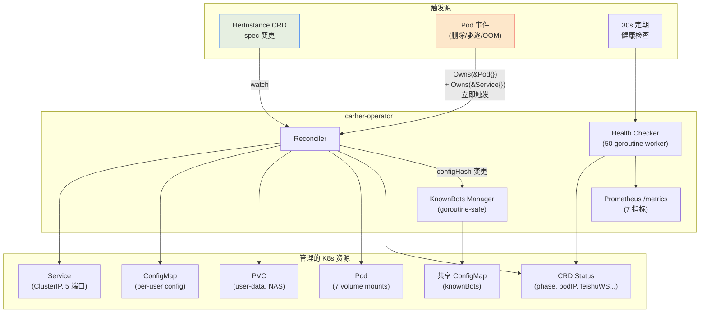
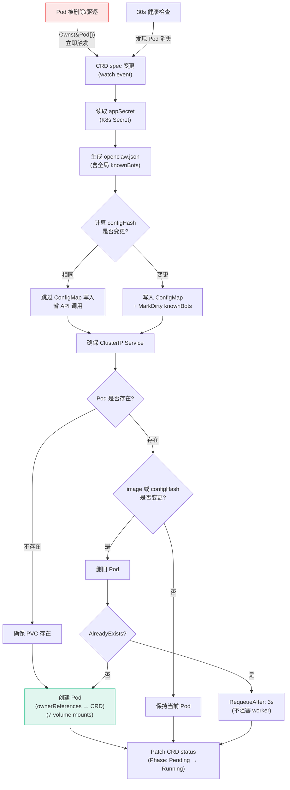
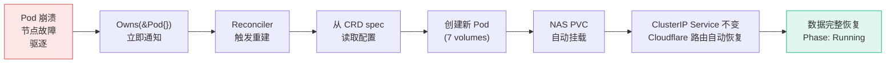
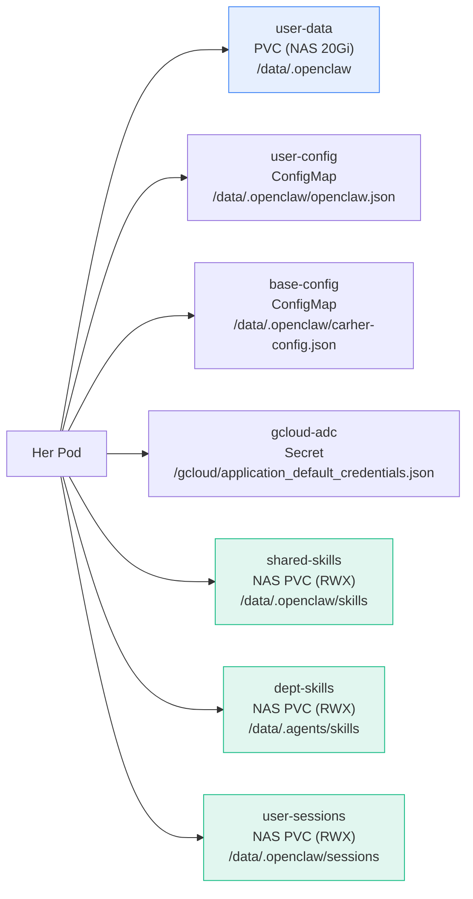
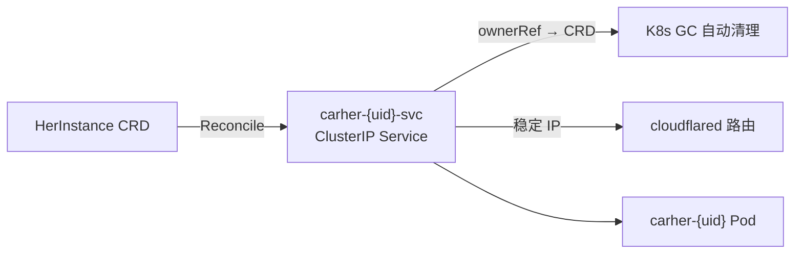
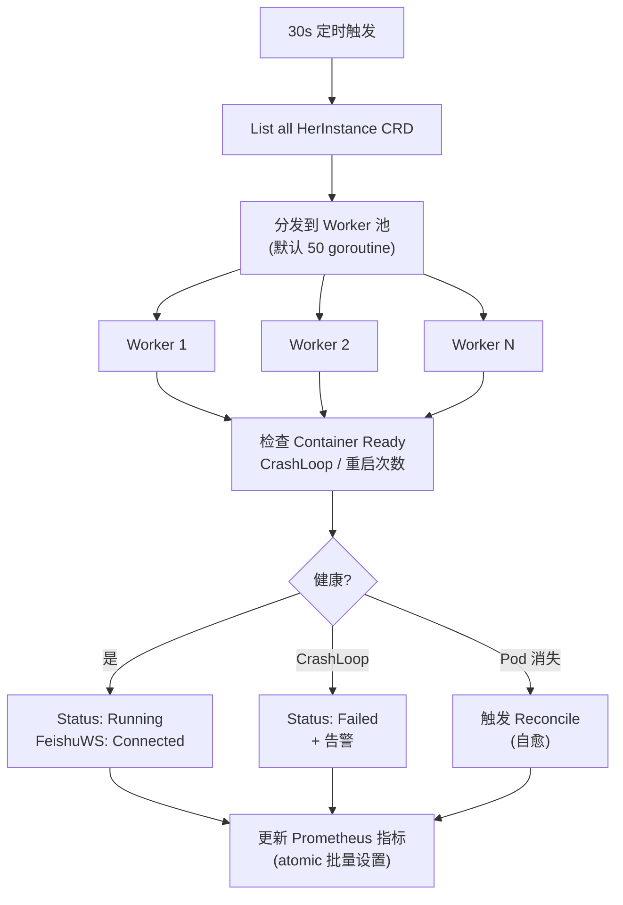
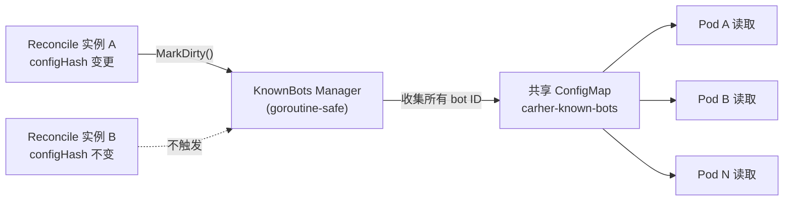
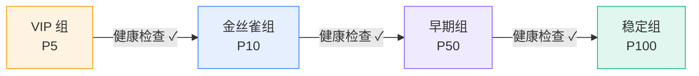

# CarHer Operator (Go)

Kubernetes Operator for managing 500+ CarHer instances with self-healing, concurrent health checks, and Prometheus metrics.

## Why Go (not Python kopf)

| | kopf (Python) | Go (controller-runtime) |
|--|---------------|------------------------|
| 500 实例健康检查 | 250 min/轮 (串行) | **10 sec/轮 (50 并发)** |
| 内存 | ~200 MB | ~30 MB |
| 并发 reconcile | 单线程 | 多 goroutine |
| Leader election | 无 | 内置 |
| 类型安全 | dict | struct |
| 社区 | 小 | CNCF 标准 |

## 核心架构



## Reconcile 流程



### 关键优化 (R1–R6)

- **Owns(&corev1.Pod{}) + Owns(&corev1.Service{})**: Pod/Service 变更立即触发 reconcile
- **ownerReferences**: Pod + Service 关联到 CRD，K8s GC 自动清理
- **ensureService**: 每实例自动创建 ClusterIP Service (5 端口)，Cloudflare 路由不再依赖 Pod IP
- **ConfigMap hash 跳过**: `configHash` 相同时不写 ConfigMap，500 实例省 500 次 API 调用/轮
- **knownBots 按需重建**: 仅 `configHash` 变更时 `MarkDirty()`，不每次 reconcile 重建
- **resolveImage / resolvePrefix**: 统一默认值处理，消除空值比较导致的无限 Pod 重建循环
- **RequeueAfter**: Pod 重建不再 `time.Sleep(2s)` 阻塞 worker，改为 `AlreadyExists` 时 requeue
- **Status Patch**: 使用 `client.MergeFrom` + `Status().Patch()` 替代 `Update`，减少 conflict
- **指标清理**: 实例删除时移除 Prometheus label，防止基数膨胀
- **SelfHealTotal 去重**: 仅 Phase ≠ Pending 时首次计数，不每轮重复递增

## Self-Healing



双重机制确保秒级自愈：

1. **事件驱动** (`Owns(&Pod{})`): Pod 被删除/驱逐 → 立即触发 reconcile → 重建 Pod
2. **定期巡检** (30s 健康检查): 兜底发现异常

- Pod 消失 → 自动重建（所有 NAS volume 完整恢复）
- CrashLoopBackOff → 标记 Failed + 告警
- Container not Ready → 标记 Disconnected
- `SelfHealTotal` 仅在 Phase 从非 Pending 转换时计数

## Pod Volume 架构



所有共享 PVC 统一使用 `alibabacloud-cnfs-nas` StorageClass，确保 Pod 无论调度到哪个节点都能读到完整数据。

## ClusterIP Service

Operator 为每个 HerInstance 自动创建 ClusterIP Service，提供稳定的内部网络端点：



| 端口 | 名称 | 用途 |
|------|------|------|
| 18789 | gateway | OpenClaw Gateway |
| 18790 | realtime | 实时语音 |
| 8000 | frontend | Web 前端 |
| 8080 | ws-proxy | WebSocket 代理 |
| 18891 | oauth | Feishu OAuth 回调 |

Pod 重建时 Service ClusterIP 保持不变，Cloudflare Tunnel 路由零中断。

## Health Checker



- **可配 worker 并发池**: 默认 50 worker，可通过 `HEALTH_CHECK_WORKERS` 调整
- **Status Patch**: `client.MergeFrom` + `Status().Patch()`，减少 conflict
- **Metrics 准确性**: 每轮 atomic 收集后一次性设置 `InstancesTotal`，不 `Reset()` 造成零值间隙

## knownBots 中心化



- **按需重建**: 仅当 `configHash` 变更时 `MarkDirty()`
- **错误处理**: ConfigMap Create/Update 失败时记录日志并标记重试
- 消除 O(N²) 问题

## Prometheus Metrics

| 指标 | 说明 |
|------|------|
| `carher_instances_total` | 按 phase + deploy_group |
| `carher_feishu_ws_connected` | 飞书 WS 状态 (0/1) |
| `carher_pod_restarts` | Pod 重启次数 |
| `carher_reconcile_duration_seconds` | reconcile 耗时 |
| `carher_health_check_duration_seconds` | 健康检查周期耗时 |
| `carher_known_bots_total` | knownBots 总数 |
| `carher_self_heal_total` | 自愈次数 (仅状态转换时计数) |

## 项目结构

```
operator-go/
├── api/v1alpha1/
│   └── types.go              # CRD 类型 + DeepCopy
├── internal/
│   ├── controller/
│   │   ├── reconciler.go     # Owns(Pod+Service) + ensureService + hash 跳过
│   │   ├── health.go         # 可配 worker 池 + SelfHeal 去重
│   │   ├── known_bots.go     # goroutine-safe + 按需重建
│   │   ├── config_gen.go     # openclaw.json 生成
│   │   └── config_gen_test.go
│   └── metrics/
│       └── metrics.go        # 7 个 Prometheus 指标
├── cmd/
│   └── main.go               # metricsserver.Options + leader election
├── Dockerfile                 # 缓存优化 + -ldflags -s -w
├── go.mod / go.sum
└── README.md
```

## 构建

```bash
# Docker (推荐)
docker build -t carher-operator:latest .

# 本地 (需要 Go 1.23+)
go mod tidy
go build -o operator ./cmd/main.go
```

## 部署

```bash
# 1. 安装 CRD + 共享 PVC
kubectl apply -f ../k8s/crd.yaml
kubectl apply -f ../k8s/shared-pvcs.yaml

# 2. 部署 operator
kubectl apply -f ../k8s/operator-rbac.yaml
kubectl apply -f ../k8s/operator-deployment.yaml

# 3. Prometheus 监控
kubectl apply -f ../k8s/servicemonitor.yaml

# 验证
kubectl get pods -n carher -l app=carher-operator
kubectl logs -n carher -l app=carher-operator -f

# 查看 metrics
kubectl port-forward -n carher svc/carher-operator-metrics 8080:8080
curl http://localhost:8080/metrics | grep carher_
```

## 测试

```bash
go test ./internal/controller/ -v
```

## HerInstance CRD 示例

```yaml
apiVersion: carher.io/v1alpha1
kind: HerInstance
metadata:
  name: her-14
  namespace: carher
spec:
  userId: 14
  name: "张三"
  model: gpt
  appId: cli_xxx
  appSecretRef: carher-14-secret
  prefix: s3
  owner: "ou_abc|ou_def"
  provider: openrouter
  botOpenId: ou_bot123
  deployGroup: canary
  image: v20260328
  paused: false
status:
  phase: Running
  podIP: "10.0.1.50"
  node: "cn-hongkong.10.0.1.226"
  restarts: 0
  feishuWS: Connected
  memoryDB: true
  lastHealthCheck: "2026-03-28T16:00:00Z"
  configHash: "a1b2c3d4e5f6"
```

## 常用 kubectl 命令

```bash
# 列出所有实例
kubectl get her -n carher

# 查看详情
kubectl describe her her-14 -n carher

# 更新镜像 (operator 自动重建 Pod)
kubectl patch her her-14 -n carher --type merge -p '{"spec":{"image":"v20260329"}}'

# 暂停 / 恢复
kubectl patch her her-14 -n carher --type merge -p '{"spec":{"paused":true}}'
kubectl patch her her-14 -n carher --type merge -p '{"spec":{"paused":false}}'

# 移动到自定义灰度组
kubectl patch her her-14 -n carher --type merge -p '{"spec":{"deployGroup":"vip"}}'

# 删除实例 (PVC 保留)
kubectl delete her her-14 -n carher

# 批量查看状态
kubectl get her -n carher -o wide
kubectl get her -n carher -o json | jq '.items[] | {name: .metadata.name, phase: .status.phase, ws: .status.feishuWS, group: .spec.deployGroup}'
```

## 灰度分组



`deployGroup` 支持任意自定义名称。部署编排器按 priority 从小到大逐组部署。分组的 priority 由 Admin Dashboard 的 `deploy_groups` 表管理，Operator 本身不关心分组语义，只负责维护 Pod 生命周期。
